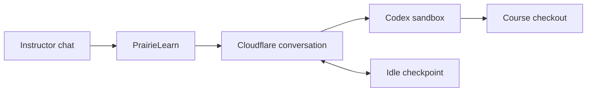
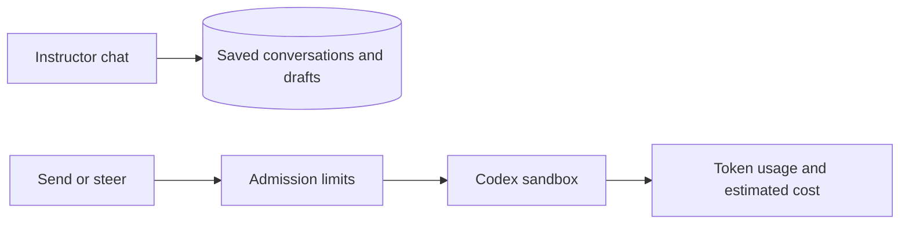

# Course agent

A feature-gated instructor chat that runs Codex in a course checkout. Course owners
can ask questions, edit files in the sandbox, steer a running turn, and stop it.



## Scope

- Saved conversations, selection, and unsent drafts across navigation and reloads.
- Token/cost statistics and request limits; conversation repository/branch changes require a new conversation.
- Sandbox file edits only: no approval, GitHub publication, or Course Sync.
- No skill installation or management.

## Local setup

Start from the repository root. Install dependencies and build after switching
branches; keep Docker running for the real sandbox.

```sh
make deps
make start-support
```

Choose a runtime:

| Runtime      | Start in a separate terminal                           | What to expect                                                                                |
| ------------ | ------------------------------------------------------ | --------------------------------------------------------------------------------------------- |
| Fixture      | `pnpm --filter @prairielearn/course-agent dev:fixture` | Port 8791. Scripted responses; no Docker, credentials, or GitHub writes.                      |
| Real sandbox | `pnpm --filter @prairielearn/course-agent dev`         | Port 8790. Codex clones and works in your course repository. Requires Docker and credentials. |

Configure PrairieLearn in `config.json`:

```json
{
  "isEnterprise": true,
  "features": { "course-agent": true },
  "courseAgent": {
    "workerUrl": "http://localhost:8791",
    "serviceToken": "local-fixture-service-token-not-a-secret"
  }
}
```

Then start PL in another terminal:

```sh
pnpm --filter @prairielearn/prairielearn dev
```

Sign in as a **course owner** and open a non-example course. For the fixture, set
the course repository to `https://github.com/example/course` and branch to `main`.
For the real sandbox, use the course's actual GitHub repository and branch.

For real execution, copy `.dev.vars.example` to `.dev.vars` and fill in
`PL_SERVICE_TOKEN`, `CODEX_MODEL`, `CODEX_API_KEY`, and `GITHUB_CLIENT_TOKEN`.
The service token must match PL's and contain at least 32 characters. Set PL's
`workerUrl` to `http://localhost:8790`. Keep credentials untracked; local R2
emulation does not require remote R2 keys. `wrangler.local.jsonc` is for local
sandbox development.

## Try it in the browser

1. Open the stars button and send “Read infoCourse.json and summarize this course.”
2. Send a correction while the response streams, then try **Stop**.
3. With the real sandbox, ask it to edit a scratch file and read it back.
4. Reload or navigate to another course page: the conversation should remain.
   Create a second conversation, leave a draft, and switch back to check both are retained.
5. Leave a completed turn idle for over 10 minutes, then follow up without
   reloading. The sandbox should restore its files from a checkpoint.

The stars button stays visible but disabled when its connection token is missing;
hover or focus it for an explanation. Failed tools stay collapsed until opened.

## Troubleshooting

- **Port already in use:** stop the earlier PL/Worker instance before starting another.
- **Cannot send:** check owner access, the feature flag, course repository/branch,
  and the matching service token. A changed repository or branch requires a new conversation.
- **Recovery failed:** use **Retry cleanup** if offered. An unavailable checkpoint
  requires a new conversation.

The fixture covers chat and recovery behavior. Real model inference, Docker
networking, and GitHub access need the real-sandbox path. To run focused checks:

```sh
pnpm --filter @prairielearn/course-agent test
pnpm --filter @prairielearn/course-agent test:lifecycle
```

Lifecycle tests need the fixture running. The optional `demo` command sends one
scripted prompt; the browser is the interactive test path.

## Saved conversations and usage



Open **Statistics** after a turn; usage should not double-count after reload.
Defaults allow two active requests per user, five per course, 30 requests per
hour, and a $20 daily estimate limit per user and per course. These limit new
requests; they do not cap one turn's eventual cost.

For the fixture, add pricing to PL's `courseAgent` settings:

```json
{ "pricing": { "fixture-model": { "input": 0, "cachedInput": 0, "cacheWrite": 0, "output": 0 } } }
```

Real model prices are per million tokens; overrides must include `input`, `cachedInput`, `cacheWrite`, and `output` rates. Unknown pricing or unconfirmed usage
blocks new work until configured or reconciled. Disabling `course-agent` blocks
new messages and conversations while preserving history, Stop, and cleanup.
