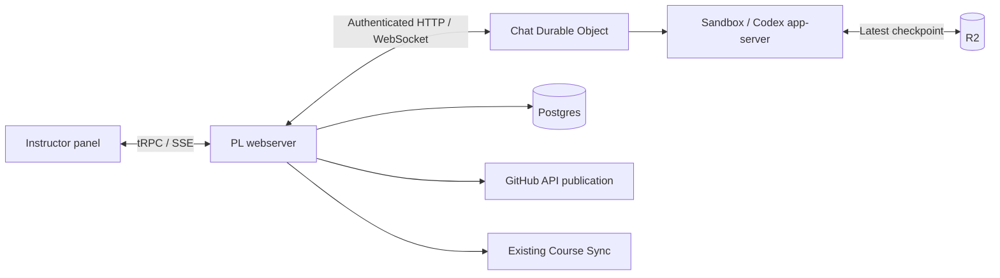

# Course agent

Integration draft for [Course agent MVP](https://github.com/PrairieLearn/PrairieLearn/issues/15871).
The selected [prototype stack](https://github.com/miguelaenlle/cloudflare-agents-sdk-test/pull/21)
is the architectural reference for the native Codex adapter and sandbox lifecycle.
PL supplies the catalog, authorization, durable proposals, publication, and Course Sync.
A **proposal** is the immutable captured code change; **approval** is the instructor's decision;
**publication** writes the approved change to GitHub before Course Sync. `push_sync` is the
protocol tool name, presented to instructors as a code change request.

## Ownership



- `src/agent.ts`: conversation history, generic pending tools, native execution, cleanup alarms.
- `src/codex*.ts`, `src/app-server.ts`: the pinned Codex protocol and AI SDK stream adapter.
- `src/outbound.ts`, `src/sandbox.ts`: the shared GitHub client token restricted to authorized repository reads, and model credentials outside the sandbox.
- `apps/prairielearn/src/ee/lib/course-agent`: PL authorization, event subscriptions, proposal completion, GitHub publication, and usage.
- `apps/prairielearn/src/models/course-agent-*`: Postgres entities. Decisions and their audit events commit together.
- `packages/course-agent-contract`: private transport types, with no standalone database or prototype server.

## Local development

First follow the normal PL local setup, including Postgres, Redis, Python, and `pnpm install`.
Build workspace packages with `make build` when needed. Nothing is enabled by default.

### Deterministic sandbox fixture

Run this alongside the PL development server:

```sh
pnpm --filter @prairielearn/course-agent dev:fixture
```

This runs the real Chat Durable Object in local workerd on port 8791. It replaces only
sandbox execution and Codex responses. It does not call a model or publish to GitHub.
The fixture supports `example/course` on `main`. Its predictable responses finish in eight seconds.
Test-only controls live under the fixture entry point and are absent from the production Worker.

A PL development config can opt in with:

```json
{
  "isEnterprise": true,
  "redisUrl": "redis://localhost:6379",
  "features": { "course-agent": true },
  "courseAgent": {
    "workerUrl": "http://localhost:8791",
    "serviceToken": "local-fixture-service-token-not-a-secret",
    "pricing": { "fixture-model": { "input": 0, "cachedInput": 0, "output": 0 } }
  }
}
```

Use an editable, non-example course whose repository is `https://github.com/example/course.git`
and branch is `main`; the authenticated and effective users must both be course owners.
The browser test creates an isolated copy of PL's existing test course and configures this automatically.
Keep `githubClientToken` unset in the fixture config.

```sh
# Portable protocol, capture, outbound, and host-tool tests
pnpm --filter @prairielearn/course-agent test

# With dev:fixture running
pnpm --filter @prairielearn/course-agent test:lifecycle
COURSE_AGENT_FIXTURE_URL=http://localhost:8791 pnpm --filter @prairielearn/prairielearn test:e2e courseAgent.spec.ts --workers=1

# PL persistence, approvals, accounting, and mocked GitHub publication
pnpm test apps/prairielearn/src/tests/courseAgent.test.ts apps/prairielearn/src/ee/lib/course-agent/publish.test.ts
```

### Real local sandbox

Docker must be running. Copy `.dev.vars.example` to `.dev.vars` in this directory,
set a shared service token, a model, a model API key, and `GITHUB_CLIENT_TOKEN`.
Use the same GitHub token as PL's existing `githubClientToken` setting. PL and the Worker are separate
processes, so configure the value in both places; PL does not send it through conversation configuration.
No per-repository token mapping is needed. The trusted outbound handler restricts sandbox access to
read-only Git operations on the authorized course repository, even if the token can write other repositories.
Run `pnpm --filter @prairielearn/course-agent dev` and use port 8790 in PL's configuration.
Set PL's course repository and branch normally; the browser cannot choose the sandbox repository.
Test with a disposable course repository you intend to modify.
PL uses `config.githubClientToken` to validate proposals and publish approved changes through GitHub APIs;
only the existing Course Sync operation accesses PL's normal course checkout.

Prices default to PL’s shared `costPerMillionTokens` configuration, using the exact model name.
The inference proxy enforces this exact model and removes provider-hosted tools, allowing only
function/custom tools that execute through Codex. Optional `courseAgent.pricing` overrides use dollars per million tokens, e.g.
`"pricing": { "your-model": { "input": 1, "cachedInput": 0.1, "output": 5 } }`.
These numbers illustrate the config shape; supply current prices for the chosen model.
Unreported usage and unpriced models display **Unknown**. Estimated costs exclude Cloudflare,
R2, and other infrastructure charges. Admission limits use reported estimated model cost,
request counts, and active conversations; they are not a hard cap on provider invoices.
Use provider-side spending controls as well before a pilot. PL requires a configured price for the
Worker's exact `CODEX_MODEL` before starting work, and pauses new admissions when completed usage
has an unknown cost. Default limits are two active conversations per user, five per course,
30 requests per user per hour, and $20 in known estimates per day.
Production PL configuration requires `githubClientToken` at boot; the local fixture remains token-free.

## Recovery

| Situation                           | Behavior                                                                                                                                                                                                                                       |
| ----------------------------------- | ---------------------------------------------------------------------------------------------------------------------------------------------------------------------------------------------------------------------------------------------- |
| Browser closes or changes pages     | Native work continues; PL keeps a host-tool/accounting observer. Reopening observes the existing stream.                                                                                                                                       |
| Steering acknowledgment lost        | Keep a durable receipt and reconcile the native message ID on retry; do not submit uncertain steering twice.                                                                                                                                   |
| Webserver exits                     | DO history and lifecycle survive. The next authorized connection reattaches; admission reconciles active execution receipts.                                                                                                                   |
| Ten minutes waiting for a user/tool | Checkpoint the workspace, then destroy the sandbox. One latest checkpoint is retained per conversation, with the SDK’s seven-day TTL.                                                                                                          |
| Backup or destruction fails         | Three total cleanup attempts, 30 seconds apart. Then show the stage and require **Retry cleanup**.                                                                                                                                             |
| Six hours without user interaction  | Interrupt and destroy; preserve a visible warning if the final checkpoint failed.                                                                                                                                                              |
| Checkpoint missing/expired          | Preserve the failure and saved PL decision; require a new conversation rather than silently creating a replacement thread.                                                                                                                     |
| Proposal preparation fails          | Permanent validation/access failures return a failed native tool result. Temporary GitHub or database failures retain the proposal and expose **Retry preparation**. Only validated proposals expose an approval card.                         |
| Approval after shutdown             | Save the decision and outcome in Postgres. Restore the checkpoint and send a hidden continuation; a warm call receives its native tool result.                                                                                                 |
| GitHub response lost                | **Retry completion** checks branch history, parent, and full tree before attempting another write.                                                                                                                                             |
| Branch moved                        | Reject the stale proposal without force-pushing. Prepare a new proposal.                                                                                                                                                                       |
| Course Sync fails                   | Temporary failures retain publication and permit **Retry completion**. Validation failures retain publication and return bounded diagnostics to Codex; correct the course and submit a new proposal. Newer commits are never overwritten.      |
| Sync webserver dies                 | The continuation lives in the webserver process. After a restart, PL's abandoned-job handling marks the job failed; the panel then exposes **Retry completion** to resume from the saved publication. A running job shows **Syncing course…**. |
| Result delivery fails               | Keep the same outcome and operation ID. Preparation errors retry on reconnect; completion retries do not repeat publication, a confirmed rollback, or successful sync.                                                                         |
| Feature disabled                    | Reject new conversations/messages; existing authorized history and recovery remain available while integration config is retained.                                                                                                             |

Admission retries recheck capacity. Unanswered dispatches are reconciled after two minutes: the
Worker first durably rejects that dispatch token, so delayed copies cannot start after PL releases
its slot. A retry receives a new token. Usage snapshots update changed receipts in a batch;
unknown model prices remain unknown. Course-level feature grants use the authenticated user in
both the panel and server; disabling new work leaves recovery controls available.

Terminal receipts and rejected dispatch tokens are archived in the Chat DO's SQLite tables instead
of accumulating in broadcast state. The state keeps the latest 100 receipts and active runs; PL
requests older unaccounted receipts in batches. Archived fences do not expire, so delayed requests
cannot become executable after compaction. An unreachable conversation keeps its admission slot,
but other conversations can still start within the remaining capacity.

The daily cost limit applies to known estimates across this user's conversations and other owners'
conversations in the current course. It is a soft usage guard: unreported or unpriced usage cannot
enforce a hard spending cap. Configure a price for the deployed `CODEX_MODEL` before enabling a pilot.

CI starts the deterministic fixture for the Worker lifecycle and course-agent browser tests.

Only ordinary UTF-8 files are supported, with a 256 KiB proposal limit and at most 100 files.
Executable files, symlinks, submodules, `.git`, and `.github` changes are rejected.
The displayed diff is rebuilt from trusted base blobs and the exact saved file contents.

## Deployment boundary

This draft does not provision or deploy a Cloudflare account. `wrangler.jsonc` is for local development;
it is not the production account configuration. Production provisioning belongs in sysconf/Terraform:
Worker, Chat/Sandbox SQLite Durable Objects and migrations, pinned container image, private service
credential, R2 binding and backup credentials, environment-scoped secrets, and capacity limits.
Set `LOCAL_DEV` to false outside local development. Keep account IDs, tokens, and bucket credentials
out of Git. Coordinate the private contract version when deploying PL and the Worker.

Before enabling a pilot, validate a deployed Worker and R2 backup/restore, repository-specific
credentials and rotation, a small model canary, real GitHub publication and Course Sync, revocation,
multiple PL webservers, and deployment during pending approval. The automated fixtures establish
local behavior, not production readiness.

Codex is pinned to `0.155.0`, Sandbox SDK/image to `0.12.9`, Agents to `0.23.0`, and AIChatAgent to
`0.12.0`. To regenerate `src/protocol.ts`, point `CODEX_BINARY` at the matching Codex binary and run
`pnpm --filter @prairielearn/course-agent generate:protocol`; review the protocol diff and rerun tests.
