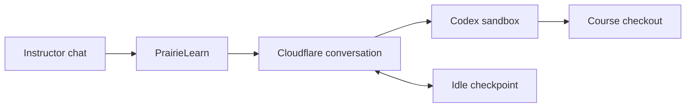
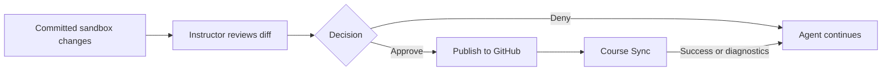

# Course agent

A feature-gated instructor chat that runs Codex in a course checkout. Course owners
can ask questions, edit files, steer or stop a turn, and review changes before publishing.



## Scope

- Saved conversations, selection, and unsent drafts across navigation and reloads.
- Repository/branch changes require a new conversation.
- Conversation token/cost totals and user-scoped hourly spending and concurrency limits.
- Review and approve committed text changes, publish to GitHub, then run Course Sync.
- Course Sync validates content; failures retain the commit for an approved correction. No automatic rollback.
- No skill installation or management.

## Local setup

Start from the repository root. Install dependencies and build after switching
branches; keep Docker running for the real sandbox.

```sh
make deps
make start-support
```

Choose a runtime:

| Runtime      | Start in a separate terminal                           | What to expect                                                                                |
| ------------ | ------------------------------------------------------ | --------------------------------------------------------------------------------------------- |
| Fixture      | `pnpm --filter @prairielearn/course-agent dev:fixture` | Port 8791. Scripted responses; no Docker, credentials, or GitHub writes.                      |
| Real sandbox | `pnpm --filter @prairielearn/course-agent dev`         | Port 8790. Codex clones and works in your course repository. Requires Docker and credentials. |

Configure PrairieLearn in `config.json`:

```json
{
  "isEnterprise": true,
  "features": { "course-agent": true },
  "nonVolatileRedisUrl": "redis://localhost:6379",
  "courseAgent": {
    "workerUrl": "http://localhost:8791",
    "serviceToken": "local-fixture-service-token-not-a-secret",
    "maxConcurrentPerUser": 2,
    "hourlyCostLimit": 10
  }
}
```

Then start PL in another terminal:

```sh
pnpm --filter @prairielearn/prairielearn dev
```

Sign in as a **course owner** and open a non-example course. For the fixture, set
the course repository to `https://github.com/example/course` and branch to `main`.
For the real sandbox, use the course's actual GitHub repository and branch.

For real execution, copy `.dev.vars.example` to `.dev.vars` and fill in
`PL_SERVICE_TOKEN`, `CODEX_MODEL`, `CODEX_API_KEY`, and `GITHUB_CLIENT_TOKEN`.
The service token must match PL's and contain at least 32 characters. Set PL's
`workerUrl` to `http://localhost:8790`. Keep credentials untracked; local R2
emulation does not require remote R2 keys. `wrangler.local.jsonc` is for local
sandbox development.

## Try it in the browser

1. Open the stars button and send “Read infoCourse.json and summarize this course.”
2. Send a correction while the response streams, then try **Stop**.
3. With the real sandbox, ask it to edit a scratch file and read it back.
4. Reload or navigate to another course page: the conversation should remain.
   Create a second conversation, leave a draft, and switch back to check both are retained.
5. Leave a completed turn idle for over 10 minutes, then follow up without
   reloading. The sandbox should restore its files from a checkpoint.

The stars button stays visible but disabled when its connection token is missing;
hover or focus it for an explanation. GitHub publishing also requires a PL-side token.
Failed tools stay collapsed until opened.

## Troubleshooting

- **Port already in use:** stop the earlier PL/Worker instance before starting another.
- **Cannot send:** check owner access, the feature flag, course repository/branch,
  and the matching service token. A changed repository or branch requires a new conversation.
- **Recovery failed:** use **Retry cleanup** if offered. An unavailable checkpoint
  requires a new conversation.

Closing the panel detaches PL's live connection. A running Codex turn continues
in Cloudflare, but host-executed tools require an open panel. No PL observer or
polling task stays behind. Completed work becomes visible on reconnect; a reload
reopens the saved conversation. A `push_sync` request captures its files and
approval gate in Cloudflare even if PL is disconnected. Reopening prepares that
retained request for review. After approval, publication and Course Sync finish
without requiring the browser to remain open.

The fixture covers chat and recovery behavior. Real model inference, Docker
networking, and GitHub access need the real-sandbox path. To run focused checks:

```sh
pnpm --filter @prairielearn/course-agent test
pnpm --filter @prairielearn/course-agent test:lifecycle
```

Lifecycle tests need the fixture running. The optional `demo` command sends one
scripted prompt; the browser is the interactive test path.

## Saved conversations

Conversation selection and panel state survive navigation. Unsent drafts and read
markers are kept in the browser. The catalog shows the last observed running and
completed state; reconnecting refreshes it from Cloudflare. No background polling
runs after leaving the panel.

Disabling `course-agent` blocks new messages and conversations while preserving
history, Stop, and cleanup.

## Review and publish



For the fixture, add `"githubClientToken": "fixture-no-github-network"` to PL's
config. It shows scripted approval states without writing to GitHub.

For real publication, configure PL's **`githubClientToken`** with write access to
a disposable course repository. This is separate from the Worker's read token.
Without it, the stars button is disabled and its tooltip explains why.

1. Ask the agent to make a small change, commit it, and call `push_sync`.
2. Open **View changes**, inspect the diff, and **Deny** once: nothing should publish.
3. Request another change and **Approve**. Expect **Publishing…**, then **Syncing course…**,
   a GitHub commit, and the updated course in PL.
4. Repeat after over 10 idle minutes: approval should recover the sandbox without
   flashing **Retry completion** during normal progress.
5. Approve invalid course content. Expect the GitHub commit to remain and Course
   Sync diagnostics to reach the agent; request and approve a correction.

A PL restart during Course Sync requires **Retry completion**. Retrying uses saved
publication receipts; automatic restart continuation is outside this MVP.

For fixture review coverage, with the fixture running:

```sh
COURSE_AGENT_FIXTURE_URL=http://localhost:8791 pnpm --filter @prairielearn/prairielearn test:e2e src/tests/e2e/courseAgent.spec.ts
```

## Usage and limits

Open **Statistics** to see cumulative tokens and estimated cost. Prices come from
PL's shared `costPerMillionTokens` configuration, and the conversation retains
its original rates. There are no per-message billing rows.

PL records usage while the selected conversation is connected and reconciles the
user's unobserved work before admitting another message or cold continuation.
Closing the panel leaves no accounting watcher or polling task in PL. A disconnected
turn can temporarily outpace the stored estimate.

Redis applies newly observed spending to that user's current fixed hour across
courses. Watermarks survive hour boundaries, so replaying a snapshot is free;
a delta observed after reconnect counts in the reconnect hour. This is admission
accounting, not exact historical hourly billing. Non-volatile Redis is required;
missing usage, prices, or unavailable accounting blocks new work.

Defaults allow two active conversations per user and $10 of estimated usage per
hour. Steering shares its conversation's slot. Already-running turns finish even
if they exceed the threshold; it is a soft guard, not a hard spending cap.

To test locally, send a fixture prompt, open Statistics, then reload: totals
should remain unchanged. Temporarily set `hourlyCostLimit` below the displayed
cost and try another message: it should be blocked without stopping work already
in flight. Restore the setting afterwards. The fixture uses a priced model name
with scripted usage and performs no inference.
