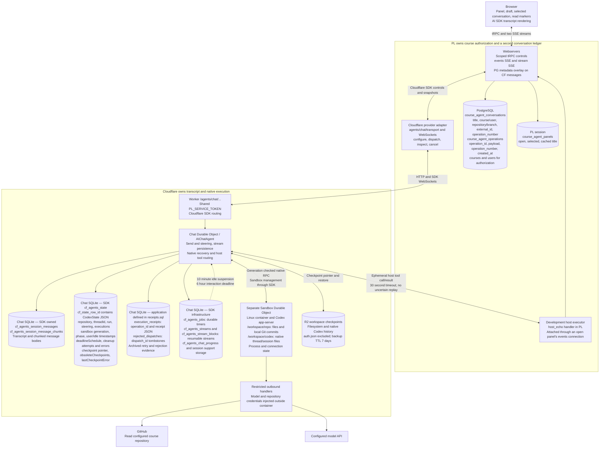
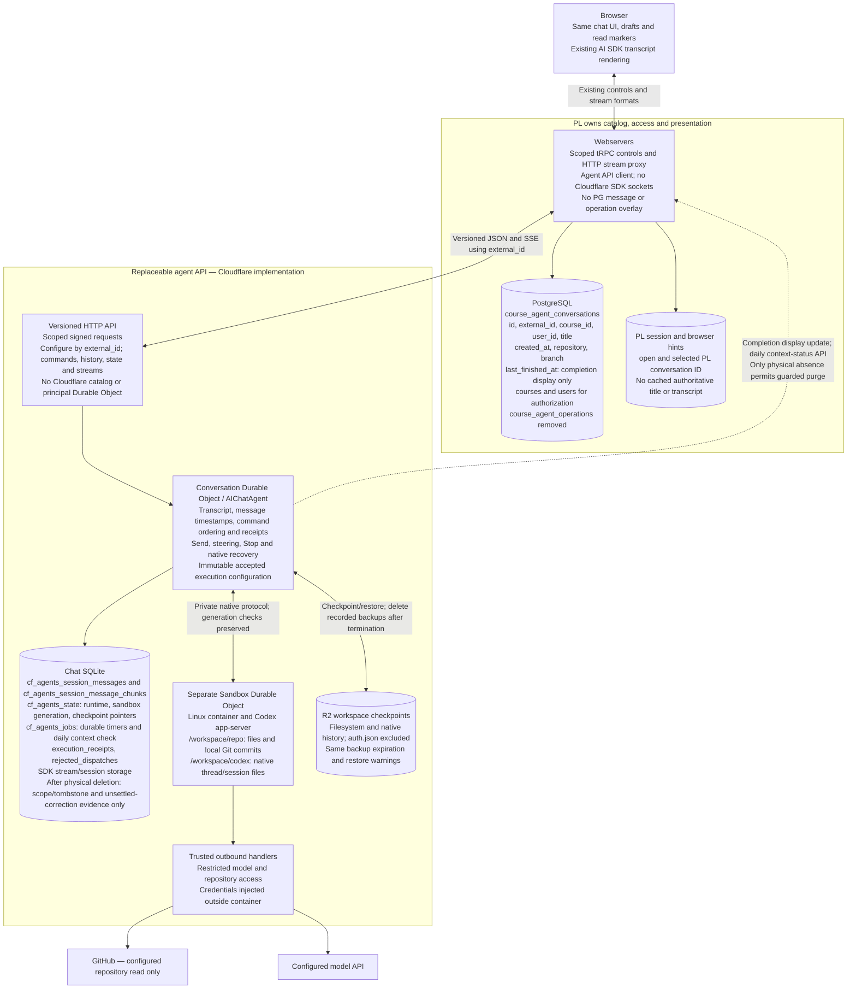
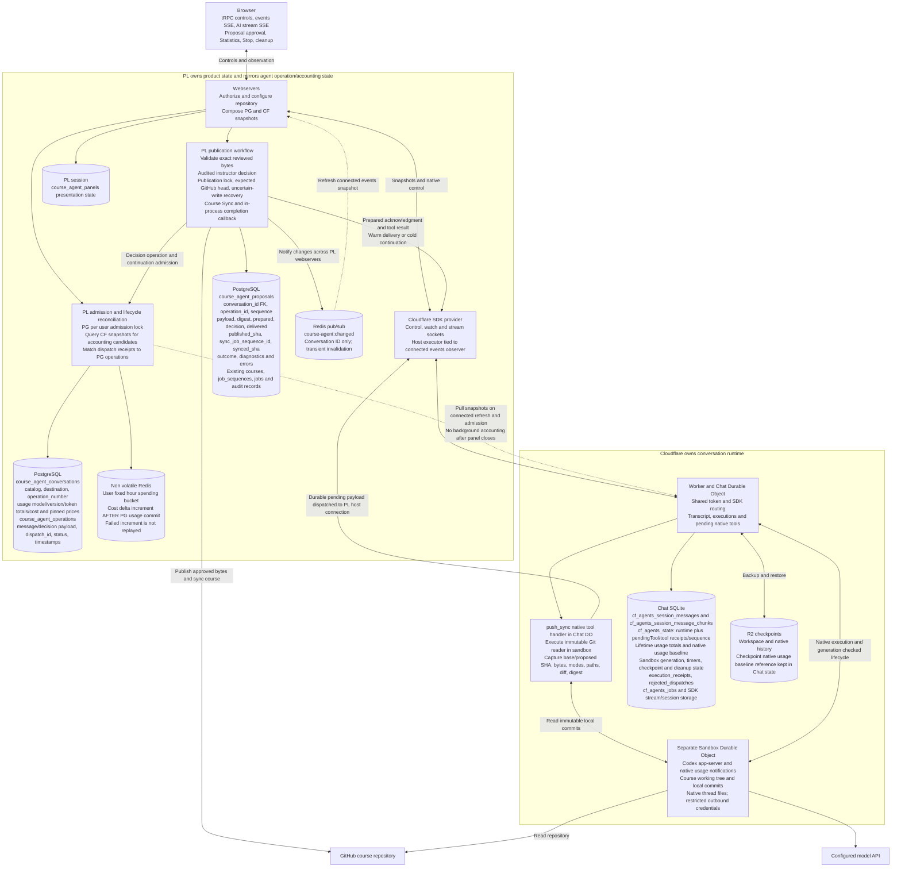
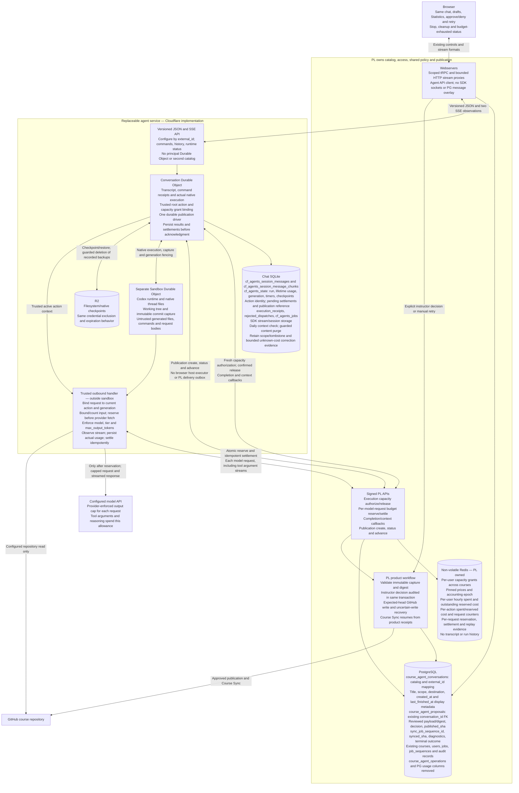

# Course agent

PrairieLearn owns the conversation catalog, authorization, shared spending policy, reviewed proposals, GitHub publication and Course Sync. The agent service owns all transcript and native execution state behind signed JSON/SSE APIs. Cloudflare is the current implementation of that API. There is no principal Durable Object or remote conversation catalog.

This implementation replaces the integration through PR 15936, based on commit `6a25ed331cdf1ecd6f8711ed5ca845357004eb61`. The before diagrams describe the pinned PR stack; the after diagrams describe this branch. Physical-deletion cleanup confirms catalog absence, stops execution and settles costs before purging conversation-owned history and checkpoints.

## PR 2: runtime ownership before and after

Subgraphs identify owners; cylinders are persistent stores. Solid arrows carry requests/data; dashed arrows carry observation or recovery. Each conversation's SQLite database belongs to that Chat Durable Object. It is not an independent database shared with another DO. Application SQLite DDL is in `src/receipts.sql`; the other SQLite tables are created by the pinned Cloudflare SDK.

### Before



### After



The PL conversation ID remains numeric; `external_id` is its stable API resource ID. PL writes its catalog row first and lazily configures that same remote resource. A failed configuration response does not create another conversation. The SDK sockets and native Codex protocol remain private to Cloudflare.

## PR 5: publication and cost controls before and after

### Before



### After



## Persistent state and coupling

| Owner/store                 | Actual table or key                                                                                  | State                                                                                                                                                                                                                                                                                     |
| --------------------------- | ---------------------------------------------------------------------------------------------------- | ----------------------------------------------------------------------------------------------------------------------------------------------------------------------------------------------------------------------------------------------------------------------------------------- |
| PL PostgreSQL               | `course_agent_conversations`                                                                         | `id`, `external_id`, `course_id`, `user_id`, `title`, `created_at`, immutable `repository`/`branch`, monotonic `last_finished_at` display projection. No transcript, operation counter or usage ledger.                                                                                   |
| PL PostgreSQL               | `course_agent_proposals`                                                                             | `conversation_id` FK; globally unique native `operation_id`; reviewed bytes/modes/paths and digest; prepared state; audited decision; published SHA, Course Sync receipts, diagnostics and terminal outcome. One unfinished proposal per conversation. No sequence or delivery outbox.    |
| PL PostgreSQL               | `courses`, `users`, existing permission/audit/job tables                                             | Canonical product permissions, audit trail and Course Sync. Those workflows continue to use their existing owners.                                                                                                                                                                        |
| PL non-volatile Redis       | `{cacheKeyPrefix}course-agent:ledger`                                                                | Hash fields `epoch`, `server_run_id`, `user:{id}`. Per-user capacity grants, action cost, request escrow, pinned financial prices, immutable usage receipts and fixed-UTC-hour charges. No messages or native run history.                                                                |
| CF Chat SQLite, SDK         | `cf_agents_session_messages`, `cf_agents_session_message_chunks`                                     | Transcript and chunked message bodies, including user/tool/assistant history.                                                                                                                                                                                                             |
| CF Chat SQLite, SDK         | `cf_agents_state`                                                                                    | `cf_state_row_id` holds `CodexState`: scope/repository, revision, root action/grant, pending model settlement evidence, lifetime usage/display prices, publication reference, native thread/run, steering, sandbox generation/phase, timestamps, cleanup attempts and checkpoint pointer. |
| CF Chat SQLite, SDK         | `cf_agents_jobs`                                                                                     | Durable lifecycle, settlement and publication schedules.                                                                                                                                                                                                                                  |
| CF Chat SQLite, SDK         | `cf_agents_streams`, `cf_agents_stream_blocks`, `cf_agents_stream_chunks`, `cf_agents_chat_progress` | Resumable stream and SDK recovery infrastructure. SDK session support tables remain SDK-owned.                                                                                                                                                                                            |
| CF Chat SQLite, application | `execution_receipts`                                                                                 | `operation_id` and receipt JSON: command acceptance/digest/revision, original authorization binding and native outcome. A receipt is retry evidence; it is not a bill or a second message.                                                                                                |
| CF Chat SQLite, application | `rejected_dispatches`                                                                                | `dispatch_id` tombstones that prevent rejected/uncertain native dispatch identities from being silently replayed.                                                                                                                                                                         |
| CF Sandbox DO/container     | Filesystem and native processes                                                                      | `/workspace/repo`: working tree and immutable local commits; `/workspace/codex`: native Codex thread files.                                                                                                                                                                               |
| CF R2                       | Workspace backup objects                                                                             | Filesystem/native-history checkpoints; 7-day backup TTL; `auth.json` excluded. Chat SQLite owns the pointer, not R2 lifecycle decisions.                                                                                                                                                  |
| Browser/PL session          | Existing panel state                                                                                 | Selected numeric PL conversation ID, open panel, drafts and read markers. No authoritative title or transcript cache.                                                                                                                                                                     |

The remaining coupling is deliberate: signed IDs/scopes and JSON schemas; the immutable repository binding; the native `push_sync` capture contract; and PL policy/publication APIs. Replacing Cloudflare requires an implementation of these public contracts, not its SDK. Native checkpoint import/live execution handoff requires separate work.

Generation fencing means that a delayed callback for sandbox A cannot stop, checkpoint, mutate or charge sandbox B. Model egress additionally binds the active action and capacity-grant ID: a delayed request from an earlier turn cannot spend a newer turn's allowance even when the Linux container is reused.

## API contract

Runtime-validated schemas and signatures live in `packages/course-agent-contract/src/`. PL uses `ee/lib/course-agent/provider.ts`; the Worker facade uses `src/worker.ts`; callbacks enter PL's `ee/lib/course-agent/api.ts`. PL imports no Cloudflare SDK.

Every request is HMAC-SHA256 signed over version, audience, method, path/query, conversation/course/effective-user/authenticated-user scope, timestamp and raw body digest. Agent and PL audiences differ. The Worker and Chat DO each verify the original signed request. The acceptance window is 60 seconds; effects use immutable identities beyond that window. Production origins use HTTPS and redirects are rejected. API bodies are bounded at 3 MB.

### PL to agent

| Method/path                               | Behavior                                                                                                                                                                                                                           |
| ----------------------------------------- | ---------------------------------------------------------------------------------------------------------------------------------------------------------------------------------------------------------------------------------- |
| `GET /v1/capabilities`                    | Version, configured model and supported features.                                                                                                                                                                                  |
| `PUT /v1/conversations/{external_id}`     | Establish immutable scope/repository/branch; pin display prices. Identical retry succeeds; changed destination conflicts. No inference.                                                                                            |
| `GET .../snapshot?ids=[...]`              | Current service-owned history/state and optional bounded command-receipt lookup. At most 100 IDs. Unknown acceptance can be inspected without sending again.                                                                       |
| `POST .../messages`                       | `{id, expectedRevision, text}`. Preserve raw text. The same ID/text returns its saved acceptance; changed text conflicts. Revision is command order, not a usage/stream counter. Start versus steering is decided by native state. |
| `GET .../history?cursor=...&limit=100`    | Paginated history, at most 100 messages/page; opaque message-ID cursor. Missing cursor conflicts rather than returning unrelated history. PL's adapter validates and collects pages with a cycle/size bound.                       |
| `GET .../runtime` / `GET .../diagnostics` | Running/completion projection and public lifecycle phase, deadlines, warnings and cleanup availability. Private generations stay private.                                                                                          |
| `GET .../events`                          | Small JSON SSE invalidations; reconnect reads canonical state, so no second event-history database or cursor log is needed. Heartbeats and a 5-minute observation lifetime bound idle connections.                                 |
| `GET .../stream`                          | Persisted AI SDK UI-message chunks over SSE. Closing observation never means Stop.                                                                                                                                                 |
| `POST .../stop` / `POST .../cleanup`      | Stop or explicit cleanup retry, independent of spending permission.                                                                                                                                                                |
| `POST .../retention`                      | Asynchronously verify physical catalog absence and run guarded cleanup; 202 acknowledges the request. Present or indeterminate contexts preserve history.                                                                          |
| `GET .../export`                          | Versioned transcript, revision, usage and lifecycle snapshot. PL combines this with its scoped catalog.                                                                                                                            |

These routes consolidate the plan's commands/state/retry route names into the existing provider operations. Receipt lookup is part of `snapshot`; Stop is its own idempotent operation. The visible-status batch remains PL's bounded tRPC query: at most 20 IDs and four concurrent agent reads. There is no CF user-wide index. SSE invalidations carry no authoritative transition history; replay comes from saved snapshots/chunks.

Example accepted command:

```json
{
  "id": "6b1ee364-2cae-4669-ab32-af704929b2dc",
  "expectedRevision": 3,
  "text": "Update this question to support partial credit"
}
```

Acknowledgment: `{"revision":4}`. It proves acceptance, not successful inference. An uncertain native acceptance is reconciled from native/command evidence; the prompt is not blindly repeated.

### Agent to PL

All paths below use `/pl/api/course-automation/v1` and signed `pl-api` scope.

| POST path                 | Behavior                                                                                                                                                           |
| ------------------------- | ------------------------------------------------------------------------------------------------------------------------------------------------------------------ |
| `/context-status`         | Retained binding is present, soft-deleted, or physically absent. Revocation/outage is not physical absence. No deletion occurs here.                               |
| `/permissions`            | Fresh course-owner, feature and destination check before new privileged work.                                                                                      |
| `/execution/authorize`    | Atomic user-wide capacity grant bound to the original root action.                                                                                                 |
| `/execution/release`      | Idempotent release of that grant after terminal/fenced-unstarted evidence. A delayed release cannot free a newer continuation lease.                               |
| `/model/reserve`          | Atomic worst-case allowance against request/turn/hour budgets; pins financial prices and enforces output ceiling.                                                  |
| `/model/settle`           | Apply measured usage, conservative unknown maximum, or proven never-sent refund once. Conflicting usage receipts fail even if their dollar totals happen to match. |
| `/conversations/finished` | Monotonic completion display update. No native status/message mirror.                                                                                              |
| `/publications`           | Persist and validate immutable capture under native invocation ID.                                                                                                 |
| `/publications/status`    | Preparing, awaiting approval, working, complete or absent, with canonical saved result.                                                                            |
| `/publications/advance`   | Advance a saved instructor decision from GitHub/Course Sync receipts. Cannot approve for the instructor.                                                           |

Errors have `code`, `message`, `retryable` and `requestId`. Invalid requests/identities are permanent; outages are retryable; an unknown external effect remains unknown. Hourly refusals include `Retry-After`. Existing settlement/release receipts remain valid after access revocation. New work and new GitHub/Sync writes always recheck permission/feature state. Reading a completed Sync receipt may finish the saved product outcome with the feature off.

## Limits and financial authority

Defaults: two active conversations per user across courses; $10 per fixed UTC hour; $2 per root turn; $0.50 per model request; 30 minutes, 100 tool calls and 200 model requests per root. Dollar defaults are conservative implementation choices that require product confirmation before release. Configuration may lower the finite runtime/count ceilings.

The first accepted user-message ID is the root action. Steering, retries, checkpoint recovery and automatic tool-result continuation retain it. An explicit new user message after confirmed termination may start another root. An approval wait releases active capacity; a cold continuation gets a fresh capacity lease but retains the root's cost and expiry.

Before any paid fetch, a trusted outbound handler outside the container:

1. Checks current sandbox/action/grant binding and fresh PL access.
2. Rejects unbounded provider shapes and counts the exact inline input with the provider count endpoint.
3. Reserves worst-case input plus bounded output against all shared balances atomically.
4. Persists the one-dispatch evidence and enforces the granted `max_output_tokens`, configured model, default tier and `store:false`.
5. Observes provider usage, persists settlement evidence in CF, and retries settlement until acknowledged.

Reasoning and streamed tool arguments spend the output allowance; another model request must reserve again. Native/user cancellation is not evidence the provider did not bill. Unknown sent requests retain/charge their maximum; a later measured correction applies to the original charge hour. Outstanding escrow carries across hour boundaries. Settlement is the only financial write path: reading Statistics or native cumulative usage never charges.

Redis uses integer microdollars and pins rates per reservation. CF lifetime Statistics retain the conversation's first display quote; these are estimates, not a parallel financial ledger. Statistics labels retained/in-flight unconfirmed maximum cost separately. Fully settled known request receipts compact after seven days; unknown corrections retain their original charge hour while evidence exists. Outstanding reservations are never discarded or refunded by TTL. Closed actions/hour buckets compact only when no retained request needs them. Hard metadata limits refuse new work rather than silently dropping fences.

Missing epoch, changed Redis process identity, unavailable policy, invalid pricing or observed usage beyond its reserved maximum fail closed. Capacity is released only after confirmed native termination or an unstarted command fenced against late execution. Expiry fences future dispatch; it does not prove an old process stopped.

Transient callback failures retry durably. A permanent identity/configuration/receipt refusal pauses callbacks and further inference while preserving outstanding evidence. After correcting the cause, use **Retry usage reconciliation** (the existing maintenance API) to attempt reconciliation again.

## Publication without a browser executor

`push_sync` remains a native dynamic tool. The Chat DO reads immutable Git commits, captures SHA/bytes/modes/paths/diff/digest, and sends that raw capture to the PL publication API. No general raw shell result can replace those immutable reviewed bytes safely.

One durable CF driver creates, observes and advances the PL publication resource. PG owns instructor approval, expected-head GitHub writes, uncertain-write reconciliation and Course Sync receipts. CF drops its captured file blobs after PL accepts them and retains the invocation/reference. Native result/display is saved before continuation. The driver survives browser disconnect and uses durable schedules across eviction/restarts; PL does not retain a delivery outbox or process-only callback driver.

Publication observes every 30 seconds while pending; a 24-hour observation lease and three failed advances bound unattended retries. Saved product state remains after that lease; an authorized reconnect/manual retry can reopen observation. Permanent permission/configuration failures pause. A spent/expired root preserves the completed result and waits for an explicit later user message.

## Preserved behavior and deliberate changes

| Behavior                                                                                                                  | Result                                                                                                                                                     |
| ------------------------------------------------------------------------------------------------------------------------- | ---------------------------------------------------------------------------------------------------------------------------------------------------------- |
| Numeric catalog IDs, titles, drafts, navigation, selection and unread completion                                          | Preserved. PG serves catalog/ordinary page rendering without CF calls. Only an open panel polls bounded selected/visible runtime statuses.                 |
| Warm reuse, steering, Stop, stream replay, idle suspension, native recovery, R2 restore and cleanup retry                 | Preserved; generations and native uncertainty still fence retries.                                                                                         |
| Review exact bytes, approve/deny, publish, validate Course Sync, retain failed published commits and request correction   | Preserved. Fresh privileged writes remain gated.                                                                                                           |
| Publication/settlement with every panel closed or a PL observer lost                                                      | Improved; CF schedules drive saved product/accounting resources.                                                                                           |
| Accepted work always finishes after admission                                                                             | Changed. Request/turn limits can stop a turn; partial output/history and completed product results remain. No paid final explanation is required.          |
| Native compaction and remote images/files/provider-hosted tools                                                           | Paused/rejected until a real cost bound is proven. Compaction shows an explicit saved-history/export/new-conversation path, rather than silently spending. |
| Development `host_echo` executor; CF SDK sockets in PL; PG operations/usage columns; `course-agent:changed` Redis pub/sub | Removed. Product review overlays remain product state, not a second transcript. Generic PL job notifications remain.                                       |
| History during a CF outage                                                                                                | Unavailable; the PG catalog and saved proposals remain available. There is no second PG transcript.                                                        |
| Direct browser streaming; checkpoint import/native handoff; additional skills/tools                                       | Deferred until a concrete backend/product requirement exists. Export/reference HTTP compatibility are included now.                                        |
| Physical-deletion retention purge                                                                                         | Implemented with daily repair, termination/settlement prerequisites and a permanent replay tombstone. Soft deletion and outages preserve history.          |

## Physical deletion and retention

`POST /v1/conversations/{external_id}/retention` requests an asynchronous check, returning 202; every configured conversation also has one durable daily `checkRetention` schedule. PL's signed `/context-status` distinguishes a physically absent catalog row from soft deletion, permission revocation, conflicting scope and an unavailable database. Only physical absence starts cleanup. Current course deletion soft-deletes courses; it does not trigger transcript deletion. There is no invented hard-delete workflow: a future physical-deletion caller can use the API, and the daily check repairs a missed request or a PostgreSQL cascade.

Cleanup first saves a durable pending tombstone, fences Send/recovery/model dispatch, joins admitted controls and in-flight checkpoint work, and confirms sandbox destruction. It releases the original capacity grant and archived lost-ack grants in batches of 100, then acknowledges measured/unknown/not-sent model settlements. Failed destruction, permanent settlement errors or ambiguous acknowledgments preserve history and receipts. Explicit retention retry clears a repaired callback refusal; transient failures retry durably.

Only after these prerequisites does cleanup delete the R2 `backups/{id}/data.sqsh` and `backups/{id}/meta.json` objects referenced by this conversation's current/obsolete pointers. Each completed deletion is saved, so a partial R2 failure resumes without touching another conversation. The supported SDK session `clearMessages()` clears transcript chunks, compactions and attachments; `src/retention.sql` enumerates the remaining exact SDK/application content tables for the pinned SDK versions. Recovery KV prefixes `cf:chat:`, `cf:chat-recovery:` and `__cf_chat_turn_snapshot:` are deleted in bounded batches. Schedules are canceled through the SDK.

`cf_agents_state` retains only immutable scope, the completed tombstone and bounded unknown-cost correction evidence. The latter expires after the existing seven-day correction window; late measured settlement can correct cost without restoring execution or messages. Public history/configuration/Send return 410 after the tombstone. The DO schema and permanent fence remain so stale signed commands or native recovery cannot resurrect deleted history. Redis financial receipts retain their independent financial lifetime.

## Local setup

```sh
make deps
make start-support
pnpm --filter @prairielearn/course-agent dev:fixture
```

The fixture runs on port 8791 without Docker, paid model calls or GitHub writes. Use a non-example course owned by your user and set its repository to `https://github.com/example/course`, branch `main`. PL requires a publishing token even for its fixture UI; the fake value below makes no GitHub calls in the fixture path.

Example PL config (the epoch is deployment-specific):

```json
{
  "isEnterprise": true,
  "features": { "course-agent": true },
  "githubClientToken": "fixture-no-github-network",
  "nonVolatileRedisUrl": "redis://localhost:6379",
  "courseAgent": {
    "workerUrl": "http://localhost:8791",
    "serviceToken": "local-fixture-service-token-not-a-secret",
    "accountingEpoch": "fe9ae7ea-8d88-44e4-b3ea-e4aa1a75409e",
    "maxConcurrentPerUser": 2,
    "hourlyCostLimit": 10,
    "turnCostLimit": 2,
    "requestCostLimit": 0.5
  }
}
```

For real local execution, copy `.dev.vars.example` to untracked `.dev.vars` and set matching `PL_SERVICE_TOKEN`, `PL_API_ORIGIN`, `CODEX_MODEL`, `CODEX_API_KEY` and read-only `GITHUB_CLIENT_TOKEN`. Run `pnpm --filter @prairielearn/course-agent dev` with Docker and use port 8790 in PL. PL's publishing token is separate and requires write access to the disposable course repository.

Initialize only an empty ledger, using a config file containing the effective Redis URL/prefix/epoch:

```sh
pnpm --filter @prairielearn/prairielearn course-agent:init-accounting /absolute/path/to/config.json
pnpm --filter @prairielearn/prairielearn dev
```

The provisioning command refuses to alter an existing ledger. Never delete/reset the key to cure a refusal. After Redis restart/failover, quiesce all model writers, inspect surviving financial state and CF outstanding grant/request evidence, conservatively reconcile missing acknowledgments, then explicitly provision a reviewed accounting generation. This operator workflow must precede any reopening of inference.

For durable production admission, use a non-evicting Redis store whose acknowledged reservations survive the deployment's write-loss/failover model. Validate persistence and replication policy with the deployment owner; an epoch sentinel or process ID alone does not prove acknowledged-write durability. For self-managed single-node Redis, verify AOF persistence with `appendfsync always`, `maxmemory-policy noeviction`, recovery behavior and backup operations. A weaker store needs an equivalent acknowledged-write/durable recovery guarantee before enabling real inference.

Disabling the feature preserves authorized history, Stop, cleanup, existing settlement and saved completed publication outcomes. It blocks new messages, new model requests and new privileged publication/Sync writes.

## Validation and release

Focused validation uses real PG/Redis for product/accounting invariants, temporary Node HTTP servers for the provider contract, workerd for durable execution/receipt/recovery behavior, and browser tests for navigation/drafts/reconnect/keyboard/mobile behavior. The reference HTTP test implements the API independently of CF, including paginated history, export, controls and SSE.

```sh
pnpm --filter @prairielearn/course-agent test
pnpm --filter @prairielearn/course-agent test:lifecycle
pnpm test apps/prairielearn/src/tests/courseAgent.test.ts apps/prairielearn/src/tests/courseAgentApi.test.ts apps/prairielearn/src/tests/database.test.ts apps/prairielearn/src/ee/lib/course-agent/accounting.test.ts
COURSE_AGENT_FIXTURE_URL=http://localhost:8791 pnpm --filter @prairielearn/prairielearn test:e2e src/tests/e2e/courseAgent.spec.ts src/tests/e2e/courseAgentUsage.spec.ts
```

The `demo` command uses the signed API and is intended for the credential-free fixture. Real use requires an existing scoped PL catalog `external_id`, supplied as `COURSE_AGENT_CONVERSATION_ID`, and matching course/user/authenticated-user IDs.

Before release:

- Confirm product budget defaults and production Redis acknowledged-write/recovery guarantees.
- Run a real-sandbox/model smoke test for exact input counting (including native/hidden/encrypted context), output/reasoning/tool caps, timeout/unknown settlement, context pause, restore, credential exclusion and direct-egress isolation. Fixtures cannot prove these provider/platform properties.
- Re-run retention fault tests when upgrading the pinned SDK: its content table list and recovery KV layout are private implementation details of the Cloudflare backend, isolated in `retention.sql` and `retention-store.ts`.
- Use one active writer generation. This unreleased branch edits its unmerged migrations directly; recreate previously initialized development databases. If any version is deployed, stop and use expand/migrate/contract with old writers fenced and uncertain costs conservatively reconciled. Never reinterpret old execution or zero its financial history.
- Human-review each owning stack slice. Integrate revised parents into dependents with merge commits; do not rebase or force-push. This integration branch does not rewrite existing remote PRs.

There is no live migration/import implementation or retained legacy execution path.
