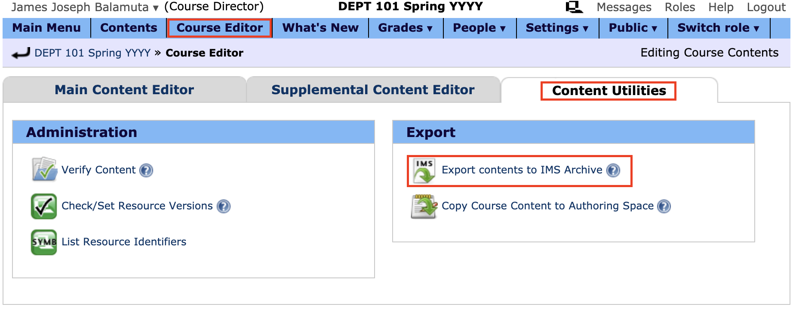

## LON-CAPA Conversion Tool

This converts multiple choice and numeric questions from LON-CAPA's IMS Archive format to
the PrairieLearn directory question structure. Each question will automatically
be given assigned a UUID. Questions using other format types will be deposited
into their own question folder.

Command line usage:

```bash
lon-capa-to-pl.py imsmanifest.xml
```

The IMS Archive for a course is obtained by placing all required questions previously authored
into a _new_ course. Within this course, go to the "Course Editor" -> "Content Utilities" -> "Export contents to IMS Archive".



**Note:** The export occurs in the **Course Space** and not the _Authoring_ space.

For more information, please see [Craig's original e-mail](zilles-email.md)
