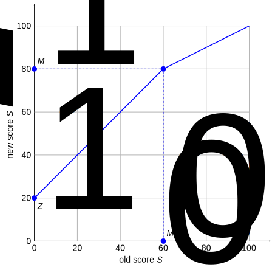

# Designing good assessments

This page gives opinionated advice about good practices when designing assessments. This is from the viewpoint of undergraduate U.S. university STEM courses. We do not expect anyone to exactly follow this advice, but we hope it is nonetheless useful.

## Formative and summative assessments

It is convenient to separate assessments into two distinct types:

* **Formative assessments** are primarily designed for helping students to learn. We want to provide lots of opportunity to practice and re-practice, and we want to reward persistence so all students can eventually get full points. We are generally not concerned with cheating, because students who don't learn here will in any case fail the exams. For formative assessments we use `"type": "Homework"`. See the [Example Homework](#example-homework) below.

* **Summative assessments** are primarily designed to measure how much individual students know, and to motivate students to study before and after. We want to minimize opportunities for collaborative cheating, where students tell each other information about the assessment, so we will heavily use random question selection and parameterization. For summative assessments we use `"type": "Exam"`. See the [Example Exam](#example-exam) below.

## Managing cheating

We want to provide a supportive learning environment in the class, while also accurately assessing individual student knowledge to assign grades. This can be a difficult balance to strike. We recommend ignoring issues with cheating on formative assessments and designing them so all students can eventually get 100%, and focusing all cheating-prevention efforts on summative assessments.

To explain this to students, we recommend telling them:

> We aim to provide a supportive learning environment for every individual, while also making sure that we are being fair in how exams are run and course grades are determined. For this reason, we divide class activities into two categories:

> **Learning time** is when you should be focused on acquiring new knowledge and skills. This includes lectures, homeworks, and study time. During this time you can collaborate and get help as much as you want, and there is no such thing as "cheating". However, it is your responsibility to actually learn the material, not just copy answers to get the points, and success in the course exams will depend on you learning effectively.

> **Testing time** is when you need to perform as an individual. This is only during exams and quizzes. During this time you must not collaborate with anyone else or get any outside help. We will strictly enforce these rules out of fairness to all students.

This division into learning and testing times is student-friendly language for formative and summative assessments. Emphasizing "fairness" is a good way to explain these policies to students.

By removing cheating concerns from "learning time", we avoid ambiguities around statements like "you can work with friends on homework, but you must submit your own work". Students and instructors frequently have different understandings of what this means, leading to friction and lots of instructor effort. By emphasizing that it is the responsibility of students to learn effectively during "learning time", we also encourage the development of metacognition, as discussed below.

## Developing metacognition

While it is important for students to learn specific knowledge and skills in a course, it is even more important that they _learn how to learn_. That is, that they develop _metacognition_, the ability to understand their own cognitive processes. In the context of learning, students should be able to answer questions like:

* "Do I understand this topic well enough to take an exam on it?"
* "What score do I think I will get on the exam?"
* "What is the most effective way for me to learn this material?"
* "When I'm stuck, how do I to find helpful resources?"
* "How do I effectively manage time and stress?"

Many incoming university students have very poor metacognition about their own learning. One of the primary goals of an undergraduate education is to help them develop metacognitive skills, so they can be _lifelong learners_.

We can design assessments to help students improve their metacognition. Some strategies for this include:

1. Provide explicit information about metacognition to students. This could involve asking them to think about how they are learning, and what they could change to be more effective.

2. Provide a large pool of resources for learning, and allow students to choose how they use it. For example, provide optional extra homework questions that students can use for exam study if they want.

3. Provide frequent, rapid feedback on whether the student is succeeding in their learning. For example, have a rigorous short exam every two weeks so that students can quickly realize whether their study strategies are working for them.

4. Provide opportunities for students to experiment with learning strategies. For example, frequent small exams let students try out different study methods, and second-chance exams let them recover when something is not working.

5. Provide less structure for more advanced courses, so that the "scaffolding" around the student is gradually removed as their metacognition improves. For example, introductory courses might require weekly homeworks with bi-weekly exams, while advanced courses might have optional homeworks and three exams in total.

## Course grading scheme

Within a course, a recommended grading scheme is:

* Weekly formative assessments (homeworks, machine problems): 30% of total grade. Most students should get 100% on homeworks by persisting until they get full points.

* Within-course summative assessments (quizzes, midterm exams): 40% of total grade. Median scores should be around 80%.

* End-of-course final exam: 30% of total grade. The median score should be around 80%.

We recommend using this with a traditional 10-point grading scale: 90-100: A, 80-90: B, 70-80: C, 60-70: D, 0-60: F. Using this scale, the above grading scheme will give a median total score around 85%, so about 2/3 of the class will get an A or B grade.

## Should all assessments be in PrairieLearn?

FIXME

## Curving exam scores

While we should aim for a median exam score around 80%, it is sometimes difficult to achieve this when using new questions for which we haven't yet collected statistics.

If an exam has median score below about 70% then it is generally a good idea to curve it. A simple and robust curving method is:

```
if S0 <= M0:
    S1 = 100 - (100 - S0)*(100 - M1)/(100 - M0)
else:
    S1 = S0 + M1 - M0
```

The variables here are:

* `S0` is the old raw score for a student exam (in range 0 to 100).
* `S1` is the new curved score for the student (in range 0 to 100).
* `M0` is the median of the raw score distribution.
* `M1` is the new desired median of the curved scores. A good choice is `M1 = 80`, so half the students are in the A/B range.



The benefits of this simple curving rule are:

1. There is only one parameter to choose (`M1`, which we normally fix at 80) and it's simple to implement.
2. Every student's score is guaranteed to increase, but the ordering of students is strictly maintained.
3. All students below the median get the same score boost, and lower-scoring students always get at least as much boost as higher-scoring students.
4. A perfect score of 100 maps to 100.
5. Using the median makes the curing insensitive to outliers, and lets us easily control the proportion of the class in the A/B range.

## Retries on Exams

FIXME — explain about (lack of) partial credit and how retries are a (partial) substitute

FIXME — explain about mastery grading somewhere

There are two different levels of "retries" that are in common usage for exams:

1. On every quiz, students receive immediate feedback about whether their answers are correct, and if they are incorrect then they can attempt that exact question again for (reduced) points. This is the setting in `infoAssessment.json` like `"points": [10, 9, 7, 4, 2]` (five attempts, 10 points if it’s correct on the first attempt, 9 on the second, etc). Essentially all courses use this "retry questions immediately" feature in PrairieLearn, because it helps students a lot if they make a small error, and it’s very easy to allow this.

2. Some courses choose to let students take second-chance exams ("second chance", "retry", or "retake" exams). These are completely separate quizzes, scheduled as a second different quiz, typically taking place in a separate block of days about 1 week after the first-chance quiz. These second-chance quizzes typically use different questions to the first-chance quizzes, but on the same topic. Because they need more questions, only some courses use second-chance quizzes.

## Second-chance Exam grading

Two simple schemes are:

```
total1 = max(first, 0.3*first + 0.7*second)

OR

total2 = 0.7*max(first,second) + 0.3*min(first,second)
```

FIXME

## Example Homework

Below is an example of a formative assessment using `"type": "Homework"`. This is also in `"set": "Homework"`, in which it is `"number": "1"`, and so it will be displayed as `Homework 1: Vector algebra`.

There are four access rules for this homework, which mean:

* TAs get full access at any time with no restrictions. This allows them to see the homework before it is released to students.

* Students can only access the homework in `"mode": "Public"`, which means that it is not visible to them inside an exam environment like the CBTF.

* We always use times that are one second before or after midnight, to avoid any confusion about which day is which. It also means we can say "released on Monday" or "due on Wednesday" with no extra confusion about _when_ on these days.

* We use a declining `credit` scale, where the homework is worth full credit until the initial due date of Jan 28, then there is a 2-day "late period" when it's worth half credit.

* After the homework is due, we leave it accessible to students for zero credit, so they can continue to use the questions for exam study.

This homework has a total of 18 questions, divided into 3 zones. These are structured as follows:

* The three zones (Fundamental/Intermediate/Advanced) mirror the question division on the [example Exam](#example-exam) and they have the same names as on the Exam. This helps students understand the structure.

* In each zone, only 3 questions will count towards the total score. This allows us to put many questions on the homework without overwhelming students with work, and provides them with the chance to structure their own exam study and develop metacognition. Adding more optional questions to the homework is always good.

* Each question can be repeated multiple times for more points. Students will receive at least 1 point for each correct attempt, and possibly more points with [value boosting](), up to a maximum of 5 points. This encourages thinking about the general method of solution for a question. This is only appropriate for questions that are highly parameterized. For questions without parameterization, `maxPoints` can be unspecified, which will make it equal to `points`.

* All questions are worth the same number of points. Given that nearly all students will repeatedly attempt questions until they get 100%, there is no advantage to variable point values, and so it's better to keep things simple.

At the end of the Homework configuration, the `"text"` property is used to provide access to a formula sheet. This is identical to the formula sheet on the [example Exam](#example-exam), and is provided on the homework so that students can become acquainted with it before the exam.

```json
{
    "uuid": "13c12b31-ca94-492a-bf69-a8f383cbc582",
    "type": "Homework",
    "title": "Vector algebra",
    "set": "Homework",
    "number": "1",
    "allowAccess": [
        {
            "role": "TA",
            "credit": 100
        },
        {
            "mode": "Public",
            "credit": 100,
            "startDate": "2019-01-18T00:00:01",
            "endDate": "2019-01-28T23:59:59"
        },
        {
            "mode": "Public",
            "credit": 50,
            "startDate": "2019-01-28T00:00:01",
            "endDate": "2019-01-30T23:59:59"
        },
        {
            "mode": "Public",
            "credit": 0,
            "startDate": "2019-01-30T00:00:01"
        }
    ],
    "zones": [
        {
            "title": "Fundamental questions",
            "bestQuestions": 3,
            "questions": [
                {"id": "addVectors1",      "points": 1, "maxPoints": 5},
                {"id": "addVectors2",      "points": 1, "maxPoints": 5},
                {"id": "subtractVectors1", "points": 1, "maxPoints": 5},
                {"id": "subtractVectors2", "points": 1, "maxPoints": 5},
                {"id": "addManyVectors1",  "points": 1, "maxPoints": 5},
                {"id": "addManyVectors2",  "points": 1, "maxPoints": 5}
            ]
        },
        {
            "title": "Intermediate questions",
            "bestQuestions": 3,
            "questions": [
                {"id": "dotProduct1",      "points": 1, "maxPoints": 5},
                {"id": "dotProduct2",      "points": 1, "maxPoints": 5},
                {"id": "crossProduct1",    "points": 1, "maxPoints": 5},
                {"id": "crossProduct2",    "points": 1, "maxPoints": 5},
                {"id": "projection1",      "points": 1, "maxPoints": 5},
                {"id": "projection2",      "points": 1, "maxPoints": 5}
           ]
        },
        {
            "title": "Advanced questions",
            "bestQuestions": 3,
            "questions": [
                {"id": "hardProjection1",  "points": 1, "maxPoints": 5},
                {"id": "hardProjection2",  "points": 1, "maxPoints": 5},
                {"id": "hardProjection3",  "points": 1, "maxPoints": 5},
                {"id": "tripleProduct1",   "points": 1, "maxPoints": 5},
                {"id": "tripleProduct1",   "points": 1, "maxPoints": 5},
                {"id": "tripleProduct2",   "points": 1, "maxPoints": 5}
            ]
        }
    ],
    "text": "For this homework you can use the <a target=\"_blank\" href=\"<%= clientFilesCourse %>/formulas.pdf\">formula sheet</a>."
}
```

## Example summative "Exam" assessment

Below is an example of "Exam 1" on the same topic as the [example Homework](#example-homework).

There are two access rules for this homework, which mean:

* TAs get full access at any time with no restrictions. This allows them to see the exam before it is released to students.

* Students can only access the homework in `"mode": "Exam"`, which means that it is only visible to them inside the CBTF, and they get full credit.

* The CBTF access rule is linked to a particular CBTF exam via the `ExamUuid`. This makes it so that students can only see this Exam if they've made a reservation and checked in for the linked exam in the CBTF.

The question list for exams is more complicated than for homeworks because we want to randomize question selection. The question selection was designed so that:

* Each student taking this exam will get four questions, organized into three zones (Fundamental, Intermediate, and Advanced). These zones are in order of difficulty to help build student confidence and manage time.

* The points are set so that **the easier questions are worth more points than the harder questions**. This is done so that the score distribution of the exam is concentrated between 50% to 100%, but where there is still good separation between the stronger students.

* The "Fundamental" questions should be easy enough that nearly all students can get them correct, giving a baseline score of about `2*25 = 50` points. The "Intermediate" questions should have an average correct rate of around 70%, giving an average of about `4*10*0.7 = 28` points. The "Advanced" questions should have an average correct rate of 20%, giving an average of `2*5*0.2 = 2` points, and differentiating between the stronger students. This gives a total average of `80/100 = 80%`, a good baseline score of 50%, and good discrimination at the upper end.

* This example Exam has a total of 100 points, but we only chose this for convenience of explanation. In practice there is no need to have any particular total.

* The first question slot gives each student a question from "Homework 1" (one of the `addVectors` or `subtractVectors` questions). We give 4 alternatives to ensure that students can't easily tell their friends exactly which Homework question is on the exam.

* The questions in one alternatives list do not all have to be on exactly the same topic. For example, we have put `addVectors` and `subtractVectors` together, so that each student will get one or the other. This is fine, so long as they are of the same difficulty and equally appropriate.

* The second question slot gives students one of `addManyVectors3`, `addManyVectors4`, or `addManyVectors5`. These are questions that are similar to Homework questions, but that the students haven't seen before. We select from three question alternatives to minimize the risk of information transfer between students. Data shows that three or four question alternatives are normally sufficient ([Chen et al., 2018](http://lagrange.mechse.illinois.edu/pubs/ChWeZi2018a/)).

The third and fourth questions test concepts that the students practiced on "Homework 1", but using different questions that were not on the homework. For this reason we again provide three question alternatives for each slot.

```json
{
    "uuid": "424f3380-8e6d-42a2-8e72-f3c479f2711b",
    "type": "Exam",
    "title": "Vector algebra",
    "set": "Exam",
    "number": "1",
    "allowAccess": [
        {
            "role": "TA",
            "credit": 100
        },
        {
            "mode": "Exam",
            "credit": 100,
            "examUuid": "fa5e28c2-6733-47b7-a73f-5b58a21c8fb3",
       }
    ],
    "zones": [
        {
            "title": "Fundamental questions",
            "questions": [
                {
                    "numberChoose": 1,
                    "points": [25, 24, 23, 22, 21, 20],
                    "alternatives": [
                        {"id": "addVectors1"},
                        {"id": "addVectors2"},
                        {"id": "subtractVectors1"},
                        {"id": "subtractVectors2"}
                    ]
                },
                {
                    "numberChoose": 1,
                    "points": [25, 24, 23, 22, 21, 20],
                    "alternatives": [
                        {"id": "addManyVectors3"},
                        {"id": "addManyVectors4"},
                        {"id": "addManyVectors5"}
                    ]
                }
           ]
        },
        {
            "title": "Intermediate questions",
            "questions": [
                {
                    "numberChoose": 1,
                    "points": [10, 9, 8, 7, 6],
                    "alternatives": [
                        {"id": "dotProduct1"},
                        {"id": "dotProduct2"},
                        {"id": "dotProduct3"}
                    ]
                },
                {
                    "numberChoose": 1,
                    "points": [10, 9, 8, 7, 6],
                    "alternatives": [
                        {"id": "crossProduct3"},
                        {"id": "crossProduct4"},
                        {"id": "crossProduct5"},
                        {"id": "crossProduct6"}
                    ]
                },
                {
                    "numberChoose": 1,
                    "points": [10, 9, 8, 7, 6],
                    "alternatives": [
                        {"id": "dotOrCross1"},
                        {"id": "dotOrCross2"},
                        {"id": "dotOrCross3"}
                   ]
                },
                {
                    "numberChoose": 1,
                    "points": [10, 9, 8, 7, 6],
                    "alternatives": [
                        {"id": "dotAdd1"},
                        {"id": "dotAdd2"},
                        {"id": "dotAdd3"}
                   ]
                }
            ]
        },
        {
            "title": "Advanced questions",
            "questions": [
                {
                    "numberChoose": 1,
                    "points": [5, 4, 3, 2, 1],
                    "alternatives": [
                        {"id": "vector3"},
                        {"id": "dotProduct4"},
                        {"id": "dotProduct5"}
                    ]
                },
                {
                    "numberChoose": 1,
                    "points": [5, 4, 3, 2, 1],
                    "alternatives": [
                        {"id": "vector3"},
                        {"id": "dotProduct4"},
                        {"id": "dotProduct5"}
                    ]
                }
            ]
        }
    },
    "text": "For this quiz you can use the <a target=\"_blank\" href=\"<%= clientFilesCourse %>/formulas.pdf\">formula sheet</a>."
}
```
