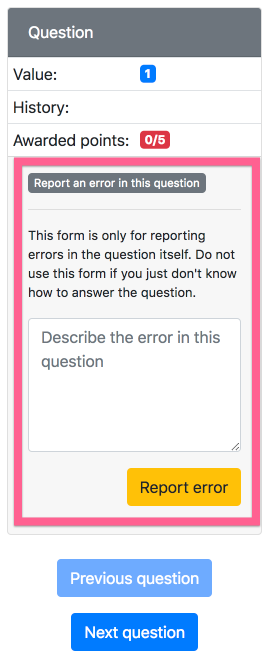

# Assessments

**NOTE:** Any time you edit or add an `infoAssessment.json` file on a local copy of PrairieLearn, you need to click the “Load from disk” button in the header so that the local PrairieLearn server reloads the changes.

## Overview

Each assessment is a single directory in the `assessments` folder. The directory must contain a single file called `infoAssessment.json` that describes the assessment and looks like:

```json
{
    "uuid": "cef0cbf3-6458-4f13-a418-ee4d7e7505dd",
    "type": "Exam",
    "title": "Coordinates and Vectors",
    "set": "Quiz",
    "number": "2",
    "allowAccess": [],
    "zones": []
}
```

* [Format specification for assessment `infoAssessment.json`](https://github.com/PrairieLearn/PrairieLearn/blob/master/schemas/infoAssessment.json)

## Assessment naming

Assessments are organized into `sets` (e.g., `Homework`, `Quiz`, `Exam`) and within each set the assessment has a `number`. Additionally, each assessment has a `title`. Depending on the context, assessments are referred to by either a _short name_ or a _long name_. The format of these is:

* Short name = `Set Number` (e.g., `Quiz 2` in the above example).

* Long name = `Set Number: Title` (e.g., `Quiz 2: Coordinates and Vectors` above).

The allowable set names are specified in the (`courseInfo.json`)[course.md] file.

## Assessment types

Each assessment has a `type`, as listed below. A randomized assessment is one where each student gets a different set of questions in a randomized order, while a non-randomized assessment shows all students the same list of questions in the same order. Broadly speaking, randomized assessments are designed for exams and non-randomized assessments are designed for homeworks.

Type        | Randomized | Description
---         | ---        | ---
`Homework`  | No         | A gamified assessment that rewards repeated correct answers to questions.
`Exam`      | Yes        | An exam where students can grade their answers at any time, and retry questions for reduced points.

## Changing question-order randomization

To make `Homework` assessments randomize the question order for each student, set the `"shuffleQuestions": true` option in the `infoAssessment.json` file. This will use a unique-per-course number for each question, so that all students will still get the same question numbers (like #427), but they will not be in order. This makes it easy for students to discuss questions with course staff; they can say “I don't know how to do #427” and everyone will be seeing the same question #427. The main advantage of randomizing question order on Homeworks is to enable data collection on question difficulty and student behavior that is independent of the order in which questions are listed on the assessment.

There is currently no way to disable question order randomization for `Exam` assessments. However, the order of `zones` is fixed (see below), which can be used to control question order.

## Question specification

An assessment is broken down in to a list of zones, like this:

```json
"zones": [
    {
        "title": "Easy questions",
        "questions": [
            {"id": "anEasyQ", "points": [10, 5, 3, 1, 0.5, 0.25]},
            {"id": "aSlightlyHarderQ", "points": [10, 9, 7, 5]}
        ]
    },
    {
        "title": "Hard questions",
        "questions": [
            {"id": "hardQV1", "points": 10},
            {"id": "reallyHardQ", "points": [10, 10, 10]},
            {
                "numberChoose": 1,
                "points": 5,
                "alternatives": [
                    {"id": "FirstAltQ", "points": 10},
                    {"id": "SecondAltQ"}
                ]
            }
        ]
    }
],
```

* Each zone appears in the given order in the assessment. Zone titles are optional and are displayed to the student if present.

* Within each zone the question order is randomized for `Exam` assessments.

* An assessment question can be specified by either a single `id` or by a list of alternatives, in which case one or more of these alternatives is chosen at random. Once the question `id` is determined, then a random variant of that question is selected. Question alternatives inherit the points of their parent group, if specified.

* If a zone has `maxPoints`, then, of the points that are awarded for answering questions in this zone, at most `maxPoints` will count toward the total points.

* If a zone has `bestQuestions`, then, of the questions in this zone, only `bestQuestions` with the highest number of awarded points will count toward the total points.

## Assessment and question instances and resetting assessments

PrairieLearn distinguishes between *assessments* and *assessment instances*. A *assessment* is determined by the code in an `assessments` directory, and is something like "Midterm 1". Given an assessment, PrairieLearn needs to generate the random set of questions and question variants for each student, and it is this selection that is the *assessment instance* for the student. There is only one copy of each assessment, but every student has their own assessment instance. The rules for updating assessment instances differ between `Homework` and `Exam` assessments.

**`Exam` assessment updates:** Exam assessment instances are generated when the student starts the exam, and they are never automatically deleted, regenerated, or updated, even when the original assessment is changed in some way. This is a safety mechanism to avoid having students' assessments changed during an exam. However, if you want to force the regeneration of assessment instances then you can do so with the “reset” button on instructor view of the assessment. While writing an assessment you might need to do this many times. Once an assessment is live, you should of course be very careful about doing this (basically, don’t do it on a production server once an assessment is underway).

**`Homework` assessment updates:** New questions added to Homeworks will be automatically integrated into student homeworks currently in progress. Updates to `maxPoints` will take effect the next time a student grades a question. A student's “points” and “percentage score” will never decrease.

## Multiple-instance versus single-instance assessments

By default all assessments are *single instance*, meaning that each student has exactly one instance of the assessment that they can complete, and once they have completed that assessment instance then they cannot do the assessment again. This is the expected behavior for homeworks, quizzes, exams, etc.

For practice exams it is often desirable to make a *multiple instance* assessment by setting the option `"multipleInstance": true`. This will allow students to create new assessment instances and try the whole assessment repeatedly.

## Auto-closing Exam assessments

By default Exam assessments will auto-close after six hours of inactivity by the student. This generally means that you don't need to explicity close exams that students accidentally did not close when they were done. If you want to prevent auto-closing then you can set `"autoClose": false` as a top-level option in the `infoAssessment.json` file.

## Issue reporting

To allow students to report issues with questions (incorrect answers, unclear wording, etc), set the `"allowIssueReporting": true` property in the `infoAssessment.json` file, or set it to `false` to disallow reporting. This option defaults to `true`.

When issue reporting is allowed, students see a button labeled "Report an error in this question" and they can submit a short text form.

 

Course staff see any reported issues show up on the "Issues" tab.


## Access control

See the [Access control page](accessControl.md) for details.

By default, an assessment is only accessible to `Instructor` users. To change this, the `allowAccess` option can be used in the assessment's `infoAssessment.json` file.

## Adding text and links to assessments

See the [`clientFiles` and `serverFiles`](clientServerFiles.md) page for details, and [`exam1` in the example course](https://github.com/PrairieLearn/PrairieLearn/blob/master/exampleCourse/courseInstances/Sp15/assessments/exam1/) for an example.
