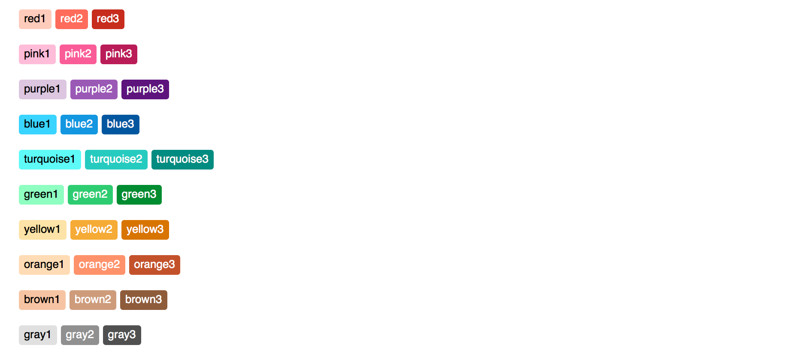

# Course configuration

**NOTE:** Any time you edit the `infoCourse.json` file on a local copy of PrairieLearn, you need to click the “Load from disk” button in the page header so that the local PrairieLearn server reloads the changes.

## Directory layout

A course is specified by a single directory, with the following structure:

```text
exampleCourse
+-- infoCourse.json     # course specification (see below)
+-- questions           # all questions for the course (see other doc)
|   `-- ...
|   `-- ...
+-- courseInstances     # instances of the course (see other doc)
|   +-- Fa16
|   |   `-- ...
|   `-- Sp17
|       `-- ...
+-- autograders         # all autograders for the course (see other doc)
|   +-- ag1
|       `-- ...
|   +-- ag2
|       `-- ...
+-- elements            # custom HTML elements for the course
|   +-- element1
|       `-- ...
+-- environment         # files needed to configure the autograder environment (see other doc)
|   `-- ...
|   `-- ...
+-- clientFilesCourse   # files available from the client at all times (see other doc)
|   `-- library.js
|   `-- refs.html
|   `-- formulas.pdf
`-- serverFilesCourse   # files only accessible from code on the server (see other doc)
    `-- secret1.js
```

* See an [example course directory](https://github.com/PrairieLearn/PrairieLearn/blob/master/exampleCourse) in PrairieLearn

* See [HTML element list](elements.md) for a list of elements provided by PrairieLearn to all courses; PrairieLearn will use a course version of an element whenever it exists.

* See [clientFiles and serverFiles](clientServerFiles.md) for information on the `clientFilesCourse` and `serverFilesCourse` directories.

## `infoCourse.json`

This file specifies basic information about the course:

```json
{
    "uuid": "cef0cbf3-6458-4f13-a418-ee4d7e7505dd",
    "name": "TAM 212",
    "title": "Introductory Dynamics",
    "assessmentSets": [
        {"abbreviation": "HW", "name": "Homework", "heading": "Homeworks", "color": "green1"},
        {"abbreviation": "E", "name": "Exam", "heading": "Exams", "color": "red1"}
    ],
    "topics": [
        {"name": "Vectors", "color": "blue3", "description": "Vector algebra in 3D"},
        {"name": "Center of mass", "color": "green3", "description": "Finding and using the center of mass of irregular bodies."}
    ],
    "tags": [
        {"name": "drawing", "color": "gray2", "description": "The answer requires drawing."},
        {"name": "estimation", "color": "orange2", "description": "Answering requires estimating a quantity."}
    ]
}
```

* Example [infoCourse.json](https://github.com/PrairieLearn/PrairieLearn/blob/master/exampleCourse/infoCourse.json)

* [Format specification for `infoCourse.json`](https://github.com/PrairieLearn/PrairieLearn/blob/master/schemas/infoCourse.json)

## Assessment sets

Each assessment belongs to an *assessment set*. Each assessment set must have the following properties.

Property | Description
--- | ---
`abbreviation` | Abbreviation that is joined with the assessment `number` to form the label, so `"abbreviation": "HW"` produces `HW1`, `HW2`, etc. This should be one or two uppercase letters (e.g., `HW` for homework, `E` for exam, `Q` for quiz).
`name` | Full name that is joined with the assessment `number` to describe the assessment, so `"name": "Homework"` produces `Homework 1`, etc. This should be a singular noun.
`heading` | Title that is listed above all the assessments in the set. Should be the plural version of the `name`.
`color` | The color scheme for this assessment (see below for choices).

## Standardized assessment sets

The following list of standardized assessments sets is automatically included in every course. You do not need to include these in your JSON file, but you can add extra assessment sets if needed (see below).

abbreviation | name | purpose
--- | --- | ---
`HW` | Homework | Weekly homeworks done at home.
`MP` | Machine Problem | Weekly coding assisgnments done outside of class.
`Q` | Quiz | Short frequent quizzes.
`PQ` | Practice Quiz | Practice quizzes.
`E` | Exam | Long-form midterm or final exams.
`PE` | Practice Exam | Practice exams.
`P` | Prep | Temporary assessments used while writing new questions.

## Adding your own assessment sets

You can add more assessment sets by listing them in the `infoCourse.json` file as follows. Note that HW and Q don't need to be listed because they are automatically available as standardized sets (see above).

```json
    "assessmentSets": [
        {"abbreviation": "HW", "name": "Homework", "heading": "Homeworks", "color": "green1"},
        {"abbreviation": "Q", "name": "Quiz", "heading": "Quizzes", "color": "red1"}
    ],
```

## Topics

Each question in the course has a topic from the list specified in the `infoCourse.json` file. Topics should be thought of as chapters or sections in a textbook, and there should be about 10 to 30 topics in a typical course. The topic properties are as follows.

Property | Description
--- | ---
`name` | Brief name for the topic. Shorter is better. Should be in sentence case (leading captial letter).
`color` | The color scheme for this topic (see below for choices).
`description` | An explanation of what the topic includes, for human referance.

For example, topics could be listed like:

```json
    "topics": [
        {"name": "Vectors", "color": "blue3", "description": "Vector algebra in 3D."},
        {"name": "Center of mass", "color": "green3", "description": "Calculating the center of mass for irregular bodies and systems."}
    ],
```

## Tags

Each question can have zero, one, or many tags associated with it. The properties of a tag are as follows.

Property | Description
--- | ---
`name` | Brief name for the tag. Tags should have very short names (preferably just a single word) because there might be many of them on one question. Should typically be in lower case (e.g., `drawing`) or an uppercase abbreviation (e.g., `MC`).
`color` | The color scheme for this tag (see below for choices).
`description` | An explanation of what the tag means, for human referance.

## Standardized tag names

The following list of standardized tags is automatically included in every course. You do not need to include these in your JSON file, but you can add extra tags (see below).

Answer format tag | Meaning
--- | ---
`numeric` | The answer format is one or more numerical values.
`symbolic` | The answer format is a symbolic expression.
`drawing` | The answer format requires drawing on a canvas to input a graphical representation of an answer.
`MC` | The answer format is choosing from a small finite set of answers (multiple choice, possibly with multiple selections allowed, up to 10 possible answers).
`code` | The answer format is a piece of code.
`multianswer` | The question requires multiple answers, either as steps in a sequence or as separate questions.

Skill testing tag | Meaning
--- | ---
`graph` | The question tests reading information from a graph or drawing a graph.
`concept` | The question tests conceptual understanding of a topic.
`calculate` | The questions tests performing a numerical calculation, with either a calculator or equivalent software.
`compute` | The question tests the writing and running of a piece of code to compute the answer. The answer itself is not the code, but could be a numeric answer output by the code, for example (use `code` when the answer is the code).
`software` | The question tests the use of a specific piece of software (e.g., Matlab).
`estimation` | Answering the question correctly will require some amount of estimation, so an exact answer is not possible.

Question use tag | Meaning
--- | ---
`secret` | Only use this question on exams or quizzes that won't be released to students, so the question can be kept secret.
`nontest` | This question is not appropriate for use in a restricted testing environment, so only use it on homeworks or similar.

Tracking tag | Meaning
--- | ---
`<course>` | The course for which the question was originally written. E.g., `TAM212`, `CS233`.
`<email>` | The email of the person who wrote the question, E.g., `mwest@illinois.edu`. Multiple emails can be tagged when several people had significant input.
`<semester>` | The semester when the question was written. E.g., `Sp15`, `Su16`, `Fa16`.


## Adding your own tags

You can add more tags to your course by listing them in the `infoCourse.json` file. For example:

```json
    "tags": [
        {"name": "TAM212", "color": "red1", "description": "This question was originally written for TAM 212."},
        {"name": "mwest", "color": "gray1", "description": "This question was written by Matthew West (mwest@illinois.edu)."}
    ]
```

## Colors

The possible colors for assessment sets, topic, and tags are:




## Timezone

The default timezone for courses is `America/Chicago` (U.S. Central Time). This can be changed with the `timezone` property in `infoCourse.json`. For example:

```json
{
    "timezone": "America/New_York"
}
```

Allowable timezones are those in the TZ column in the [list of tz database time zones](https://en.wikipedia.org/wiki/List_of_tz_database_time_zones), which is a display version of the [IANA Time Zone Database](https://www.iana.org/time-zones).
