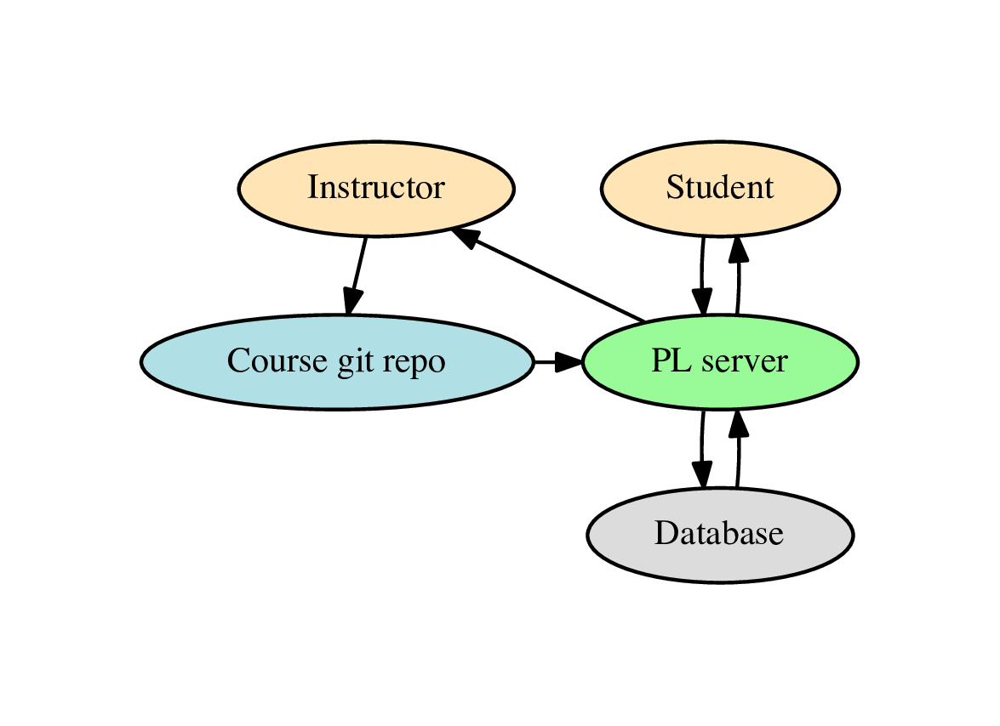
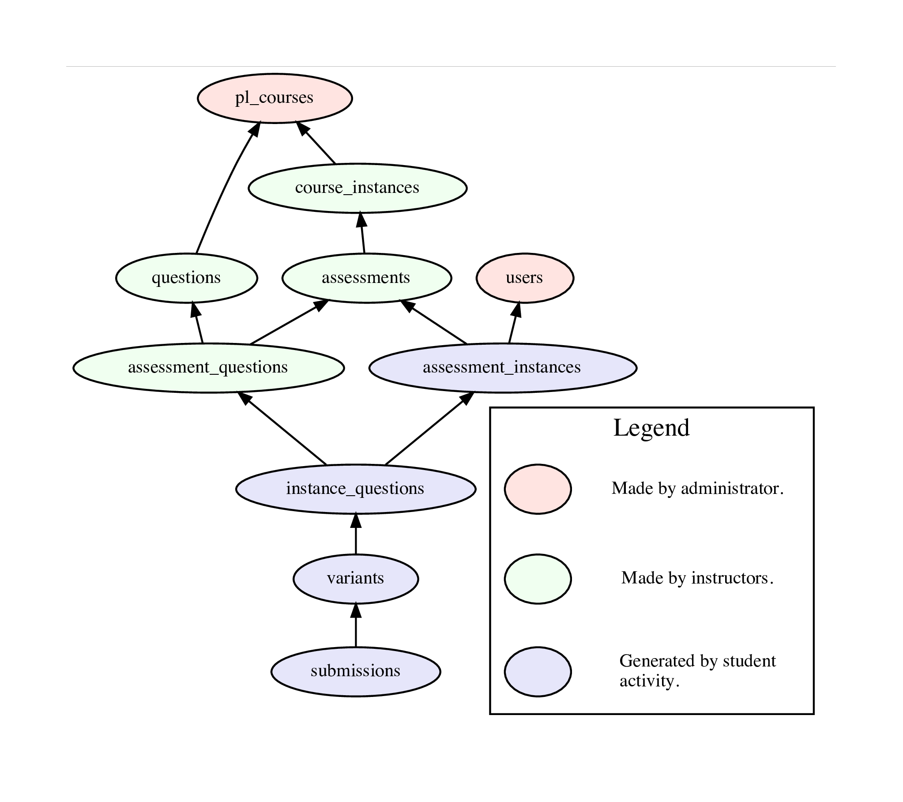
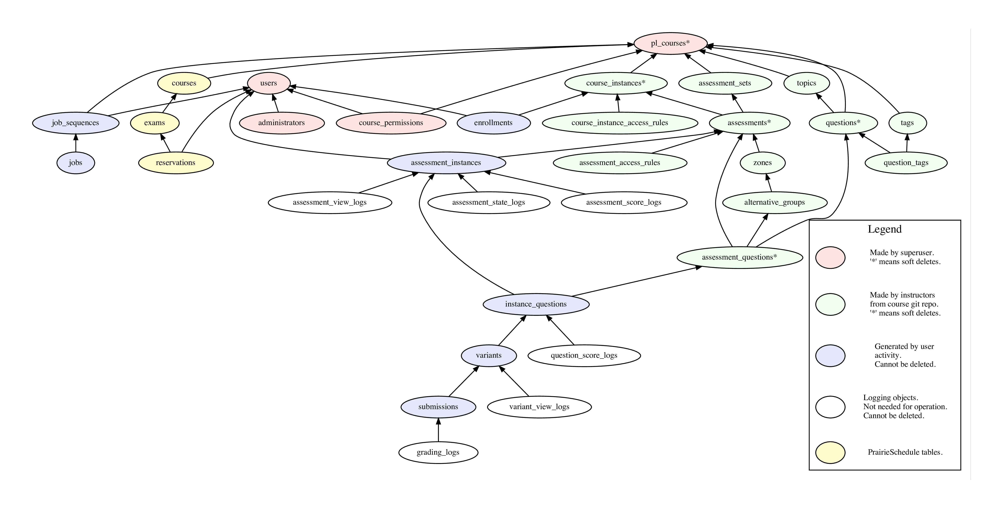
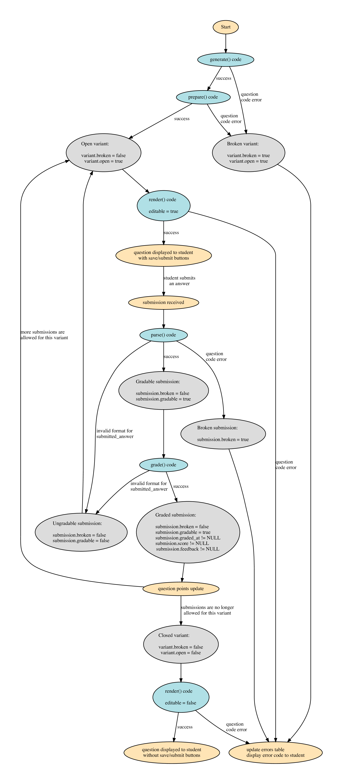

# Developer Guide

In general we prefer simplicity. We standardize on JavaScript (Node.js) and SQL (PostgreSQL) as the languages of implementation and try to minimize the number of complex libraries or frameworks being used. The website is server-side generated pages with minimal client-side JavaScript.


## High level view



* The questions and assessments for a course are stored in a git repository. This is synced into the database by the course instructor and DB data is updated or added to represent the course. Students then interact with the course website by doing questions, with the results being stored in the DB. The instructor can view the student results on the website and download CSV files with the data.

* All course configuration is done via plain text files in the git repository, which is the master source for this data. There is no extra course configuration stored in the DB. The instructor does not directly edit course data via the website.

* All student data is all stored in the DB and is not pushed back into the git repository or disk at any point.


## Directory layout

* Broadly follow the [Express generator](http://expressjs.com/en/starter/generator.html) layout.

* Top-level files and directories are:

```text
PrairieLearn
+-- autograder         # files needed to autograde code on a seperate server
|   `-- ...            # various scripts and docker images
+-- config.json        # server configuration file (optional)
+-- cron               # jobs to be periodically executed, one file per job
|   +-- index.js       # entry point for all cron jobs
|   `-- ...            # one JS file per cron job, executed by index.js
+-- doc                # documentation
+-- exampleCourse      # example content for a course
+-- lib                # miscellaneous helper code
+-- middlewares        # Express.js middleware, one per file
+-- migrations         # DB migrations
|   +-- index.js       # entry point for migrations
|   `-- ...            # one PGSQL file per migration, executed in order by index.js
+-- package.json       # npm configuration file
+-- pages              # one sub-dir per web page
|   +-- partials       # EJS helper sub-templates
|   +-- instructorHome # all the code for the instructorHome page
|   +-- userHome       # all the code for the userHome page
|   `-- ...            # other "instructor" and "user" pages
+-- public             # all accessible without access control
|   +-- javascripts    # external packages only, no modificiations
|   +-- localscripts   # all local site-wide JS
|   `-- stylesheets    # all CSS, both external and local
+-- question-servers   # one file per question type
+-- schemas            # JSON schemas for input file formats
+-- server.js          # top-level program
+-- sprocs             # DB stored procedures, one per file
|   +-- index.js       # entry point for all sproc initialization
|   `-- ...            # one JS file per sproc, executed by index.js
+-- sync               # code to load on-disk course config into DB
`-- tests              # unit tests, currently unused
```


## Unit tests and integration tests

* Tests are stored in the `tests/` directory. They are run with:

```sh
# make sure you are in the top-level PrairieLearn/ directory
npm test
npm run lint -s
```

* The above tests are run by the CI server on every push to GitHub.

* The tests are mainly integration tests that start with a blank database, run the server to initialize the database, load the `exampleCourse`, and then emulate a client web broswer that answers questions on assessments. If a test fails then the it is often easiest to debug but recreating the error by doing questions yourself against a locally-running server.

* If the `PL_KEEP_TEST_DB` environment is set, the test database (normally `pltest`) won't be DROP'd when testing ends. This allows you inspect the state of the database whenever your testing ends. The database will get overwritten when you start a new test.

## Debugging server-side JavaScript

* Use the [debug package](https://www.npmjs.com/package/debug) to help trace execution flow in JavaScript. To run the server with debugging output enabled:

```sh
DEBUG=* node server
```

* To just see debugging logs from PrairieLearn you can use:

```sh
DEBUG=prairielearn:* node server
```

* To insert more debugging output, import `debug` and use it like this:

```javascript
var path = require('path');
var debug = require('debug')('prairielearn:' + path.basename(__filename, '.js'));

// in some function later
debug('func()', 'param:', param);
```

* As of 2017-08-08 we don't have very good coverage with debug output in code, but we are trying to add more as needed, especially in code in `lib/`.

## Debugging client-side JavaScript

* Make sure you have the JavaScript Console open in your browser and reload the page.

## Debugging SQL and PL/pgSQL

* Use the [`psql`](https://www.postgresql.org/docs/9.6/static/app-psql.html) commandline interface to test SQL separately. A default development PrairieLearn install uses the `postgres` database, so you should run:

```sh
psql postgres
```

* To debug syntax errors in a stored procedure, import it manually with `\i filename.sql` in `psql`.

* To follow execution flow in PL/pgSQL use `RAISE NOTICE`. This will log to the console when run from `psql` and to the server log file when run from within PrairieLearn. The syntax is:

```sql
RAISE NOTICE 'This is logging: % and %', var1, var2;
```


## Page generation

* Use [Express](http://expressjs.com) as the web framework. As of 2016-09-27 we are using v4.

* All pages are server-side rendered and we try and minimize the amount of client-side JavaScript. Client-side JS should use [jQuery](https://jquery.com) and related libraries. We prefer to use off-the-shelf jQuery plugins where possible.

* Each web page typically has all its files in a single directory, with the directory, the files, and the URL all named the same. Not all pages need all files. For example:

```text
pages/instructorGradebook
+-- instructorGradebook.js         # main entry point, calls the SQL and renders the template
+-- instructorGradebook.sql        # all SQL code specific to this page
+-- instructorGradebook.ejs        # the EJS template for the page
`-- instructorGradebookClient.js   # any client-side JS needed
```

* The above `instructorGradebook` page is loaded from the top-level `server.js` with:

```javascript
app.use('/instructor/:courseInstanceId/gradebook', require('./pages/instructorGradebook/instructorGradebook'));
```

* The `instructorGradebook.js` main JS file is an Express `router` and has the basic structure:

```javascript
var ERR = require('async-stacktrace');
var _ = require('lodash');
var express = require('express');
var router = express.Router();
var sqldb = require('@prairielearn/prairielib/sql-db');
var sqlLoader = require('@prairielearn/prairielib/sql-loader');
var sql = sqlLoader.loadSqlEquiv(__filename);

router.get('/', function(req, res, next) {
    var params = {course_instance_id: res.params.courseInstanceId};
    sqldb.query(sql.user_scores, params, function(err, result) { // SQL queries for page data
        if (ERR(err, next)) return;
        res.locals.user_scores = result.rows; // store the data in res.locals

        res.render('pages/instructorGradebook/instructorGradebook', res.locals); // render the page
        // inside the EJS template, "res.locals.var" can be accessed with just "var"
    });
});

module.exports = router;
```

* Use the `res.locals` variable to build up data for the page rendering. Many basic objects are already included from the `selectAndAuthz*.js` middleware that runs before most page loads.

* Use [EJS templates](http://ejs.co) (Embedded JavaScript) templates for all pages. Using JS as the templating language removes the need for another ad hoc language, but does require some discipline to not get in a mess. Try and minimize the amount of JS code in the template files. Inside a template the JS code can directly access the contents of the `res.locals` object.

* Sub-templates are stored in `pages/partials` and can be loaded as below. The sub-template can also access `res.locals` as its base scope, and can also accept extra arguments with an arguments object:

```javascript
<%- include('../partials/assessment', {assessment: assessment}); %>
```


## Page style

* Use [Bootstrap](http://getbootstrap.com) as the style. As of 2016-09-27 we are using v3.

* Local CSS rules go in `public/stylesheets/local.css`. Try to minimize use of this and use plain Bootstrap styling wherever possible.


## SQL usage

* Use [PostgreSQL](https://www.postgresql.org) and feel free to use the latest features. As of 2017-08-05 we run version 9.6.

* The [PostgreSQL manual](https://www.postgresql.org/docs/manuals/) is an excellent reference.

* Write raw SQL rather than using a [ORM library](https://en.wikipedia.org/wiki/Object-relational_mapping). This reduces the number of frameworks/languages needed.

* Try and write as much code in SQL and [PL/pgSQL](https://www.postgresql.org/docs/9.5/static/plpgsql.html) as possible, rather than in JavaScript. Use PostgreSQL-specific SQL and don't worry about SQL dialect portability. Functions should be written as stored procedures in the `sprocs/` directory.

* The `sprocs/` directory has files that each contain exactly one stored procedure. The filename is the same as the name of the stored procedure, so the `variants_insert()` stored procedure is in the `sprocs/variants_insert.sql` file.

* Stored procedure names should generally start with the name of the table they are associated with and try to use standard SQL command names to describe what they do. For example, `variants_insert()` will do some kind of `INSERT INTO variants`, while `submission_update_parsing()` will do an `UPDATE submissions` with some parsing data.

* Use the SQL convention of [`snake_case`](https://en.wikipedia.org/wiki/Snake_case) for names. Also use the same convention in JavaScript for names that are the same as in SQL, so the `question_id` variable in SQL is also called `question_id` in JavaScript code.

* Use uppercase for SQL reserved words like `SELECT`, `FROM`, `AS`, etc.

* SQL code should not be inline in JavaScript files. Instead it should be in a separate `.sql` file, following the [Yesql concept](https://github.com/krisajenkins/yesql). Each `filename.js` file will normally have a corresponding `filename.sql` file in the same directory. The `.sql` file should look like:

```sql
-- BLOCK select_question
SELECT * FROM questions WHERE id = $question_id;

-- BLOCK insert_submission
INSERT INTO submissions (submitted_answer) VALUES ($submitted_answer) RETURNING *;
```

From JavaScript you can then do:

```javascript
var sqlLoader = require('@prairielearn/prairielib/sql-loader'); // adjust path as needed
var sql = sqlLoader.loadSqlEquiv(__filename); // from filename.js will load filename.sql

// run the entire contents of the SQL file
sqldb.query(sql.all, params, ...);

// run just one query block from the SQL file
sqldb.query(sql.select_question, params, ...);
```

* The layout of the SQL code should generally have each list in separate indented blocks, like:

```sql
SELECT
    ft.col1,
    ft.col2 AS renamed_col,
    st.col1
FROM
    first_table AS ft
    JOIN second_table AS st ON (st.first_table_id = ft.id)
WHERE
    ft.col3 = select3
    AND st.col2 = select2
ORDER BY
    ft.col1;
```

* To keep SQL code organized it is a good idea to use [CTEs (`WITH` queries)](https://www.postgresql.org/docs/current/static/queries-with.html). These are formatted like:

```sql
WITH first_preliminary_table AS (
    SELECT
        -- first preliminary query
),
second_preliminary_table AS (
    SELECT
        -- second preliminary query
)
SELECT
    -- main query here
FROM
    first_preliminary_table AS fpt,
    second_preliminary_table AS spt;
```


## DB schema (simplified overview)

* The most important tables in the database are shown in the diagram below (also as a [PDF image](simplified-models.pdf)).



* Detailed descriptions of the format of each table are in the [list of DB tables](https://github.com/PrairieLearn/PrairieLearn/blob/master/database/tables/).

* Each table has an `id` number that is used for cross-referencing. For example, each row in the `questions` table has an `id` and other tables will refer to this as a `question_id`. The only exceptions are the `pl_courses` table that other tables refer to with `course_id` and `users` which has a `user_id`. These are both for reasons of interoperability with PrairieSchedule.

* Each student is stored as a single row in the `users` table.

* The `pl_courses` table has one row for each course, like `TAM 212`.

* The `course_instances` table has one row for each semester (“instance”) of each course, with the `course_id` indicating which course it belongs to.

* Every question is a row in the `questions` table, and the `course_id` shows which course it belongs to. All the questions for a course can be thought of as the “question pool” for that course. This same pool is used for all semesters (all course instances).

* Assessments are stored in the `assessments` table and each assessment row has a `course_instance_id` to indicate which course instance (and hence which course) it belongs to. An assessment is something like “Homework 1” or “Exam 3”. To determine this we can use the `asssessment_set_id` and `number` of each assessment row.

* Each assessment has a list of questions associated with it. This list is stored in the `assessment_questions` table, where each row has a `assessment_id` and `question_id` to indicate which questions belong to which assessment. For example, there might be 20 different questions that are on “Exam 1”, and it might be the case that each student gets 5 of these questions randomly selected.

* Each student will have their own copy of an assessment, stored in the `assessment_instances` table with each row having a `user_id` and `assessment_id`. This is where the student's score for that assessment is stored.

* The selection of questions that each student is given on each assessment is in the `instance_questions` table. Here each row has an `assessment_question_id` and an `assessment_instance_id` to indicate that the corresponding question is on that assessment instance. This row will also store the student's score on this particular question.

* Questions can randomize their parameters, so there are many possible variants of each question. These are stored in the `variants` table with an `instance_question_id` indicating which instance question the variant belongs to.

* For each variant of a question that a student sees they will have submitted zero or more `submissions` with a `variant_id` to show what it belongs to. The submissions row also contains information the submitted answer and whether it was correct.


## DB schema (full data)

* See the [list of DB tables](https://github.com/PrairieLearn/PrairieLearn/blob/master/database/tables/), with the ER (entity relationship) diagram below ([PDF ER diagram](models.pdf)).




## DB schema conventions

* Tables have plural names (e.g. `assessments`) and always have a primary key called `id`. The foreign keys pointing to this table are non-plural, like `assessment_id`. When referring to this use an abbreviation of the first letters of each word, like `ai` in this case. The only exceptions are `aset` for `assessment_sets` (to avoid conflicting with the SQL `AS` keyword), `top` for `topics`, and `tag` for `tags` (to avoid conflicts). This gives code like:

```sql
-- select all active assessment_instances for a given assessment
SELECT
    ai.*
FROM
    assessments AS a
    JOIN assessment_instances AS ai ON (ai.assessment_id = a.id)
WHERE
    a.id = 45
    AND ai.deleted_at IS NULL;
```

* We (almost) never delete student data from the DB. To avoid having rows with broken or missing foreign keys, course configuration tables (e.g. `assessments`) can't be actually deleted. Instead they are "soft-deleted" by setting the `deleted_at` column to non-NULL. This means that when using any soft-deletable table we need to have a `WHERE deleted_at IS NULL` to get only the active rows.


## DB schema modification

* The database is built with a series of consecutive "migrations". A migration is a modification to table schema and is represented as a file in `migrations/`.

* The filenames in `migrations/` are of the form `<nnn>_<description>.sql` where `<nnn>` is a number to ensure ordering. The leading number must be unique among all migrations. A suggested form for the `<description>` is `<table name>__<column name>__<operation>` if only a single column is being changed.

* It's fine to put multiple logically-related migration statements in the same file.

* The database has a special `migrations` table that tracks which migrations have already been applied. This ensures that migrations are always applied exactly once.

* The current state of the DB schema is stored in a human-readable form in the `database/` directory. This is checked automatically by the unit tests and needs to be manually updated after migrations and the updates should be committed to git along with the migrations.

* _Historical node_: Migration statements started with PrairieLearn version 2.0.0. Starting with 2.0.0, the schema was maintained with separate `models` and `migrations` directories, which had to be kept in sync. In version 2.0.10, that was switched to solely `migrations`, and the state of `models` as of 2.0.0 was captured in `migrations/000_initial_state.sql`. All future migrations are applied on top of that.

* Some useful migration statements follow.

```sql
-- add a column to a table
ALTER TABLE assessments ADD COLUMN auto_close boolean DEFAULT true;

-- add a foreign key to a table
ALTER TABLE variants ADD COLUMN authn_user_id bigint;
ALTER TABLE variants ADD FOREIGN KEY (authn_user_id) REFERENCES users ON DELETE CASCADE ON UPDATE CASCADE;

-- remove a constraint
ALTER TABLE alternative_groups DROP CONSTRAINT alternative_groups_number_assessment_id_key;

-- add a constraint
ALTER TABLE alternative_groups ADD UNIQUE (assessment_id, number);
```


## Database access

* DB access is via the `sqldb.js` module. This wraps the [node-postgres](https://github.com/brianc/node-postgres) library.

* For single queries we normally use the following pattern, which automatically uses connection pooling from node-postgres and safe variable interpolation with named parameters and [prepared statements](https://github.com/brianc/node-postgres/wiki/Parameterized-queries-and-Prepared-Statements):

```javascript
var params = {
    course_id: 45,
};
sqldb.query(sql.select_questions_by_course, params, function(err, result) {
    if (ERR(err, callback)) return;
    var questions = result.rows;
});
```

Where the corresponding `filename.sql` file contains:

```sql
-- BLOCK select_questions_by_course
SELECT * FROM questions WHERE course_id = $course_id;
```

* For queries where it would be an error to not return exactly one result row:

```javascript
sqldb.queryOneRow(sql.block_name, params, function(err, result) {
    if (ERR(err, callback)) return;
    var obj = result.rows[0]; // guaranteed to exist and no more
});
```

* For transactions with correct error handling use following pattern. It is important to use `async.series()` to run all the operations rather than using a callback stack, because with `async.series()` we can guarantee that `endTransaction()` is called no matter whether any of the intermediate operations produce an error.

```javascript
// do this
sqldb.beginTransaction(function(err, client, done) {
    if (ERR(err, callback)) return;
    async.series([
        function(callback) {
            // only use queryWithClient() and queryWithClientOneRow() inside the transaction
            sqldb.queryWithClient(client, sql.block_name, params, function(err, result) {
                if (ERR(err, callback)) return;
                // do things
                callback(null);
            });
        },
        // more series functions inside the transaction
    ], function(err) {
        sqldb.endTransaction(client, done, err, function(err) { // will rollback if err is defined
            if (ERR(err, callback)) return;
            // transaction successfully committed at this point
            callback(null);
        });
    });
});

// don't do this
sqldb.beginTransaction(function(err, client, done) {
    if (ERR(err, callback)) return;
    sqldb.queryWithClient(client, sql.block_name, params, function(err, result) {
        if (ERR(err, callback)) return; // THIS IS WRONG, it may exit without endTransaction()
        sqldb.endTransaction(client, done, err, function(err) {
            if (ERR(err, callback)) return;
            callback(null);
        });
    });
});
```

* Use explicit row locking whenever modifying student data related to an asseesment. This must be done within a transaction. The rule is that we lock either the variant (if there is no corresponding assessment instance) or the assessment instance (if we have one). It is fine to repeatedly lock the same row within a single transaction, so all functions involved in modifying elements of an assessment (e.g., adding a submission, grading, etc) should call a locking function when they start. All locking functions are equivalent in their action, so the most convenient one should be used in any given situation:

Locking function | Argument
--- | ---
`assessment_instances_lock` | `assessment_instance_id`
`instance_questions_lock` | `instance_question_id`
`variants_lock` | `variant_id`
`submission_lock` | `submission_id`

* To pass an array of parameters to SQL code, use the following pattern, which allows zero or more elements in the array. This replaces `$points_list` with `ARRAY[10, 5, 1]` in the SQL. It's required to specify the type of array in case it is empty:

```javascript
var params = {
    points_list: [10, 5, 1],
};
sqldb.query(sql.insert_assessment_question, params, ...);
```

```sql
-- BLOCK insert_assessment_question
INSERT INTO assessment_questions (points_list) VALUES ($points_list::INTEGER[]);
```

* To use a JavaScript array for membership testing in SQL use [`unnest()`](https://www.postgresql.org/docs/9.5/static/functions-array.html) like:

```javascript
var params = {
    id_list: [7, 12, 45],
};
sqldb.query(sql.select_questions, params, ...);
```

```sql
-- BLOCK select_questions
SELECT * FROM questions WHERE id IN (SELECT unnest($id_list::INTEGER[]));
```


## Error handling and control flow in JavaScript

* Use tradtional [Node.js error handling conventions](https://docs.nodejitsu.com/articles/errors/what-are-the-error-conventions/) with the `callback(err, result)` pattern.

* Use the [async library](http://caolan.github.io/async/) for control flow.

* Use the [async-stacktrace library](https://github.com/Pita/async-stacktrace) for every error handler. That is, the top of every file should have `ERR = require('async-stacktrace');` and wherever you would normally write `if (err) return callback(err);` you instead write `if (ERR(err, callback)) return;`. This does exactly the same thing, except that it modfies the `err` object's stack trace to include the current filename/linenumber, which greatly aids debugging. For example:

```javascript
// Don't do this:
function foo(p, callback) {
    bar(q, function(err, result) {
        if (err) return callback(err);
        callback(null, result);
    });
}

// Instead do this:
ERR = require('async-stacktrace'); // at top of file
function foo(p, callback) {
    bar(q, function(err, result) {
        if (ERR(err, callback)) return; // this is the change
        callback(null, result);
    });
}
```

* Don't pass `callback` functions directly through to children, but instead capture the error with the [async-stacktrace library](https://github.com/Pita/async-stacktrace) and pass it up the stack explicitly. This allows a complete stack trace to be printed on error. That is:

```javascript
// Don't do this:
function foo(p, callback) {
    bar(q, callback);
}

// Instead do this:
function foo(p, callback) {
    bar(q, function(err, result) {
        if (ERR(err, callback)) return;
        callback(null, result);
    });
}
```

* Note that the [async-stacktrace library](https://github.com/Pita/async-stacktrace) `ERR` function will throw an exception if not provided with a callback, so in cases where there is no callback (e.g., in `cron/index.js`) we should call it with `ERR(err, function() {})`.

* Don't call a `callback` function inside a try block, especially if there is also a `callback` call in the catch handler. Otherwise exceptions thrown much later will show up incorrectly as a double-callback or just in the wrong place. For example:

```javascript
// Don't do this:
function foo(p, callback) {
    try {
        let result = 3;
        callback(null, result); // this could throw an error from upstream code in the callback
    } catch (err) {
        callback(err);
    }
}

// Instead do this:
function foo(p, callback) {
    let result;
    try {
        result = 3;
    } catch (err) {
        callback(err);
    }
    callback(null, result);
}
```

* Don't use promises.

* We will switch to [async/await](https://github.com/tc39/ecmascript-asyncawait) once it is stable and widely supported in Node.js and the libraries we use. As of 2017-08-04 the internal Node.js support for async/await is still under development.


## Security model

* We distinguish between [authentication and authorization](https://en.wikipedia.org/wiki/Authentication#Authorization). Authentication occurs as the first stage in server response and the authenicated user data is stored as `res.locals.authn_user`.

* The authentication flow is:

    1. We first redirect to a remote authentication service (either Shibboleth or Google OAuth2 servers). For Shibboleth this happens by the “Login to PL” button linking to `/pl/shibcallback` for which Apache handles the Shibboleth redirections. For Google the “Login to PL” button links to `/pl/auth2login` which sets up the authentication data and redirects to Google.

    2. The remote authentication service redirects back to `/pl/shibcallback` (for Shibboleth) or `/pl/auth2callback` (for Google). These endpoints confirm authentication, create the user in the `users` table if necessary, set a signed `pl_authn` cookie in the browswer with the authenticated `user_id`, and then redirect to the main PL homepage.

    3. Every other page authenticates using the signed browser `pl_authn` cookie. This is read by [`middlewares/authn.js`](https://github.com/PrairieLearn/PrairieLearn/blob/master/middlewares/authn.js) which checks the signature and then loads the user data from the DB using the `user_id`, storing it as `res.locals.authn_user`.

* Similar to unix, we distinguish between the real and effective user. The real user is stored as `res.locals.authn_user` and is the user that authenticated. The effective user is stored as `res.locals.user`. Only users with `role = TA` or higher can set an effective user that is different from their real user. Moreover, users with `role = TA` or higher can also set an effective `role` and `mode` that is different to the real values.

* Authorization occurs at multiple levels:

    * The `course_instance` checks authorization based on the `authn_user`.

    * The `course_instance` authorization is checked against the effective `user`.

    * The `assessment` checks authorization based on the effective `user`, `role`, `mode`, and `date`.

* All state-modifying requests must (normally) be POST and all associated data must be in the body. GET requests may use query parameters for viewing options only.


## State-modifying POST requests

* Use the [Post/Redirect/Get](https://en.wikipedia.org/wiki/Post/Redirect/Get) pattern for all state modification. This means that the initial GET should render the page with a `<form>` that has no `action` set, so it will submit back to the current page. This should be handled by a POST handler that performs the state modification and then issues a redirect back to the same page as a GET:

```javascript
router.post('/', function(req, res, next) {
    if (req.body.__action == 'enroll') {
        var params = {
            course_instance_id: req.body.course_instance_id,
            user_id: res.locals.authn_user.id,
        };
        sqldb.queryOneRow(sql.enroll, params, function(err, result) {
            if (ERR(err, next)) return;
            res.redirect(req.originalUrl);
        });
    } else {
        return next(error.make(400, 'unknown __action', {body: req.body, locals: res.locals}));
    }
});
```

* To defeat [CSRF (Cross-Site Request Forgery)](https://en.wikipedia.org/wiki/Cross-site_request_forgery) we use the [Encrypted Token Pattern](https://www.owasp.org/index.php/Cross-Site_Request_Forgery_%28CSRF%29_Prevention_Cheat_Sheet). This stores an [HMAC-authenticated token](https://en.wikipedia.org/wiki/Hash-based_message_authentication_code) inside the POST data.

* All data modifying requests should come from `form` elements like:

```html
<form name="enroll-form" method="POST">
    <input type="hidden" name="__action" value="enroll">
    <input type="hidden" name="__csrf_token" value="<%= __csrf_token %>">
    <input type="hidden" name="course_instance_id" value="56">
    <button type="submit" class="btn btn-info">
        Enroll in course instance 56
    </button>
</form>
```

* The `res.locals.__csrf_token` variable is set and checked by early-stage middleware, so no explicit action is needed on each page.


## Coding style

* [ESLint](http://eslint.org/) is used to enforce a consistent coding style throughout the codebase. We use the [default rule set](http://eslint.org/docs/rules/) , with the following additional rules enforced:

    - Use 4 spaces for indents
    -  Always terminate lines with a semicolon
    - For callbacks with standard function signatures (e.g. `Express` route handlers), unused arguments should be included but prefaced with an underscore. For instance:

```javascript
app.use(/^\/?$/, function(req, res, _next) {res.redirect('/pl');});
```

* To lint the code, use `npm run lint -s`. This is also run by the CI tests.


## Question-rendering control flow

* The core files involved in question rendering are [lib/question.js](https://github.com/PrairieLearn/PrairieLearn/blob/master/lib/question.js), [lib/question.sql](https://github.com/PrairieLearn/PrairieLearn/blob/master/lib/question.sql), and [pages/partials/question.ejs](https://github.com/PrairieLearn/PrairieLearn/blob/master/pages/partials/question.ejs).

* The above files are all called/included by each of the top-level pages that needs to render a question (e.g., `pages/instructorQuestion`, `pages/studentInstanceQuestionExam`, etc). Unfortunately the control-flow is complicated because we need to call `lib/question.js` during page data load, store the data it generates, and then later include the `pages/partials/question.ejs` template to actually render this data.

* For example, the exact control-flow for `pages/instructorQuestion` is:

    1. The top-level page `pages/instructorQuestion/instructorQuestion.js` code calls `lib/question.getAndRenderVariant()`.

    2. `lib/question.getAndRenderVariant()` inserts data into `res.locals` for later use by `pages/partials/question.ejs`.

    3. The top-level page code renders the top-level template `pages/instructorQuestion/instructorQuestion.ejs`, which then includes `pages/partials/question.ejs`.

    4. `pages/partials/question.ejs` renders the data that was earlier generated by `lib/question.js`.


## Question open status

* There are three levels at which “open” status is tracked, as follows. If `open = false` for any object then it will block the creation of new objects below it. For example, to create a new submission the corresponding variant, instance_question, and assessment_instance must all be open.

Variable | Allow new `instance_questions` | Allow new `variants` | Allow new `submissions`
--- | --- | --- | ---
`assessment_instance.open` | ✓ | ✓ | ✓
`instance_question.open` | | ✓ | ✓
`variant.open` | | | ✓


## v3 question code calling

* v3 questions run course code in subprocesses. follows. A separate child process is started for every page request (actually, for every call to a top-level `freeform.js` function) which adds robustness but causes some slowdown. As of 2017-08-16 the calling sequence is as follows.

1. We get a page request that’s handled in `pages/studentInstanceQuestionHomework` or similar.
2. This calls a function in `lib/question.js` (possibly via `lib/assessment.js`) which starts a DB transaction and creates a DB `client` object.
3. This calls a function in `question-servers/freeform.js`. Functions in `freeform` do not interact with the DB.
4. The `freeform` function creates a `PythonCaller` object from `lib/code-caller.js`.
5. The `PythonCaller` object starts a new python process and runs `lib/python-caller-trampoline.py`.
6. `python-caller-trampoline` listens for function calls specified by a JSON write on STDIN, loads the specified python module and calls the specified function inside it, returning the output as JSON on file descriptor 3.
7. The `PythonCaller` object unpacks the return value, captures STDIN+STDOUT, and returns all this back up the chain.
8. Once the `freeform` functions have finished making all the python calls they want, they call `PythonCaller.done()` that terminates the python process.
9. The `question.js` function that we are inside finishes, and ends the DB transaction, committing the changes.
10. Page render completes and the response is sent, finishing this request cycle.

## Errors in question handling

* We distinguish between two different types of student errors:

    1. The answer might be not be gradable (`submission.gradable = false`). This could be due to a missing answer, an invalid format (e.g., entering a string in a numeric input), or a answer that doesn't pass some basic check (e.g., a code submission that didn't compile). This can be discovered during either the parsing or grading phases. In such a case the `submission.format_errors` object should store information on what was wrong to allow the student to correct their answer. A submission with `gradable = false` will not cause any updating of points for the question. That is, it acts like a saved-but-not-graded submission, in that it is recorded but has no impact on the question. If `gradable = false` then the `score` and `feedback` will not be displayed to the student.

    2. The answer might be gradable but incorrect. In this case `submission.gradable = true` but `submission.score = 0` (or less than 1 for a partial score). If desired, the `submission.feedback` object can be set to give information to the student on what was wrong with their answer. This is not necessary, however. If `submission.feedback` is set then it will be shown to the student along with their `submission.score` as soon as the question is graded.

* There are three levels of errors that can occur during the creation, answering, and grading of a question:

Error level | Caused | Stored | Reported | Effect
--- | --- | --- | --- | ---
System errors | Internal PrairieLearn errors | On-disk logs | Error page | Operation is blocked. Data is not saved to the database.
Question errors | Errors in question code | `issues` table | Issue panels on the question page | `variant.broken` or `submission.broken` set to `true`. Operation completes, but future operations are blocked.
Student errors | Invalid data submitted by the student (unparsable or ungradable) | `submission.gradable` set to `false` and details are stored in `submission.format_errors` | Inside the rendered submission panel | The submission is not assigned a score and no further action is taken (e.g., points are changed for the instance question). The student can resubmit to correct the error.

* The important variables involved in tracking question errors are:

Variable | Error level | Description
--- | --- | ---
`variant.broken` | Question error | Set to `true` if there were question code errors in generating the variant. Such a variant will be not have `render()` functions called, but will instead be displayed as `This question is broken`.
`submission.broken` | Question error | Set to `true` if there question code errors in parsing or grading the variant. After `submission.broken` is `true`, no further actions will be taken with the submission.
`issues` table | Question error | Rows are inserted to record the details of the errors that caused `variant.broken` or `submission.broken` to be set to `true`.
`submisison.gradable` | Student error | Whether this submission can be given a score. Set to `false` if format errors in the `submitted_answer` were encountered during either parsing or grading.
`submission.format_errors` | Student error | Details on any errors during parsing or grading. Should be set to something meaningful if `gradable = false` to explain what was wrong with the submitted answer.
`submission.graded_at` | None | NULL if grading has not yet occurred, otherwise a timestamp.
`submission.score` | None | Final score for the submission. Only used if `gradable = true` and `graded_at` is not NULL.
`submission.feedback` | None | Feedback generated during grading. Only used if `gradable = true` and `graded_at` is not NULL.

* Note that `submission.format_errors` stores information about student errors, while the `issues` table stores information about question code errors.

* The question flow is shown in the diagram below (also as a [PDF image](question-flow.pdf)).


