# PrairieLearn Elements for use in `question.html`

When writing questions, there exists a core pool of elements that provides 
common structures associated with assessment items. These elements can be
split into three distinct groups: **submission**, **decorative**, and 
**conditional**. Within this document, all of PrairieLearn's elements are
displayed alongside links to sample elements within the example course.

**Submission** elements act as a way to receive a response or input from the
student. These elements are traditionally referred to as form input fields. 
PrairieLearn presently provides the following templated **input field** elements:

- [`pl-multiple-choice`](#pl-multiple-choice-element): Selecting only 
  **one option** from a list.
- [`pl-checkbox`](#pl-checkbox-element): Selecting **multiple options** from a
  list.
- [`pl-number-input`](#pl-number-input-element): Fill in a **numerical** value 
  within a specific tolerance level such as 3.14, -1.921, and so on.
- [`pl-integer-input`](#pl-integer-input-element): Fill in an **integer** value 
  such as -71, 0, 5, 21, and so on.
- [`pl-symbolic-input`](#pl-symbolic-input-element): Fill in a **symbolic** value
  such as `x^2`, `sin(z)`, `mc^2`, and so on.
- [`pl-string-input`](#pl-string-input-element): Fill in a **string** value
  such as "Illinois", "GATTACA", "computer", and so on.
- [`pl-matrix-component-input`](#pl-matrix-component-input-element): Fill in
  a **matrix** using grid that has an input area for each element.
- [`pl-matrix-input`](#pl-matrix-input-element): Supply a matrix in a supported
  programming language format.
- [`pl-file-editor`](#pl-file-editor-element): Provide an in-browser code editor
  for writing and submitting code.
- [`pl-file-upload`](#pl-file-upload-element): Provide a submission area
  to obtain a file with a specific naming scheme.
- [`pl-threejs`](#pl-threejs-element): Enables 3D scene display and problem
  submission.

**Decorative** elements are meant to improve how the question is displayed to
students. Elements under this category include ways to specify question markup,
images, files, and code display. The following **decorative** elements are available:

- [`pl-code`](#pl-code-element): Displays code rendered with the appropriate
  syntax highlighting. 
- [`pl-figure`](#pl-figure-element): Embed an image file in the question.
- [`pl-file-download`](#pl-file-download-element): Enable file downloads for
  data-centric questions.
- [`pl-variable-output`](#pl-variable-output-element): Displays matrices in 
  code form for supported programming languages.
- [`pl-matrix-latex`](#pl-matrix-latex-element): Displays matrices using 
  appropriate LaTeX commands for use in a mathematical expression.
- [`pl-prairiedraw-figure`](#pl-prairiedraw-figure-element): Show a PrairieDraw
  figure.
- [`pl-graphviz-render`](#pl-graphviz-render-element): Show a Graphviz DOT 
  figure.
  
**Conditional** elements are meant to improve the feedback and question structure.
These elements conditionally render their content depending on the question state.
The following **Conditional** elements are available:

- [`pl-question-panel`](#pl-question-panel-element): Displays the text of a
  question.
- [`pl-submission-panel`](#pl-submission-panel-element): Displays the answer 
  given by the student.
- [`pl-answer-panel`](#pl-answer-panel-element): Displays the correct
  answer to a given question.
- [`pl-external-grader-results`](#pl-external-grader-results-element):
  Displays results from questions that are externally graded.

Note: PrairieLearn Elements listed next have been **deprecated**. These elements
will be removed at a future date.

- [`pl-variable-score`](#pl-variable-score-element): Displays a partial score
  for a submitted element.
    - **Deprecated** as submission elements in `v3` all have score display options.

## Submission Elements

-----

## `pl-multiple-choice` element

A `pl-multiple-choice` element selects **one** correct answer and zero or more 
incorrect answers and displays them in a random order as radio buttons.

#### Sample Element

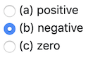

```html
<pl-multiple-choice answers-name="acc" weight="1">
  <pl-answer correct="false">positive</pl-answer>
  <pl-answer correct="true">negative</pl-answer>
  <pl-answer correct="false">zero</pl-answer>
</pl-multiple-choice>
```

#### Customizations

Attribute | Type | Default | Description
--- | --- | --- | ---
`answers-name` | string | — | Variable name to store data in.
`weight` | integer | 1 | Weight to use when computing a weighted average score over elements.
`inline` | boolean | false | List answer choices on a single line instead of as separate paragraphs.
`number-answers` | integer | special | The total number of answer choices to display. Defaults to displaying one correct answer and all incorrect answers.
`fixed-order` | boolean | false | Disable the randomization of answer order.

Inside the `pl-multiple-choice` element, each choice must be specified with 
a `pl-answer` that has attributes:

Attribute | Type | Default | Description
--- | --- | --- | ---
`correct` | boolean | false | Is this a correct answer to the question?

#### Example Implementations

- [`ballToss2`: Dynamically generating choice options](https://github.com/PrairieLearn/PrairieLearn/tree/master/exampleCourse/questions/ballToss2)
- [`positionTimeGraph`: Mathematical symbols in choice options](https://github.com/PrairieLearn/PrairieLearn/tree/master/exampleCourse/questions/positionTimeGraph)

#### See also

- [`pl-checkbox` for allowing **one or more** choices](#pl-checkbox-element)

## `pl-checkbox` element

A `pl-checkbox` element displays a subset of the answers in a random order 
as checkboxes.

#### Sample Element

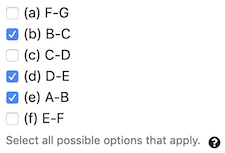

```html
<pl-checkbox answers-name="vpos" weight="1">
  <pl-answer correct="true">A-B</pl-answer>
  <pl-answer correct="true">B-C</pl-answer>
  <pl-answer>               C-D</pl-answer>
  <pl-answer correct="true">D-E</pl-answer>
  <pl-answer>               E-F</pl-answer>
  <pl-answer>               F-G</pl-answer>
</pl-checkbox>
```

#### Customizations

Attribute | Type | Default | Description
--- | --- | --- | ---
`answers-name` | string | — | Variable name to store data in.
`weight` | integer | 1 | Weight to use when computing a weighted average score over elements.
`inline` | boolean | false | List answer choices on a single line instead of as separate paragraphs.
`number-answers` | integer | special | The total number of answer choices to display. Defaults to displaying all answers.
`min-correct` | integer | special | The minimum number of correct answers to display. Defaults to displaying all correct answers.
`max-correct` | integer | special | The maximum number of correct answers to display. Defaults to displaying all correct answers.
`fixed-order` | boolean | false | Disable the randomization of answer order.
`partial-credit` | boolean | false | Enable partial credit scores. By default, the choice of grading method is "all-or-nothing".
`partial-credit-method` | string | 'PC' | Two grading methods for partial credit: 'EDC' (Every Decision Counts) and 'PC' (Percent Correct). See explanation below.
`hide-help-text` | boolean | false | Help text with hint regarding the selection of answers. Popover button describes the selected grading algorithm ('all-or-nothing', 'EDC' or 'PC')
`detailed-help-text` | boolean | false | Display detailed information in help text about the number of options to choose.
`hide-answer-panel` | boolean | false | Option to not display the correct answer in the correct panel.

Inside the `pl-checkbox` element, each choice must be specified with 
a `pl-answer` that has attributes:

Attribute | Type | Default | Description
--- | --- | --- | ---
`correct` | boolean | false | Is this a correct answer to the question?

#### Details

Two grading methods are available when using `partial-credit="true"`:

* `'EDC'` (Every Decision Counts): in this method, the checkbox answers are considered as a list of true/false answers.  If `n` is the total number of answers, each answer is assigned `1/n` points. The total score is the summation of the points for every correct answer selected and every incorrect answer left unselected.

* `'PC'` (Percent Correct): in this method, 1 point is added for each correct answer that is marked as correct and 1 point is subtracted for each incorrect answer that is marked as correct. The final score is the resulting summation of points divided by the total number of correct answers. The minimum final score is set to zero.

#### Example implementations

- [`examplesCheckbox`: Examples of all customization options for the element.](https://github.com/PrairieLearn/PrairieLearn/tree/master/exampleCourse/questions/examplesCheckbox)
- [`chooseMatrices`: Mathematical expressions embedded in answer options](https://github.com/PrairieLearn/PrairieLearn/tree/master/exampleCourse/questions/chooseMatrices)

#### See also

- [`pl-multiple-choice` for allowing only **one** correct choice](#pl-multiple-choice-element)

-----

## `pl-number-input` element

Fill in the blank field that allows for **numeric** value input within specific
tolerances.

#### Sample Element

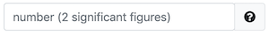

```html
<pl-number-input answers-name="v_avg" comparison="sigfig" digits="2"></pl-number-input>
```

#### Customizations

Attribute | Type | Default | Description
--- | --- | --- | ---
`answers-name` | string | — | Variable name to store data in.
`weight` | integer | 1 | Weight to use when computing a weighted average score over elements.
`correct-answer` | float | special | Correct answer for grading. Defaults to `data["correct_answers"][answers-name]`.
`label` | text | — | A prefix to display before the input box (e.g., `label="$F =$"`).
`suffix` | text | — | A suffix to display after the input box (e.g., `suffix="$\rm m/s^2$"`).
`display` | "block" or "inline" | "inline" | How to display the input field.
`comparison` | "relabs", "sigfig", or "decdig" | "relabs" | How to grade. "relabs" uses relative ("rtol") and absolute ("atol") tolerances. "sigfig" and "decdig" use "digits" significant or decimal digits.
`rtol` | number | 1e-2 | Relative tolerance for `comparison="relabs"`.
`atol` | number | 1e-8 | Absolute tolerance for `comparison="relabs"`.
`digits` | integer | 2 | number of digits that must be correct for `comparison="sigfig"` or `comparison="decdig"`.
`allow-complex` | boolean | False | Whether or not to allow complex numbers as answers. If the correct answer `ans` is a complex object, you should use `import prairielearn as pl` and `data['correct_answer'][answers-name] = pl.to_json(ans)`.
`show-help-text` | boolean | True | Show the question mark at the end of the input displaying required input parameters.
`show-placeholder` | boolean | True | Show the placeholder text that shows the default comparison.
`size` | integer | 35 | Size of the input box.
`show-correct-answer` | boolean | True | Whether to show the correct answer in the submitted answers panel.

#### Example implementations

- [`examplesNumberInput`: Examples of all customization options for the element](https://github.com/PrairieLearn/PrairieLearn/tree/master/exampleCourse/questions/examplesNumberInput)
- [`positionTimeGraph`: Input a numeric value obtained from reading a graph](https://github.com/PrairieLearn/PrairieLearn/tree/master/exampleCourse/questions/positionTimeGraph)
- [`addNumbers`: Random generation and input of numeric values](https://github.com/PrairieLearn/PrairieLearn/tree/master/exampleCourse/questions/addNumbers)
- [`addComplexNumbers`: Random generation and input of complex numbers that use imaginary and real components](https://github.com/PrairieLearn/PrairieLearn/tree/master/exampleCourse/questions/addComplexNumbers)
- [`multiplyTwoNumbers`: Random generation and input of numeric values](https://github.com/PrairieLearn/PrairieLearn/tree/master/exampleCourse/questions/multiplyTwoNumbers)

#### See also

- [`pl-integer-input` for integer input](#pl-integer-input-element)
- [`pl-symbolic-input` for mathematical expression input](#pl-symbolic-input-element)
- [`pl-string-input` for string input](#pl-string-input-element)

-----

## `pl-integer-input` element

Fill in the blank field that requires an **integer** input.

#### Sample Element

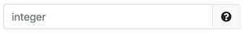

```html
<pl-integer-input answers-name="x"></pl-integer-input>
```

#### Customizations

Attribute | Type | Default | Description
--- | --- | --- | ---
`answers-name` | string | — | Variable name to store data in.
`weight` | integer | 1 | Weight to use when computing a weighted average score over elements.
`correct-answer` | float | special | Correct answer for grading. Defaults to `data["correct_answers"][answers-name]`.
`label` | text | — | A prefix to display before the input box (e.g., `label="$x =$"`).
`suffix` | text | — | A suffix to display after the input box (e.g., `suffix="items"`).
`display` | "block" or "inline" | "inline" | How to display the input field.

#### Example Implementations

- [`addIntegers`: Random generation and input of integer values](https://github.com/PrairieLearn/PrairieLearn/tree/master/exampleCourse/questions/addIntegers)

#### See also

- [`pl-number-input` for numeric input](#pl-number-input-element)
- [`pl-symbolic-input` for mathematical expression input](#pl-symbolic-input-element)
- [`pl-string-input` for string input](#pl-string-input-element)

-----

## `pl-symbolic-input` element

Fill in the blank field that allows for mathematical symbol input.

#### Sample Element

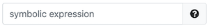

```html
<pl-symbolic-input answers-name="ans"></pl-symbolic-input>
```

#### Customizations

Attribute | Type | Default | Description
--- | --- | --- | ---
`answers-name` | string | — | Variable name to store data in. If the correct answer `ans` is a `sympy` object, you should use `import prairielearn as pl` and `data['correct_answer'][answers-name] = pl.to_json(ans)`.
`weight` | integer | 1 | Weight to use when computing a weighted average score over elements.
`correct-answer` | float | special | Correct answer for grading. Defaults to `data["correct_answers"][answers-name]`.
`label` | text | — | A prefix to display before the input box (e.g., `label="$F =$"`).
`display` | "block" or "inline" | "inline" | How to display the input field.
`variables` | string | — | A comma-delimited list of symbols that can be used in the symbolic expression.
`allow-complex` | boolean | False | Whether complex numbers (expressions with `i` or `j` as the imaginary unit) are allowed.
`imaginary-unit-for-display` | string | `i` | The imaginary unit that is used for display. It must be either `i` or `j`. Again, this is *only* for display. Both `i` and `j` can be used by the student in their submitted answer, when `allow-complex="true"`.

#### Details

Correct answers are best created as `sympy` expressions and converted to json using:

```python
import prairielearn as pl
import sympy

def generate(data):
    sympy.var('x y')
    data['correct_answer']['ans'] = pl.to_json(x + y + 1)
```

It is also possible to specify the correct answer simply as a string, e.g., `x + y + 1`.

Do not include `i` or `j` in the list of `variables` if `allow-complex="true"`. Do not include any other reserved name in your list of `variables` (`e`, `pi`, `cos`, `sin`, etc.) The element code will check for (and disallow) conflicts between your list of `variables` and reserved names.

#### Example implementations

- [`examplesSymbolicInput`: Examples of all customization options for the element.](https://github.com/PrairieLearn/PrairieLearn/tree/master/exampleCourse/questions/examplesSymbolicInput)

#### See also

- [`pl-number-input` for numeric input](#pl-number-input-element)
- [`pl-integer-input` for integer input](#pl-integer-input-element)
- [`pl-string-input` for string input](#pl-string-input-element)

-----

## `pl-string-input` element

Fill in the blank field that allows for **string** value input.

#### Sample Element

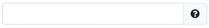

```html
<pl-string-input answers-name="x"></pl-string-input>
```

#### Customizations

Attribute | Type | Default | Description
--- | --- | --- | ---
`answers-name` | string | — | Variable name to store data in.
`weight` | integer | 1 | Weight to use when computing a weighted average score over elements.
`correct-answer` | string | special | Correct answer for grading. Defaults to `data["correct-answers"][answers-name]`.
`label` | text | — | A prefix to display before the input box (e.g., `label="$x =$"`).
`suffix` | text | — | A suffix to display after the input box (e.g., `suffix="items"`).
`display` | "block" or "inline" | "inline" | How to display the input field.
`remove-leading-trailing` | boolean | False | Whether or not to remove leading and trailing blank spaces from the input string.
`remove-spaces` | boolean | False | Whether or not to remove blank spaces from the input string.
`allow-blank` | boolean | False | Whether or not an empty input box is allowed. By default, empty input boxes will not be graded (invalid format).
`placeholder` | text | None | Hint displayed inside the input box describing the expected type of input.

#### Example implementations

- [`examplesStringInput`: Examples of all customization options for the element.](https://github.com/PrairieLearn/PrairieLearn/tree/master/exampleCourse/questions/examplesStringInput)

#### See also

- [`pl-symbolic-input` for mathematical expression input](#pl-symbolic-input-element)
- [`pl-integer-input` for integer input](#pl-integer-input-element)
- [`pl-number-input` for numeric input](#pl-number-input-element)

-----

## `pl-matrix-component-input` element

A `pl-matrix-component-input` element displays a grid of input fields with 
the same shape of the variable stored in `answers-name` 
(only 2D arrays of real numbers can be stored in `answers-name`).

#### Sample Element

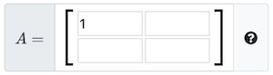

```html
<pl-matrix-component-input answers-name="matrixA" label="$A=$"></pl-matrix-component-input>
```

#### Customizations

Attribute | Type | Default | Description
--- | --- | --- | ---
`answers-name` | string | — | Variable name to store data in.
`weight` | integer | 1 | Weight to use when computing a weighted average score over elements.
`label` | text | — | A prefix to display before the input box (e.g., `label="$F =$"`).
`comparison` | "relabs", "sigfig", or "decdig" | "relabs" | How to grade. "relabs" uses relative ("rtol") and absolute ("atol") tolerances. "sigfig" and "decdig" use "digits" significant or decimal digits.
`rtol` | number | 1e-2 | Relative tolerance for `comparison="relabs"`.
`atol` | number | 1e-8 | Absolute tolerance for `comparison="relabs"`.
`digits` | integer | 2 | number of digits that must be correct for `comparison="sigfig"` or `comparison="decdig"`.
`allow-partial-credit` | boolean | False | Whether or not to allow credit for each correct matrix component. By default, the variable is graded as correct only when all matrix components are correct.
`allow-feedback` | boolean | `allow-partial-credit` | Whether or not to allow feedback indicating which matrix components are incorrect. The default value of `allow-feedback` is the value of `allow-partial-credit`.

#### Details

The question will only be graded when all matrix components are entered.

#### Example Implementations

- [`examplesMatrixComponentInput`: Examples of all customization options for the element.](https://github.com/PrairieLearn/PrairieLearn/tree/master/exampleCourse/questions/MatrixComponentInput)

#### See also 

- [`pl-matrix-input` for a matrix formatted in an implemented programming language](#pl-matrix-input)
- [`pl-number-input` for a single numeric input](#pl-number-input)
- [`pl-symbolic-input` for a mathematical expression input](#pl-symbolic-input)

-----

## `pl-matrix-input` element

A `pl-matrix-input` element displays an input field that accepts a matrix
(i.e., a 2-D array) expressed either in a supported programming language
format (e.g. MATLAB or Python's numpy).

#### Sample Element

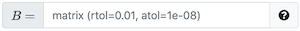

```html
<pl-matrix-input answers-name="matrixB" label="$B=$"></pl-matrix-input>
```

#### Customizations

Attribute | Type | Default | Description
--- | --- | --- | ---
`answers-name` | string | — | Variable name to store data in.
`weight` | integer | 1 | Weight to use when computing a weighted average score over elements.
`label` | text | — | A prefix to display before the input box (e.g., `label="$F =$"`).
`comparison` | "relabs", "sigfig", or "decdig" | "relabs" | How to grade. "relabs" uses relative ("rtol") and absolute ("atol") tolerances. "sigfig" and "decdig" use "digits" significant or decimal digits.
`rtol` | number | 1e-2 | Relative tolerance for `comparison="relabs"`.
`atol` | number | 1e-8 | Absolute tolerance for `comparison="relabs"`.
`digits` | integer | 2 | number of digits that must be correct for `comparison="sigfig"` or `comparison="decdig"`.
`allow-complex` | boolean | False | Whether or not to allow complex numbers as answers. If the correct answer `ans` is a complex object, you should use `import prairielearn as pl` and `data['correct_answer'][answers-name] = pl.to_json(ans)`.

#### Details

Here is an example of valid MATLAB format:
```
[1.23; 4.56]
```

Here is an example of valid Python format:
```
[[1.23], [4.56]]
```

A scalar will be accepted either as a matrix of size $1\times 1$ (e.g., `[1.23]` or `[[1.23]]`) or just as a single number (e.g., `1.23`).

In the answer panel, a `pl-matrix-input` element displays the correct answer, allowing the user to switch between matlab and python format.

In the submission panel, a `pl-matrix-input` element displays either the submitted answer (in the same format that it was submitted, either MATLAB or Python), or a note that the submitted answer was invalid (with an explanation of why).

#### Example implementations

- [`multiplyTwoComplexMatrices`: Example entry of a matrix that uses complex numbers.](https://github.com/PrairieLearn/PrairieLearn/tree/master/exampleCourse/questions/multiplyTwoComplexMatrices)

#### See also

- [`pl-matrix-component-input` for individual input boxes for each element in the matrix](#pl-matrix-component-input)
- [`pl-number-input` for a single numeric input](#pl-number-input)
- [`pl-symbolic-input` for a mathematical expression input](#pl-symbolic-input)

-----

## `pl-file-editor` element

Provides an in-browser file editor that's compatible with the other file elements
and external grading system.

#### Sample Element

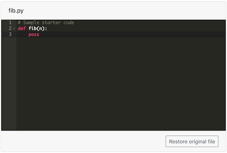

```html
<pl-file-editor
  file-name="fib.py"
  ace-mode="ace/mode/python"
  ace-theme="ace/theme/monokai"
>
def fib(n):
    pass
</pl-file-editor>
```

#### Customizations

Attribute | Type | Default | description
--- | --- | --- | ---
`file-name` | string | - | The name of this file; will be used to store this file in the `_files` submitted answer
`ace-mode` | string | None | Specifies an Ace editor mode to enable things like intelligent code indenting and syntax highlighting; see the full list of modes [here](https://github.com/ajaxorg/ace/tree/master/lib/ace/mode).
`ace-theme` | string | `ace/theme/chrome` | Specifies an Ace editor theme; see the full list of themes [here](https://github.com/ajaxorg/ace/tree/master/lib/ace/theme).
`source-file-name` | string | None | Name of the source file with existing code to be displayed in the browser text editor (instead of writing the existing code between the element tags as illustrated in the above code snippet).

#### Example implementations

- [`fibonacciEditor`: Receive code written in a web browser and automatically grade it.](https://github.com/PrairieLearn/PrairieLearn/tree/master/exampleCourse/questions/fibonacciEditor)

#### See also

- [`pl-file-upload` to receive files as a submission](#pl-file-upload-element)
- [`pl-external-grader-results` to include output from autograded code](#pl-external-grader-results)
- [`pl-code` to display blocks of code with syntax highlighting](#pl-code-element)
- [`pl-string-input` for receiving a single string value](#pl-string-input-element)

-----

## `pl-file-upload` element

Provides a way to accept file uploads as part of an answer. They will be stored
in [the format expected by externally graded questions](externalGrading.md#file-submission-format).

#### Sample Element

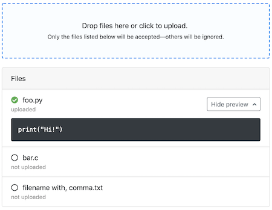

```html
<pl-file-upload file-names="foo.py, bar.c, filename with\, comma.txt"></pl-file-upload>
```

#### Customizations

Attribute | Type | Default | description
--- | --- | --- | ---
`answers-name` | string | \_file | Variable name to store data in. **For externally graded questions, you should rely on the default.**
`file-names` | CSV list | "" | List of files that should and must be submitted. Commas in a filename should be escaped with a backslash, and filenames cannot contain quotes.


#### Example implementations

- [`fibonacciUpload`: Receiving a code file submission and **automatically** grading it.](https://github.com/PrairieLearn/PrairieLearn/tree/master/exampleCourse/questions/fibonacciUpload)
- [`fibonacciUploadManual`: Receiving a code file submission to **manually** grade.](https://github.com/PrairieLearn/PrairieLearn/tree/master/exampleCourse/questions/fibonacciUploadManual)

#### See also

- [`pl-file-editor` to provide an in-browser code environment](#pl-file-editor-element)
- [`pl-external-grader-results` to include output from autograded code](#pl-external-grader-results)
- [`pl-code` to display blocks of code with syntax highlighting](#pl-code-element)
- [`pl-string-input` for receiving a single string value](#pl-string-input-element)

-----

## `pl-threejs` element


This element displays a 3D scene with objects that the student can (optionally) translate and/or rotate. It can be used only for output (e.g., as part of a question that asks for something else to be submitted). Or, it can be used for input (e.g., comparing a submitted pose of the body-fixed objects to a correct orientation). Information about the current pose can be hidden from the student and, if visible, can be displayed in a variety of formats, so the element can be used for many different types of questions.

#### Sample Element


```html
<pl-threejs answer-name="a">
    <pl-threejs-stl file-name="MAKE_Robot_V6.stl" frame="body" scale="0.1"></pl-threejs-stl>
    <pl-threejs-stl file-name="MAKE_Robot_V6.stl" frame="body" scale="0.025" position="[-1,1,2]" orientation="[0,0,30]"></pl-threejs-stl>
    <pl-threejs-txt frame="body" position="[-1,1,2.6]" orientation="[0,0,30]">mini-me</pl-threejs-txt>
</pl-threejs>
```

#### Customizations

Attribute | Type | Default | Description
--- | --- | --- | ---
`answer-name` | string | — | Variable name to store data in.
`body-position` | list | [0, 0, 0] | Initial position of body as `[x, y, z]`.
`body-orientation` | list | special | Initial orientation of body. Defaults to zero orientation (body frame aligned with space frame). Interpretation depends on `body-pose-format`.
`camera-position` | list | [5, 2, 2] | Initial position of camera as `[x, y, z]`.
`body-cantranslate` | boolean | true | If you can translate the body in the UI.
`body-canrotate` | boolean | true | If you can rotate the body in the UI.
`camera-canmove` | boolean | true | If you can move the camera (i.e., change the view) in the UI.
`body-pose-format` | string | rpy | Determines how `body-orientation` is interpreted. If `rpy` then `[roll, pitch, yaw]`. If `matrix` then 3x3 rotation matrix `[[...], [...], [...]]`. If `quaternion` then `[x, y, z, w]`. If `axisangle` then `[x, y, z, theta]` where `x, y, z` are coordinates of axis and `theta` is angle.
`answer-pose-format` | string | rpy | Determines how the answer `data['correct_answer'][answer-name]` is interpreted. If `homogeneous`, then the answer must be a 4x4 homogeneous transformation matrix `[[...], [...], [...], [...]]`. Otherwise, the answer must be a list with two elements. The first element must describe position as `[x, y, z]`. The second element must describe orientation, interpreted based on `answer-pose-format`. If `rpy` then `[roll, pitch, yaw]`. If `matrix` then 3x3 rotation matrix `[[...], [...], [...]]`. If `quaternion` then `[x, y, z, w]`. If `axisangle` then `[x, y, z, theta]` where `x, y, z` are coordinates of axis and `theta` is angle.
`text-pose-format` | string | matrix | Determines how the pose of the body is displayed as text. If `matrix` then position is `[x, y, z]` and orientation is a 3x3 rotation matrix. If `quaternion` then position is `[x, y, z]` and orientation is `[x, y, z, w]`. If `homogeneous` then pose is a 4x4 homogeneous transformation matrix.
`show-pose-in-question` | boolean | true | If the current pose of the body is displayed in the question panel.
`show-pose-in-correct-answer` | boolean | true | If the current pose of the body is displayed in the correct answer panel.
`show-pose-in-submitted-answer` | boolean | true | If the current pose of the body is displayed in the submitted answer panel.
`tol-position` | float | 0.5 | Error in position must be no more than this for the answer to be marked correct.
`tol-rotation` | float | 5.0 | Error in rotation must be no more than this for the answer to be marked correct.
`grade` | boolean | true | If the element will be graded, i.e., if it is being used to ask a question. If `grade` is `false`, then this element will never produce any html in the answer panel or in the submission panel.

A `pl-threejs-stl` element inside a `pl-threejs` element allows you to add a mesh described by an `stl` file to the scene, and has these attributes:

Attribute | Type | Default | Description
--- | --- | --- | ---
`file-name` | string | — | Name of `.stl` file.
`file-directory` | string | clientFilesQuestion | Location of `.stl` file, either `clientFilesCourse` or `clientFilesQuestion`.
`frame` | string | body | Which frame the object is fixed to, either `body` or `space`.
`color` | color | special | Color of object as CSS string, defaults to `#e84a27` if body-fixed and to `#13294b` if space-fixed.
`opacity` | float | special | Opacity of object, defaults to `0.7` if body-fixed and to `0.4` if space-fixed.
`position` | list | [0, 0, 0] | Position of object as `[x, y, z]`.
`orientation` | list | special | Orientation of object. Defaults to zero orientation. Interpretation depends on `format`.
`format` | string | rpy | Determines how `orientation` is interpreted. If `rpy` then `[roll, pitch, yaw]`. If `matrix` then 3x3 rotation matrix `[[...], [...], [...]]`. If `quaternion` then `[x, y, z, w]`. If `axisangle` then `[x, y, z, theta]` where `x, y, z` are coordinates of axis and `theta` is angle.

A `pl-threejs-txt` element inside a `pl-threejs` element allows you to add whatever text appears between the `<pl-threejs-txt> ... </pl-threejs-txt>` tags as a mesh to the scene, and has these attributes:

Attribute | Type | Default | Description
--- | --- | --- | ---
`frame` | string | body | Which frame the object is fixed to, either `body` or `space`.
`color` | color | special | Color of object as CSS string, defaults to `#e84a27` if body-fixed and to `#13294b` if space-fixed.
`opacity` | float | special | Opacity of object, defaults to `0.7` if body-fixed and to `0.4` if space-fixed.
`position` | list | [0, 0, 0] | Position of object as `[x, y, z]`.
`orientation` | list | special | Orientation of object. Defaults to zero orientation. Interpretation depends on `format`.
`format` | string | rpy | Determines how `orientation` is interpreted. If `rpy` then `[roll, pitch, yaw]`. If `matrix` then 3x3 rotation matrix `[[...], [...], [...]]`. If `quaternion` then `[x, y, z, w]`. If `axisangle` then `[x, y, z, theta]` where `x, y, z` are coordinates of axis and `theta` is angle.

#### Details

Note that a 3D scene is also created to show each submitted answer. This means
that if there are many submitted answers, the page will load slowly.

#### Example implementations

- [`rotateObject`: Example rotation of a robot](https://github.com/PrairieLearn/PrairieLearn/tree/master/exampleCourse/questions/rotateObject)

#### See also

- [External: `three.js` JavaScript library](https://threejs.org/)

## Decorative Elements

-----

## `pl-code` element

Display an embedded or file-based block of code with syntax highlighting and
line callouts.

#### Sample Element


```html
<pl-code language="python">
def square(x):
    return x * x
</pl-code>
```

#### Customizations

Attribute | Type | Default | Description
--- | --- | --- | ---
`language` | string | — | The programming language syntax highlighting to use. See below for options.
`no-highlight` | boolean | false | Disable highlighting.
`source-file-name` | text | - | Name of the source file with existing code to be displayed as a code block (instead of writing the existing code between the element tags as illustrated in the above code snippet).
`prevent-select` | booelan | false | Applies methods to make the source code more difficult to copy, like preventing selection or right-clicking. Note that the source code is still accessible in the page source, which will always be visible to students.
`highlight-lines` | text | - | Apply a distinctive background highlight the specified lines of code. Accepts input like `4`, `1-3,5-10`, and `1,2-5,20`.
`highlight-lines-color` | text | `#b3d7ff` | Specifies the color of highlighted lines of code.

#### Details

The `language` can be one of the following values.

`language` value | Description
--- | ---
`armasm` | ARM Assembly
`bash` | Bash
`cpp` | C++
`csharp` | C#
`css` | CSS
`excel` | Excel
`fortran` | Fortran
`go` | Go
`haskell` | Haskell
`html` | HTML,XML
`ini` | Ini
`java` | Java
`javascript` | JavaScript
`json` | JSON
`julia` | Julia
`makefile` | Makefile
`markdown` | Markdown
`mathematica` | Mathematica
`matlab` | Matlab
`mipsasm` | MIPS Assembly
`objectivec` | Objective-C
`ocaml` | OCaml
`perl` | Perl
`php` | PHP
`python` | Python
`r` | R
`ruby` | Ruby
`shell` | Shell Session
`sql` | SQL
`tex` | TeX
`x86asm` | Intel x86 Assembly
`yaml` | YAML

Please let the PrairieLearn developers know if you need a language that is not on the list above (any [highlight.js](https://highlightjs.org) language could be added).

#### Example implementations

- [`codeHighlight`: Highlight specific lines of the code chunk.](https://github.com/PrairieLearn/PrairieLearn/tree/master/exampleCourse/questions/codeHighlight)
- [`examplesAddCodeFromFile`: Import code from a source file.](https://github.com/PrairieLearn/PrairieLearn/tree/master/exampleCourse/questions/examplesAddCodeFromFile)

#### See also

- [`pl-file-editor` to provide an in-browser code environment](#pl-file-editor-element)

-----

## `pl-figure` element

Display a statically or dynamically generated image.

#### Sample Element


```html
<!-- show a figure from an existing file -->
<pl-figure file-name="figure.png" directory="clientFilesCourse"></pl-figure>

<!-- show a figure from a file that is generated by code -->
<pl-figure file-name="figure.png" type="dynamic"></pl-figure>
```

#### Customizations

Attribute | Type | Default | Description
--- | --- | --- | ---
`file-name` | string | — | Name of image file.
`type` | text | 'static' | Type of file, either 'static' (an existing file) or 'dynamic' (a file generated by element or server code).
`directory` | text | "clientFilesQuestion" | The directory that contains the file, either 'clientFilesQuestion' or 'clientFilesCourse' (see [client and server files](clientServerFiles.md)). A directory cannot be specified if `type='dynamic'`.
`width` | number | `None` | Width of image (e.g., '250px').

#### Details

If `type="dynamic"`, then the contents of the image file must be returned by a function `file()` that is located either in element code or in `server.py`. The contents must be a string (with utf-8 encoding), a bytes-like object, or a file-like object. The filename will be available to this function as `data['filename']`. For example, this code might appear in `server.py` to generate a file called `figure.png`:

```python
def file(data):
    if data['filename']=='figure.png':
        plt.plot([1,2,3],[3,4,-2])
        buf = io.BytesIO()
        plt.savefig(buf,format='png')
        return buf
```

If `file()` does not return anything, it will be treated as if `file()` returned the empty string.

#### Example implementations

- [`functionValueFromPlot`: Dynamically generate an image and have students input value.](https://github.com/PrairieLearn/PrairieLearn/tree/master/exampleCourse/questions/functionValueFromPlot)
- [`positionTimeGraph`: Include a static graph image.](https://github.com/PrairieLearn/PrairieLearn/blob/master/exampleCourse/questions/positionTimeGraph/)
- [`whichName`: Use a static image that is randomly selected from a list of files.](https://github.com/PrairieLearn/PrairieLearn/tree/master/exampleCourse/questions/whichName)

#### See also

- [`pl-file-download` to allow for files to be downloaded.](#pl-file-download-element)
- [`pl-code` to show code as text with syntax highlighting.](#pl-code-element)

----

## `pl-file-download` element

Provide a download link to a static or dynamically generated file.

#### Sample Element

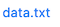

```html
<!-- allow students to download an existing file -->
<pl-file-download file-name="data.txt" directory="clientFilesCourse"></pl-file-download>

<!-- allow students to download a file that is generated by code -->
<pl-file-download file-name="data.txt" type="dynamic"></pl-file-download>

<!-- allow students to open an existing file in a new tab -->
<pl-file-download file-name="data.txt" directory="clientFilesCourse" force-download="false"></pl-file-download>
```

#### Customizations

Attribute | Type | Default | Description
--- | --- | --- | ---
`file-name` | string | — | Name of file to download.
`label` | text | file-name | Alternate text for file download link (e.g., `label="click here to download"`).
`type` | text | "static" | Type of file, either "static" (an existing file) or "dynamic" (a file generated by element or server code).
`directory` | text | "clientFilesQuestion" | The directory that contains the file, either "clientFilesQuestion" or "clientFilesCourse" (see [client and server files](clientServerFiles.md)). A directory cannot be specified if `type="dynamic"`.
`force-download` | boolean | true | Force a file download. Otherwise, allow the browser to open the file in a new tab.

#### Details

If `type="dynamic"`, then the contents of the file must be returned by a function `file()` that is located either in element code or in `server.py`. The contents must be a string (with utf-8 encoding), a bytes-like object, or a file-like object. The filename will be available to this function as `data['filename']`. For example, this code might appear in `server.py` to generate a file called `data.txt`:

```python
def file(data):
    if data['filename']=='data.txt':
        return 'This data is generated by code.'
```

If `file()` does not return anything, it will be treated as if `file()` returned the empty string.

#### Example implementations

- [`downloadFile`: Provide different download file options.](https://github.com/PrairieLearn/PrairieLearn/blob/master/exampleCourse/questions/downloadFile/)

#### See also

- [`pl-figure` to display images.](#pl-figure-element)
- [`pl-code` to show code as text with syntax highlighting.](#pl-code-element)

-----

## `pl-variable-output` element

Displays a list of variables that are formatted for import into the
supported programming languages (e.g. MATLAB, Mathematica, or Python).

#### Sample Element

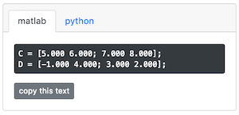


```html
<pl-variable-output digits="3">
    <variable params-name="A">A</variable>
    <variable params-name="B">B</variable>
</pl-variable-output>
```

#### Customizations

Attributes for `<pl-variable-output>`:

Attribute | Type | Default | Description
--- | --- | --- | ---
`digits` | integer | — | Number of digits to display after the decimal.
`default-tab` | string | 'matlab' | Select the active tab.
`show-matlab` | boolean | True | Toggles the display of the Matlab tab.
`show-mathematica` | boolean | True | Toggles the display of the Mathematica tab.
`show-python` | boolean | True | Toggles the display of the Python tab.

Attributes for `<variable>` (one of these for each variable to display):

Attribute | Type | Default | Description
--- | --- | --- | ---
`params-name` | string | — | Name of variable in `data['params']` to display.
`comment` | string | — | Comment to add after the displayed variable.
`digits` | integer | — | Number of digits to display after the decimal for the variable.


#### Details

This element displays a list of variables inside `<pre>` tags that are formatted for import into either MATLAB, Mathematica, or Python (the user can switch between them). Each variable must be either a scalar or a 2D numpy array (expressed as a list). Each variable will be prefixed by the text that appears between the `<variable>` and `</variable>` tags, followed by ` = `.

Here is an example of MATLAB format:
```
A = [1.23; 4.56]; % matrix
```

Here is an example of the Mathematica format:
```
A = [1.23; 4.56]; (* matrix *)
```

Here is an example of python format:
```
import numpy as np

A = np.array([[1.23], [4.56]]) # matrix
```

If a variable `v` is a complex object, you should use `import prairielearn as pl` and `data['params'][params-name] = pl.to_json(v)`.


#### Example implementations

- [`examplesMatrixComponentInput`: Shows code output style for a matrix.](https://github.com/PrairieLearn/PrairieLearn/blob/master/exampleCourse/questions/examplesMatrixComponentInput/)
- [`multiplyTwoComplexMatrices`: Sample showing how two complex matrices are displayed.](https://github.com/PrairieLearn/PrairieLearn/blob/master/exampleCourse/questions/multiplyTwoComplexMatrices)

#### See also

- [`pl-matrix-latex` for displaying the matrix using LaTeX commands.](#pl-matrix-latex-element)
- [`pl-matrix-component-input` for individual input boxes for each element in the matrix](#pl-matrix-component-input-element)
- [`pl-matrix-input` for input values formatted in a supported programming language.](#pl-matrix-input-element)


-----

## `pl-matrix-latex` element

Displays a matrix written in latex using mathjax.

#### Customizations

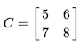

```html
<pl-matrix-latex params-name="A"></pl-matrix-latex>
```

Attribute | Type | Default | Description
--- | --- | --- | ---
`params-name` | string | — | Name of variable in `data['params']` to display.
`presentation-type` | string | `'f'` | Number display format. If `presentation-type` is `'sigfig'`, each number is formatted using the `to_precision` module to `digits` significant figures.  Otherwise, each number is formatted as `'{:.{digits}{presentation-type}}'`.
`digits` | integer | `"2"` | Number of digits to display according to the choice of `presentation-type`


#### Details

The variable in `data['params']` must be a scalar or 2D numpy array of numbers.

If the variable is a scalar, `pl-matrix-latex` returns the scalar as a string not wrapped in brackets.

If the variable is a numpy 2D array, `pl-matrix-latex` returns a string with the format:
    ` \begin{bmatrix} ... & ... \\ ... & ... \end{bmatrix}`

For example, if we want to display the following matrix operations
```
x = [A][b] + [c]
```
we write

```html
${\bf x} = <pl-matrix-latex params-name="A" digits="1"></pl-matrix-latex>
<pl-matrix-latex params-name="b" digits="1"></pl-matrix-latex>
+ <pl-matrix-latex params-name="c" digits="0"></pl-matrix-latex>$
```

#### Example implementations

- [`examplesMatrixLatex`: Provides examples of all customization options for the element.](https://github.com/PrairieLearn/PrairieLearn/tree/master/exampleCourse/questions/examplesMatrixLatex)
- [`chooseMatrices`: Example of matrices being displayed in a multiple-selection problem.](https://github.com/PrairieLearn/PrairieLearn/tree/master/exampleCourse/questions/chooseMatrices)

#### See also

- [`pl-variable-output` for displaying the matrix in a supported programming language.](#pl-variable-output-element)
- [`pl-matrix-component-input` for individual input boxes for each element in the matrix](#pl-matrix-component-input-element)
- [`pl-matrix-input` for input values formatted in a supported programming language.](#pl-matrix-input-element)

-----

## `pl-prairiedraw-figure` element

Create and display a prairiedraw image.

#### Sample Element

```html
<pl-prairiedraw-figure script-name="drawFigure.js" param-names="r1,r2,isHorizontal" width="900" height="600" />
```

#### Customizations

Attribute | Type | Default | Description
--- | --- | --- | ---
`script-name` | string | - | Name of PrairieDraw script.
`param-names` | string | `None` | Comma-separated list of parameters to make available to PrairieDraw.
`width` | integer | 500 | Width of the drawing element.
`height` | integer | 300 | Height of the drawing element.

#### Details

The provided `script-name` corresponds to a file located within the director for the question. Parameter names are keys stored in `data["params"]` in `server.py` (i.e., those available for templating within `question.html`).

#### Example implementations

- [`examplesPrairieDrawFigure`: Rendering shapes with PrairieDraw](https://github.com/PrairieLearn/PrairieLearn/blob/6b15d697c0dfa93b574ef1b8950f6cd3647cb573/exampleCourse/questions/examplesPrairieDrawFigure/)

#### See also

- [PrairieDraw graphics documentation](PrairieDraw.md)

-----

## `pl-graphviz-render` element

Using the [viz.js](https://github.com/mdaines/viz.js/) library, create 
Graphviz DOT visualizations .

#### Sample Element

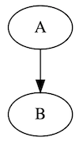

```html
<pl-graphviz-render>
digraph G {
  A -> B
}
</pl-graphviz-render>
```

#### Customizations

Attribute | Type | Default | Description
--- | --- | --- | ---
`engine` | string | dot | The rendering engine to use; supports `circo`, `dot`, `fdp`, `neato`, `osage`, and `twopi`.

#### Example implementations

- [`graphvizRender`: Sample creation of a graphviz graphic.](https://github.com/PrairieLearn/PrairieLearn/tree/master/exampleCourse/questions/graphvizRender)

#### See also

- [External: `viz.js` graphing library](https://github.com/mdaines/viz.js/)
- [`pl-figure` for displaying static or dynamically generated graphics.](#pl-figure-element)
- [`pl-file-download` for allowing either static or dynamically generated files to be downloaded.](#pl-file-download-element)

-----

## Conditional Elements

## `pl-question-panel` element

Displays the contents of question directions.

#### Sample Element

```html
<pl-question-panel>
  This is question-panel text.
</pl-question-panel>
```

### Details

Contents are only shown during question input portion. When a student
either makes a submission or receives the correct answer, the information 
between these tags is hidden. If content exists outside of a question panel, 
then it will be displayed alongside or answer.

#### Example implementations

- [`addNumbers`: Providing directions for question.](https://github.com/PrairieLearn/PrairieLearn/tree/master/exampleCourse/questions/addNumbers/)

#### See also

- [`pl-submission-panel` for changing how a submitted answer is displayed.](#pl-submission-panel-element)
- [`pl-answer-panel` for displaying the question's solution.](#pl-answer-panel-element)

-----

## `pl-submission-panel` element

Customizes how information entered by a user is displayed before grading.

#### Sample Element

```html
<pl-submission-panel>
  This is submission-panel text.
</pl-submission-panel>
```

### Details

Contents are only shown after the student has submitted an answer. This answer
may be correct, incorrect, or invalid.

#### Example implementations

- [`addBinary`: Custom formatting for answer input when using a non-PrairieLearn element.](https://github.com/PrairieLearn/PrairieLearn/tree/master/exampleCourse/questions/addBinary)
- [`fibonacciUpload`: Displaying a students code file submitted.](https://github.com/PrairieLearn/PrairieLearn/tree/master/exampleCourse/questions/fibonacciUpload)
- [`fibonacciEditor`: Displaying code written by a student in-browser.](https://github.com/PrairieLearn/PrairieLearn/tree/master/exampleCourse/questions/fibonacciEditor)

#### See also

- [`pl-answer-panel` for displaying the question's solution.](#pl-answer-panel-element)
- [`pl-external-grader-results` for showing the results from an externally graded code question.](#pl-external-grader-results-element)

-----


## `pl-answer-panel` element

Provide information regarding the question answer after the student is unable to
receive further answers for grading.

#### Sample Element

```html
<pl-answer-panel>
  This is answer-panel text.
</pl-answer-panel>
```

### Details

Contents are only displayed when the answer panel is requested. 
Common reasons that trigger the display of this element are:

- The question is fully correct
- There are no more submission attempts
- The time limit for the assessment has expired.

#### Example implementations

- [`addBinary`: Displaying the correct answer.](https://github.com/PrairieLearn/PrairieLearn/tree/master/exampleCourse/questions/addBinary)

#### See also

- [`pl-submission-panel` for changing how a submitted answer is displayed.](#pl-submission-panel-element)
- [`pl-external-grader-results` for showing the results from an externally graded code question.](#pl-external-grader-results-element)


-----


## `pl-external-grader-results` element

Displays results from externally-graded questions. 

#### Sample Element

```html
<pl-external-grader-results></pl-external-grader-results>
```

### Details

It expects results to follow [the reference schema for external grading results](externalGrading.md#grading-result).

### Example Implementations

- [`fibonacciUpload`: Displaying results from grading an uploaded code file.](https://github.com/PrairieLearn/PrairieLearn/tree/master/exampleCourse/questions/fibonacciUpload)
- [`fibonacciEditor`: Displaying results from grading code written in-browser.](https://github.com/PrairieLearn/PrairieLearn/tree/master/exampleCourse/questions/fibonacciEditor)

### See also

- [External Grading Reference Schema](externalGrading.md#grading-result)

----------

## Deprecated Elements

## `pl-variable-score` element

Display the partial score for a specific answer variable.

#### Sample Element

```html
<pl-variable-score answers-name="v_avg"></pl-variable-score>
```

#### Customizations

Attribute | Type | Default | Description
--- | --- | --- | ---
`answers-name` | string | — | Variable name to display score for.
