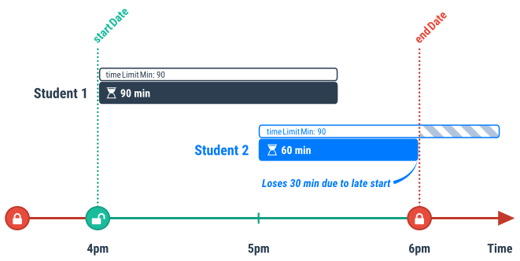

# Access control to course instances and assessments

By default, course instances and assessments are only accessible to [course staff](course.md#course-staff). To grant access to students, the `allowAccess` option can be used in the `infoCourseInstance.json` or `infoAssessment.json` files.

## Two level of access control for assessments

In PrairieLearn there are two levels of access control for students to gain access to assessments:

1. First, a student must have access to the **course instance**. This access is granted with the `allowAccess` rules in [infoCourseInstance.json](courseInstance.md). Giving a student access to a course instance allows the student to enroll in the course instance, but does not by itself grant them access to any assessments in the course instance.

2. Second, a student must also have access to the specific **assessment**. This access is granted with the `allowAccess` rules in [infoAssessment.json](assessment.md). Even if a student has been granted access to an assessment, however, they will only be able to actually access it if they also have access to the course instance (see previous item).

## `allowAccess` format

The general format of `allowAccess` is:

```json
"allowAccess": [
    { <accessRule1> },
    { <accessRule2> },
    { <accessRule3> }
],
```

Each `accessRule` is an object that specifies a set of circumstances under which the assessment is accessible to students. If any of the access rules gives access, then the assessment is accessible. Each access rule can have one or more restrictions as follows. The "courseInstance" and "assessment" columns indicate whether the restiction is available for the respective objects.

| Access restriction                                                  | courseInstance | assessment | Meaning                                                                                                    | Example                                                 |
| ------------------------------------------------------------------- | -------------- | ---------- | ---------------------------------------------------------------------------------------------------------- | ------------------------------------------------------- |
| `uids`                                                              | ✓              | ✓          | Require one of the UIDs in the array to access.                                                            | `"uids": ["mwest@illinois.edu", "zilles@illinois.edu"]` |
| [`startDate`](#dates)                                               | ✓              | ✓          | Only allow access after this date.                                                                         | `"startDate": "2015-01-19T00:00:01"`                    |
| [`endDate`](#dates)                                                 | ✓              | ✓          | Only access access before this date.                                                                       | `"endDate": "2015-05-13T23:59:59"`                      |
| [`institution`](#institutions)                                      | ✓              |            | Only people from this institution (or "Any" or "LTI").                                                     | `"institution": "UIUC"`                                 |
| [`mode`](#server-modes)                                             |                | ✓          | Only allow access from this server mode.                                                                   | `"mode": "Exam"`                                        |
| [`credit`](#credit)                                                 |                | ✓          | Maximum credit as percentage of full credit (can be more than 100).                                        | `"credit": 100`                                         |
| [`timeLimitMin`](#time-limits)                                      |                | ✓          | Time limit in minutes to complete an assessment (only for Exams).                                          | `"timeLimitMin": 60`                                    |
| [`password`](#passwords)                                            |                | ✓          | Password required to start an assessment (only for Exams).                                                 | `"password": "mysecret"`                                |
| [`examUuid`](#exam-uuids)                                           |                | ✓          | PrairieTest UUID for the exam that students must register for.                                             | `"examUuid": "5719ebfe-ad20-42b1-b0dc-c47f0f714871"`    |
| [`showClosedAssessment`](#showinghiding-closed-assessments)         |                | ✓          | Whether to allow viewing of assessment contents when closed (default `true`).                              | `"showClosedAssessment": false`                         |
| [`showClosedAssessmentScore`](#showinghiding-all-score-information) |                | ✓          | Whether to allow viewing of the score of a closed assessment (default `true`).                             | `"showClosedAssessmentScore": false`                    |
| [`active`](#active-assessments)                                     |                | ✓          | Whether the student can create a new assessment instance and submit answers to questions (default `true`). | `"active": false`                                       |

Each access rule will only grant access if all of the restrictions are satisfied.

In summary, `allowAccess` uses the algorithm:

```
each accessRule is True if (restriction1 AND restriction2 AND restriction3)
allowAccess is True if (accessRule1 OR accessRule2 OR accessRule3)
```

If multiple access rules are satisfied then the highest `credit` value is taken from them. Access rules without an explicit `credit` value have credit of 0, meaning they allow viewing of the assessment but not doing questions for credit.

Access rules can also contain the deprecated `role` property. This is now ignored and has no effect. Any access rules containing a `role` of `TA` or `Instructor` should be deleted. Course staff are now managed on the ["Staff" tab](course.md#course-staff).

## Dates

All dates are specified in the format "YYYY-MM-DDTHH:MM:SS" using 24-hour times (this is the [RFC 3339](https://www.ietf.org/rfc/rfc3339.txt) profile of [ISO 8601](https://en.wikipedia.org/wiki/ISO_8601)). All times are in the [timezone of the course instance](courseInstance.md#timezone).

If you want to include full days, then it is generally best to start at 1 second after midnight, and end at 1 second before midnight. This avoids any confusion around the meaning of times exactly at midnight. For example, start at `2015-04-05T00:00:01` and end at `2015-04-07T23:59:59` for the 3-day window from April 5th to April 7th inclusive.

## Institutions

Every course belongs to an **institution** and by default access is only allowed for students from that institution. This can be overridden to either provide access to students from all institutions (`"institution": "Any"`) or to allow access from a particular institution (e.g., `"institution": "UIUC"`). The list of available institutions is configured by the PrairieLearn administrators.

## Server modes

Each user accesses the PrairieLearn server in a `mode`, as listed below. This can be used to restrict access to assessments based on the current mode. The `mode` setting of an access rule has the following effect:

| Mode        | When is access allowed?                                                                                                                                                                                                          |
| ----------- | -------------------------------------------------------------------------------------------------------------------------------------------------------------------------------------------------------------------------------- |
| `Public`    | Access is normally allowed, but is blocked when the student is signed in for an exam in the Computer-Based Testing Facility (CBTF).                                                                                              |
| `Exam`      | Access is normally blocked, and is only allowed when the student is signed in to the Computer-Based Testing Facility (CBTF). The `examUuid` should also be specified in the same access rule to limit access to a specific exam. |
| no mode set | Access is allowed anytime, both during CBTF exams and outside of exams.                                                                                                                                                          |

In general usage it is best to set `"mode": "Public"` for any homework (assessments that students should do at home or without special access control), and to set both `"mode": "Exam"` and `"examUuid"` for exams in the Computer-Based Testing Facility (CBTF). This will make it so that exams are only accessible in the CBTF, and homework is _not_ accessible during exams.

## Credit

When the available credit is less than 100%, the percentage score is calculated as `min(credit, points / maxPoints * 100)`. However, the student's percentage score will never decrease, so if they've already earned a higher percentage score then they will keep it. For example, if `credit = 80` and `maxPoints = 10`, then when a student has `points = 8` then they will have a percentage score of 80%, and when they have `points = 9` or `points = 10` they will still have a percentage score of 80%.

When the available credit is more than 100%, then the percentage score is calculated as `points / maxPoints * 100` when `points < maxPoints`. However, if `points = maxPoints` then the percentage score is taken to be the credit value. For example, if `credit = 120` then the student will see their percentage score rise towards 100% as their `points` increase towards `maxPoints`, and then when their `points` reaches `maxPoints` their percentage score will suddenly jump to 120%. If [`maxBonusPoints`](assessment.md#assessment-points) is used, and the student is able to obtain points above `maxPoints`, then the student's percentage score will be based on this credit as a percentage, i.e., their score will be computed as `credit * points / maxPoints`. For example, if `maxPoints = 10`, `maxBonusPoints = 2`, `credit = 120` and the student obtained 11 points, their score will be `120 * 11 / 10 = 132%`.

## Time limits

For students taking remote exams it can be helpful to have an enforced time limit. This can be done with an access rule like:

```json
"allowAccess": [
    {
        "startDate": "2015-01-19T16:00:00",
        "endDate": "2015-01-19T18:00:00",
        "timeLimitMin": 90,
        "credit": 100
    }
]
```

The above example will give students 90 minutes for this exam, and they must start (and complete) within the date limits. If a student starts the exam close enough to `endDate` such that the remaining time to `endDate` is less than `timeLimitMin`, then the exam's countdown timer will be initialized with the remaining time to `endDate` (minus a 1-minute buffer), not `timeLimitMin`. See the following diagram for an illustration of this.



**Note that time limits should not be set for exams in the CBTF (Computer-Based Testing Facility). Instead, such exams should set `"mode": "Exam"`, in which case `timeLimitMin` will have no effect and the time limits will be enforced by PrairieTest.**

### Time limit adjustments for open assessments

Changes to the time limits in the `infoAssessment.json` file only take effect before an assessment is started. Once a student opens an assessment and creates an instance, the time limit for that assessment will be set based on the time limit rules at the time the assessment started. In some scenarios, instructors or proctors may need to change the time limit allotted to individual students or for all students with an open assessment instance. This change could be due to errors in the original configuration, unexpected events (e.g., power outages or scheduling problems), or concessions.

On the Staff View for the assessment, select the Students tab. This tab will show a list of all students that have started the assessment. The "Remaining" column will include one of the following values:

- The value "Closed" indicates that the student has already finished the assessment, that their time ran out, or ([for exam assessments with `autoClose` set as `true`](assessment.md#auto-closing-exam-assessments)) that the student was inactive for over six hours. Students do not have the ability to submit answers for these assessments.
- The value "Open (no time limit)" indicates that the assessment is open and has no time limit (other than the `autoClose` setting listed above). Students are able to submit answers for these assessments.
- The value "Expired" indicates that the student's time limit has ran out, but the assessment was not yet closed. This may be due to the student having closed the assessment without selecting the Finished button, or because the time limit was recently changed and the student's browser has not yet updated its time limit. Students will get a message that their timer has run out as soon as they try to open the assessment, and will be unable to submit further answers.
- A value indicating a number of minutes indicates the remaining time until the exam is automatically closed. Students are able to submit answers until this time expires. Note that this time is computed when the page is loaded, so to get an updated time, the page must be refreshed.

An edit button is presented inside the "Remaining" tab for each student, which should allow proctors to modify the time limit for a student. For instances with no time limit, this action allows the proctor to set the total time limit (based on the time the student started the assessment) or the remaining time (from the current time). For instances with a set time limit, in addition to these two options, the action also allows the instructor to add or subtract time from the current limit, or to remove the time limit. An option to set the time limit as Expired is also available, which will cause the timer to be set to the current time, and in effect block any further submissions by the student. Changing the time limit will re-open an assessment if it has been closed already.

It is also possible to change the time limit for all instances, using the **Action for all instances** button on the top-right corner of the table. It advisable that any changes done to all instances take into consideration students with different time limits (e.g., students with assessibility concessions). One option available for changing the time limit is the option to add/subtract a specific percentage from the current total time limit for all students. This option allows proctors to maintain the concession percentage for students with a differential time limit.

## Passwords

Remote or online exams sometimes use a “proctor password” to control access to Exams. This can be enabled with an access rule like:

```json
"allowAccess": [
    {
        "mode": "Public",
        "startDate": "2015-01-19T00:00:01",
        "endDate": "2015-05-13T23:59:59",
        "password": "mysecret",
        "credit": 100
    }
]
```

Before a student can do the exam, a proctor will need to type the phrase `mysecret` into the password field on the exam start page.

## Exam UUIDs

To require that students are taking a particular exam in the Computer-Based Testing Facility (CBTF), the `examUuid` should be set to the UUID value from PrairieTest. For example:

```
"allowAccess": [
    {
        "mode": "Exam",
        "examUuid": "5719ebfe-ad20-42b1-b0dc-c47f0f714871",
        "credit": 100
    }
]
```

Note that in this case the `startDate` and `endDate` should _NOT_ be specified. These will be automatically determined by PrairieTest and should not be set in PrairieLearn.

## Showing/hiding closed assessments

When using [time limits](#time-limits), an assessment will "close" when the time limit runs out. When an assesment closes it automatially grades all saved answers and compute the new total score. By default, at this point students can still view the entire exam, see which questions they got correct/incorrect, and look at the questions themselves.

To block students from viewing closed assessment details, set `"showClosedAssessment": false` in the `allowAccess` rule, like this:

```json
"allowAccess": [
    {
        "startDate": "2015-01-19T00:00:01",
        "endDate": "2015-05-13T23:59:59",
        "timeLimitMin": 50,
        "showClosedAssessment": false,
        "credit": 100
    },
    {
        "active": false,
        "showClosedAssessment": false
    }
]
```

Note that the `showClosedAssessment` statement is listed twice above, once while the assessment is in progress (`startDate` to `endDate`) and once in a second rule that will take effect after the `endDate`. The additional `"active": false` restriction prevents students from starting the exam after the `endDate`.

The `showClosedAssessment` access rule restriction is only really useful in conjunction with [time limits](#time-limits). It is common to pair `"showClosedAssessment": false` with [disabled real-time grading](assessment.md#disabling-real-time-grading).

## Showing/hiding all score information

When setting `showClosedAssessment` to `false` students will still by default still be able to see their assessment score immediately after submitting the exam.

To block students from viewing closed assessment scores, set `"showClosedAssessmentScore": false` in the `allowAccess` rule, like this:

```json
"allowAccess": [
    {
        "startDate": "2015-01-19T00:00:01",
        "endDate": "2015-05-13T23:59:59",
        "timeLimitMin": 50,
        "showClosedAssessment": false,
        "showClosedAssessmentScore": false,
        "credit": 100
    },
    {
        "active": false,
        "showClosedAssessment": false,
        "showClosedAssessmentScore": false
    }
]
```

Note that the `showClosedAssessment` and `showClosedAssessmentScore` statements are listed twice above, once while the assessment is in progress (`startDate` to `endDate`) and once in a second rule that will take effect after the `endDate`. The additional `"active": false` restriction prevents students from starting the exam after the `endDate`.

The `showClosedAssessmentScore` access rule restriction is often used in conjunction with [disabling real-time grading](assessment.md#disabling-real-time-grading) and setting `"showClosedAssessment": false`. It may also be used in assessments with [manual grading](manualGrading/index.md), to hide the assessment grade until all students have been graded.

## Active assessments

The `active` access rule restriction is useful for allowing students to see what assessments they have coming up. It should also be used when [returning exams to students](faq.md#how-do-i-give-students-access-to-view-their-exams-after-they-are-over).

By default, the `active` property in an access rule is `true`. This means that, if there is an access rule that applies at a particular time/context, students can start the assessment, create new assessment instances, and submit answers to questions.

If there is no applicable access rule at a particular time/context, students will not be able to view the assessment, and it won't appear on their Assessments page. They will only be able to see their grade for the assessment in the gradebook.

If `active` is set to `false` in an access rule, students will still be able to see the assessment on the Assessments page, but they cannot start the assessment, create a new assessment instance, or submit answers to questions. If an assessment is currently not active but will be in the future, students can see when the assessment will become active by looking at the `Available credit` column on the Assessments page.

If `active` is set to `false` in an access rule, the available `credit` cannot be set to any value other than 0 (the default value).

Note that when `"active": false` is used to allow students to review their work after they've finished the assessment, students can still access and modify files in any [workspaces](workspaces/index.md) associated with questions on the assessment. However, they will not be able to submit any changed workspace files for grading.

An example of the `active` access rule restriction is shown below:

```json
"allowAccess": [
    {
        "startDate": "2015-02-16T00:00:01",
        "endDate": "2015-02-16T23:59:59",
        "timeLimitMin": 50,
        "credit": 100
    },
    {
        "startDate": "2015-01-01T00:00:01",
        "endDate": "2015-02-15T23:59:59",
        "active": false
    }
]
```

In the example above, from January 1st to February 15th, students can see the assessment on the Assessments page but cannot begin the assessment. They will see a message saying that the assessment will be available on February 16th. The first access rule applies on February 16th, and since `active` is `true` (by default), students can start the assessment and submit answers to questions on that day.

## Course instance example

```json
"allowAccess": [
    {
        "startDate": "2014-08-19T00:00:01",
        "endDate": "2014-12-22T23:59:59"
    }
]
```

The above `allowAccess` rule is appropriate for an `infoCourseInstance.json` file. It says that students have access from Aug 19th to Dec 22nd.

## Exam example

```json
"allowAccess": [
    {
        "mode": "Exam",
        "credit": 100,
        "startDate": "2014-09-07T00:00:01",
        "endDate": "2014-09-10T23:59:59"
    },
    {
        "mode": "Exam",
        "uids": ["student1@illinois.edu", "student2@illinois.edu"],
        "credit": 100,
        "startDate": "2014-09-12T00:00:01",
        "endDate": "2014-09-12T23:59:59"
    }
],
```

The above `allowAccess` directive is appropriate for an `Exam` assessment, and means that this assessment is available under two different circumstances and always for full credit. First, any student can access this assessment in `Exam` mode from Sept 7th to Sept 10th. Second, there are two specific students who have access to take the exam on Sept 12th.

## Exam with remote students example

**See [Remote Exams](remoteExams.md) for more detailed examples.**

```json
"allowAccess": [
    {
        "mode": "Exam",
        "credit": 100,
        "examUuid": "5719ebfe-ad20-42b1-b0dc-c47f0f714871"
    },
    {
        "uids": ["student1@illinois.edu", "student2@illinois.edu"],
        "credit": 100,
        "startDate": "2014-09-31T11:00:00",
        "endDate": "2014-09-31T11:59:59",
        "timeLimitMin": 50
    }
],
```

The above `allowAccess` directive is appropriate for an `Exam` being taken by on-campus students in the CBTF and by remote students. First, anyone (i.e., on-campus students) can access the assessment in the CBTF (`"mode": "Exam"`) for full credit. Second, a defined set of students (remote students) can take the exam for full credit on Sept 10th. For the off-campus students we set a time limit (50 minutes). For on-campus students no time limit should be given because the time limit is enforced by the CBTF proctors.

The student's access will expire if they exceed the `timeLimitMin` minute duration of the exam or go past the configured `endDate` - whichever comes first. Time limits are visible to the student during the exam; endDate configurations are not. If the student tries to load an assessment page when the access rules no longer apply, they will receive an "Access denied" message.

## Homework example

```json
"allowAccess": [
    {
        "mode": "Public",
        "active": false,
        "endDate": "2014-10-11T23:59:59"
    },
    {
        "mode": "Public",
        "credit": 110,
        "startDate": "2014-10-12T00:00:01",
        "endDate": "2014-10-15T23:59:59"
    },
    {
        "mode": "Public",
        "credit": 100,
        "startDate": "2014-10-16T00:00:01",
        "endDate": "2014-10-18T23:59:59"
    },
    {
        "mode": "Public",
        "credit": 80,
        "startDate": "2014-10-19T00:00:01",
        "endDate": "2014-10-25T23:59:59"
    },
    {
        "mode": "Public",
        "startDate": "2014-10-26T00:00:01"
    }
],
```

This `allowAccess` directive is suitable for a `Homework` assessment. Students can see that the homework exists before Oct 12th, but because it is `"active": false` they won't be able to see the questions or start the homework. They can start the homework anytime from Oct 12th onwards, and the homework goes through four different stages: (1) they will earn a bonus 10% if they complete the homework with full points before Oct 15th, (2) they get full credit until the due date of Oct 18th, (3) they can complete the homework up to a week late (Oct 25th) for 80% credit, and (4) they will be able to see the homework and submit answers for feedback, but not earn more points, at any time after that. The homework visibility will also be limited by the [course instance access rules](#course-instance-example), so the homework won't be accessible in any way outside of the course instance date range.
