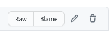

# The Python Environment for Questions

This page is meant for discussion of details related to the Python environment that questions are run in, along with how to work within this environment for question development. Are you creating questions and finding that PrairieLearn does not have the Python libraries you need? Don't panic! There are a few different options you have for getting the necessary libraries installed that will be discussed below.

## General Information

For some general background, all `server.py` files for questions are run within a Docker container identical to the one used for local development. This container is using the Python version that is bundled with the [latest version of Miniconda](https://docs.conda.io/en/latest/miniconda.html) with packages in [this file](https://github.com/PrairieLearn/PrairieLearn/blob/master/images/plbase/python-requirements.txt) installed.

### FAQ

1. To see which packages are installed, simply run `pip list` in the docker container.

2. To run a command line version of this Python environment, you may start it with the following command:

   ```
   docker run -it --rm prairielearn/prairielearn /bin/bash
   ```

3. To access files on the disk or in `serverFilesCourse` within `server.py`, get the directory from `data["options"]["question_path"]` and similar entries from the `data["options"]` dictionary.

## Installing Libraries locally to your course

The quickest way to add custom libraries is to install them directly to your course. This will assume that you have (at least passing) knowledge of using Git and Docker. If you are not familiar, it is recommended to follow the [Installing PL for local development](../installing.md) guide.

1. Check out a copy of your course locally with Git, and make sure it is up-to-date (i.e., you have pulled the latest master).
2. Locate the package that you would like to install. You can find a list of all the available Python libraries at the [_Python Package Index_](https://pypi.org).
3. Install the package to your courses's `serverFileCourse` directory. You can use the command
   ```
   docker run -it --rm -v <path-to-course>:/course prairielearn/prairielearn pip3 install --target /course/serverFilesCourse <library>
   ```
   replacing `<path-to-course>` and `<library>` with the absolute path to the course on your local computer, and the library you wish to install.
4. Using Git, commit and push the new files that are now in your `serverFilesCourse` directory.
5. You should now be able to import the library from `server.py` using the same import structure as if you had installed it with `pip` in the local environment.

After these steps, you should be able to `import` the library as normal in your `server.py` files.

## Creating a Pull Request for PrairieLearn

### Prerequisites

In general, adding a library as a dependency in PrairieLearn is only done in cases where the library has common utility, or local installation is infeasible (due to large size or too many other dependencies). **Please** make sure to attempt to install locally before submitting a pull request. Some discussion on Slack in the (`#pl-help`) channel to find alternative solutions is also recommended.

## Instructions

If the library itself is very large or instaling it to your course is otherwise somehow infeasible, the other option is to create a pull request to add the library to PrairieLearn itself. This process will definitely take more time, as your change will have to be merged and then deployed to the live server. So, only use this in cases where the first option did not work.

### 1. Locate the library and version on PyPI

PrairieLearn downloads all of its Python packages from the [_Python Package Index_](https://pypi.org); your first step should be to locate the package there and version you want. You can find the versions under "Release history" on the left. Most of the time the latest version should be chosen unless there is a specific need for an older release.


Example for SciPy. The newest release as of writing this guide is `1.6.1`.

### 2. Add the library to `python-requirements.txt`

A list of of the Python libraries that PrairieLearn uses is stored in a file called `python-requirements.txt`. The easiest way to propose a change to this file is to use the web interface (if you are familiar with Git and pull requests you may do that, but this will not be included for simplicity's sake).

First, browse to the file `images/plbase/python-requirements.txt` in the [PL GitHub Repo](https://github.com/prairielearn/prairielearn). An edit button should be visible on the top right of the file preview:



Clicking the edit button will automatically create a new branch or fork that you can propose changes on. At the end of the file, input your library and version on a new line in the format `library==version`.


At the bottom of the page you can give a descriptive title to your changes. Something like `Add <library>:<version> to PrairieLearn` is acceptable. When you are happy with your edits, you can click "Propose changes" to finalize the pull request.

### 3. Wait for approval

If you've reached this point, then you're all finished! One of the PrairieLearn administrators will look over your pull request shortly.
