# AI grading

## Overview

AI grading uses large language models to grade manual questions in PrairieLearn. It applies your rubric to submissions, produces scores, and generates explanations instructors can review, adjust, or override.

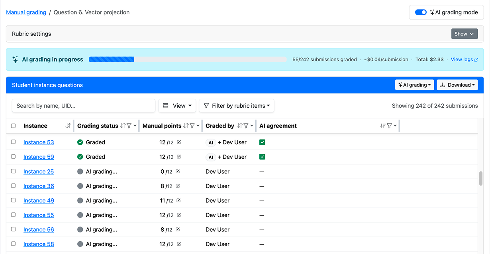

## Use cases

AI grading works on any manually graded question.

**Supported elements:**

- [`pl-image-capture`](../elements/pl-image-capture.md)
- [`pl-rich-text-editor`](../elements/pl-rich-text-editor.md)
- [`pl-file-upload`](../elements/pl-file-upload.md)
- [`pl-file-editor`](../elements/pl-file-editor.md)
- [`pl-string-input`](../elements/pl-string-input.md)

**Common use cases:**

- Essay and free-response questions
- Mathematical proofs and derivations
- Diagrams and handwritten work
- Code explanations and written reasoning
- Short-answer justifications

## Prerequisites

Before you can use AI grading, you'll need:

- A course instance
- A manually graded question with at least one submission
  - See the [manual grading page](../manualGrading/index.md) for more details
- A rubric
  - See the [manual grading page](../manualGrading/index.md#creating-a-rubric-for-manual-grading) for information on how to create one
  - Read the [best practices](#best-practices) to optimize it for AI grading
- Course owner permissions, required to purchase credits
- AI grading billing configured for your course instance
  - See [instructions here](#billing)

## Setup

1. **Navigate to manual grading** for your assessment question.

   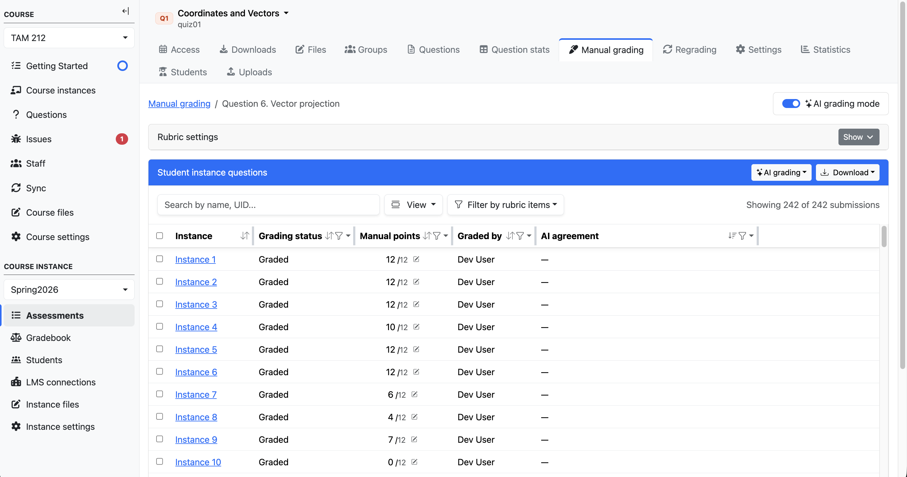

2. **Open the "AI grading" dropdown.**

   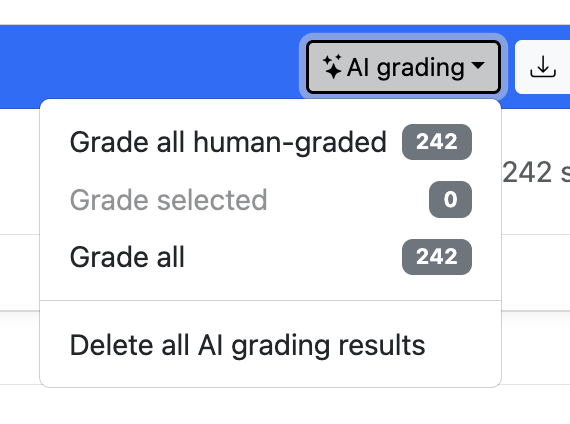

3. **Select a model.** Use PrairieLearn's recommended model for your question type.

   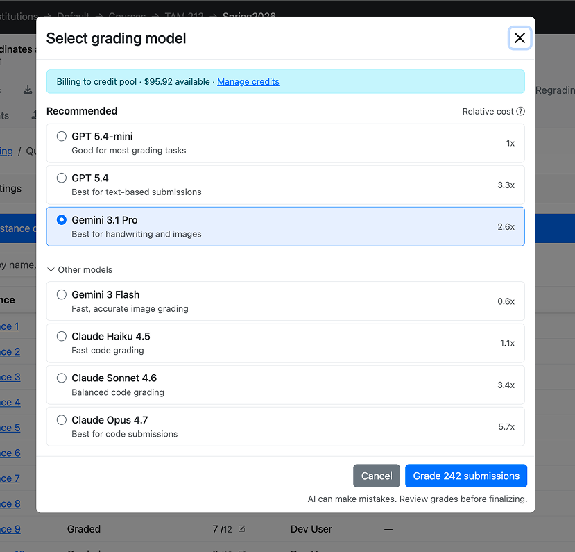

4. **Grade submissions.** We recommend testing on a small batch (5–10 submissions), reviewing the output, and refining your rubric before running on the full set.

## Best practices

- **Use PrairieLearn's recommended model.** Model choice can significantly impact grading accuracy, particularly for image submissions. The recommended model is updated as provider capabilities change.
- **Use rubrics over point-based grading.** Rubrics give the model clear, discrete criteria, which significantly improves consistency.
- **Write well-specified rubric items.** Each item should describe exactly what earns or loses credit. Ambiguous items produce ambiguous grades.
- **Use grader guidelines.** This field is for instructions the model should follow but that shouldn't appear in the student-facing rubric — e.g., "accept equivalent algebraic forms" or "do not penalize minor notation differences."
- **Iterate.** If you see systematic errors in the first batch, refine the rubric rather than overriding grades one by one.

## Reviewing AI grading

For each submission, AI grading produces:

- **Graded rubric** — The rubric items the model selected, along with their point values.

  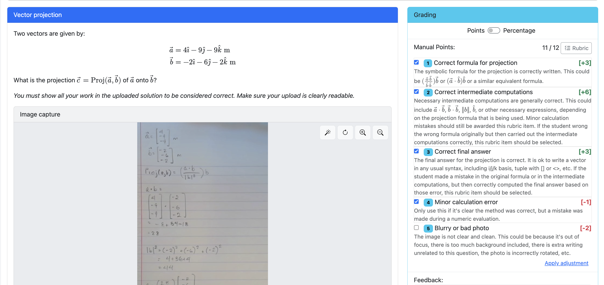

  Manually changing the rubric items overrides the AI grading. The left column of checkboxes shows the AI's selections and the right column shows the human grader's selections, so disagreements are visible at a glance:
  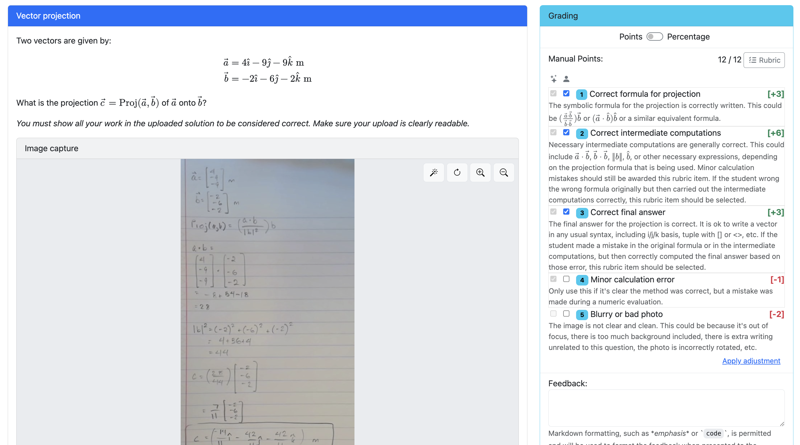

- **Explanation** — The model's grading decision reasoning.

  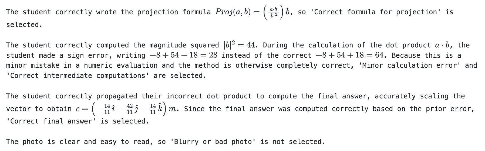

  When the submission contains an image, the model's transcription of the image content is included.

  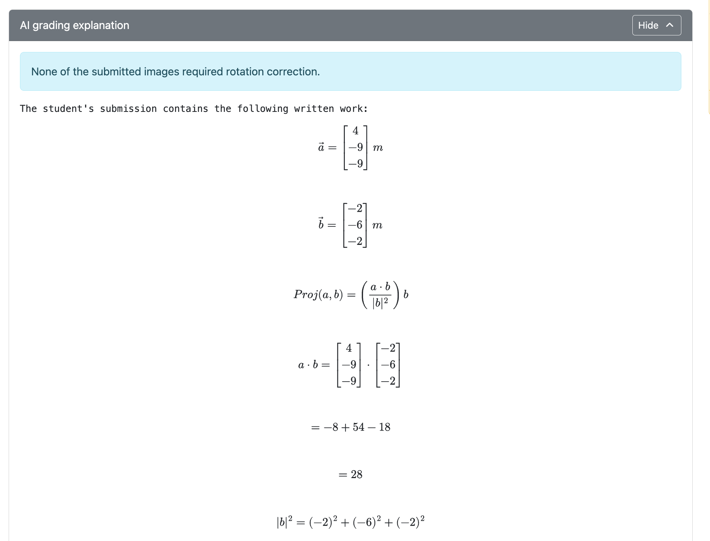

- **AI agreement indicator** — When a submission has also been human-graded, the manual grading table displays an "AI agreement" column flagging which rubric items the AI and human agreed or disagreed on.

  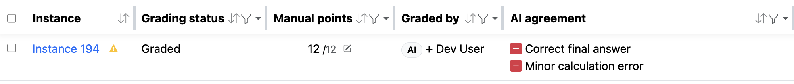

  When the column shows a green checkmark, the AI and human grader agreed on every rubric item for that submission.

  

  The agreement column also appears on individual rubric items in the rubric editor, making it easy to spot items where the AI consistently disagrees with human graders.

  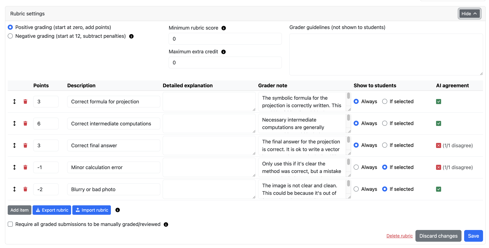

## The grading process

AI grading assembles a prompt from the following inputs and sends it to the selected model.

**Inputs sent to the model:**

- Tuned grader prompt (maintained by PrairieLearn)
- Question prompt
- Correct answer
- Rubric
- Student submission

**Outputs returned:**

- Graded rubric (item-by-item scoring)
- Explanation
- Transcription _(image submissions only)_

For transparency and debugging, the exact prompt sent to the model is available on each graded submission.

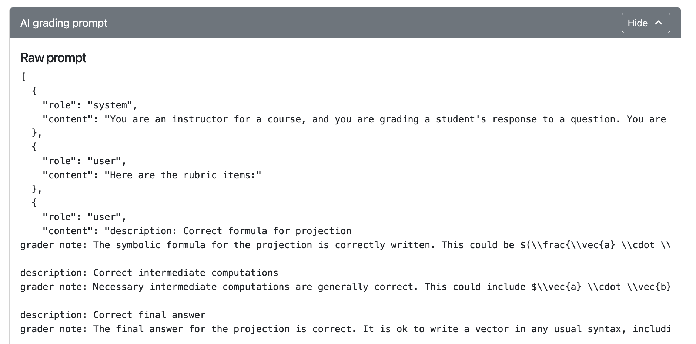

**Rotation correction:** Specifically for image grading with Gemini models, a separate LLM call first rotates the image so the handwriting is upright before grading runs.

**Concurrency:** AI grading keeps up to 20 submissions in progress at any time. When one finishes, the next begins automatically.

**Privacy:** Student identifying information (name, email, UIN) is not sent to LLM providers, as long as it is not embedded in the submission itself or in the question or correct answer.

## Billing

AI grading requires either PrairieLearn-managed credits or a custom API key. Billing is configured once per course instance.

### Billing modes

- **PrairieLearn-managed credits** — Simpler setup, no provider account needed. You purchase credits through PrairieLearn and pay a 20% infrastructure fee on top of provider costs.
- **Custom API key** — Bring your own provider key (OpenAI, Anthropic, Google). You're billed directly by the provider and PrairieLearn charges no infrastructure fee.

You can switch between billing modes at any time. Purchased credits and saved API keys persist until you explicitly remove them, so switching back later does not require re-purchasing credits or re-entering keys. API keys are encrypted at rest — PrairieLearn never stores them in plaintext.

### Credit types

- **Transferable credits** can be moved between course instances.
- **Non-transferable credits** are locked to the instance they were added to.

### Billing configuration

1. Go to **Instance settings → AI grading** in your course instance.

   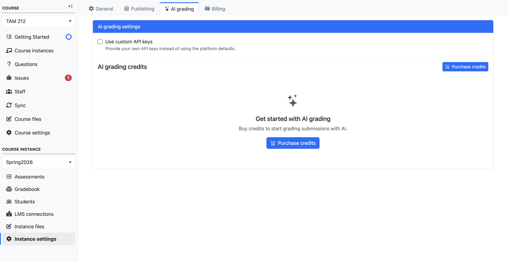

2. Either purchase credits or add a custom API key.

   _Option 1: Purchase PrairieLearn-managed credits._

   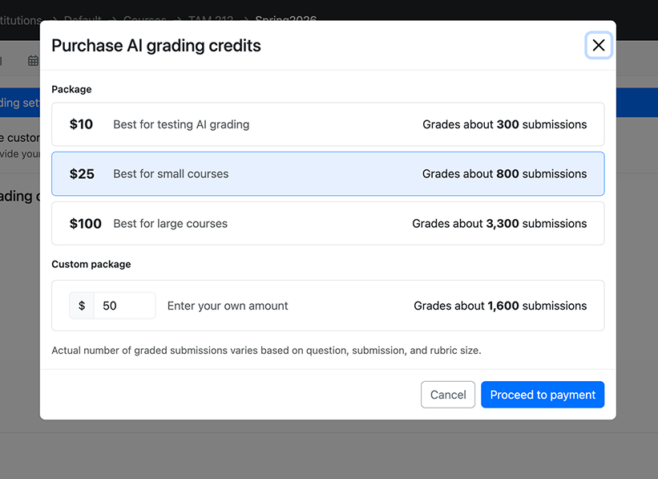

   _Option 2: Add a custom API key._

   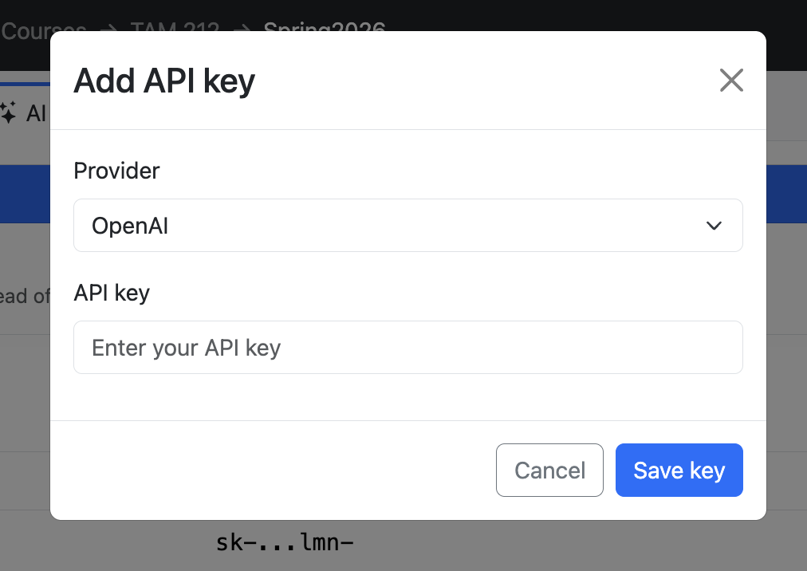

   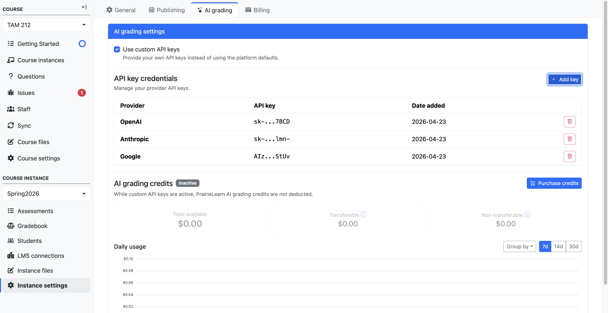

### Usage history and transactions

The billing page also surfaces two views for tracking AI grading spend over time:

- **Daily spending chart** — Credit usage broken down by day, so you can spot grading spikes or unexpected spend.
- **Transaction history** — A running log of past credit purchases and deductions.

Both views only track PrairieLearn-managed credit spending. Custom API key usage is billed directly by the provider and is not reflected here.

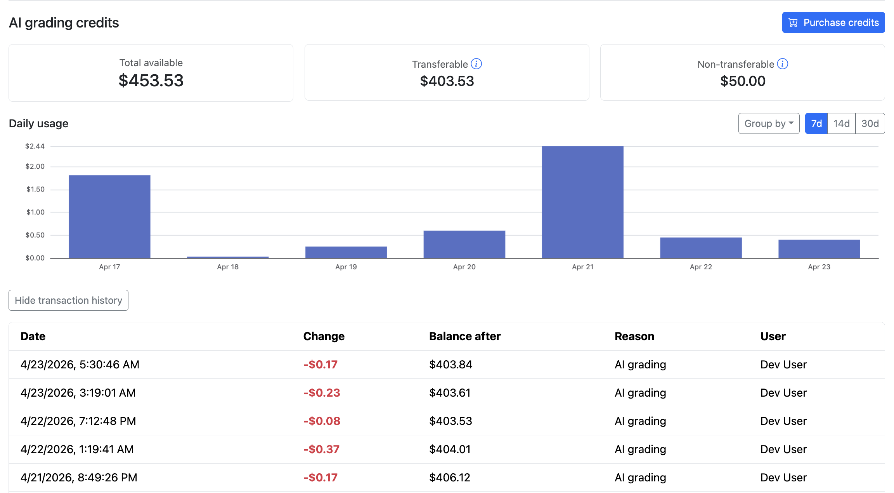

## Accuracy

AI grading has been piloted at the University of Illinois Urbana-Champaign since Fall 2025, across multiple STEM courses and thousands of student submissions.

Across a range of open-ended questions and frontier models, rubric-item accuracy exceeded 99% when paired with clear student work and a well-aligned rubric. Instructors and TAs reported that AI grading was as accurate as human graders for their needs and saved enormous amounts of grading effort.

For more detail, see our published research:

- **Text grading** — Zhao, C., Fowler, M., Gertner, Y., Poulsen, S., West, M., & Silva, M. (2026). [AI-Supported Grading and Rubric Refinement for Free Response Questions](https://dl.acm.org/doi/10.1145/3770762.3772545). In _Proceedings of the 57th ACM Technical Symposium on Computer Science Education_ (SIGCSE TS 2026).
- **Image grading** — Levine, J., Aenlle, M., Zilles, C., West, M., & Silva, M. (forthcoming). Automated grading of handwritten mathematics using vision-capable LLMs. In _Proceedings of the 27th International Conference on Artificial Intelligence in Education_ (AIED 2026). Springer.

## Cost and runtime

### Factors affecting cost and runtime

| Factor                | Increases cost                       | Decreases cost                                                    |
| --------------------- | ------------------------------------ | ----------------------------------------------------------------- |
| Model                 | Larger, reasoning models             | Smaller, non-reasoning models                                     |
| Submission type       | Image submissions                    | Text submissions                                                  |
| Question content size | Longer prompts and reference answers | Shorter prompts and reference answers                             |
| Cached input          | —                                    | Repeated content across submissions (e.g., question text, rubric) |

PrairieLearn-managed keys carry a 20% infrastructure fee on top of provider costs.

### Benchmarks

Costs vary course-to-course depending on rubric length, submission length, and model choice. The numbers below are representative, not guarantees.

_Benchmarks below were run using PrairieLearn-managed keys and include the 20% infrastructure fee._

**Numerical methods problem — text grading (139 submissions):**

This was a Numerical Methods question with typed, paragraph-length submissions, no randomization, and a rubric.

| Model          | Cost / submission | Time / submission |
| -------------- | ----------------- | ----------------- |
| GPT-5.4 mini   | $0.0020           | 0.1s              |
| GPT-5.4        | $0.0058           | 0.2s              |
| Gemini 3.1 Pro | $0.0126           | 0.6s              |

**Dynamics problem — image grading (242 submissions):**

This was an Intro Dynamics problem that had image submissions, randomization, and a rubric.

| Model          | Cost / submission | Time / submission |
| -------------- | ----------------- | ----------------- |
| GPT-5.4 mini   | $0.0042           | 0.3s              |
| GPT-5.4        | $0.0159           | 0.5s              |
| Gemini 3.1 Pro | $0.0488           | 1.5s              |

_Per-submission times are measured with many submissions in flight — a single submission graded on its own will take longer._
