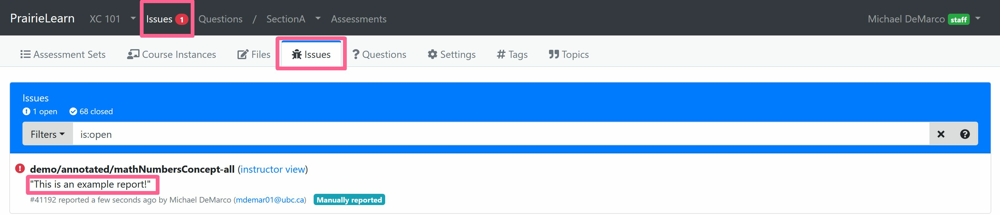
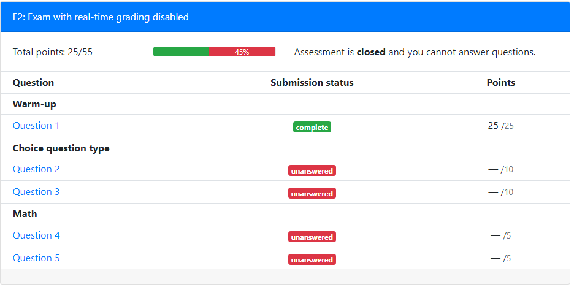

# Assessments

**NOTE:** Any time you edit or add an `infoAssessment.json` file on a local copy of PrairieLearn, you need to click the “Load from disk” button in the header so that the local PrairieLearn server reloads the changes.

## Overview

Each assessment is a single directory in the `assessments` folder or any subfolder. Assessments may be nested in subdirectories of the `assessments` folder. The assessment directory must contain a single file called `infoAssessment.json` that describes the assessment and looks like:

```json
{
  "uuid": "cef0cbf3-6458-4f13-a418-ee4d7e7505dd",
  "type": "Exam",
  "title": "Coordinates and Vectors",
  "set": "Quiz",
  "module": "Linear algebra review",
  "number": "2",
  "allowAccess": [],
  "zones": [],
  "comment": "You can add comments to JSON files using this property."
}
```

The assessment ID is the full path relative to `assessments`.

- [Format specification for assessment `infoAssessment.json`](https://github.com/PrairieLearn/PrairieLearn/blob/master/apps/prairielearn/src/schemas/schemas/infoAssessment.json)

## Assessment naming

Assessments are organized into `sets` (e.g., `Homework`, `Quiz`, `Exam`) and within each set the assessment has a `number`. Additionally, each assessment has a `title`. Depending on the context, assessments are referred to by either a _short name_ or a _long name_. The format of these is:

- Short name = `Set Number` (e.g., `Quiz 2` in the above example).

- Long name = `Set Number: Title` (e.g., `Quiz 2: Coordinates and Vectors` above).

You can select a set from the list of [standardized assessment sets](course.md#standardized-assessment-sets) or create your [own](course.md#adding-your-own-assessment-sets).

## Assessment modules

Instructors may want to group their assessments by course modules (topics, sections or chapters in a course). When using `"groupAssessmentsBy" : "Module"` in `infoCourseInstance.json`, instructors can assign an assessment to a specific module by setting the `module` property in `infoAssessment.json`, as illustrated in the example above. If the property `module` is omitted, by default the assessment will have `"module" : "Default"`.

For more information about how to create your own assessment modules, see [Course configuration](course.md#assessment-modules).

## Assessment types

Each assessment has a `type`, as listed below. A randomized assessment is one where each student gets a different set of questions in a randomized order, while a non-randomized assessment shows all students the same list of questions in the same order. Broadly speaking, randomized assessments are designed for exams and non-randomized assessments are designed for homeworks.

| Type       | Randomized | Description                                                                                         |
| ---------- | ---------- | --------------------------------------------------------------------------------------------------- |
| `Homework` | No         | A gamified assessment that rewards repeated correct answers to questions.                           |
| `Exam`     | Yes        | An exam where students can grade their answers at any time, and retry questions for reduced points. |

## Changing question-order randomization

To make `Homework` assessments randomize the question order for each student, set the `"shuffleQuestions": true` option in the `infoAssessment.json` file. This will use a unique-per-course number for each question, so that all students will still get the same question numbers (like #427), but they will not be in order. This makes it easy for students to discuss questions with course staff; they can say “I don't know how to do #427” and everyone will be seeing the same question #427. The main advantage of randomizing question order on Homeworks is to enable data collection on question difficulty and student behavior that is independent of the order in which questions are listed on the assessment.

On `Exam` assessments, questions are randomized by default, but this can be disabled by setting `"shuffleQuestions": false` in the `infoAssessment.json` file.

## Question specification

An assessment is broken down in to a list of zones, like this:

```json
"zones": [
    {
        "title": "Easy questions",
        "comment": "These are new questions created for this exam",
        "questions": [
            {"id": "anEasyQ", "autoPoints": [10, 5, 3, 1, 0.5, 0.25]},
            {"id": "aSlightlyHarderQ", "autoPoints": [10, 9, 7, 5]}
        ]
    },
    {
        "title": "Hard questions",
        "comment": "These are new questions created for this exam",
        "questions": [
            {"id": "hardQV1", "autoPoints": 10},
            {"id": "reallyHardQ", "autoPoints": [10, 10, 10]},
            {
                "numberChoose": 1,
                "autoPoints": 5,
                "alternatives": [
                    {"id": "FirstAltQ", "autoPoints": 10},
                    {"id": "SecondAltQ"}
                ]
            }
        ]
    },
    {
        "title": "Manually graded questions",
        "comment": "These are questions that include manual grading components",
        "questions": [
            {"id": "essayQ", "manualPoints": 10},
            {"id": "autoPlusManualQ", "autoPoints": [10, 7, 5], "manualPoints": 15},
        ]
    }
],
```

- Each zone appears in the given order in the assessment. Zone titles are optional and are displayed to the student if present.

- Within each zone the question order is randomized based on [the assessment type and the `shuffleQuestions` option](#changing-question-order-randomization).

- An assessment question can be specified by either a single `id` or by a list of alternatives, in which case one or more of these alternatives is chosen at random. Once the question `id` is determined, then a random variant of that question is selected. Question alternatives inherit the points of their parent group, if specified.

- If a zone has `maxPoints`, then, of the points that are awarded for answering questions in this zone, at most `maxPoints` will count toward the total points.

- If a zone has `bestQuestions`, then, of the questions in this zone, only `bestQuestions` with the highest number of awarded points will count toward the total points.

### Points for individual questions

Each question is assigned a set number of _auto points_ (points that are automatically assigned by an internal or external grader) and _manual points_ (points that are [assigned manually by a human grader](manualGrading.md)).

Auto-grading points are set using the `autoPoints` value. For Exam-type assessments, this option can be set to a single value (in which case a single attempt is allowed), or using an array of values, where each value corresponds to an attempt. For Homework-type assessments, the number of `autoPoints` must be a single value, and it corresponds to the initial value of a correct attempt. Students can attempt the same question again until they get a correct answer and full auto points. Manual grading points are set using the `manualPoints`. It is acceptable to use only one of `autoPoints` or `manualPoints`, in which case the other part of the points will be assigned a value of 0.

For Homework-type assessments, it is also possible to set a value to `maxAutoPoints`. If this value is used, then once a student gets a correct answer with the full value of `autoPoints`, the student is able to get additional points for a new attempt, typically with a new question variant. Every new correct answer adds up `autoPoints` points, up to a maximum of `maxAutoPoints`. Answers with partial credit do not accumulate, and their partial points are added only to previous correct answers. For example, if `autoPoints` is 3 and `maxAutoPoints` is 12, then each correct answer adds 3 points to the question, up to a maximum total of 12 points.

By default, PrairieLearn provides an incentive for students to answer a specific question correctly multiple times in a row. This is done by increasing the value of each submission for every consecutive correct answer, while setting it back to the original value if the answer is incorrect or partially correct. So, for example, if `autoPoints` is 3 and `maxAutoPoints` is 30, then the first correct answer is worth 3 points. If the next submission is also fully correct, it will be worth 6 points; a following answer is worth 9 points if correct; and so on. If any answer is incorrect or partially correct, the value is reset to 3 points. To disable this behavior, use `"constantQuestionValue": true` in the assessment settings, like this:

```json
"constantQuestionValue": true,
"zones": [
    {
        "questions": [ ... ]
    },
    ...
],
```

A question may also set a value to `points` instead of `autoPoints` and `manualPoints`. If this option is used, questions with a `gradingMethod` set to `Manual` will be assigned only manual points, while questions with other grading methods will be assigned only auto points. To avoid ambiguity, it is an error to use both `points` and `autoPoints`, or `points` and `manualPoints`, in the same question. If `points` is used, then `maxPoints` should be used instead of `maxAutoPoints`.

## Question scoring for `Homework` assessments

Assessments with `"type": "Homework"` are designed to allow students to repeatedly practice different variants of questions (that is, different random values in the question) until they achieve mastery. The assumption here is that any student should be able to receive full points for a homework question if they work long enough on it. This section describes in detail how repeated attempts are scored, assuming that the question has `autoPoints`.

The two important question configuration settings are:
- **`autoPoints`** is the number of points that the student receives for a submission that is fully correct.
- **`maxAutoPoints`** is the maximum number of points that the student can receive for a question, regardless of how many times they answer it correctly.

The basic idea is that students should receive `autoPoints` each time they solve the question successfully, up to a maximum of `maxAutoPoints`. When partial credit is awarded, a student receives partial points for the question, but only if they are getting closer to a correct answer. For example, if a student repeatedly answers a question with 50% correct answers then they will receive 50% points for the first such answer, but they will not be able to build up points to reach `maxAutoPoints`. They will need to answer the question 100% correctly to be able to advance their points past the 50% mark.

The exact details of how PrairieLearn awards points are as follows. First, a number of variables are computed internally by PrairieLearn as the student answers the question:
- **Submission percentage score** is the score (between 0% and 100%) that the student receives for any given submission attempt, as evaluated by the question grading specification.
- **Best current score** is the highest submission percentage score that the student has received since last achieving 100% for a submission. This is initialized to zero.
- **Question value** is the current maximum number of points that the question is worth. This starts at `autoPoints` and increases by `autoPoints` for each consecutive correct submission. This is initialized to `autoPoints`.
- **Question points** is the total number of points earned by the student for the question. This will never decrease. This is initialized to zero.

For each submission attempt made by a student, the scoring algorithm is as follows:
1. If the `submission percentage score` is more than `best current score`, add `(submission percentage score - best current score) / 100 * question value` to `question points`, capping `question points` at `maxAutoPoints`.
2. If the `submission percentage score` is 100%, then reset `best current score` to zero. Otherwise, if the `submission percentage score` is more than `best current score`, then set `best current score` to `submission percentage score`.
3. If the `submission percentage score` is 100%, then increase `question value` by `autoPoints`. Otherwise set `question value` to `autoPoints`. If `constantQuestionValue` is true then skip this step.

As an example, suppose a student makes 8 submissions of varying degrees of correctness to a question. Assume the question has `autoPoints` set to 4 and `maxAutoPoints` set to 10. The student's submissions are as follows:

Submission number | Submission perc. score | Best current score | Question value | Question points | Comment
--- | --- | --- | --- | --- | ---
Init | - | 0 | 4 | 0 | Initial values
1 | 50% | 50% | 4 | 2 | (50% - 0%) * 4 = 2 points awarded
2 | 80% | 80% | 4 | 3.2 | (80% - 50%) * 4 = 1.2 points awarded
3 | 20% | 80% | 4 | 3.2 | No improvement in score, so no points awarded
4 | 100% | 0% | 8 | 4 | (100% - 80%) * 4 = 0.8 points awarded, `best current score` reset to 0%, `question value` increased to 8
5 | 50% | 50% | 4 | 8 | (50% - 0%) * 8 = 4 points awarded, `question value` reset to 4
6 | 0% | 50% | 4 | 8 | No improvement in score, so no points awarded
7 | 90% | 90% | 4 | 9.6 | (90% - 50%) * 4 = 1.6 points awarded
8 | 100% | 0% | 8 | 10 | (100% - 90%) * 4 = 0.4 points awarded, `best current score` reset to 0%, `question value` increased to 8

After the eight submissions above the student has achieved maximum points for the question. They can continue to answer the question for additional practice but they cannot earn any more points for it.

## Question scoring for `Exam` assessments

Assessments with `"type": "Exam"` are designed to test students' knowledge of course material. Students can retry questions for reduced points, so long as `allowRealTimeGrading` is true (the default). This section describes in detail how repeated attempts are scored, assuming that the question has `autoPoints` set to an array of values.

The important question configuration settings is:
- **`autoPoints`** is an array of points, with the `n`-th entry being the number of points that a student receives for a fully correct submission on the `n`-th attempt at the question. If `autoPoints` is set to a single value rather than an array then only a single attempt is allowed.

The basic idea is that `autoPoints` is set to a decreasing sequence of points, such as `[10, 7, 5, 2]`. In this case, a correct answer on the first attempt is worth 10 points, a correct answer on the second attempt is worth 7 points, and so on. If the student does not answer the question correctly after four attempts, they will receive 0 points for the question and cannot attempt it again.

The details of how scoring works are made more complex by the fact that a student may receive partial credit for any given submission attempt. PrairieLearn uses a scoring system that has four key properties, assuming that `autoPoints` is an array of decreasing values:
1. A student can never lose points by attempting a question again.
2. If a student submits a more correct answer than their previous answers, they will always receive some additional points for it.
3. Taking more attempts to answer correctly will always be worth less points than answering in fewer attempts, so students are always incentivized to answer questions correctly as soon as possible.
4. The total number of submission attempts that a student can make is limited by the number of entries in `autoPoints`.

The exact details of how PrairieLearn awards points are as follows. First, a number of variables are computed internally by PrairieLearn as the student answers the question:
- **Submission percentage score** is the score (between 0% and 100%) that the student receives for any given submission attempt, as evaluated by the question grading specification.
- **Best current score** is the highest submission percentage score that the student has received since last achieving 100% for a submission. This is initialized to zero.
- **Question value** is the current maximum number of points that the question is worth. This is equal to `autoPoints[n]` for the `n`-th attempt at the question.
- **Question points** is the total number of points earned by the student for the question. This will never decrease. This is initialized to zero.

For the `n`-th submission attempt made by a student, the scoring algorithm is as follows:
1. Set the `question value` to `autoPoints[n]`.
2. Add `max(0, submission percentage score - best current score) / 100 * question value` to `question points`.
3. If the `submission percentage score` is more than `best current score`, then set `best current score` to `submission percentage score`.
4. If the `submission percentage score` is 100% or `n` is the last attempt, then prohibit further submissions to the question.

As an example, suppose a student makes 4 submissions of varying degrees of correctness to a question which has `autoPoints` set to `[10, 7, 5, 2]`. The student's submissions are as follows:

Submission number | Submission perc. score | Best current score | Question value | Question points | Comment
--- | --- | --- | --- | --- | ---
Init | - | 0 | - | 0 | Initial values
1 | 50% | 50% | 10 | 5 | (50% - 0%) * 10 = 5 points awarded
2 | 20% | 50% | 7 | 5 | No improvement in score, so no points awarded
3 | 80% | 80% | 5 | 6.5 | (80% - 50%) * 5 = 1.5 points awarded
4 | 70% | 80% | 2 | 6.5 | No improvement in score, so no points awarded

After the four submissions above the student has achieved 6.5 points for the question, for an overall score of 65% (6.5/10). They can no longer make submission attempts to the question.

## Assessment and question instances and resetting assessments

PrairieLearn distinguishes between _assessments_ and _assessment instances_. An _assessment_ is determined by the code in an `assessments` directory, and is something like "Midterm 1". Given an assessment, PrairieLearn needs to generate the random set of questions and question variants for each student, and it is this selection that is the _assessment instance_ for the student. There is only one copy of each assessment, but every student has their own assessment instance. The rules for updating assessment instances differ between `Homework` and `Exam` assessments.

**`Exam` assessment updates:** Exam assessment instances are generated when the student starts the exam, and they are never automatically deleted, regenerated, or updated, even when the original assessment is changed in some way. This is a safety mechanism to avoid having students' assessments changed during an exam. However, if you want to force the regeneration of assessment instances then you can do so by deleting assessment instances in the "Students" tab. While writing an assessment you might need to do this many times. Once an assessment is live, you should of course be very careful about doing this (basically, don't do it on a production server once an assessment is underway).

**`Homework` assessment updates:** New questions added to Homeworks will be automatically integrated into student homeworks currently in progress. Updates to `maxPoints` or `maxBonusPoints` will take effect the next time a student grades a question. A student's "points" and "percentage score" will never decrease.

## Assessment points

A student's percentage score will be determined by the number of points they have obtained, divided by the value of `maxPoints` for the assessment (subject to the rules associated to [`credit`](accessControl.md#credit) in assessment access rules).

```json
{
    "uuid": "cef0cbf3-6458-4f13-a418-ee4d7e7505dd",
    "maxPoints": 50,
    "maxBonusPoints": 5,
    ...
}
```

In the assessment configuration, the `maxPoints` determines the number of points a student is required to obtain to get a score of 100%. The percentage score will thus be computed based on the points the student obtained divided by the value of `maxPoints`. If not provided, `maxPoints` is computed based on the maximum number of points that can be obtained from all questions in all zones.

By default, once a student obtains enough points to reach the value of `maxPoints`, any further points do not affect the assessment score. However, if a value is set for `maxBonusPoints` and `credit` is set to 100, the student can obtain additional points, up to a total of `maxPoints + maxBonusPoints`. The percentage is still based on `maxPoints`, so the use of `maxBonusPoints` allows students to obtain a percentage above 100%. If `maxBonusPoints` is set, but `maxPoints` is not provided, then `maxPoints` will be computed by subtracting `maxBonusPoints` from the maximum number of points in all questions.

The choice of using `maxBonusPoints` or a `credit` value above 100 is based on instructor's choice. Additional points based on `maxBonusPoints` are intended to be credited based on extra work, while `credit` above 100 is to be awarded for early completion. It is possible to combine them, and use them together in the same assessment. If `maxBonusPoints` is set while the `credit` is above 100, then the percentage is based on both `maxBonusPoints` and `credit` (see [`credit`](accessControl.md#credit) for details).

## Multiple-instance versus single-instance assessments

By default all assessments are _single instance_, meaning that each student has exactly one instance of the assessment that they can complete, and once they have completed that assessment instance then they cannot do the assessment again. This is the expected behavior for homeworks, quizzes, exams, etc.

For practice exams it is often desirable to make a _multiple instance_ assessment by setting the option `"multipleInstance": true`. This will allow students to create new assessment instances and try the whole assessment repeatedly.

## Enabling group work for collaborative assessments

By default, assessment instances are tied to only one user. By setting `groupWork: true`, multiple students will be able to work on the same assessment instance.
Information about the group configuration can be set in the `infoAssessment.json` file. For example:

```json
{
  "groupWork": true,
  "groupMaxSize": 6,
  "groupMinSize": 2,
  "studentGroupCreate": true,
  "studentGroupJoin": true,
  "studentGroupLeave": true
}
```

| Attribute            | Type    | Default | Description                                        |
| -------------------- | ------- | ------- | -------------------------------------------------- |
| `groupWork`          | boolean | false   | Enable the group work for the assessment.          |
| `groupMaxSize`       | integer | -       | The maximum size of a group (default: no minimum). |
| `groupMinSize`       | integer | -       | The minimum size of a group (default: no maximum). |
| `studentGroupCreate` | boolean | false   | Allow students to create groups.                   |
| `studentGroupJoin`   | boolean | false   | Allow students to join other groups by join code.  |
| `studentGroupLeave`  | boolean | false   | Allow students to leave groups.                    |

Please notice: changing an assessment from group -> individual or vice versa after students have started working on it will cause student work to be lost.

### Instructor options for groupWork


Underneath the "Groups" tab in an assessment, instructors have three ways of assigning students to different groups:

1. Uploading a CSV file in the following format:

```
groupName,UID
groupA,one@example.com
groupA,two@example.com
groupB,three@example.com
groupB,four@example.com
```

2. Automatically assigning students, either to fill out existing groups or to make entirely new ones.

3. Copying the group assignments from another assessment.

A copy of the current group assignments can be saved from the "Downloads" tab, under `<assessment>_group_configs.csv`

### Student options for groupWork


If an instructor does not assign a student to a group, the student will need to join one before opening their assessment instance. They can either create a new one or join an existing group via a join code, which they can get from another classmate.

When calculating a student's grade for a group assessment, PrairieLearn will always use the score of their group's assessment instance.

> Note: Students cannot see eachother's edits in real-time, although this is planned for a future version of PrairieLearn.


Students are able to see their groupmates' UIDs, which can become a point of contact to communicate with eachother outside of PrairieLearn. They are also able to leave their group to join a different one.

## Forcing students to complete questions in-order

**WARNING:** We **strongly** discourage the use of this option during high-stakes exams, as it can be very detrimental to student success. See below for more details.

Certain assessments might be designed to be done linearly, where each question assumes that the student has completed and understood the previous question (e.g., lab worksheets). By default, PrairieLearn allows students to complete questions in any order that they like, but assessments can be configured to not allow students to view future unsolved questions.

To enable these features, set `advanceScorePerc` for any question to a number between 0 and 100. An example of what this looks like is below, with boilerplate attributes omitted:

```json
{
  "zones": [
    {
      "questions": [
        { "id": "q1", "advanceScorePerc": 50 },
        { "id": "q2", "advanceScorePerc": 100 },
        { "id": "q3", "advanceScorePerc": 0 },
        { "id": "q4", "advanceScorePerc": 80 },
        { "id": "q5", "advanceScorePerc": 100 }
      ]
    }
  ]
}
```

Each question blocks all later questions until its `advanceScorePerc` is met. In the above example, `q1` blocks all later questions until the student has scored at least 50% on it. Then `q2` blocks all later questions until the student has a perfect score on it. Once a student gets past `q2`, both `q3` and `q4` are immediately available because `q3` does not do any blocking. Finally, `q4` blocks the remaining `q5` until the student has an 80% score on it. The `advanceScorePerc` attribute on `q5` is irrelevant because there are no questions after it.

The relevant score for comparing to `advanceScorePerc` is the student's _highest submission score_ for the question, not their percentage score on the question overall. For example, suppose `q1` above has `"points": [10, 4, 2, 1]`. Then a student who makes a 50%-correct submission on their second attempt will unblock the question, even though they only score 2 points out of 10 on the question (50% of the 4-point second-chance value). The submission score used for `advanceScorePerc` is the one based on autograding components of the question and [manual grading](manualGrading.md) scores are not considered. For this reason a question that is purely manually graded should not have an `advanceScorePerc` set on it.

An `advanceScorePerc` can also be set on the `zone` or `assessment` level, which will act as a default for all questions in that zone or assessment. For example, the following configuration is equivalent to the above:

```json
{
  "zones": [
    {
      "advanceScorePerc": 100,
      "questions": [
        { "id": "q1", "advanceScorePerc": 50 },
        { "id": "q2" },
        { "id": "q3", "advanceScorePerc": 0 },
        { "id": "q4", "advanceScorePerc": 80 },
        { "id": "q5" }
      ]
    }
  ]
}
```

In the example above, `q2` and `q5` will have an `advanceScorePerc` of 100 because the zone-level attribute is used as a default.

Note that an `advanceScorePerc` of 0 is equivalent to not having the attribute at all.

For assessments that randomize the order of questions as seen by students, the `advanceScorePerc` restrictions apply for each student using the question order that they were given. If a specific question order is desired then see [Changing question-order randomization](#changing-question-order-randomization).

If a student uses all of their attempts on a question and cannot submit any more attempts, that question will automatically unblock, no matter what score they earned on it. This is to prevent students from getting permanently stuck on an assessment, unable to receive further credit.

### Warning about in-order questions and high-stakes exams

The `advanceScorePerc` attribute is intended to be used in [group work](#enabling-group-work-for-collaborative-assessments) and assessment types which are indirectly supported, such as worksheets (see [multiple instance assessments](#multiple-instance-versus-single-instance-assessments)). In the interest of allowing students to best demonstrate their knowledge of course material, we **strongly** discourage the use of this feature in high-stakes exams where the student cannot receive help from course staff.

## Auto-closing Exam assessments

By default Exam assessments will auto-close after six hours of inactivity by the student. This generally means that you don't need to explicity close exams that students accidentally did not close when they were done. If you want to prevent auto-closing then you can set `"autoClose": false` as a top-level option in the `infoAssessment.json` file.

## Issue reporting

To allow students to report issues with questions (incorrect answers, unclear wording, etc), set the `"allowIssueReporting": true` property in the `infoAssessment.json` file, or set it to `false` to disallow reporting. This option defaults to `true`.

When issue reporting is allowed, students see a button labeled "Report an error in this question" and they can submit a short text form.

 

Course staff see any reported issues show up on the "Issues" tab.



## Access control

See the [Access control page](accessControl.md) for details.

By default, an assessment is only accessible to course staff. To allow students to access the assessment, the `allowAccess` option can be used in the assessment's `infoAssessment.json` file.

Access control options can also be used to control the open/close dates of assessments and apply penalties for late submissions. Once again, see [Access control page](accessControl.md) for details and examples.

## Adding text and links to assessments

You can add a `text` property to your `infoAssessment.json`, which can be used to provide additional instructions, formula sheets, etc. You can use EJS syntax to access `clientFilesCourse`, `clientFilesCourseInstance`, and `clientFilesAssessment`.

```json
{
  "text": "<a href=\"<%= clientFilesAssessment %>/formulas.pdf\">Formula sheet</a>"
}
```

See the [`clientFiles` and `serverFiles`](clientServerFiles.md) page for details about making files available to users.

## Student-attached personal notes

Students can attach files to assessments as personal notes, either by uploading them or by pasting the file contents as text. This can be done on the assessment overview page, or on individual question pages. These files can be viewed by the student anytime they can view the assessment.

The purpose of this is to allow students to take extra notes during exams, for later review. For example, if a student has a Matlab script that they used to solve a question, they could attach it to that question so they can review it later.

This file attachment functionality does not provide a way for students to attach files before an exam starts, so it can't be used for student-provided "formula sheets" on exams.

## Disabling real-time grading

PrairieLearn is designed to give students immediate feedback on their work. However, if you wish to more closely replicate a paper exam experience, you can prevent students from grading their work as they go (what we call "real-time grading").

_Note that students generally expect and benefit from having immediate feedback, so this setting should only be enabled if you have a specific reason for it._

To disable real-time grading for an assessment, add `"allowRealTimeGrading": false` to the assessment's `infoAssessment.json` file. This will hide the "Save & Grade" button on student question pages; only the "Save" button will be available. The "Grade saved answers" button on the assessment overview will also be hidden. Note that real-time grading can only be disabled for `Exam` assessments, as immediate feedback is a core part of the `Homework` experience.

An assessment without real-time grading will not show any score information during the exam. However, if a [time limit](accessControl.md#time-limits) is used then when it runs out the assessment will auto-grade and show students exactly which questions they got correct/incorrect. The same revealing behavior will happen if an instructor manually closes and grades the student assessment. To prevent this, set the [`showClosedAssessment` access rule restriction](accessControl.md#showinghiding-closed-assessments).

Disabling real-time grading changes a lot of fundamental details of how PrairieLearn is used. To account for that, the student assessment overview page displays less information about points and grading than for usual exams.

Here is the assessment page for a normal exam with real-time grading enabled:


Here is the assessment page for an open exam with real-time grading disabled:


Compared to the normal assessment, there are a number of differences:

- A warning explaining that real-time grading has been disabled is shown
- Total points is listed as a number, not as an "X/Y" score
- The percentage bar is not displayed
- The "Best submission" column is renamed to "Submission status"
- The "Available points" column has been removed
- The "Awarded points" column has been renamed to "Points" and only shows the max points

Here is the assessment page for a closed exam with real-time grading disabled:



Note that after the exam has closed and been graded, more information about points will be visible.

## Limiting the number of attempts for each question

The number of times each student will be allowed to attempt each question can be set in different ways, depending on the type of question and assessment.

For assessments with type "Exam", each student will only be presented with a single variant of each question. The number of attempts will be determined by the `points` or `autoPoints` setting: if there is a single value there will be a single attempt at the question; if it is set to a list of points, then there will be one attempt for each value in that list. In other words, the number of attempts is determined based on the number of values in the list of points.

For assessments with type "Homework", students will be presented with an unlimited number of attempts for each question. By default, every new attempt corresponds to a different variant of the question, unless:

- the question is set to [`"singleVariant": true` in the question configuration file](question.md#the-singleVariant-option-for-non-randomized-questions). In this case, students will get unlimited attempts for the same variant.

- the `triesPerVariant` setting is set as below. In this case, the student will have the set number of attempts to correctly answer the question. Once the student answers the question correctly, or the number of tries per variant is exhausted, the student will be given the option to try a new variant.

```json
"zones": [
    {
        "questions": [
            {"id": "singleAttemptQ", "points": 10},
            {"id": "tryOncePerVar", "points": 10},
            {"id": "tryThreeTimesPerVar", "points": 10, "triesPerVariant": 3}
        ]
    }
],
```

## Limiting the rate at which answers can be graded

Practice is important in learning and there should be room for mistakes and learning from them. Immediate feedback can help as it can give feedback despite the limited human resources. However, to prevent mindless trial-and-error problem solving, controlling resubmissions can be an effective tool ([Ihantola et. al., Review of Recent Systems for Automatic Assessment of Programming Assignments](https://dl.acm.org/doi/pdf/10.1145/1930464.1930480)).

One way to limit the amount of feedback provided to students is to limit the rate at which graded submissions are allowed. This can be done by using the `gradeRateMinutes` setting. If set, this value indicates how long a student needs to wait after grading a question to resubmit a new answer to the same question for grading. Students are still able to save a submission, but are not able to grade until either the waiting time has elapsed, or when they close the assesment. By default, this value is set to 0, which means that there is no limit.

The `gradeRateMinutes` value can be set for each specific question in the assessment. It can also be set for a zone or the full assessment, in which case it will apply individually to each question in the zone or assessment. In other words, if the assessment has a grading rate set, once a student submits an answer for grading in one question, they have to wait to submit new answers to that question, but they are able to grade other questions in the meantime.

```json
"zones": [
    {
        "gradeRateMinutes": 30,
        "questions": [
            {"id": "canOnlySubmitEvery30minutes", "points": 10},
            {"id": "canOnlySubmitEvery60minutes", "points": 10, "gradeRateMinutes": 60},
            {"id": "canSubmitAnytime", "points": 10, "gradeRateMinutes": 0}
        ]
    }
],
```

## Honor code

By default, `Exam` assessments require students to certify their identity and pledge an honor code before starting the assessment:

- I certify that I am `name` and I am allowed to take this assessment.
- I pledge on my honor that I will not give or receive any unauthorized assistance on this assessment and that all work will be my own.

To disable this requirement, set `"requireHonorCode": false` as a top-level option in the `infoAssessment.json` file.

The text of the honor code was based on the University of Maryland's [Honor Pledge](https://www.studentconduct.umd.edu/honor-pledge) and the University of Rochester's [Honor Pledge for Exams](https://www.rochester.edu/college/honesty/instructors/pledge.html). This is a "modified" honor code ([McCabe et al., 2002](https://doi.org/10.1023/A:1014893102151)), as opposed to "traditional" codes that typically also require students to report any violations of the honor code they observe.

## Linking to assessments

Some instructors may wish to publish links that point students directly to their assessments on PrairieLearn. These links may be published in course web pages, LMS systems like Compass or Canvas, or sent to students via email or other messaging platforms. Instructors should note that the URL listed on the browser points to the instructor view of an assessment, which is typically not accessible to students.

The appropriate link to provide to students can be found by opening the "Settings" tab of the Assessment. This page includes, among other useful information, a Student Link that can be provided to students. This link points students directly to the specific assessment, enrolling them automatically in the course if they are not yet enrolled.
