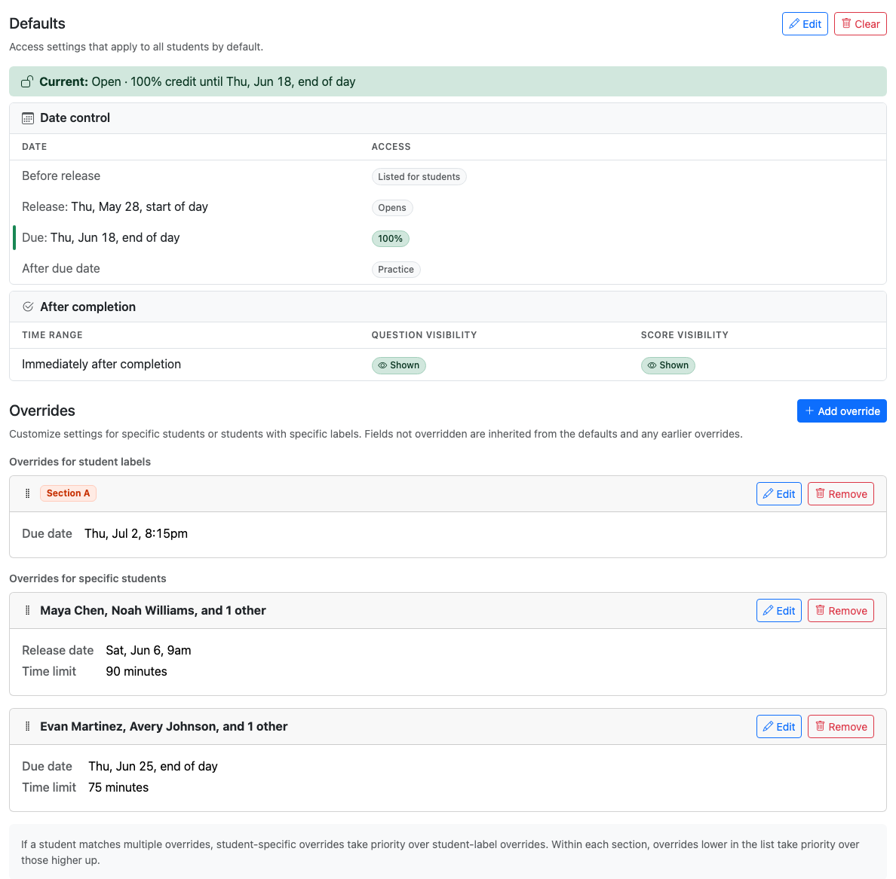
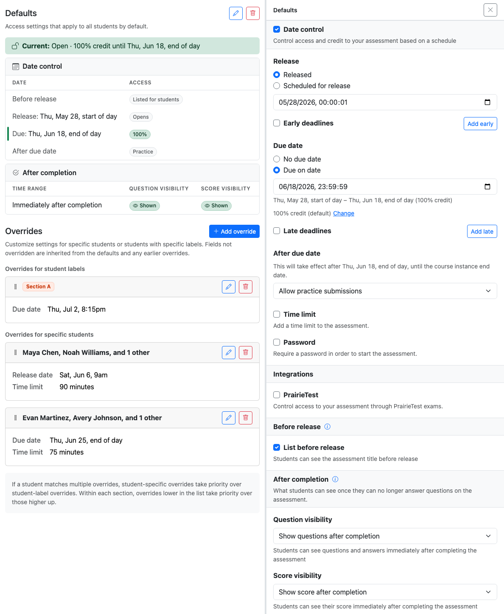
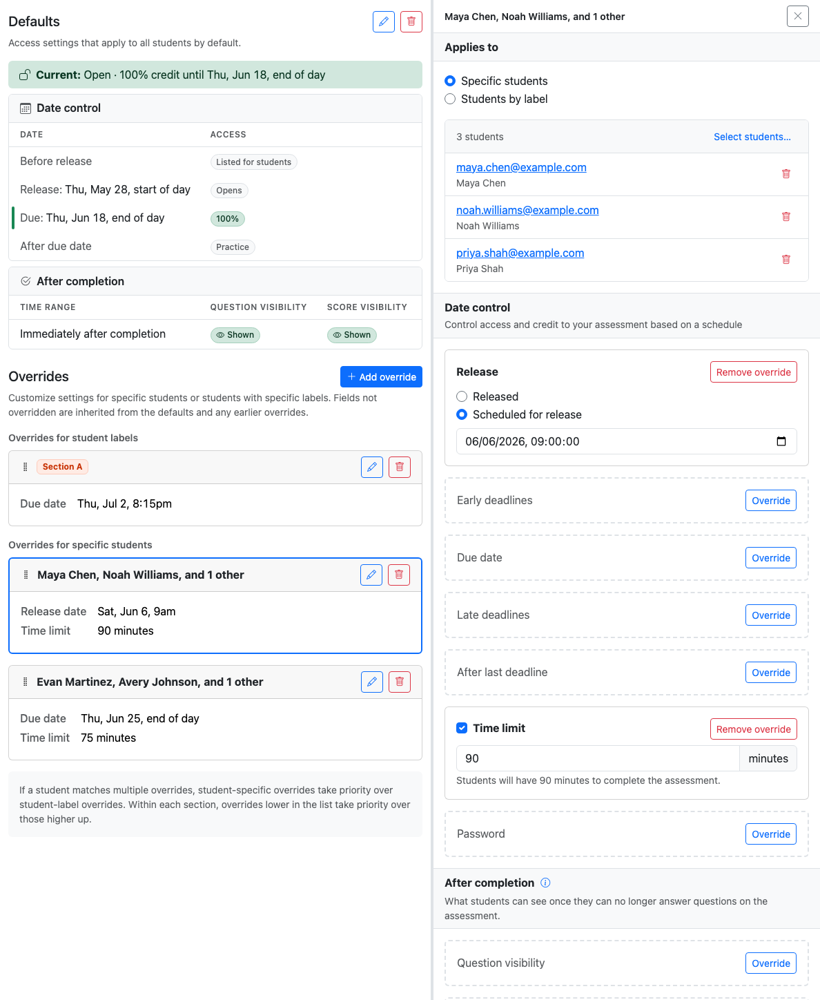

# Assessment access control

Instructors can use the assessment **Access** page to configure availability, deadlines, credit, time limits, passwords, PrairieTest access, and student-specific overrides.

## Access control checks

PrairieLearn checks access at two levels:

1. The **course instance** must be available to the student. The student must be enrolled in the course instance, and the course instance must be published or otherwise visible through its [publishing controls](../courseInstance/index.md#publishing-controls).
2. The **assessment** must grant the student access. Configure assessment access from the assessment **Access** page: **Defaults** apply to all students, and **Overrides** apply to selected student labels or specific students.

These two checks are both required. Publishing a course instance lets enrolled students see the course instance, but it does not by itself grant access to every assessment in it. Granting assessment access only works for students who can also access the course instance.

!!! note "Legacy `allowAccess`"

    Existing assessments that still use `allowAccess` can continue to do so. New assessments should use the **Access** page and the `accessControl` format documented here. For details about the older format, see the [legacy assessment access control](accessControlLegacy.md) documentation.

## Open the Access page

From an assessment, open the **Access** tab. The page has two sections:

- **Defaults**: settings that apply to all students.
- **Overrides**: settings that apply only to selected student labels or specific students.


/// caption
The Access page summarizes the active configuration and lists every override that applies to the assessment.
///

The summary card shows the current access state, the release/due timeline, credit after deadlines, and visibility settings. Click **Edit** on a card to open the detail panel, make changes, and then click **Save** to persist the changes.

## Configure defaults

Click **Edit** in the **Defaults** section. Defaults are the baseline settings for every student who does not match a more specific override.

By default, students cannot access the assessment. Grant access through a **Date control** release or an active **PrairieTest** reservation for a linked exam.


/// caption
Editing the defaults opens a side panel with date control, PrairieTest, before-release, and after-completion settings.
///

### Date control

Use **Date control** to configure when students can open the assessment, when submissions are accepted, and how much credit submissions receive over time.

Date control is initially disabled. When first enabled, it defaults to **Released** with no due date.

Set a **Release** option:

- **Released**: students can access the assessment immediately, unless other access settings prevent it.
- **Scheduled for release**: students cannot open the assessment before the release date. If **List before release** is enabled, they can see the assessment title before release.

Set a **Due date** option:

- **No due date**: students can submit indefinitely after release.
- **Due on date**: students receive the due-date credit until that date.

By default, the due date is worth 100% credit. Click **Change** next to the due credit if you need a different on-time credit value. This is uncommon — most courses keep the on-time value at 100% and use an **early deadline** to reward early submissions or [bonus points](configuration.md#assessment-points) to let students exceed 100% by doing additional work.

#### Credit

Available credit is the maximum percentage score a student can earn during a particular access window. When the available credit is less than 100%, the percentage score is capped at that value. When the available credit is greater than 100%, students receive the bonus credit percentage once they reach full points; if [`maxBonusPoints`](configuration.md#assessment-points) is used, points above `maxPoints` are also scaled by the available credit percentage.

For example, on a 10-point assessment with 80% available credit, a student who earns 9/10 points receives an 80% score because the access window caps the percentage score. With 110% available credit, a student who earns 10/10 points receives 110%, while a student who earns 8/10 points still receives 80%.

#### Early and late deadlines

Use **Early deadlines** for bonus-credit windows before the due date, and **Late deadlines** for reduced-credit windows after the due date.

For each deadline, choose:

- a date and time;
- the integer credit percentage students receive until that deadline.

Deadlines form one chronological credit timeline. For example, an assessment might be worth 110% until an early deadline, 100% until the due date, 80% until a late deadline, and then 0% or practice credit after that.

!!! tip

    With the default 100% due-date credit, **early deadlines must offer more than 100% credit** and **late deadlines must offer less than 100%**. More generally, early credits must exceed the due-date credit, and all credit after the due date must be below 100%.

#### After deadlines

Configure what happens after all deadlines have passed. The setting is labeled **After due date** when there are no late deadlines, **After late deadline** when there is one, and **After late deadlines** when there are several.

- **No submissions allowed**: students can view only what the assessment visibility settings allow, but cannot submit.
- **Allow practice submissions**: students can submit for feedback, but receive 0% credit.
- **Allow submissions for partial credit**: students can submit for the credit percentage you choose.

This setting controls submission permission only. If submissions are not allowed after the final deadline, the **After completion** visibility settings determine what students can review. If after-deadline submissions are allowed, **After completion** applies only after the student's assessment instance closes or its time limit expires.

#### Time limits

Enable **Time limit** to give each student a fixed amount of working time after they start the assessment.

Timed attempts can span early deadlines, the due date, and late deadlines that still allow submissions, so the credit a student earns can shift as those deadlines pass during the attempt. If an assessment has a due date, a late deadline, and a 60-minute time limit, a student who starts 1 minute before the due date works for the full 60 minutes: the first minute earns the on-time credit, and the remainder earns the late-deadline credit.

However, a timed attempt cannot continue past the point where submissions stop entirely. For example, if **After due date** is set to **No submissions allowed** with no late deadlines, a student who starts shortly before the due date receives only the remaining time until then, not the full configured time limit.

#### Passwords

Enable **Password** to require a password to start or continue working on the assessment. This is typically used for proctored exams. The password gates active, submittable work; students do not need to re-enter the password to review their work once submissions are no longer allowed (for example, in **No submissions allowed** mode after the last deadline).

!!! info

    Time limits and passwords apply only when a student gains access through **date control**. They are not enforced inside an active PrairieTest reservation — PrairieTest enforces its own scheduled time limit and access controls, including any PrairieTest session password.

### PrairieTest

Enable **PrairieTest** to let an active PrairieTest reservation grant access to the assessment. Add the PrairieTest exam UUID from the PrairieTest exam settings.

PrairieLearn shows an **Exam** badge in the navigation bar when a student is in **Exam mode**, which means the student has a checked-in PrairieTest reservation. While a matching reservation is active and the student is in Exam mode, PrairieTest controls the scheduled access window and time limit. Outside Exam mode, the top-level date control, before-release behavior, and after-completion visibility apply normally.

For each PrairieTest exam, configure what students see after they finish **while the reservation is still active**:

- **Show questions and score**: students can review questions and see their score.
- **Show score only**: students can see their score, but not the questions.
- **Hide questions and score**: students see neither questions nor score.

These per-exam settings do not support reveal dates. Use the top-level **After completion** settings for visibility after the active reservation ends.

You can also enable **Read-only mode**. During a read-only reservation, students can view previous submissions but cannot submit new answers or start the assessment if they have not already started. Questions and scores are always shown during read-only reservations, regardless of the per-exam visibility settings.

#### PrairieTest precedence

When a PrairieTest exam is associated with the assessment, PrairieLearn resolves access in this order:

- **During an active matching reservation (Exam mode)**, PrairieTest grants access. Date-control scheduling, time limits, and passwords are **not** enforced — PrairieTest enforces its own scheduling, time limit, and access controls. For non-read-only reservations, the per-exam **After completion** visibility setting controls what students see after they finish, until the reservation ends.
- **In Exam mode without an active matching reservation**, date control is not used as a fallback access path. PrairieLearn denies access, omits the assessment from the student assessment list, and hides completed-work visibility such as gradebook scores.
- **Outside Exam mode**, the top-level date control rules apply normally when a date-control release exists. Top-level **After completion** visibility also takes over for completed instances once the reservation ends.

To restrict submission access to PrairieTest only, leave date control disabled. If students should also be unable to review questions or scores outside the reservation, keep top-level **Question visibility** and **Score visibility** hidden.

### Before release

Enable **List before release** when students should see the assessment title before they can open it. With date control, this is the period before the release date. With PrairieTest only (no date control), this controls whether students can see the assessment title outside Exam mode even though they cannot open it. In Exam mode, only assessments with an active matching reservation are listed or accessible. If neither date control nor PrairieTest is enabled, the assessment is listed but students cannot start it.

Disable it when the assessment should be completely hidden until release.

### After completion

Use **Question visibility** and **Score visibility** to decide what students can see after the assessment is complete.

These settings apply once submissions are no longer allowed: after the final deadline, when a timed assessment closes, when an Exam assessment auto-closes after inactivity, or when an instructor closes it. If after-deadline submissions are allowed, **After completion** applies only after the student's assessment instance closes or its time limit expires.

Question visibility options:

- **Hide questions permanently**: questions are never visible after completion.
- **Show questions after completion**: students can review questions and answers immediately after completing the assessment.
- **Show questions after date**: questions are hidden after completion and become visible on the chosen date.
- **Show questions between dates**: questions are visible only between the chosen dates.

Score visibility options:

- **Hide score permanently**: the score is never visible after completion.
- **Show score after completion**: students can see their score immediately.
- **Show score after date**: the score is hidden after completion and becomes visible on the chosen date.

For PrairieTest exams, top-level after-completion settings apply outside an active reservation. Use the per-exam PrairieTest visibility setting to control what students see while their reservation is still active.

Visibility dates are only valid when the corresponding item is hidden first. Hiding the score also requires hiding questions, because PrairieLearn does not support showing question submissions while hiding their resulting score.

## Add an override

Overrides customize access for selected students while inheriting anything they do not explicitly change from the defaults.

Click **Add override** in the **Overrides** section.

Choose who the override applies to:

- **Specific students**: select enrolled students. This is the usual choice for one-off accommodations and makeup windows.
- **Students by label**: select one or more student labels, such as "Section A" or "Extra time". The override applies to students with _any_ of the selected labels (not all of them).

[Student labels](../courseInstance/index.md#student-labels) are managed on the course instance **Students** page. They are the recommended way to handle repeated accommodations, sections, or cohort-specific deadlines.

After choosing the target, click **Override** next to each field you want to customize. Fields that you do not override continue to inherit from the defaults.

Common override uses include:

- extending the due date for a student label;
- adding extra time for students with an accommodation label;
- giving one student a password or different access window;
- hiding or revealing completed exam content differently for one group.

## Edit an existing override

Existing overrides appear as cards under **Overrides for student labels** or **Overrides for specific students**. Click **Edit** to change the target or overridden fields.


/// caption
Each override starts with every field inherited from the defaults; click **Override** next to a field to set a different value just for the targeted students.
///

When an override field is active, the detail panel shows **Remove override** for that field. Removing the override does not clear the default value; it makes the rule inherit that field again.

## Override priority

Student-specific overrides take priority over student-label overrides. Within each section, overrides lower in the list take priority over those higher in the list; use the drag handle to reorder overrides when priority matters.

For example, suppose a student has both the "Section A" and "Extended time" labels:

- The **Section A** override sets a later **due date** (Feb 20).
- The **Extended time** override sets a longer **time limit** (90 minutes) and an earlier **release date** (Jan 14).

The student inherits both overrides on top of the defaults: due date Feb 20, time limit 90 minutes, release date Jan 14. If both overrides set the same field — say, both set the due date — the override lower in the list wins.

## Save changes

The page tracks unsaved changes at the bottom of the screen. Click **Save** to apply your access-control changes.

Click **Cancel** to discard unsaved UI changes.

Click **Clear** on the Defaults card to remove the default access-control configuration. Click **Remove** on an override card to delete the entire override.

## Migrating from legacy access control

Legacy access control uses `allowAccess` rules. Modern access control uses `accessControl` rules. See the [legacy access control documentation](accessControlLegacy.md) for details about the older format.

Migration from legacy `allowAccess` can be done in two ways:

- On an assessment's **Access** tab, click **Migrate to modern format**. PrairieLearn shows the migrated changes and any warnings before you confirm.
- When **copying a course instance**, PrairieLearn migrates compatible assessment-level rules and reports any caveats before you confirm the copy.

!!! note

    UID-based rules from the legacy system do not have a direct JSON equivalent in modern access control. After migration, use the Access page to configure overrides for student labels or specific enrolled students.

For JSON-level before-and-after examples, see [Legacy migration examples](#legacy-migration-examples) in the advanced JSON reference.

## Common scenarios

### Simple homework with a due date

Students can start and submit the homework from Jan 15 to Feb 15 for 100% credit. After Feb 15, submissions are not allowed. The **After completion** settings apply; by default, students can see their score but not the questions.

In the UI:

1. Edit **Defaults**.
2. Enable **Date control**.
3. Set **Release** to **Scheduled for release** and enter Jan 15.
4. Set **Due date** to **Due on date** and enter Feb 15.
5. Leave due-date credit at the default 100%.
6. Leave **After due date** set to **No submissions allowed**.

??? info "JSON"

    ```json title="infoAssessment.json"
    {
      "accessControl": [
        {
          "dateControl": {
            "release": { "date": "2025-01-15T00:00:01" },
            "due": { "date": "2025-02-15T23:59:59" }
          }
        }
      ]
    }
    ```

### Always-open practice assessment

Students can access a practice assessment indefinitely after release with full credit.

In the UI:

1. Edit **Defaults**.
2. Enable **Date control**.
3. Set **Release** to **Released** (or **Scheduled for release** with a release date).
4. Set **Due date** to **No due date**.

??? info "JSON"

    ```json title="infoAssessment.json"
    {
      "accessControl": [
        {
          "dateControl": {
            "release": { "date": "2025-01-15T00:00:01" },
            "due": { "date": null }
          }
        }
      ]
    }
    ```

    With `due.date: null`, `due.credit` (default 100%) applies indefinitely after release.

### Homework with early bonus and late penalty

| Period        | Credit                                    |
| ------------- | ----------------------------------------- |
| Before Jan 15 | Not open                                  |
| Jan 15-Feb 1  | 110%                                      |
| Feb 1-Feb 15  | 100%                                      |
| Feb 15-Feb 22 | 80%                                       |
| Feb 22-Mar 1  | 50%                                       |
| After Mar 1   | 0%, with submissions allowed for feedback |

After Mar 1, submissions remain open indefinitely for feedback at 0% credit. The **After completion** settings apply only after the student's assessment instance closes or its time limit expires.

In the UI:

1. Edit **Defaults**.
2. Enable **Date control** and set the release date to Jan 15.
3. Add an **Early deadline** on Feb 1 with 110% credit.
4. Set the **Due date** to Feb 15 and leave credit at 100%.
5. Add **Late deadlines** on Feb 22 with 80% credit and Mar 1 with 50% credit.
6. Set **After late deadlines** to **Allow practice submissions**.

??? info "JSON"

    ```json title="infoAssessment.json"
    {
      "accessControl": [
        {
          "dateControl": {
            "release": { "date": "2025-01-15T00:00:01" },
            "due": { "date": "2025-02-15T23:59:59" },
            "earlyDeadlines": [{ "date": "2025-02-01T23:59:59", "credit": 110 }],
            "lateDeadlines": [
              { "date": "2025-02-22T23:59:59", "credit": 80 },
              { "date": "2025-03-01T23:59:59", "credit": 50 }
            ],
            "afterLastDeadline": {
              "allowSubmissions": true,
              "credit": 0
            }
          }
        }
      ]
    }
    ```

### Timed exam with password

Students have a 90-minute time limit within the two-hour exam window. A password is required to start. Submissions stop after the exam window. Once the exam is complete, questions and scores are hidden, with scores revealed on Mar 12.

In the UI:

1. Edit **Defaults**.
2. Enable **Date control**.
3. Set the release date to Mar 10 at 9:00am and the due date to Mar 10 at 11:00am.
4. Enable **Time limit** and enter 90 minutes.
5. Enable **Password** and enter the password.
6. Under **After completion**, set **Question visibility** to **Hide questions permanently**.
7. Set **Score visibility** to **Show score after date** and enter Mar 12.

??? info "JSON"

    ```json title="infoAssessment.json"
    {
      "accessControl": [
        {
          "dateControl": {
            "release": { "date": "2025-03-10T09:00:00" },
            "due": { "date": "2025-03-10T11:00:00" },
            "durationMinutes": 90,
            "password": "exam2025"
          },
          "afterComplete": {
            "questions": { "hidden": true },
            "score": { "hidden": true, "visibleFromDate": "2025-03-12T00:00:01" }
          }
        }
      ]
    }
    ```

### PrairieTest exam

Students access the assessment through an active PrairieTest reservation; time limits and scheduling are managed by PrairieTest.

In the UI:

1. Edit **Defaults**.
2. Enable **PrairieTest** under **Integrations**.
3. Enter the PrairieTest exam UUID.
4. For **After completion**, choose what students can see after they finish, while their reservation is still active.
5. Use the top-level **After completion** settings for what students can see after the reservation ends.
6. Do not configure an ordinary date-control access window unless students should also be able to access the assessment outside PrairieTest.

??? info "JSON"

    ```json title="infoAssessment.json"
    {
      "accessControl": [
        {
          "integrations": {
            "prairieTest": {
              "exams": [
                {
                  "examUuid": "5719ebfe-ad20-42b1-b0dc-c47f0f714871"
                }
              ]
            }
          }
        }
      ]
    }
    ```

### Extended due date for a student label

Students with the "Extended time" label get a later due date and more time. All other settings inherit from the defaults.

In the UI:

1. Create or confirm a student label such as "Extended time" on the course instance **Students** page.
2. On the assessment **Access** page, click **Add override**.
3. Choose **Students by label** and select "Extended time".
4. Click **Override** next to **Due date** and set the later due date.
5. Click **Override** next to **Time limit** and enter the longer duration.
6. Leave every other field inherited.

??? info "JSON"

    ```json title="infoAssessment.json"
    {
      "accessControl": [
        {
          "dateControl": {
            "release": { "date": "2025-01-15T00:00:01" },
            "due": { "date": "2025-02-15T23:59:59" },
            "durationMinutes": 60
          }
        },
        {
          "uuid": "22222222-2222-4222-8222-222222222222",
          "labels": ["Extended time"],
          "dateControl": {
            "due": { "date": "2025-02-22T23:59:59" },
            "durationMinutes": 90
          }
        }
      ]
    }
    ```

### Extended access for specific students

Use student-specific overrides for one-off accommodations or makeup windows.

In the UI:

1. Click **Add override**.
2. Choose **Specific students**.
3. Click **Select students** and choose the enrolled students.
4. Click **Override** next to only the fields that should differ, such as **Release**, **Due date**, or **Time limit**.
5. Save the changes.

## Limitations

Modern access control models credit as a single contiguous submission timeline from the release date through deadlines to the point where submissions stop. It cannot represent non-contiguous submission ranges where credit is available, then unavailable, then available again.

For example, a legacy setup that accepts 100% credit submissions from Jan 15 to Feb 15, stops accepting submissions, and then reopens for 100% credit submissions from Mar 1 to Mar 15 cannot be represented as one modern credit timeline.

Assessments with non-contiguous credit ranges are flagged as incompatible during migration. You can clear those rules and reconfigure access manually, or keep the legacy format.

## Limits

Modern access control limits unusually large configurations so that access settings remain reviewable and do not accept unbounded input. Most assessments should be well below these limits; use student labels for repeated accommodations, sections, or cohorts instead of selecting large groups of students individually.

| Setting                                      | Limit                                   |
| -------------------------------------------- | --------------------------------------- |
| Student-label overrides                      | 100 overrides per assessment            |
| Student-specific overrides                   | 100 overrides per assessment            |
| Students in one student-specific override    | 100 students                            |
| Student labels in one student-label override | 100 labels                              |
| Early and late deadlines                     | 10 early and 10 late deadlines per rule |
| Linked PrairieTest exams                     | 10 exams per assessment                 |
| Time limits                                  | 525,600 minutes (365 days)              |
| Passwords                                    | 128 characters                          |

## Staff access

Course staff with a course role of Previewer or above, or a course instance role of Student Data Viewer or above, always receive full access to all assessments regardless of access control rules. They see 100% credit with a "(Staff override)" indicator.

## Advanced JSON configuration

Most instructors should use the Access page. The JSON format is useful when you need to script access-control changes, review diffs, or generate assessments programmatically.

The `accessControl` field is an array in `infoAssessment.json`:

```json title="infoAssessment.json"
{
  "accessControl": [
    {
      "beforeRelease": { "listed": true },
      "dateControl": {
        "release": { "date": "2026-04-10T00:00:01" },
        "due": { "date": "2026-05-01T23:59:59" },
        "afterLastDeadline": { "allowSubmissions": true, "credit": 0 }
      },
      "afterComplete": { "questions": { "hidden": false } }
    },
    {
      "uuid": "22222222-2222-4222-8222-222222222222",
      "labels": ["Section A"],
      "dateControl": {
        "due": { "date": "2026-05-28T20:15:00" }
      }
    },
    {
      "uuid": "33333333-3333-4333-8333-333333333333",
      "dateControl": {
        "durationMinutes": 120
      }
    }
  ]
}
```

If `accessControl` is omitted or set to `[]`, students have no access. In a nonempty array, the first element is the defaults rule and must not have a `uuid`. When the defaults grant no access but overrides follow, keep `{}` as the first element; without it, the first override occupies the defaults position and validation fails.

Every later element is an override and must have a `uuid`. Overrides with `labels` target student labels; trailing overrides without `labels` store student-specific rule bodies, while the selected students stay in PrairieLearn rather than in course content. Use `labels: []` for a student-label override that intentionally targets no labels.

### Full JSON skeleton

```json title="infoAssessment.json"
{
  "accessControl": [
    {
      "beforeRelease": { "listed": true },
      "dateControl": {
        "release": { "date": "2025-01-15T00:00:01" },
        "due": { "date": "2025-02-15T23:59:59", "credit": 100 },
        "earlyDeadlines": [{ "date": "2025-02-01T23:59:59", "credit": 110 }],
        "lateDeadlines": [{ "date": "2025-02-22T23:59:59", "credit": 80 }],
        "afterLastDeadline": {
          "allowSubmissions": true,
          "credit": 0
        },
        "durationMinutes": 60,
        "password": "mysecret"
      },
      "integrations": {
        "prairieTest": {
          "exams": [
            {
              "examUuid": "5719ebfe-ad20-42b1-b0dc-c47f0f714871",
              "readOnly": false,
              "afterComplete": {
                "questions": { "hidden": true },
                "score": { "hidden": true }
              }
            }
          ]
        }
      },
      "afterComplete": {
        "questions": {
          "hidden": true,
          "visibleFromDate": "2025-03-01T00:00:01",
          "visibleUntilDate": "2025-06-01T00:00:01"
        },
        "score": {
          "hidden": true,
          "visibleFromDate": "2025-03-01T00:00:01"
        }
      }
    },
    {
      "uuid": "22222222-2222-4222-8222-222222222222",
      "labels": ["Extended time"],
      "dateControl": {
        "due": { "date": "2025-02-22T23:59:59" },
        "durationMinutes": 90
      }
    },
    {
      "uuid": "33333333-3333-4333-8333-333333333333",
      "dateControl": {
        "release": { "date": "2025-02-20T00:00:01" },
        "due": { "date": "2025-02-28T23:59:59" }
      }
    }
  ]
}
```

### `dateControl`

| Field               | Type    | Description                                                                                                                                                                                 |
| ------------------- | ------- | ------------------------------------------------------------------------------------------------------------------------------------------------------------------------------------------- |
| `release`           | object  | Object with `date` (ISO datetime). The assessment is not open to students before this date.                                                                                                 |
| `due`               | object  | Object with `date` (ISO datetime, or `null` for no due date) and optional integer `credit` (0-200, default 100).                                                                            |
| `earlyDeadlines`    | array   | Array of `{date, credit}` objects. Deadlines before the due date that offer bonus credit.                                                                                                   |
| `lateDeadlines`     | array   | Array of `{date, credit}` objects. Deadlines after the due date that offer reduced credit.                                                                                                  |
| `afterLastDeadline` | object  | Controls whether submissions are allowed after all deadlines have passed, and how much credit they receive. Omit on the default rule to disallow submissions; omit on overrides to inherit. |
| `durationMinutes`   | integer | Time limit in minutes.                                                                                                                                                                      |
| `password`          | string  | Password required to start the assessment.                                                                                                                                                  |

`due.credit` defaults to 100. Deadline credits may use any integer percentage from 0 to 200, but the resolved sequence of early deadlines, due date, late deadlines, and `afterLastDeadline.credit` must strictly decrease over time. Early deadlines are not allowed when due credit is below 100%. Late deadlines and `afterLastDeadline.credit` must be below 100%.

When `due.date` is `null`, the due credit applies indefinitely after release.

### `afterLastDeadline`

| Field              | Type    | Default | Description                                                                                          |
| ------------------ | ------- | ------- | ---------------------------------------------------------------------------------------------------- |
| `allowSubmissions` | boolean | `false` | Whether students can still submit answers after all deadlines.                                       |
| `credit`           | integer | -       | Required when `allowSubmissions` is `true`; credit percentage after the last deadline, from 0 to 99. |

If `allowSubmissions` is `true`, `credit` is required and must be below 100% and below the preceding deadline's credit. Use `"credit": 0` for practice submissions.

If `afterLastDeadline` is omitted on the default rule or set to `{ "allowSubmissions": false }`, students cannot submit after the final deadline. They can still review whatever the `afterComplete` settings make visible. On overrides, omit `afterLastDeadline` to inherit from the default rule, or set `{ "allowSubmissions": false }` to explicitly disable submissions.

If `allowSubmissions` is `true`, the `afterComplete` visibility settings apply only after the student's assessment instance closes or its time limit expires.

### `beforeRelease`

| Field    | Type    | Default | Description                                                                                          |
| -------- | ------- | ------- | ---------------------------------------------------------------------------------------------------- |
| `listed` | boolean | `false` | Whether students can see the assessment title before release. They still cannot open the assessment. |

`beforeRelease` can only be configured on the defaults rule.

### `afterComplete`

By default, questions are hidden and scores are shown after completion.

| Field                        | Type    | Default | Description                                        |
| ---------------------------- | ------- | ------- | -------------------------------------------------- |
| `questions.hidden`           | boolean | `true`  | Whether questions are hidden after completion.     |
| `questions.visibleFromDate`  | string  |         | Date to reveal questions after completion.         |
| `questions.visibleUntilDate` | string  |         | Date to hide questions again after revealing them. |
| `score.hidden`               | boolean | `false` | Whether the score is hidden after completion.      |
| `score.visibleFromDate`      | string  |         | Date to reveal the score after completion.         |

The visibility fields follow a toggle pattern. For example, if `questions.hidden` is `true`, questions are hidden after completion. At `questions.visibleFromDate`, they become visible. At `questions.visibleUntilDate`, they are hidden again.

### PrairieTest JSON

| Field                                                             | Type    | Description                                                                                       |
| ----------------------------------------------------------------- | ------- | ------------------------------------------------------------------------------------------------- |
| `integrations.prairieTest.exams`                                  | array   | Array of exam objects.                                                                            |
| `integrations.prairieTest.exams[].examUuid`                       | string  | UUID of the associated PrairieTest exam.                                                          |
| `integrations.prairieTest.exams[].readOnly`                       | boolean | Whether the exam is read-only for students.                                                       |
| `integrations.prairieTest.exams[].afterComplete.questions.hidden` | boolean | If `true`, questions are hidden after the student finishes while the reservation is still active. |
| `integrations.prairieTest.exams[].afterComplete.score.hidden`     | boolean | If `true`, the score is hidden after the student finishes while the reservation is still active.  |

`readOnly: true` cannot be combined with exam-level `afterComplete` settings that hide questions or scores. Also, `afterComplete.score.hidden: true` requires `afterComplete.questions.hidden: true`. Exam-level `afterComplete` only supports the three UI modes above; it does not support `visibleFromDate` or `visibleUntilDate`.

### JSON override inheritance

JSON overrides store the fields they change; omitted fields inherit through the same priority order used by the UI:

1. Start with the defaults rule.
2. Apply matching overrides with `labels` in the order they appear in the `accessControl` array.
3. Apply matching student-specific overrides, which have `uuid` and no `labels`.

Later matching student-label overrides replace fields from earlier matching student-label overrides. Student-specific overrides take priority over student-label overrides. Student-specific rule bodies may appear in JSON, but the selected student mappings remain stored in PrairieLearn and are not listed in `infoAssessment.json`.

| Field                        | Defaults to override merge                                          | Override to override cascade                              |
| ---------------------------- | ------------------------------------------------------------------- | --------------------------------------------------------- |
| `dateControl.*` sub-fields   | Override replaces individual sub-fields; omitted sub-fields inherit | Later override replaces; omitted fields kept from earlier |
| `afterComplete.questions`    | Replaced as a whole object when set                                 | Replaced as a whole object; otherwise inherited           |
| `afterComplete.score`        | Replaced as a whole object when set                                 | Replaced as a whole object; otherwise inherited           |
| `beforeRelease`              | Cannot be overridden                                                | Not applicable                                            |
| `integrations.prairieTest.*` | Cannot be overridden                                                | Not applicable                                            |

There are a few important details:

- `due` is one atomic setting. Overriding the due date also overrides the due-date credit choice — they cannot be cascaded independently.
- `earlyDeadlines` and `lateDeadlines` are each replaced as a whole array. Setting either to `[]` in an override **clears** the inherited deadlines for that override's students.
- `afterLastDeadline` is inherited when omitted from an override. Set `{ "allowSubmissions": false }` to explicitly disable after-deadline submissions for that override.
- `durationMinutes: null` and `password: null` in an override **clear** the inherited time limit or password. Omitting the field entirely keeps the inherited value.
- `afterComplete.questions` and `afterComplete.score` inherit independently of each other, but each is replaced as a whole object: an override that sets `afterComplete.questions` without dates does not retain the default's `visibleFromDate`/`visibleUntilDate`.
- `beforeRelease.listed` and PrairieTest integrations (`integrations.prairieTest`) are **defaults-only**. Overrides cannot enable, disable, or change them.

### Legacy migration examples

#### Single deadline

=== "Legacy `allowAccess`"

    ```json title="infoAssessment.json"
    {
      "allowAccess": [
        {
          "startDate": "2025-01-15T00:00:01",
          "endDate": "2025-02-15T23:59:59",
          "credit": 100
        }
      ]
    }
    ```

=== "Modern `accessControl`"

    ```json title="infoAssessment.json"
    {
      "accessControl": [
        {
          "dateControl": {
            "release": { "date": "2025-01-15T00:00:01" },
            "due": { "date": "2025-02-15T23:59:59" }
          }
        }
      ]
    }
    ```

#### Declining credit

=== "Legacy `allowAccess`"

    ```json title="infoAssessment.json"
    {
      "allowAccess": [
        {
          "startDate": "2025-01-15T00:00:01",
          "endDate": "2025-02-01T23:59:59",
          "credit": 110
        },
        {
          "startDate": "2025-01-15T00:00:01",
          "endDate": "2025-02-15T23:59:59",
          "credit": 100
        },
        {
          "startDate": "2025-01-15T00:00:01",
          "endDate": "2025-02-22T23:59:59",
          "credit": 80
        }
      ]
    }
    ```

=== "Modern `accessControl`"

    ```json title="infoAssessment.json"
    {
      "accessControl": [
        {
          "dateControl": {
            "release": { "date": "2025-01-15T00:00:01" },
            "due": { "date": "2025-02-15T23:59:59" },
            "earlyDeadlines": [{ "date": "2025-02-01T23:59:59", "credit": 110 }],
            "lateDeadlines": [{ "date": "2025-02-22T23:59:59", "credit": 80 }]
          }
        }
      ]
    }
    ```

#### Timed exam

=== "Legacy `allowAccess`"

    ```json title="infoAssessment.json"
    {
      "allowAccess": [
        {
          "startDate": "2025-03-10T09:00:00",
          "endDate": "2025-03-10T11:00:00",
          "timeLimitMin": 90,
          "credit": 100
        }
      ]
    }
    ```

=== "Modern `accessControl`"

    ```json title="infoAssessment.json"
    {
      "accessControl": [
        {
          "dateControl": {
            "release": { "date": "2025-03-10T09:00:00" },
            "due": { "date": "2025-03-10T11:00:00" },
            "durationMinutes": 90
          }
        }
      ]
    }
    ```

#### Password-gated exam

=== "Legacy `allowAccess`"

    ```json title="infoAssessment.json"
    {
      "allowAccess": [
        {
          "startDate": "2025-03-10T09:00:00",
          "endDate": "2025-03-10T11:00:00",
          "password": "mysecret",
          "credit": 100
        }
      ]
    }
    ```

=== "Modern `accessControl`"

    ```json title="infoAssessment.json"
    {
      "accessControl": [
        {
          "dateControl": {
            "release": { "date": "2025-03-10T09:00:00" },
            "due": { "date": "2025-03-10T11:00:00" },
            "password": "mysecret"
          }
        }
      ]
    }
    ```
