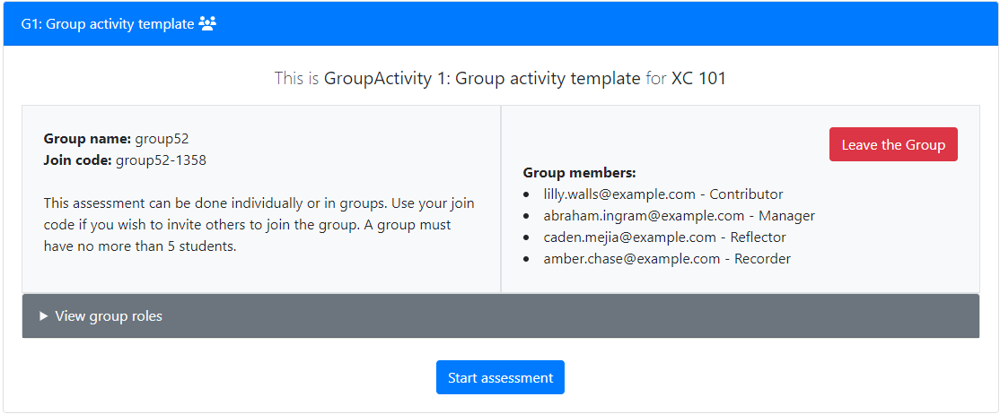

# Assessment configuration

!!! note

    Any time you edit or add an `infoAssessment.json` file on a local copy of PrairieLearn, you need to click the “Load from disk” button in the header so that the local PrairieLearn server reloads the changes.

## Required properties

Each assessment must set the following properties in their `infoAssessment.json` file:

| Property                       | Type   | Description                                                               |
| ------------------------------ | ------ | ------------------------------------------------------------------------- |
| `uuid`                         | string | [Unique identifier](../uuid.md).                                          |
| [`type`](#assessment-types)    | string | Either `"Homework"` or `"Exam"`.                                          |
| `title`                        | string | The title of the assessment (e.g., `"Derivatives and integrals"`).        |
| `set`                          | string | Which assessment set this belongs to (e.g., `"Quiz"`, `"Practice Quiz"`). |
| [`number`](#assessment-naming) | string | The number of the assessment within the set (e.g., `"1"`, `"2B"`).        |

### Optional properties

In addition to those properties, the following properties can be used to further configure how the assessment behaves. Most assessments will need to configure the [`allowAccess`](../assessment/accessControl.md) property to control access to the assessment, and the [`zones`](#question-specification) property, which breaks down the assessment into zones of questions. Each zone allows for additional configuration of the questions within the zone.

| Property                                            | Type    | Description                                                                                                                 |
| --------------------------------------------------- | ------- | --------------------------------------------------------------------------------------------------------------------------- |
| [`module`](#grouping-assessments-by-modules)        | string  | The module that this assessment belongs to (e.g., `Chapter 3`). (default: `"Default"`)                                      |
| [`allowAccess`](../assessment/accessControl.md)     | array   | List of access rules. (default: no student access)                                                                          |
| [`zones`](#question-specification)                  | array   | Specification of zones and questions. (default: none)                                                                       |
| `text`                                              | string  | HTML text shown on the assessment overview page. (default: none)                                                            |
| `multipleInstance`                                  | boolean | Whether to allow students to create whole new attempts at the entire assessment. (default: `false`)                         |
| `maxPoints`                                         | number  | The maximum points that can be earned. (default: sum of zone max points)                                                    |
| [`maxBonusPoints`](#assessment-points)              | number  | The maximum number of additional points that can be earned beyond `maxPoints`. (default: 0)                                 |
| [`shuffleQuestions`](#question-order-randomization) | boolean | Whether to randomize the question order. (default: `false` for Homework-type assessments, `true` for Exam-type assessments) |
| `autoClose`                                         | boolean | Whether to automatically close the assessment after 6 hours of inactivity (Exams only). (default: `true`)                   |
| `allowIssueReporting`                               | boolean | Whether to allow students to report question issues. (default: `true`)                                                      |
| `allowPersonalNotes`                                | boolean | Whether to allow students to add personal notes. (default: `true`)                                                          |
| `constantQuestionValue`                             | boolean | Whether to disable the question value boost on correct solutions (Homework only). (default: `false`)                        |
| `allowRealTimeGrading`                              | boolean | Whether to grade questions in real time (Exams only). (default: `true`)                                                     |
| `requireHonorCode`                                  | boolean | Whether to require students to agree to the honor code (Exams only). (default: `true`)                                      |
| `honorCode`                                         | string  | Custom text to be specified for the honor code (Exams only). (default: none)                                                |
| `advanceScorePerc`                                  | number  | Minimum score percentage require to advance to the next question (Exams only). (default: 0)                                 |
| `gradeRateMinutes`                                  | number  | Minimum amount of time (in minutes) between graded submissions to the same question. (default: 0)                           |

#### Group work

The following group work properties (all optional) can be used to configure group work for an assessment.

| Property                                                          | Type    | Description                                                                                                                     |
| ----------------------------------------------------------------- | ------- | ------------------------------------------------------------------------------------------------------------------------------- |
| [`groupWork`](#enabling-group-work-for-collaborative-assessments) | boolean | Whether the assessment will support group work. (default: `false`)                                                              |
| `groupMaxSize`                                                    | number  | Maximum number of students in a group. (default: none)                                                                          |
| `groupMinSize`                                                    | number  | Minimum number of students in a group. (default: none)                                                                          |
| [`groupRoles`](#enabling-custom-group-roles)                      | array   | Array of custom user roles in a group. (default: none)                                                                          |
| `canSubmit`                                                       | array   | A list of group role names that can submit questions in this assessment. Only applicable for group assessments. (default: none) |
| `canView`                                                         | array   | A list of group role names that can view questions in this assessment. Only applicable for group assessments. (default: none)   |
| `studentGroupCreate`                                              | boolean | Whether students can create groups. (default: `false`)                                                                          |
| `studentGroupJoin`                                                | boolean | Whether students can join groups. (default: `false`)                                                                            |
| `studentGroupLeave`                                               | boolean | Whether students can leave groups. (default: `false`)                                                                           |
| `studentGroupChooseName`                                          | boolean | Whether students can choose their own group name. (default: `true`)                                                             |

See the [reference for `infoAssessment.json`](../schemas/infoAssessment.md) for more information about what can be added to this file.

## Assessment types

Each assessment has a `type`, which must be either `"Homework"` or `"Exam"`:

- Homeworks are designed for formative learning and allow students to infinitely retry different random variants of questions. A persistent student can eventually get 100%.
- Exams, on the other hand, are designed for measuring student knowledge and give each student just one variant of each question, with limited retries. Students will typically not get 100%.

The type controls the overall behavior of the assessment and applies various default settings, some of which can be customized. An assessment's type doesn't have to correspond to how the assessment is administered; for example, an instructor could assign an Exam-type assessment for completion outside of class as homework.

A detailed comparison of the two types is shown below.

|                          | `Homework`                                                                                          | `Exam`                                                                                     |
| ------------------------ | --------------------------------------------------------------------------------------------------- | ------------------------------------------------------------------------------------------ |
| **General purpose**      | Formative assessments, practice                                                                     | Summative assessments, measure learning                                                    |
| **Randomized questions** | [Multiple variants (if question supports them)](#limiting-the-number-of-attempts-for-each-question) | Each student gets a single variant                                                         |
| **Number of attempts**   | Unlimited attempts                                                                                  | [Limited attempts, possibly with decreasing points](#question-points-for-exam-assessments) |
| **Gamification**         | [Rewards repeated correct answers](#question-points-for-homework-assessments)                       | Incentivizes a correct answer as early as possible                                         |
| **Question order**       | [Fixed order by default](#question-order-randomization)                                             | [Shuffled order within zones by default](#question-order-randomization)                    |
| **Time limits**          | Not supported                                                                                       | [Supported](../assessment/accessControl.md#time-limits)                                    |
| **Passwords**            | Not supported                                                                                       | [Supported](../assessment/accessControl.md#passwords)                                      |
| **Multiple instances**   | Not supported                                                                                       | [Supported](#multiple-instance-versus-single-instance-assessments)                         |
| **Assessment updates**   | Updated if assessment changes                                                                       | Assessment is fixed on creation                                                            |
| **Closing assessments**  | Assessments remain open                                                                             | [By default, idle assessments are closed after 6 hours](#auto-closing-exam-assessments)    |
| **Honor pledge**         | Not supported                                                                                       | [Enabled by default](#honor-code)                                                          |
| **Real-time grading**    | Always enabled                                                                                      | [Can be disabled](#disabling-real-time-grading)                                            |

## Assessment naming

Each assessment has a `title` describing its topic. Additionally, each assessment belongs to a `set` (e.g., `Homework`, `Quiz`, `Exam`) and within each set the assessment has a `number`. Depending on the context, assessments are referred to by either an _abbreviation_, a _short name_ or a _long name_. The format of these is:

- Abbreviation = `[Set abbreviation][Number]` (e.g., `Q2` to mean the second quiz).
- Short name = `[Set] [Number]` (e.g., `Quiz 2`).
- Long name = `[Set] [Number]: [Title]` (e.g., `Quiz 2: Coordinates and Vectors`).

You can select a set name from the list of [standardized assessment sets](../course/index.md#standardized-assessment-sets) or [create your own](../course/index.md#adding-your-own-assessment-sets).

The `type` of an assessment does not have to correspond to the `set` it is in, but these are generally compatible. For example, `"type": "Homework"` assessments normally have `"set": "Homework"` or `"set": "Machine Problem"`. On the other hand, `"type": "Exam"` assessments normally have `"set": "Quiz"`, `"set": "Exam"`, or similar.

## Grouping assessments by modules

Instructors may want to group their assessments by course modules (topics, sections, or chapters in a course). When using `"groupAssessmentsBy": "Module"` in `infoCourseInstance.json`, instructors can assign an assessment to a specific module by setting the `module` property in `infoAssessment.json`, as illustrated in the example above. If the property `module` is omitted, by default the assessment will have `"module": "Default"`.

For more information about how to create your own assessment modules, see the [course configuration](../course/index.md#assessment-modules) documentation.

## Question order randomization

The `shuffleQuestions` parameter controls whether questions on an assessment appear in the same order for all students, or whether this order is randomized for each student. The default value depends on the `type` of the assessment:

| Assessment type | `shuffleQuestions` default | Meaning                                                                                                                                                                                                                        |
| --------------- | -------------------------- | ------------------------------------------------------------------------------------------------------------------------------------------------------------------------------------------------------------------------------ |
| `Homework`      | `false`                    | Homeworks default to using the same question order as in `infoAssessment.json` for all students.                                                                                                                               |
| `Exam`          | `true`                     | Exams default to randomizing the question order individually for each student. This randomization happens within each zone, but the zones themselves always appear in the same order and there is no cross-zone randomization. |

If a `Homework` is set to shuffle the question order, it will use a unique-per-course number for each question, so that all students will still get the same question numbers (like #427), but they will not be in order. This makes it easy for students to discuss questions with course staff; they can say "I don't know how to do #427" and everyone will be seeing the same question #427. The main advantage of randomizing question order on Homeworks is to enable data collection on question difficulty and student behavior that is independent of the order in which questions are listed on the assessment.

## Question specification

An assessment is broken down in to a list of zones, like this:

```json title="infoAssessment.json"
{
  "zones": [
    {
      "title": "Easy questions",
      "comment": "These are new questions created for this exam",
      "questions": [
        { "id": "anEasyQ", "autoPoints": [10, 5, 3, 1, 0.5, 0.25] },
        { "id": "aSlightlyHarderQ", "autoPoints": [10, 9, 7, 5] }
      ]
    },
    {
      "title": "Hard questions",
      "comment": "These are new questions created for this exam",
      "questions": [
        { "id": "hardQV1", "autoPoints": 10 },
        { "id": "reallyHardQ", "autoPoints": [10, 10, 10] },
        {
          "numberChoose": 1,
          "autoPoints": 5,
          "alternatives": [{ "id": "FirstAltQ", "autoPoints": 10 }, { "id": "SecondAltQ" }]
        }
      ]
    },
    {
      "title": "Manually graded questions",
      "comment": "These are questions that include manual grading components",
      "questions": [
        { "id": "essayQ", "manualPoints": 10 },
        { "id": "autoPlusManualQ", "autoPoints": [10, 7, 5], "manualPoints": 15 }
      ]
    }
  ]
}
```

| Zone Property          | Type    | Description                                                                                                                                           |
| ---------------------- | ------- | ----------------------------------------------------------------------------------------------------------------------------------------------------- |
| `title`                | string  | The title of the zone. (Optional; default: none)                                                                                                      |
| `questions`            | array   | The list of slots for questions and question alternatives within the zone. (Required; no default)                                                     |
| `numberChoose`         | integer | Number of questions to select for each student from this zone. (Optional; default: select all)                                                        |
| `maxPoints`            | number  | Limit on the number of points that can be earned from this zone. (Optional; default: sum of question max points)                                      |
| `bestQuestions`        | integer | Only this many questions in the zone will count towards the total points (highest-point questions will count). (Optional; default: use all questions) |
| `allowRealTimeGrading` | boolean | Whether to grade questions in this zone in real time (Exams only). (Optional; default: `true`)                                                        |
| `comment`              | string  | Free‑form comment for the zone. (Optional; default: none)                                                                                             |

Zone specification details are in the [format specification for `infoAssessment.json`](../schemas/infoAssessment.md)

- Each zone appears in the given order in the assessment. Zone titles are optional and are displayed to the student if present.

- Within each zone the question order is randomized based on [the assessment type and the `shuffleQuestions` option](#question-order-randomization).

- If a zone has `maxPoints`, then, of the points that are awarded for answering questions in this zone, at most `maxPoints` will count toward the total points.

- If a zone has `bestQuestions`, then, of the questions in this zone, only `bestQuestions` with the highest number of awarded points will count toward the total points.

## Question alternatives

Each zone has a list of `questions`. An entry in this list can be a single question:

```json
{ "id": "hardQV1", "points": 10 }
```

Or an entry can contain a _question alternative list_:

```json
{
  "numberChoose": 1,
  "points": 5,
  "alternatives": [{ "id": "FirstAltQ" }, { "id": "SecondAltQ" }]
}
```

If a question alternative list is specified, some of these questions are first selected at random for each student, and then random variants of those questions are generated. Question alternatives inherit the points of their parent group, if specified.

| Slot property          | Type            | Description                                                                                                                                                                                                                                                                                                                                                      |
| ---------------------- | --------------- | ---------------------------------------------------------------------------------------------------------------------------------------------------------------------------------------------------------------------------------------------------------------------------------------------------------------------------------------------------------------- |
| `autoPoints`           | number or array | The number of points for the autograding portion of this question (or for each question in this alternative list if `alternatives` is set). Can be a number (e.g., `10`) or, for Exam-type assessments only, can be a declining list of points (e.g., `[10, 8, 4]`) for partial credit. (Optional; default: zero)                                                |
| `manualPoints`         | number          | The number of points for the manual grading portion of this question (or for each question in this alternative list if `alternatives` is set). (Optional; default: zero)                                                                                                                                                                                         |
| `points`               | number or array | The number of points for this question (or for each question in this alternative list if `alternatives` is set). Can be a number (e.g., `10`) or, for Exam-type assessments only, can be a declining list of points (e.g., `[10, 8, 4]`) for partial credit. (Required if `autoPoints` and `manualPoints` are not set, can't be specified otherwise; no default) |
| `maxAutoPoints`        | number          | The maximum points available for the autograding portion of this question (or for each question in this alternative list if `alternatives` is set) on a Homework that allows multiple attempts for more points. May only be specified in Homework-type assessments, and only if `autoPoints` is specified. (Optional; default: same as `autoPoints`)             |
| `maxPoints`            | number          | The maximum points available for this question (or for each question in this alternative list if `alternatives` is set) on a Homework that allows multiple attempts for more points. May only be specified in Homework-type assessments, and only if `points` is specified. (Optional; default: same as `points`)                                                |
| `id`                   | string          | The question ID if this slot contains just one question (can’t be specified with `alternatives`). (Optional; default: none)                                                                                                                                                                                                                                      |
| `alternatives`         | array           | The list of question alternatives if this slot contains multiple alternative questions (can’t be specified with `id`). (Optional; default: none)                                                                                                                                                                                                                 |
| `numberChoose`         | integer         | If `alternatives` are specified, the number of them to select. (Optional; default `1`).                                                                                                                                                                                                                                                                          |
| `triesPerVariant`      | integer         | The maximum number of attempts allowed for each question variant (on Homeworks). (Optional; default `1`)                                                                                                                                                                                                                                                         |
| `allowRealTimeGrading` | boolean         | Whether to allow real-time grading for this question (Exams only). (Optional; default `true`)                                                                                                                                                                                                                                                                    |
| `forceMaxPoints`       | boolean         | Whether to force all students to receive maximum points. See [Regrading](../regrading.md). (Optional; default `false`)                                                                                                                                                                                                                                           |

Slot specification details are in the [format specification for `infoAssessment.json`](../schemas/infoAssessment.md)

## Question points for `Homework` assessments

Assessments with `"type": "Homework"` are designed to allow students to repeatedly practice different variants of questions (that is, different random values in the question) until they achieve mastery. The assumption here is that any student should be able to receive full points for a homework question if they work long enough on it. See [Question scoring details for `Homework` assessments](#question-scoring-details-for-homework-assessments) for details on the exact scoring algorithm.

Each question is assigned a set number of _auto points_ (points that are automatically assigned by an internal or external grader) and _manual points_ (points that are [assigned manually by a human grader](../manualGrading/index.md)).

Auto-grading points are set using the `autoPoints` value, which must be a single number and which corresponds to the initial value of a correct attempt. For example, if we have `"autoPoints": 3` then a correct answer is worth 3 points, while a 50%-correct answer is worth 1.5 points.

If a student answers a question incorrectly, a new question variant is generated with new random numbers and the student can try again. There is no penalty for incorrect answers and students can try as many times as they like. Also see the `triesPerVariant` option in [Limiting the number of attempts for each question](#limiting-the-number-of-attempts-for-each-question).

To encourage students to solve the same question correctly more than once (to emphasize mastery), a question can have `maxAutoPoints` set to a value that is more than `autoPoints`. In this case a student can get credit for multiple correct solutions, each for a different randomized variant, until reaching `maxAutoPoints`. For example, if we have `"autoPoints": 3` and `"maxAutoPoints": 9` then the student could solve three different variants of the question correctly and receive 3 points for each of them. After this the student can continue to solve the question for practice, but they will not receive any more points for it. If `maxAutoPoints` is not specified then the question acts as if `maxAutoPoints` is equal to `autoPoints`. The use of `maxAutoPoints` means that the question has a total value of `maxAutoPoints` points, so in the previous example this is effectively a 9-point question (from `maxAutoPoints`) even though `autoPoints` is set to 3. To receive full points for the question the student will have to answer it correctly more than once.

By default, when using `maxAutoPoints`, PrairieLearn provides an incentive for students to answer a specific question correctly multiple times in a row. This is done by increasing the value of each submission for every consecutive correct answer, while setting it back to the original value if the answer is incorrect or partially correct. So, for example, if `autoPoints` is 3 and `maxAutoPoints` is 30, then the first correct answer is worth 3 points. If the next submission is also fully correct, it will be worth 6 points; a following answer is worth 9 points if correct — for a total of 3+6+9=18 points earned; and so on. If any answer is incorrect or partially correct, the value earned for a new correctly-solved variant is reset to 3 points. To disable this behavior and keep the question value at a constant value of 3, set `"constantQuestionValue": true` in the assessment settings, like this:

```json title="infoAssessment.json"
{
  "constantQuestionValue": true,
  "zones": [
    {
      "questions": [
        /* ... */
      ]
    }
  ]
}
```

When using `maxAutoPoints`, the number of correct answers needed to obtain the full points available for a question can vary depending on how many consecutive correct answers the student is able to submit. If we use `"constantQuestionValue": true` then the question value never changes and so the number of correct answers needed is just `maxAutoPoints / autoPoints`. However, in the default case when `constantQuestionValue` is false, repeated correct answers will allow a student to reach the `maxAutoPoints` more quickly. For example, with `autoPoints` of 3 and `maxAutoPoints` of 30, a student who answers the question correctly just 4 times in a row will receive the full 3+6+9+12=30 points. This means that a student who has achieved mastery can quickly complete the question. In contrast, a student who is struggling with the question may have to answer it correctly up to 30/3=10 times if they make repeated mistakes along the way to keep resetting the question value back to 3.

Manual grading points are set using the `manualPoints` value. It is acceptable to use only one of `autoPoints` or `manualPoints`, in which case the other part of the points will be assigned a value of 0. Note that manual points are only applied to a question once, regardless of the number of submissions or variants the student answers.

A question may also set a value to `points` instead of `autoPoints` and `manualPoints`. If this option is used, questions with a `gradingMethod` set to `Manual` will be assigned only manual points, while questions with other grading methods will be assigned only auto points. To avoid ambiguity, it is an error to use both `points` and `autoPoints`, or `points` and `manualPoints`, in the same question. If `points` is used, then `maxPoints` should be used instead of `maxAutoPoints`.

## Question points for `Exam` assessments

Assessments with `"type": "Exam"` are designed to test students' knowledge of course material. Students can retry questions for reduced points, so long as real-time grading is allowed (the default). See [Question scoring details for `Exam` assessments](#question-scoring-details-for-exam-assessments) for details on the exact scoring algorithm.

Each question is assigned a set number of _auto points_ (points that are automatically assigned by an internal or external grader) and _manual points_ (points that are [assigned manually by a human grader](../manualGrading/index.md)).

Exam questions only ever generate a single random variant of the question, but students may be able to make multiple attempts to answer the question (assuming that the default of `allowRealTimeGrading` is used so that students can know whether their answers are incorrect and need to be reattempted). For each question, auto-grading points are set using the `autoPoints` value, which is a list of values like [10, 7, 5]. This would mean that a correct answer on the first attempt is worth 10 points, a correct answer on the second attempt is worth 7 points, and so on. If `autoPoints` is set to a single value rather than a list then only a single attempt is allowed for that number of points.

If a student receives partial credit for an answer then they receive correspondingly reduced points. For example, with [10, 7, 5] `autoPoints`, a 50%-correct submission on the first attempt would be worth 5 points. The exact details of how points are awarded are described in [Question scoring details for `Exam` assessments](#question-scoring-details-for-exam-assessments). The principles of this scoring system are that students should be incentivized to answer questions correctly as soon as possible, and that students should never lose points by attempting a question again.

Manual grading points are set using the `manualPoints` value. It is acceptable to use only one of `autoPoints` or `manualPoints`, in which case the other part of the points will be assigned a value of 0.

A question may also set a value to `points` instead of `autoPoints` and `manualPoints`. If this option is used, questions with a `gradingMethod` set to `Manual` will be assigned only manual points, while questions with other grading methods will be assigned only auto points. To avoid ambiguity, it is an error to use both `points` and `autoPoints`, or `points` and `manualPoints`, in the same question. If `points` is used, then `maxPoints` should be used instead of `maxAutoPoints`.

## Question scoring details for `Homework` assessments

This section describes in detail how repeated attempts are scored for `Homework` questions, assuming that the question has `autoPoints`. See [Question points for `Homework` assessments](#question-points-for-homework-assessments) for a high-level overview. Scoring for `manualPoints` is handled separately.

The two important question configuration settings are:

- **`autoPoints`** is the number of points that the student receives for a submission that is fully correct.
- **`maxAutoPoints`** is the maximum number of points that the student can receive for a question, regardless of how many times they answer it correctly.

The basic idea is that students should receive `autoPoints` each time they solve the question successfully, up to a maximum of `maxAutoPoints`. When partial credit is awarded, a student receives partial points for the question, but only if they are getting closer to a correct answer. For example, if a student repeatedly answers a question with 50% correct answers then they will receive 50% points for the first such answer, but they will not be able to build up points to reach `maxAutoPoints`. They will need to answer the question 100% correctly to be able to advance their points past the 50% mark.

The exact details of how PrairieLearn awards points are as follows. First, a number of variables are computed internally by PrairieLearn as the student answers the question:

- **Submission percentage score** is the score (between 0% and 100%) that the student receives for any given submission attempt, as evaluated by the question grading specification.
- **Best current score** is the highest submission percentage score the student has received so far. If the student has already achieved 100% for a submission at least once, it is the highest submission percentage score the student has received since last achieving 100% for a submission. This is initialized to zero.
- **Question value** is the current maximum number of points that the question is worth. This starts at `autoPoints` and increases by `autoPoints` for each consecutive correct submission. This is initialized to `autoPoints`.
- **Question points** is the total number of points earned by the student for the question. This will never decrease. This is initialized to zero.

When a student submits an answer to a question, the submission is first checked for validity. For example, the `pl-number-input` element considers a non-numeric input to be invalid. If the submission is valid then it is next determined whether it should be graded. A submission is only graded if explicitly requested by the student using the "Save & Grade" button, or if it is the last submission when the assessment is closed.

For each graded answer submission made by a student, the scoring algorithm is as follows:

1. If the `submission percentage score` is more than `best current score`, add `(submission percentage score - best current score) / 100 * question value` to `question points`, capping `question points` at `maxAutoPoints`.
2. If the `submission percentage score` is 100%, then reset `best current score` to zero. Otherwise, if the `submission percentage score` is more than `best current score`, then set `best current score` to `submission percentage score`.
3. If the `submission percentage score` is 100% and `constantQuestionValue` is not set to true, then increase `question value` by `autoPoints`. Otherwise, set `question value` to `autoPoints`.

As an example, suppose a student makes nine submissions of varying degrees of correctness to a question. Assume the question has `autoPoints` set to 4 and `maxAutoPoints` set to 16. The student's submissions are as follows:

| Submission number | Submission perc. score | Best current score | Question value | Question points | Comment                                                                                                                                          |
| ----------------- | ---------------------- | ------------------ | -------------- | --------------- | ------------------------------------------------------------------------------------------------------------------------------------------------ |
| Init              | -                      | 0                  | 4              | 0               | Initial values                                                                                                                                   |
| 1                 | 50%                    | 50%                | 4              | 2               | (50% - 0%) \* 4 = 2 points awarded                                                                                                               |
| 2                 | 80%                    | 80%                | 4              | 3.2             | (80% - 50%) \* 4 = 1.2 points awarded                                                                                                            |
| 3                 | 20%                    | 80%                | 4              | 3.2             | No improvement in score, so no points awarded or deducted                                                                                        |
| 4                 | 100%                   | 0%                 | 8              | 4               | (100% - 80%) \* 4 = 0.8 points awarded, `best current score` reset to 0%, `question value` increased to 8                                        |
| 5                 | 50%                    | 50%                | 4              | 8               | (50% - 0%) \* 8 = 4 points awarded, `question value` reset to 4                                                                                  |
| 6                 | 0%                     | 50%                | 4              | 8               | No improvement in score, so no points awarded or deducted                                                                                        |
| 7                 | 90%                    | 90%                | 4              | 9.6             | (90% - 50%) \* 4 = 1.6 points awarded or deducted                                                                                                |
| 8                 | 100%                   | 0%                 | 8              | 10              | (100% - 90%) \* 4 = 0.4 points awarded, `best current score` reset to 0%, `question value` increased to 8                                        |
| 9                 | 100%                   | 0%                 | 12             | 16              | 100% \* 8 = 8 points awarded, but points are capped by `maxAutoPoints` of 16, `best current score` reset to 0%, `question value` increased to 12 |

After the nine submissions above the student has achieved maximum points for the question. They can continue to answer the question for additional practice, but they cannot earn any more points for it.

## Question scoring details for `Exam` assessments

This section describes in detail how repeated attempts are scored for `Exam` questions, assuming that the question has `autoPoints` set to a list of values. See [Question points for `Exam` assessments](#question-points-for-exam-assessments) for a high-level overview. Scoring for `manualPoints` is handled separately.

The important question configuration setting is:

- **`autoPoints`** is a list of points, with the `n`-th entry being the number of points that a student receives for a fully correct submission on the `n`-th attempt at the question. If `autoPoints` is set to a single value rather than a list then only a single attempt is allowed.

The basic idea is that `autoPoints` is set to a decreasing sequence of points, such as `[10, 7, 5, 2]`. In this case, a correct answer on the first attempt is worth 10 points, a correct answer on the second attempt is worth 7 points, and so on. If the student does not answer the question correctly after four attempts, they will receive 0 points for the question and cannot attempt it again.

The details of how scoring works are made more complex by the fact that a student may receive partial credit for any given submission attempt. PrairieLearn uses a scoring system that has four key properties, assuming that `autoPoints` is a list of decreasing values:

1. A student can never lose points by attempting a question again.
2. If a student submits an answer with a higher score than their previous best answer, they will always receive some additional points for it.
3. Taking more attempts to answer correctly will always be worth less points than answering in fewer attempts, so students are always incentivized to answer questions correctly as soon as possible.
4. The total number of submission attempts that a student can make is limited by the number of entries in `autoPoints`.

The exact details of how PrairieLearn awards points are as follows. First, a number of variables are computed internally by PrairieLearn as the student answers the question:

- **Submission percentage score** is the score (between 0% and 100%) that the student receives for any given submission attempt, as evaluated by the question grading specification.
- **Best current score** is the highest submission percentage score the student has received so far. This is initialized to zero.
- **Question value** is the current maximum number of points that the question is worth. This is equal to `autoPoints[n]` for the `n`-th attempt at the question.
- **Question points** is the total number of points earned by the student for the question. This will never decrease. This is initialized to zero.

When a student submits an answer to a question, the submission is first checked for validity. For example, the `pl-number-input` element considers a non-numeric input to be invalid. If the submission is valid then it is next determined whether it should be graded. A submission is only graded if explicitly requested by the student using the "Save & Grade" button, or if it is the last submission when the assessment is closed.

For the `n`-th graded answer submission made by a student, the scoring algorithm is as follows:

1. Set the `question value` to `autoPoints[n]`.
2. If the `submission percentage score` is more than `best current score`, add `(submission percentage score - best current score) / 100 * question value` to `question points`.
3. If the `submission percentage score` is more than `best current score`, then set `best current score` to `submission percentage score`.
4. If the `submission percentage score` is 100% and there are no manual points, or `n` is the last attempt, then prohibit further submissions to the question.

As an example, suppose a student makes 4 submissions of varying degrees of correctness to a question which has `autoPoints` set to `[10, 7, 5, 2]`. The student's submissions are as follows:

| Submission number | Submission perc. score | Best current score | Question value | Question points | Comment                                                   |
| ----------------- | ---------------------- | ------------------ | -------------- | --------------- | --------------------------------------------------------- |
| Init              | -                      | 0                  | -              | 0               | Initial values                                            |
| 1                 | 50%                    | 50%                | 10             | 5               | (50% - 0%) \* 10 = 5 points awarded                       |
| 2                 | 20%                    | 50%                | 7              | 5               | No improvement in score, so no points awarded or deducted |
| 3                 | 80%                    | 80%                | 5              | 6.5             | (80% - 50%) \* 5 = 1.5 points awarded                     |
| 4                 | 70%                    | 80%                | 2              | 6.5             | No improvement in score, so no points awarded or deducted |

After the four submissions above the student has achieved 6.5 points for the question, for an overall score of 65% (6.5/10). They can no longer make submission attempts to the question.

## Assessment instances, question selection, and question order

PrairieLearn distinguishes between _assessments_ and _assessment instances_. An _assessment_ is determined by the configuration in an `assessments/` directory, and is something like "Midterm 1". Given an assessment, PrairieLearn needs to select the random list of questions for each student (or group of students, for group assessments), and it is this selection that is the _assessment instance_ for the student/group. There is only one copy of each assessment, but every student/group has their own assessment instance.

The specific questions assigned to a particular assessment instance are chosen in three steps:

1. For each entry in the zone `questions` array, either take the single question in that entry or randomly select some of the questions from the list of question alternatives to give the _selected questions_. If `numberChoose` is specified, randomly select that many questions from the list of alternatives (defaults to 1).

2. For each zone, concatenate the _selected questions_ from each `questions` entry to form the total list of _available zone questions_. If `numberChoose` is specified for the zone, randomly select that many questions from the available zone questions to give the _zone questions_ (defaults to selecting all of the available zone questions). If shuffling is enabled, randomly shuffle the order of the _zone questions_.

3. Concatenate the _zone questions_ from each zone to form the total set of _assessment questions_. This set of questions forms the _assessment instance_ for this student/group.

Each zone appears in the given order in the assessment (this is not randomized for each assessment instance). Within each zone the question order is randomized per-instance for Exams, but not randomized for Homeworks (but see the [`shuffleQuestions` option](#question-order-randomization)).

## Updating assessments

The rules for updating assessment instances differ between `Homework` and `Exam` assessments.

**`Exam` assessment updates:** Exam assessment instances are generated when the student starts the exam, and they are never automatically deleted, regenerated, or updated, even when the original assessment is changed in some way. This is a safety mechanism to avoid having students' assessments changed during an exam. However, if you want to force the regeneration of assessment instances then you can do so by deleting assessment instances in the "Students" tab. While writing an assessment you might need to do this many times. Once an assessment is live, you should of course be very careful about doing this (basically, don't do it on a production server once an assessment is underway).

**`Homework` assessment updates:** New questions added to Homeworks will be automatically integrated into student homeworks currently in progress. Updates to `maxPoints` or `maxBonusPoints` will take effect the next time a student grades a question. A student's "points" and "percentage score" will never decrease.

## Assessment points

A student's percentage score will be determined by the number of points they have obtained, divided by the value of `maxPoints` for the assessment (subject to the rules associated to [`credit`](../assessment/accessControl.md#credit) in assessment access rules).

```json title="infoAssessment.json"
{
  "uuid": "cef0cbf3-6458-4f13-a418-ee4d7e7505dd",
  "maxPoints": 50,
  "maxBonusPoints": 5
}
```

In the assessment configuration, the `maxPoints` determines the number of points a student is required to obtain to get a score of 100%. The percentage score will thus be computed based on the points the student obtained divided by the value of `maxPoints`. If not provided, `maxPoints` is computed based on the maximum number of points that can be obtained from all questions in all zones.

By default, once a student obtains enough points to reach the value of `maxPoints`, any further points do not affect the assessment score. However, if a value is set for `maxBonusPoints` and `credit` is set to 100, the student can obtain additional points, up to a total of `maxPoints + maxBonusPoints`. The percentage is still based on `maxPoints`, so the use of `maxBonusPoints` allows students to obtain a percentage above 100%, either by completing additional questions, or by receiving additional bonus points in [manual grading](../manualGrading/index.md). If `maxBonusPoints` is set, but `maxPoints` is not provided, then `maxPoints` will be computed by subtracting `maxBonusPoints` from the maximum number of points in all questions.

The choice of using `maxBonusPoints` or a `credit` value above 100 is based on instructor's choice. Additional points based on `maxBonusPoints` are intended to be credited based on extra work, while `credit` above 100 is to be awarded for early completion. It is possible to combine them, and use them together in the same assessment. If `maxBonusPoints` is set while the `credit` is above 100, then the percentage is based on both `maxBonusPoints` and `credit` (see [`credit`](../assessment/accessControl.md#credit) for details).

## Multiple-instance versus single-instance assessments

By default, all assessments are _single instance_, meaning that each student has exactly one instance of the assessment that they can complete, and once they have completed that assessment instance then they cannot do the assessment again. This is the expected behavior for homeworks, quizzes, exams, etc.

For practice exams it is often desirable to make a _multiple instance_ assessment by setting the option `"multipleInstance": true`. This will allow students to create new assessment instances and try the whole assessment repeatedly. This setting may be used in cases where students are expected to get multiple attempts for the same assessments, either for no credit (i.e., for practice only), or where credit applies to the attempt with the highest overall score.

Note that this setting is not suitable in scenarios where multiple attempts are created in different environments. For example, if students write an exam for credit, and are then allowed to re-attempt the same exam without credit for practice, or where the score used in the course is a weighted average of the attempts, then the multiple-instance option is not a valid approach. In such cases, a better option is a separate assessment (possibly with the same questions) for the original exam and for the practice version or re-attempt. The practice version itself may be suitable for multiple instances, but not the original exam.

## Enabling group work for collaborative assessments

By default, assessment instances are tied to only one user. By setting `"groupWork": true`, multiple students will be able to work on the same assessment instance. Group configuration can be set in the `infoAssessment.json` file. For example:

```json title="infoAssessment.json"
{
  "groupWork": true,
  "groupMaxSize": 6,
  "groupMinSize": 2,
  "studentGroupCreate": true,
  "studentGroupChooseName": true,
  "studentGroupJoin": true,
  "studentGroupLeave": true
}
```

| Attribute                | Type    | Default | Description                                                                                                |
| ------------------------ | ------- | ------- | ---------------------------------------------------------------------------------------------------------- |
| `groupWork`              | boolean | false   | Enable the group work for the assessment.                                                                  |
| `groupMaxSize`           | integer | -       | The maximum size of a group (default: no minimum).                                                         |
| `groupMinSize`           | integer | -       | The minimum size of a group (default: no maximum).                                                         |
| `studentGroupCreate`     | boolean | false   | Allow students to create groups.                                                                           |
| `studentGroupChooseName` | boolean | true    | Allow students to choose a group name when creating a group. If set to false, a default name will be used. |
| `studentGroupJoin`       | boolean | false   | Allow students to join other groups by join code.                                                          |
| `studentGroupLeave`      | boolean | false   | Allow students to leave groups.                                                                            |

Note that changing an assessment from individual to group or vice versa after students have started working on it will cause student work to be lost.

### Managing groups

Instructors can manage groups on the "Groups" tab of an assessment. This page allows instructors to create individual groups, delete existing groups, and add or remove users from groups.

To create groups in bulk, upload a CSV file in the following format:

```csv
groupName,UID
groupA,one@example.com
groupA,two@example.com
groupB,three@example.com
groupB,four@example.com
```

The assessment's "Downloads" tab has an `<assessment>_groups.csv` file that contains the current group assignments. This can be used to copy group assignments from one assessment to another. The same file is also listed at the bottom of the groups page.

Alternatively, the "Random" button can be used to randomly assign students to groups based on a desired minimum/maximum group size.

### Student options for group work


If an instructor does not assign a student to a group, the student will need to join one before opening their assessment instance. They can either create a new one or join an existing group via a join code, which they can get from another classmate.

When calculating a student's grade for a group assessment, PrairieLearn will always use the score of their group's assessment instance.

!!! info

    Students cannot see each other's edits in real-time.


Students are able to see their groupmates' UIDs, which can become a point of contact to communicate with each other outside PrairieLearn. They are also able to leave their group to join a different one.

### Enabling custom group roles

By default, students working in a collaborative group assessments can view and submit every question. However, instructors can define **custom group roles**, which can be assigned different permissions to facilitate role-based teamwork. Assessments can be configured to allow or restrict some operations to students with specific roles, such as:

- Submitting specific questions
- Viewing specific questions
- Assigning group roles for other students

Although in most cases each student is expected to take one role, students are allowed to take on multiple roles in some narrow scenarios, such as when users leave and join groups after assessments have started.

To opt in to custom group roles, group roles must be defined at the root of the `infoAssessment.json` file. For example:

```json title="infoAssessment.json"
{
  "groupRoles": [
    {
      "name": "Manager",
      "minimum": 1,
      "maximum": 1,
      "canAssignRoles": true
    },
    {
      "name": "Recorder",
      "minimum": 1,
      "maximum": 1
    },
    {
      "name": "Reflector",
      "minimum": 1,
      "maximum": 1
    },
    {
      "name": "Contributor"
    }
  ]
}
```

| Attribute        | Type    | Default | Description                                                                  |
| ---------------- | ------- | ------- | ---------------------------------------------------------------------------- |
| `name`           | string  | -       | The name of the role.                                                        |
| `minimum`        | integer | 0       | The minimum required number of students holding this role in the assessment. |
| `maximum`        | integer | -       | The maximum required number of students holding this role in the assessment. |
| `canAssignRoles` | boolean | false   | Allow students with this role to assign roles to other students.             |

Students typically select their roles before starting an assessment, but they can change their roles mid-assessment if needed. As a safeguard against invalid role configurations, PrairieLearn prevents students from viewing questions if a group's role configuration does not meet the instructor's specification.

#### Adding permissions for an assessment

Permissions can be configured at the _assessment_, _zone_, or _question_ level.

The schema for permissions is defined as follows:

```json
{
  "canView": ["Manager", "Reflector", "Recorder", "Contributor"],
  "canSubmit": ["Recorder"]
}
```

| Attribute   | Type            | Default | Description                                                     |
| ----------- | --------------- | ------- | --------------------------------------------------------------- |
| `canView`   | Array of string | -       | The names of roles that can view this part of the assessment.   |
| `canSubmit` | Array of string | -       | The names of roles that can submit this part of the assessment. |

Setting either `canView` or `canSubmit` to `[]` (empty array) means that **no role** can view or submit that part of the assessment, respectively. If either attribute is not set, it means that **every role** has the permission associated to the attribute, i.e., any student with any role can view or submit that part of the assessment.

Permissions defined at a higher level are propagated down the assessment hierarchy (assessment ⇾ zone ⇾ question), but permissions defined at lower levels will override those from the higher level. For example:

```json title="infoAssessment.json"
{
  "canView": ["Manager", "Reflector", "Recorder"],
  "zones": [
    {
      "canSubmit": ["Recorder"],
      "questions": [
        { "id": "question1", "points": 1 },
        { "id": "question2", "points": 1, "canView": ["Recorder"] },
        { "id": "question3", "points": 1, "canView": ["Reflector"], "canSubmit": ["Reflector"] }
        { "id": "question4", "points": 1, "canView": null }
      ]
    }
  ]
}
```

In the example above, question 1 can be viewed by students in Manager, Reflector or Recorder roles, but only students with a Recorder role can submit an answer, as per the default roles defined by in the assessment level (for viewing) and the zone level (for editing). Question 2 can only be viewed and submitted by a Recorder, while question 3 can only be viewed and submitted by a Reflector. Question 4 overrides the default settings by using the `null` special value, and allows students in any role to view the question, though only students with the Recorder role can submit an answer.

#### Assigning roles to students

When students join a group, they are automatically assigned a role. Students can always view the roles of other students in the group, both before and during an assessment. Students can click "View role info" to see more information about the assessment's group roles.



When expanded, group assessments display information about each role, such as the min/max number of assignments and whether a role can assign other roles.


Any student with an assigner role can view additional controls to change the roles of other users in the group. Students with assigner roles can re-assign group roles both before and during an assessment.


#### Restrictions based on role permissions

When an instructor restricts the viewing of a question to certain roles, users without those roles will be unable to view that question.


Additionally, when an instructor restricts the submitting of a question to certain roles, users without those roles will be unable to submit that question.


When a role configuration is invalid, which may occur when a user leaves the group or a new user joins the group, students become unable to see any questions until the roles are reviewed. Users with both assigner and non-assigner roles can view these errors. A user with an assigner role is then expected to update the roles to fix the inconsistencies.


## Forcing students to complete questions in-order

!!! warning

    We **strongly** discourage the use of this option during high-stakes exams, as it can be very detrimental to student success. See below for more details.

Certain assessments might be designed to be done linearly, where each question assumes that the student has completed and understood the previous question (e.g., lab worksheets). By default, PrairieLearn allows students to complete questions in any order that they like, but assessments can be configured to not allow students to view future unsolved questions.

To enable these features, set `advanceScorePerc` for any question to a number between 0 and 100. An example of what this looks like is below, with boilerplate attributes omitted:

```json title="infoAssessment.json"
{
  "zones": [
    {
      "questions": [
        { "id": "q1", "advanceScorePerc": 50 },
        { "id": "q2", "advanceScorePerc": 100 },
        { "id": "q3", "advanceScorePerc": 0 },
        { "id": "q4", "advanceScorePerc": 80 },
        { "id": "q5", "advanceScorePerc": 100 }
      ]
    }
  ]
}
```

Each question blocks all later questions until its `advanceScorePerc` is met. In the above example, `q1` blocks all later questions until the student has scored at least 50% on it. Then `q2` blocks all later questions until the student has a perfect score on it. Once a student gets past `q2`, both `q3` and `q4` are immediately available because `q3` does not do any blocking. Finally, `q4` blocks the remaining `q5` until the student has an 80% score on it. The `advanceScorePerc` attribute on `q5` is irrelevant because there are no questions after it.

The relevant score for comparing to `advanceScorePerc` is the student's _highest submission score_ for the question, not their percentage score on the question overall. For example, suppose `q1` above has `"points": [10, 4, 2, 1]`. Then a student who makes a 50%-correct submission on their second attempt will unblock the question, even though they only score 2 points out of 10 on the question (50% of the 4-point second-chance value). The submission score used for `advanceScorePerc` is the one based on autograding components of the question and [manual grading](../manualGrading/index.md) scores are not considered. For this reason a question that is purely manually graded should not have an `advanceScorePerc` set on it.

An `advanceScorePerc` can also be set on the `zone` or `assessment` level, which will act as a default for all questions in that zone or assessment. For example, the following configuration is equivalent to the above:

```json title="infoAssessment.json"
{
  "zones": [
    {
      "advanceScorePerc": 100,
      "questions": [
        { "id": "q1", "advanceScorePerc": 50 },
        { "id": "q2" },
        { "id": "q3", "advanceScorePerc": 0 },
        { "id": "q4", "advanceScorePerc": 80 },
        { "id": "q5" }
      ]
    }
  ]
}
```

In the example above, `q2` and `q5` will have an `advanceScorePerc` of 100 because the zone-level attribute is used as a default.

!!! note

    An `advanceScorePerc` of 0 is equivalent to not having the attribute at all.

For assessments that randomize the order of questions as seen by students, the `advanceScorePerc` restrictions apply for each student using the question order that they were given. If a specific question order is desired then see [Changing question-order randomization](#question-order-randomization).

If a student uses all of their attempts on a question and cannot submit any more attempts, that question will automatically unblock, no matter what score they earned on it. This is to prevent students from getting permanently stuck on an assessment, unable to receive further credit.

### :warning: Warning about in-order questions and high-stakes exams

The `advanceScorePerc` attribute is intended to be used in [group work](#enabling-group-work-for-collaborative-assessments) and assessment types which are indirectly supported, such as worksheets (see [multiple instance assessments](#multiple-instance-versus-single-instance-assessments)). In the interest of allowing students to best demonstrate their knowledge of course material, we **strongly** discourage the use of this feature in high-stakes exams where the student cannot receive help from course staff.

## Auto-closing Exam assessments

By default, Exam assessments will auto-close after six hours of inactivity by the student. This generally means that you don't need to explicitly close exams that students accidentally did not close when they were done. If you want to prevent auto-closing then you can set `"autoClose": false` as a top-level option in the `infoAssessment.json` file.

## Issue reporting

To allow students to report issues with questions (incorrect answers, unclear wording, etc.), set the `"allowIssueReporting": true` property in the `infoAssessment.json` file, or set it to `false` to disallow reporting. This option defaults to `true`.

When issue reporting is allowed, students see a button labeled "Report an error in this question" and they can submit a short text form.

 

Course staff see any reported issues show up on the "Issues" tab.


## Access control

See the [Assessment access control page](../assessment/accessControl.md) for details.

By default, an assessment is only accessible to course staff. To allow students to access the assessment, the `allowAccess` option can be used in the assessment's `infoAssessment.json` file.

Access control options can also be used to control the open/close dates of assessments and apply penalties for late submissions. Once again, see [Assessment access control page](../assessment/accessControl.md) for details and examples.

## Adding text and links to assessments

You can add a `text` property to your `infoAssessment.json`, which can be used to provide additional instructions, formula sheets, etc. You can use EJS syntax to access `clientFilesCourse`, `clientFilesCourseInstance`, and `clientFilesAssessment`.

```json title="infoAssessment.json"
{
  "text": "<a href=\"<%= clientFilesAssessment %>/formulas.pdf\">Formula sheet</a>"
}
```

See the [`clientFiles` and `serverFiles`](../clientServerFiles.md) page for details about making files available to users.

## Student-attached personal notes

By default, students can attach files to assessments as personal notes, either by uploading them or by pasting the file contents as text. This can be done on the assessment overview page, or on individual question pages. These files can be viewed by the student anytime they can view the assessment.

The purpose of this is to allow students to take extra notes during exams, for later review. For example, if a student has a Matlab script that they used to solve a question, they could attach it to that question, so they can review it later.

Although we do not recommend this for regular exams, personal notes can be disabled by setting `"allowPersonalNotes": false` as a top-level option in the `infoAssessment.json` file. Note that this setting does not delete notes that were uploaded before the option is set, but prevents any access or modifications to them.

One particular use case for disabling personal notes can be the upload of a "formula sheet" through a separate pre-exam assessment. These uploads should take place as a regular file upload so that they can be reviewed by course staff. The assessment can then be configured so that submissions are accessible during the exam. Disabling personal notes for the "formula sheet" assessment ensures that students cannot attach any other information that they can access during an exam.

## Disabling real-time grading

PrairieLearn is designed to give students immediate feedback on their work. However, if you wish to more closely replicate a paper exam experience, you can prevent students from grading their work as they go (what we call "real-time grading").

!!! note

    Real-time grading cannot be disabled for `Homework` assessments, as immediate feedback is a core part of the homework experience. The instructions below only apply to `Exam` assessments.

!!! warning

    Students generally expect and benefit from having immediate feedback, so this setting should only be enabled if you have a specific reason for it.

Real-time grading can be disabled for an entire assessment:

```json title="infoAssessment.json"
{
  "allowRealTimeGrading": false
}
```

It can also be disabled for specific zones, alternative groups, or questions by adding `"allowRealTimeGrading": false` to the relevant part of the `infoAssessment.json` file. For example, the following configuration disables real-time grading for the second zone only:

```json title="infoAssessment.json"
{
  "zones": [
    {
      "questions": [
        { "id": "q1", "points": 10 },
        { "id": "q2", "points": 10 }
      ]
    },
    {
      "allowRealTimeGrading": false,
      "questions": [
        { "id": "q3", "points": 10 },
        { "id": "q4", "points": 10 }
      ]
    }
  ]
}
```

Disabling real-time grading changes a number of things about the student experience:

- Only the "Save" button will be available on questions; the "Save & Grade" button won't be shown.
- The "Grade saved answers" button on the assessment overview will only be shown if at least some questions have real-time grading enabled, and when clicked, it will only grade those questions.
- Score information won't be shown for questions that have real-time grading disabled.

If a [time limit](../assessment/accessControl.md#time-limits) is used and runs out, the assessment will still auto-grade and show students exactly which questions they got correct/incorrect. The same revealing behavior will happen if an instructor manually closes and grades the student assessment. To prevent this, set the [`showClosedAssessment` access rule restriction](../assessment/accessControl.md#showinghiding-closed-assessments).

??? note

    When real-time grading is disabled, submissions will still be parsed, and students will be informed of invalid submissions when they click the "Save" button. This includes any element-specific validation (e.g., checking for blank answers, or checking if numeric inputs have numeric values), as well as [question-specific custom parse functionality](../question/server.md#step-4-parse). As usual, invalid submissions do not count towards limited attempts.

    Students will not be prevented from completing the assessment with invalid submissions should they choose to do so, or if they run out of time before crafting a valid submission. However, invalid submissions will not trigger any auto-grading process, and will by default cause the student to get a zero on the whole question (even if there are elements in the submission with valid answers). Manual grading is still available for these submissions.

## Limiting the number of attempts for each question

The number of times each student will be allowed to attempt each question can be set in different ways, depending on the type of question and assessment.

For assessments with type "Exam", each student will only be presented with a single variant of each question. The number of attempts will be determined by the `points` or `autoPoints` setting: if there is a single value there will be a single attempt at the question; if it is set to a list of points, then there will be one attempt for each value in that list. In other words, the number of attempts is determined based on the number of values in the list of points.

For assessments with type "Homework", students will be presented with an unlimited number of attempts for each question. By default, every new attempt corresponds to a different variant of the question, unless:

- the question is set to [`"singleVariant": true` in the question configuration file](../question/index.md#non-randomized-questions). In this case, students will get unlimited attempts for the same variant.

- the `triesPerVariant` setting is set as below. In this case, the student will have the set number of attempts to correctly answer the question. Once the student answers the question correctly, or the number of tries per variant is exhausted, the student will be given the option to try a new variant.

  ```json title="infoAssessment.json"
  {
    "zones": [
      {
        "questions": [
          { "id": "singleAttemptQ", "points": 10 },
          { "id": "tryOncePerVar", "points": 10 },
          { "id": "tryThreeTimesPerVar", "points": 10, "triesPerVariant": 3 }
        ]
      }
    ]
  }
  ```

## Limiting the rate at which answers can be graded

Practice is important in learning and there should be room for mistakes and learning from them. Immediate feedback can help as it can give feedback despite the limited human resources. However, to prevent mindless trial-and-error problem-solving, controlling resubmissions can be an effective tool ([Ihantola et al., Review of Recent Systems for Automatic Assessment of Programming Assignments](https://dl.acm.org/doi/pdf/10.1145/1930464.1930480)).

One way to limit the amount of feedback provided to students is to limit the rate at which graded submissions are allowed. This can be done by using the `gradeRateMinutes` setting. If set, this value indicates how long a student needs to wait after grading a question to resubmit a new answer to the same question for grading. Students are still able to save a submission, but are not able to grade until either the waiting time has elapsed, or when they close the assessment. By default, this value is set to 0, which means that there is no limit.

The `gradeRateMinutes` value can be set for each specific question in the assessment. It can also be set for a zone or the full assessment, in which case it will apply individually to each question in the zone or assessment. In other words, if the assessment has a grading rate set, once a student submits an answer for grading in one question, they have to wait to submit new answers to that question, but they are able to grade other questions in the meantime.

```json title="infoAssessment.json"
{
  "zones": [
    {
      "gradeRateMinutes": 30,
      "questions": [
        { "id": "canOnlySubmitEvery30minutes", "points": 10 },
        { "id": "canOnlySubmitEvery60minutes", "points": 10, "gradeRateMinutes": 60 },
        { "id": "canSubmitAnytime", "points": 10, "gradeRateMinutes": 0 }
      ]
    }
  ]
}
```

## Honor code

By default, `Exam` assessments require students to certify their identity and pledge an honor code before starting the assessment:

- I certify that I am `name` and I am allowed to take this assessment.
- I pledge on my honor that I will not give or receive any unauthorized assistance on this assessment and that all work will be my own.

To disable this requirement, set `"requireHonorCode": false` as a top-level option in the `infoAssessment.json` file.

The text of the honor code was based on the University of Maryland's [Honor Pledge](https://studentconduct.umd.edu/you/students/honor-pledge) and the University of Rochester's [Honor Pledge for Exams](https://www.rochester.edu/college/honesty/instructors/pledge.html). This is a "modified" honor code ([McCabe et al., 2002](https://doi.org/10.1023/A:1014893102151)), as opposed to "traditional" codes that typically also require students to report any violations of the honor code they observe.

The honor code can be customized by setting `honorCode` in the `infoAssessment.json` file. This field supports Markdown syntax for formatting. This field can also accept Mustache templating to include the user's name by using `{{user_name}}`.

For example:

```json title="infoAssessment.json"
{
  "honorCode": "I, {{user_name}}, affirm that I will complete this exam with honesty and integrity."
}
```

## Linking to assessments

Some instructors may wish to publish links that point students directly to their assessments on PrairieLearn. These links may be published in course web pages, LMS systems like Compass or Canvas, or sent to students via email or other messaging platforms. Instructors should note that the URL listed on the browser points to the instructor view of an assessment, which is typically not accessible to students.

The appropriate link to provide to students can be found by opening the "Settings" tab of the Assessment. This page includes, among other useful information, a Student Link that can be provided to students. This link points students directly to the specific assessment, enrolling them automatically in the course if they are not yet enrolled.

## Client fingerprint tracking and changes

While a student is working on an assessment, PrairieLearn tracks the user's IP address, session ID, and user agent (this includes the operating system, browser application, and version). These attributes together make up a client fingerprint. The fingerprints are then recorded during events while accessing the assessment instance. For example, when a student views a question, a record of the client fingerprint is saved along with the view event.

While an assessment is open and active, each time the client fingerprint is recorded, PrairieLearn checks it against the previous client fingerprint used to access that assessment. PrairieLearn will track and display how many times the fingerprint has changed during the course of the assessment. You can see the number of times a fingerprint changed on the Students tab of an assessment. You can also see more detailed information about the client fingerprint by accessing the student's assessment instance and reviewing the Fingerprint column of the event log.

Some fingerprint changes may occur naturally during the course of an assessment, such as a computer connecting to a different Wi-Fi access point or a student changing locations while working on homework. However, a high number of changes in an exam-like environment, while the assessment is in progress, could be a possible indication of collusion between students. In particular, many fingerprint changes could be an indication that multiple users were accessing the exam simultaneously, such as one student in the exam room and a second student outside. In such a case, the exact pattern of fingerprints in the assessment instance log will be helpful in determining whether there is indeed an academic integrity issue.

The fingerprint change counter is only updated while the assessment is open and active. Once the assessment is closed, fingerprints are still tracked, but the count of fingerprint changes is no longer updated since, once the assessment is closed, students will only be able to access the assessment for review, with no new submissions. Access through different devices or browsers at this point does not commonly raise a concern of possible misconduct.
