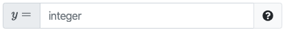

# Concepts

PrairieLearn is extremely flexible and powerful, but this flexibility can be overwhelming at first. This document provides an overview of the key concepts in PrairieLearn, and how they fit together.

## High-level overview

A [**Course**](./course.md) in PrairieLearn is composed of **Course Instances**, **Questions**, and **Custom Elements**. Each [course instance](./courseInstance.md) is an offering of a course in a particular semester/term. For example, a course "CS 225" might have instances "CS 225 Spring 2022" and "CS 225 Fall 2022". A course instance contains all the **Assessments** for that particular term. The course itself contains the questions and custom elements that are shared across all instances. You can think of the course as a bank of questions and elements, that are then used to create assessments for each instance of the course.

=== "Concept Map"

    ```d2
    --8<-- "docs/diagrams/concept-map.d2"
    ```

=== "Example for the `PrairieLearn 101` course"

    ```d2
    --8<-- "docs/diagrams/concept-map-example.d2"
    ```

### Questions

[**Questions**](./question.md) are all independent, and can be graded [using Python](./question.md), or using an [external code autograder](./externalGrading.md). They are written in HTML (as a [Mustache template](https://mustache.github.io/mustache.5.html)) and generated / graded using Python.

=== "Example `question.html`"

    ```html title="question.html"
    <pl-question-panel>
        If $x = {{params.x}}$ and $y$ is {{params.operation}} $x$, what is $y$?
    </pl-question-panel>

    <pl-number-input answers-name="y" label="$y =$"></pl-number-input>
    <pl-submission-panel> {{feedback.y}} </pl-submission-panel>
    ```

=== "Example `server.py`"

    ```python title="server.py"
    def generate(data):
        data["params"]["x"] = random.randint(5, 10)
        data["params"]["operation"] = random.choice(["double", "triple"])

        if data["params"]["operation"] == "double":
            data["correct_answers"]["y"] = 2 * data["params"]["x"]
        else:
            data["correct_answers"]["y"] = 3 * data["params"]["x"]

    def parse(data):
        if "y" not in data["format_errors"] and data["submitted_answers"]["y"] < 0:
            data["format_errors"]["y"] = "Negative numbers are not allowed"

    def grade(data):
        if math.isclose(data["score"], 0.0) and data["submitted_answers"]["y"] > data["params"]["x"]:
            data["partial_scores"]["y"]["score"] = 0.5
            data["score"] = 0.5
            data["feedback"]["y"] = "Your value for $y$ is larger than $x$, but incorrect."
    ```

=== "Example `info.json`"

    ```json title="info.json"
    {
        "uuid": "cbf5cbf2-6458-4f13-a418-aa4d2b1093ff",
        "title": "Doubling and Tripling",
        "topic": "Basic Arithmetic",
        "tags": ["sp24"],
        "type": "v3",
    }
    ```

### Elements

Questions are written in HTML and **Elements**. Elements are pre-built interface elements for common questions, like numerical inputs, multiple choice, and more. **Custom Elements** are reusable components that can be tailored to your course and provide a way to create more complex questions. Custom elements are not necessary for most courses.

=== "Integer input element"

    

=== "HTML for element"

    ```html title="question.html"
    <pl-integer-input answers-name="int_value" label="$y =$"></pl-integer-input>
    ```

You can view a list of all the available elements in the [Elements documentation](./elements.md).

### Assessments

A course contains a collection of questions, which are composed together to create [**Assessments**](./assessment/). Each course instance contains a collection of assessments. There are **Exam Assessments** and **Homework Assessments**.

Asssessments are organized into **Assessment Sets** based on the type of assessment (e.g. `Homework`, `Quiz`, `Exam`). Optionally, each assessment can be a part of a **Module** (e.g. `Introduction`, `Review`, `Linked Lists`) that represent a segment of a course. Your assessments can then be shown to students grouped by module or by assessment set.

=== "Assessments (Module Grouping)"

    

=== "Assessments (Set Grouping)"

    

### Metadata

Each item in PrairieLearn (questions, assessments, etc.) has associated metadata that describes the item. This metadata is stored in JSON files and describes the relationships between items, the item's properties, and other information. The metadata files are used to generate the user interface for editing and viewing the items, as well as the interface for students to complete the items.

| Item            | Metadata file         |
| --------------- | --------------------- |
| Question        | `info.json`           |
| Course          | `infoCourse.json`     |
| Course Instance | `infoAssessment.json` |
| Element         | `info.json`           |

## Next steps

Now that you have an understanding of the key concepts in PrairieLearn, you can learn more about how to [get started](./getStarted.md) with creating your course.

You can also:

- check out how to [develop locally](./installing.md)
- learn more about the workflow for [syncing content to PrairieLearn](./sync.md)
- learn more about [Course Instances](./courseInstance.md)
- learn more about [Questions](./question.md)
- learn more about [Assessments](./assessment/index.md)
- learn more about [Elements](./elements.md)
