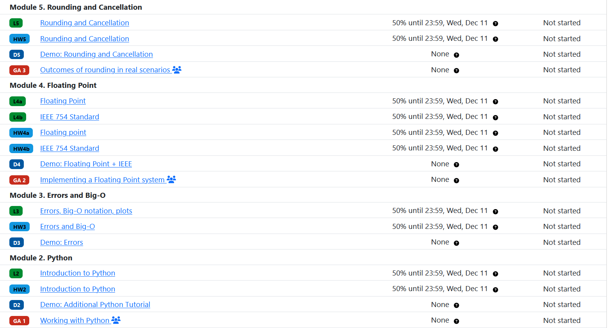

# Concepts

PrairieLearn is extremely flexible and powerful, but this flexibility can appear opaque at first. This document provides an overview of the key concepts in PrairieLearn, and how they fit together.

## High-level overview

A [**course**](../course/index.md) in PrairieLearn is composed of **course instances** and **questions**. Each [course instance](../courseInstance.md) is an offering of a course in a particular semester/term. For example, a course "CS 225" might have instances "Spring 2022" and "Fall 2022".

The course itself contains:

- A list of questions (i.e. a question bank)
- A list of course instances

Each course instance contains:

- All assessments for that term, for example, Homework 1, Homework 2, and Exam 1

Each assessment contains:

- A list of questions used in that assessment (taken from the course)

### Concept Map

{pad="0" scale="1"}

### Questions

[**Questions**](../question/index.md) are all independent, and a given question can be used on many different assessments across many different course instances. They are written in HTML (as a [Mustache template](https://mustache.github.io/mustache.5.html)) and use [elements](../elements/index.md) to accept student input. Python code can be used to generate random parameters and grade questions. Every time a question is shown to a student with randomly generated parameters, that is called a **variant** of the question.


#### Example `question.html`

```html title="question.html"
<pl-question-panel>
  If $x = {{params.x}}$ and $y$ is {{params.operation}} $x$, what is $y$?
</pl-question-panel>

<pl-number-input answers-name="y" label="$y =$"></pl-number-input>
```

#### Example `server.py`

```python title="server.py"
def generate(data):
    data["params"]["x"] = random.randint(5, 10)
    data["params"]["operation"] = random.choice(["double", "triple"])

    if data["params"]["operation"] == "double":
        data["correct_answers"]["y"] = 2 * data["params"]["x"]
    else:
        data["correct_answers"]["y"] = 3 * data["params"]["x"]
```

??? example "Question with custom partial credit & feedback"

    This is the same question that now gives intermediate student feedback and partial credit. This question is more complex and flexible, but this complexity is completely opt-in if you don't need it.

    === "Example `question.html`"

        ```html title="question.html"
        <pl-question-panel>
            If $x = {{params.x}}$ and $y$ is {{params.operation}} $x$, what is $y$?
        </pl-question-panel>

        <pl-number-input answers-name="y" label="$y =$"></pl-number-input>
        <pl-submission-panel> {{feedback.y}} </pl-submission-panel>
        ```

    === "Example `server.py`"

        ```python title="server.py"
        def generate(data):
            data["params"]["x"] = random.randint(5, 10)
            data["params"]["operation"] = random.choice(["double", "triple"])

            if data["params"]["operation"] == "double":
                data["correct_answers"]["y"] = 2 * data["params"]["x"]
            else:
                data["correct_answers"]["y"] = 3 * data["params"]["x"]

        def parse(data):
            if "y" not in data["format_errors"] and data["submitted_answers"]["y"] < 0:
                data["format_errors"]["y"] = "Negative numbers are not allowed"

        def grade(data):
            if math.isclose(data["score"], 0.0) and data["submitted_answers"]["y"] > data["params"]["x"]:
                data["partial_scores"]["y"]["score"] = 0.5
                data["score"] = 0.5
                data["feedback"]["y"] = "Your value for $y$ is larger than $x$, but incorrect."
        ```

#### External Graders

For coding questions, you can use an [**external grader**](../externalGrading.md) to grade a submission instead of a `server.py` file. This lets you grade student-submitted code in a sandboxed environment. There are currently external graders for C, C++, Java, Python, and more. You can also make a custom external grader for any language.

#### Workspaces

You can use [**workspaces**](../workspaces/index.md) to provide an in-browser development environment. Workspaces ensure all students are using a consistent environment and can provide a code editor with syntax highlighting, autocompletion, and other features. Workspaces provide a seamless coding experience for students when used with an external autograder. Workspaces use [Docker](https://docker.com) images to ensure a consistent environment, with premade workspace for popular languages (e.g. Python, C++). Workspaces based on custom Docker images are also supported.


Both of these features can be setup by modifying the `info.json` file for the question.

### Elements

Questions can use [**elements**](../elements/index.md) to accept student input, display diagrams, control how questions are displayed, and more. You can use built-in elements for common questions types, including numerical inputs, multiple choice, and more. If you require more flexibility, you can create reusable [**custom elements**](../devElements.md) that can be tailored to your course to create more complex questions.

=== "Integer input element"

    

=== "HTML for element"

    ```html title="question.html"
    <pl-integer-input answers-name="int_value" label="$y =$"></pl-integer-input>
    ```

You can view a list of all the available elements in the [elements documentation](../elements/index.md).

### Assessments

A course's questions are composed together to create homework and exam [**assessments**](../assessment/index.md) in a course instance. Homeworks are formative assessments designed for mastery learning: they give unlimited retries with different variants, and incentivize repeated correct answers. Exams are summative assessments designed to measure learning: they give limited attempts with the same variant, and incentivize getting the correct answer on the first try.


Assessments are organized into **assessment sets** based on the type of assessment (e.g. `Homework`, `Quiz`, `Exam`). Optionally, each assessment can be a part of a **module** (e.g. `Introduction`, `Review`, `Linked Lists`). Your assessments can then be shown to students grouped by module or by assessment set.

=== "Assessments (Set Grouping)"

    

=== "Assessments (Module Grouping)"

    

### JSON configuration files

Each item in PrairieLearn (questions, assessments, etc.) has associated metadata that describes the item. This metadata is stored in JSON files and describes the relationships between items, the item's properties, and other information. These metadata files are used to generate the user interface for editing and viewing the items, as well as the interface for students to complete them.

| Item            | Configuration file        |
| --------------- | ------------------------- |
| Course          | `infoCourse.json`         |
| Course Instance | `infoCourseInstance.json` |
| Assessment      | `infoAssessment.json`     |
| Question        | `info.json`               |

## Next steps

Now that you have an understanding of the key concepts in PrairieLearn, you can learn more about how to [:star: get started :star:](../getStarted.md) creating your course.

You can also:

- learn more about [courses](../course/index.md) or [course instances](../courseInstance.md)
- learn more about [questions](../question/index.md), [elements](../elements/index.md), or [custom elements](../devElements.md)
- learn more about [assessments](../assessment/index.md)
- learn more about [external grading](../externalGrading.md) or [workspaces](../workspaces/index.md)
- learn how to [develop locally](../installing.md)
- learn more about the workflow for [syncing content](../sync.md) to PrairieLearn
