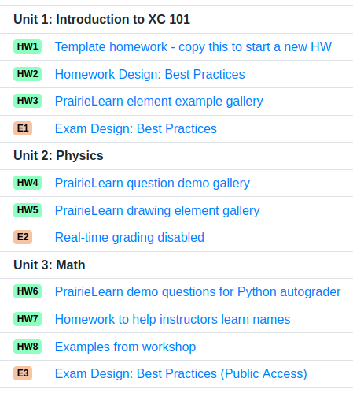

# Course configuration

**NOTE:** Any time you edit the `infoCourse.json` file on a local copy of PrairieLearn, you need to click the “Load from disk” button in the page header so that the local PrairieLearn server reloads the changes.

## Directory layout

A course is specified by a single directory, with the following structure:

```text
exampleCourse
+-- infoCourse.json     # course specification (see below)
+-- questions           # all questions for the course (see other doc)
|   `-- ...
|   `-- ...
+-- courseInstances     # instances of the course (see other doc)
|   +-- Fa16
|   |   `-- ...
|   `-- Sp17
|       `-- ...
+-- elements            # custom HTML elements for the course
|   +-- element1
|       `-- ...
+-- clientFilesCourse   # files available from the client at all times (see other doc)
|   `-- library.js
|   `-- refs.html
|   `-- formulas.pdf
`-- serverFilesCourse   # files only accessible from code on the server (see other doc)
    `-- secret1.js
```

- See an [example course directory](https://github.com/PrairieLearn/PrairieLearn/blob/master/exampleCourse) in PrairieLearn

- See [HTML element list](elements.md) for a list of elements provided by PrairieLearn to all courses; PrairieLearn will use a course version of an element whenever it exists.

- See [clientFiles and serverFiles](clientServerFiles.md) for information on the `clientFilesCourse` and `serverFilesCourse` directories.

## `infoCourse.json`

This file specifies basic information about the course:

```json
{
  "uuid": "cef0cbf3-6458-4f13-a418-ee4d7e7505dd",
  "name": "TAM 212",
  "title": "Introductory Dynamics",
  "comment": "The assessment set order used here will be the one shown within PrairieLearn",
  "options": {
    "useNewQuestionRenderer": true
  },
  "assessmentSets": [
    {
      "abbreviation": "HW",
      "name": "Homework",
      "heading": "Homeworks",
      "color": "green1"
    },
    {
      "abbreviation": "E",
      "name": "Exam",
      "heading": "Exams",
      "color": "red1"
    }
  ],
  "assessmentModules": [
    {
      "name": "vectors-coords",
      "heading": "Vectors and coordinates"
    },
    {
      "name": "moments",
      "heading": "Moments of inertia"
    }
  ],
  "topics": [
    {
      "name": "Vectors",
      "color": "blue3",
      "description": "Vector algebra in 3D"
    },
    {
      "name": "Center of mass",
      "color": "green3",
      "description": "Finding and using the center of mass of irregular bodies."
    }
  ],
  "tags": [
    {
      "name": "drawing",
      "color": "gray2",
      "description": "The answer requires drawing."
    },
    {
      "name": "estimation",
      "color": "orange2",
      "description": "Answering requires estimating a quantity."
    }
  ]
}
```

- Example [infoCourse.json](https://github.com/PrairieLearn/PrairieLearn/blob/master/exampleCourse/infoCourse.json)

- [Format specification for `infoCourse.json`](https://github.com/PrairieLearn/PrairieLearn/blob/master/apps/prairielearn/src/schemas/schemas/infoCourse.json)

## Course-wide options

These options, which apply to all instances of your course, can be set in the `infoCourse.json` file. The properties should be set within an object named `options` as shown in the example above.

| Property                 | Default | Description                                                                                                                                                                                                                                                                                                                                                |
| ------------------------ | ------- | ---------------------------------------------------------------------------------------------------------------------------------------------------------------------------------------------------------------------------------------------------------------------------------------------------------------------------------------------------------- |
| `useNewQuestionRenderer` | `false` | This controls whether to use the legacy renderer or the "new" renderer, as described in the [question configuration documentation](question.md#the-new-renderer). Although the default is `false` currently to avoid issues with longstanding courses on the platform, most courses will want to set this to `true`, especially if they are newly created. |

## Assessment sets

Each assessment belongs to an _assessment set_. Each assessment set must have the following properties.

| Property       | Description                                                                                                                                                                                                                          |
| -------------- | ------------------------------------------------------------------------------------------------------------------------------------------------------------------------------------------------------------------------------------ |
| `abbreviation` | Abbreviation that is joined with the assessment `number` to form the label, so `"abbreviation": "HW"` produces `HW1`, `HW2`, etc. This should be one or two uppercase letters (e.g., `HW` for homework, `E` for exam, `Q` for quiz). |
| `name`         | Full name that is joined with the assessment `number` to describe the assessment, so `"name": "Homework"` produces `Homework 1`, etc. This should be a singular noun.                                                                |
| `heading`      | Title that is listed above all the assessments in the set. Should be the plural version of the `name`.                                                                                                                               |
| `color`        | The color scheme for this assessment (see below for choices).                                                                                                                                                                        |

### Standardized assessment sets

The following list of standardized assessments sets is automatically included in every course. You do not need to include these in your JSON file, but you can add extra assessment sets if needed (see below).

| abbreviation | name            | purpose                                                 |
| ------------ | --------------- | ------------------------------------------------------- |
| `HW`         | Homework        | Weekly homeworks done at home.                          |
| `MP`         | Machine Problem | Weekly coding assisgnments done outside of class.       |
| `Q`          | Quiz            | Short frequent quizzes.                                 |
| `PQ`         | Practice Quiz   | Practice quizzes.                                       |
| `E`          | Exam            | Long-form midterm or final exams.                       |
| `PE`         | Practice Exam   | Practice exams.                                         |
| `P`          | Prep            | Temporary assessments used while writing new questions. |
| `WS`         | Worksheet       | Guided activity, often completed in groups.             |

### Adding your own assessment sets

You can add more assessment sets by listing them in the `infoCourse.json` file as follows. Note that HW and Q don't need to be listed because they are automatically available as standardized sets (see above).

```json
{
  "assessmentSets": [
    {
      "abbreviation": "HW",
      "name": "Homework",
      "heading": "Homeworks",
      "color": "green1"
    },
    {
      "abbreviation": "Q",
      "name": "Quiz",
      "heading": "Quizzes",
      "color": "red1"
    }
  ]
}
```

The assessment set order in `infoCourse.json` is the order in which the assessments will be shown within PrairieLearn (for both instructors and students). If you want to change the order of standardized assessment sets then you can re-list them in whatever order you like. For example, to put Exams and Quizzes first, you could use:

```json
{
  "assessmentSets": [
    {
      "abbreviation": "E",
      "name": "Exam",
      "heading": "Exams",
      "color": "brown1"
    },
    {
      "abbreviation": "Q",
      "name": "Quiz",
      "heading": "Quizzes",
      "color": "red1"
    },
    {
      "abbreviation": "PE",
      "name": "Practice Exam",
      "heading": "Practice Exams",
      "color": "yellow1"
    },
    {
      "abbreviation": "PQ",
      "name": "Practice Quiz",
      "heading": "Practice Quizzes",
      "color": "pink1"
    },
    {
      "abbreviation": "HW",
      "name": "Homework",
      "heading": "Homeworks",
      "color": "green1"
    },
    {
      "abbreviation": "P",
      "name": "Prep",
      "heading": "Question Preparation",
      "color": "gray1"
    },
    {
      "abbreviation": "MP",
      "name": "Machine Problem",
      "heading": "Machine Problems",
      "color": "turquoise1"
    },
    {
      "abbreviation": "WS",
      "name": "Worksheet",
      "heading": "Worksheets",
      "color": "purple1"
    }
  ]
}
```

## Assessment modules

Each assessment in the course belongs to a _module_ defined in `infoCourse.json`. Modules can represent course topics, chapters or sections, or in PrairieLearn terms, a collection of assessments related to one another, but not necessarily of the same type. This means you can have a module with two homeworks, one lab, and one exam, for example.

Modules are optional and do not affect any behavior by default. The order in which the modules are defined in `infoCourse.json` will be the order in which they are displayed in the student page. This can let students view their list of assessments in a chronological order, rather than simply grouped by set.

```json
{
  "assessmentModules": [
    {
      "name": "intro",
      "heading": "Unit 1: Introduction to XC 101"
    },
    {
      "name": "physics",
      "heading": "Unit 2: Physics"
    },
    {
      "name": "math",
      "heading": "Unit 3: Math"
    }
  ]
}
```

The above configuration can result in the following view for students:



Properties for assessmentModules are as follows.

| Property  | Description                                      |
| --------- | ------------------------------------------------ |
| `name`    | Brief name for the module. Shorter is better.    |
| `heading` | Longer title for the module, displayed to users. |

The organization of the assessment page is configured at the course instance level. In the same PrairieLearn course, some course instances may group assessments by `"Module"`, and some others may group assessments by `"Set"`. See [Course Instance](courseInstance.md#assessment-page-organization) for more details.

## Topics

Each question in the course has a topic from the list specified in the `infoCourse.json` file. Topics should be thought of as chapters or sections in a textbook, and there should be about 10 to 30 topics in a typical course. The topic properties are as follows.

| Property      | Description                                                                                       |
| ------------- | ------------------------------------------------------------------------------------------------- |
| `name`        | Brief name for the topic. Shorter is better. Should be in sentence case (leading captial letter). |
| `color`       | The color scheme for this topic (see below for choices).                                          |
| `description` | An explanation of what the topic includes, for human referance.                                   |

For example, topics could be listed like:

```json
{
  "topics": [
    {
      "name": "Vectors",
      "color": "blue3",
      "description": "Vector algebra in 3D."
    },
    {
      "name": "Center of mass",
      "color": "green3",
      "description": "Calculating the center of mass for irregular bodies and systems."
    }
  ]
}
```

## Tags

Each question can have zero, one, or many tags associated with it. The properties of a tag are as follows.

| Property      | Description                                                                                                                                                                                                                                   |
| ------------- | --------------------------------------------------------------------------------------------------------------------------------------------------------------------------------------------------------------------------------------------- |
| `name`        | Brief name for the tag. Tags should have very short names (preferably just a single word) because there might be many of them on one question. Should typically be in lower case (e.g., `drawing`) or an uppercase abbreviation (e.g., `MC`). |
| `color`       | The color scheme for this tag (see below for choices).                                                                                                                                                                                        |
| `description` | An explanation of what the tag means, for human referance.                                                                                                                                                                                    |

### Standardized tag names

The following list of standardized tags is automatically included in every course. You do not need to include these in your JSON file, but you can add extra tags (see below).

| Answer format tag | Meaning                                                                                                                                                   |
| ----------------- | --------------------------------------------------------------------------------------------------------------------------------------------------------- |
| `numeric`         | The answer format is one or more numerical values.                                                                                                        |
| `symbolic`        | The answer format is a symbolic expression.                                                                                                               |
| `drawing`         | The answer format requires drawing on a canvas to input a graphical representation of an answer.                                                          |
| `MC`              | The answer format is choosing from a small finite set of answers (multiple choice, possibly with multiple selections allowed, up to 10 possible answers). |
| `code`            | The answer format is a piece of code.                                                                                                                     |
| `multianswer`     | The question requires multiple answers, either as steps in a sequence or as separate questions.                                                           |

| Skill testing tag | Meaning                                                                                                                                                                                                                         |
| ----------------- | ------------------------------------------------------------------------------------------------------------------------------------------------------------------------------------------------------------------------------- |
| `graph`           | The question tests reading information from a graph or drawing a graph.                                                                                                                                                         |
| `concept`         | The question tests conceptual understanding of a topic.                                                                                                                                                                         |
| `calculate`       | The questions tests performing a numerical calculation, with either a calculator or equivalent software.                                                                                                                        |
| `compute`         | The question tests the writing and running of a piece of code to compute the answer. The answer itself is not the code, but could be a numeric answer output by the code, for example (use `code` when the answer is the code). |
| `software`        | The question tests the use of a specific piece of software (e.g., Matlab).                                                                                                                                                      |
| `estimation`      | Answering the question correctly will require some amount of estimation, so an exact answer is not possible.                                                                                                                    |

| Question use tag | Meaning                                                                                                               |
| ---------------- | --------------------------------------------------------------------------------------------------------------------- |
| `secret`         | Only use this question on exams or quizzes that won't be released to students, so the question can be kept secret.    |
| `nontest`        | This question is not appropriate for use in a restricted testing environment, so only use it on homeworks or similar. |

| Tracking tag | Meaning                                                                                                                                              |
| ------------ | ---------------------------------------------------------------------------------------------------------------------------------------------------- |
| `<course>`   | The course for which the question was originally written. E.g., `TAM212`, `CS233`.                                                                   |
| `<email>`    | The email of the person who wrote the question, E.g., `mwest@illinois.edu`. Multiple emails can be tagged when several people had significant input. |
| `<semester>` | The semester when the question was written. E.g., `Sp15`, `Su16`, `Fa16`.                                                                            |

### Adding your own tags

You can add more tags to your course by listing them in the `infoCourse.json` file. For example:

```json
{
  "tags": [
    {
      "name": "TAM212",
      "color": "red1",
      "description": "This question was originally written for TAM 212."
    },
    {
      "name": "mwest",
      "color": "gray1",
      "description": "This question was written by Matthew West (mwest@illinois.edu)."
    }
  ]
}
```

The tag order in `infoCourse.json` is the order in which the tags will be listed within PrairieLearn. If you want to change the order of your tags or standardized tags then you can re-list them in whatever order you like.

## Timezone

The default timezone for courses is `America/Chicago` (U.S. Central Time). This can be changed with the `timezone` property in `infoCourse.json`. For example:

```json
{
  "timezone": "America/New_York"
}
```

Allowable timezones are those in the TZ column in the [list of tz database time zones](https://en.wikipedia.org/wiki/List_of_tz_database_time_zones), which is a display version of the [IANA Time Zone Database](https://www.iana.org/time-zones).

## Comments in JSON files

You can add comments to JSON files using the `"comment"` key on any object. You can only use this key once for each object. For example:

```json
{
  "comment": "assessments that are shared among a group of students",
  "assessmentSets": [
    {
      "abbreviation": "GA",
      "name": "Group Activity",
      "heading": "Group Activities",
      "color": "green1"
    }
  ],
  "timezone": "America/New_York"
}
```

Comments can be strings, arrays, or JSON objects, but for most uses strings are recommended.

**Warning:** if you have more than one comment for a JSON object (objects are things wrapped in curly braces `{}`) then all but one of them will be silently discarded by the online course configuration editing tools. It's fine to have multiple comments in a JSON file but they have to be in separate objects. For example, comments inside the _same_ object (not supported) look like `{"comment": "AAA", "comment": "BBB"}`. Comments in _different_ objects (supported) look like `{"subObject1": {"comment": "AAA"}, "subObject2": {"comment": "BBB"}}`.

## Colors

The possible colors for assessment sets, topic, and tags are:


## Course staff

Access permissions for course staff can be configured on the "Staff" tab. Course staff permissions are separated into _course content roles_ and _student data roles_. These can be mixed and matched arbitrarily, so any combination is possible.

### Course content access roles

Course content access roles grant permission to access all course content, such as questions and assessments, including aggregate statistics from student usage.

| Action                                            | None | Previewer | Viewer | Editor | Owner |
| :------------------------------------------------ | :--: | :-------: | :----: | :----: | :---: |
| View questions and assessments                    |  ⋅   |     ✓     |   ✓    |   ✓    |   ✓   |
| View issues                                       |  ⋅   |     ✓     |   ✓    |   ✓    |   ✓   |
| View aggregate statistics in all course instances |  ⋅   |     ✓     |   ✓    |   ✓    |   ✓   |
| View question code and JSON files                 |  ⋅   |     ⋅     |   ✓    |   ✓    |   ✓   |
| Close issues                                      |  ⋅   |     ⋅     |   ⋅    |   ✓    |   ✓   |
| Edit question code and JSON files                 |  ⋅   |     ⋅     |   ⋅    |   ✓    |   ✓   |
| Sync from GitHub                                  |  ⋅   |     ⋅     |   ⋅    |   ✓    |   ✓   |
| Edit course staff permissions                     |  ⋅   |     ⋅     |   ⋅    |   ⋅    |   ✓   |

### Student data access roles

Student data access roles grant permission to access to individual student data.

| Action                                   | None | Viewer | Editor |
| :--------------------------------------- | :--: | :----: | :----: |
| View individual student scores           |  ⋅   |   ✓    |   ✓    |
| Download gradebook data                  |  ⋅   |   ✓    |   ✓    |
| Manually grade student submissions       |  ⋅   |   ⋅    |   ✓    |
| Edit individual student scores           |  ⋅   |   ⋅    |   ✓    |
| Change time limits and close assessments |  ⋅   |   ⋅    |   ✓    |

### Recommended course staff roles

While every course should use the different roles in a way that best suits the course needs, some recommended guidelines are:

| Role                                 | Course content access | Student data access |
| :----------------------------------- | :-------------------: | :-----------------: |
| Instructor                           | Course content owner  | Student data editor |
| TAs developing course content        | Course content editor | Student data editor |
| Student content developers (not TAs) | Course content editor |        None         |
| TAs involved in grading              |         None          | Student data editor |
| Other TAs                            |         None          | Student data viewer |
| Instructors from other classes       | Course content viewer |        None         |
