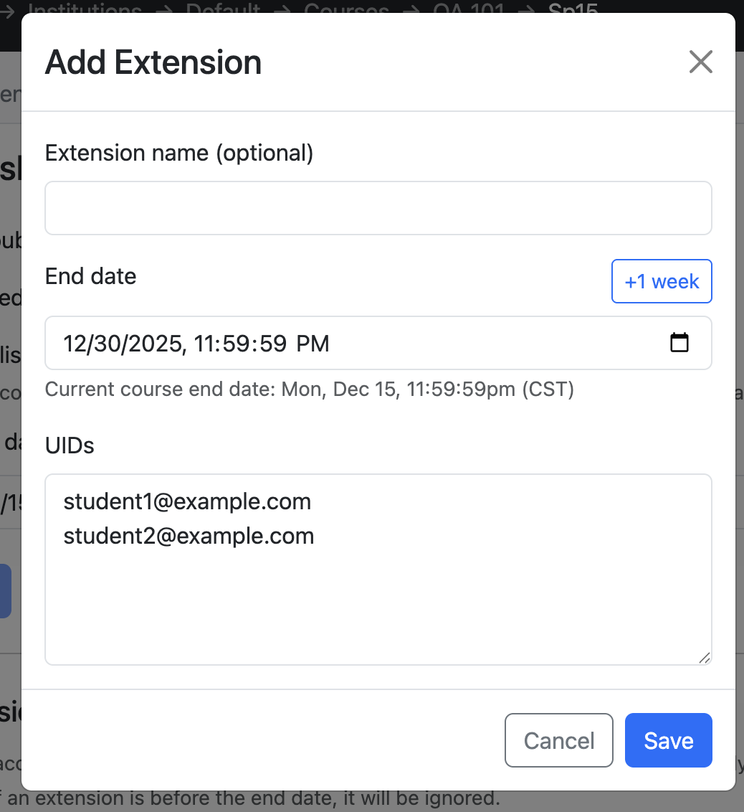
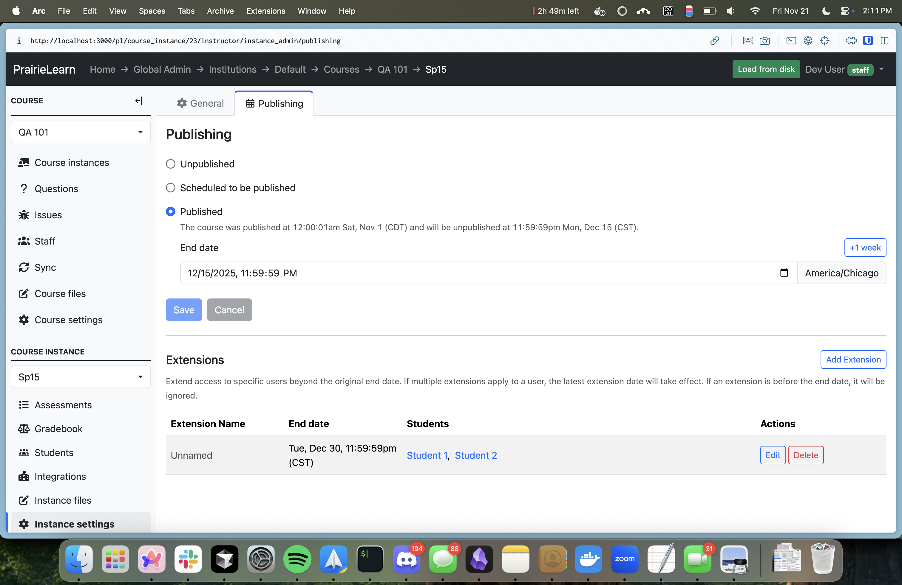

# Course instance configuration

!!! note

    Any time you edit or add an `infoCourseInstance.json` file on a local copy of PrairieLearn, you need to click the “Load from disk” button in the page header so that the local PrairieLearn server reloads the changes.

## Directory layout

A _course instance_ corresponds to a single offering of a [course](../course/index.md), such as "Fall 2016", or possibly "Fall 2016, Section 1". A course instance like `Fa16` is contained in one directory and has a configuration file (`infoCourseInstance.json`) and a subdirectory (`assessments`) containing a list of [assessments](../assessment/overview.md). The `assessments` directory should always exist, but may be empty if no assessments have been added. A course instance may be located in the root `courseInstances` directory, or any subfolder that is not a courseInstance itself.

```bash
exampleCourse
`-- courseInstances
    +-- Fa16                          # Fall 2016 course instance
    |   +-- infoCourseInstance.json   # configuration file (see below)
    |   +-- assessments
    |   |   +-- hw01                  # first homework for Fa16
    |   |   |   `-- ...               # files for Homework 1
    |   |   `-- hw02                  # second homework for Fa16
    |   |       `-- ...               # files for Homework 2
    |   +-- clientFilesCourseInstance # (1)!
    |   |   `-- Fa16_rules.pdf        # files for Fall 2016
    `-- Sp17
        +-- infoCourseInstance.json   # Spring 2017 configuration
        +-- assessments
        |   `-- ...                   # Spring 2017 assessments
        +-- clientFilesCourseInstance # (2)!
        |   `-- ...                   # files for Spring 2017
```

1. See [clientFiles and serverFiles](../clientServerFiles.md) for information on the `clientFilesCourseInstance` directory.

2. See [clientFiles and serverFiles](../clientServerFiles.md) for information on the `clientFilesCourseInstance` directory.

See an [example `courseInstances` directory](https://github.com/PrairieLearn/PrairieLearn/blob/master/exampleCourse/courseInstances) in the PrairieLearn example course.

## `infoCourseInstance.json`

This file specifies basic information about the course instance:

```json title="infoCourseInstance.json"
{
  "uuid": "62fbe2a4-8c22-471a-98fe-19e5d5da1bbe",
  "longName": "Spring 2015",
  "publishing": {
    "startDate": "2015-01-19T00:00:01",
    "endDate": "2015-05-13T23:59:59"
  }
}
```

See the [reference for `infoCourseInstance.json`](../schemas/infoCourseInstance.md) for more information about what can be added to this file.

## Publishing controls

The course instance `publishing` configuration determines when the course instance is available to students. Course staff always have access regardless of publishing settings. The example below makes the course instance available to students between the start (Jan 19th) and end (May 13th) of the semester:

```json title="infoCourseInstance.json"
{
  "publishing": {
    "startDate": "2015-01-19T00:00:01",
    "endDate": "2015-05-13T23:59:59"
  }
}
```

Both `startDate` and `endDate` must be specified together. This can be edited on the **Publishing** page (Course Instance → Instance settings → Publishing).

### Publishing extensions

You can extend the end date of the course instance to particular students by creating a publishing extension through the UI (Course Instance -> Settings -> Publishing -> Extensions).

!!! warning "`allowAccess` is deprecated"

    The previous system, `allowAccess`, allowed you to (1) list UIDs in the JSON file, (2) change the start date for certain students and (2) set the end date to a date _before_ the overall end date. The new system does not support these features.

### Controlling access by institution

By default, only students that belong to the course's institution can access the course instance. You can use the `institution` property to allow access from other institutions. It can be set to `"Any"` to allow access from all institutions, or to a specific institution name, such as `"UIUC"`, or for LTI 1.1-linked courses, to `"LTI"`. For instance, you can use the following rule to allow students from any institution to access the course instance between the specified dates:

!!! warning "Deprecated"

    The `institution` property in `allowAccess` is deprecated. Use the `selfEnrollment.restrictToInstitution` setting instead. See [enrollment controls](#enrollment-controls) for details.

```json title="infoCourseInstance.json"
{
  "allowAccess": [
    {
      "startDate": "2015-01-19T00:00:01",
      "endDate": "2015-05-13T23:59:59",
      "institution": "Any"
    }
  ]
}
```

### Migrating from `allowAccess`

!!! note

    Most users will not need to migrate from `allowAccess` to publishing manually. Copying or creating a course instance in the UI will automatically switch to the new publishing system. If you would like to migrate manually, you can follow the steps below.

!!! warning "LTI 1.1 courses should not migrate"

    Courses using LTI 1.1 should not migrate to the new publishing system. LTI 1.1 requires an `allowAccess` rule with `"institution": "LTI"` to function properly.

To migrate from `allowAccess` to publishing extensions:

??? example "Sample old `allowAccess` configuration"

    ```json title="infoCourseInstance.json"
    {
      "allowAccess": [
        {
          "startDate": "2025-11-01T00:00:01",
          "endDate": "2025-12-15T23:59:59",
        },
        {
          "startDate": "2025-11-01T00:00:01",
          "endDate": "2025-12-30T23:59:59",
          "uids": [
            "student1@example.com",
            "student2@example.com"
          ]
        }
      ]
    }
    ```

1. Find the allowAccess rule that contains no other settings (`uids`, `institution`). Create a new `publishing` section in your `infoCourseInstance.json` file, containing the start and end dates for your term.

   ```json title="infoCourseInstance.json"
   {
     "publishing": {
       "startDate": /* start date of allowAccess rule */,
       "endDate": /* end date of allowAccess rule */
     }
   }
   ```

2. For allowAccess rules with the `uids` field set, note down the UIDs and `endDate` of the rule. Then, delete the `allowAccess` property from your `infoCourseInstance.json` file, and sync your course.

3. Navigate to `Course Instance -> Settings -> Publishing -> Extensions` in the UI. In the publishing extensions section, for each rule you had previously, add an extension that will replace it, filling in the UIDs and `endDate`. Extensions are automatically saved and applied.

??? example "Adding an extension"

    

??? example "New `publishing` configuration"

    ```json title="infoCourseInstance.json"
    {
      "publishing": {
        "startDate": "2025-11-01T00:00:01",
        "endDate": "2025-12-15T23:59:59",
      }
    }
    ```

    

## Enrollment controls

Students can enroll in a course instance through a few different ways:

1. They can use a URL specific to the course instance or [to one of its assessments](../assessment/configuration.md#linking-to-assessments). You can find the "student link" on the "Settings" tab of the course instance. This link points students to the list of assessments associated to the course instance, enrolling them automatically in the course instance if they are not yet enrolled.

2. They can use a self-enrollment code. You can find the enrollment code on the "Settings" tab of the course instance after enabling "Use enrollment code for self-enrollment". Students can enroll in a course by clicking on the "Add course" button on their PrairieLearn homepage and entering the enrollment code.

3. They can be invited to a course instance by an instructor. Instructors can invite students to a course instance by visiting the "Students" tab of the course instance and clicking the "Invite" button. Invites will show up on the student's PrairieLearn homepage.

### Enrollment security

There are a few settings that can be changed to control who can enroll in a course instance, and when they can enroll.

#### Institution restrictions

By default, only students that belong to the course's institution can access the course instance. If you want to allow all students to be able to enroll in the course instance, not just those in the same institution as the course instance, you can set the `restrictToInstitution` property to `false` in the `selfEnrollment` section of `infoCourseInstance.json`.

```json title="infoCourseInstance.json"
{
  "selfEnrollment": {
    "restrictToInstitution": false
  }
}
```

#### Rotating enrollment codes

If an enrollment code was spread to students outside of your course, you may want to revoke it. You can do this by clicking "Generate new self-enrollment link" on the "Settings" tab of the course instance. This will generate a new self-enrollment link and self-enrollment code and deactivate the old one.

#### Disabling self-enrollment after a certain date

If you want to disable self-enrollment after a certain date, you can set the `beforeDate` property to the date you want to disable self-enrollment on in the `selfEnrollment` section of `infoCourseInstance.json`. After this date, students will not be able to enroll themselves in the course instance, but they can still be invited.

```json title="infoCourseInstance.json"
{
  "selfEnrollment": {
    "beforeDate": "2025-12-31T23:59:59"
  }
}
```

!!! tip "Recommended use case"

    You might want to set this setting to the University-imposed deadline for students to add courses.

#### Completely disabling self-enrollment

If you want to disable self-enrollment completely, you can set the `enabled` property to `false` in the `selfEnrollment` section of `infoCourseInstance.json`. This will mean that only invited students can enroll in the course instance, not via a direct link or enrollment code.

```json title="infoCourseInstance.json"
{
  "selfEnrollment": {
    "enabled": false
  }
}
```

### Individual student management

!!! warning "Not available with legacy access control"

    Individual student management features are not available for courses using legacy access control (`allowAccess`). To use these features, you must [migrate to the new publishing system](#migrating-from-allowaccess).

#### Inviting students

Students can be invited to a course instance by an instructor. Instructors can invite students to a course instance by visiting the "Students" tab of the course instance and clicking the "Invite" button. Invites will show up on the student's PrairieLearn homepage. If a student rejects an invitation, they can still join via a link to the course. However, the invitation will not show up on their homepage until they are re-invited. If an invited student accesses any link to the course (regardless of the current self-enrollment settings), they will automatically join the course.

#### Blocking students

If you want to remove students from a course instance, you can do this by visiting the individual student page and clicking the "Block" button. They will immediately be removed from the course instance and will no longer be able to enroll themselves in the course instance. If you later click "Unblock" on their page, they will be immediately re-enrolled in the course instance.

## Assessment page organization

Instructors can group assessments by course modules (topics, sections, or chapters in a course) or by assessment sets (homeworks, quizzes, exams, and so on). By default, all assessments in a course instance are grouped by `"Set"`. Setting the property `"groupAssessmentsBy"` to `"Module"` will group assessments together by module on the student assessments overview page.

```json title="infoCourseInstance.json"
{
  "groupAssessmentsBy": "Module"
}
```

For more information about assessment modules, see [Course configuration](../course/index.md#assessment-modules).

## Timezone

The default timezone for course instances is the timezone of the course. This can be changed with the `timezone` property in `infoCourseInstance.json`. For example:

```json title="infoCourseInstance.json"
{
  "timezone": "America/New_York"
}
```

Allowable timezones are those in the TZ column in the [list of tz database time zones](https://en.wikipedia.org/wiki/List_of_tz_database_time_zones), which is a display version of the [IANA Time Zone Database](https://www.iana.org/time-zones).

## LTI support

!!! warning

    LTI 1.1 support as described below is deprecated. We recommend using LTI 1.3 for all new course instances. See [the LTI 1.3 documentation](../lmsIntegrationInstructor.md) for more details.

### LTI Overview

LTI, or Learning Tools Interoperability, is the ability for Learning Management Systems (LMSes) to link together. In our context, it means that sites like Coursera can link into assessments in PrairieLearn, give the student a PrairieLearn experience, and report the assessment score back to Coursera automatically.

PrairieLearn LTI support enables a new authentication source (that creates the user in PL and enrolls them in the appropriate course instance) with a grade reporting functionality. Everything else (course instance, assessment and question configuration and workflows) are the same. Assessment [access control](../assessment/accessControl.md) rules still apply for LTI-linked assessments.

### Enabling LTI support in a course instance

To point an LMS to use PrairieLearn LTI, you must first create a private LTI credential inside PrairieLearn. These credentials are then configured inside the LMS to connect to PrairieLearn.

To create or manage LTI credentials for a course instance, instructors can visit the **Admin / LTI** page in the course instance.

An LTI credential consists of 3 parts:

- Launch URL - _the URL to configure the LMS to link into PrairieLearn_
- Consumer key - _a unique identifier for the LMS context_
- Shared secret - _a password for the consumer key_

A single LMS course should use the same credential. If multiple courses need to link into the course instance, multiple LTI credentials can be created.

PrairieLearn logins via LTI are unique to their LMS course. For example, if an Illinois student is taking a Coursera LTI course they will have two different user accounts in PrairieLearn.

It is also necessary to add an `accessRule` in `infoCourseInstance.json` with `"institution": "LTI"`. See [Access control](../assessment/accessControl.md) for more details.

### LTI linking into an assessment

LTI supports the concept of "deep linking", such that an assignment link inside the originating LMS can be followed directly into a specific assessment in PrairieLearn. For score reporting back to the LMS, PrairieLearn requires this linking. If a student follows an LTI link from the LMS that has not been configured yet in PrairieLearn, they will receive an error message.

The first time an instructor (in the LMS context) follows a newly created LTI PrairieLearn link, they will be delivered to the **Admin / LTI** page. The LTI link targets section of the page will be populated with the new link information, and the PL course instance's assessments will be listed as a dropdown. These can also be edited at any time from the **Admin / LTI** page.

A course can use the same LTI credential to create multiple links to PrairieLearn, but each link must be configured in PL to an assessment. Multiple links can be created to the same assessment.

### Score reporting back to the LMS (LTI outcomes)

If the LTI link inside the LMS was configured to connect to the LMS gradebook then PrairieLearn scores will also be shown and updated in the LMS. This requires the student to have followed the link from the LMS into PrairieLearn when working on the assessment. LTI does not give PrairieLearn a way to update a score in the LMS gradebook for anything other than a linked assignment. i.e. PrairieLearn can't push other scores into the LMS; the request must originate from the LMS.

Scores are still shown to students and instructors in the normal places in PrairieLearn. The LTI outcomes functionality adds additional reporting back to the originating LMS.

Once the student's assessment instance is linked back to an LMS gradebook entry, any scoring activity on PrairieLearn will be reported back to the LMS. That includes students clicking grade, external grading systems reporting back to PrairieLearn, or instructors manually adjusting grades inside PrairieLearn. These grade updates can happen asynchronously and independently of the student interacting with PrairieLearn.
