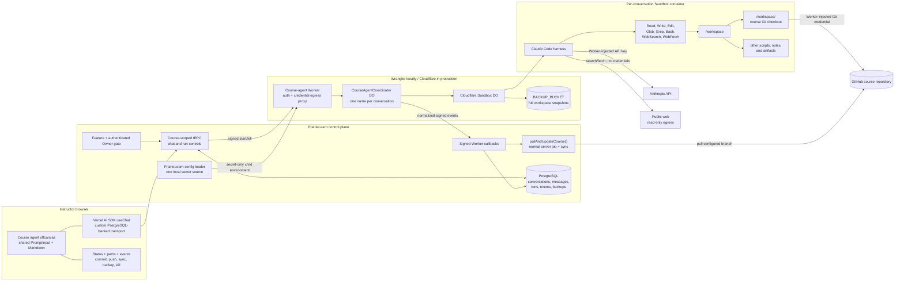
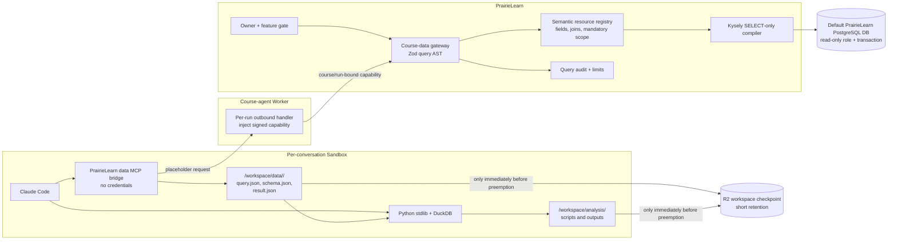

# PrairieLearn cloud course agent

## Status and scope

This document describes the implemented first milestone and its local verification path. The same
Worker, Durable Objects, container image, R2 backup calls, signed protocol, and PrairieLearn control
plane are intended to run under local Wrangler and Cloudflare.

The milestone supports private, owner-only course-editing chats. A turn lazily creates a sandbox,
clones or restores the course workspace, runs Claude Code, commits and pushes the edit, invokes
PrairieLearn's normal Git-backed sync, and leaves the sandbox ready until preemption. Immediately
before idle timeout, test kill, or chat-deletion destruction, it checkpoints `/workspace` to R2.
The initial course-scoped, structured student-data query gateway is also implemented. Arbitrary
PostgreSQL SQL, course exports, and mid-operation crash recovery are deliberately excluded.

Implemented entry points include:

- A course-wide right panel with multiple chats, AI SDK message transport, runtime status, paths,
  Git/sync metadata, event details, and a development-only kill button.
- Course-scoped tRPC procedures and PostgreSQL models for conversations, messages, runs, events,
  and workspace backup metadata.
- A signed PrairieLearn callback API for normalized events, normal course sync, and structured,
  read-only course-data queries.
- A Cloudflare Worker with one coordinator Durable Object and Sandbox per conversation, R2
  preemption backup/restore, credential-isolated Anthropic/GitHub/data egress, and a ten-minute idle
  alarm.
- A credential-free Sandbox MCP bridge and Python client that materialize bounded query results as
  inspectable JSON under `/workspace/data`.
- A deterministic fake runtime for browser and lifecycle testing without Claude or Cloudflare.
- A Wrangler launcher that reads PrairieLearn's normal config sources; no `.dev.vars` duplication.

## Fixed security and product decisions

- Both `cloud-agent` and an authenticated PrairieLearn `Owner` role are required at every
  user-initiated course-agent API boundary.
- Effective owner permission is also required, but a role override cannot manufacture the
  authenticated-owner check.
- Conversations belong to one authenticated user and one course. Other users cannot list or open
  them.
- After admission, the signed run is treated as a course owner. Claude tools do not perform
  per-action PrairieLearn privilege checks or ask for approval.
- The capability binds the user, course, conversation, run, sandbox, prompt digest, repository,
  branch, callback origin, and expiry.
- Creating a chat does not allocate a sandbox. The first submitted turn does.
- Each conversation has one stable sandbox ID. A destroyed container can be restored under the same
  ID from the latest workspace backup.
- GitHub is authoritative for completed course edits. PostgreSQL is authoritative for chat and
  orchestration state. R2 preserves the broader workspace only at explicit preemption boundaries.
- Claude receives neither real Anthropic nor GitHub credentials. Exact Worker handlers substitute
  credentials only for Anthropic and GitHub. Public web egress is read-only, strips credential
  headers, and blocks private, loopback, link-local, and container-host destinations.
- No PostgreSQL credential enters the Worker or sandbox. PrairieLearn alone owns the read-only
  query connection and mandatory course filter.

## Architecture



There is no second model loop in PrairieLearn. `useChat` submits a turn and streams the final
assistant message from PostgreSQL while Worker callbacks advance the run. Claude and all coding
tools execute in the Sandbox.

## How PrairieLearn commits course changes

PrairieLearn's production UI edit path is `Editor.executeWithServerJob()` in
`apps/prairielearn/src/lib/editors.ts`. It locks the course, resets its checkout to the configured
remote branch, applies a deterministic operation, commits as the instructor, validates the loaded
course, pushes, retries one ordinary push race by replaying the deterministic operation, and syncs
the resulting checkout into PostgreSQL.

A Claude edit cannot safely be discarded and replayed. The course-agent harness instead:

1. Clones or restores the course in an isolated workspace.
2. Fetches and merges the latest configured branch before Claude starts.
3. Removes the credential-bearing remote before Claude runs.
4. Lets Claude edit but not commit or push.
5. Stages all course-checkout changes and creates one `PrairieLearn Course Agent` commit.
6. Restores the credential proxy URL, fetches and merges once more, and pushes the configured
   branch.
7. Replaces the remote with its public URL again.
8. Calls the signed PrairieLearn sync endpoint, which invokes `pullAndUpdateCourse()` and records
   the server-job sequence.

The agent never edits PrairieLearn's local course checkout. The existing checkout remains a sync
replica of GitHub. A merge conflict fails the run; automatic conflict repair and replay are future
hardening work.

## Workspace contract

```text
/workspace/
  <sanitized-course-short-name>/   cloned course Git repository
  ...                              optional agent-created scripts and notes
```

Only the course checkout is staged and pushed. Immediately before sandbox destruction, the complete
`/workspace`, including `.git` and any scratch/data files, is the R2 backup unit. Normal turn
completion never creates an R2 backup. The course path is generated by the shared protocol from the
course short name and accepts only letters, numbers, `.`, `_`, and `-`; prompt text never selects a
repository path.

The installed Sandbox SDK version accepts `dir`, `name`, `ttl`, and `localBucket` for backups. It
does not expose a `useGitignore` option. Backing up `/workspace` therefore preserves the Git
directory and non-ignored workspace contents by default.

## Sandbox lifecycle

### 1. Unallocated conversation

Creating a chat writes only PostgreSQL rows and a `conversation.created` event. It assigns a stable
sandbox ID but performs no Worker call and executes no Sandbox command. Runtime status is
`unallocated`.

### 2. Turn admission

On send, PrairieLearn rechecks the feature flag, authenticated Owner role, conversation ownership,
Git repository/branch configuration, and absence of an active run. It transactionally inserts the
run, user message, and pending assistant message, signs a one-hour run capability, and posts it to
the Worker.

### 3. Lazy boot and workspace preparation

The coordinator is addressed by the conversation's stable sandbox ID. Its first command starts the
container. It emits `sandbox.booting` and creates `/workspace`.

- With no valid backup, it clones the configured branch into `/workspace/<course-name>`.
- With a backup, it restores the backup handle first.
- It then fetches and merges the current configured branch, reports the resulting SHA, strips the
  credential proxy from the remote, and emits `sandbox.ready`.

The UI exposes runtime state, sandbox/container ID, course path, and each clone/restore/fetch event.
Wrangler emits the same events as structured JSON in its terminal.

### 4. Active Claude turn

The coordinator emits `agent.started` and invokes the image-bundled Claude Code CLI with
`bypassPermissions`. Claude's built-in and MCP tools operate with the course directory as `cwd`.
Worker logs record stream byte counts and correlated tool names without logging student rows or
tool inputs. Tool-use and tool-result records become paired `tool.started`, `tool.completed`, or
`tool.failed` callback events. Owner-only Runtime events include the structured input for
PrairieLearn data tools so the exact resource, filters, grouping, metrics, ordering, and limit are
auditable. General-purpose Bash and web tool inputs are not persisted.

Unexpected sandbox death during this phase fails the turn; resuming in-flight edits is explicitly
out of scope.

### 5. Finalization, publication, and sync

After Claude exits, the harness records status. If files changed, it commits, fetches/merges the
latest branch, pushes, and requests a normal PrairieLearn sync. Commit SHA, diff stat, pushed SHA,
and sync job sequence are visible in the panel and Worker logs. A no-change turn skips commit, push,
and sync.

### 6. Ready-idle period

The Worker completes the assistant message/run, sets status to `ready`, and arms a Durable Object
alarm for the configured idle timeout (600 seconds by default). It does not create a backup at turn
completion. The Sandbox SDK is configured with `keepAlive: true`, so its own inactivity timer cannot
stop the container. Successful turns, failed turns, client disconnects, and Worker request
completion do not destroy it.

A new message before the deadline deletes the alarm and reuses the container. A failed turn also
arms the idle alarm so a failed container cannot remain allocated forever.

### 7. Controlled idle destruction

At the alarm, an active run defers destruction for one minute. An idle sandbox emits
`sandbox.idle_timeout`, creates a full workspace checkpoint with reason `idle_timeout`, emits
`sandbox.destroying`, destroys the container, and emits `sandbox.destroyed`. PostgreSQL keeps the
conversation and backup metadata; runtime status becomes `offline`.

The next turn addresses the same stable sandbox ID, starts a fresh container, and restores the
latest backup.

### 8. Test kill and chat deletion

The kill button is available only in development when `courseAgentTestControlsEnabled` and the
`cloud-agent-test-controls` feature are both enabled. The Worker attempts a checkpoint with reason
`test_kill` immediately before the hard destroy. Failure tolerance for a kill during an edit is not
implemented; the checkpoint may contain an intermediate filesystem state.

Deleting a chat requests a kill with reason `conversation_deleted`. The Worker checkpoints
immediately before destruction, and PrairieLearn waits for the Worker response before marking the
conversation deleted.

These are the only destruction reasons accepted by the lifecycle implementation:
`idle_timeout`, `test_kill`, and `conversation_deleted`. All destruction is routed through one
checkpoint-then-destroy function, with regression tests covering the allowed reasons and operation
ordering.

## Runtime and browser states

Runtime states are `unallocated`, `booting`, `preparing`, `cloning`, `restoring`, `ready`, `running`,
`finalizing`, `syncing`, `checkpointing`, `destroying`, `offline`, and `error`. Browser status is
reported independently as `live`, `reconnecting`, or `disconnected`, so a dropped browser poll does
not imply that the Sandbox stopped.

The panel also exposes:

- `/workspace/<course-name>` and the Sandbox/container ID.
- Last activity and idle deadline.
- Latest run status, commit SHA, pushed SHA, and sync job sequence.
- Latest backup reason and timestamp.
- Expandable, ordered event payloads, including clone SHAs and commit diff stats.

## Tool placement

### Claude-visible tools in the Sandbox harness

| Tool                            | Purpose                                                 | Credential access |
| ------------------------------- | ------------------------------------------------------- | ----------------- |
| `Read`                          | Inspect course and workspace files                      | None              |
| `Write`                         | Create or replace files                                 | None              |
| `Edit`                          | Apply targeted file changes                             | None              |
| `Glob`                          | Discover files                                          | None              |
| `Grep`                          | Search files                                            | None              |
| `Bash`                          | Run local checks, scripts, and read-only Git inspection | None              |
| `WebSearch`                     | Search public web sources                               | None              |
| `WebFetch`                      | Read a public web page                                  | None              |
| `list_course_data_resources`    | Discover structured course data                         | None              |
| `describe_course_data_resource` | Inspect allowed fields/operators                        | None              |
| `query_course_data`             | Run one bounded, course-scoped read-only query          | None              |
| `get_course_data_result`        | Reopen a materialized JSON result                       | None              |

Claude is told not to commit or push. It cannot call arbitrary PrairieLearn APIs, connect to
PostgreSQL, choose tables/joins/course IDs, or read real service credentials. The four data tools
reach only the signed PrairieLearn semantic-query gateway through a Worker-held capability.

During internal debugging, the harness pins Claude to Sonnet at low effort, exposes only the tools
above, disables slash commands and session persistence, and enforces a $0.25 maximum API
budget per turn. Revisit the per-turn ceiling with measured course-authoring tasks before staging
is opened to broader use. The web tools are available only in this Claude harness; the Vercel AI
SDK transport remains a model-free chat/control-plane adapter.

### Trusted harness operations outside the model loop

| Operation                                                            | Owner                           |
| -------------------------------------------------------------------- | ------------------------------- |
| Allocate/reconnect Sandbox and arm idle alarm                        | Coordinator Durable Object      |
| Create/restore/checkpoint `/workspace`                               | Sandbox SDK through coordinator |
| Clone, fetch, merge, commit, and push                                | Worker-owned harness commands   |
| Inject Anthropic and GitHub credentials into exact outbound requests | Sandbox outbound Worker proxy   |
| Normalize Claude tool events                                         | Coordinator Durable Object      |
| Trigger and observe normal course sync                               | Worker callback + PrairieLearn  |
| Persist conversations, messages, runs, events, backup handles        | PrairieLearn/PostgreSQL         |
| Hard kill or graceful destroy                                        | Owner-scoped tRPC + coordinator |

### Vercel AI SDK call

The custom `ChatTransport` has no model or local tools. It performs only two control-plane actions:

1. Submit the latest user text through the owner-scoped `courseAgent.submit` tRPC mutation.
2. Poll the persisted assistant message through `courseAgent.get` and produce AI SDK
   `text-start`/`text-delta`/`text-end`/`finish` chunks when the Worker-backed run completes.

This gives the shared UI AI SDK lifecycle and Stop behavior without creating a second Claude loop or
moving filesystem operations into PrairieLearn.

## Credential configuration

### Credentials to obtain

| Credential/configuration               | Needed locally         | Needed in Cloudflare              | Recommended scope                                                      |
| -------------------------------------- | ---------------------- | --------------------------------- | ---------------------------------------------------------------------- |
| Dedicated Anthropic API key            | Yes for real Claude    | Yes                               | Separate course-agent key and spend controls                           |
| Dedicated GitHub token                 | Yes for real Git edits | Yes initially                     | Fine-grained token, contents read/write, only test course repositories |
| Capability-signing secret              | Yes                    | Yes                               | New random high-entropy shared secret                                  |
| Cloudflare account/login/API token     | No                     | For deploy and log access         | Workers, Containers, Durable Objects, and R2 deployment scope          |
| R2 bucket binding                      | Emulated by Wrangler   | Yes                               | Dedicated course-agent artifact bucket                                 |
| R2 access key ID/secret and account ID | No                     | Yes for Sandbox presigned backups | Dedicated key limited to the backup bucket                             |
| PostgreSQL reader credentials          | Optional dev fallback  | Yes in PrairieLearn; never Worker | Dedicated read-only role in the default PrairieLearn database          |

The current GitHub token is an internal-stage bootstrap. A GitHub App issuing short-lived,
repository-scoped installation tokens is the production follow-up.

### PrairieLearn config is the local source of truth

Add these values to the PrairieLearn config file already selected by `PL_CONFIG_PATH`,
`~/.config/prairielearn/config.json`, repository `config.json`, or app `config.json`:

```json
{
  "courseAgentRuntime": "cloudflare",
  "courseAgentWorkerOrigin": "http://127.0.0.1:8787",
  "courseAgentCapabilitySecret": "generate-a-new-secret",
  "courseAgentAnthropicApiKey": "dedicated-agent-key",
  "courseAgentGithubToken": "dedicated-fine-grained-token",
  "courseAgentIdleTimeoutSeconds": 600,
  "courseAgentWorkspaceBackupTtlSeconds": 604800,
  "courseAgentTestControlsEnabled": true,
  "courseAgentPostgresqlHost": "127.0.0.1",
  "courseAgentPostgresqlDatabase": "postgres",
  "courseAgentPostgresqlUser": "course_agent_reader",
  "courseAgentPostgresqlPassword": "dedicated-reader-password",
  "courseAgentPostgresqlSsl": false
}
```

Do not commit real values. `pnpm dev-course-agent-worker` calls PrairieLearn's existing
`loadConfig()`, validates this subset, and starts Wrangler with the three secrets in the child
process environment. Wrangler's checked-in `secrets.required` declarations bind those exact names.
Timeouts are passed as non-secret Wrangler vars. The launcher neither creates nor reads
`.dev.vars`, and it never prints secret values.

Local development falls back to PrairieLearn's normal PostgreSQL connection when the dedicated
fields are null. Before stage, create the least-privilege role in the same database as PrairieLearn:

```sql
CREATE ROLE course_agent_reader LOGIN;

GRANT CONNECT ON DATABASE postgres TO course_agent_reader;

GRANT USAGE ON SCHEMA public TO course_agent_reader;

GRANT
SELECT
  ON course_instances,
  enrollments,
  users,
  assessments,
  assessment_sets,
  assessment_modules,
  assessment_instances,
  teams TO course_agent_reader;

ALTER ROLE course_agent_reader
SET
  default_transaction_read_only = on;

ALTER ROLE course_agent_reader
SET
  statement_timeout = '15s';
```

Replace `postgres` with the configured PrairieLearn database name. Set the password interactively
with `\password course_agent_reader` or through the deployment secret manager, then place only that
reader credential in PrairieLearn's config. Do not expose it to Wrangler.

The mapping is:

| PrairieLearn config                    | Worker binding                      |
| -------------------------------------- | ----------------------------------- |
| `courseAgentAnthropicApiKey`           | `ANTHROPIC_API_KEY`                 |
| `courseAgentGithubToken`               | `GITHUB_TOKEN`                      |
| `courseAgentCapabilitySecret`          | `COURSE_AGENT_CAPABILITY_SECRET`    |
| `courseAgentIdleTimeoutSeconds`        | `COURSE_AGENT_IDLE_TIMEOUT_SECONDS` |
| `courseAgentWorkspaceBackupTtlSeconds` | `COURSE_AGENT_BACKUP_TTL_SECONDS`   |

Production deployment should upload the same three secrets, plus `R2_ACCESS_KEY_ID`,
`R2_SECRET_ACCESS_KEY`, and either `CLOUDFLARE_R2_ACCOUNT_ID` or `CLOUDFLARE_ACCOUNT_ID`. The
checked-in `BACKUP_BUCKET_NAME` must match the `BACKUP_BUCKET` binding. Do not pipe the entire
PrairieLearn environment into Wrangler.

## Local verification with Wrangler

Prerequisites are Docker, the repository dependencies, a configured Git-backed test course, and the
three dedicated credentials above. No Cloudflare account or remote R2 bucket is needed.

1. Apply the PrairieLearn migration and start normal support services/PrairieLearn.
2. Enable `cloud-agent` for the test course or institution. To expose the kill control, also enable
   `cloud-agent-test-controls` and keep development mode on.
3. Start the Worker in a second terminal:

   ```sh
   pnpm dev-course-agent-worker
   ```

4. Confirm the Worker before opening PrairieLearn:

   ```sh
   curl http://127.0.0.1:8787/health
   ```

5. Open any instructor course page as the authenticated course owner and open **Course agent**.
6. Create a chat. Verify status remains `unallocated` and that Wrangler has not booted a container.
7. Submit a concrete course edit. In the UI and Wrangler terminal, verify this sequence:

   ```text
   sandbox.requested -> sandbox.booting -> workspace.created
   git.clone.started -> git.clone.completed -> git.fetch.completed
   sandbox.ready -> agent.started -> tool.* -> agent.completed
   git.commit.completed -> git.push.completed
   sync.started -> sync.completed
   run.completed
   ```

8. Verify the commit SHA in GitHub, the pushed SHA and sync job in the panel, and the actual course
   change after PrairieLearn sync.
9. Inspect correlated Claude stream sizes and normalized tool names in `course-agent-sandbox` JSON
   log lines. Expand Runtime events in the panel to inspect normalized event payloads and the commit
   diff stat. Student row payloads are deliberately absent from logs.
10. Confirm that normal run completion created no workspace backup. Let the chat idle for ten
    minutes or use the test kill, then verify `workspace.backup.completed` occurs immediately before
    `sandbox.destroying` and `sandbox.destroyed`. Send another turn to verify restore.

Wrangler persists local Durable Object and R2 emulation under
`apps/course-agent-worker/.wrangler/state`. The production Worker can be observed with
`wrangler tail prairielearn-course-agent`; Cloudflare observability is enabled in `wrangler.jsonc`.

For a credential-free UI smoke test, set `courseAgentRuntime` to `fake`. The fake runtime exercises
lazy allocation, statuses, multiple chats, backup metadata, and kill behavior without making GitHub
or Anthropic calls. It does not prove real clone, commit, push, sync, or R2 behavior.

## Persistence and traceability

The migration creates `course_agent_conversations`, `course_agent_messages`, `course_agent_runs`,
`course_agent_events`, and `course_agent_workspace_backups`. Active-run uniqueness is enforced per
conversation. Callback event IDs are idempotent, and event sequence numbers are allocated in
PostgreSQL.

Every Worker event log includes conversation, run, and sandbox correlation fields. The required
terminal chain covers tool calls, Git operations, sync, completion/failure, preemption backup, idle
timeout, and destruction. Worker logs retain stream sizes and normalized tool activity, not raw MCP
row payloads. React consumes normalized database records rather than arbitrary model payloads.

## What transferred from the MCP prototype

The implementation preserves the successful boundaries from
[PrairieLearn PR #15639](https://github.com/PrairieLearn/PrairieLearn/pull/15639):

- PrairieLearn remains authoritative for course identity, authorization, existing model/library
  reuse, course sync, and job tracking.
- The coding harness uses native file and shell tools instead of wrapping ordinary filesystem
  operations in remote PrairieLearn tools.
- Sync uses PrairieLearn's existing `pullAndUpdateCourse()` machinery.
- Runtime activity is structured and correlated rather than hidden in an opaque agent response.
- Local testing has a deterministic mode before requiring the real external agent.

What is new is remote lifecycle ownership: signed capabilities, private persistent conversations,
one Sandbox per conversation, credential-isolated egress, full workspace backup/restore, idle
destruction, the global course panel, and deployment parity through Wrangler.

## Initial student-data analysis boundary

The implementation does not revive the prototype's arbitrary `SELECT`/`WITH` tool. A
PostgreSQL read-only transaction prevented writes, but it did not guarantee course scoping, hide
sensitive columns, prevent expensive joins, or return reusable analysis artifacts. The replacement
is a course-data gateway owned by PrairieLearn and a small structured query client in the Sandbox.



The Sandbox never receives a PostgreSQL connection string, PrairieLearn cookie, or usable bearer
token. Before a run, the coordinator configures a Sandbox outbound handler for a virtual course-data
host. The handler holds the signed run capability outside the container and substitutes it only for
requests to the PrairieLearn gateway. The capability binds the existing user, course,
conversation, run, and sandbox IDs and expires with the run.

### Structured query contract

The model and Python client use semantic resources rather than database table names. A query is a
validated JSON expression such as:

```json
{
  "resource": "assessment_attempts",
  "select": ["student.uid", "assessment.tid", "attempt.score_perc", "attempt.modified_at"],
  "where": [
    { "field": "assessment.tid", "op": "eq", "value": "exam1" },
    { "field": "attempt.modified_at", "op": "gte", "value": "2026-08-01T00:00:00Z" }
  ],
  "orderBy": [{ "field": "attempt.modified_at", "direction": "desc" }],
  "limit": 1000
}
```

Version one supports projection, typed predicates (`eq`, `ne`, `lt`, `lte`, `gt`, `gte`, `in`,
`contains`, `is_null`), ordering, grouping, and a small metric set (`count`, `count_distinct`, `sum`,
`min`, `max`, `avg`). It does not support caller-selected tables,
caller-defined joins, SQL fragments, subqueries, functions, window expressions, or writes.

Zod validates the public AST. An internal registry maps every public resource and field to a typed
Kysely expression and applies the mandatory course predicate before caller filters. The gateway
does not expose Kysely's raw `sql` escape hatch. Kysely is the maintained library used here
because it is a narrow TypeScript query builder with PostgreSQL support and strong table/column
typing. This gateway is an explicitly isolated exception to PrairieLearn's normal static
`.sql`-file convention; existing model functions and static SQL should still be used where they
fit.

### Initial semantic resources and course scope

| Public resource       | Backing tables                                                              | Mandatory scope path                                                | Initial data exposed                                                 |
| --------------------- | --------------------------------------------------------------------------- | ------------------------------------------------------------------- | -------------------------------------------------------------------- |
| `course_instances`    | `course_instances`                                                          | `course_instances.course_id = capability.course_id`                 | IDs, UUIDs, names, publishing dates                                  |
| `students`            | `enrollments`, `users`, `course_instances`                                  | `enrollments -> course_instances.course_id`                         | Enrollment status, stable user ID, UID, name; email and UIN excluded |
| `assessments`         | `assessments`, `assessment_sets`, `assessment_modules`, `course_instances`  | `assessments -> course_instances.course_id`                         | TID, title, type, set/module, and points                             |
| `assessment_attempts` | `assessment_instances`, `assessments`, `course_instances`, `users`, `teams` | `assessment_instances -> assessments -> course_instances.course_id` | User/group subject, attempt number, state, timing, points, and score |

The four resources above are implemented. These are planned extensions after stage validation:

| Planned resource       | Backing tables                                                                 | Mandatory scope path                                                            | Candidate data exposed                                                             |
| ---------------------- | ------------------------------------------------------------------------------ | ------------------------------------------------------------------------------- | ---------------------------------------------------------------------------------- |
| `question_performance` | `instance_questions`, `assessment_questions`, `questions`, assessment ancestry | `instance_questions -> assessment_instances -> assessments -> course_instances` | QID, attempt counts, durations, points, scores, grading state                      |
| `submissions`          | `submissions`, `variants`, `instance_questions`, assessment ancestry           | Both `variants.course_id` and the full course-instance ancestry must match      | Timestamps, scores, correctness, gradable/broken state; answers excluded initially |
| `questions`            | `questions`, `topics`, `question_tags`, `tags`                                 | `questions.course_id = capability.course_id`                                    | QID, title, topic, tags, type, deleted/draft state                                 |
| `groups`               | `teams`, `team_configs`, `team_users`, `users`, `course_instances`             | `teams -> course_instances.course_id`                                           | User-facing group name, membership, assessment configuration                       |

PrairieLearn's database still uses `teams` and `team_id`; the public resource, Python API, and
result columns should use `groups` terminology. Assessment attempts and variants are user-or-team
records, so the semantic layer should expose `subject_kind` plus `student_id` or `group_id` rather
than silently dropping group work.

Do not initially expose access tokens, sessions, permissions, AI credentials, payment/billing,
LTI credentials, audit logs, client fingerprints, IP/page-view logs, answer payloads,
`variants.params`, or `variants.true_answer`. Submitted-answer analysis can be added later as an
explicit resource with separate size and prompt-injection review.

### Enforcement and limits

Every query has these independent controls:

1. Recheck the coding-agent feature and authenticated course-owner admission when the run starts.
2. Verify the signed run capability at the gateway and derive `course_id`; never accept it from the
   query body.
3. Validate the complete AST and resolve every resource, field, operator, metric, and join through
   an allowlisted registry.
4. Apply the mandatory course predicate inside the resource builder, before any caller expression.
5. Execute against the normal PrairieLearn database using the separately configured reader pool,
   `SET TRANSACTION READ ONLY`, and a 15-second statement timeout. Production refuses to start a
   data query without dedicated reader configuration.
6. Enforce a maximum of 30 selected/filter fields, ten grouping/metric/order fields, 50,000 rows,
   and 10 MiB of returned JSON per query. The default query limit is 1,000 rows.
7. Log the resource, normalized query digest, selected/grouped fields, metric names, row/byte counts,
   duration, course, conversation, run, and sandbox. Do not put returned student rows in Worker logs
   or course-agent events.

Per-run query/rate budgets and explicit grouping-cardinality limits remain stage follow-ups.

The dedicated role uses the same configured PostgreSQL host and database as PrairieLearn, not a new
database. Its credentials live only in PrairieLearn's existing configuration/secret machinery and
never cross into Wrangler, the Worker, or the Sandbox. The structured allowlist is the primary
security boundary; the role and read-only transaction are defense in depth.

### Python and JSON result artifacts

The Sandbox image includes Python, DuckDB, and a tiny `prairielearn_data` client. The client provides
an ORM-like fluent API but only serializes the same JSON AST:

```python
from prairielearn_data import CourseData

data = CourseData()
result = (
    data.table("assessment_attempts")
    .select("student.uid", "assessment.tid", "attempt.score_perc")
    .where("assessment.tid", "eq", "exam1")
    .collect()
)

rows = result.rows()
print(rows[:5])
```

The MCP query tool returns a small typed preview plus the absolute artifact path and writes
`query.json`, `schema.json`, and `result.json` under `/workspace/data/<query-id>/`. The agent may
write Python or use DuckDB against these already-scoped local JSON artifacts and store outputs under
`/workspace/analysis/`. Arbitrary SQL is acceptable in DuckDB over local artifact files; it is never
accepted by the PostgreSQL gateway.

Both directories are included in full `/workspace` preemption checkpoints, which makes R2 a
student-data store. The stage deployment must use the dedicated bucket and short TTL already
configured for this agent. Course-owner-only retrieval, explicit deletion on conversation deletion,
and reviewed production retention controls remain required before broader use. If persistence of raw
student rows is not wanted, move `/workspace/data` outside the checkpoint root or add backup
exclusions.

### Claude-visible data tools

| Tool                            | Execution location | Purpose                                                  |
| ------------------------------- | ------------------ | -------------------------------------------------------- |
| `list_course_data_resources`    | Sandbox MCP bridge | List semantic resources and short descriptions           |
| `describe_course_data_resource` | Sandbox MCP bridge | Return fields, types, operators, metrics, and examples   |
| `query_course_data`             | Sandbox MCP bridge | Submit validated AST, preview rows, and materialize JSON |
| `get_course_data_result`        | Sandbox MCP bridge | Reopen an existing result and report schema/path/preview |
| Python/DuckDB                   | Sandbox filesystem | Analyze only the filtered result artifacts               |

The PrairieLearn gateway executes the trusted portion of each MCP tool. No data tool belongs in the
Vercel AI SDK call; that layer continues to manage only conversation transport and persisted
messages.

### Delivery sequence

1. **Implemented:** Define and test the public AST, resource registry, limits, and course-scope
   invariants against the first four resources: `course_instances`, `students`, `assessments`, and
   `assessment_attempts`.
2. **Implemented:** Add the read-only PostgreSQL pool and gateway endpoint, including forbidden-field
   tests and local course-scoped execution. Dedicated production role creation/grants remain
   deployment work.
3. **Implemented:** Add the Worker virtual-host capability proxy and Sandbox MCP bridge; prove that
   the container has neither a usable bearer token nor database credentials.
4. **Implemented:** Add inspectable JSON materialization plus the Python client and DuckDB. The full
   query-to-preemption-to-R2-restore loop remains an end-to-end stage test.
5. Add `question_performance`, `submissions`, `questions`, and `groups`, then load/performance tests
   and explicit student-data retention controls.

## Next work

Before broader production use:

- Add negative cross-course gateway integration coverage and per-run query budgets.
- Add the focused PrairieLearn course-validation dependencies to the Sandbox image.
- Add a one-retry non-fast-forward publication path and course-scoped push serialization.
- Add cancellation semantics distinct from the destructive test kill.
- Add bounded workspace inspection endpoints if panel event metadata is insufficient.
- Replace the long-lived GitHub token with GitHub App installation tokens.
- Add backup retention/lifecycle cleanup and production deployment automation.
- Verify a production Cloudflare deployment after account access is available.
- Add deterministic question rendering/testing as the first PrairieLearn-specific agent tool.

Course editing remains separate from the structured student-data gateway; raw PostgreSQL SQL and
database credentials remain outside the Sandbox.

## Avoid

- Do not edit PrairieLearn's local course checkout from the agent.
- Do not give Claude GitHub, Anthropic, R2, PrairieLearn session, or PostgreSQL credentials.
- Do not duplicate secrets in `.dev.vars` or forward PrairieLearn's whole process environment.
- Do not run a second model loop in the Vercel AI SDK transport.
- Do not treat R2 as authoritative for completed course content; GitHub is authoritative.
- Do not allocate a Sandbox when a conversation is merely created or viewed.
- Do not rely on last-second container signals as the only backup boundary.
- Do not silently repair merge conflicts or claim mid-edit sandbox-loss recovery.
- Do not give the Sandbox arbitrary PostgreSQL SQL, direct table access, or database credentials.

## References

- [Experimental local course-agent MCP implementation](https://github.com/PrairieLearn/PrairieLearn/pull/15639)
- [Cloudflare Sandbox SDK](https://developers.cloudflare.com/sandbox/)
- [Cloudflare Sandbox outbound traffic](https://developers.cloudflare.com/sandbox/guides/outbound-traffic/)
- [Cloudflare Sandbox backup API](https://developers.cloudflare.com/sandbox/api/backups/)
- [Cloudflare container local development](https://developers.cloudflare.com/containers/local-dev/)
- [Wrangler configuration](https://developers.cloudflare.com/workers/wrangler/configuration/)
- [Claude Code CLI tools](https://docs.anthropic.com/en/docs/claude-code/cli-usage)
- [Claude API authentication](https://platform.claude.com/docs/en/manage-claude/authentication)
- [GitHub App installation authentication](https://docs.github.com/en/enterprise-cloud@latest/apps/creating-github-apps/authenticating-with-a-github-app/authenticating-as-an-installation)
- [Kysely](https://www.kysely.dev/)
- [DuckDB Python API](https://duckdb.org/docs/stable/clients/python/overview)
- [PostgreSQL read-only transactions](https://www.postgresql.org/docs/current/sql-set-transaction.html)
- [PostgreSQL privileges](https://www.postgresql.org/docs/current/ddl-priv.html)
