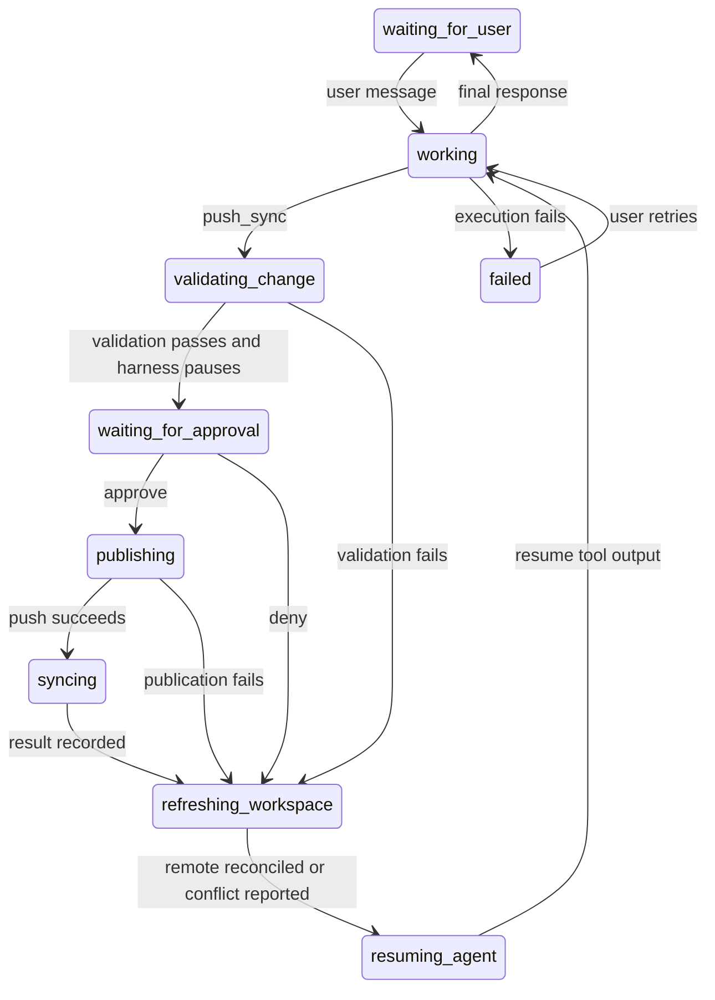

# Course agent development

## Codex thread state

Each conversation keeps one native Codex thread in `/workspace/.course-agent/codex`, outside the
course Git checkout. The runner records its thread ID and resumes it on subsequent turns; restarting
the app-server process does not reset the thread. Codex retains its model-visible history, tool
results, and any native compaction state. A failed resume reports an error rather than silently
replacing the session.

If no saved thread exists (including after a sandbox is lost in this base layer), the runner creates
a thread and supplies all available user/assistant messages from the conversation's Worker events.
This is a recovery fallback, not native-session restoration: it cannot recover tool results or
unpublished files. It has no 20-message/20,000-character truncation. A recovery transcript that exceeds
the model's context window can fail; automatic compaction is not unlimited input ingestion.

The base layer retains native state only for the sandbox's lifetime. The persistence layer adds
workspace backups containing these session files and PostgreSQL copies of messages and activity
for the UI. PostgreSQL chat history does not replace Codex's native session state.

The course agent is experimental and guarded by the `course-agent` feature flag. The first MVP
layer provides a temporary `/workspace`, a Codex harness with web search, Redis-backed resumable
SSE activity, a basic instructor panel, and live diagnostics. It does not clone a course
repository, persist conversations, publish changes, or track usage. The next stacked layer resolves
the course's configured GitHub repository and branch, shallow-clones it into `/workspace/course`,
and gives Codex a bundled content-authoring skill. At that point the agent can create and edit questions,
assessments, and other course content locally, but still cannot push.

The third stack layer stores conversations, turns, messages, and runtime events in PostgreSQL. The
panel reopens the most recent conversation and resumes an active Redis stream after navigation.
Use the conversation picker to reopen another conversation, or the plus button to start a new one.
Conversations are scoped to the authenticated instructor and course, with separate sandboxes and
Codex threads. Switching disconnects the browser stream, not a running server-side task; returning
loads saved messages and reconnects if that task is still active. A new conversation is saved when
its first message is sent. Unsent drafts are not saved when switching.
Each successful turn checkpoints `/workspace` to the Worker's R2 backup binding. When the configured
idle period expires, the Worker checkpoints again and destroys the sandbox. The next turn restores
the checkpoint only if it needs a new sandbox; a live workspace is never overwritten by an older
backup. The backup TTL comes from `courseAgentSandbox.backupTtlSeconds`. Completed text and tool
history are persisted independently of whether the browser remains connected. The checkpoint includes
`/workspace/.course-agent/codex`, so returning to a restored sandbox resumes the same native Codex
thread, including tool context and compaction state. PostgreSQL retains the instructor transcript
separately. If no native session exists, all available user/assistant messages from the Worker's
durable events are supplied once as recovery context; this does not reconstruct native tool history.

## Panel state and conversation names

The course-agent panel saves its expanded/collapsed preference in the server session, like the
left navigation. Its initial HTML reserves the correct width and shows a loading state until the
client and saved conversation are ready; the collapsed launcher also shows loading progress.

The persistence layer's Bootstrap conversation picker shows each conversation's start time in
the course timezone and an activity indicator for ongoing runs. The list refreshes every three
seconds while the page is visible without querying the sandbox for each entry.

New conversations start as "New conversation". As soon as the first user message is saved,
PL asynchronously requests a short title from the trusted Worker using `gpt-5.6-luna` through
the Vercel AI SDK with the Worker's existing `OPENAI_API_KEY`.
This does not start a sandbox or add messages to the Codex thread.
Only the first user message is sent (at most 4,000 characters),
with a 64-token output limit, reasoning disabled, and provider storage disabled.
Only the request creating the conversation starts naming, so later messages and reloads do not
generate duplicate requests. The title stays "New conversation" until generation succeeds,
including if naming fails. There are no automatic paid retries. Existing titles are left unchanged.
The fake runtime uses the shortened message and makes no model requests.

The fourth layer adds the approval-gated `push_sync` tool. For requested content changes, Codex
commits a clean workspace with a descriptive message and PrairieLearn Agent co-author trailer,
then calls the tool. The Worker verifies the proposed commit and Git tree. Before exposing an
approval, PrairieLearn applies the diff to an isolated temporary checkout and runs its existing
`loadFullCourse` loader. This checks course metadata and references without syncing the live
course or executing question code. Validation runs once per proposal; errors return to the agent
before the instructor is asked to approve.

PrairieLearn applies the approved diff to its trusted checkout, pushes and syncs it, and returns
the resulting status and server-job errors to a durable tool continuation. Denial returns control without
publishing and tells the agent not to resubmit the same proposal. If publishing succeeds but sync
fails, the result explicitly identifies that partial success. After every decision, the sandbox fetches
and merges the remote branch before delivering the result. Conflicts are included in the tool result;
unpublished work is not discarded.
Recoverable revision conflicts return to the agent; repository identity and approval checks remain
enforced. A successful sync adds a refresh button in the conversation. Refreshing restores the
selected conversation and saved messages.

## Free local testing

Set `courseAgentRuntime` to `fake` in your existing PrairieLearn configuration and enable the
`course-agent` feature for a course. The fake runtime exercises the same tRPC and UI contracts but
does not contact Cloudflare or a model provider.

To exercise the Worker locally, set `courseAgentRuntime` to `cloudflare`, configure
`courseAgentCapabilitySecret`, and start PrairieLearn with `make dev`. Start the Worker separately
with `pnpm dev-course-agent-worker`; Wrangler uses local simulation and local state. Do not run
`wrangler deploy` as part of local testing. Put `OPENAI_API_KEY` and the matching
`COURSE_AGENT_CAPABILITY_SECRET` in `apps/course-agent-worker/.dev.vars`. The model credential is
held by the Worker and inserted only by its outbound OpenAI handler; the sandbox receives the
placeholder value `proxy-injected`. Repository-enabled builds also require a read-only
`COURSE_AGENT_GITHUB_PAT` in the same Worker-only file. The sandbox sees `proxy-read`; the Worker
replaces it only for Git upload-pack requests to the exact authorized repository. Receive-pack,
other repositories, and other GitHub operations are rejected, so the credential can clone, fetch,
and pull but cannot push.

`make dev` never starts Wrangler. If the Worker is unavailable when you send a message, the panel
shows an error with the separate startup command.

Sandbox lifetime settings are non-secret and can be configured in `config.json`:

```json
{
  "courseAgentSandbox": {
    "waitingForUserTimeoutSeconds": 600,
    "sandboxInactivityTimeoutSeconds": 21600,
    "cloudflareSandboxTimeoutSeconds": 21600,
    "backupTtlSeconds": 604800
  }
}
```

- `waitingForUserTimeoutSeconds`: normal cost-saving suspension after a reply, failure, or validated
  approval request. Back up first, then destroy. Polling and repeated validation acknowledgments do
  not extend the wait. A new message clears it.
- `sandboxInactivityTimeoutSeconds`: emergency shutdown after no course-checkout modifications or
  agent network requests. An independent Durable Object records activity and destroys the sandbox
  even if the coordinator or backups fail. SDK polling, diagnostics, backup work, and tool-result
  polling do not count. The native filesystem watcher emits only on changes; it does not keep an
  SDK watch request open. A socket left open without new requests does not reset this deadline.
- `cloudflareSandboxTimeoutSeconds`: native `sleepAfter`, with `keepAlive: false`. This is the
  platform fallback if our lifecycle handling fails. SDK requests can renew it, so it is not the
  same clock as the activity watchdog. Diagnostics do not invent a platform expiration timestamp.
- `backupTtlSeconds`: how long a saved workspace remains restorable (seven days by default), not
  how long a sandbox runs.

Legacy `idleTimeoutSeconds` and `sleepAfterSeconds` still work; the corresponding new names take
precedence. `turnTimeoutSeconds` and `maxLifetimeSeconds` are ignored. There is no absolute runtime
cap: an active agent may continue longer than six hours. Operation-level Git, tool, and Python
execution limits remain. Timeout settings accept 60–86,400 seconds and apply on the next run.

Normal suspension retries a failed backup after one minute, but the independent inactivity watchdog
can still force destruction without another backup. Successful turns also checkpoint. A lost sandbox
does not discard a pending approval or its saved publication outcome. Recovery restores a usable
backup; a confirmed missing/expired backup starts from the current repository and conversation
history with a warning about unpublished files. Transient storage failures are not treated as an
expired backup. If no compatible native Codex continuation remains, a fresh native session receives
the saved outcome as recovery context, not as an answer to a nonexistent RPC.

### Post-sync rendering

After an approved `push_sync` succeeds, the agent calls `render_question_variant({ qid, seed? })`
for created or modified questions. The sandbox queues a bounded request; PL's existing reconciliation
path checks current conversation ownership and permissions, resolves the QID within that course,
and calls `getAndRenderVariant`, as AI question generation does. Rendering holds the course checkout
lock and verifies it matches the synced revision. It never renders unpublished sandbox files.

Results include QID, actual seed, synced revision, success, and bounded/redacted diagnostics,
including available Python traceback output. The existing Python caller enforces its execution
timeout. Requests expire after three minutes; a turn can request at most 30 renders. Background
reconciliation may add up to a minute before rendering starts. A failure is not validation success:
the agent must fix it and request a new approval. Broken content may remain live until that fix is
approved. This checks generation/rendering of one seed, not screenshots, grading, or every variant.

The coordinator persists its process ID, parsed stream state and log cursor. An alarm can reconcile
the same process after coordinator replacement, including its final output, without submitting the
user's prompt again. Conversation state is separate from sandbox state (`offline`, `starting`,
`ready`, `suspending`):



The sandbox may be backed up and destroyed while the conversation remains `waiting_for_approval`.
The pending approval and logical run ID survive in Durable Object storage and PostgreSQL. Codex
persists its native thread before interrupting the pending dynamic tool; a decision restores that
thread with standalone `toolOutput`, not a fabricated user message or a reply to a dead JSON-RPC
request. The coordinator uses a stable process ID per continuation to avoid replaying it after
replacement. New user runs are blocked while an approval is unresolved. An expired checkpoint is
reported as a restoration failure; it is never replaced with an empty thread.

The `courseAgentReconcile` server cron job polls outstanding conversations once per minute, without
requiring an open browser. It prepares proposals, acknowledges validation, and redelivers persisted
decisions. Saved always-approve mode is honored only after checking current course ownership.
Delivering a terminal decision may restore the sandbox and resume the existing logical run.
Publication records its server-job ID before execution; recovery inspects that job and never repeats
its push. Interrupted jobs with uncertain outcomes require remote inspection, not an automatic retry.
Normal feature checks still apply. PostgreSQL stores the raw conversation/sandbox states, revision,
generation, idle deadline and process ID; older snapshots cannot overwrite newer revisions. The
diagnostic panel shows these database fields alongside explicitly labeled Worker values.

SSE transport loss does not finish a model turn. The relay reconnects to the durable event log and
deduplicates sequence numbers; Redis continues buffering the client stream. If that buffer is no
longer available, an active run can be reattached from its durable log.

The pinned Codex continuation protocol can be tested without API credentials using
`scripts/verify-approval-continuation.mjs` inside the sandbox image with `--network none` and a writable
`/tmp`. It uses the production runner and a localhost mock Responses server, and checks that process
replacement produces exactly one continuation request and preserves the original tool-call history.

Administrators see a collapsed **Conversation info (only visible to administrators)**
accordion. The diagnostic endpoint also requires administrator access; the ordinary transcript
omits internal telemetry. The accordion shows runtime
identifiers, raw state values and usage, but never credentials or model reasoning. Worker-owned fields
are labeled explicitly; `null` is shown as `null`, and UI loading state never replaces stored state. Activity
appears inline within each assistant response using the same tool-status components as question
generation, and assistant responses support Markdown. Enter sends a message;
Shift+Enter adds a newline. The sandbox image includes `python` and `python3`.

The Worker mounts the `COURSE_AGENT_DOCS` R2 binding read-only at
`/opt/prairielearn-docs`. Local development can use Wrangler's empty local R2 bucket; Codex falls
back to the bundled skill when documentation is unavailable. The skill lives at
`apps/course-agent-worker/skills/course-content-authoring` and is packaged under
`/opt/course-agent/skills/course-content-authoring`. The runner reads its entrypoint into Codex's
developer instructions on every turn, so the model does not need to discover or search for `SKILL.md`.
It contains basic
course layout, targeted documentation pointers, fixed-choice and randomized numeric question
examples, and Homework/Exam assessment examples. These are available without R2 or web access.
References are read only when relevant; normal greetings require no repository inspection.

A compact Homework example is included in the starting instructions, so a basic assessment does
not require a separate template read. The skill encourages batched inspection, editing, and
review, and defaults to three complementary questions when no count is requested. It preserves
requested subject depth. No automatic course inventory or eval runner is included.

There are no standalone validation or question-rendering tools. The course-specific MCP server
exposes only `push_sync`; Codex retains its normal file, shell, and search capabilities. Validation
inside `push_sync` and successful sync do not establish that every question variant renders or
grades correctly. The agent must not claim unperformed rendering or grading checks.

The panel uses the AI SDK's `useChat`. A small transport starts runs through tRPC and reads standard
UI-message SSE. PrairieLearn translates Worker events into UI-message chunks before buffering them
in Redis; each run has a stable assistant-message ID, and earlier turns in the Worker's replay are
excluded. Reconnecting rebuilds that run's message from the beginning without submitting another
model request. If Redis no longer has the completed stream, the same adapter reconstructs it from
the authorized workspace snapshot. On page reload, PostgreSQL history is rebuilt with the same
UI-message adapter, including each turn's tool calls. An active run reconnects without another model
request. Saved history remains readable if the Worker is temporarily unavailable. Internal telemetry
and backup handles are omitted from this ordinary history response.

The sandbox runs Codex app-server over stdio to forward final-answer text deltas as they arrive.
The Worker reads cumulative process logs, preserving partial JSON lines between polls and draining
every remaining line after process exit. It waits for those events to be persisted before publishing
the final response. Malformed output or a missing `turn/completed` notification is reported as a
stream failure rather than silently accepting a partial answer.

The default coding model is `gpt-6-astra`, configured by the Worker's `OPENAI_MODEL` variable.
The runner enables live web search through the Responses API; it does not require a separate search
API key. The localhost mock test verifies model selection on new and resumed threads, search-tool
availability, search activity notifications, and streamed response text.

Proposed changes show the total number of files changed and added/deleted lines. Review opens a modal
with a dimmed backdrop and approval controls. New files appear as ordinary code with an Added badge;
modified files use lightly tinted change lines and a separate marker gutter. Raw Git hunk headers
are omitted. All file diffs share one scrolling body, with long lines wrapped and no file-navigation
sidebar. The conversation offers refresh only for the latest turn,
after a completed reply reports a successful course sync newer than the displayed page, and only
when its revision is not already displayed. Reloading clears the refresh prompt and immediately
positions saved history at the bottom. Sending another message also dismisses the previous turn's
refresh prompt.

Commentary and reasoning are not displayed. Rebuild/restart the local Worker after changing its
Dockerfile or runner script. The Docker build context excludes local configuration and credentials.
The publication bridge rejects the old non-blocking tool protocol, so a stale sandbox image cannot
silently complete a turn before the instructor decides. The image must include `push-approval.mjs`;
run the packaged continuation check for both its default approved case and `--deny` after rebuilding.
To verify the runner against the pinned Codex binary without paid requests, set
`COURSE_AGENT_TEST_CODEX` to that binary's absolute path when running the Worker tests; its provider
is replaced by a localhost-only mock with a fake key.

For local backup testing, Wrangler uses its local `BACKUP_BUCKET` binding and does not require R2
access keys. A deployed Worker may receive `R2_ACCESS_KEY_ID` and `R2_SECRET_ACCESS_KEY` as optional
secrets when its backup implementation uses remote S3-compatible access.

Cloud resources and credentials used by later stack layers are intentionally not configured here.
