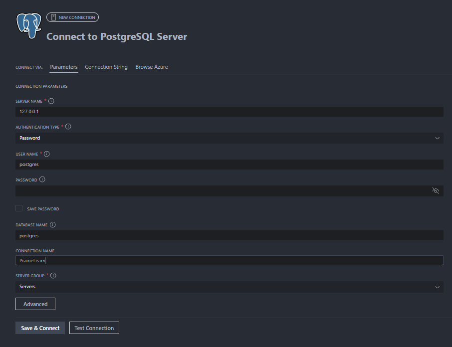
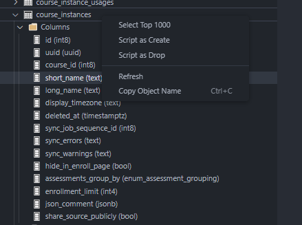

# Developer Guide

This page outlines debugging and testing tips, best practices and style for coding, as well as details about various aspects of PrairieLearn (question rendering, database schemas, etc.).

In general, we prefer simplicity. We standardize on JavaScript/TypeScript (Node.js) and SQL (PostgreSQL) as the languages of implementation and try to minimize the number of complex libraries or frameworks being used. The website is server-side generated pages with minimal client-side JavaScript.

## High level view

{pad="0" scale="1"}

- The questions and assessments for a course are stored in a git repository. This is synced into the database by the course instructor and database data is updated or added to represent the course. Students then interact with the course website by doing questions, with the results being stored in the database. The instructor can view the student results on the website and download CSV files with the data.

- The majority of course content and configuration is done via plain text files in the git repository, which is the master source for this data.

- All student data is all stored in the database and is not pushed back into the git repository or disk at any point.

## Unit tests and integration tests

- Integration tests are stored in the `apps/prairielearn/src/tests/` directory.
- Unit tests are typically located next to the file under test, with the filename ending in `.test.ts`. For instance, tests for `foo.ts` would be in `foo.test.ts` in the same directory.

- See the [development quickstart guide](quickstart.md#testing) for information on how to run the test suite.

- The tests are run by GitHub Actions on every push to GitHub.

- The tests are mainly integration tests that start with a blank database, run the server to initialize the database, load the `testCourse`, and then emulate a client web browser that answers questions on assessments. If a test fails then it is often easiest to debug by recreating the error by doing questions yourself against a locally-running server.

- If the `PL_KEEP_TEST_DB` environment is set, the test database (normally `pltest_1`, `pltest_2`, etc.) won't be removed when testing ends. This allows you to inspect the state of the database whenever your testing ends. The database will get overwritten when you start a new test run.

## Debugging server-side JavaScript

- Use the [debug package](https://www.npmjs.com/package/debug) to help trace execution flow in JavaScript. To run the server with debugging output enabled:

  ```sh
  DEBUG=* make dev
  ```

- To just see debugging logs from PrairieLearn you can use:

  ```sh
  DEBUG=prairielearn:* make dev
  ```

- To insert more debugging output, import `debug` and use it like this:

  ```javascript
  import debugfn from 'debug';

  const debug = debugfn('prairielearn:my-file');

  // in some function later
  debug('func()', 'param:', param);
  ```

## Debugging client-side JavaScript

- Make sure you have the JavaScript Console open in your browser and reload the page.

## Debugging SQL and PL/pgSQL

- Use the [`psql`](https://www.postgresql.org/docs/current/app-psql.html) command-line interface to test SQL separately. A default development PrairieLearn install uses the `postgres` database, so you should run:

  ```sh
  psql postgres
  ```

- To debug syntax errors in a stored procedure, import it manually with `\i filename.sql` in `psql`.

- To follow execution flow in PL/pgSQL use `RAISE NOTICE`. This will log to the console when run from `psql` and to the server log file when run from within PrairieLearn. The syntax is:

  ```sql
  RAISE NOTICE 'This is logging: % and %',
  var1,
  var2;
  ```

- To manually run a function:

  ```sql
  SELECT
    the_sql_function (arg1, arg2);
  ```

## HTML page generation

- [Express](http://expressjs.com) is used as the web framework.

- All pages are server-side rendered, and we try and minimize the amount of client-side JavaScript. Client-side JS should use vanilla JavaScript/TypeScript where possible, but third-party libraries may be used when appropriate.

- Each web page typically has all its files in a single directory, with the directory, the files, and the URL all named the same. Not all pages need all files. For a real-world example, consider the page where users can accept the PrairieLearn terms and conditions, located at [`apps/prairielearn/src/ee/pages/terms`](https://github.com/PrairieLearn/PrairieLearn/tree/master/apps/prairielearn/src/ee/pages/terms). That directory contains the following files:
  - [`terms.ts`](https://github.com/PrairieLearn/PrairieLearn/tree/master/apps/prairielearn/src/ee/pages/terms/terms.ts): The main entry point for the page. It runs SQL queries and renders a template.
  - [`terms.sql`](https://github.com/PrairieLearn/PrairieLearn/tree/master/apps/prairielearn/src/ee/pages/terms/terms.sql): All SQL queries for the page.
  - [`terms.html.ts`](https://github.com/PrairieLearn/PrairieLearn/tree/master/apps/prairielearn/src/ee/pages/terms/terms.html.ts): The template for the page. Exports a function that returns an HTML document.

- When possible, prefer explicitly passing individual typed properties to templates instead of adding properties to `res.locals`. However, `res.locals` may be used for data coming from middlewares that will be used on many pages.

- Use [`@prairielearn/html`](https://github.com/PrairieLearn/PrairieLearn/tree/master/packages/html) to generate HTML pages. This uses HTML tagged-template literals to generate HTML, which in turn makes it easy to get full type-checking.

- Reused templates are stored in the `apps/prairielearn/src/components/` directory. These should generally accept an object with properties instead of being passed the full `res.locals` object.

## HTML style

- Use [Bootstrap](http://getbootstrap.com) as the style. As of 2025-01-01 we are using Bootstrap 5.

- Local CSS rules go in `public/stylesheets/local.css`. Try to minimize use of this and use plain Bootstrap styling wherever possible.

- Buttons should use the `<button>` element when they take actions and the `<a>` element when they are simply links to other pages. We should not use `<a role="button">` to fake a button element. Buttons that do not submit a form should always start with `<button type="button" class="btn ...">`, where `type="button"` specifies that they don't submit.

## SQL usage

- [PostgreSQL](https://www.postgresql.org) v16 is used as the database.

- The [PostgreSQL manual](https://www.postgresql.org/docs/manuals/) is an excellent reference.

- Write raw SQL rather than using a [ORM library](https://en.wikipedia.org/wiki/Object-relational_mapping). This reduces the number of frameworks/languages needed.

- Prefer implementing complex logic in TypeScript instead of inside queries.

- Use the SQL convention of [`snake_case`](https://en.wikipedia.org/wiki/Snake_case) for names. Also use the same convention in JavaScript for names that are the same as in SQL, so the `question_id` variable in SQL is also called `question_id` in JavaScript code.

- Use uppercase for SQL reserved words like `SELECT`, `FROM`, `AS`, etc.

- SQL code should not be inline in JavaScript files. Instead, it should be in a separate `.sql` file, following the [`Yesql` concept](https://github.com/krisajenkins/yesql). Each `filename.js` file will normally have a corresponding `filename.sql` file in the same directory. The `.sql` file should look like:

  ```sql
  -- BLOCK select_question
  SELECT
    *
  FROM
    questions
  WHERE
    id = $question_id;
  
  -- BLOCK insert_user
  INSERT INTO
    users (uid)
  VALUES
    ($uid)
  RETURNING
    *;
  ```

From JavaScript, you can then do:

```javascript
import { loadSqlEquiv, queryRow } from '@prairielearn/postgres';

import { QuestionSchema } from './lib/db-types.js';

const sql = loadSqlEquiv(import.meta.url);

const question = await queryRow(sql.select_question, { question_id: 45 }, QuestionSchema);
```

- To keep SQL code organized it is a good idea to use [CTEs (`WITH` queries)](https://www.postgresql.org/docs/current/static/queries-with.html). These are formatted like:

  ```sql
  WITH
    first_preliminary_table AS (
      SELECT
        -- first preliminary query
    ),
    second_preliminary_table AS (
      SELECT
        -- second preliminary query
    )
  SELECT
    -- main query here
  FROM
    first_preliminary_table AS fpt,
    second_preliminary_table AS spt;
  ```

## Database stored procedures (sprocs)

!!! warning

    We are migrating away from the use of [sprocs](https://neon.com/postgresql/postgresql-plpgsql/postgresql-create-procedure). Prefer writing logic in TypeScript instead.

- Stored procedures are created by the files in `sprocs/`. To call a stored procedure from JavaScript, use code like:

  ```js
  const workspace_id = 1342;
  const message = 'Startup successful';
  await sqldb.callAsync('workspaces_message_update', [workspace_id, message]);
  ```

- The stored procedures are all contained in a separate [database schema](https://www.postgresql.org/docs/current/ddl-schemas.html) with a name like `server_2021-07-07T20:25:04.779Z_T75V6Y`. To see a list of the schemas use the `\dn` command in `psql`.

- To be able to use the stored procedures from the `psql` command line it is necessary to get the most recent schema name using `\dn` and set the `search_path` to use this _quoted_ schema name and the `public` schema:

  <!-- prettier-ignore -->
  ```sql
  set search_path to "server_2021-07-07T20:25:04.779Z_T75V6Y", public;
  ```

- During startup, we initially have no non-public schema in use. We first run the migrations to update all tables in the `public` schema, then we call `sqldb.setRandomSearchSchemaAsync()` to activate a random per-execution schema, and we run the sproc creation code to generate all the stored procedures in this schema. This means that every invocation of PrairieLearn will have its own locally-scoped copy of the stored procedures which are the correct versions for its code. This lets us upgrade PrairieLearn servers one at a time, while old servers are still running with their own copies of their sprocs. When PrairieLearn first starts up it has `search_path = public`, but later it will have `search_path = "server_2021-07-07T20:25:04.779Z_T75V6Y",public` so that it will first search the random schema and then fall back to `public`. The naming convention for the random schema uses the local instance name, the date, and a random string. Note that schema names need to be quoted using double-quotations in `psql` because they contain characters such as hyphens.

- For more details see `sprocs/array_and_number.sql` and comments in `server.js` near the call to `sqldb.setRandomSearchSchemaAsync()`.

## Database schema (simplified overview)

- The most important tables in the database are shown in the diagram below:


- Detailed descriptions of the format of each table are in the [list of database tables](https://github.com/PrairieLearn/PrairieLearn/blob/master/database/tables/).

- Each table has an `id` number that is used for cross-referencing. For example, each row in the `questions` table has an `id` and other tables will refer to this as a `question_id`. For legacy reasons, there are two exceptions to this rule:
  - Tables that reference the `pl_courses` table use `course_id` instead of `pl_course_id`.
  - The `users` table has a `user_id` primary key instead of `id`.

- Each user is stored as a single row in the `users` table.

- The `pl_courses` table has one row for each course, like `TAM 212`.

- The `course_instances` table has one row for each semester ("instance") of each course, with the `course_id` indicating which course it belongs to.

- Every question is a row in the `questions` table, and the `course_id` shows which course it belongs to. All the questions for a course can be thought of as the "question pool" for that course. This same pool is used for all semesters (all course instances).

- Assessments are stored in the `assessments` table and each assessment row has a `course_instance_id` to indicate which course instance (and hence which course) it belongs to. An assessment is something like "Homework 1" or "Exam 3". To determine this we can use the `assessment_set_id` and `number` of each assessment row.

- Each assessment has a list of questions associated with it. This list is stored in the `assessment_questions` table, where each row has a `assessment_id` and `question_id` to indicate which questions belong to which assessment. For example, there might be 20 different questions that are on "Exam 1", and it might be the case that each student gets 5 of these questions randomly selected.

- Each student will have their own copy of an assessment, stored in the `assessment_instances` table with each row having a `user_id` and `assessment_id`. This is where the student's score for that assessment is stored.

- The selection of questions that each student is given on each assessment is in the `instance_questions` table. Here each row has an `assessment_question_id` and an `assessment_instance_id` to indicate that the corresponding question is on that assessment instance. This row will also store the student's score on this particular question.

- Questions can randomize their parameters, so there are many possible variants of each question. These are stored in the `variants` table with an `instance_question_id` indicating which instance question the variant belongs to.

- For each variant of a question that a student sees they will have submitted zero or more `submissions` with a `variant_id` to show what it belongs to. The submissions row also contains information the submitted answer and whether it was correct.

??? tip "Schema and data exploration"

    The [`ms-ossdata.vscode-pgsql` VSCode extension](https://marketplace.visualstudio.com/items?itemName=ms-ossdata.vscode-pgsql) can help you explore the database schema and data in your editor.

    

    

??? tip "Cleaning out old schemas"

    The following query will remove all schemas except `public`. You can then restart the server to recreate the sprocs.

    ```sql
    DO $$
    DECLARE
      r RECORD;
    BEGIN
      FOR r IN
        SELECT nspname
        FROM pg_namespace
        WHERE nspname NOT IN ('public', 'information_schema', 'pg_catalog')
          AND nspname NOT LIKE 'pg_toast%'
          AND nspname NOT LIKE 'pg_temp_%'
      LOOP
        EXECUTE format('DROP SCHEMA IF EXISTS %I CASCADE;', r.nspname);
        COMMIT;  -- avoid shared memory exhaustion
      END LOOP;
    END $$;
    ```

## Database schema (full data)

- See the [list of database tables](https://github.com/PrairieLearn/PrairieLearn/blob/master/database/tables/), with the ER (entity relationship) diagram below:

{layout="elk"}

## Database schema conventions

- Tables have plural names (e.g. `assessments`) and always have a primary key called `id`. The foreign keys pointing to this table are non-plural, like `assessment_id`. When referring to this use an abbreviation of the first letters of each word, like `ai` in this case. The only exceptions are `aset` for `assessment_sets` (to avoid conflicting with the SQL `AS` keyword), `top` for `topics`, and `tag` for `tags` (to avoid conflicts). This gives code like:

  ```sql
  -- select all active assessment_instances for a given assessment
  SELECT
    ai.*
  FROM
    assessments AS a
    JOIN assessment_instances AS ai ON (ai.assessment_id = a.id)
  WHERE
    a.id = 45
    AND ai.deleted_at IS NULL;
  ```

- We (almost) never delete student data from the database. To avoid having rows with broken or missing foreign keys, course configuration tables (e.g. `assessments`) can't be actually deleted. Instead, they are "soft-deleted" by setting the `deleted_at` column to non-NULL. This means that when using any soft-deletable table we need to have a `WHERE deleted_at IS NULL` to get only the active rows.

## Database schema modification

See the [migrations documentation](./migrations/README.md).

## Database access

- Database access is via the `@prairielearn/postgres` package. This wraps the [node-postgres](https://github.com/brianc/node-postgres) library.

- For single queries we normally use the following pattern, which automatically uses connection pooling from node-postgres and safe variable interpolation with named parameters and [prepared statements](https://github.com/brianc/node-postgres/wiki/Parameterized-queries-and-Prepared-Statements):

  ```javascript
  const questions = await queryRows(
    sql.select_questions_by_course,
    { course_id: 45 },
    QuestionSchema,
  );
  ```

Where the corresponding `filename.sql` file contains:

```sql
-- BLOCK select_questions_by_course
SELECT
  *
FROM
  questions
WHERE
  course_id = $course_id;
```

- For queries where it would be an error to not return exactly one result row:

  ```javascript
  const question = await queryRow(sql.block_name, QuestionSchema);
  ```

- Use explicit row locking whenever modifying student data related to an assessment. This must be done within a transaction. The rule is that we lock either the variant (if there is no corresponding assessment instance) or the assessment instance (if we have one). It is fine to repeatedly lock the same row within a single transaction, so all functions involved in modifying elements of an assessment (e.g., adding a submission, grading, etc.) should call a locking function when they start. Locking can be performed with a query like:

```sql
SELECT
  *
FROM
  assessment_instances
WHERE
  id = $assessment_instance_id
FOR NO KEY UPDATE;
```

- To pass an array of parameters to SQL code, use the following pattern, which allows zero or more elements in the array. This replaces `$points_list` with `ARRAY[10, 5, 1]` in the SQL. It's required to specify the type of array in case it is empty:

  ```javascript
  await sqldb.queryAsync(sql.insert_assessment_question, {
    points_list: [10, 5, 1],
  });
  ```

  ```sql
  -- BLOCK insert_assessment_question
  INSERT INTO
    assessment_questions (points_list)
  VALUES
    ($points_list::INTEGER[]);
  ```

- To use a JavaScript array for membership testing in SQL use `= ANY ($array)` (or its negative form `!= ALL ($array)`) like:

  ```javascript
  const questions = await sqldb.queryRows(
    sql.select_questions,
    { id_list: [7, 12, 45] },
    QuestionSchema,
  );
  ```

  ```sql
  -- BLOCK select_questions
  SELECT
    *
  FROM
    questions
  WHERE
    id = ANY ($id_list::BIGINT[]);
  ```

- To pass a lot of data to SQL a useful pattern is to send a JSON object array and unpack it in SQL to the equivalent of a table. This is the pattern used by the "sync" code, such as [sprocs/sync_news_items.sql](https://github.com/PrairieLearn/PrairieLearn/blob/master/apps/prairielearn/src/sprocs/sync_news_items.sql). For example:

  ```javascript
  let data = [
    { a: 5, b: 'foo' },
    { a: 9, b: 'bar' },
  ];
  await sqldb.queryAsync(sql.insert_data, {
    data: JSON.stringify(data),
  });
  ```

  ```sql
  -- BLOCK insert_data
  INSERT INTO
    my_table (a, b)
  SELECT
    *
  FROM
    jsonb_to_recordset($data) AS (a INTEGER, b TEXT);
  ```

- To use a JSON object array in the above fashion, but where the order of rows is important, use `ROWS FROM () WITH ORDINALITY` to generate a row index like this:

  ```sql
  -- BLOCK insert_data
  INSERT INTO
    my_table (a, b, order_by)
  SELECT
    *
  FROM
    ROWS
  FROM
    (jsonb_to_recordset($data) AS (a INTEGER, b TEXT)) WITH ORDINALITY AS data (a, b, order_by);
  ```

## Asynchronous control flow in JavaScript

- New code in PrairieLearn should use `async`/`await` whenever possible.

- Use the [async library](http://caolan.github.io/async/) for complex control flow or when mixing Promise-based and callback-based code.

## Using async route handlers with ExpressJS

- Express can't directly use async route handlers. Instead, we use [express-async-handler](https://www.npmjs.com/package/express-async-handler) like this:

  ```javascript
  import asyncHandler from 'express-async-handler';
  router.get(
    '/',
    asyncHandler(async (req, res, next) => {
      // can use "await" here
    }),
  );
  ```

## Security model

- We distinguish between [authentication and authorization](https://en.wikipedia.org/wiki/Authentication#Authorization). Authentication occurs as the first stage in server response and the authenticated user data is stored as `res.locals.authn_user`.

- The authentication flow is:
  1. We first redirect to a remote authentication service (e.g. SAML SSO, Google, Microsoft).

  2. The remote authentication service redirects back to a callback URL, e.g. `/pl/oauth2callback` for Google. These endpoints confirm authentication, create the user in the `users` table if necessary, set a signed `pl_authn` cookie in the browser with the authenticated `user_id`, and then redirect to the main PL homepage. This cookie is set with the `HttpOnly` attribute, which prevents client-side JavaScript from reading the cookie.

  3. Every other page authenticates using the signed browser `pl_authn` cookie. This is read by [`middlewares/authn.ts`](https://github.com/PrairieLearn/PrairieLearn/blob/master/apps/prairielearn/src/middlewares/authn.ts) which checks the signature and then loads the user data from the DB using the `user_id`, storing it as `res.locals.authn_user`.

- Similar to unix, we distinguish between the real and effective user. The real user is stored as `res.locals.authn_user` and is the user that authenticated. The effective user is stored as `res.locals.user`. Only users with `role = TA` or higher can set an effective user that is different from their real user. Moreover, users with `role = TA` or higher can also set an effective `role` and `mode` that is different to the real values.

- Authorization occurs at multiple levels:
  - The `course_instance` checks authorization based on the `authn_user`.

  - The `course_instance` authorization is checked against the effective `user`.

  - The `assessment` checks authorization based on the effective `user`, `role`, `mode`, and `date`.

- All state-modifying requests must (normally) be POST and all associated data must be in the body. GET requests may use query parameters for viewing options only.

## State-modifying POST requests

- Use the [Post/Redirect/Get](https://en.wikipedia.org/wiki/Post/Redirect/Get) pattern for all state modification. This means that the initial GET should render the page with a `<form>` that has no `action` set, so it will submit back to the current page. This should be handled by a POST handler that performs the state modification and then issues a redirect back to the same page as a GET:

  ```javascript
  router.post(
    '/',
    asyncHandler(async (req, res) => {
      if (req.body.__action == 'enroll') {
        await queryAsync(sql.enroll, {
          course_instance_id: req.body.course_instance_id,
          user_id: res.locals.authn_user.user_id,
        });
        res.redirect(req.originalUrl);
      } else {
        throw new error.HttpStatusError(400, `unknown __action: ${req.body.__action}`);
      }
    }),
  );
  ```

- To defeat [CSRF (Cross-Site Request Forgery)](https://en.wikipedia.org/wiki/Cross-site_request_forgery) we use the [Encrypted Token Pattern](https://cheatsheetseries.owasp.org/cheatsheets/Cross-Site_Request_Forgery_Prevention_Cheat_Sheet.html). This stores an [HMAC-authenticated token](https://en.wikipedia.org/wiki/Hash-based_message_authentication_code) inside the POST data.

- All data modifying requests should come from `form` elements like:

  ```html
  <form name="enroll-form" method="POST">
    <input type="hidden" name="__action" value="enroll" />
    <input type="hidden" name="__csrf_token" value="${__csrf_token}" />
    <input type="hidden" name="course_instance_id" value="56" />
    <button type="submit" class="btn btn-info">Enroll in course instance 56</button>
  </form>
  ```

- The `res.locals.__csrf_token` variable is set and checked by early-stage middleware, so no explicit action is needed on each page.

## Logging errors

- We use [Winston](https://github.com/winstonjs/winston) for logging to the console and to files:

  ```javascript
  import { logger } from '@prairielearn/logger';

  logger.info('This is an info message');
  logger.error('This is an error message');

  // This will be logged to the log file, but not to the console:
  logger.verbose('This is a verbose message');
  ```

- All `logger` functions have a mandatory first argument that is a string, and an optional second argument that is an object containing useful information. It is important to always provide a string as the first argument.

## Coding style

[ESLint](http://eslint.org/) and [Prettier](https://prettier.io/) are used to enforce consistent code conventions and formatting throughout the codebase. See `.eslintrc.js` and `.prettierrc.json` in the root of the PrairieLearn repository to view our specific configuration. The repo includes an [`.editorconfig`](https://editorconfig.org/) file that most editors will detect and use to automatically configure things like indentation. If your editor doesn't natively support an EditorConfig file, there are [plugins](https://editorconfig.org/#download) available for most other editors.

For Python files, [ruff](https://docs.astral.sh/ruff/) is used for autoformatting and enforcing code conventions, and [Pyright](https://github.com/microsoft/pyright) is used for static typechecking. See `pyproject.toml` in the root of the PrairieLearn repository to view our specific configuration. We encourage all new Python code to include type hints for use with the static typechecker, as this makes it easier to read, review, and verify contributions.

To lint the code, use `make lint`. This is also run by the CI tests.

To automatically fix lint and formatting errors, run `make format`.

## Question-rendering control flow

- The core files involved in question rendering are [lib/question-render.ts](https://github.com/PrairieLearn/PrairieLearn/blob/master/apps/prairielearn/src/lib/question-render.ts), [lib/question-render.sql](https://github.com/PrairieLearn/PrairieLearn/blob/master/apps/prairielearn/src/lib/question-render.sql), and [components/QuestionContainer.html.ts](https://github.com/PrairieLearn/PrairieLearn/blob/master/apps/prairielearn/src/components/QuestionContainer.html.ts).

- The above files are all called/included by each of the top-level pages that needs to render a question (e.g., `pages/instructorQuestionPreview`, `pages/studentInstanceQuestion`, etc.). Unfortunately the control-flow is complicated because we need to call `lib/question-render.ts` during page data load, store the data it generates, and then later include the `components/QuestionContainer.html.ts` template to actually render this data.

- For example, the exact control-flow for `pages/instructorQuestion` is:
  1. The top-level page `pages/instructorQuestion/instructorQuestion.js` code calls `lib/question-render.getAndRenderVariant()`.

  2. `getAndRenderVariant()` inserts data into `res.locals` for later use by `components/QuestionContainer.html.ts`.

  3. The top-level page code renders the top-level template `pages/instructorQuestion/instructorQuestion.html.ts`, which then includes `components/QuestionContainer.html.ts`.

  4. `components/QuestionContainer.html.ts` renders the data that was earlier generated by `lib/question-render.ts`.

## Question open status

- There are three levels at which “open” status is tracked, as follows. If `open = false` for any object then it will block the creation of new objects below it. For example, to create a new submission the corresponding variant, instance_question, and assessment_instance must all be open.

  | Variable                   | Allow new `instance_questions` | Allow new `variants` | Allow new `submissions` |
  | -------------------------- | ------------------------------ | -------------------- | ----------------------- |
  | `assessment_instance.open` | ✓                              | ✓                    | ✓                       |
  | `instance_question.open`   |                                | ✓                    | ✓                       |
  | `variant.open`             |                                |                      | ✓                       |

## Errors in question handling

- We distinguish between two different types of student errors:
  1. The answer might be not be gradable (`submission.gradable = false`). This could be due to a missing answer, an invalid format (e.g., entering a string in a numeric input), or a answer that doesn't pass some basic check (e.g., a code submission that didn't compile). This can be discovered during either the parsing or grading phases. In such a case the `submission.format_errors` object should store information on what was wrong to allow the student to correct their answer. A submission with `gradable = false` will not cause any updating of points for the question. That is, it acts like a saved-but-not-graded submission, in that it is recorded but has no impact on the question. If `gradable = false` then the `score` and `feedback` will not be displayed to the student.

  2. The answer might be gradable but incorrect. In this case `submission.gradable = true` but `submission.score = 0` (or less than 1 for a partial score). If desired, the `submission.feedback` object can be set to give information to the student on what was wrong with their answer. This is not necessary, however. If `submission.feedback` is set then it will be shown to the student along with their `submission.score` as soon as the question is graded.

- There are three levels of errors that can occur during the creation, answering, and grading of a question:

  | Error level     | Caused                                                           | Stored                                                                                    | Reported                             | Effect                                                                                                                                                                     |
  | --------------- | ---------------------------------------------------------------- | ----------------------------------------------------------------------------------------- | ------------------------------------ | -------------------------------------------------------------------------------------------------------------------------------------------------------------------------- |
  | System errors   | Internal PrairieLearn errors                                     | On-disk logs                                                                              | Error page                           | Operation is blocked. Data is not saved to the database.                                                                                                                   |
  | Question errors | Errors in question code                                          | `issues` table                                                                            | Issue panels on the question page    | `variant.broken_at != null` or `submission.broken == true`. Operation completes, but future operations are blocked.                                                        |
  | Student errors  | Invalid data submitted by the student (unparsable or ungradable) | `submission.gradable` set to `false` and details are stored in `submission.format_errors` | Inside the rendered submission panel | The submission is not assigned a score and no further action is taken (e.g., points are changed for the instance question). The student can resubmit to correct the error. |

- The important variables involved in tracking question errors are:

  | Variable                   | Error level    | Description                                                                                                                                                                                        |
  | -------------------------- | -------------- | -------------------------------------------------------------------------------------------------------------------------------------------------------------------------------------------------- |
  | `variant.broken_at`        | Question error | Set to `NOW()` if there were question code errors in generating the variant. Such a variant will not have `render()` functions called, but will instead be displayed as `This question is broken`. |
  | `submission.broken`        | Question error | Set to `true` if there question code errors in parsing or grading the variant. After `submission.broken` is `true`, no further actions will be taken with the submission.                          |
  | `issues` table             | Question error | Rows are inserted to record the details of the errors that caused `variant.broken != null` or `submission.broken == true` to be set to `true`.                                                     |
  | `submission.gradable`      | Student error  | Whether this submission can be given a score. Set to `false` if format errors in the `submitted_answer` were encountered during either parsing or grading.                                         |
  | `submission.format_errors` | Student error  | Details on any errors during parsing or grading. Should be set to something meaningful if `gradable = false` to explain what was wrong with the submitted answer.                                  |
  | `submission.graded_at`     | None           | NULL if grading has not yet occurred, otherwise a timestamp.                                                                                                                                       |
  | `submission.score`         | None           | Final score for the submission. Only used if `gradable = true` and `graded_at` is not NULL.                                                                                                        |
  | `submission.feedback`      | None           | Feedback generated during grading. Only used if `gradable = true` and `graded_at` is not NULL.                                                                                                     |

- Note that `submission.format_errors` stores information about student errors, while the `issues` table stores information about question code errors.

- The question flow is shown in the diagram below:


## JavaScript equality operator

You should almost always use the `===` operator for comparisons; this is enforced with an ESLint rule.

The only case where the `==` operator is frequently useful is for comparing entity IDs that may be coming from the client/database/etc. These may be either strings or numbers depending on where they're coming from or how they're fetched. To make it abundantly clear that IDs are being compared, you should use the `idsEqual` utility:

```js
import { idsEqual } from './lib/id';

console.log(idsEqual(12345, '12345'));
// > true
```

"Modern" queries that use Zod validation will automatically coerce all IDs to strings. If you're confident that data on both sides of the comparison is coming from a Zod-validated query, you can use the `===` operator directly.
