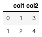

# PrairieLearn Elements for use in `question.html`

When writing questions, there exists a core pool of elements that provides
common structures associated with assessment items. These elements can be
split into three distinct groups: **submission**, **decorative**, and
**conditional**. Within this document, all of PrairieLearn's elements are
displayed alongside links to sample elements within the example course. To
build your own PrairieLearn element, please see [Question Element Writing](devElements.md)
documentation.

**Submission** elements act as a way to receive a response or input from the
student. These elements are traditionally referred to as form input fields.
PrairieLearn presently provides the following templated **input field** elements:

- [`pl-multiple-choice`](#pl-multiple-choice-element): Selecting only
  **one option** from a list.
- [`pl-checkbox`](#pl-checkbox-element): Selecting **multiple options** from a
  list.
- [`pl-dropdown`](#pl-dropdown-element): Select an answer from answers in a drop-down box.
- [`pl-order-blocks`](#pl-order-blocks-element): Select and arrange given blocks of code or text.
- [`pl-number-input`](#pl-number-input-element): Fill in a **numerical** value
  within a specific tolerance level such as 3.14, -1.921, and so on.
- [`pl-integer-input`](#pl-integer-input-element): Fill in an **integer** value
  such as -71, 0, 5, 21, and so on.
- [`pl-symbolic-input`](#pl-symbolic-input-element): Fill in a **symbolic** value
  such as `x^2`, `sin(z)`, `mc^2`, and so on.
- [`pl-string-input`](#pl-string-input-element): Fill in a **string** value
  such as "Illinois", "GATTACA", "computer", and so on.
- [`pl-matching`](#pl-matching-element): Select a matching option for each entry in
  a group.
- [`pl-matrix-component-input`](#pl-matrix-component-input-element): Fill in
  a **matrix** using grid that has an input area for each element.
- [`pl-matrix-input`](#pl-matrix-input-element): Supply a matrix in a supported
  programming language format.
- [`pl-rich-text-editor`](#pl-rich-text-editor-element): Provide an in-browser formattable text editor
  for writing and submitting code.
- [`pl-file-editor`](#pl-file-editor-element): Provide an in-browser code editor
  for writing and submitting code.
- [`pl-file-upload`](#pl-file-upload-element): Provide a submission area
  to obtain a file with a specific naming scheme.
- [`pl-threejs`](#pl-threejs-element): Enables 3D scene display and problem
  submission.

**Decorative** elements are meant to improve how the question is displayed to
students. Elements under this category include ways to specify question markup,
images, files, and code display. The following **decorative** elements are available:

- [`pl-code`](#pl-code-element): Displays code rendered with the appropriate
  syntax highlighting.
- [`pl-figure`](#pl-figure-element): Embed an image file in the question.
- [`pl-file-download`](#pl-file-download-element): Enable file downloads for
  data-centric questions.
- [`pl-variable-output`](#pl-variable-output-element): Displays matrices in
  code form for supported programming languages.
- [`pl-matrix-latex`](#pl-matrix-latex-element): Displays matrices using
  appropriate LaTeX commands for use in a mathematical expression.
- [`pl-python-variable`](#pl-python-variable-element): Display formatted output of Python
  variables and pandas data frames.
- [`pl-graph`](#pl-graph-element): Displays graphs, either using GraphViz DOT notation
  or with an adjacency matrix.
- [`pl-drawing`](#pl-drawing-element): Creates an image from pre-defined
  collection of graphic objects
- [`pl-overlay`](#pl-overlay-element): Allows layering existing elements on top of one another in specified positions.
- [`pl-external-grader-variables`](#pl-external-grader-variables-element): Displays expected and given variables for externally graded questions.
- [`pl-xss-safe`](#pl-xss-safe-element): Removes potentially unsafe code from HTML code.

**Conditional** elements are meant to improve the feedback and question structure.
These elements conditionally render their content depending on the question state.
The following **Conditional** elements are available:

- [`pl-question-panel`](#pl-question-panel-element): Displays the text of a
  question.
- [`pl-submission-panel`](#pl-submission-panel-element): Displays the answer
  given by the student.
- [`pl-answer-panel`](#pl-answer-panel-element): Displays the correct
  answer to a given question.
- [`pl-hide-in-panel`](#pl-hide-in-panel-element): Hides content in one or more display panels.
- [`pl-external-grader-results`](#pl-external-grader-results-element):
  Displays results from questions that are externally graded.

Note: PrairieLearn Elements listed next have been
**deprecated**. These elements are still supported for backwards
compatibility, but they should not be used in new questions.

- [`pl-variable-score`](#pl-variable-score-element): Displays a partial score
  for a submitted element.
  - **Deprecated** as submission elements in `v3` all have score display options.
- [`pl-prairiedraw-figure`](#pl-prairiedraw-figure-element): Show a PrairieDraw
  figure.
  - **Deprecated**: use [`pl-drawing`](#pl-drawing-element) instead.

## Submission Elements

---

### `pl-multiple-choice` element

A `pl-multiple-choice` element selects **one** correct answer and zero or more
incorrect answers and displays them in a random order as radio buttons.

#### Sample element


```html
<pl-multiple-choice answers-name="acc" weight="1">
  <pl-answer correct="false">positive</pl-answer>
  <pl-answer correct="true">negative</pl-answer>
  <pl-answer correct="false">zero</pl-answer>
</pl-multiple-choice>
```

#### Customizations

| Attribute                     | Type    | Default | Description                                                                                                                                                      |
| ----------------------------- | ------- | ------- | ---------------------------------------------------------------------------------------------------------------------------------------------------------------- |
| `answers-name`                | string  | —       | Variable name to store data in.                                                                                                                                  |
| `weight`                      | integer | 1       | Weight to use when computing a weighted average score over elements.                                                                                             |
| `inline`                      | boolean | false   | List answer choices on a single line instead of as separate paragraphs.                                                                                          |
| `number-answers`              | integer | special | The total number of answer choices to display. Defaults to displaying one correct answer and all incorrect answers.                                              |
| `fixed-order`                 | boolean | false   | Disable the randomization of answer order.                                                                                                                       |
| `hide-letter-keys`            | boolean | false   | Hide the letter keys in the answer list, i.e., (a), (b), (c), etc.                                                                                               |
| `all-of-the-above`            | boolean | false   | Add "All of the above" choice below all answer choices, but above "None of the above" if enabled. Bounded by `number-answers` and not affected by `fixed-order`. |
| `none-of-the-above`           | boolean | false   | Add "None of the above" choice below all answer choices regardless of `fixed-order`, and is bounded by `number-answers`.                                         |
| `all-of-the-above-feedback`   | string  | —       | Helper text to be displayed to the student next to the `all-of-the-above` option after question is graded if this option has been selected by the student.       |
| `none-of-the-above-feedback`  | string  | —       | Helper text to be displayed to the student next to the `none-of-the-above` option after question is graded if this option has been selected by the student.      |
| `external-json`               | string  | special | Optional path to a JSON file to load external answer choices from. Answer choices are stored as lists under "correct" and "incorrect" key names.                 |
| `external-json-correct-key`   | string  | special | Optionally override default json "correct" attribute name when using `external-json` file.                                                                       |
| `external-json-incorrect-key` | string  | special | Optionally override default json "incorrect" attribute name when using `external-json` file.                                                                     |

Inside the `pl-multiple-choice` element, each choice must be specified with
a `pl-answer` that has attributes:

| Attribute  | Type    | Default | Description                                                                                                                                    |
| ---------- | ------- | ------- | ---------------------------------------------------------------------------------------------------------------------------------------------- |
| `correct`  | boolean | false   | Is this a correct answer to the question?                                                                                                      |
| `feedback` | string  | —       | Helper text (HTML) to be displayed to the student next to the option after question is graded if this option has been selected by the student. |

#### Example implementations

- [element/multipleChoice]
- [demo/randomMultipleChoice]

#### See also

- [`pl-checkbox` for allowing **one or more** choices](#pl-checkbox-element)

### `pl-checkbox` element

A `pl-checkbox` element displays a subset of the answers in a random order
as checkboxes.

#### Sample element


```html
<pl-checkbox answers-name="vpos" weight="1">
  <pl-answer correct="true">A-B</pl-answer>
  <pl-answer correct="true">B-C</pl-answer>
  <pl-answer> C-D</pl-answer>
  <pl-answer correct="true">D-E</pl-answer>
  <pl-answer> E-F</pl-answer>
  <pl-answer> F-G</pl-answer>
</pl-checkbox>
```

#### Customizations

| Attribute               | Type    | Default | Description                                                                                                                                                                                                                          |
| ----------------------- | ------- | ------- | ------------------------------------------------------------------------------------------------------------------------------------------------------------------------------------------------------------------------------------ |
| `answers-name`          | string  | —       | Variable name to store data in.                                                                                                                                                                                                      |
| `weight`                | integer | 1       | Weight to use when computing a weighted average score over elements.                                                                                                                                                                 |
| `inline`                | boolean | false   | List answer choices on a single line instead of as separate paragraphs.                                                                                                                                                              |
| `number-answers`        | integer | special | The total number of answer choices to display. Defaults to displaying all answers.                                                                                                                                                   |
| `min-correct`           | integer | special | The minimum number of correct answers to display. Defaults to displaying all correct answers.                                                                                                                                        |
| `max-correct`           | integer | special | The maximum number of correct answers to display. Defaults to displaying all correct answers.                                                                                                                                        |
| `fixed-order`           | boolean | false   | Disable the randomization of answer order.                                                                                                                                                                                           |
| `partial-credit`        | boolean | false   | Enable partial credit scores. By default, the choice of grading method is "all-or-nothing".                                                                                                                                          |
| `partial-credit-method` | string  | 'PC'    | Three grading methods for partial credit: 'COV' (Coverage), 'EDC' (Every Decision Counts), and 'PC' (Percent Correct). See explanation below.                                                                                        |
| `hide-help-text`        | boolean | false   | Help text with hint regarding the selection of answers. Popover button describes the selected grading algorithm ('all-or-nothing', 'COV', 'EDC' or 'PC')                                                                             |
| `detailed-help-text`    | boolean | false   | Display the minimum and maximum number of options that can be selected in a valid submission. See explanation below.                                                                                                                 |
| `hide-answer-panel`     | boolean | false   | Option to not display the correct answer in the correct panel.                                                                                                                                                                       |
| `hide-letter-keys`      | boolean | false   | Hide the letter keys in the answer list, i.e., (a), (b), (c), etc.                                                                                                                                                                   |
| `hide-score-badge`      | boolean | false   | Hide badges next to selected answers.                                                                                                                                                                                                |
| `min-select`            | integer | special | The minimum number of answers that must be selected in any valid submission. Defaults to `min-correct` if that attribute is specified along with `detailed-help-text="true"`; otherwise, defaults to 1.                              |
| `max-select`            | integer | special | The maximum number of answers that can be selected in any valid submission. Defaults to `max-correct` if that attribute is specified along with `detailed-help-text="true"`; otherwise, defaults to the number of displayed answers. |
| `show-number-correct`   | boolean | false   | Display the number of correct choices in the help text.                                                                                                                                                                              |

Inside the `pl-checkbox` element, each choice must be specified with
a `pl-answer` that has attributes:

| Attribute  | Type    | Default | Description                                                                                                                                    |
| ---------- | ------- | ------- | ---------------------------------------------------------------------------------------------------------------------------------------------- |
| `correct`  | boolean | false   | Is this a correct answer to the question?                                                                                                      |
| `feedback` | string  | —       | Helper text (HTML) to be displayed to the student next to the option after question is graded if this option has been selected by the student. |

#### Partial credit grading

Three grading methods are available when using `partial-credit="true"`:

- `'COV'` (Coverage): in this method, the final score is calculated by multiplying the **base score** (the proportion of correct answers that are chosen) with
  the **guessing factor** (the proportion of chosen answers that are correct). Specifically, if `t` is the number of correct answers chosen, `c` is the total number
  of correct answers, and `n` is the total number of answers chosen, then the final score is `(t / c) * (t / n)`. This grading scheme rewards submissions that include (i.e. "cover") all true options.

- `'EDC'` (Every Decision Counts): in this method, the checkbox answers are considered as a list of true/false answers. If `n` is the total number of answers, each answer is assigned `1/n` points. The total score is the summation of the points for every correct answer selected and every incorrect answer left unselected.

- `'PC'` (Percent Correct): in this method, 1 point is added for each correct answer that is marked as correct and 1 point is subtracted for each incorrect answer that is marked as correct. The final score is the resulting summation of points divided by the total number of correct answers. The minimum final score is set to zero.

#### Using the `detailed-help-text` attribute

The `detailed-help-text` attribute can be used with `min-correct` and/or `max-correct` to help students select the correct options. If `min-select` is not specified, then setting `detailed-help-text="true"` ensures that the number of selected options in a valid submission is at least the value of `min-correct`. Similarly, if `max-select` is not specified, then setting `detailed-help-text="true"` ensures that the number of selected options in a valid submission is at most the value of `max-correct`. For example, if a checkbox question does not specify `min-select` or `max-select`, and specifies `min-correct="2"`, `max-correct="4"`, and `detailed-help-text="true"`, then all valid submissions must select between 2 and 4 options. Thus, we help students by preventing them from selecting, say, five options. Indeed, if five options are selected, then at least one selected option is incorrect since there are at most four correct options.

Note that explicitly specifying `min-select` overrides the minimum number of options that must be selected, and similarly, explicitly specifying `max-select` overrides the maximum number of options that can be selected.

#### Restricting the number of options that can be selected

The `min-select` and `max-select` attributes determine the minimum and maximum number of options that can be selected in a valid submission. The value of `min-select` is computed using the following steps:

1. If the `min-select` attribute is explicitly set, then we use the specified value of `min-select`.
2. If `min-select` is not specified, but `min-correct` is specified along with `detailed-help-text="true"`, then we use the specified value of `min-correct`.
3. If steps 1 and 2 do not apply, then we use a default value of 1.

To compute `max-select`, we use a similar algorithm (note the different default value in step 3):

1. If the `max-select` attribute is explicitly set, then we use the specified value of `max-select`.
2. If `max-select` is not specified, but `max-correct` is specified along with `detailed-help-text="true"`, then we use the specified value of `min-correct`.
3. If steps 1 and 2 do not apply, then `max-select` defaults to the number of displayed checkbox options (i.e. students can select all displayed options by default).

#### Example implementations

- [element/checkbox]
- [demo/randomCheckbox]

#### See also

- [`pl-multiple-choice` for allowing only **one** correct choice](#pl-multiple-choice-element)

---

### `pl-number-input` element

Fill in the blank field that allows for **numeric** value input within specific
tolerances.

#### Sample element


**question.html**

```html
<pl-number-input answers-name="ans_rtol" label="$x =$"> </pl-number-input>
```

**server.py**

```python
import random

def generate(data):

  # Generate a random value
  x = random.uniform(1, 2)

  # Answer to fill in the blank input
  data["correct_answers"]["ans_rtol"] = x
```

---


**question.html**

```html
<pl-number-input answers-name="ans_sig" comparison="sigfig" digits="2" label="$x =$">
</pl-number-input>
```

**server.py**

```python
import random

def generate(data):

  # Generate a random value
  x = random.uniform(1, 2)

  # Answer to fill in the blank input
  data["correct_answers"]["ans_sig"] = round(x, 2)
```

#### Customizations

| Attribute             | Type                            | Default  | Description                                                                                                                                                                                                                                                                                                                                                                                                                                                                             |
| --------------------- | ------------------------------- | -------- | --------------------------------------------------------------------------------------------------------------------------------------------------------------------------------------------------------------------------------------------------------------------------------------------------------------------------------------------------------------------------------------------------------------------------------------------------------------------------------------- |
| `answers-name`        | string                          | —        | Variable name to store data in.                                                                                                                                                                                                                                                                                                                                                                                                                                                         |
| `weight`              | integer                         | 1        | Weight to use when computing a weighted average score over elements.                                                                                                                                                                                                                                                                                                                                                                                                                    |
| `correct-answer`      | float                           | special  | Correct answer for grading. Defaults to `data["correct_answers"][answers-name]`.                                                                                                                                                                                                                                                                                                                                                                                                        |
| `label`               | text                            | —        | A prefix to display before the input box (e.g., `label="$F =$"`).                                                                                                                                                                                                                                                                                                                                                                                                                       |
| `suffix`              | text                            | —        | A suffix to display after the input box (e.g., `suffix="$\rm m/s^2$"`).                                                                                                                                                                                                                                                                                                                                                                                                                 |
| `display`             | "block" or "inline"             | "inline" | How to display the input field.                                                                                                                                                                                                                                                                                                                                                                                                                                                         |
| `comparison`          | "relabs", "sigfig", or "decdig" | "relabs" | How to grade. "relabs" uses relative ("rtol") and absolute ("atol") tolerances. "sigfig" and "decdig" use "digits" significant or decimal digits.                                                                                                                                                                                                                                                                                                                                       |
| `rtol`                | number                          | 1e-2     | Relative tolerance for `comparison="relabs"`.                                                                                                                                                                                                                                                                                                                                                                                                                                           |
| `atol`                | number                          | 1e-8     | Absolute tolerance for `comparison="relabs"`.                                                                                                                                                                                                                                                                                                                                                                                                                                           |
| `digits`              | integer                         | 2        | number of digits that must be correct for `comparison="sigfig"` or `comparison="decdig"`.                                                                                                                                                                                                                                                                                                                                                                                               |
| `allow-complex`       | boolean                         | false    | Whether or not to allow complex numbers as answers. If the correct answer `ans` is a complex object, you should use `import prairielearn as pl` and `data['correct_answers'][answers-name] = pl.to_json(ans)`.                                                                                                                                                                                                                                                                          |
| `allow-blank`         | boolean                         | false    | Whether or not an empty input box is allowed. By default, empty input boxes will not be graded (invalid format).                                                                                                                                                                                                                                                                                                                                                                        |
| `blank-value`         | string                          | 0 (zero) | Value to be used as an answer if element is left blank. Only applied if `allow-blank` is `true`. Must follow the same format as an expected user input (e.g., fractions if allowed, complex numbers if allowed, etc.).                                                                                                                                                                                                                                                                  |
| `show-help-text`      | boolean                         | true     | Show the question mark at the end of the input displaying required input parameters.                                                                                                                                                                                                                                                                                                                                                                                                    |
| `show-placeholder`    | boolean                         | true     | Show the placeholder text that shows the default comparison.                                                                                                                                                                                                                                                                                                                                                                                                                            |
| `size`                | integer                         | 35       | Size of the input box.                                                                                                                                                                                                                                                                                                                                                                                                                                                                  |
| `show-correct-answer` | boolean                         | true     | Whether to show the correct answer in the submitted answers panel.                                                                                                                                                                                                                                                                                                                                                                                                                      |
| `allow-fractions`     | boolean                         | true     | Whether to allow answers expressed as a rational number of the format `a/b`.                                                                                                                                                                                                                                                                                                                                                                                                            |
| `custom-format`       | string                          | special  | Custom format to use when formatting the submitted or correct answer. By default, submitted answers are shown with the format `.12g`, while the correct answer uses `.12g` if the comparison method is `relabs`, or a custom format based on the number of digits if the comparison method is `sigfig` or `decdig`. A full description of the format can be found [on the Python documentation page](https://docs.python.org/3/library/string.html#format-specification-mini-language). |

#### Example implementations

- [element/numberInput]
- [demo/calculation]

#### See also

- [`pl-integer-input` for integer input](#pl-integer-input-element)
- [`pl-symbolic-input` for mathematical expression input](#pl-symbolic-input-element)
- [`pl-string-input` for string input](#pl-string-input-element)

---

### `pl-dropdown` element

Select the correct answer from a drop-down **select** menu list of potential answers. The potential options are listed in the inner HTML of a <pl-answer></pl-answer> element (ie. <pl-answer>Possible Answer 1</pl-answer>).

#### Sample element


**question.html**

```html
<p>Select the correct word in the following quotes:</p>
The
<pl-dropdown answers-name="aristotle" blank="true">
  {{#params.aristotle}}
  <pl-answer correct="{{tag}}">{{ans}}</pl-answer>
  {{/params.aristotle}}
</pl-dropdown>
is more than the sum of its parts.
<p></p>

A
<pl-dropdown sort="ascend" answers-name="hume">
  <pl-answer correct="true">wise</pl-answer>
  <pl-answer correct="false">clumsy</pl-answer>
  <pl-answer correct="false">reckless</pl-answer>
</pl-dropdown>
man proportions his belief to the evidence.
<p></p>
```

**server.py**

```python
def generate(data):

  QUESTION1 = 'aristotle'

  data['params'][QUESTION1] = [
    {'tag': 'true', 'ans': 'whole'},
    {'tag': 'false', 'ans': 'part'},
    {'tag': 'false', 'ans': 'inverse'}
  ]

  return data
```

#### Customizations

| Attribute      | Type    | Default | Description                                                                       |
| -------------- | ------- | ------- | --------------------------------------------------------------------------------- |
| `answers-name` | string  | -       | The key of the correct answer.                                                    |
| `weight`       | integer | 1       | Weight to use when computing a weighted average score over elements.              |
| `sort`         | string  | random  | Options are 'random', 'ascend', and 'descend', and 'fixed' for drop-down answers. |
| `blank`        | boolean | True    | Option to add blank dropdown entry as default selection in drop-down list.        |

#### Example implementation

- [demo/overlayDropdown]
- [element/dropdown]

---

### `pl-order-blocks` element

Element to arrange given blocks of code or text that are displayed initially in the _source area_. The blocks can be moved to the _solution area_ to construct the solution of the problem. In the example below, the source area is denoted by the header "Drag from here" and the solution area is denoted with the header "Construct your solution here".

#### Sample element


**question.html**

```html
<p>List all the even numbers in order:</p>
<pl-order-blocks answers-name="order-numbers">
  <pl-answer correct="false">1</pl-answer>
  <pl-answer correct="true">2</pl-answer>
  <pl-answer correct="false">3</pl-answer>
  <pl-answer correct="true">4</pl-answer>
</pl-order-blocks>
```

#### Customizations

| Attribute             | Type                    | Default                        | Description                                                                                                                                                                                                                                                                                                                                                                                              |
| --------------------- | ----------------------- | ------------------------------ | -------------------------------------------------------------------------------------------------------------------------------------------------------------------------------------------------------------------------------------------------------------------------------------------------------------------------------------------------------------------------------------------------------- |
| `answers-name`        | string                  | —                              | Variable name to store data in.                                                                                                                                                                                                                                                                                                                                                                          |
| `weight`              | integer                 | 1                              | Weight to use when computing a weighted average score over all elements in a question.                                                                                                                                                                                                                                                                                                                   |
| `grading-method`      | string                  | "ordered"                      | One of the following: `ordered`, `unordered`, `ranking`, `dag`, `external`. See more details below.                                                                                                                                                                                                                                                                                                      |
| `file-name`           | string                  | `user_code.py`                 | Name of the file where the information from the blocks will be saved, to be used by the external grader.                                                                                                                                                                                                                                                                                                 |
| `source-blocks-order` | string                  | "random"                       | The order of the blocks in the source area. One of the following: `random` or `ordered`. See more details below.                                                                                                                                                                                                                                                                                         |
| `indentation`         | boolean                 | false                          | Enable both the ability for indentation in the solution area and the grading of the expected indentation (set by `indent` in `pl-answer`, as described below).                                                                                                                                                                                                                                           |
| `max-incorrect`       | integer                 | special                        | The maximum number of incorrect answers to be displayed in the source area. The incorrect answers are set using `<pl-answer correct="false">`. Defaults to displaying all incorrect answers.                                                                                                                                                                                                             |
| `min-incorrect`       | integer                 | special                        | The minimum number of incorrect answers to be displayed in the source area. The incorrect answers are set using `<pl-answer correct="false">`. Defaults to displaying all incorrect answers.                                                                                                                                                                                                             |
| `source-header`       | string                  | "Drag from here"               | The text that appears at the start of the source area.                                                                                                                                                                                                                                                                                                                                                   |
| `solution-header`     | string                  | "Construct your solution here" | The text that appears at the start of the solution area.                                                                                                                                                                                                                                                                                                                                                 |
| `solution-placement`  | "right" or "bottom"     | "right"                        | `right` shows the source and solution areas aligned side-by-side. `bottom` shows the solution area below the source area.                                                                                                                                                                                                                                                                                |
| `partial-credit`      | "none" or "lcs"         | Depends on `grading-method`    | For the `dag` and `ranking` grading methods, you may specify `none` for no partial credit or `lcs` (default) for partial credit based on the LCS edit-distance from the student solution to some correct solution. For the other grading methods, using this property is not yet supported. Grading method `unordered` will always assign partial credit, and grading method `ordered` will never do so. |
| `feedback`            | "none" or "first-wrong" | "none"                         | The level of feedback the student will recieve upon giving an incorrect answer. Available with the `dag` or `ranking` grading mode. `first-wrong` will tell the student which block in their answer was the first to be incorrect, `none` will give no feedback.                                                                                                                                         |

Within the `pl-order-blocks` element, each element must either be a `pl-answer` or a `pl-block-group` (see details below for more info on `pl-block-group`). Each element within a `pl-block-group` must be a `pl-answer`. The `pl-answer` elements specify the content for each of the blocks, and may have the following attributes:

| Attribute | Type               | Default | Description                                                                                                                                                                                                                                                                                                                                                               |
| --------- | ------------------ | ------- | ------------------------------------------------------------------------------------------------------------------------------------------------------------------------------------------------------------------------------------------------------------------------------------------------------------------------------------------------------------------------- |
| `correct` | boolean            | true    | Specifies whether the answer block is a correct answer to the question (and should be moved to the solution area).                                                                                                                                                                                                                                                        |
| `ranking` | positive integer   | —       | This attribute is used when `grading-method="ranking"` and it specifies the correct ranking of the answer block. For example, a block with ranking `2` should be placed below a block with ranking `1`. The same ranking can be used when the order of certain blocks is not relevant. Blocks that can be placed at any position should not have the `ranking` attribute. |
| `indent`  | integer in [-1, 4] | -1      | Specifies the correct indentation level of the block. For example, a value of `2` means the block should be indented twice. A value of `-1` means the indention of the block does not matter. This attribute can only be used when `indentation="true"`.                                                                                                                  |
| `depends` | string             | ""      | Optional attribute when `grading-method="dag"`. Used to specify the directed acyclic graph relation among the blocks, with blocks being referred to by their `tag`. For example, if `depends="1,3"` for a particular block, it must appear later in the solution than the block with `tag="1"` and the block with `tag="3"`.                                              |
| `tag`     | string             | ""      | Optional attribute when `grading-method="dag"`. Used to identify the block when declaring which other blocks depend on it.                                                                                                                                                                                                                                                |

#### Details

Different grading options are defined via the attribute `grading-method`:

- `ordered`: in this method, the correct ordering of the blocks is defined by the ordering in which
  the correct answers (defined in `pl-answer`) appear in the HTML file. There is no partial credit for this option.
- `unordered`: in this method, if `n` is the total number of correct blocks, each correct block moved to the solution area is given `1/n` points, and each incorrect block moved to the solution area is subtracted by `1/n` points. The final score will be at least 0 (the student cannot earn a negative score by only moving incorrect answers). Note the ordering of the blocks does not matter. That is, any permutation of the answers within the solution area is accepted. There is partial credit for this option.
- `ranking`: in this method, the `ranking` attribute of the `pl-answer` options are used to check answer ordering. Every answer block _X_ should have a `ranking` integer that is less than or equal to the answer block immediately below _X_. That is, the sequence of `ranking` integers of all the answer blocks should form a _nonstrictly increasing_ sequence. If `n` is the total number of answers, each correctly ordered answer is worth `1/n`, up to the first incorrectly ordered answer. There is partial credit for this option.
- `dag`: in this method, the `depends` attibute of the `pl-answer` options are used to declare the directed acyclic graph relation between the blocks, and a correct answer is any topological sort of that directed acyclic graph. If `pl-block-group` elements are used to divide some blocks into groups, then a correct answer is a topological sort of the lines of the proof with the added condition that the lines of each group must be listed contiguously.
- `external`: in this method, the blocks moved to the solution area will be saved in the file `user_code.py`, and the correctness of the code will be checked using the external grader. Depending on the external grader grading code logic, it may be possible to enable or disable partial credit. The attribute `correct` for `pl-answer` can still be used in conjunction with `min-incorrect` and `max-incorrect` for display purposes only, but not used for grading purposes. The attributes `ranking` and `indent` are not allowed for this grading method.

Different ordering of the blocks in the source area defined via the attribute `source-blocks-order`:

- `ordered`: the blocks appear in the source area in the same order they appear in the HTML file.
- `random`: the blocks are shuffled.

#### Example implementations

- [element/orderBlocks]
- [demo/proofBlocks]
- [demo/autograder/python/orderBlocksRandomParams]
- [demo/autograder/python/orderBlocksAddNumpy]

---

### `pl-integer-input` element

Fill in the blank field that requires an **integer** input.

#### Sample element


**question.html**

```html
<pl-integer-input answers-name="int_value" label="$y =$"></pl-integer-input>
```

**server.py**

```python
import random

def generate(data):

  # Generate a random whole number
  x = random.randint(1, 10)

  # Answer to fill in the blank input
  data["correct_answers"]["int_value"] = x
```

#### Customizations

| Attribute        | Type                | Default  | Description                                                                                                                                                  |
| ---------------- | ------------------- | -------- | ------------------------------------------------------------------------------------------------------------------------------------------------------------ |
| `answers-name`   | string              | —        | Variable name to store data in.                                                                                                                              |
| `weight`         | integer             | 1        | Weight to use when computing a weighted average score over elements.                                                                                         |
| `correct-answer` | float               | special  | Correct answer for grading. Defaults to `data["correct_answers"][answers-name]`. If `base` is provided, then this answer must be given in the provided base. |
| `allow-blank`    | boolean             | false    | Whether or not an empty input box is allowed. By default, empty input boxes will not be graded (invalid format).                                             |
| `blank-value`    | float               | 0 (zero) | Value to be used as an answer if element is left blank. Only applied if `allow-blank` is `true`.                                                             |
| `label`          | text                | —        | A prefix to display before the input box (e.g., `label="$x =$"`).                                                                                            |
| `suffix`         | text                | —        | A suffix to display after the input box (e.g., `suffix="items"`).                                                                                            |
| `base`           | integer             | 10       | The base used to parse and represent the answer, or the special value 0 (see below).                                                                         |
| `display`        | "block" or "inline" | "inline" | How to display the input field.                                                                                                                              |
| `size`           | integer             | 35       | Size of the input box.                                                                                                                                       |
| `show-help-text` | boolean             | true     | Show the question mark at the end of the input displaying required input parameters.                                                                         |

#### Specifying a non-trivial base

By default, the values are interpreted in base 10. The `base` argument may also be used, with a value between 2 and 36, to indicate a different base to interpret the student input, as well as to print the final result.

The `base` argument can also accept a special value of 0. In this case, the values will by default be interpreted in base 10, however the student has the option of using different prefixes to indicate a value in a different format:

- The prefixes `0x` and `0X` can be used for base-16 values (e.g., `0x1a`);
- The prefixes `0b` and `0B` can be used for base-2 values (e.g., `0b1101`);
- The prefixes `0o` and `0O` can be used for base-8 values (e.g., `0o777`).

#### Integer range

The valid range of values accepted by pl-integer-input is between -9007199254740991 and +9007199254740991 (between -(2^53 - 1) and +(2^53 - 1)). If you need a larger input, one option you can consider is a [`pl-string-input`](#pl-string-input-element) with a [custom grade function](question.md#question-serverpy).

#### Example implementations

- [element/integerInput]

#### See also

- [`pl-number-input` for numeric input](#pl-number-input-element)
- [`pl-symbolic-input` for mathematical expression input](#pl-symbolic-input-element)
- [`pl-string-input` for string input](#pl-string-input-element)

---

### `pl-symbolic-input` element

Fill in the blank field that allows for mathematical symbol input.

#### Sample element


**question.html**

```html
<pl-symbolic-input answers-name="symbolic_math" variables="x, y" label="$z =$"></pl-symbolic-input>
```

**server.py**

```python
import prairielearn as pl
import sympy

def generate(data):

  # Declare math symbols
  x, y = sympy.symbols('x y')

  # Describe the equation
  z = x + y + 1

  # Answer to fill in the blank input stored as JSON.
  data['correct_answers']['symbolic_math'] = pl.to_json(z)
```

#### Customizations

| Attribute                    | Type                | Default  | Description                                                                                                                                                                                                       |
| ---------------------------- | ------------------- | -------- | ----------------------------------------------------------------------------------------------------------------------------------------------------------------------------------------------------------------- |
| `answers-name`               | string              | —        | Variable name to store data in. If the correct answer `ans` is a `sympy` object, you should use `import prairielearn as pl` and `data['correct_answers'][answers-name] = pl.to_json(ans)`.                        |
| `weight`                     | integer             | 1        | Weight to use when computing a weighted average score over elements.                                                                                                                                              |
| `correct-answer`             | float               | special  | Correct answer for grading. Defaults to `data["correct_answers"][answers-name]`.                                                                                                                                  |
| `label`                      | text                | —        | A prefix to display before the input box (e.g., `label="$F =$"`).                                                                                                                                                 |
| `display`                    | "block" or "inline" | "inline" | How to display the input field.                                                                                                                                                                                   |
| `variables`                  | string              | —        | A comma-delimited list of symbols that can be used in the symbolic expression.                                                                                                                                    |
| `allow-complex`              | boolean             | false    | Whether complex numbers (expressions with `i` or `j` as the imaginary unit) are allowed.                                                                                                                          |
| `imaginary-unit-for-display` | string              | `i`      | The imaginary unit that is used for display. It must be either `i` or `j`. Again, this is _only_ for display. Both `i` and `j` can be used by the student in their submitted answer, when `allow-complex="true"`. |
| `allow-blank`                | boolean             | false    | Whether or not an empty input box is allowed. By default, an empty input box will not be graded (invalid format).                                                                                                 |
| `blank-value`                | string              | 0 (zero) | Expression to be used as an answer if the answer is left blank. Only applied if `allow-blank` is `true`. Must follow the same format as an expected user input (e.g., same variables, etc.).                      |
| `size`                       | integer             | 35       | Size of the input box.                                                                                                                                                                                            |
| `show-help-text`             | boolean             | true     | Show the question mark at the end of the input displaying required input parameters.                                                                                                                              |

#### Details

Correct answers are best created as `sympy` expressions and converted to json using `pl.to_json(data_here)`.

It is also possible to specify the correct answer simply as a string, e.g., `x + y + 1`.

Do not include `i` or `j` in the list of `variables` if `allow-complex="true"`. Do not include any other reserved name in your list of `variables` (`e`, `pi`, `cos`, `sin`, etc.) The element code will check for (and disallow) conflicts between your list of `variables` and reserved names.

#### Example implementations

- [element/symbolicInput]

#### See also

- [`pl-number-input` for numeric input](#pl-number-input-element)
- [`pl-integer-input` for integer input](#pl-integer-input-element)
- [`pl-string-input` for string input](#pl-string-input-element)

---

### `pl-string-input` element

Fill in the blank field that allows for **string** value input.

#### Sample element


**question.html**

```html
<pl-string-input answers-name="string_value" label="Prairie"></pl-string-input>
```

**server.py**

```python
def generate(data):

  # Answer to fill in the blank input
  data["correct_answers"]["string_value"] = "Learn"
```

#### Customizations

| Attribute                 | Type                | Default  | Description                                                                                                                                                               |
| ------------------------- | ------------------- | -------- | ------------------------------------------------------------------------------------------------------------------------------------------------------------------------- |
| `answers-name`            | string              | —        | Variable name to store data in.                                                                                                                                           |
| `weight`                  | integer             | 1        | Weight to use when computing a weighted average score over elements.                                                                                                      |
| `correct-answer`          | string              | special  | Correct answer for grading. Defaults to `data["correct_answers"][answers-name]`.                                                                                          |
| `label`                   | text                | —        | A prefix to display before the input box (e.g., `label="$x =$"`).                                                                                                         |
| `suffix`                  | text                | —        | A suffix to display after the input box (e.g., `suffix="items"`).                                                                                                         |
| `display`                 | "block" or "inline" | "inline" | How to display the input field.                                                                                                                                           |
| `remove-leading-trailing` | boolean             | false    | Whether or not to remove leading and trailing blank spaces from the input string.                                                                                         |
| `remove-spaces`           | boolean             | false    | Whether or not to remove blank spaces from the input string.                                                                                                              |
| `allow-blank`             | boolean             | false    | Whether or not an empty input box is allowed. By default, empty input boxes will not be graded (invalid format).                                                          |
| `ignore-case`             | boolean             | false    | Whether or not to enforce case sensitivity (e.g. "hello" != "HELLO").                                                                                                     |
| `normalize-to-ascii`      | boolean             | false    | Whether non-English characters (accents, non-latin alphabets, fancy quotes) should be normalized to equivalent English characters before submitting the file for grading. |
| `placeholder`             | text                | None     | Hint displayed inside the input box describing the expected type of input.                                                                                                |
| `size`                    | integer             | 35       | Size of the input box.                                                                                                                                                    |
| `show-help-text`          | boolean             | true     | Show the question mark at the end of the input displaying required input parameters.                                                                                      |

#### Example implementations

- [element/stringInput]

#### See also

- [`pl-symbolic-input` for mathematical expression input](#pl-symbolic-input-element)
- [`pl-integer-input` for integer input](#pl-integer-input-element)
- [`pl-number-input` for numeric input](#pl-number-input-element)

---

### `pl-matching` element

Given a list of statements, select a matching option for each entry from a drop-down list.

#### Sample element


**question.html**

```html
<pl-matching answers-name="string_value">
  <pl-statement match="Washington, D.C.">United States</pl-statement>
  <pl-statement match="Mexico City">Mexico</pl-statement>
  <pl-statement match="Paris">France</pl-statement>

  <pl-option>New York City</pl-option>
</pl-matching>
```

#### Customizations

| Attribute           | Type                                                       | Default       | Description                                                                                                                                                                                                            |
| ------------------- | ---------------------------------------------------------- | ------------- | ---------------------------------------------------------------------------------------------------------------------------------------------------------------------------------------------------------------------- |
| `answers-name`      | string                                                     | —             | Variable name to store data in.                                                                                                                                                                                        |
| `weight`            | integer                                                    | 1             | Weight to use when computing a weighted average score over elements.                                                                                                                                                   |
| `fixed-order`       | boolean                                                    | False         | Whether or not to display the statements in a fixed order; otherwise they are shuffled. Options are always shuffled.                                                                                                   |
| `number-statements` | integer                                                    | special       | The number of statements to display. Defaults to all statements.                                                                                                                                                       |
| `number-options`    | integer                                                    | special       | The number of options to display. Defaults to all options. The `none-of-the-above` option does not count towards this number.                                                                                          |
| `none-of-the-above` | boolean                                                    | false         | Whether or not to add a "None of the above" to the end of the options.                                                                                                                                                 |
| `blank`             | boolean                                                    | True          | Option to add blank dropdown entry as the default selection in each drop-down list.                                                                                                                                    |
| `counter-type`      | "decimal" or "lower-alpha" or "upper-alpha" or "full-text" | "lower-alpha" | The type of counter to use when enumerating the options. If set to "full-text", the column of options will be hidden, and the text of each option will be used in the statements' dropdown lists, instead of counters. |
| `hide-score-badge`  | boolean                                                    | false         | Whether or not to hide the correct/incorrect score badge next to each graded answer choice.                                                                                                                            |

Inside the `pl-matching` element, a series of `pl-statement` and `pl-option` elements specify the questions the student must answer and the options to which they can be matched, respectively. Statements are displayed in the left column, and options in the right.

A total of `number-statements` statements will be randomly selected and displayed to the student. The corresponding matching options will be gathered; if `number-options` is larger than the number of options used by the selected statements, then random distractors will be selected from the remaining unused options. If the selected statements require more options than `number-options`, then `none-of-the-above` will automatically be set to true.

The content of a `pl-statement` can be any HTML element, including other PrairieLearn elements. A `pl-statement` must be specified with these attributes:

| Attribute | Type   | Default | Description                                                                                                                                                                                                                                                         |
| --------- | ------ | ------- | ------------------------------------------------------------------------------------------------------------------------------------------------------------------------------------------------------------------------------------------------------------------- |
| `match`   | string | —       | Identifies the option as the correct response for this `pl-statement`. If `match` corresponds to the `name` of any `pl-option` element, the statement will be linked to that `pl-option`, otherwise a new option is implicitly created based on this `match` value. |

The content of a `pl-option` can be any HTML element, including other PrairieLearn elements. `pl-option` elements are optional; options are created by default based on the `match` attribute of each `pl-statement`. Additional `pl-option` elements can be added to serve as distractors (an option that is always incorrect, such as "New York City" in the example above), or to render formatted HTML/PrairieLearn elements instead of plain text (see the last question in the demo problem linked in the "Example implementations" below).

A `pl-option` must be specified with these attributes:

| Attribute | Type   | Default | Description                                                                                                                                           |
| --------- | ------ | ------- | ----------------------------------------------------------------------------------------------------------------------------------------------------- |
| `name`    | string | special | A key used to match this option as the correct response to a `pl-statement`. If not given, the attribute is set to the inner HTML of the `pl-option`. |

#### Example implementations

- [element/matching]

---

### `pl-matrix-component-input` element

A `pl-matrix-component-input` element displays a grid of input fields with
the same shape of the variable stored in `answers-name`
(only 2D arrays of real numbers can be stored in `answers-name`).

#### Sample element


**question.html**

```html
<pl-matrix-component-input answers-name="matrixA" label="$A=$"></pl-matrix-component-input>
```

**server.py**

```python
import prairielearn as pl
import numpy as np

def generate(data):

  # Generate a random 3x3 matrix
  mat = np.random.random((3, 3))

  # Answer to each matrix entry converted to JSON
  data['correct_answers']['matrixA'] = pl.to_json(mat)
```

#### Customizations

| Attribute              | Type                            | Default                | Description                                                                                                                                                                                                                    |
| ---------------------- | ------------------------------- | ---------------------- | ------------------------------------------------------------------------------------------------------------------------------------------------------------------------------------------------------------------------------ |
| `answers-name`         | string                          | —                      | Variable name to store data in.                                                                                                                                                                                                |
| `weight`               | integer                         | 1                      | Weight to use when computing a weighted average score over elements.                                                                                                                                                           |
| `label`                | text                            | —                      | A prefix to display before the input box (e.g., `label="$F =$"`).                                                                                                                                                              |
| `comparison`           | "relabs", "sigfig", or "decdig" | "relabs"               | How to grade. "relabs" uses relative ("rtol") and absolute ("atol") tolerances. "sigfig" and "decdig" use "digits" significant or decimal digits.                                                                              |
| `rtol`                 | number                          | 1e-2                   | Relative tolerance for `comparison="relabs"`.                                                                                                                                                                                  |
| `atol`                 | number                          | 1e-8                   | Absolute tolerance for `comparison="relabs"`.                                                                                                                                                                                  |
| `digits`               | integer                         | 2                      | number of digits that must be correct for `comparison="sigfig"` or `comparison="decdig"`.                                                                                                                                      |
| `allow-partial-credit` | boolean                         | false                  | Whether or not to allow credit for each correct matrix component. By default, the variable is graded as correct only when all matrix components are correct.                                                                   |
| `allow-feedback`       | boolean                         | `allow-partial-credit` | Whether or not to allow feedback indicating which matrix components are incorrect. The default value of `allow-feedback` is the value of `allow-partial-credit`.                                                               |
| `allow-fractions`      | boolean                         | true                   | Whether to allow answers expressed as a rational number of the format `a/b`.                                                                                                                                                   |
| `allow-blank`          | boolean                         | false                  | Whether or not empty input boxes are allowed. By default, matrices with at least one empty input box will not be graded (invalid format).                                                                                      |
| `blank-value`          | string                          | 0 (zero)               | Value to be used as an answer for each individual component if the component is left blank. Only applied if `allow-blank` is `true`. Must follow the same format as an expected user input (e.g., fractions if allowed, etc.). |

#### Details

The question will only be graded when all matrix components are entered, unless the `allow-blank` attribute is enabled.

#### Example implementations

- [element/matrixComponentInput]

#### See also

- [`pl-matrix-input` for a matrix formatted in an implemented programming language](#pl-matrix-input)
- [`pl-number-input` for a single numeric input](#pl-number-input)
- [`pl-symbolic-input` for a mathematical expression input](#pl-symbolic-input)

---

### `pl-matrix-input` element

A `pl-matrix-input` element displays an input field that accepts a matrix
(i.e., a 2-D array) expressed in a supported programming language
format (either MATLAB or Python's numpy).

#### Sample element


**question.html**

```html
<pl-matrix-input answers-name="matrixB" label="$B=$"></pl-matrix-input>
```

**server.py**

```python
import prairielearn as pl
import numpy as np

def generate(data):
  # Randomly generate a 2x2 matrix
  matrixB = np.random.random((2, 2))

  # Answer exported to question.
  data['correct_answers']['matrixB'] = pl.to_json(matrixB)
```

#### Customizations

| Attribute        | Type                            | Default  | Description                                                                                                                                                                                                    |
| ---------------- | ------------------------------- | -------- | -------------------------------------------------------------------------------------------------------------------------------------------------------------------------------------------------------------- |
| `answers-name`   | string                          | —        | Variable name to store data in.                                                                                                                                                                                |
| `weight`         | integer                         | 1        | Weight to use when computing a weighted average score over elements.                                                                                                                                           |
| `label`          | text                            | —        | A prefix to display before the input box (e.g., `label="$F =$"`).                                                                                                                                              |
| `comparison`     | "relabs", "sigfig", or "decdig" | "relabs" | How to grade. "relabs" uses relative ("rtol") and absolute ("atol") tolerances. "sigfig" and "decdig" use "digits" significant or decimal digits.                                                              |
| `rtol`           | number                          | 1e-2     | Relative tolerance for `comparison="relabs"`.                                                                                                                                                                  |
| `atol`           | number                          | 1e-8     | Absolute tolerance for `comparison="relabs"`.                                                                                                                                                                  |
| `digits`         | integer                         | 2        | number of digits that must be correct for `comparison="sigfig"` or `comparison="decdig"`.                                                                                                                      |
| `allow-complex`  | boolean                         | false    | Whether or not to allow complex numbers as answers. If the correct answer `ans` is a complex object, you should use `import prairielearn as pl` and `data['correct_answers'][answers-name] = pl.to_json(ans)`. |
| `show-help-text` | boolean                         | true     | Show the question mark at the end of the input displaying required input parameters.                                                                                                                           |

#### Details

`pl-matrix-input` parses a matrix entered in either `MATLAB` or `Python` formats.
The following are valid input format options:

**MATLAB format:**

```
[1.23; 4.56]
```

**Python format:**

```
[[1.23], [4.56]]
```

**Note:** A scalar will be accepted either as a matrix of size 1 x 1 (e.g., `[1.23]` or `[[1.23]]`) or just as a single number (e.g., `1.23`).

In the answer panel, a `pl-matrix-input` element displays the correct answer, allowing the user to switch between matlab and python format.

In the submission panel, a `pl-matrix-input` element displays either the submitted answer (in the same format that it was submitted, either MATLAB or Python), or a note that the submitted answer was invalid (with an explanation of why).

#### Example implementations

- [demo/matrixComplexAlgebra]

#### See also

- [`pl-matrix-component-input` for individual input boxes for each element in the matrix](#pl-matrix-component-input)
- [`pl-number-input` for a single numeric input](#pl-number-input)
- [`pl-symbolic-input` for a mathematical expression input](#pl-symbolic-input)

---

### `pl-rich-text-editor` element

Provides an in-browser rich text editor, aimed mostly at manual grading essay-type questions. This editor is based on the [Quill rich text editor](https://quilljs.com/).

#### Sample element


```html
<pl-rich-text-editor file-name="answer.html"> </pl-rich-text-editor>
```

#### Customizations

| Attribute          | Type   | Default            | description                                                                                                                                                                                                                                                                                                                                                                                                                                           |
| ------------------ | ------ | ------------------ | ----------------------------------------------------------------------------------------------------------------------------------------------------------------------------------------------------------------------------------------------------------------------------------------------------------------------------------------------------------------------------------------------------------------------------------------------------- |
| `file-name`        | string | -                  | The name of the output file; will be used to store the student's answer in the `_files` submitted answer                                                                                                                                                                                                                                                                                                                                              |
| `quill-theme`      | string | `snow`             | Specifies a Quill editor theme; the most common themes are `snow` (which uses a default toolbar) or `bubble` (which hides the default toolbar, showing formatting options when text is selected). See [the Quill documentation](https://quilljs.com/docs/themes/) for more information about additional themes.                                                                                                                                       |
| `source-file-name` | string | None               | Name of the source file with existing HTML content to be displayed in the editor.                                                                                                                                                                                                                                                                                                                                                                     |
| `directory`        | string | special            | Directory where the source file with existing code is to be found. Only useful if `source-file-name` is used. If it contains one of the special names `clientFilesCourse` or `serverFilesCourse`, then the source file name is read from the course's special directories, otherwise the directory is expected to be in the question's own directory. If not provided, the source file name is expected to be found in the question's main directory. |
| `placeholder`      | string | "Your answer here" | Text to be shown in the editor as a placeholder when there is no student input.                                                                                                                                                                                                                                                                                                                                                                       |

#### Example implementations

- [element/richTextEditor]

#### See also

- [`pl-file-editor` to edit unformatted text, such as code](#pl-file-editor-element)
- [`pl-file-upload` to receive files as a submission](#pl-file-upload-element)
- [`pl-string-input` for receiving a single string value](#pl-string-input-element)

---

### `pl-file-editor` element

Provides an in-browser file editor that's compatible with the other file elements
and external grading system.

#### Sample element


<!-- prettier-ignore -->
```html
<pl-file-editor
  file-name="fib.py"
  ace-mode="ace/mode/python"
  ace-theme="ace/theme/monokai"
>
def fib(n):
    pass
</pl-file-editor>
```

#### Customizations

| Attribute            | Type    | Default            | description                                                                                                                                                                                                                                                                                                                                                                                                                                           |
| -------------------- | ------- | ------------------ | ----------------------------------------------------------------------------------------------------------------------------------------------------------------------------------------------------------------------------------------------------------------------------------------------------------------------------------------------------------------------------------------------------------------------------------------------------- |
| `file-name`          | string  | -                  | The name of this file; will be used to store this file in the `_files` submitted answer                                                                                                                                                                                                                                                                                                                                                               |
| `ace-mode`           | string  | None               | Specifies an Ace editor mode to enable things like intelligent code indenting and syntax highlighting; see the full list of modes [here](https://github.com/ajaxorg/ace/tree/master/lib/ace/mode).                                                                                                                                                                                                                                                    |
| `ace-theme`          | string  | `ace/theme/chrome` | Specifies an Ace editor theme; see the full list of themes [here](https://github.com/ajaxorg/ace/tree/master/lib/ace/theme).                                                                                                                                                                                                                                                                                                                          |
| `source-file-name`   | string  | None               | Name of the source file with existing code to be displayed in the browser text editor (instead of writing the existing code between the element tags as illustrated in the above code snippet).                                                                                                                                                                                                                                                       |
| `directory`          | string  | special            | Directory where the source file with existing code is to be found. Only useful if `source-file-name` is used. If it contains one of the special names `clientFilesCourse` or `serverFilesCourse`, then the source file name is read from the course's special directories, otherwise the directory is expected to be in the question's own directory. If not provided, the source file name is expected to be found in the question's main directory. |
| `min-lines`          | integer | None               | Minimum number of lines the editor should show initially.                                                                                                                                                                                                                                                                                                                                                                                             |
| `max-lines`          | integer | None               | Maximum number of lines the editor should display at once. Must be greater than `min-lines`.                                                                                                                                                                                                                                                                                                                                                          |
| `auto-resize`        | boolean | true               | Automatically expand the editor panel to ensure all lines are present. Overrides any value set by `max-lines` and establishes a default of 18 lines for `min-lines` if not supplied. See Details below for notes.                                                                                                                                                                                                                                     |
| `preview`            | string  | None               | If set, provides a live preview mode for editing markup languages. Currently supports `html` or `markdown`.                                                                                                                                                                                                                                                                                                                                           |
| `focus`              | boolean | false              | Specifies that the editor should begin with the cursor captured and the editing pane focused. See Details below for notes.                                                                                                                                                                                                                                                                                                                            |
| `normalize-to-ascii` | boolean | false              | Whether non-English characters (accents, non-latin alphabets, fancy quotes) should be normalized to equivalent English characters before submitting the file for grading.                                                                                                                                                                                                                                                                             |

#### Details

When using `auto-resize`, consider specifying a custom `min-lines` or pre-populating the code editor window with a code sample.
This will initialize the editor area with a sufficient number of lines to display all of the code simultaneously without the need for scrolling.

The `focus` attribute defaults to `"false"`. Setting this to true will cause the file editor element to automatically capture the cursor focus when the question page is loaded, which may also cause the page to scroll down so that the file editor is in view, bypassing any written introduction. This may have negative implications for accessibility with screen readers, so use caution. If you have multiple file editors on the same question page, only one element should have `focus` set to true, or else the behavior may be unpredictable.

#### Example implementations

- [element/fileEditor]
- [demo/autograder/codeEditor]

#### See also

- [`pl-file-upload` to receive files as a submission](#pl-file-upload-element)
- [`pl-external-grader-results` to include output from autograded code](#pl-external-grader-results)
- [`pl-code` to display blocks of code with syntax highlighting](#pl-code-element)
- [`pl-string-input` for receiving a single string value](#pl-string-input-element)

---

### `pl-file-upload` element

Provides a way to accept file uploads as part of an answer. They will be stored
in [the format expected by externally graded questions](externalGrading.md#file-submission-format).

#### Sample element


```html
<pl-file-upload file-names="foo.py, bar.c, filename with\, comma.txt"></pl-file-upload>
```

#### Customizations

| Attribute    | Type     | Default | description                                                                                                                                    |
| ------------ | -------- | ------- | ---------------------------------------------------------------------------------------------------------------------------------------------- |
| `file-names` | CSV list | ""      | List of files that should and must be submitted. Commas in a filename should be escaped with a backslash, and filenames cannot contain quotes. |

#### Example implementations

- [demo/autograder/codeUpload]
- [demo/manualGrade/codeUpload]

#### See also

- [`pl-file-editor` to provide an in-browser code environment](#pl-file-editor-element)
- [`pl-external-grader-results` to include output from autograded code](#pl-external-grader-results)
- [`pl-code` to display blocks of code with syntax highlighting](#pl-code-element)
- [`pl-string-input` for receiving a single string value](#pl-string-input-element)

---

### `pl-threejs` element

This element displays a 3D scene with objects that the student can (optionally) translate and/or rotate. It can be used only for output (e.g., as part of a question that asks for something else to be submitted). Or, it can be used for input (e.g., comparing a submitted pose of the body-fixed objects to a correct orientation). Information about the current pose can be hidden from the student and, if visible, can be displayed in a variety of formats, so the element can be used for many different types of questions.

#### Sample element


```html
<pl-threejs answer-name="a">
  <pl-threejs-stl file-name="MAKE_Robot_V6.stl" frame="body" scale="0.1"></pl-threejs-stl>
  <pl-threejs-stl
    file-name="MAKE_Robot_V6.stl"
    frame="body"
    scale="0.025"
    position="[-1,1,2]"
    orientation="[0,0,30]"
  ></pl-threejs-stl>
  <pl-threejs-txt frame="body" position="[-1,1,2.6]" orientation="[0,0,30]">mini-me</pl-threejs-txt>
</pl-threejs>
```

#### Customizations

| Attribute                       | Type    | Default   | Description                                                                                                                                                                                                                                                                                                                                                                                                                                                                                                                                                                                                                                              |
| ------------------------------- | ------- | --------- | -------------------------------------------------------------------------------------------------------------------------------------------------------------------------------------------------------------------------------------------------------------------------------------------------------------------------------------------------------------------------------------------------------------------------------------------------------------------------------------------------------------------------------------------------------------------------------------------------------------------------------------------------------- |
| `answer-name`                   | string  | —         | Variable name to store data in.                                                                                                                                                                                                                                                                                                                                                                                                                                                                                                                                                                                                                          |
| `body-position`                 | list    | [0, 0, 0] | Initial position of body as `[x, y, z]`.                                                                                                                                                                                                                                                                                                                                                                                                                                                                                                                                                                                                                 |
| `body-orientation`              | list    | special   | Initial orientation of body. Defaults to zero orientation (body frame aligned with space frame). Interpretation depends on `body-pose-format`.                                                                                                                                                                                                                                                                                                                                                                                                                                                                                                           |
| `camera-position`               | list    | [5, 2, 2] | Initial position of camera as `[x, y, z]`.                                                                                                                                                                                                                                                                                                                                                                                                                                                                                                                                                                                                               |
| `body-cantranslate`             | boolean | true      | If you can translate the body in the UI.                                                                                                                                                                                                                                                                                                                                                                                                                                                                                                                                                                                                                 |
| `body-canrotate`                | boolean | true      | If you can rotate the body in the UI.                                                                                                                                                                                                                                                                                                                                                                                                                                                                                                                                                                                                                    |
| `camera-canmove`                | boolean | true      | If you can move the camera (i.e., change the view) in the UI.                                                                                                                                                                                                                                                                                                                                                                                                                                                                                                                                                                                            |
| `body-pose-format`              | string  | rpy       | Determines how `body-orientation` is interpreted. If `rpy` then `[roll, pitch, yaw]`. If `matrix` then 3x3 rotation matrix `[[...], [...], [...]]`. If `quaternion` then `[x, y, z, w]`. If `axisangle` then `[x, y, z, theta]` where `x, y, z` are coordinates of axis and `theta` is angle.                                                                                                                                                                                                                                                                                                                                                            |
| `answer-pose-format`            | string  | rpy       | Determines how the answer `data['correct_answers'][answer-name]` is interpreted. If `homogeneous`, then the answer must be a 4x4 homogeneous transformation matrix `[[...], [...], [...], [...]]`. Otherwise, the answer must be a list with two elements. The first element must describe position as `[x, y, z]`. The second element must describe orientation, interpreted based on `answer-pose-format`. If `rpy` then `[roll, pitch, yaw]`. If `matrix` then 3x3 rotation matrix `[[...], [...], [...]]`. If `quaternion` then `[x, y, z, w]`. If `axisangle` then `[x, y, z, theta]` where `x, y, z` are coordinates of axis and `theta` is angle. |
| `text-pose-format`              | string  | matrix    | Determines how the pose of the body is displayed as text. If `matrix` then position is `[x, y, z]` and orientation is a 3x3 rotation matrix. If `quaternion` then position is `[x, y, z]` and orientation is `[x, y, z, w]`. If `homogeneous` then pose is a 4x4 homogeneous transformation matrix.                                                                                                                                                                                                                                                                                                                                                      |
| `show-pose-in-question`         | boolean | true      | If the current pose of the body is displayed in the question panel.                                                                                                                                                                                                                                                                                                                                                                                                                                                                                                                                                                                      |
| `show-pose-in-correct-answer`   | boolean | true      | If the current pose of the body is displayed in the correct answer panel.                                                                                                                                                                                                                                                                                                                                                                                                                                                                                                                                                                                |
| `show-pose-in-submitted-answer` | boolean | true      | If the current pose of the body is displayed in the submitted answer panel.                                                                                                                                                                                                                                                                                                                                                                                                                                                                                                                                                                              |
| `tol-position`                  | float   | 0.5       | Error in position must be no more than this for the answer to be marked correct.                                                                                                                                                                                                                                                                                                                                                                                                                                                                                                                                                                         |
| `tol-rotation`                  | float   | 5.0       | Error in rotation must be no more than this for the answer to be marked correct.                                                                                                                                                                                                                                                                                                                                                                                                                                                                                                                                                                         |
| `grade`                         | boolean | true      | If the element will be graded, i.e., if it is being used to ask a question. If `grade` is `false`, then this element will never produce any html in the answer panel or in the submission panel.                                                                                                                                                                                                                                                                                                                                                                                                                                                         |

A `pl-threejs-stl` element inside a `pl-threejs` element allows you to add a mesh described by an `stl` file to the scene, and has these attributes:

| Attribute        | Type   | Default             | Description                                                                                                                                                                                                                                                                              |
| ---------------- | ------ | ------------------- | ---------------------------------------------------------------------------------------------------------------------------------------------------------------------------------------------------------------------------------------------------------------------------------------- |
| `file-name`      | string | —                   | Name of `.stl` file.                                                                                                                                                                                                                                                                     |
| `file-directory` | string | clientFilesQuestion | Location of `.stl` file, either `clientFilesCourse` or `clientFilesQuestion`.                                                                                                                                                                                                            |
| `frame`          | string | body                | Which frame the object is fixed to, either `body` or `space`.                                                                                                                                                                                                                            |
| `color`          | color  | special             | Color of object as CSS string, defaults to `#e84a27` if body-fixed and to `#13294b` if space-fixed.                                                                                                                                                                                      |
| `opacity`        | float  | special             | Opacity of object, defaults to `0.7` if body-fixed and to `0.4` if space-fixed.                                                                                                                                                                                                          |
| `position`       | list   | [0, 0, 0]           | Position of object as `[x, y, z]`.                                                                                                                                                                                                                                                       |
| `orientation`    | list   | special             | Orientation of object. Defaults to zero orientation. Interpretation depends on `format`.                                                                                                                                                                                                 |
| `format`         | string | rpy                 | Determines how `orientation` is interpreted. If `rpy` then `[roll, pitch, yaw]`. If `matrix` then 3x3 rotation matrix `[[...], [...], [...]]`. If `quaternion` then `[x, y, z, w]`. If `axisangle` then `[x, y, z, theta]` where `x, y, z` are coordinates of axis and `theta` is angle. |

A `pl-threejs-txt` element inside a `pl-threejs` element allows you to add whatever text appears between the `<pl-threejs-txt> ... </pl-threejs-txt>` tags as a mesh to the scene, and has these attributes:

| Attribute     | Type   | Default   | Description                                                                                                                                                                                                                                                                              |
| ------------- | ------ | --------- | ---------------------------------------------------------------------------------------------------------------------------------------------------------------------------------------------------------------------------------------------------------------------------------------- |
| `frame`       | string | body      | Which frame the object is fixed to, either `body` or `space`.                                                                                                                                                                                                                            |
| `color`       | color  | special   | Color of object as CSS string, defaults to `#e84a27` if body-fixed and to `#13294b` if space-fixed.                                                                                                                                                                                      |
| `opacity`     | float  | special   | Opacity of object, defaults to `0.7` if body-fixed and to `0.4` if space-fixed.                                                                                                                                                                                                          |
| `position`    | list   | [0, 0, 0] | Position of object as `[x, y, z]`.                                                                                                                                                                                                                                                       |
| `orientation` | list   | special   | Orientation of object. Defaults to zero orientation. Interpretation depends on `format`.                                                                                                                                                                                                 |
| `format`      | string | rpy       | Determines how `orientation` is interpreted. If `rpy` then `[roll, pitch, yaw]`. If `matrix` then 3x3 rotation matrix `[[...], [...], [...]]`. If `quaternion` then `[x, y, z, w]`. If `axisangle` then `[x, y, z, theta]` where `x, y, z` are coordinates of axis and `theta` is angle. |

#### Details

Note that a 3D scene is also created to show each submitted answer. This means
that if there are many submitted answers, the page will load slowly.

#### Example implementations

- [element/threeJS]

#### See also

- [External: `three.js` JavaScript library](https://threejs.org/)

## Decorative Elements

---

### `pl-code` element

Display an embedded or file-based block of code with syntax highlighting and
line callouts.

#### Sample element


```html
<pl-code language="python"> def square(x): return x * x </pl-code>
```

#### Customizations

| Attribute               | Type    | Default   | Description                                                                                                                                                                                                              |
| ----------------------- | ------- | --------- | ------------------------------------------------------------------------------------------------------------------------------------------------------------------------------------------------------------------------ |
| `language`              | string  | —         | The programming language syntax highlighting to use. See below for options.                                                                                                                                              |
| `no-highlight`          | boolean | false     | Disable highlighting.                                                                                                                                                                                                    |
| `source-file-name`      | text    | -         | Name of the source file with existing code to be displayed as a code block (instead of writing the existing code between the element tags as illustrated in the above code snippet).                                     |
| `prevent-select`        | boolean | false     | Applies methods to make the source code more difficult to copy, like preventing selection or right-clicking. Note that the source code is still accessible in the page source, which will always be visible to students. |
| `highlight-lines`       | text    | -         | Apply a distinctive background highlight the specified lines of code. Accepts input like `4`, `1-3,5-10`, and `1,2-5,20`.                                                                                                |
| `highlight-lines-color` | text    | `#b3d7ff` | Specifies the color of highlighted lines of code.                                                                                                                                                                        |

#### Details

The `pl-code` element uses the _Pygments_ library for syntax highlighting, a full list of supported languages can be found [here](https://pygments.org/languages/).

##### Common Pitfalls

The HTML specification disallows inserting special characters onto the page (i.e. `<`, `>`, `&`), and using these characters with inline code may break rendering. To fix this, either escape the characters (`&lt;`, `&gt;`, `&amp;`, more [here](https://www.freeformatter.com/html-entities.html)), or load code snippets from external files into `pl-code` with `source-file-name` attribute.

#### Example implementations

- [element/code]

#### See also

- [`pl-file-editor` to provide an in-browser code environment](#pl-file-editor-element)

---

### `pl-python-variable` element

Displays the value of a Python variable, with formatted display of Pandas DataFrames.

#### Sample elements

**Display Python variable value**


**question.html**

```html
<pl-python-variable params-name="variable"></pl-python-variable>
```

**server.py**

```python
import prairielearn as pl

def generate(data):
  data_dictionary = { 'a': 1, 'b': 2, 'c': 3 }
  data['params']['variable'] = pl.to_json(data_dictionary)
```

---

**Display of a Pandas DataFrame**



**question.html**

```html
<pl-python-variable params-name="df" prefix="df = "></pl-python-variable>
```

**server.py**

```python
import prairielearn as pl
import pandas as pd

def generate(data):
  d = {'col1': [1, 2], 'col2': [3, 4]}
  df = pd.DataFrame(data=d)
  data['params']['df'] = pl.to_json(df)
```

#### Customizations

| Attribute         | Type    | Default | Description                                                                                                                                                 |
| ----------------- | ------- | ------- | ----------------------------------------------------------------------------------------------------------------------------------------------------------- |
| `params-name`     | string  | —       | The name of the key in `data['params']` to get a value from                                                                                                 |
| `text`            | boolean | false   | Force the variable to be displayed in a textual format, as given by `repr(var)`. By default, special types like DataFrames will be rendered as HTML tables. |
| `prefix`          | string  | (empty) | Any prefix to append to the output in `text` mode.                                                                                                          |
| `suffix`          | string  | (empty) | Any suffix to append to the output in `text` mode.                                                                                                          |
| `no-highlight`    | boolean | false   | Disable syntax highlighting in `text` mode.                                                                                                                 |
| `show-header`     | boolean | true    | Show the header row of a DataFrame in default mode. (No effect in `text` mode.)                                                                             |
| `show-index`      | boolean | true    | Show the index column of a DataFrame in default mode. (No effect in `text` mode.)                                                                           |
| `show-dimensions` | boolean | true    | Show a footer with the dimensions of a DataFrame in default mode. (No effect in `text` mode.)                                                               |

#### Details

As of right now, the element supports displaying either Pandas DataFrames as an HTML table or Python objects via `repr()`. When setting a parameter to a DataFrame, use PrairieLearn's built in `pl.to_json()`.

#### Example implementations

- [element/pythonVariable]
- [demo/randomDataFrame]

#### See also

- [`pl-code` to display blocks of code with syntax highlighting](#pl-code-element)
- [`pl-variable-output` for displaying a matrix or element in code form.](#pl-variable-output-element)

### `pl-figure` element

Display a statically or dynamically generated image.

#### Sample element


```html
<!-- show a figure from an existing file -->
<pl-figure file-name="figure.png" directory="clientFilesCourse"></pl-figure>

<!-- show a figure from a file that is generated by code -->
<pl-figure file-name="figure.png" type="dynamic"></pl-figure>
```

#### Customizations

| Attribute   | Type    | Default               | Description                                                                                                                                                                                           |
| ----------- | ------- | --------------------- | ----------------------------------------------------------------------------------------------------------------------------------------------------------------------------------------------------- |
| `file-name` | string  | —                     | Name of image file.                                                                                                                                                                                   |
| `type`      | text    | 'static'              | Type of file, either 'static' (an existing file) or 'dynamic' (a file generated by element or server code).                                                                                           |
| `directory` | text    | "clientFilesQuestion" | The directory that contains the file, either 'clientFilesQuestion' or 'clientFilesCourse' (see [client and server files](clientServerFiles.md)). A directory cannot be specified if `type='dynamic'`. |
| `width`     | number  | `None`                | Width of image (e.g., '250px').                                                                                                                                                                       |
| `inline`    | boolean | false                 | Display figure inline with text (true) or on a separate line (false).                                                                                                                                 |
| `alt`       | text    | ""                    | Provide alt (alternative) text to improve accessibility of figures by describing the image or the purpose of the image. Default is an empty string.                                                   |

#### Dynamically generated figures

If `type="dynamic"`, then the contents of the image file must be returned by a function `file()` that is located either in element code or in `server.py`. The contents must be a string (with utf-8 encoding), a bytes-like object, or a file-like object. The filename will be available to this function as `data['filename']`. For example, to generate the `figure.png` for the dynamic `pl-figure` above, this code might appear in `server.py` to generate a "fake" `figure.png`:

```python
def file(data):
    if data['filename']=='figure.png':
        plt.plot([1,2,3],[3,4,-2])
        buf = io.BytesIO()
        plt.savefig(buf,format='png')
        return buf
```

If `file()` does not return anything, it will be treated as if `file()` returned the empty string.

#### Example implementations

- [demo/randomPlot]
- [demo/fixedCheckbox]
- [element/figure]

#### See also

- [`pl-file-download` to allow for files to be downloaded.](#pl-file-download-element)
- [`pl-code` to show code as text with syntax highlighting.](#pl-code-element)

---

### `pl-file-download` element

Provide a download link to a static or dynamically generated file.

#### Sample element


```html
<!-- allow students to download an existing file -->
<pl-file-download file-name="data.txt" directory="clientFilesCourse"></pl-file-download>

<!-- allow students to download a file that is generated by code -->
<pl-file-download file-name="data.txt" type="dynamic"></pl-file-download>

<!-- allow students to open an existing file in a new tab -->
<pl-file-download
  file-name="data.txt"
  directory="clientFilesCourse"
  force-download="false"
></pl-file-download>
```

#### Customizations

| Attribute        | Type    | Default               | Description                                                                                                                                                                                           |
| ---------------- | ------- | --------------------- | ----------------------------------------------------------------------------------------------------------------------------------------------------------------------------------------------------- |
| `file-name`      | string  | —                     | Name of file to download.                                                                                                                                                                             |
| `label`          | text    | file-name             | Alternate text for file download link (e.g., `label="click here to download"`).                                                                                                                       |
| `type`           | text    | "static"              | Type of file, either "static" (an existing file) or "dynamic" (a file generated by element or server code).                                                                                           |
| `directory`      | text    | "clientFilesQuestion" | The directory that contains the file, either "clientFilesQuestion" or "clientFilesCourse" (see [client and server files](clientServerFiles.md)). A directory cannot be specified if `type="dynamic"`. |
| `force-download` | boolean | true                  | Force a file download. Otherwise, allow the browser to open the file in a new tab.                                                                                                                    |

#### Details

If `type="dynamic"`, then the contents of the file must be returned by a function `file()` that is located either in element code or in `server.py`. The contents must be a string (with utf-8 encoding), a bytes-like object, or a file-like object. The filename will be available to this function as `data['filename']`. For example, this code might appear in `server.py` to generate a file called `data.txt`:

```python
def file(data):
    if data['filename']=='data.txt':
        return 'This data is generated by code.'
```

If `file()` does not return anything, it will be treated as if `file()` returned the empty string.

#### Example implementations

- [element/fileDownload]

#### See also

- [`pl-figure` to display images.](#pl-figure-element)
- [`pl-code` to show code as text with syntax highlighting.](#pl-code-element)

---

### `pl-variable-output` element

Displays a list of variables that are formatted for import into the
supported programming languages (e.g. MATLAB, Mathematica, Python, or R).

#### Sample element


**question.html**

```html
<pl-variable-output digits="3">
  <variable params-name="matrixC">C</variable>
  <variable params-name="matrixD">D</variable>
</pl-variable-output>
```

**server.py**

```python
import prairielearn as pl
import numpy as np

def generate(data):

  # Create fixed matrix
  matrixC = np.matrix('5 6; 7 8')
  matrixD = np.matrix('-1 4; 3 2')
  # Random matrices can be generated with:
  # mat = np.random.random((2, 2))

  # Export each matrix as a JSON object for the question view.
  data['params']['matrixC'] = pl.to_json(matrixC)
  data['params']['matrixD'] = pl.to_json(matrixD)
```

#### Customizations

Attributes for `<pl-variable-output>`:

| Attribute          | Type    | Default  | Description                                    |
| ------------------ | ------- | -------- | ---------------------------------------------- |
| `digits`           | integer | —        | Number of digits to display after the decimal. |
| `default-tab`      | string  | 'matlab' | Select the active tab.                         |
| `show-matlab`      | boolean | true     | Toggles the display of the Matlab tab.         |
| `show-mathematica` | boolean | true     | Toggles the display of the Mathematica tab.    |
| `show-python`      | boolean | true     | Toggles the display of the Python tab.         |
| `show-r`           | boolean | true     | Toggles the display of the R tab.              |

Attributes for `<variable>` (one of these for each variable to display):

| Attribute     | Type    | Default | Description                                                     |
| ------------- | ------- | ------- | --------------------------------------------------------------- |
| `params-name` | string  | —       | Name of variable in `data['params']` to display.                |
| `comment`     | string  | —       | Comment to add after the displayed variable.                    |
| `digits`      | integer | —       | Number of digits to display after the decimal for the variable. |

#### Details

This element displays a list of variables inside `<pre>` tags that are formatted for import into
either MATLAB, Mathematica, Python, or R (the user can switch between them). Each variable must be
either a scalar or a 2D numpy array (expressed as a list). Each variable will be prefixed by the
text that appears between the `<variable>` and `</variable>` tags, followed by `=`. Below
are samples of the format displayed under each language tab.

**MATLAB format:**

```
A = [1.23; 4.56]; % matrix
```

**Mathematica format:**

```
A = [1.23; 4.56]; (* matrix *)
```

**Python format:**

```
import numpy as np

A = np.array([[1.23], [4.56]]) # matrix
```

**R format:**

```
A = c(1.23, 4.56) # vector
A = matrix(c(1.23, 4.56, 8.90, 1.23), nrow = 2, ncol = 2, byrow = TRUE) # matrix
```

If a variable `v` is a complex object, you should use `import prairielearn as pl` and `data['params'][params-name] = pl.to_json(v)`.

#### Example implementations

- [element/variableOutput]
- [element/matrixComponentInput]
- [demo/matrixComplexAlgebra]

#### See also

- [`pl-matrix-latex` for displaying the matrix using LaTeX commands.](#pl-matrix-latex-element)
- [`pl-matrix-component-input` for individual input boxes for each element in the matrix](#pl-matrix-component-input-element)
- [`pl-matrix-input` for input values formatted in a supported programming language.](#pl-matrix-input-element)

---

### `pl-matrix-latex` element

Displays a scalar or 2D numpy array of numbers in LaTeX using mathjax.

#### Sample element


**question.html**

```html
$$C = <pl-matrix-latex params-name="matrixC"></pl-matrix-latex>$$
```

**server.py**

```python
import prairielearn as pl
import numpy as np

def generate(data):

  # Construct a matrix
  mat = np.matrix('1 2; 3 4')

  # Export matrix to be displayed in question.html
  data['params']['matrixC'] = pl.to_json(mat)
```

#### Customizations

| Attribute           | Type    | Default | Description                                                                                                                                                                                                                        |
| ------------------- | ------- | ------- | ---------------------------------------------------------------------------------------------------------------------------------------------------------------------------------------------------------------------------------- |
| `params-name`       | string  | —       | Name of variable in `data['params']` to display.                                                                                                                                                                                   |
| `presentation-type` | string  | `'f'`   | Number display format. If `presentation-type` is `'sigfig'`, each number is formatted using the `to_precision` module to `digits` significant figures. Otherwise, each number is formatted as `'{:.{digits}{presentation-type}}'`. |
| `digits`            | integer | `"2"`   | Number of digits to display according to the choice of `presentation-type`                                                                                                                                                         |

#### Details

Depending on whether `data['params']` contains either a scalar or 2D numpy array of numbers,
one of the following will be returned.

- **scalar**
  - a string containing the scalar not wrapped in brackets.
- **numpy 2D array**
  - a string formatted using the `bmatrix` LaTeX style.

Sample LaTeX formatting:

```latex
\begin{bmatrix} ... & ... \\ ... & ... \end{bmatrix}
```

As an example, consider the need to display the following matrix operations:

```
x = [A][b] + [c]
```

In this case, we would write:

```html
${\bf x} = <pl-matrix-latex params-name="A" digits="1"></pl-matrix-latex>
<pl-matrix-latex params-name="b" digits="1"></pl-matrix-latex>
+ <pl-matrix-latex params-name="c" digits="1"></pl-matrix-latex>$
```

#### Example implementations

- [element/matrixLatex]
- [demo/randomCheckbox]

#### See also

- [`pl-variable-output` for displaying the matrix in a supported programming language.](#pl-variable-output-element)
- [`pl-matrix-component-input` for individual input boxes for each element in the matrix](#pl-matrix-component-input-element)
- [`pl-matrix-input` for input values formatted in a supported programming language.](#pl-matrix-input-element)

---

### `pl-graph` element

Using the [viz.js](https://github.com/mdaines/viz.js/) library, create
Graphviz DOT visualizations.

#### Sample elements


**question.html**

```html
<pl-graph> digraph G { A -> B } </pl-graph>
```

---


**question.html**

```html
<pl-graph params-name-matrix="matrix" params-name-labels="labels"></pl-graph>
```

**server.py**

```python
import prairielearn as pl
import numpy as np

def generate(data):
  mat = np.random.random((3, 3))
  mat = mat / np.linalg.norm(mat, 1, axis=0)
  data['params']['labels'] = pl.to_json(['A', 'B', 'C'])
  data['params']['matrix'] = pl.to_json(mat)
```

#### Customizations

| Attribute                   | Type    | Default            | Description                                                                                                                                                                                                                                                             |
| --------------------------- | ------- | ------------------ | ----------------------------------------------------------------------------------------------------------------------------------------------------------------------------------------------------------------------------------------------------------------------- |
| `engine`                    | string  | dot                | The rendering engine to use; supports `circo`, `dot`, `fdp`, `neato`, `osage`, and `twopi`.                                                                                                                                                                             |
| `params-name-matrix`        | string  | `None`             | The the name of a parameter containing the adjacency matrix to use as input for the graph.                                                                                                                                                                              |
| `params-name-labels`        | string  | `None`             | When using an adjacency matrix, the parameter that contains the labels for each node.                                                                                                                                                                                   |
| `params-type`               | string  | `adjacency-matrix` | How to interpret the input data in `params-name-matrix`. By default, only `adjacency-matrix` exists but custom types can be added through extensions.                                                                                                                   |
| `weights`                   | boolean | `None`             | When using an adjacency matrix, whether or not to show the edge weights. By default will automatically show weights for stochastic matrices (when they are not binary `0`/`1`).                                                                                         |
| `weights-digits`            | integer | `"2"`              | When using an adjacency matrix, how many digits to show for the weights.                                                                                                                                                                                                |
| `weights-presentation-type` | string  | `'f'`              | Number display format for the weights when using an adjacency matrix. If presentation-type is 'sigfig', each number is formatted using the to_precision module to digits significant figures. Otherwise, each number is formatted as `{:.{digits}{presentation-type}}`. |

#### Example implementations

- [element/graph]

#### Extension API

Custom values for `params-type` can be added with [element extensions](elementExtensions.md). Each custom type is defined as a function that takes as input the `element` and `data` values and returns processed DOT syntax as output.

A minimal type function can look something like:

```
def custom_type(element, data):
    return "graph { a -- b; }"
```

In order to register these custom types, your extension should define the global `backends` dictionary. This will map a value of `params-type` to your function above:

```
backends = {
    'my-custom-type': custom_type
}
```

This will automatically get picked up when the extension gets imported. If your extension needs extra attributes to be defined, you may optionally define the global `optional_attribs` array that contains a list of attributes that the element may use.

For a full implementation, check out the `edge-inc-matrix` extension in the exampleCourse.

#### See also

- [External: `viz.js` graphing library](https://github.com/mdaines/viz.js/)
- [`pl-figure` for displaying static or dynamically generated graphics.](#pl-figure-element)
- [`pl-file-download` for allowing either static or dynamically generated files to be downloaded.](#pl-file-download-element)

---

### `pl-drawing` element

Creates a canvas (drawing space) that can display images from a collection of pre-defined drawing objects.
Users can also add drawing objects to the canvas for grading.

See the [`pl-drawing` documentation](pl-drawing/index.md) for details.

---

### `pl-overlay` element

The overlay element allows existing PrairieLearn and HTML elements to be layered on top of one another in arbitrary positions.

#### Sample element


```html
<pl-overlay width="400" height="400" clip="false">
  <pl-background>
    <pl-drawing width="398" height="398" hide-answer-panel="false">
      <pl-drawing-initial>
        <pl-triangle x1="50" y1="350" x2="350" y2="350" x3="350" y3="50"></pl-triangle>
      </pl-drawing-initial>
    </pl-drawing>
  </pl-background>
  <pl-location left="200" top="375"> $$3$$ </pl-location>
  <pl-location left="375" top="200"> $$3$$ </pl-location>
  <pl-location left="170" top="170">
    <pl-number-input
      answers-name="c"
      show-help-text="false"
      show-placeholder="false"
      size="1"
    ></pl-number-input>
  </pl-location>
</pl-overlay>
```

#### `pl-overlay` Customizations

| Attribute | Type    | Default | Description                                                                              |
| --------- | ------- | ------- | ---------------------------------------------------------------------------------------- |
| `width`   | float   | -       | The width of the overlay canvas in pixels. Required only if no background is specified.  |
| `height`  | float   | -       | The height of the overlay canvas in pixels. Required only if no background is specified. |
| `clip`    | boolean | true    | If true, children will be cut off when exceeding overlay boundaries.                     |

#### `pl-location` Customizations

| Attribute | Type   | Default  | Description                                                                                     |
| --------- | ------ | -------- | ----------------------------------------------------------------------------------------------- |
| `left`    | float  | -        | The x coordinate of the child element (relative to the left of the overlay)                     |
| `top`     | float  | -        | The y coordinate of the child element (relative to the top of the overlay)                      |
| `right`   | float  | -        | The x coordinate of the child element (relative to the right of the overlay)                    |
| `bottom`  | float  | -        | The y coordinate of the child element (relative to the bottom of the overlay)                   |
| `valign`  | string | `middle` | Specifies the vertical alignment of the contents. Can be one of `top`, `middle`, or `bottom`.   |
| `halign`  | string | `center` | Specifies the horizontal alignment of the contents. Can be one of `left`, `center`, or `right`. |

#### `pl-background` Customizations

The `pl-background` child tag does not have any extra attributes that need to be set. All relevant positioning and sizing information is obtained from the tag's contents.

#### Details

An overlay is pre-defined as a "overlay area" with a static size. By default, elements that exceed these boundaries will get partially or totally cut off. A background can be specified by wrapping HTML in a `<pl-background>` tag, in this case the overlay will automatically size itself to fit the background and a `width` and `height` do not need to be specified. Floating child elements are wrapped with a `<pl-location>` tag that specifies the position relative to some defined edge of the overlay area using `left`, `right`, `top`, and `bottom`. Anything inside the location tag will be displayed at that position. Children are layered in the order they are specified, with later child elements being displayed on top of those defined earlier.

#### Example implementations

- [element/overlay]

---

### `pl-external-grader-variables` element

Displays variables that are given to the student, or expected for the student to define in externally-graded questions. The list of variables should be stored in `data['params']` and has the following format:

```python
data["params"]["names_for_user"] = [
    {"name": "var1", "description": "Human-readable description.", "type": "type"},
    {"name": "var2", "description": "...", "type": "..."}
]
data["params"]["names_from_user"] = [
    {"name": "result1", "description": "...", "type": "..."}
]
```

#### Sample element


**question.html**

```html
<p>The setup code gives the following variables:</p>
<pl-external-grader-variables params-name="names_for_user"></pl-external-grader-variables>

<p>Your code snippet should define the following variables:</p>
<pl-external-grader-variables params-name="names_from_user"></pl-external-grader-variables>
```

**server.py**

```python
def generate(data):
    data["params"]["names_for_user"] = [
        {"name": "n", "description": r"Dimensionality of $\mathbf{A}$ and $\mathbf{b}$.", "type": "integer"},
        {"name": "A", "description": r"Matrix $\mathbf{A}$.", "type": "numpy array"},
        {"name": "b", "description": r"Vector $\mathbf{b}$.", "type": "numpy array"}
    ]
    data["params"]["names_from_user"] = [
        {"name": "x", "description": r"Solution to $\mathbf{Ax}=\mathbf{b}$.", "type": "numpy array"}
    ]
```

#### Customizations

| Attribute     | Type   | Default | Description                                                                                         |
| ------------- | ------ | ------- | --------------------------------------------------------------------------------------------------- |
| `params-name` | string | `None`  | Name of variable specification in `data['params']` to display, the format for which is given above. |

#### Example implementations

- [demo/autograder/codeEditor]
- [demo/autograder/codeUpload]
- [demo/autograder/python/square]
- [demo/autograder/python/numpy]
- [demo/autograder/python/pandas]
- [demo/autograder/python/plots]
- [demo/autograder/python/random]

### `pl-xss-safe` element

Removes potentially dangerous scripts from HTML. This is recommended when parsing and displaying student-provided content. The element will remove some elements like scripts and triggers that may have been maliciously inserted by the student. Note that any code parsed by this element must be supported directly by the browser, i.e., it cannot include PrairieLearn elements or special tags.

#### Sample element

```html
<!-- Content coming from a submitted file (e.g., pl-file-editor, pl-file-upload) -->
<pl-xss-safe submitted-file-name="answer.html"></pl-xss-safe>

<!-- Content coming from a regular element (e.g., pl-string-input) -->
<pl-xss-safe contents="{{submitted_answers.answer}}"></pl-xss-safe>
```

#### Customizations

| Attribute             | Type   | Default | Description                                                                                                                                                   |
| --------------------- | ------ | ------- | ------------------------------------------------------------------------------------------------------------------------------------------------------------- |
| `source-file-name`    | string | -       | Name of the source file with existing code to be used (instead of using the existing code between the element tags as illustrated in the above code snippet). |
| `submitted-file-name` | string | -       | Name of the file submitted by the user to (typically using a `pl-file-editor` or `pl-file-upload` element) with the code to be used.                          |
| `contents`            | string | -       | Raw contents to be displayed.                                                                                                                                 |
| `language`            | string | html    | Language of the provided code. The values "html" or "markdown" are currently supported.                                                                       |

Note that only one of the attributes `source-file-name`, `submitted-file-name` or `contents` may be provided in the same element.

#### Example implementations

- [demo/markdownEditorLivePreview]
- [element/xssSafe]

#### See also

- [`pl-file-editor` to provide an in-browser code environment](#pl-file-editor-element)

---

## Conditional Elements

### `pl-question-panel` element

Displays the contents of question directions.

#### Sample element

```html
<pl-question-panel> This is question-panel text. </pl-question-panel>
```

### Details

Contents are only shown during question input portion. When a student
either makes a submission or receives the correct answer, the information
between these tags is hidden. If content exists outside of a question panel,
then it will be displayed alongside or answer.

#### Example implementations

- [demo/calculation]

#### See also

- [`pl-submission-panel` for changing how a submitted answer is displayed.](#pl-submission-panel-element)
- [`pl-answer-panel` for displaying the question's solution.](#pl-answer-panel-element)
- [`pl-hide-in-panel` to hide contents in one or more display panels.](#pl-hide-in-panel-element)

---

### `pl-submission-panel` element

Customizes how information entered by a user is displayed before grading.

#### Sample element

```html
<pl-submission-panel> This is submission-panel text. </pl-submission-panel>
```

#### Details

Contents are only shown after the student has submitted an answer. This answer
may be correct, incorrect, or invalid.

#### Example implementations

- [demo/custom/gradeFunction]
- [demo/autograder/codeUpload]
- [demo/autograder/codeEditor]

#### See also

- [`pl-question-panel` for displaying the question prompt.](#pl-question-panel-element)
- [`pl-answer-panel` for displaying the question's solution.](#pl-answer-panel-element)
- [`pl-hide-in-panel` to hide contents in one or more display panels.](#pl-hide-in-panel-element)
- [`pl-external-grader-results` for showing the results from an externally graded code question.](#pl-external-grader-results-element)

---

### `pl-answer-panel` element

Provide information regarding the question answer after the student is unable to
receive further answers for grading.

#### Sample element

```html
<pl-answer-panel> This is answer-panel text. </pl-answer-panel>
```

#### Details

Contents are only displayed when the answer panel is requested.
Common reasons that trigger the display of this element are:

- The question is fully correct
- There are no more submission attempts
- The time limit for the assessment has expired.

#### Example implementations

- [demo/custom/gradeFunction]

#### See also

- [`pl-question-panel` for displaying the question prompt.](#pl-question-panel-element)
- [`pl-submission-panel` for changing how a submitted answer is displayed.](#pl-submission-panel-element)
- [`pl-hide-in-panel` to hide contents in one or more display panels.](#pl-hide-in-panel-element)
- [`pl-external-grader-results` for showing the results from an externally graded code question.](#pl-external-grader-results-element)

---

### `pl-hide-in-panel` element

Hide the contents so that it is **not** displayed in specific panels ("question", "submission", or "answer").

#### Sample element

```html
<pl-hide-in-panel submission="true" answer="true">
  This text will be hidden in the submission panel and answer panel.
</pl-hide-in-panel>
```

#### Customizations

| Attribute    | Type    | Default | Description                                                   |
| ------------ | ------- | ------- | ------------------------------------------------------------- |
| `question`   | boolean | false   | Whether to hide the element contents in the question panel.   |
| `submission` | boolean | false   | Whether to hide the element contents in the submission panel. |
| `answer`     | boolean | false   | Whether to hide the element contents in the answer panel.     |

#### Details

Hide the element contents in those panels for which the corresponding
attribute is `true`. This is the reverse of
[`pl-question-panel`](#pl-question-panel-element),
[`pl-submission-panel`](#pl-submission-panel-element), or
[`pl-answer-panel`](#pl-answer-panel-element), all of which explicitly show the
element contents only in a specific panel.

#### Example implementations

- [element/panels]

#### See also

- [`pl-question-panel` for displaying the question prompt.](#pl-question-panel-element)
- [`pl-submission-panel` for changing how a submitted answer is displayed.](#pl-submission-panel-element)
- [`pl-answer-panel` for displaying the question's solution.](#pl-answer-panel-element)
- [`pl-external-grader-results` for showing the results from an externally graded code question.](#pl-external-grader-results-element)

---

### `pl-external-grader-results` element

Displays results from externally-graded questions.

#### Sample element

```html
<pl-external-grader-results></pl-external-grader-results>
```

#### Details

It expects results to follow [the reference schema for external grading results](externalGrading.md#grading-result).

#### Example Implementations

- [demo/autograder/codeUpload]
- [demo/autograder/codeEditor]

#### See also

- [External Grading Reference Schema](externalGrading.md#grading-result)

---

## Deprecated Elements

Note: The following PrairieLearn Elements have been
**deprecated**. These elements are still supported for backwards
compatibility, but they should not be used in new questions.

### `pl-variable-score` element

Display the partial score for a specific answer variable.

**WARNING**: This element is **deprecated** and should not be used in
new questions.

#### Sample element

```html
<pl-variable-score answers-name="v_avg"></pl-variable-score>
```

#### Customizations

| Attribute      | Type   | Default | Description                         |
| -------------- | ------ | ------- | ----------------------------------- |
| `answers-name` | string | —       | Variable name to display score for. |

---

### `pl-prairiedraw-figure` element

Create and display a prairiedraw image.

**WARNING**: This element is **deprecated** and should not be used in
new questions.

#### Sample element

```html
<pl-prairiedraw-figure
  script-name="drawFigure.js"
  param-names="r1,r2,isHorizontal"
  width="900"
  height="600"
/>
```

#### Customizations

| Attribute     | Type    | Default | Description                                                          |
| ------------- | ------- | ------- | -------------------------------------------------------------------- |
| `script-name` | string  | -       | Name of PrairieDraw script.                                          |
| `param-names` | string  | `None`  | Comma-separated list of parameters to make available to PrairieDraw. |
| `width`       | integer | 500     | Width of the drawing element.                                        |
| `height`      | integer | 300     | Height of the drawing element.                                       |

#### Details

The provided `script-name` corresponds to a file located within the director for the question. Parameter names are keys stored in `data["params"]` in `server.py` (i.e., those available for templating within `question.html`).

#### Example implementations

- [element/prairieDrawFigure]

#### See also

- [PrairieDraw graphics documentation](PrairieDraw.md)

<!-- Reference style links for element implementations -->

<!-- External Grade Questions -->

[demo/autograder/ansioutput]: https://github.com/PrairieLearn/PrairieLearn/tree/master/exampleCourse/questions/demo/autograder/ansiOutput
[demo/autograder/codeeditor]: https://github.com/PrairieLearn/PrairieLearn/tree/master/exampleCourse/questions/demo/autograder/codeEditor
[demo/autograder/codeupload]: https://github.com/PrairieLearn/PrairieLearn/tree/master/exampleCourse/questions/demo/autograder/codeUpload
[demo/autograder/python/square]: https://github.com/PrairieLearn/PrairieLearn/tree/master/exampleCourse/questions/demo/autograder/python/square
[demo/autograder/python/numpy]: https://github.com/PrairieLearn/PrairieLearn/tree/master/exampleCourse/questions/demo/autograder/python/numpy
[demo/autograder/python/pandas]: https://github.com/PrairieLearn/PrairieLearn/tree/master/exampleCourse/questions/demo/autograder/python/pandas
[demo/autograder/python/plots]: https://github.com/PrairieLearn/PrairieLearn/tree/master/exampleCourse/questions/demo/autograder/python/plots
[demo/autograder/python/random]: https://github.com/PrairieLearn/PrairieLearn/tree/master/exampleCourse/questions/demo/autograder/python/random
[demo/autograder/python/orderblocksrandomparams]: https://github.com/PrairieLearn/PrairieLearn/tree/master/exampleCourse/questions/demo/autograder/python/orderBlocksRandomParams
[demo/autograder/python/orderblocksaddnumpy]: https://github.com/PrairieLearn/PrairieLearn/tree/master/exampleCourse/questions/demo/autograder/python/orderBlocksAddNumpy

<!-- Manual grading examples -->

[demo/manualgrade/codeupload]: https://github.com/PrairieLearn/PrairieLearn/tree/master/exampleCourse/questions/demo/manualGrade/codeUpload

<!-- High quality questions -->

[demo/calculation]: https://github.com/PrairieLearn/PrairieLearn/tree/master/exampleCourse/questions/demo/calculation
[demo/fixedcheckbox]: https://github.com/PrairieLearn/PrairieLearn/tree/master/exampleCourse/questions/demo/fixedCheckbox
[demo/markdowneditorlivepreview]: https://github.com/PrairieLearn/PrairieLearn/tree/master/exampleCourse/questions/demo/markdownEditorLivePreview
[demo/matrixalgebra]: https://github.com/PrairieLearn/PrairieLearn/tree/master/exampleCourse/questions/demo/matrixAlgebra
[demo/matrixcomplexalgebra]: https://github.com/PrairieLearn/PrairieLearn/tree/master/exampleCourse/questions/demo/matrixComplexAlgebra
[demo/overlaydropdown]: https://github.com/PrairieLearn/PrairieLearn/tree/master/exampleCourse/questions/demo/overlayDropdown
[demo/randomcheckbox]: https://github.com/PrairieLearn/PrairieLearn/tree/master/exampleCourse/questions/demo/randomCheckbox
[demo/randomdataframe]: https://github.com/PrairieLearn/PrairieLearn/tree/master/exampleCourse/questions/demo/randomDataFrame
[demo/randommultiplechoice]: https://github.com/PrairieLearn/PrairieLearn/tree/master/exampleCourse/questions/demo/randomMultipleChoice
[demo/randomplot]: https://github.com/PrairieLearn/PrairieLearn/tree/master/exampleCourse/questions/demo/randomPlot
[demo/randomsymbolic]: https://github.com/PrairieLearn/PrairieLearn/tree/master/exampleCourse/questions/demo/randomSymbolic
[demo/proofblocks]: https://github.com/PrairieLearn/PrairieLearn/tree/master/exampleCourse/questions/demo/proofBlocks

<!-- Element option overview questions -->

[element/checkbox]: https://github.com/PrairieLearn/PrairieLearn/tree/master/exampleCourse/questions/element/checkbox
[element/code]: https://github.com/PrairieLearn/PrairieLearn/tree/master/exampleCourse/questions/element/code
[element/drawinggallery]: https://github.com/PrairieLearn/PrairieLearn/tree/master/exampleCourse/questions/element/drawingGallery
[element/codedocumentation]: https://github.com/PrairieLearn/PrairieLearn/tree/master/exampleCourse/questions/element/codeDocumentation
[element/dropdown]: https://github.com/PrairieLearn/PrairieLearn/tree/master/exampleCourse/questions/element/dropdown
[element/figure]: https://github.com/PrairieLearn/PrairieLearn/tree/master/exampleCourse/questions/element/figure
[element/filedownload]: https://github.com/PrairieLearn/PrairieLearn/tree/master/exampleCourse/questions/element/fileDownload
[element/fileeditor]: https://github.com/PrairieLearn/PrairieLearn/tree/master/exampleCourse/questions/element/fileEditor
[element/graph]: https://github.com/PrairieLearn/PrairieLearn/tree/master/exampleCourse/questions/element/graph
[element/integerinput]: https://github.com/PrairieLearn/PrairieLearn/tree/master/exampleCourse/questions/element/integerInput
[element/markdown]: https://github.com/PrairieLearn/PrairieLearn/tree/master/exampleCourse/questions/element/markdown
[element/matching]: https://github.com/PrairieLearn/PrairieLearn/tree/master/exampleCourse/questions/element/matching
[element/matrixcomponentinput]: https://github.com/PrairieLearn/PrairieLearn/tree/master/exampleCourse/questions/element/matrixComponentInput
[element/matrixlatex]: https://github.com/PrairieLearn/PrairieLearn/tree/master/exampleCourse/questions/element/matrixLatex
[element/multiplechoice]: https://github.com/PrairieLearn/PrairieLearn/tree/master/exampleCourse/questions/element/multipleChoice
[element/numberinput]: https://github.com/PrairieLearn/PrairieLearn/tree/master/exampleCourse/questions/element/numberInput
[element/orderblocks]: https://github.com/PrairieLearn/PrairieLearn/tree/master/exampleCourse/questions/element/orderBlocks
[element/overlay]: https://github.com/PrairieLearn/PrairieLearn/tree/master/exampleCourse/questions/element/overlay
[element/panels]: https://github.com/PrairieLearn/PrairieLearn/tree/master/exampleCourse/questions/element/panels
[element/prairiedrawfigure]: https://github.com/PrairieLearn/PrairieLearn/tree/master/testCourse/questions/prairieDrawFigure
[element/pythonvariable]: https://github.com/PrairieLearn/PrairieLearn/tree/master/exampleCourse/questions/element/pythonVariable
[element/stringinput]: https://github.com/PrairieLearn/PrairieLearn/tree/master/exampleCourse/questions/element/stringInput
[element/symbolicinput]: https://github.com/PrairieLearn/PrairieLearn/tree/master/exampleCourse/questions/element/symbolicInput
[element/threejs]: https://github.com/PrairieLearn/PrairieLearn/tree/master/exampleCourse/questions/element/threeJS
[element/variableoutput]: https://github.com/PrairieLearn/PrairieLearn/tree/master/exampleCourse/questions/element/variableOutput
[element/xsssafe]: https://github.com/PrairieLearn/PrairieLearn/tree/master/exampleCourse/questions/element/xssSafe

<!-- Advanced uses of PL features -->

[demo/custom/element]: https://github.com/PrairieLearn/PrairieLearn/tree/master/exampleCourse/questions/demo/custom/element
[demo/custom/gradefunction]: https://github.com/PrairieLearn/PrairieLearn/tree/master/exampleCourse/questions/demo/custom/gradeFunction

<!-- Misc application questions -->
