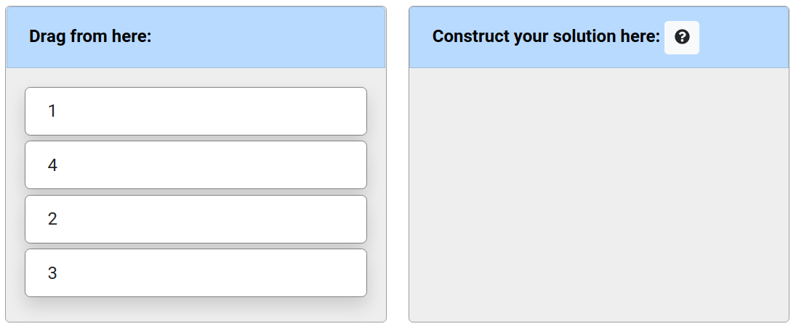
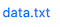

# PrairieLearn Elements for use in `question.html`

When writing questions, there exists a core pool of elements that provides
common structures associated with assessment items. These elements can be
split into three distinct groups: **submission**, **decorative**, and
**conditional**. Within this document, all of PrairieLearn's elements are
displayed alongside links to sample elements within the example course. To
build your own PrairieLearn element, please see [Question Element Writing](devElements.md)
documentation.

**Submission** elements act as a way to receive a response or input from the
student. These elements are traditionally referred to as form input fields.
PrairieLearn presently provides the following templated **input field** elements:

- [`pl-big-o-input`](#pl-big-o-input-element): Fill in a **symbolic** value
  representing asymptotic input.
- [`pl-checkbox`](#pl-checkbox-element): Selecting **multiple options** from a
  list.
- [`pl-excalidraw`](#pl-excalidraw-element): Draw a **vector diagram** using
  [excalidraw](https://github.com/excalidraw/excalidraw).
- [`pl-file-editor`](#pl-file-editor-element): Provide an in-browser code editor
  for writing and submitting code.
- [`pl-file-upload`](#pl-file-upload-element): Provide a submission area
  to obtain a file with a specific naming scheme.
- [`pl-image-capture`](#pl-image-capture-element): Capture images of handwritten work from a local camera or external device such as a phone or tablet.
- [`pl-integer-input`](#pl-integer-input-element): Fill in an **integer** value
  such as -71, 0, 5, 21, and so on.
- [`pl-matching`](#pl-matching-element): Select a matching option for each entry in
  a group.
- [`pl-matrix-component-input`](#pl-matrix-component-input-element): Fill in
  a **matrix** using grid that has an input area for each element.
- [`pl-matrix-input`](#pl-matrix-input-element): Supply a matrix in a supported
  programming language format.
- [`pl-multiple-choice`](#pl-multiple-choice-element): Selecting only
  **one option** from a list.
- [`pl-number-input`](#pl-number-input-element): Fill in a **numerical** value
  within a specific tolerance level such as 3.14, -1.921, and so on.
- [`pl-order-blocks`](#pl-order-blocks-element): Select and arrange given blocks of code or text.
- [`pl-rich-text-editor`](#pl-rich-text-editor-element): Provide an in-browser formattable text editor
  for writing and submitting code.
- [`pl-string-input`](#pl-string-input-element): Fill in a **string** value
  such as `"Illinois"`, `"GATTACA"`, `"computer"`, and so on.
- [`pl-symbolic-input`](#pl-symbolic-input-element): Fill in a **symbolic** value
  such as `x^2`, `sin(z)`, `mc^2`, and so on.
- [`pl-units-input`](#pl-units-input-element): Fill in a **number** and a **unit**
  such as "1.5 m", "14 ms", "6.3 ft", and so on.

**Decorative** elements are meant to improve how the question is displayed to
students. Elements under this category include ways to specify question markup,
images, files, and code display. The following **decorative** elements are available:

- [`pl-card`](#pl-card-element): Displays content within a card-styled component.
- [`pl-code`](#pl-code-element): Displays code rendered with the appropriate
  syntax highlighting.
- [`pl-dataframe`](#pl-dataframe-element): Display DataFrames with various options.
- [`pl-drawing`](#pl-drawing-element): Creates an image from pre-defined
  collection of graphic objects
- [`pl-external-grader-variables`](#pl-external-grader-variables-element): Displays expected and given variables for externally graded questions.
- [`pl-figure`](#pl-figure-element): Embed an image file in the question.
- [`pl-file-download`](#pl-file-download-element): Enable file downloads for
  data-centric questions.
- [`pl-file-preview`](#pl-file-preview-element): Displays a preview of submitted files.
- [`pl-graph`](#pl-graph-element): Displays graphs, using [GraphViz DOT notation](https://graphviz.org/doc/info/lang.html), an adjacency matrix, or a [`networkx`](https://networkx.org/) graph.
- [`pl-matrix-latex`](#pl-matrix-latex-element): Displays matrices using
  appropriate LaTeX commands for use in a mathematical expression.
- [`pl-overlay`](#pl-overlay-element): Allows layering existing elements on top of one another in specified positions.
- [`pl-python-variable`](#pl-python-variable-element): Display formatted output of Python variables.
- [`pl-variable-output`](#pl-variable-output-element): Displays matrices in
  code form for supported programming languages.
- [`pl-template`](#pl-template-element): Displays content from mustache templates.
- [`pl-xss-safe`](#pl-xss-safe-element): Removes potentially unsafe code from HTML code.

**Conditional** elements are meant to improve the feedback and question structure.
These elements conditionally render their content depending on the question state.
The following **Conditional** elements are available:

- [`pl-answer-panel`](#pl-answer-panel-element): Displays the correct
  answer to a given question.
- [`pl-external-grader-results`](#pl-external-grader-results-element):
  Displays results from questions that are externally graded.
- [`pl-hide-in-panel`](#pl-hide-in-panel-element): Hides content in one or more display panels.
- [`pl-hide-in-manual-grading`](#pl-hide-in-manual-grading-element): Hides content in the manual grading page.
- [`pl-hidden-hints`](#pl-hidden-hints-element): Displays hints as a student submits more on the current variant.
- [`pl-manual-grading-only`](#pl-manual-grading-only-element): Shows content only in manual grading.
- [`pl-question-panel`](#pl-question-panel-element): Displays the text of a
  question.
- [`pl-submission-panel`](#pl-submission-panel-element): Displays the answer
  given by the student.

Note: PrairieLearn Elements listed next have been
**deprecated**. These elements are still supported for backwards
compatibility, but they should not be used in new questions.

- [`pl-dropdown`](#pl-dropdown-element): Select an answer from answers in a drop-down box.
  - **Deprecated**: use [`pl-multiple-choice`](#pl-multiple-choice-element) with `display="dropdown"` for individual elements, or [`pl-matching`](#pl-matching-element) for multiple dropdowns with the same set of options.
- [`pl-prairiedraw-figure`](#pl-prairiedraw-figure-element): Show a PrairieDraw
  figure.
  - **Deprecated**: use [`pl-drawing`](#pl-drawing-element) instead.
- [`pl-threejs`](#pl-threejs-element): Enables 3D scene display and problem
  submission.
  - **Deprecated**: the features of required libraries are no longer maintained.
- [`pl-variable-score`](#pl-variable-score-element): Displays a partial score
  for a submitted element.
  - **Deprecated** as submission elements in `v3` all have score display options.

## Submission Elements

---

### `pl-big-o-input` element

Fill in the blank field that allows for asymptotic mathematical input (i.e. big O, big Theta, etc.).
Gives automated feedback in the case of improper asymptotic input.

```html title="question.html"
<pl-big-o-input answers-name="ans" variable="n" correct-answer="n**2" size="10"></pl-big-o-input>
```

#### Customizations

| Attribute        | Type                                                               | Default                   | Description                                                                                                                                                          |
| ---------------- | ------------------------------------------------------------------ | ------------------------- | -------------------------------------------------------------------------------------------------------------------------------------------------------------------- |
| `answers-name`   | string                                                             | —                         | Variable name to store data in. Note that this attribute has to be unique within a question, i.e., no value for this attribute should be repeated within a question. |
| `type`           | `"big-o"`, `"theta"`, `"omega"`, `"little-o"`, or `"little-omega"` | `"big-o"`                 | Type of asymptotic answer required.                                                                                                                                  |
| `weight`         | integer                                                            | 1                         | Weight to use when computing a weighted average score over elements.                                                                                                 |
| `correct-answer` | string                                                             | —                         | Correct answer for grading.                                                                                                                                          |
| `display`        | `"block"` or `"inline"`                                            | `"inline"`                | How to display the input field.                                                                                                                                      |
| `variable`       | string                                                             | —                         | A symbol for use in the symbolic expression. Only one variable supported.                                                                                            |
| `size`           | integer                                                            | 35                        | Size of the input box.                                                                                                                                               |
| `show-help-text` | boolean                                                            | true                      | Show the question mark at the end of the input displaying required input parameters.                                                                                 |
| `placeholder`    | string                                                             | `"asymptotic expression"` | Hint displayed inside the input box describing the expected type of input.                                                                                           |
| `show-score`     | boolean                                                            | true                      | Whether to show the score badge and feedback next to this element.                                                                                                   |
| `allow-blank`    | boolean                                                            | false                     | Whether an empty input box is allowed. By default, empty input boxes will not be graded (invalid format).                                                            |
| `blank-value`    | string                                                             | 1 (one)                   | Value to be used as an answer if element is left blank. Only applied if `allow-blank` is `true`.                                                                     |

#### Details

Correct answers must be specified as strings with Python syntax (e.g., `n**2`, `2**n`, `n * log(n)`), with
the same syntax as [`pl-symbolic-input`](#pl-symbolic-input-element). Only one variable is supported.

#### Example implementations

- [element/bigOInput]

#### See also

- [`pl-number-input` for numeric input](#pl-number-input-element)
- [`pl-integer-input` for integer input](#pl-integer-input-element)
- [`pl-string-input` for string input](#pl-string-input-element)
- [`pl-symbolic-input` for mathematical expression input](#pl-symbolic-input-element)

---

### `pl-checkbox` element

A `pl-checkbox` element displays a subset of the answers in a random order
as checkboxes.

#### Sample element


```html title="question.html"
<pl-checkbox answers-name="vpos" weight="1">
  <pl-answer correct="true">A-B</pl-answer>
  <pl-answer correct="true">B-C</pl-answer>
  <pl-answer> C-D</pl-answer>
  <pl-answer correct="true">D-E</pl-answer>
  <pl-answer> E-F</pl-answer>
  <pl-answer> F-G</pl-answer>
</pl-checkbox>
```

#### Customizations

| Attribute               | Type    | Default         | Description                                                                                                                                                                                                                          |
| ----------------------- | ------- | --------------- | ------------------------------------------------------------------------------------------------------------------------------------------------------------------------------------------------------------------------------------ |
| `answers-name`          | string  | —               | Variable name to store data in. Note that this attribute has to be unique within a question, i.e., no value for this attribute should be repeated within a question.                                                                 |
| `weight`                | integer | 1               | Weight to use when computing a weighted average score over elements.                                                                                                                                                                 |
| `inline`                | boolean | false           | List answer choices on a single line instead of as separate paragraphs.                                                                                                                                                              |
| `number-answers`        | integer | See description | The total number of answer choices to display. Defaults to displaying all answers.                                                                                                                                                   |
| `min-correct`           | integer | See description | The minimum number of correct answers to display. Defaults to displaying all correct answers.                                                                                                                                        |
| `max-correct`           | integer | See description | The maximum number of correct answers to display. Defaults to displaying all correct answers.                                                                                                                                        |
| `fixed-order`           | boolean | false           | Disable the randomization of answer order.                                                                                                                                                                                           |
| `partial-credit`        | boolean | false           | Enable partial credit scores. By default, the choice of grading method is "all-or-nothing".                                                                                                                                          |
| `partial-credit-method` | string  | `"PC"`          | Three grading methods for partial credit: `"COV"` (Coverage), `"EDC"` (Every Decision Counts), and `"PC"` (Percent Correct). See explanation below.                                                                                  |
| `hide-help-text`        | boolean | false           | Help text with hint regarding the selection of answers. Popover button describes the selected grading algorithm (`"all-or-nothing"`, `"COV"`, `"EDC"` or `"PC"`)                                                                     |
| `detailed-help-text`    | boolean | false           | Display the minimum and maximum number of options that can be selected in a valid submission. See explanation below.                                                                                                                 |
| `hide-answer-panel`     | boolean | false           | Option to not display the correct answer in the correct panel.                                                                                                                                                                       |
| `hide-letter-keys`      | boolean | false           | Hide the letter keys in the answer list, i.e., (a), (b), (c), etc.                                                                                                                                                                   |
| `hide-score-badge`      | boolean | false           | Hide badges next to selected answers.                                                                                                                                                                                                |
| `min-select`            | integer | See description | The minimum number of answers that must be selected in any valid submission. Defaults to `min-correct` if that attribute is specified along with `detailed-help-text="true"`; otherwise, defaults to 1.                              |
| `max-select`            | integer | See description | The maximum number of answers that can be selected in any valid submission. Defaults to `max-correct` if that attribute is specified along with `detailed-help-text="true"`; otherwise, defaults to the number of displayed answers. |
| `show-number-correct`   | boolean | false           | Display the number of correct choices in the help text.                                                                                                                                                                              |

Inside the `pl-checkbox` element, each choice must be specified with
a `pl-answer` that has attributes:

| Attribute  | Type    | Default | Description                                                                                                                                    |
| ---------- | ------- | ------- | ---------------------------------------------------------------------------------------------------------------------------------------------- |
| `correct`  | boolean | false   | Is this a correct answer to the question?                                                                                                      |
| `feedback` | string  | —       | Helper text (HTML) to be displayed to the student next to the option after question is graded if this option has been selected by the student. |

#### Partial credit grading

Three grading methods are available when using `partial-credit="true"`:

- `"COV"` (Coverage): in this method, the final score is calculated by multiplying the **base score** (the proportion of correct answers that are chosen) with
  the **guessing factor** (the proportion of chosen answers that are correct). Specifically, if `t` is the number of correct answers chosen, `c` is the total number
  of correct answers, and `n` is the total number of answers chosen, then the final score is `(t / c) * (t / n)`. This grading scheme rewards submissions that include (i.e. "cover") all true options.

- `"EDC"` (Every Decision Counts): in this method, the checkbox answers are considered as a list of true/false answers. If `n` is the total number of answers, each answer is assigned `1/n` points. The total score is the summation of the points for every correct answer selected and every incorrect answer left unselected.

- `"PC"` (Percent Correct): in this method, 1 point is added for each correct answer that is marked as correct and 1 point is subtracted for each incorrect answer that is marked as correct. The final score is the resulting summation of points divided by the total number of correct answers. The minimum final score is set to zero.

#### Using the `detailed-help-text` attribute

The `detailed-help-text` attribute can be used with `min-correct` and/or `max-correct` to help students select the correct options. If `min-select` is not specified, then setting `detailed-help-text="true"` ensures that the number of selected options in a valid submission is at least the value of `min-correct`. Similarly, if `max-select` is not specified, then setting `detailed-help-text="true"` ensures that the number of selected options in a valid submission is at most the value of `max-correct`. For example, if a checkbox question does not specify `min-select` or `max-select`, and specifies `min-correct="2"`, `max-correct="4"`, and `detailed-help-text="true"`, then all valid submissions must select between 2 and 4 options. Thus, we help students by preventing them from selecting, say, five options. Indeed, if five options are selected, then at least one selected option is incorrect since there are at most four correct options.

Note that explicitly specifying `min-select` overrides the minimum number of options that must be selected, and similarly, explicitly specifying `max-select` overrides the maximum number of options that can be selected.

#### Restricting the number of options that can be selected

The `min-select` and `max-select` attributes determine the minimum and maximum number of options that can be selected in a valid submission. The value of `min-select` is computed using the following steps:

1. If the `min-select` attribute is explicitly set, then we use the specified value of `min-select`.
2. If `min-select` is not specified, but `min-correct` is specified along with `detailed-help-text="true"`, then we use the specified value of `min-correct`.
3. If steps 1 and 2 do not apply, then we use a default value of 1.

To compute `max-select`, we use a similar algorithm (note the different default value in step 3):

1. If the `max-select` attribute is explicitly set, then we use the specified value of `max-select`.
2. If `max-select` is not specified, but `max-correct` is specified along with `detailed-help-text="true"`, then we use the specified value of `min-correct`.
3. If steps 1 and 2 do not apply, then `max-select` defaults to the number of displayed checkbox options (i.e. students can select all displayed options by default).

#### Example implementations

- [element/checkbox]
- [demo/randomCheckbox]

#### See also

- [`pl-multiple-choice` for allowing only **one** correct choice](#pl-multiple-choice-element)

---

### `pl-excalidraw` element

Draw a vector diagram using [excalidraw](https://github.com/excalidraw/excalidraw). Only manual grading is supported.


```html title="question.html"
<p>Draw something else, with a starter diagram</p>

<pl-excalidraw
  gradable="true"
  answers-name="vector"
  source-file-name="starter.excalidraw"
  directory="clientFilesQuestion"
  width="100%"
  height="600px"
></pl-excalidraw>
```

#### Customizations

| Attribute          | Type                                                                                                 | Default   | Description                                                                                                             |
| ------------------ | ---------------------------------------------------------------------------------------------------- | --------- | ----------------------------------------------------------------------------------------------------------------------- |
| `gradable`         | boolean                                                                                              | "true"    | Whether a diagram accepts input from the user.                                                                          |
| `answers-name`     | string                                                                                               | —         | Unique name to identify the widget with. Drawing submissions are saved with this name. Required when `gradable` is set. |
| `source-file-name` | string                                                                                               | —         | Optional file to load as the starter diagram.                                                                           |
| `directory`        | `"serverFilesCourse"`, `"clientFilesCourse"`, `"clientFilesQuestion"`, `"courseExtensions"` or `"."` | `"."`     | Directory where the `"source-file-name"` is loaded from. By default, it refers to the question directory `"."`.         |
| `width`            | string                                                                                               | `"100%"`  | Width of the widget, compatible with the [CSS width][css-width-mdn] specification.                                      |
| `height`           | string                                                                                               | `"800px"` | Height of the widget, compatible with the [CSS width][css-width-mdn] specification.                                     |

[css-width-mdn]: https://developer.mozilla.org/en-US/docs/Web/CSS/width

#### Example implementation

[element/excalidraw]

---

### `pl-file-editor` element

Provides an in-browser file editor that's compatible with the other file elements
and external grading system.

#### Sample element


<!-- prettier-ignore -->
```html title="question.html"
<pl-file-editor
  file-name="fib.py"
  ace-mode="ace/mode/python"
  ace-theme="ace/theme/monokai"
>
def fib(n):
    pass
</pl-file-editor>
```

#### Customizations

| Attribute            | Type    | Default              | description                                                                                                                                                                                                                                                                                                                                                                                                                                               |
| -------------------- | ------- | -------------------- | --------------------------------------------------------------------------------------------------------------------------------------------------------------------------------------------------------------------------------------------------------------------------------------------------------------------------------------------------------------------------------------------------------------------------------------------------------- |
| `file-name`          | string  | —                    | The name of this file; will be used to store this file in the `"_files"` submitted answer                                                                                                                                                                                                                                                                                                                                                                 |
| `ace-mode`           | string  | —                    | Specifies an Ace editor mode to enable things like intelligent code indenting and syntax highlighting; see the full list of modes in the [Ace GitHub repository](https://github.com/ajaxorg/ace/tree/master/src/mode).                                                                                                                                                                                                                                    |
| `ace-theme`          | string  | `"ace/theme/chrome"` | Specifies an Ace editor theme; see the full list of themes in the [Ace GitHub repository](https://github.com/ajaxorg/ace/tree/master/src/theme).                                                                                                                                                                                                                                                                                                          |
| `font-size`          | string  | `"12px"`             | Sets the font size for the Ace editor. Specified as a CSS-style size (e.g., `"1rem"`, `"110%"`, `"16pt"`, or `"20px"`).                                                                                                                                                                                                                                                                                                                                   |
| `source-file-name`   | string  | —                    | Name of the source file with existing code to be displayed in the browser text editor (instead of writing the existing code between the element tags as illustrated in the above code snippet).                                                                                                                                                                                                                                                           |
| `directory`          | string  | See description      | Directory where the source file with existing code is to be found. Only useful if `source-file-name` is used. If it contains one of the special names `"clientFilesCourse"` or `"serverFilesCourse"`, then the source file name is read from the course's special directories, otherwise the directory is expected to be in the question's own directory. If not provided, the source file name is expected to be found in the question's main directory. |
| `min-lines`          | integer | —                    | Minimum number of lines the editor should show initially.                                                                                                                                                                                                                                                                                                                                                                                                 |
| `max-lines`          | integer | —                    | Maximum number of lines the editor should display at once. Must be greater than `min-lines`.                                                                                                                                                                                                                                                                                                                                                              |
| `auto-resize`        | boolean | true                 | Automatically expand the editor panel to ensure all lines are present. Overrides any value set by `"max-lines"` and establishes a default of 18 lines for `"min-lines"` if not supplied. See Details below for notes.                                                                                                                                                                                                                                     |
| `preview`            | string  | —                    | If set, provides a live preview mode for editing markup languages. Currently, `"html"`, `"markdown"`, or `"dot"` are available, though additional languages are supported via extensions (see below).                                                                                                                                                                                                                                                     |
| `focus`              | boolean | false                | Specifies that the editor should begin with the cursor captured and the editing pane focused. See Details below for notes.                                                                                                                                                                                                                                                                                                                                |
| `normalize-to-ascii` | boolean | false                | Whether non-English characters (accents, non-latin alphabets, fancy quotes) should be normalized to equivalent English characters before submitting the file for grading.                                                                                                                                                                                                                                                                                 |
| `allow-blank`        | boolean | false                | Whether an empty submission is allowed.                                                                                                                                                                                                                                                                                                                                                                                                                   |

#### Details

When using `auto-resize`, consider specifying a custom `min-lines` or pre-populating the code editor window with a code sample.
This will initialize the editor area with a sufficient number of lines to display all the code simultaneously without the need for scrolling.

The `focus` attribute defaults to `false`. Setting this to true will cause the file editor element to automatically capture the cursor focus when the question page is loaded, which may also cause the page to scroll down so that the file editor is in view, bypassing any written introduction. This may have negative implications for accessibility with screen readers, so use caution. If you have multiple file editors on the same question page, only one element should have `focus` set to true, or else the behavior may be unpredictable.

This element supports additional preview options through [element extensions](elementExtensions.md). To provide this functionality, the extension must assign, to `window.PLFileEditor.prototype.preview.PREVIEW_TYPE` (where `PREVIEW_TYPE` is the value of the `preview` attribute), a function that converts a string representing the editor's content into suitable HTML content.

The contents of the file editor are only displayed by default in the question panel. If the contents are expected to be listed in the submission panel, they should be explicitly added using other elements such as [`pl-file-preview`](#pl-file-preview-element) or [`pl-xss-safe`](#pl-xss-safe-element).

#### Example implementations

- [element/fileEditor]
- [demo/autograder/codeEditor]

#### See also

- [`pl-file-upload` to receive files as a submission](#pl-file-upload-element)
- [`pl-file-preview` to display previously submitted files](#pl-file-preview-element)
- [`pl-external-grader-results` to include output from autograded code](#pl-external-grader-results-element)
- [`pl-code` to display blocks of code with syntax highlighting](#pl-code-element)
- [`pl-string-input` for receiving a single string value](#pl-string-input-element)

---

### `pl-file-upload` element

Provides a way to accept file uploads as part of an answer. They will be stored
in the format expected by externally graded questions.

!!! note

    There is a file size limit of **5 MB per answer**. This limit is not customizable as larger
    requests will be rejected by the server. For the same reason, it is also not possible to bypass the
    limit by using multiple `pl-file-upload` elements in the same question. To avoid unexpected errors or
    potentially misleading error messages for large file uploads, we recommend not using more than one
    `pl-file-upload` element per question.

#### Sample element


```html title="question.html"
<pl-file-upload file-names="foo.py, bar.c, filename with\, comma.txt"></pl-file-upload>
```

#### Customizations

| Attribute                | Type     | Default | description                                                                                                                                                                                                                                                   |
| ------------------------ | -------- | ------- | ------------------------------------------------------------------------------------------------------------------------------------------------------------------------------------------------------------------------------------------------------------- |
| `file-names`             | CSV list | ""      | List of files that must be submitted. Commas in a filename should be escaped with a backslash, and filenames cannot contain quotes.                                                                                                                           |
| `optional-file-names`    | CSV list | ""      | List of files that can be submitted, but are optional. Commas should be escaped with a backslash, and filenames cannot contain quotes.                                                                                                                        |
| `file-patterns`          | CSV list | ""      | List of file name patterns (see below) that must be submitted. For each pattern, exactly one matching file must be uploaded. Commas and special pattern character should be escaped with a backslash, and filenames cannot contain quotes.                    |
| `optional-file-patterns` | CSV list | ""      | List of file name patterns (see below) that can be submitted, but are optional. For each pattern, any number of matching files can be uploaded. Commas and special pattern character should be escaped with a backslash, and filenames cannot contain quotes. |

#### Supported wildcard patterns

The `file-patterns` and `optional-file-patterns` attributes support a number of wildcards to allow a range of file names:

- The `?` placeholder allows a single wildcard character. For example, `solution?.txt` allows
  files like "solution1.txt", "solution2.txt", and so on, but not "solution10.txt".
- The `*` placeholder allows an arbitrary number of wildcard characters. For example, `*.txt`
  allows files like "solution.txt", "my_file.txt", and also ".txt".
- The `[seq]` placeholder allows a single character from the set of options listed inside the square
  brackets. For example, `file_[abc].txt` allows "file_a.txt", "file_b.txt" and "file_c.txt", but not
  "file_x.txt".
- The `[seq]` placeholder also supports ranges like "a-z" or "0-9". For example, `file[0-9].txt`
  allows "file5.txt", but not "filex.txt". Ranges can also be combined. For example,`file[0-9a-z].txt` allows a single alphanumeric
  character and therefore both "file5.txt" and "filex.txt".

!!! note

    `file-patterns` and `optional-file-patterns` accepts [fnmatch](https://docs.python.org/3/library/fnmatch.html) file globs, not regular expressions. Brace expansion (`{foo,bar}.txt`) is not currently supported.

| File pattern       | Allowed :white_check_mark:                        | Disallowed :x:                   |
| ------------------ | ------------------------------------------------- | -------------------------------- |
| `solution?.txt`    | `solution1.txt`, `solution2.txt`, `solutionA.txt` | `solution10.txt`, `solution.txt` |
| `*.txt`            | `solution.txt`, `my_file.txt`, `.txt`             | `solution.py`, `my_file`         |
| `file_[abc].txt`   | `file_a.txt`, `file_b.txt`, `file_c.txt`          | `file_x.txt`, `file_ab.txt`      |
| `file[0-9].txt`    | `file5.txt`, `file0.txt`, `file9.txt`             | `filex.txt`, `file10.txt`        |
| `file[0-9a-z].txt` | `file5.txt`, `filex.txt`, `file0.txt`             | `fileX.txt`, `file10.txt`        |
| `[!_]*.py`         | `solution.py`, `my_file.py`                       | `_foo.py`, `file.txt`            |

If file names or patterns overlap, uploaded files are first used to fill the required file names in `file-names`. Next, files that match a required pattern in `file-patterns` are used to fill that pattern. Any remaining uploaded files are accepted if they match either a name in `optional-file-names` or a pattern in `optional-file-patterns`.

Required files (`file-names` or `file-patterns`) and optional files (`optional-file-names` or `optional-file-patterns`) are handled identically, so if you need to distinguish between the two sets, you should ensure that the patterns don't overlap.

!!! tip

    The same required pattern in `file-patterns` can be repeated, for example `*.py,*.py` means that exactly two Python files must be uploaded. However, different required patterns should not overlap (e.g. `*.py,solution.*`) because files are assigned to a matching pattern arbitrarily, and this can lead to unintended behavior.

#### Details

The `pl-file-upload` element and the contents of the uploaded file(s) are only displayed by default in the question panel. If the contents are expected to be listed in the submission panel, they should be explicitly added using other elements such as [`pl-file-preview`](#pl-file-preview-element) or [`pl-xss-safe`](#pl-xss-safe-element).

#### Example implementations

- [demo/autograder/codeUpload]
- [demo/manualGrade/codeUpload]

#### See also

- [`pl-file-editor` to provide an in-browser code environment](#pl-file-editor-element)
- [`pl-external-grader-results` to include output from autograded code](#pl-external-grader-results-element)
- [`pl-code` to display blocks of code with syntax highlighting](#pl-code-element)
- [`pl-string-input` for receiving a single string value](#pl-string-input-element)

---

### `pl-image-capture` element

Provides a way for students to capture and submit an image as part of their answer using a local camera like a webcam or an external device such as a mobile phone or tablet camera.

#### Sample element


```html title="question.html"
<pl-image-capture file-name="solution.jpeg" mobile-capture-enabled="true"></pl-image-capture>
```

#### Customizations

| Attribute                | Type    | Default | description                                                                                                                                                                                                               |
| ------------------------ | ------- | ------- | ------------------------------------------------------------------------------------------------------------------------------------------------------------------------------------------------------------------------- |
| `file-name`              | string  | —       | The name under which the captured image will be saved. This must end with `.jpeg` or `.jpg`, and be unique within a single question.                                                                                      |
| `mobile-capture-enabled` | boolean | true    | When `true`, students can click "Capture with mobile device" to scan a QR code on a phone or tablet to a page where they can capture an image of their work. In most cases, this `mobile-capture-enabled` should be true. |

#### Details

The `pl-image-capture` element is particularly useful for capturing handwritten work on paper, such as sketches or step-by-step calculations.

`pl-image-capture` allows users to submit images through their camera, whether it’s a local device like a webcam or an external device such as a mobile phone or tablet camera. Users can only submit by capturing a new image with their camera; they cannot upload existing images from their device, and `pl-image-capture` does not save images to their device.

A single question page can contain multiple `pl-image-capture` elements, each operating independently and saving files under its specified `file-name`.

In manual grading mode, staff can view submitted images in the submission panel and, if added, through the [`pl-file-preview`](#pl-file-preview-element) element, where submitted images will appear under their associated `file-name`.

By default, the `mobile-capture-enabled` setting is `true`. We strongly recommend keeping mobile capture enabled for most questions to allow students to capture high-quality images easily.

Using mobile device capture in a local development environment requires additional setup. To use this feature locally, see the [Setting up external image capture locally](./dev-guide/configJson.md#setting-up-external-image-capture-locally) section of the server configuration guide.

#### Example implementations

- [element/imageCapture]

#### See also

- [`pl-file-preview` to display previously submitted files](#pl-file-preview-element)

---

### `pl-integer-input` element

Fill in the blank field that requires an **integer** input.

#### Sample element


```html title="question.html"
<pl-integer-input answers-name="int_value" label="$y =$"></pl-integer-input>
```

```python title="server.py"
import random

def generate(data):

    # Generate a random whole number
    x = random.randint(1, 10)

    # Answer to fill in the blank input
    data["correct_answers"]["int_value"] = x
```

#### Customizations

| Attribute        | Type                    | Default         | Description                                                                                                                                                          |
| ---------------- | ----------------------- | --------------- | -------------------------------------------------------------------------------------------------------------------------------------------------------------------- |
| `answers-name`   | string                  | —               | Variable name to store data in. Note that this attribute has to be unique within a question, i.e., no value for this attribute should be repeated within a question. |
| `weight`         | integer                 | 1               | Weight to use when computing a weighted average score over elements.                                                                                                 |
| `correct-answer` | string                  | See description | Correct answer for grading. Defaults to `data["correct_answers"][answers-name]`. If `base` is provided, then this answer must be given in the provided base.         |
| `allow-blank`    | boolean                 | false           | Whether an empty input box is allowed. By default, empty input boxes will not be graded (invalid format).                                                            |
| `blank-value`    | integer                 | 0 (zero)        | Value to be used as an answer if element is left blank. Only applied if `allow-blank` is `true`.                                                                     |
| `label`          | string                  | —               | A prefix to display before the input box (e.g., `label="$x =$"`).                                                                                                    |
| `aria-label`     | string                  | —               | An accessible label for the element.                                                                                                                                 |
| `suffix`         | string                  | —               | A suffix to display after the input box (e.g., `suffix="items"`).                                                                                                    |
| `base`           | integer                 | 10              | The base used to parse and represent the answer, or the special value 0 (see below).                                                                                 |
| `display`        | `"block"` or `"inline"` | `"inline"`      | How to display the input field.                                                                                                                                      |
| `size`           | integer                 | 35              | Size of the input box.                                                                                                                                               |
| `show-help-text` | boolean                 | true            | Show the question mark at the end of the input displaying required input parameters.                                                                                 |
| `placeholder`    | string                  | See description | Custom placeholder text. If not set, defaults to `"integer"` if `base` is 10, otherwise `"integer in base <base>"`.                                                  |
| `show-score`     | boolean                 | true            | Whether to show the score badge next to this element.                                                                                                                |

#### Specifying a non-trivial base

By default, the values are interpreted in base 10. The `base` argument may also be used, with a value between 2 and 36, to indicate a different base to interpret the student input, as well as to print the final result.

The `base` argument can also accept a special value of 0. In this case, the values will by default be interpreted in base 10, however the student has the option of using different prefixes to indicate a value in a different format:

- The prefixes `0x` and `0X` can be used for base-16 values (e.g., `0x1a`);
- The prefixes `0b` and `0B` can be used for base-2 values (e.g., `0b1101`);
- The prefixes `0o` and `0O` can be used for base-8 values (e.g., `0o777`).

#### Integer range

pl-integer-input can accept integers of unbounded size, however the correct answer will only be stored as the Python `int` if it is between -9007199254740991 and +9007199254740991 (between -(2^53 - 1) and +(2^53 - 1)). Otherwise, the correct answer will be stored as a string. This distinction is important in `server.py` scripts for `parse()` and `grade()`, as well as downloaded assessment results.

Note that answers can include underscores which are ignored (i.e., `1_000` will be parsed as `1000`).

#### Example implementations

- [element/integerInput]

#### See also

- [`pl-number-input` for numeric input](#pl-number-input-element)
- [`pl-symbolic-input` for mathematical expression input](#pl-symbolic-input-element)
- [`pl-string-input` for string input](#pl-string-input-element)

---

### `pl-matching` element

Given a list of statements, select a matching option for each entry from a dropdown list.

#### Sample element


```html title="question.html"
<pl-matching answers-name="string_value">
  <pl-statement match="Washington, D.C.">United States</pl-statement>
  <pl-statement match="Mexico City">Mexico</pl-statement>
  <pl-statement match="Paris">France</pl-statement>

  <pl-option>New York City</pl-option>
</pl-matching>
```

#### Customizations

| Attribute             | Type                                                           | Default         | Description                                                                                                                                                                                                              |
| --------------------- | -------------------------------------------------------------- | --------------- | ------------------------------------------------------------------------------------------------------------------------------------------------------------------------------------------------------------------------ |
| `answers-name`        | string                                                         | —               | Variable name to store data in. Note that this attribute has to be unique within a question, i.e., no value for this attribute should be repeated within a question.                                                     |
| `weight`              | integer                                                        | 1               | Weight to use when computing a weighted average score over elements.                                                                                                                                                     |
| `fixed-order`         | boolean                                                        | false           | Whether to display the statements in a fixed order; otherwise they are shuffled.                                                                                                                                         |
| `fixed-options-order` | boolean                                                        | false           | Whether to display the options in a fixed order; otherwise they are shuffled. See the details of `pl-option` below for more information on option ordering.                                                              |
| `number-statements`   | integer                                                        | See description | The number of statements to display. Defaults to all statements.                                                                                                                                                         |
| `number-options`      | integer                                                        | See description | The number of options to display. Defaults to all options. The `none-of-the-above` option does not count towards this number.                                                                                            |
| `none-of-the-above`   | boolean                                                        | false           | Whether to add a "None of the above" to the end of the options.                                                                                                                                                          |
| `blank`               | boolean                                                        | true            | Option to add blank dropdown entry as the default selection in each dropdown list.                                                                                                                                       |
| `allow-blank`         | boolean                                                        | false           | Whether a blank submission is allowed. If this is set to true, a statement that selects the blank entry will be marked as incorrect instead of invalid.                                                                  |
| `counter-type`        | `"decimal"`, `"lower-alpha"`, `"upper-alpha"` or `"full-text"` | `"lower-alpha"` | The type of counter to use when enumerating the options. If set to `"full-text"`, the column of options will be hidden, and the text of each option will be used in the statements' dropdown lists, instead of counters. |
| `hide-score-badge`    | boolean                                                        | false           | Whether to hide the correct/incorrect score badge next to each graded answer choice.                                                                                                                                     |
| `options-placement`   | `"right"` or `"bottom"`                                        | `"right"`       | The placement of options relative to the statements in order to make it visually cohesive. Especially useful when dealing with long statements or options.                                                               |

Inside the `pl-matching` element, a series of `pl-statement` and `pl-option` elements specify the questions the student must answer and the options to which they can be matched, respectively. Statements are displayed in the left column, and options in the right.

A total of `number-statements` statements will be randomly selected and displayed to the student. The corresponding matching options will be gathered; if `number-options` is larger than the number of options used by the selected statements, then random distractors will be selected from the remaining unused options. If the selected statements require more options than `number-options`, then `none-of-the-above` will automatically be set to true.

The content of a `pl-statement` can be any HTML element, including other PrairieLearn elements. A `pl-statement` must be specified with these attributes:

| Attribute | Type   | Default | Description                                                                                                                                                                                                                                                         |
| --------- | ------ | ------- | ------------------------------------------------------------------------------------------------------------------------------------------------------------------------------------------------------------------------------------------------------------------- |
| `match`   | string | —       | Identifies the option as the correct response for this `pl-statement`. If `match` corresponds to the `name` of any `pl-option` element, the statement will be linked to that `pl-option`, otherwise a new option is implicitly created based on this `match` value. |

The content of a `pl-option` can be any HTML element, including other PrairieLearn elements. `pl-option` elements are optional; options are created by default based on the `match` attribute of each `pl-statement`. Additional `pl-option` elements can be added to serve as distractors (an option that is always incorrect, such as "New York City" in the example above), or to render formatted HTML/PrairieLearn elements instead of plain text (see the last question in the demo problem linked in the "Example implementations" below).

When the `fixed-options-order` feature is used, options are shown in the following order:

1. Any explicitly-defined `pl-option` elements are shown first, in the order they are declared.
2. Any implicitly-defined options defined by a `pl-statement` `match` attribute are shown next, in the order they are declared.

It is recommended to explicitly define `pl-option` elements when using `fixed-options-order` to have complete certainty on the order they will be shown.

A `pl-option` must be specified with these attributes:

| Attribute | Type   | Default         | Description                                                                                                                 |
| --------- | ------ | --------------- | --------------------------------------------------------------------------------------------------------------------------- |
| `name`    | string | See description | A key used to match this option as the correct response to a `pl-statement`. Defaults to the inner HTML of the `pl-option`. |

#### Example implementations

- [element/matching]

---

### `pl-matrix-component-input` element

A `pl-matrix-component-input` element displays a grid of input fields with
the same shape of the variable stored in `answers-name`
(only 2D arrays of real numbers can be stored in `answers-name`).

#### Sample element


```html title="question.html"
<pl-matrix-component-input answers-name="matrixA" label="$A=$"></pl-matrix-component-input>
```

```python title="server.py"
import prairielearn as pl
import numpy as np

def generate(data):

    # Generate a random 3x3 matrix
    mat = np.random.random((3, 3))

    # Answer to each matrix entry converted to JSON
    data["correct_answers"]["matrixA"] = pl.to_json(mat)
```

#### Customizations

| Attribute              | Type                                  | Default                  | Description                                                                                                                                                                                                                    |
| ---------------------- | ------------------------------------- | ------------------------ | ------------------------------------------------------------------------------------------------------------------------------------------------------------------------------------------------------------------------------ |
| `answers-name`         | string                                | —                        | Variable name to store data in. Note that this attribute has to be unique within a question, i.e., no value for this attribute should be repeated within a question.                                                           |
| `weight`               | integer                               | 1                        | Weight to use when computing a weighted average score over elements.                                                                                                                                                           |
| `label`                | string                                | —                        | A prefix to display before the input box (e.g., `label="$F =$"`).                                                                                                                                                              |
| `aria-label`           | string                                | —                        | An accessible label for the element.                                                                                                                                                                                           |
| `comparison`           | `"relabs"`, `"sigfig"`, or `"decdig"` | `"relabs"`               | How to grade. `"relabs"` uses relative (`rtol`) and absolute (`atol`) tolerances. `"sigfig"` and `"decdig"` use `digits` significant or decimal digits.                                                                        |
| `rtol`                 | number                                | 1e-2                     | Relative tolerance for `comparison="relabs"`.                                                                                                                                                                                  |
| `atol`                 | number                                | 1e-8                     | Absolute tolerance for `comparison="relabs"`.                                                                                                                                                                                  |
| `digits`               | integer                               | 2                        | number of digits that must be correct for `comparison="sigfig"` or `comparison="decdig"`.                                                                                                                                      |
| `allow-partial-credit` | boolean                               | false                    | Whether to allow credit for each correct matrix component. By default, the variable is graded as correct only when all matrix components are correct.                                                                          |
| `allow-feedback`       | boolean                               | `"allow-partial-credit"` | Whether to allow feedback indicating which matrix components are incorrect. The default value of `allow-feedback` is the value of `"allow-partial-credit"`.                                                                    |
| `allow-fractions`      | boolean                               | true                     | Whether to allow answers expressed as a rational number of the format `a/b`.                                                                                                                                                   |
| `allow-blank`          | boolean                               | false                    | Whether empty input boxes are allowed. By default, matrices with at least one empty input box will not be graded (invalid format).                                                                                             |
| `blank-value`          | string                                | 0 (zero)                 | Value to be used as an answer for each individual component if the component is left blank. Only applied if `allow-blank` is `true`. Must follow the same format as an expected user input (e.g., fractions if allowed, etc.). |

#### Details

The question will only be graded when all matrix components are entered, unless the `allow-blank` attribute is enabled.

#### Example implementations

- [element/matrixComponentInput]

#### See also

- [`pl-matrix-input` for a matrix formatted in an implemented programming language](#pl-matrix-input-element)
- [`pl-number-input` for a single numeric input](#pl-number-input-element)
- [`pl-symbolic-input` for a mathematical expression input](#pl-symbolic-input-element)

---

### `pl-matrix-input` element

A `pl-matrix-input` element displays an input field that accepts a matrix
(i.e., a 2-D array) expressed in a supported programming language
format (either MATLAB or Python's numpy).

#### Sample element


```html title="question.html"
<pl-matrix-input answers-name="matrixB" label="$B=$"></pl-matrix-input>
```

```python title="server.py"
import prairielearn as pl
import numpy as np

def generate(data):
    # Randomly generate a 2x2 matrix
    matrixB = np.random.random((2, 2))

    # Answer exported to question.
    data["correct_answers"]["matrixB"] = pl.to_json(matrixB)
```

#### Customizations

| Attribute        | Type                                  | Default    | Description                                                                                                                                                          |
| ---------------- | ------------------------------------- | ---------- | -------------------------------------------------------------------------------------------------------------------------------------------------------------------- |
| `answers-name`   | string                                | —          | Variable name to store data in. Note that this attribute has to be unique within a question, i.e., no value for this attribute should be repeated within a question. |
| `weight`         | integer                               | 1          | Weight to use when computing a weighted average score over elements.                                                                                                 |
| `label`          | string                                | —          | A prefix to display before the input box (e.g., `label="$F =$"`).                                                                                                    |
| `aria-label`     | string                                | —          | An accessible label for the element.                                                                                                                                 |
| `comparison`     | `"relabs"`, `"sigfig"`, or `"decdig"` | `"relabs"` | How to grade. `"relabs"` uses relative (`rtol`) and absolute (`atol`) tolerances. `"sigfig"` and `"decdig"` use `digits` significant or decimal digits.              |
| `rtol`           | number                                | 1e-2       | Relative tolerance for `comparison="relabs"`.                                                                                                                        |
| `atol`           | number                                | 1e-8       | Absolute tolerance for `comparison="relabs"`.                                                                                                                        |
| `digits`         | integer                               | 2          | number of digits that must be correct for `comparison="sigfig"` or `comparison="decdig"`.                                                                            |
| `allow-complex`  | boolean                               | false      | Whether to allow complex numbers as answers.                                                                                                                         |
| `show-help-text` | boolean                               | true       | Show the question mark at the end of the input displaying required input parameters.                                                                                 |

#### Details

`pl-matrix-input` parses a matrix entered in `MATLAB` or `Python` format.
The following are valid input format options:

**MATLAB format:**

```m
[1.23; 4.56]
```

**Python format:**

```python
[[1.23], [4.56]]
```

**Note:** A scalar will be accepted either as a matrix of size 1 x 1 (e.g., `[1.23]` or `[[1.23]]`) or just as a single number (e.g., `1.23`).

In the answer panel, a `pl-matrix-input` element displays the correct answer, allowing the user to switch between matlab and python format.

In the submission panel, a `pl-matrix-input` element displays either the submitted answer (in the same format that it was submitted, either MATLAB or Python), or a note that the submitted answer was invalid (with an explanation of why).

#### Example implementations

- [demo/matrixComplexAlgebra]

#### See also

- [`pl-matrix-component-input` for individual input boxes for each element in the matrix](#pl-matrix-component-input-element)
- [`pl-number-input` for a single numeric input](#pl-number-input-element)
- [`pl-symbolic-input` for a mathematical expression input](#pl-symbolic-input-element)

---

### `pl-multiple-choice` element

A `pl-multiple-choice` element selects **one** correct answer and zero or more
incorrect answers and displays them in a random order as radio buttons.
Duplicate answer choices (string equivalents) are not permitted in the
`pl-multiple-choice` element, and an exception will be raised upon question
generation if two (or more) choices are identical.

#### Sample element


```html title="question.html"
<pl-multiple-choice answers-name="acc" weight="1">
  <pl-answer correct="false">positive</pl-answer>
  <pl-answer correct="true">negative</pl-answer>
  <pl-answer correct="false">zero</pl-answer>
</pl-multiple-choice>
```

#### Customizations

| Attribute                    | Type                                                 | Default                     | Description                                                                                                                                                                                |
| ---------------------------- | ---------------------------------------------------- | --------------------------- | ------------------------------------------------------------------------------------------------------------------------------------------------------------------------------------------ |
| `answers-name`               | string                                               | —                           | Variable name to store data in. Note that this attribute has to be unique within a question, i.e., no value for this attribute should be repeated within a question.                       |
| `weight`                     | integer                                              | 1                           | Weight to use when computing a weighted average score over elements.                                                                                                                       |
| `display`                    | `"block"`, `"inline"`, or `"dropdown"`               | `"block"`                   | Display option for the input field. Block and inline display answer choices as radio buttons, while dropdown presents option as a dropdown.                                                |
| `number-answers`             | integer                                              | See description             | The total number of answer choices to display. Defaults to displaying one correct answer and all incorrect answers.                                                                        |
| `order`                      | `"random"`, `"ascend"`, `"descend"`, or `"fixed"`    | `"random"`                  | Order to display answer choices. Fixed order displays choices in the same order as the original source file.                                                                               |
| `hide-letter-keys`           | boolean                                              | false                       | Hide the letter keys in the answer list, i.e., (a), (b), (c), etc.                                                                                                                         |
| `all-of-the-above`           | `"false"`, `"random"`, `"correct"`, or `"incorrect"` | `"false"`                   | Add `"All of the above"` choice. See below for details.                                                                                                                                    |
| `none-of-the-above`          | `"false"`, `"random"`, `"correct"`, or `"incorrect"` | `"false"`                   | Add `"None of the above"` choice. See below for details.                                                                                                                                   |
| `all-of-the-above-feedback`  | string                                               | —                           | Helper text to be displayed to the student next to the `all-of-the-above` option after question is graded if this option has been selected by the student.                                 |
| `none-of-the-above-feedback` | string                                               | —                           | Helper text to be displayed to the student next to the `none-of-the-above` option after question is graded if this option has been selected by the student.                                |
| `allow-blank`                | boolean                                              | false                       | Whether an empty submission is allowed. If `allow-blank` is set to `true`, a submission that does not select any option will be marked as incorrect instead of invalid.                    |
| `size`                       | integer                                              | —                           | Manually set the size of the dropdown to a fixed width. The default behavior is to make the dropdown as wide as the widest option. Should only be used with `display` set to `"dropdown"`. |
| `placeholder`                | string                                               | `"Select an option"`        | String to be used as the placeholder text when `display` is set to `"dropdown"`. Will also accept an empty string as `placeholder=""`.                                                     |
| `aria-label`                 | string                                               | `"Multiple choice options"` | An accessible label for the element.                                                                                                                                                       |

The attributes `none-of-the-above` and `all-of-the-above` can be set to one of these values:

- `"false"`: the corresponding choice will not be shown in the list of choices. This is the default.
- `"random"`: the corresponding choice will always be shown, and will be randomly correct, with probability proportional to the total number of correct choices. In other words, if there are `N` possible correct choices in total, this choice will be correct with probability `1/N`.
- `"correct"`: the corresponding choice will always be shown and will always be the correct answer.
- `"incorrect"`: the corresponding choice will always be shown and will always be an incorrect answer (i.e., a distractor).

##### :pencil: Notes

- "All of the above" and "None of the above", if set, are bounded by the `number-answers` value above. Also, these two values are always shown as the last choices, regardless of the setting for `fixed-order`. If both choices are shown, then "All of the above" will be listed before "None of the above".
- Defining answer choices with external JSON files via the `external-json` attribute is now deprecated.

Inside the `pl-multiple-choice` element, each choice must be specified with
a `pl-answer` that has attributes:

| Attribute  | Type    | Default         | Description                                                                                                                                    |
| ---------- | ------- | --------------- | ---------------------------------------------------------------------------------------------------------------------------------------------- |
| `correct`  | boolean | false           | Is this a correct answer to the question?                                                                                                      |
| `feedback` | string  | —               | Helper text (HTML) to be displayed to the student next to the option after question is graded if this option has been selected by the student. |
| `score`    | float   | See description | Score given to answer choice if selected by student. Defaults to 1.0 for correct answers and 0.0 for incorrect answers.                        |

#### Example implementations

- [element/multipleChoice]
- [demo/randomMultipleChoice]

#### See also

- [`pl-checkbox` for allowing **one or more** choices](#pl-checkbox-element)

### `pl-number-input` element

Fill in the blank field that allows for **numeric** value input within specific
tolerances.

#### Sample element


```html title="question.html"
<pl-number-input answers-name="ans_rtol" label="$x =$"> </pl-number-input>
```

```python title="server.py"
import random

def generate(data):

    # Generate a random value
    x = random.uniform(1, 2)

    # Answer to fill in the blank input
    data["correct_answers"]["ans_rtol"] = x
```

---


```html title="question.html"
<pl-number-input answers-name="ans_sig" comparison="sigfig" digits="2" label="$x =$">
</pl-number-input>
```

```python title="server.py"
import random

def generate(data):

    # Generate a random value
    x = random.uniform(1, 2)

    # Answer to fill in the blank input
    data["correct_answers"]["ans_sig"] = round(x, 2)
```

#### Customizations

| Attribute             | Type                                  | Default         | Description                                                                                                                                                                                                                                                                                                                                                                                                                                                                                       |
| --------------------- | ------------------------------------- | --------------- | ------------------------------------------------------------------------------------------------------------------------------------------------------------------------------------------------------------------------------------------------------------------------------------------------------------------------------------------------------------------------------------------------------------------------------------------------------------------------------------------------- |
| `answers-name`        | string                                | —               | Variable name to store data in. Note that this attribute has to be unique within a question, i.e., no value for this attribute should be repeated within a question.                                                                                                                                                                                                                                                                                                                              |
| `weight`              | integer                               | 1               | Weight to use when computing a weighted average score over elements.                                                                                                                                                                                                                                                                                                                                                                                                                              |
| `correct-answer`      | float                                 | See description | Correct answer for grading. Defaults to `data["correct_answers"][answers-name]`.                                                                                                                                                                                                                                                                                                                                                                                                                  |
| `label`               | string                                | —               | A prefix to display before the input box (e.g., `label="$F =$"`).                                                                                                                                                                                                                                                                                                                                                                                                                                 |
| `aria-label`          | string                                | —               | An accessible label for the element.                                                                                                                                                                                                                                                                                                                                                                                                                                                              |
| `suffix`              | string                                | —               | A suffix to display after the input box (e.g., `suffix="$\rm m/s^2$"`).                                                                                                                                                                                                                                                                                                                                                                                                                           |
| `display`             | `"block"` or `"inline"`               | `"inline"`      | How to display the input field.                                                                                                                                                                                                                                                                                                                                                                                                                                                                   |
| `comparison`          | `"relabs"`, `"sigfig"`, or `"decdig"` | `"relabs"`      | How to grade. `"relabs"` uses relative (`rtol`) and absolute (`atol`) tolerances. `"sigfig"` and `"decdig"` use `digits` significant or decimal digits.                                                                                                                                                                                                                                                                                                                                           |
| `rtol`                | number                                | 1e-2            | Relative tolerance for `comparison="relabs"`.                                                                                                                                                                                                                                                                                                                                                                                                                                                     |
| `atol`                | number                                | 1e-8            | Absolute tolerance for `comparison="relabs"`.                                                                                                                                                                                                                                                                                                                                                                                                                                                     |
| `digits`              | integer                               | 2               | number of digits that must be correct for `comparison="sigfig"` or `comparison="decdig"`.                                                                                                                                                                                                                                                                                                                                                                                                         |
| `allow-complex`       | boolean                               | false           | Whether to allow complex numbers as answers. If the correct answer is set in `server.py` as a complex object, you should use `import prairielearn as pl` and `data["correct_answers"][answers-name] = pl.to_json(ans)`.                                                                                                                                                                                                                                                                           |
| `allow-blank`         | boolean                               | false           | Whether an empty input box is allowed. By default, empty input boxes will not be graded (invalid format).                                                                                                                                                                                                                                                                                                                                                                                         |
| `show-score`          | boolean                               | true            | Whether to show the score badge next to this element.                                                                                                                                                                                                                                                                                                                                                                                                                                             |
| `blank-value`         | string                                | 0 (zero)        | Value to be used as an answer if element is left blank. Only applied if `allow-blank` is `true`. Must follow the same format as an expected user input (e.g., fractions if allowed, complex numbers if allowed, etc.).                                                                                                                                                                                                                                                                            |
| `show-help-text`      | boolean                               | true            | Show the question mark at the end of the input displaying required input parameters.                                                                                                                                                                                                                                                                                                                                                                                                              |
| `placeholder`         | string                                | See description | Custom placeholder text. By default, the placeholder text shown is the default comparison.                                                                                                                                                                                                                                                                                                                                                                                                        |
| `size`                | integer                               | 35              | Size of the input box.                                                                                                                                                                                                                                                                                                                                                                                                                                                                            |
| `show-correct-answer` | boolean                               | true            | Whether to show the correct answer in the submitted answers panel.                                                                                                                                                                                                                                                                                                                                                                                                                                |
| `allow-fractions`     | boolean                               | true            | Whether to allow answers expressed as a rational number of the format `a/b`.                                                                                                                                                                                                                                                                                                                                                                                                                      |
| `custom-format`       | string                                | See description | Custom format to use when formatting the submitted or correct answer. By default, submitted answers are shown with the format `".12g"`, while the correct answer uses `".12g"` if the comparison method is `"relabs"`, or a custom format based on the number of digits if the comparison method is `"sigfig"` or `"decdig"`. A full description of the format can be found [on the Python documentation page](https://docs.python.org/3/library/string.html#format-specification-mini-language). |

#### Example implementations

- [element/numberInput]
- [demo/calculation]

#### See also

- [`pl-integer-input` for integer input](#pl-integer-input-element)
- [`pl-symbolic-input` for mathematical expression input](#pl-symbolic-input-element)
- [`pl-string-input` for string input](#pl-string-input-element)

---

### `pl-order-blocks` element

Element to arrange given blocks of code or text that are displayed initially in the _source area_. The blocks can be moved to the _solution area_ to construct the solution of the problem. In the example below, the source area is denoted by the header "Drag from here" and the solution area is denoted with the header "Construct your solution here".

#### Sample element



```html title="question.html"
<p>List all the even numbers in order:</p>
<pl-order-blocks answers-name="order-numbers">
  <pl-answer correct="false">1</pl-answer>
  <pl-answer correct="true">2</pl-answer>
  <pl-answer correct="false">3</pl-answer>
  <pl-answer correct="true">4</pl-answer>
</pl-order-blocks>
```

#### Customizations

| Attribute             | Type                                                           | Default                          | Description                                                                                                                                                                                                                                                                                                                                                                                                                                                                  |
| --------------------- | -------------------------------------------------------------- | -------------------------------- | ---------------------------------------------------------------------------------------------------------------------------------------------------------------------------------------------------------------------------------------------------------------------------------------------------------------------------------------------------------------------------------------------------------------------------------------------------------------------------- |
| `answers-name`        | string                                                         | —                                | Variable name to store data in. Note that this attribute has to be unique within a question, i.e., no value for this attribute should be repeated within a question.                                                                                                                                                                                                                                                                                                         |
| `weight`              | integer                                                        | 1                                | Weight to use when computing a weighted average score over all elements in a question.                                                                                                                                                                                                                                                                                                                                                                                       |
| `grading-method`      | `"ordered"`, `"unordered"`, `"ranking"`, `"dag"`, `"external"` | `"ordered"`                      | Grading method to be used, as described below.                                                                                                                                                                                                                                                                                                                                                                                                                               |
| `allow-blank`         | boolean                                                        | false                            | Whether an empty solution area is allowed. By default, an empty solution area with no dropped blocks will not be graded (invalid format).                                                                                                                                                                                                                                                                                                                                    |
| `file-name`           | string                                                         | `"user_code.py"`                 | Name of the file where the information from the blocks will be saved, to be used by the external grader.                                                                                                                                                                                                                                                                                                                                                                     |
| `source-blocks-order` | `"random"`, `"ordered"`, or `"alphabetized"`                   | `"random"`                       | The order of the blocks in the source area. See more details below.                                                                                                                                                                                                                                                                                                                                                                                                          |
| `indentation`         | boolean                                                        | false                            | Enable both the ability for indentation in the solution area and the grading of the expected indentation (set by `indent` in `pl-answer`, as described below).                                                                                                                                                                                                                                                                                                               |
| `max-incorrect`       | integer                                                        | See description                  | The maximum number of incorrect answers to be displayed in the source area. The incorrect answers are set using `<pl-answer correct="false">`. Defaults to displaying all incorrect answers.                                                                                                                                                                                                                                                                                 |
| `min-incorrect`       | integer                                                        | See description                  | The minimum number of incorrect answers to be displayed in the source area. The incorrect answers are set using `<pl-answer correct="false">`. Defaults to displaying all incorrect answers.                                                                                                                                                                                                                                                                                 |
| `source-header`       | string                                                         | `"Drag from here"`               | The text that appears at the start of the source area.                                                                                                                                                                                                                                                                                                                                                                                                                       |
| `solution-header`     | string                                                         | `"Construct your solution here"` | The text that appears at the start of the solution area.                                                                                                                                                                                                                                                                                                                                                                                                                     |
| `solution-placement`  | `"right"` or `"bottom"`                                        | `"right"`                        | `"right"` shows the source and solution areas aligned side-by-side. `"bottom"` shows the solution area below the source area.                                                                                                                                                                                                                                                                                                                                                |
| `partial-credit`      | `"none"` or `"lcs"`                                            | See description                  | For the `"dag"`, `"ordered"`, and `"ranking"` grading methods, you may specify `"none"` for no partial credit or `"lcs"` for partial credit based on the LCS edit-distance from the student solution to some correct solution. Note that `partial-credit` defaults to `"lcs"` for the `"dag"` and `"ranking"` grading method, and to `"none"` for the `"ordered"` grading method for backward compatibility. Grading method `"unordered"` will always assign partial credit. |
| `feedback`            | `"none"`, `"first-wrong"`, or `"first-wrong-verbose"`          | `"none"`                         | The level of feedback the student will receive upon giving an incorrect answer. Available with the `"dag"` or `"ranking` grading mode. `"none"` will give no feedback. `"first-wrong"` will tell the student which block in their answer was the first to be incorrect. If set to `"first-wrong-verbose"`, if the first incorrect block is a distractor any feedback associated with that distractor will be shown as well (see "distractor-feedback" in `<pl-answer>`)      |
| `format`              | `"code"` or `"default"`                                        | `"default"`                      | If this property is set to `"code"`, then the contents of each of the blocks will be wrapped with a `<pl-code>` element.                                                                                                                                                                                                                                                                                                                                                     |
| `code-language`       | string                                                         | —                                | The programming language syntax highlighting to use. Only available when using `format="code"`.                                                                                                                                                                                                                                                                                                                                                                              |
| `inline`              | boolean                                                        | false                            | `false` sets the blocks to be stacked vertically whereas `true` requires blocks to be placed horizontally.                                                                                                                                                                                                                                                                                                                                                                   |

Within the `pl-order-blocks` element, each element must either be a `pl-answer` or a `pl-block-group` (see details below for more info on `pl-block-group`). Each element within a `pl-block-group` must be a `pl-answer`. The `pl-answer` elements specify the content for each of the blocks, and may have the following attributes:

| Attribute             | Type               | Default | Description                                                                                                                                                                                                                                                                                                                                                            |
| --------------------- | ------------------ | ------- | ---------------------------------------------------------------------------------------------------------------------------------------------------------------------------------------------------------------------------------------------------------------------------------------------------------------------------------------------------------------------- |
| `correct`             | boolean            | true    | Specifies whether the answer block is a correct answer to the question (and should be moved to the solution area).                                                                                                                                                                                                                                                     |
| `ranking`             | positive integer   | —       | This attribute is used when `grading-method="ranking"` and specifies the correct ranking of the answer block. For example, a block with ranking `2` should be placed below a block with ranking `1`. The same ranking can be used when the order of certain blocks is not relevant. Blocks that can be placed at any position should not have the `ranking` attribute. |
| `indent`              | integer in [-1, 4] | -1      | Specifies the correct indentation level of the block. For example, a value of `2` means the block should be indented twice. A value of `-1` means the indention of the block does not matter. This attribute can only be used when `indentation="true"`.                                                                                                               |
| `depends`             | string             | —       | Optional attribute when `grading-method="dag"`. Used to specify the directed acyclic graph relation among the blocks, with blocks being referred to by their `tag`. For example, if `depends="1,3"` for a particular block, it must appear later in the solution than the block with `tag="1"` and the block with `tag="3"`.                                           |
| `tag`                 | string             | —       | Optional attribute. Used to identify the block when declaring which other blocks depend on it or are a distractor for it.                                                                                                                                                                                                                                              |
| `distractor-for`      | string             | —       | Optional attribute on blocks where `correct=false`. Used to visually group a distractor block with a correct block that it is similar to, should match the `tag` attribute of the block that it should be visually paired with.                                                                                                                                        |
| `distractor-feedback` | string             | —       | Optional attribute, used when `correct=false` that indicates why a given block is incorrect or should not be included in the solution. Shown to the student after all attempts at a problem are exhausted, or if `feedback="first-wrong"` and the first incorrect line in their submission has `distractor-feedback`.                                                  |
| `ordering-feedback`   | string             | —       | Optional attribute used when `grading-method="dag"` or `grading-method="ranking"` and `correct=true`. Used to provide specific feedback when the block is placed in the wrong position relative to other blocks. This feedback is shown to the student after submission to help clarify ordering errors.                                                               |

#### Details

Different grading options are defined via the attribute `grading-method`:

- `ordered`: in this method, the correct ordering of the blocks is defined by the ordering in which
  the correct answers (defined in `pl-answer`) appear in the HTML file.
- `unordered`: in this method, if `n` is the total number of correct blocks, each correct block moved to the solution area is given `1/n` points, and each incorrect block moved to the solution area is subtracted by `1/n` points. The final score will be at least 0 (the student cannot earn a negative score by only moving incorrect answers). Note the ordering of the blocks does not matter. That is, any permutation of the answers within the solution area is accepted.
- `ranking`: in this method, the `ranking` attribute of the `pl-answer` options are used to check answer ordering. Every answer block _X_ should have a `ranking` integer that is less than or equal to the answer block immediately below _X_. That is, the sequence of `ranking` integers of all the answer blocks should form a _nonstrictly increasing_ sequence. If `n` is the total number of answers, each correctly ordered answer is worth `1/n`, up to the first incorrectly ordered answer.
- `dag`: in this method, the `depends` attribute of the `pl-answer` options are used to declare the directed acyclic graph relation between the blocks, and a correct answer is any topological sort of that directed acyclic graph. If `pl-block-group` elements are used to divide some blocks into groups, then a correct answer is a topological sort of the lines of the proof with the added condition that the lines of each group must be listed contiguously (as an example, this is useful for expressing a [proof by cases][demo/proofblocks] when the `dag` grader is used for mathematical proofs). Blocks inside a `pl-block-group` element may only depend or be depended on by blocks within the same `pl-block-group`, and `pl-blocks-group` elements can be given their own `tag` and `depends` properties so that a block may depend on an entire group, or a group may depend on a block or group.
- `external`: in this method, the blocks moved to the solution area will be saved in the file `user_code.py`, and the correctness of the code will be checked using the external grader. Depending on the external grader grading code logic, it may be possible to enable or disable partial credit. The attribute `correct` for `pl-answer` can still be used in conjunction with `min-incorrect` and `max-incorrect` for display purposes only, but not used for grading purposes. The attributes `ranking` and `indent` are not allowed for this grading method.

Different ordering of the blocks in the source area defined via the attribute `source-blocks-order`:

- `random`: the blocks are shuffled.
- `ordered`: the blocks appear in the source area in the same order they appear in the HTML file.
- `alphabetized`: the blocks are alphabetized according to their HTML contents. Take care when including HTML in blocks. For instance, `<b>cat</b>` will appear before `<i>bat</i>`.

#### Example implementations

- [element/orderBlocks]
- [demo/proofBlocks]
- [demo/autograder/python/orderBlocksRandomParams]
- [demo/autograder/python/orderBlocksAddNumpy]

---

### `pl-rich-text-editor` element

Provides an in-browser rich text editor, aimed mostly at manual grading essay-type questions. This editor is based on the [Quill rich text editor](https://quilljs.com/).

#### Sample element


```html title="question.html"
<pl-rich-text-editor file-name="answer.html"> </pl-rich-text-editor>
```

#### Customizations

| Attribute            | Type                                | Default              | description                                                                                                                                                                                                                                                                                                                                                                                                                                               |
| -------------------- | ----------------------------------- | -------------------- | --------------------------------------------------------------------------------------------------------------------------------------------------------------------------------------------------------------------------------------------------------------------------------------------------------------------------------------------------------------------------------------------------------------------------------------------------------- |
| `file-name`          | string                              | `"answer.html"`      | The name of the output file; will be used to store the student's answer in the `_files` submitted answer. Must be unique if more than one `pl-rich-text-editor` element is included in a question.                                                                                                                                                                                                                                                        |
| `quill-theme`        | string                              | `"snow"`             | Specifies a Quill editor theme; the most common themes are `"snow"` (which uses a default toolbar) or `"bubble"` (which hides the default toolbar, showing formatting options when text is selected). See [the Quill documentation](https://quilljs.com/docs/themes/) for more information about additional themes.                                                                                                                                       |
| `source-file-name`   | string                              | —                    | Name of the source file with existing content to be displayed in the editor. The format of this file must match the format specified in the `format` attribute.                                                                                                                                                                                                                                                                                           |
| `directory`          | string                              | See description      | Directory where the source file with existing code is to be found. Only useful if `source-file-name` is used. If it contains one of the special names `"clientFilesCourse"` or `"serverFilesCourse"`, then the source file name is read from the course's special directories, otherwise the directory is expected to be in the question's own directory. If not provided, the source file name is expected to be found in the question's main directory. |
| `placeholder`        | string                              | `"Your answer here"` | Text to be shown in the editor as a placeholder when there is no student input.                                                                                                                                                                                                                                                                                                                                                                           |
| `format`             | `"html"` or `"markdown"`            | `"html"`             | Format used to interpret the specified source file or starting content. This option does not affect the output format.                                                                                                                                                                                                                                                                                                                                    |
| `markdown-shortcuts` | boolean                             | true                 | Whether the editor accepts shortcuts based on Markdown format (e.g., typing `_word_` causes the word to become italic).                                                                                                                                                                                                                                                                                                                                   |
| `counter`            | `"word"`, `"character"` or `"none"` | `"none"`             | Whether a word or character count should be displayed at the bottom of the editor.                                                                                                                                                                                                                                                                                                                                                                        |
| `allow-blank`        | boolean                             | false                | Whether an empty input box is allowed. By default, empty submissions will not be graded (invalid format).                                                                                                                                                                                                                                                                                                                                                 |
| `clipboard-enabled`  | boolean                             | true                 | Whether the element supports cutting, copying and pasting the contents of the editor from the user interface. Note that the editor content is still available in the browser's developer tools, which would allow students to copy the content anyway. Also note that preventing operations like copying or pasting text may be detrimental to the student's experience, and as such should be avoided unless absolutely necessary.                       |

#### Using more than one element in a question

The `pl-rich-text-editor` element creates a file submission corresponding to the HTML content of the student answer. If the file name is not provided, the name `answer.html` is used. If more than one `pl-rich-text-editor` is included in a question, they must each contain a different file name; in that case, the file name must be explicitly provided, as the default name would clash between elements.

#### Example implementations

- [element/richTextEditor]

#### See also

- [`pl-file-editor` to edit unformatted text, such as code](#pl-file-editor-element)
- [`pl-file-upload` to receive files as a submission](#pl-file-upload-element)
- [`pl-string-input` for receiving a single string value](#pl-string-input-element)

---

### `pl-string-input` element

Fill in the blank field that allows for **string** value input.

#### Sample element


```html title="question.html"
<pl-string-input answers-name="string_value" label="Prairie"></pl-string-input>
```

```python title="server.py"
def generate(data):

    # Answer to fill in the blank input
    data["correct_answers"]["string_value"] = "Learn"
```

#### Customizations

| Attribute                 | Type                    | Default         | Description                                                                                                                                                               |
| ------------------------- | ----------------------- | --------------- | ------------------------------------------------------------------------------------------------------------------------------------------------------------------------- |
| `answers-name`            | string                  | —               | Variable name to store data in. Note that this attribute has to be unique within a question, i.e., no value for this attribute should be repeated within a question.      |
| `weight`                  | integer                 | 1               | Weight to use when computing a weighted average score over elements.                                                                                                      |
| `correct-answer`          | string                  | See description | Correct answer for grading. Defaults to `data["correct_answers"][answers-name]`.                                                                                          |
| `label`                   | string                  | —               | A prefix to display before the input box (e.g., `label="$x =$"`).                                                                                                         |
| `aria-label`              | string                  | —               | An accessible label for the element.                                                                                                                                      |
| `suffix`                  | string                  | —               | A suffix to display after the input box (e.g., `suffix="items"`).                                                                                                         |
| `display`                 | `"block"` or `"inline"` | `"inline"`      | How to display the input field. Default is `"block"` if `multiline` is enabled.                                                                                           |
| `remove-leading-trailing` | boolean                 | false           | Whether to remove leading and trailing blank spaces from the input string.                                                                                                |
| `remove-spaces`           | boolean                 | false           | Whether to remove blank spaces from the input string.                                                                                                                     |
| `allow-blank`             | boolean                 | false           | Whether an empty input box is allowed. By default, empty input boxes will not be graded (invalid format).                                                                 |
| `ignore-case`             | boolean                 | false           | Whether to enforce case sensitivity (e.g. "hello" != "HELLO").                                                                                                            |
| `normalize-to-ascii`      | boolean                 | false           | Whether non-English characters (accents, non-latin alphabets, fancy quotes) should be normalized to equivalent English characters before submitting the file for grading. |
| `placeholder`             | string                  | —               | Hint displayed inside the input box describing the expected type of input.                                                                                                |
| `size`                    | integer                 | 35              | Width of the input box.                                                                                                                                                   |
| `show-help-text`          | boolean                 | true            | Show the question mark at the end of the input displaying required input parameters.                                                                                      |
| `multiline`               | boolean                 | false           | Whether or not not to allow for multiline input using a `textarea` display.                                                                                               |

#### Using multiline inputs

Note that, in multiline inputs, it can be hard to distinguish between inputs with or without a terminating line break (i.e., an additional "Enter" at the end of the input). Because of that, you are strongly encouraged to leave the default setting of `remove-leading-trailing="true"` unchanged when using multiline inputs.

Additionally, multiline inputs will have any CR LF (`"\r\n"` in Python) line breaks normalized to a single LF (a single `"\n"` in Python). Note that this is different from the behavior of a standard `textarea` HTML element.

#### Example implementations

- [element/stringInput]

#### See also

- [`pl-symbolic-input` for mathematical expression input](#pl-symbolic-input-element)
- [`pl-integer-input` for integer input](#pl-integer-input-element)
- [`pl-number-input` for numeric input](#pl-number-input-element)

---

### `pl-symbolic-input` element

Fill in the blank field that allows for mathematical symbol input.

#### Sample element


```html title="question.html"
<pl-symbolic-input answers-name="symbolic_math" variables="x, y" label="$z =$"></pl-symbolic-input>
```

```python title="server.py"
import prairielearn as pl
import sympy

def generate(data):

    # Declare math symbols
    x, y = sympy.symbols("x y")

    # Describe the equation
    z = x + y + 1

    # Answer to fill in the blank input stored as JSON.
    data["correct_answers"]["symbolic_math"] = pl.to_json(z)
```

#### Customizations

| Attribute                    | Type                    | Default                 | Description                                                                                                                                                                                                                                                                                                                                     |
| ---------------------------- | ----------------------- | ----------------------- | ----------------------------------------------------------------------------------------------------------------------------------------------------------------------------------------------------------------------------------------------------------------------------------------------------------------------------------------------- |
| `answers-name`               | string                  | —                       | Variable name to store data in. Note that this attribute has to be unique within a question, i.e., no value for this attribute should be repeated within a question. If the correct answer is set in `server.py` as a complex object, you should use `import prairielearn as pl` and `data["correct_answers"][answers-name] = pl.to_json(ans)`. |
| `weight`                     | integer                 | 1                       | Weight to use when computing a weighted average score over elements.                                                                                                                                                                                                                                                                            |
| `correct-answer`             | string                  | See description         | Correct answer for grading. Defaults to `data["correct_answers"][answers-name]`.                                                                                                                                                                                                                                                                |
| `label`                      | string                  | —                       | A prefix to display before the input box (e.g., `label="$F =$"`).                                                                                                                                                                                                                                                                               |
| `aria-label`                 | string                  | —                       | An accessible label for the element.                                                                                                                                                                                                                                                                                                            |
| `display`                    | `"block"` or `"inline"` | `"inline"`              | How to display the input field.                                                                                                                                                                                                                                                                                                                 |
| `variables`                  | string                  | —                       | A comma-delimited list of symbols that can be used in the symbolic expression.                                                                                                                                                                                                                                                                  |
| `allow-complex`              | boolean                 | false                   | Whether complex numbers (expressions with `i` or `j` as the imaginary unit) are allowed.                                                                                                                                                                                                                                                        |
| `imaginary-unit-for-display` | string                  | `"i"`                   | The imaginary unit that is used for display. It must be either `"i"` or `"j"`. Again, this is _only_ for display. Both `i` and `j` can be used by the student in their submitted answer, when `allow-complex="true"`.                                                                                                                           |
| `allow-trig-functions`       | boolean                 | true                    | Whether trigonometric functions (`cos`, `atanh`, ...) are allowed.                                                                                                                                                                                                                                                                              |
| `allow-blank`                | boolean                 | false                   | Whether an empty input box is allowed. By default, an empty input box will not be graded (invalid format).                                                                                                                                                                                                                                      |
| `blank-value`                | string                  | 0 (zero)                | Expression to be used as an answer if the answer is left blank. Only applied if `allow-blank` is `true`. Must follow the same format as an expected user input (e.g., same variables, etc.).                                                                                                                                                    |
| `size`                       | integer                 | 35                      | Size of the input box.                                                                                                                                                                                                                                                                                                                          |
| `show-help-text`             | boolean                 | true                    | Show the question mark at the end of the input displaying required input parameters.                                                                                                                                                                                                                                                            |
| `placeholder`                | string                  | `"symbolic expression"` | Hint displayed inside the input box describing the expected type of input.                                                                                                                                                                                                                                                                      |
| `custom-functions`           | string                  | —                       | A comma-delimited list of custom functions that can be used in the symbolic expression.                                                                                                                                                                                                                                                         |
| `show-score`                 | boolean                 | true                    | Whether to show the score badge next to this element.                                                                                                                                                                                                                                                                                           |
| `suffix`                     | string                  | —                       | A suffix to display after the input box (e.g., `suffix="$\rm m/s^2$"`).                                                                                                                                                                                                                                                                         |

#### Details

Correct answers are best created as `sympy` expressions and converted to json using `pl.to_json`. It is also possible to specify the correct answer simply as a string, e.g., `x + y + 1`.

Variables with the same name as greek letters (e.g., `alpha`, `beta`, etc.) will be automatically converted to their LaTeX equivalents for display on the correct answer and submission panels.

Do not include `i` or `j` in the list of `variables` if `allow-complex="true"`, and do not include any other reserved name in your list of `variables` (`e`, `pi`, `cos`, `sin`, etc.). The element code will check for (and disallow) conflicts between your list of `variables`, `custom-functions`, and reserved names.

Note that variables created with additional assumptions in a correct answer will have those assumptions respected when evaluating student answers.
See example question for details.

#### Example implementations

- [element/symbolicInput]

#### See also

- [`pl-number-input` for numeric input](#pl-number-input-element)
- [`pl-integer-input` for integer input](#pl-integer-input-element)
- [`pl-string-input` for string input](#pl-string-input-element)

---

### `pl-units-input` element

Fill in the blank field that allows for **numeric** input and accompanying **units**.

#### Sample element

```html title="question.html"
<pl-units-input answers-name="c_1" correct-answer="1m" atol="1cm"></pl-units-input>
```

#### Customizations

| Attribute                  | Type                                               | Default         | Description                                                                                                                                                                                                                                                                                                                   |
| -------------------------- | -------------------------------------------------- | --------------- | ----------------------------------------------------------------------------------------------------------------------------------------------------------------------------------------------------------------------------------------------------------------------------------------------------------------------------- |
| `answers-name`             | string                                             | —               | Variable name to store data in. Note that this attribute has to be unique within a question, i.e., no value for this attribute should be repeated within a question.                                                                                                                                                          |
| `weight`                   | integer                                            | 1               | Weight to use when computing a weighted average score over elements.                                                                                                                                                                                                                                                          |
| `correct-answer`           | string                                             | See description | Correct answer for grading. Defaults to `data["correct_answers"][answers-name]`.                                                                                                                                                                                                                                              |
| `label`                    | string                                             | —               | A prefix to display before the input box (e.g., `label="$F =$"`).                                                                                                                                                                                                                                                             |
| `aria-label`               | string                                             | —               | An accessible label for the element.                                                                                                                                                                                                                                                                                          |
| `suffix`                   | string                                             | —               | A suffix to display after the input box (e.g., `suffix="$\rm m/s^2$"`).                                                                                                                                                                                                                                                       |
| `display`                  | `"block"` or `"inline"`                            | `"inline"`      | How to display the input field.                                                                                                                                                                                                                                                                                               |
| `grading-mode`             | `"with-units"`, `"exact-units"`, or `"only-units"` | `"with-units"`  | How to grade student submission. `"only-units"` only checks for the units input by the student. `"exact-units"` asks for a quantity with a specified unit. "with-units" is similar to "exact-units", but will automatically convert the units used by the given answer if possible.                                           |
| `comparison`               | `"exact"`, `"sigfig"`, `"decdig"` or `"relabs"`    | `"sigfig"`      | How to grade. `"relabs"` uses relative (`rtol`) and absolute (`atol`) tolerances. `"sigfig"` use `digits` significant digits. `"decdig"` uses `digits` after decimal place, `"exact"` uses `==` and should only be used for integers. Attribute can only be set if `grading-mode="exact-units"`                               |
| `rtol`                     | number                                             | 1e-2            | Relative tolerance for `comparison="relabs"` and `grading-mode="with-units"`.                                                                                                                                                                                                                                                 |
| `atol`                     | string                                             | 1e-8            | Absolute tolerance for `comparison="relabs"` and `grading-mode="with-units"`. In `grading-mode="with-units"`, the default value copies the units used in the correct answer, and custom values must include units.                                                                                                            |
| `digits`                   | integer                                            | 2               | Number of digits that must be correct for `comparison="sigfig"` or `comparison="decdig"`.                                                                                                                                                                                                                                     |
| `allow-blank`              | boolean                                            | false           | Whether an empty input box is allowed. By default, empty input boxes will not be graded (invalid format).                                                                                                                                                                                                                     |
| `blank-value`              | string                                             | ""              | Value to be used as an answer if element is left blank. Only applied if `allow-blank` is `true`. Must follow the same format as an expected user input.                                                                                                                                                                       |
| `size`                     | integer                                            | 35              | Size of the input box.                                                                                                                                                                                                                                                                                                        |
| `show-help-text`           | boolean                                            | true            | Show the question mark at the end of the input displaying required input parameters.                                                                                                                                                                                                                                          |
| `placeholder`              | string                                             | —               | String to override default placeholder text. The default placeholder gives information about the comparison type used.                                                                                                                                                                                                        |
| `magnitude-partial-credit` | float                                              | —               | Fraction of partial credit given to answers of correct magnitude and incorrect units when `grading-mode="exact-units"`. Remaining fraction of credit given when units are correct, but magnitude is incorrect. Must be between 0.0 and 1.0. Partial credit is disabled if this is not set.                                    |
| `allow-feedback`           | boolean                                            | true            | Whether to show detailed feedback from the autograder for incorrect answers (for example, stating whether a unit or magnitude specifically is incorrect). Feedback varies based on `grading-mode`.                                                                                                                            |
| `custom-format`            | string                                             | —               | Custom format specifier to use when formatting the submitted and correct answer after processing. By default, uses standard string conversion. A full description of the format can be found [on the Pint documentation page](https://pint.readthedocs.io/en/stable/getting/tutorial.html?highlight=print#string-formatting). |
| `show-score`               | boolean                                            | true            | Whether to show the score badge next to this element.                                                                                                                                                                                                                                                                         |

#### Details

This element uses [Pint](https://pint.readthedocs.io/en/stable/index.html) to parse and represent units. Any units allowed by Pint are supported by this element. To obtain a `Pint` unit registry, question code can use `pl.get_unit_registry()` to construct a default unit registry. This is recommended over constructing a registry using the constructor provided by `Pint` (as this does not use caching and is slower).

#### Example implementations

- [element/unitsInput]

---

## Decorative Elements

---

### `pl-card` element

Displays question content within a card-styled component. Optionally displays a header, footer, and/or image via tag attributes.

#### Sample element

```html title="question.html"
<pl-card
  header="Header"
  title="Title"
  width="50%"
  img-bottom-src="https://via.placeholder.com/720x480"
>
  <pl-question-panel> This card is 50% width and has a bottom image. </pl-question-panel>
</pl-card>
```

#### Customizations

| Attribute        | Type                                   | Default  | Description                            |
| ---------------- | -------------------------------------- | -------- | -------------------------------------- |
| `header`         | string                                 | —        | Contents of the card header.           |
| `title`          | string                                 | —        | Contents of the card title.            |
| `subtitle`       | string                                 | —        | Contents of the card subtitle.         |
| `contents`       | string                                 | —        | Raw contents of the card body.         |
| `footer`         | string                                 | —        | Contents of the card footer.           |
| `img-top-src`    | string                                 | —        | Source URL for the top image.          |
| `img-top-alt`    | string                                 | —        | Alternative text for the top image.    |
| `img-bottom-src` | string                                 | —        | Source URL for the bottom image.       |
| `img-bottom-alt` | string                                 | —        | Alternative text for the bottom image. |
| `width`          | `"25%"`, `"50%"`, `"75%"`, or `"auto"` | `"auto"` | Width of the card.                     |

#### Details

The `pl-card` attributes mirror the options of [Bootstrap cards](https://getbootstrap.com/docs/5.3/components/card/). The `header` and `footer` tag attributes can include HTML tags alongside plaintext to allow for styling of their content.

#### Example implementations

- [element/card]

---

### `pl-code` element

Display an embedded or file-based block of code with syntax highlighting and
line callouts.

#### Sample element


<!-- prettier-ignore -->
```html title="question.html"
<pl-code language="python">
def square(x):
    return x * x
</pl-code>
```

#### Customizations

| Attribute               | Type    | Default         | Description                                                                                                                                                                                                                                                                                                                                                                                                                                               |
| ----------------------- | ------- | --------------- | --------------------------------------------------------------------------------------------------------------------------------------------------------------------------------------------------------------------------------------------------------------------------------------------------------------------------------------------------------------------------------------------------------------------------------------------------------- |
| `language`              | string  | —               | The programming language syntax highlighting to use. See below for options.                                                                                                                                                                                                                                                                                                                                                                               |
| `style-name`            | string  | `"friendly"`    | The name of the Pygments style to use. A sample of valid styles can be found in the [Pygments documentation](https://pygments.org/styles/).                                                                                                                                                                                                                                                                                                               |
| `source-file-name`      | string  | —               | Name of the source file with existing code to be displayed as a code block (instead of writing the existing code between the element tags as illustrated in the above code snippet).                                                                                                                                                                                                                                                                      |
| `directory`             | string  | See description | Directory where the source file with existing code is to be found. Only useful if `source-file-name` is used. If it contains one of the special names `"clientFilesCourse"` or `"serverFilesCourse"`, then the source file name is read from the course's special directories, otherwise the directory is expected to be in the question's own directory. If not provided, the source file name is expected to be found in the question's main directory. |
| `prevent-select`        | boolean | false           | Applies methods to make the source code more difficult to copy, like preventing selection or right-clicking. Note that the source code is still accessible in the page source, which will always be visible to students. Also note that preventing operations like selecting or copying text may be detrimental to the student's experience, and as such should be avoided unless absolutely necessary.                                                   |
| `highlight-lines`       | string  | —               | Apply a distinctive background highlight the specified lines of code. Accepts input like `4`, `1-3,5-10`, and `1,2-5,20`.                                                                                                                                                                                                                                                                                                                                 |
| `highlight-lines-color` | string  | `"#b3d7ff"`     | Specifies the color of highlighted lines of code.                                                                                                                                                                                                                                                                                                                                                                                                         |
| `copy-code-button`      | boolean | false           | Whether to include a button to copy the code displayed by this element.                                                                                                                                                                                                                                                                                                                                                                                   |
| `show-line-numbers`     | boolean | false           | Whether to show line numbers in code displayed by this element.                                                                                                                                                                                                                                                                                                                                                                                           |
| `normalize-whitespace`  | boolean | false           | Whether to strip trailing whitespace and remove extra indentation of the contents. Recommended for cases where the code is inline in the question file.                                                                                                                                                                                                                                                                                                   |

#### Details

The `pl-code` element uses the _Pygments_ library for syntax highlighting. It supports the any of the built-in supported languages, be found in the [Pygments documentation](https://pygments.org/languages/), as well as the custom [`ansi-color` custom language](https://github.com/chriskuehl/pygments-ansi-color) that can be used to display terminal output. If the language is not provided, no syntax highlighting is done.

##### Common Pitfalls

The HTML specification disallows inserting special characters onto the page (i.e. `<`, `>`, `&`), and using these characters with inline code may break rendering. To fix this, either escape the characters (`&lt;`, `&gt;`, `&amp;`, more with [this escaping tool](https://www.freeformatter.com/html-entities.html)), or load code snippets from external files into `pl-code` with `source-file-name` attribute.

#### Example implementations

- [element/code]

#### See also

- [`pl-file-editor` to provide an in-browser code environment](#pl-file-editor-element)

---

### `pl-dataframe` element

Displays a formatted display of Pandas DataFrames, with various options for displaying types of columns and code for reproducing the DataFrame.

#### Sample elements

```html title="question.html"
<pl-dataframe params-name="df" show-index="false" show-dimensions="false" digits="4"></pl-dataframe>
```

```python title="server.py"
import prairielearn as pl
import pandas as pd

def generate(data):
    df = pd.read_csv("breast-cancer-train.dat", header=None)
    data["params"]["df"] = pl.to_json(df.head(15))
```

#### Customizations

| Attribute               | Type                 | Default    | Description                                                                                                                                                                                                                                                                                                                                                        |
| ----------------------- | -------------------- | ---------- | ------------------------------------------------------------------------------------------------------------------------------------------------------------------------------------------------------------------------------------------------------------------------------------------------------------------------------------------------------------------ |
| `params-name`           | string               | —          | The name of the key in `data["params"]` to get a value from.                                                                                                                                                                                                                                                                                                       |
| `show-header`           | boolean              | true       | Show the header row of a DataFrame.                                                                                                                                                                                                                                                                                                                                |
| `show-index`            | boolean              | true       | Show the index column of a DataFrame. Will switch to 1-indexing if using the default index and `display-language` is "r".                                                                                                                                                                                                                                          |
| `show-dimensions`       | boolean              | true       | Show a footer with the dimensions of a DataFrame.                                                                                                                                                                                                                                                                                                                  |
| `show-dtype`            | boolean              | false      | Show the data types contained in each column of the DataFrame at the bottom of each column. Types used correspond to the `display-language` parameter.                                                                                                                                                                                                             |
| `display-language`      | `"python"`, or `"r"` | `"python"` | Language to use for displaying data types and indices.                                                                                                                                                                                                                                                                                                             |
| `display-variable-name` | string               | `"df"`     | Variable name to display in code to recreate DataFrame.                                                                                                                                                                                                                                                                                                            |
| `show-python`           | boolean              | true       | Show code that can be used to recreate the DataFrame in Python in a separate tab.                                                                                                                                                                                                                                                                                  |
| `digits`                | integer              | —          | Number of digits to display for floating point entries.                                                                                                                                                                                                                                                                                                            |
| `width`                 | integer              | 500        | Max characters per line for displaying Python code.                                                                                                                                                                                                                                                                                                                |
| `presentation-type`     | string               | `"g"`      | Floating point number display format. If `digits` is specified, formatted using `'{:.{digits}{presentation-type}}'`, otherwise `'{:{presentation-type}}'`. See [the Python documentation](https://docs.python.org/3/library/string.html#format-specification-mini-language) for more information on allowable presentation types for `float` and `Decimal` values. |

#### Details

When setting a parameter, use PrairieLearn's built in `pl.to_json()` on the DataFrame to display. Note that there are multiple serialization options for Pandas DataFrames. Encoding a DataFrame `df` by setting `pl.to_json(df, df_encoding_version=2)` allows for missing and date time values whereas `pl.to_json(df, df_encoding_version=1)` (default) does not. However, `df_encoding_version=1` has support for complex numbers, while `df_encoding_version=2` does not.

Note that some Python types may not be serialized correctly in the code provided to reconstruct the DataFrame.

#### Example implementations

- [element/dataframe]
- [demo/randomDataFrame]

#### See also

- [`pl-code` to display blocks of code with syntax highlighting](#pl-code-element)
- [`pl-variable-output` for displaying a matrix or element in code form.](#pl-variable-output-element)
- [`pl-python-variable` for displaying a formatted output of Python variables.](#pl-python-variable-element)

### `pl-drawing` element

Creates a canvas (drawing space) that can display images from a collection of pre-defined drawing objects.
Users can also add drawing objects to the canvas for grading.

See the [`pl-drawing` documentation](pl-drawing/index.md) for details.

---

### `pl-external-grader-variables` element

Displays variables that are given to the student, or expected for the student to define in externally-graded Python questions.

**We advise against using this element for any question not using the `prairielearn/grader-python` Docker image**, as the way this element stores parameters is specifically for use with that autograder. If you want to display a table of variables for a question using a different autograder, consider using a standard HTML `<table>` instead.

The list of variables can be defined in in `data["params"]` or the question HTML itself (but not both!). If defined in the
question HTML itself, the variable information is added to `data["params"]` for use by the external grader. If no descriptions
are present, this column is hidden in the table shown to the student.

If stored in `data["params"]`, the variables list has the following format:

```python
data["params"]["names_for_user"] = [
    {"name": "var1", "description": "Human-readable description.", "type": "type"},
    {"name": "var2", "description": "...", "type": "..."}
]
data["params"]["names_from_user"] = [
    {"name": "result1", "description": "...", "type": "..."}
]
```

#### Sample element


```html title="question.html"
<p>The setup code gives the following variables:</p>
<pl-external-grader-variables params-name="names_for_user"></pl-external-grader-variables>

<p>Your code snippet should define the following variables:</p>
<pl-external-grader-variables params-name="names_from_user">
  <pl-variable name="x" type="numpy array (length $n$)">
    Solution to $\mathbf{Ax}=\mathbf{b}$.
  </pl-variable>
</pl-external-grader-variables>
```

```python title="server.py"
def generate(data):
    data["params"]["names_for_user"] = [
        {"name": "n", "description": r"Dimensionality of $\mathbf{A}$ and $\mathbf{b}$.", "type": "integer"},
        {"name": "A", "description": r"Matrix $\mathbf{A}$.", "type": "numpy array"},
        {"name": "b", "description": r"Vector $\mathbf{b}$.", "type": "numpy array"}
    ]
```

#### Customizations

| Attribute     | Type    | Default | Description                                                                                                                                 |
| ------------- | ------- | ------- | ------------------------------------------------------------------------------------------------------------------------------------------- |
| `params-name` | string  | —       | Name of variable specification in `data["params"]` to display, the format for which is given above.                                         |
| `empty`       | boolean | false   | Whether the entry for the given `params-name` should be set to empty. Will throw an error if variables are defined and this is set to true. |

The HTML inside the inner `pl-variable` tag is used as the description. If the tag is empty, no description is used for the given variable. The inner `pl-variable` tag has the following attributes:

| Attribute | Type   | Default | Description                                             |
| --------- | ------ | ------- | ------------------------------------------------------- |
| `name`    | string | —       | Name of the given variable. Required for all variables. |
| `type`    | string | —       | Type of the given variable. Required for all variables. |

#### Example implementations

- [demo/autograder/codeEditor]
- [demo/autograder/codeUpload]
- [demo/autograder/python/square]
- [demo/autograder/python/numpy]
- [demo/autograder/python/pandas]
- [demo/autograder/python/plots]
- [demo/autograder/python/random]

### `pl-figure` element

Display a statically or dynamically generated image. Supports many image file formats, including PNG, JPEG, and SVG.

!!! warning

    This elements does _not_ support PDF files. To make a PDF file available for download, use the [`pl-file-download`](#pl-file-download-element) element.

#### Sample element


```html title="question.html"
<!-- show a figure from an existing file -->
<pl-figure file-name="figure.png" directory="clientFilesCourse"></pl-figure>

<!-- show a figure from a file that is generated by code -->
<pl-figure file-name="figure.png" type="dynamic"></pl-figure>
```

#### Customizations

| Attribute   | Type                      | Default                 | Description                                                                                                                                                                                             |
| ----------- | ------------------------- | ----------------------- | ------------------------------------------------------------------------------------------------------------------------------------------------------------------------------------------------------- |
| `file-name` | string                    | —                       | Name of image file.                                                                                                                                                                                     |
| `type`      | `"static"` or `"dynamic"` | `"static"`              | Type of file, either 'static' (an existing file) or 'dynamic' (a file generated by element or server code).                                                                                             |
| `directory` | string                    | `"clientFilesQuestion"` | The directory that contains the file, either `"clientFilesQuestion"` or `clientFilesCourse` (see [client and server files](clientServerFiles.md)). A directory cannot be specified if `type="dynamic"`. |
| `width`     | number                    | —                       | Width of the image in pixels, e.g. `250`.                                                                                                                                                               |
| `inline`    | boolean                   | false                   | Display figure inline with text (true) or on a separate line (false).                                                                                                                                   |
| `alt`       | string                    | ""                      | Provide alt (alternative) text to improve accessibility of figures by describing the image or the purpose of the image. Default is an empty string.                                                     |

#### Dynamically generated figures

If `type="dynamic"`, then the contents of the image file must be returned by a function `file()` that is located either in element code or in `server.py`. The contents must be a string (with utf-8 encoding), a bytes-like object, or a file-like object. The filename will be available to this function as `data["filename"]`. For example, to generate the `figure.png` for the dynamic `pl-figure` above, this code might appear in `server.py` to generate a "fake" `figure.png`:

```python title="server.py"
def file(data):
    if data["filename"] == "figure.png":
        plt.plot([1,2,3], [3,4,-2])
        buf = io.BytesIO()
        plt.savefig(buf, format="png")
        return buf
```

If `file()` does not return anything, it will be treated as if `file()` returned the empty string.

#### Example implementations

- [demo/randomPlot]
- [demo/fixedCheckbox]
- [element/figure]

#### See also

- [`pl-file-download` to allow for files to be downloaded.](#pl-file-download-element)
- [`pl-code` to show code as text with syntax highlighting.](#pl-code-element)

---

### `pl-file-download` element

Provide a download link to a static or dynamically generated file.

#### Sample element



```html title="question.html"
<!-- allow students to download an existing file -->
<pl-file-download file-name="data.txt" directory="clientFilesCourse"></pl-file-download>

<!-- allow students to download a file that is generated by code -->
<pl-file-download file-name="data.txt" type="dynamic"></pl-file-download>

<!-- allow students to open an existing file in a new tab -->
<pl-file-download
  file-name="data.txt"
  directory="clientFilesCourse"
  force-download="false"
></pl-file-download>
```

#### Customizations

| Attribute        | Type                      | Default                 | Description                                                                                                                                                                                             |
| ---------------- | ------------------------- | ----------------------- | ------------------------------------------------------------------------------------------------------------------------------------------------------------------------------------------------------- |
| `file-name`      | string                    | —                       | Name of file to download.                                                                                                                                                                               |
| `label`          | string                    | See description         | Displayed label on the download link. Defaults to the name of the file specified in `file-name`.                                                                                                        |
| `type`           | `"static"` or `"dynamic"` | `"static"`              | Type of file, either `"static"` (an existing file) or `"dynamic"` (a file generated by element or server code).                                                                                         |
| `directory`      | string                    | `"clientFilesQuestion"` | The directory that contains the file, either `"clientFilesQuestion"` or `clientFilesCourse` (see [client and server files](clientServerFiles.md)). A directory cannot be specified if `type="dynamic"`. |
| `force-download` | boolean                   | true                    | Force a file download. Otherwise, allow the browser to open the file in a new tab.                                                                                                                      |

#### Details

If `type="dynamic"`, then the contents of the file must be returned by a function `file()` that is located either in element code or in `server.py`. The contents must be a string (with utf-8 encoding), a bytes-like object, or a file-like object. The filename will be available to this function as `data["filename"]`. For example, this code might appear in `server.py` to generate a file called `data.txt`:

```python title="server.py"
def file(data):
    if data["filename"] == "data.txt":
        return "This data is generated by code."
```

If `file()` does not return anything, it will be treated as if `file()` returned the empty string.

#### Example implementations

- [element/fileDownload]

#### See also

- [`pl-figure` to display images.](#pl-figure-element)
- [`pl-code` to show code as text with syntax highlighting.](#pl-code-element)

---

### `pl-file-preview` element

Provides an in-browser list of all files submitted by a student through submission elements like `pl-file-editor`, `pl-file-upload`, and `pl-rich-text-editor`, or through [workspaces](workspaces/index.md). A preview of each file's content is also displayed for text-only files (including source code), images, PDF files and Jupyter Notebooks. It is commonly used in the submission panel in conjunction with the `pl-external-grader-results` element, though it can also be used when manual or internal grading is used to grade files.

#### Sample element

```html
<pl-file-preview></pl-file-preview>
```

#### Example implementations

- [element/fileEditor]
- [demo/autograder/codeEditor]

#### See also

- [`pl-file-editor` to provide an in-browser code environment](#pl-file-editor-element)
- [`pl-file-upload` to receive files as a submission](#pl-file-upload-element)
- [`pl-external-grader-results` to include output from autograded code](#pl-external-grader-results-element)
- [`pl-code` to display blocks of code with syntax highlighting](#pl-code-element)
- [`pl-xss-safe` to display HTML or Markdown code provided by students](#pl-xss-safe-element)

---

### `pl-graph` element

Using the [PyGraphviz](https://pygraphviz.github.io/) library, create Graphviz DOT visualizations.

#### Sample elements


```html title="question.html"
<pl-graph> digraph G { A -> B } </pl-graph>
```

---


```html title="question.html"
<pl-graph params-name="matrix" params-name-labels="labels"></pl-graph>
```

```python title="server.py"
import prairielearn as pl
import numpy as np

def generate(data):
    mat = np.random.random((3, 3))
    mat = mat / np.linalg.norm(mat, 1, axis=0)
    data["params"]["labels"] = pl.to_json(["A", "B", "C"])
    data["params"]["matrix"] = pl.to_json(mat)
```

---

```html title="question.html"
<pl-graph params-type="networkx" params-name="random-graph"></pl-graph>
```

```python title="server.py"
import prairielearn as pl
import networkx as nx

def generate(data):
    random_graph = nx.gnm_random_graph(5, 6)

    for in_node, out_node, edge_data in random_graph.edges(data=True):
        edge_data["label"] = random.choice(string.ascii_lowercase)

    data["params"]["random-graph"] = pl.to_json(random_graph)
```

#### Customizations

| Attribute                   | Type    | Default              | Description                                                                                                                                                                                                                                                                   |
| --------------------------- | ------- | -------------------- | ----------------------------------------------------------------------------------------------------------------------------------------------------------------------------------------------------------------------------------------------------------------------------- |
| `engine`                    | string  | dot                  | The rendering engine to use; supports `"circo"`, `"dot"`, `"fdp"`, `"neato"`, `"osage"`, and `"twopi"`.                                                                                                                                                                       |
| `params-name`               | string  | —                    | The name of a parameter containing the data to use as input. Data type to use depends on `params-type` attribute.                                                                                                                                                             |
| `params-name-labels`        | string  | —                    | When using an adjacency matrix, the parameter that contains the labels for each node.                                                                                                                                                                                         |
| `params-type`               | string  | `"adjacency-matrix"` | Which backend to use for rendering a graph from data. By default, only `adjacency-matrix` and `networkx` exist, but custom types can be added through extensions.                                                                                                             |
| `weights`                   | boolean | —                    | When using an adjacency matrix, whether to show the edge weights. By default, will automatically show weights for stochastic matrices (when they are not binary `0`/`1`).                                                                                                     |
| `weights-digits`            | integer | 2                    | When using an adjacency matrix, how many digits to show for the weights.                                                                                                                                                                                                      |
| `negative-weights`          | boolean | false                | Whether to recognize negative weights in an adjacency matrix. If set to false, then all weights at most 0 are ignored (not counted as an edge). If set to true, then all weights that are not `None` are recognized.                                                          |
| `directed`                  | boolean | true                 | Whether to treat edges in an adjacency matrix as directed or undirected. If set to false, then edges will be rendered as undirected. _The input adjacency matrix must be symmetric if this is set to false._                                                                  |
| `weights-presentation-type` | string  | `"f"`                | Number display format for the weights when using an adjacency matrix. If `presentation-type` is `"sigfig"`, each number is formatted using the `to_precision` module to digits significant figures. Otherwise, each number is formatted as `{:.{digits}{presentation-type}}`. |
| `log-warnings`              | boolean | true                 | Whether to log warnings that occur during Graphviz rendering.                                                                                                                                                                                                                 |

#### Details

Note that using networkx for rendering, attributes from the input networkx graph are retained when creating a Graphviz DOT visualization. As a result, it is possible to set node and edge properties such as color, line weight, as part of the input graph and have these reflected in the rendering. These include global properties of the graph, such as the `rankdir` used in rendering. See the [Graphviz documentation on attributes](https://graphviz.org/doc/info/attrs.html) for more information on what attributes are supported. The currently used Graphviz version is 2.44.0.

#### Example implementations

- [element/graph]

#### Extension API

Custom values for `params-type` can be added with [element extensions](elementExtensions.md). Each custom type is defined as a function that takes as input the `element` and `data` values and returns processed DOT syntax as output.

A minimal type function can look something like:

```python
def custom_type(element, data):
    return "graph { a -- b; }"
```

In order to register these custom types, your extension should define the global `backends` dictionary. This will map a value of `params-type` to your function above:

```python
backends = {
    'my-custom-type': custom_type
}
```

This will automatically get picked up when the extension gets imported. If your extension needs extra attributes to be defined, you may optionally define the global `optional_attribs` array that contains a list of attributes that the element may use.

For a full implementation, check out the `edge-inc-matrix` extension in the exampleCourse.

#### See also

- [External: the DOT language reference](https://graphviz.org/doc/info/lang.html)
- [`pl-figure` for displaying static or dynamically generated graphics.](#pl-figure-element)
- [`pl-file-download` for allowing either static or dynamically generated files to be downloaded.](#pl-file-download-element)

---

### `pl-matrix-latex` element

Displays a scalar or 2D numpy array of numbers in LaTeX using mathjax.

#### Sample element


```html title="question.html"
$$C = <pl-matrix-latex params-name="matrixC"></pl-matrix-latex>$$
```

```python title="server.py"
import prairielearn as pl
import numpy as np

def generate(data):

    # Construct a matrix
    mat = np.matrix("1 2; 3 4")

    # Export matrix to be displayed in question.html
    data["params"]["matrixC"] = pl.to_json(mat)
```

#### Customizations

| Attribute           | Type    | Default | Description                                                                                                                                                                                                                        |
| ------------------- | ------- | ------- | ---------------------------------------------------------------------------------------------------------------------------------------------------------------------------------------------------------------------------------- |
| `params-name`       | string  | —       | Name of variable in `data["params"]` to display.                                                                                                                                                                                   |
| `presentation-type` | string  | `"f"`   | Number display format. If `presentation-type` is `"sigfig"`, each number is formatted using the `to_precision` module to `digits` significant figures. Otherwise, each number is formatted as `'{:.{digits}{presentation-type}}'`. |
| `digits`            | integer | 2       | Number of digits to display according to the choice of `presentation-type`                                                                                                                                                         |

#### Details

Depending on whether `data["params"]` contains either a scalar or 2D numpy array of numbers,
one of the following will be returned.

- **scalar**
  - a string containing the scalar not wrapped in brackets.
- **numpy 2D array**
  - a string formatted using the `bmatrix` LaTeX style.

Sample LaTeX formatting:

```latex
\begin{bmatrix} ... & ... \\ ... & ... \end{bmatrix}
```

As an example, consider the need to display the following matrix operations:

```text
x = [A][b] + [c]
```

In this case, we would write:

```html title="question.html"
${\bf x} = <pl-matrix-latex params-name="A" digits="1"></pl-matrix-latex>
<pl-matrix-latex params-name="b" digits="1"></pl-matrix-latex>
+ <pl-matrix-latex params-name="c" digits="1"></pl-matrix-latex>$
```

#### Example implementations

- [element/matrixLatex]
- [demo/randomCheckbox]

#### See also

- [`pl-variable-output` for displaying the matrix in a supported programming language.](#pl-variable-output-element)
- [`pl-matrix-component-input` for individual input boxes for each element in the matrix](#pl-matrix-component-input-element)
- [`pl-matrix-input` for input values formatted in a supported programming language.](#pl-matrix-input-element)

---

### `pl-overlay` element

The overlay element allows existing PrairieLearn and HTML elements to be layered on top of one another in arbitrary positions.

#### Sample element


```html title="question.html"
<pl-overlay width="400" height="400" clip="false">
  <pl-background>
    <pl-drawing width="398" height="398" hide-answer-panel="false">
      <pl-drawing-initial>
        <pl-triangle x1="50" y1="350" x2="350" y2="350" x3="350" y3="50"></pl-triangle>
      </pl-drawing-initial>
    </pl-drawing>
  </pl-background>
  <pl-location left="200" top="375"> $$3$$ </pl-location>
  <pl-location left="375" top="200"> $$3$$ </pl-location>
  <pl-location left="170" top="170">
    <pl-number-input
      answers-name="c"
      show-help-text="false"
      show-placeholder="false"
      size="1"
    ></pl-number-input>
  </pl-location>
</pl-overlay>
```

#### `pl-overlay` Customizations

| Attribute | Type    | Default | Description                                                          |
| --------- | ------- | ------- | -------------------------------------------------------------------- |
| `width`   | float   | —       | The width of the overlay canvas in pixels.                           |
| `height`  | float   | —       | The height of the overlay canvas in pixels.                          |
| `clip`    | boolean | true    | If true, children will be cut off when exceeding overlay boundaries. |

#### `pl-location` Customizations

| Attribute | Type   | Default    | Description                                                                                           |
| --------- | ------ | ---------- | ----------------------------------------------------------------------------------------------------- |
| `left`    | float  | —          | The x coordinate of the child element (relative to the left of the overlay)                           |
| `top`     | float  | —          | The y coordinate of the child element (relative to the top of the overlay)                            |
| `right`   | float  | —          | The x coordinate of the child element (relative to the right of the overlay)                          |
| `bottom`  | float  | —          | The y coordinate of the child element (relative to the bottom of the overlay)                         |
| `valign`  | string | `"middle"` | Specifies the vertical alignment of the contents. Can be one of `"top"`, `"middle"`, or `"bottom"`.   |
| `halign`  | string | `"center"` | Specifies the horizontal alignment of the contents. Can be one of `"left"`, `"center"`, or `"right"`. |

#### `pl-background` Customizations

The `pl-background` child tag does not have any extra attributes that need to be set. All relevant positioning and sizing information is obtained from the tag's contents.

#### Details

An overlay is pre-defined as a "overlay area" with a static size. By default, elements that exceed these boundaries will get partially or totally cut off.

A background can be specified by wrapping HTML in a `<pl-background>` tag. If the contents of `<pl-background>` don't have a fixed size (e.g. using `<pl-figure>`, which uses a responsive width), then you should explicitly specify at least a `width` on `<pl-overlay>` to ensure that children will be displayed at the expected location no matter how big the browser viewport is. However, if the contents of `<pl-background>` have a fixed size (e.g. using `<pl-drawing width="500">`), then manually specifying a `width`/`height` on `<pl-overlay>` is not necessary.

Floating child elements are wrapped with a `<pl-location>` tag that specifies the position relative to some defined edge of the overlay area using `left`, `right`, `top`, and `bottom`. Anything inside the location tag will be displayed at that position. Children are layered in the order they are specified, with later child elements being displayed on top of those defined earlier.

#### Example implementations

- [element/overlay]

---

### `pl-python-variable` element

Displays the value of a Python variable. It uses options similar to the [pprint](https://docs.python.org/3/library/pprint.html) module to format output data, and can recursively print nested data structures. As such, some descriptions below are taken directly from this documentation.

#### Sample elements


```html title="question.html"
<pl-python-variable params-name="variable"></pl-python-variable>
```

```python title="server.py"
import prairielearn as pl

def generate(data):
    data_dictionary = { "a": 1, "b": 2, "c": 3 }
    data["params"]["variable"] = pl.to_json(data_dictionary)
```

#### Customizations

| Attribute           | Type    | Default | Description                                                                                                                                                                                                                                                                                      |
| ------------------- | ------- | ------- | ------------------------------------------------------------------------------------------------------------------------------------------------------------------------------------------------------------------------------------------------------------------------------------------------ |
| `params-name`       | string  | —       | The name of the key in `data["params"]` to get a value from.                                                                                                                                                                                                                                     |
| `prefix`            | string  | (empty) | Any prefix to append to the output in `text` mode.                                                                                                                                                                                                                                               |
| `prefix-newline`    | boolean | false   | Add newline to the end of `prefix`.                                                                                                                                                                                                                                                              |
| `suffix`            | string  | (empty) | Any suffix to append to the output in `text` mode.                                                                                                                                                                                                                                               |
| `suffix-newline`    | boolean | false   | Add newline before the start of `suffix`.                                                                                                                                                                                                                                                        |
| `indent`            | integer | 1       | Specifies the amount of indentation added for each nesting level when printing nested objects.                                                                                                                                                                                                   |
| `depth`             | integer | —       | The number of nesting levels which may be printed; if the data structure being printed is too deep, the next contained level is replaced by ... By default, there is no constraint on the depth of the objects being formatted.                                                                  |
| `width`             | integer | 80      | Specifies the desired maximum number of characters per line in the output. If a structure cannot be formatted within the width constraint, a best effort will be made.                                                                                                                           |
| `compact-sequences` | boolean | false   | Impacts the way that long sequences (lists, tuples, sets, etc.) are formatted. If `compact-sequences` is false (the default) then each item of a sequence will be formatted on a separate line. If it is true, as many items as will fit within the width will be formatted on each output line. |
| `sort-dicts`        | boolean | true    | If true, dictionaries will be formatted with their keys sorted, otherwise they will display in insertion order.                                                                                                                                                                                  |
| `no-highlight`      | boolean | false   | Disable syntax highlighting.                                                                                                                                                                                                                                                                     |
| `copy-code-button`  | boolean | false   | Whether to include a button to copy the code displayed by this element.                                                                                                                                                                                                                          |
| `show-line-numbers` | boolean | false   | Whether to show line numbers in code displayed by this element.                                                                                                                                                                                                                                  |

#### Details

The element supports displaying Python objects via `repr()`, with support for more complex display options similar to the built-in `pprint` library. **Objects to be displayed must be serializable to JSON.** For details about what objects can be serialized and how to do this with the provided `to_json` and `from_json` functions, see the [Question Writing documentation](question/server.md#question-data-storage). To display objects that cannot be easily JSON serialized, please refer to the `pl-code` example question [element/code].

Printing Pandas DataFrames with this element is deprecated. Please use the new [`pl-dataframe`](#pl-dataframe-element) element for this purpose.

#### Example implementations

- [element/pythonVariable]

#### See also

- [`pl-code` to display blocks of code with syntax highlighting](#pl-code-element)
- [`pl-variable-output` for displaying a matrix or element in code form.](#pl-variable-output-element)
- [`pl-dataframe` for displaying dataframes.](#pl-dataframe-element)

### `pl-template` element

Displays boilerplate HTML from mustache templates in a reusable way.

#### Sample element

```html title="question.html"
<pl-template file-name="templates/outer_template.mustache">
  <pl-variable name="show">True</pl-variable>
  <pl-variable name="section_header">This is the section header.</pl-variable>
  <pl-variable name="section_body">This is the section body.</pl-variable>
</pl-template>
```

Along with the sample usage of the element, we include a sample template file. This is the file
`templates/outer_template.mustache`, stored in the course's `serverFilesCourse` directory:

```html title="templates/outer_template.mustache"
<div class="card mb-1 mt-1">
  <div class="card-header" style="cursor: pointer">
    <div
      class="card-title d-flex justify-content-between"
      data-bs-toggle="collapse"
      data-bs-target="#collapse-{{uuid}}"
    >
      <div>{{section_header}}</div>
      <div class="fa fa-angle-down"></div>
    </div>
  </div>

  <div class="collapse{{#show}} show{{/show}}" id="collapse-{{uuid}}">
    <div class="card-body">
      <div class="card-text">{{{section_body}}}</div>
    </div>
  </div>
</div>
```

!!! note

    The sample element did not define the `uuid` variable, as each `pl-template` element
    has a unique one defined internally.

#### Customizations

| Attribute               | Type                                                                                                      | Default               | Description                                                                                                  |
| ----------------------- | --------------------------------------------------------------------------------------------------------- | --------------------- | ------------------------------------------------------------------------------------------------------------ |
| `file-name`             | string                                                                                                    | —                     | File name of the outer template to use.                                                                      |
| `directory`             | `"question"`, `"clientFilesQuestion"`, `"clientFilesCourse"`, `"serverFilesCourse"`, `"courseExtensions"` | `"serverFilesCourse"` | Parent directory to locate `file-name`.                                                                      |
| `log-variable-warnings` | boolean                                                                                                   | false                 | Whether to log warnings when rendering templates with undefined variables. Useful for debugging.             |
| `log-tag-warnings`      | boolean                                                                                                   | true                  | Whether to log warnings if a rendered template contains elements which are not guaranteed to work correctly. |

Inside the `pl-template` element, variables for use in rendering the template may be specified with a `pl-variable` tag. Each `pl-variable` tag can be used to define a variable with data from a file or with the contents of the tag (but not both). Note that substitution is **not** applied to external files used in `pl-variable` (files are used as-is). The `pl-variable` tag supports the following attributes:

| Attribute         | Type                                                                                                      | Default               | Description                                                   |
| ----------------- | --------------------------------------------------------------------------------------------------------- | --------------------- | ------------------------------------------------------------- |
| `name`            | string                                                                                                    | —                     | Variable name to assign the data defined by this tag.         |
| `file-name`       | string                                                                                                    | —                     | File name to use if variable data is being taken from a file. |
| `directory`       | `"question"`, `"clientFilesQuestion"`, `"clientFilesCourse"`, `"serverFilesCourse"`, `"courseExtensions"` | `"serverFilesCourse"` | Parent directory to locate `file-name`.                       |
| `trim-whitespace` | boolean                                                                                                   | true                  | Whether to trim whitespace of data specified by this tag.     |

#### Details

Because of the way that elements are rendered in PrairieLearn, templates should only contain other decorative elements. In particular, **elements that accept and/or grade student input used within this element will not work correctly.** When rendering a template, all entries from `data["params"]` are included as available variables and may be used when the template is rendered. Each instance of the `pl-template` element also has a unique `uuid` variable available for rendering. Templates may also be used within other templates.

!!! note

    The id `#` CSS selector does _not_ work for ids that start with a number, so uuids should be prefixed (as these may start with a number).

#### Example implementations

- [element/template]

---

### `pl-variable-output` element

Displays a list of variables that are formatted for import into the
supported programming languages (e.g. MATLAB, Mathematica, Python, or R).

#### Sample element


```html title="question.html"
<pl-variable-output digits="3">
  <!-- Example comment inside of this element. -->
  <pl-variable params-name="matrixC">C</pl-variable>
  <pl-variable params-name="matrixD">D</pl-variable>
</pl-variable-output>
```

```python title="server.py"
import prairielearn as pl
import numpy as np

def generate(data):

    # Create fixed matrix
    matrixC = np.matrix("5 6; 7 8")
    matrixD = np.matrix("-1 4; 3 2")
    # Random matrices can be generated with:
    # mat = np.random.random((2, 2))

    # Export each matrix as a JSON object for the question view.
    data["params"]["matrixC"] = pl.to_json(matrixC)
    data["params"]["matrixD"] = pl.to_json(matrixD)
```

#### Customizations

Attributes for `<pl-variable-output>`:

| Attribute          | Type                                                      | Default    | Description                                                          |
| ------------------ | --------------------------------------------------------- | ---------- | -------------------------------------------------------------------- |
| `digits`           | integer                                                   | —          | Number of digits to display after the decimal.                       |
| `default-tab`      | `"matlab"`, `"mathematica"`, `"python"`, `"r"`, `"sympy"` | `"matlab"` | Select the active tab.                                               |
| `show-matlab`      | boolean                                                   | true       | Toggles the display of the Matlab tab (also compatible with Octave). |
| `show-mathematica` | boolean                                                   | true       | Toggles the display of the Mathematica tab.                          |
| `show-python`      | boolean                                                   | true       | Toggles the display of the Python tab.                               |
| `show-r`           | boolean                                                   | true       | Toggles the display of the R tab.                                    |
| `show-sympy`       | boolean                                                   | true       | Toggles the display of the SymPy tab.                                |

Attributes for `<pl-variable>` (one of these for each variable to display):

| Attribute     | Type    | Default | Description                                                     |
| ------------- | ------- | ------- | --------------------------------------------------------------- |
| `params-name` | string  | —       | Name of variable in `data["params"]` to display.                |
| `comment`     | string  | —       | Comment to add after the displayed variable.                    |
| `digits`      | integer | —       | Number of digits to display after the decimal for the variable. |

#### Details

This element displays a list of variables inside `<pl-code>` tags that are formatted for import into
either MATLAB, Mathematica, Python, or R (the user can switch between them). Each variable must be
either a scalar or a 2D numpy array (expressed as a list). Each variable will be prefixed by the
text that appears between the `<pl-variable>` and `</pl-variable>` tags, followed by `=`. Below
are samples of the format displayed under each language tab.

**MATLAB format:**

```m
A = [1.23; 4.56]; % matrix
```

**Mathematica format:**

```mathematica
A = [1.23; 4.56]; (* matrix *)
```

**Python format:**

```python
import numpy as np

A = np.array([[1.23], [4.56]]) # matrix
```

**R format:**

```r
A = c(1.23, 4.56) # vector
A = matrix(c(1.23, 4.56, 8.90, 1.23), nrow = 2, ncol = 2, byrow = TRUE) # matrix
```

If a variable `v` is a complex object, you should use `import prairielearn as pl` and `data["params"][params-name] = pl.to_json(v)`.

#### Example implementations

- [element/variableOutput]
- [element/matrixComponentInput]
- [demo/matrixComplexAlgebra]

#### See also

- [`pl-matrix-latex` for displaying the matrix using LaTeX commands.](#pl-matrix-latex-element)
- [`pl-matrix-component-input` for individual input boxes for each element in the matrix](#pl-matrix-component-input-element)
- [`pl-matrix-input` for input values formatted in a supported programming language.](#pl-matrix-input-element)
- [`pl-code` to display blocks of code with syntax highlighting](#pl-code-element)

---

### `pl-xss-safe` element

Removes potentially dangerous scripts from HTML. This is recommended when parsing and displaying student-provided content. The element will remove some elements like scripts and triggers that may have been maliciously inserted by the student. Note that any code parsed by this element must be supported directly by the browser, i.e., it cannot include PrairieLearn elements or special tags.

#### Sample element

```html title="question.html"
<!-- Content coming from a submitted file (e.g., pl-file-editor, pl-file-upload) -->
<pl-xss-safe submitted-file-name="answer.html"></pl-xss-safe>

<!-- Content coming from a regular element (e.g., pl-string-input) -->
<pl-xss-safe contents="{{submitted_answers.answer}}"></pl-xss-safe>
```

#### Customizations

| Attribute             | Type   | Default | Description                                                                                                                                                   |
| --------------------- | ------ | ------- | ------------------------------------------------------------------------------------------------------------------------------------------------------------- |
| `source-file-name`    | string | —       | Name of the source file with existing code to be used (instead of using the existing code between the element tags as illustrated in the above code snippet). |
| `submitted-file-name` | string | —       | Name of the file submitted by the user to (typically using a `pl-file-editor` or `pl-file-upload` element) with the code to be used.                          |
| `contents`            | string | —       | Raw contents to be displayed.                                                                                                                                 |
| `language`            | string | html    | Language of the provided code. The values "html" or "markdown" are currently supported.                                                                       |

Note that only one of the attributes `source-file-name`, `submitted-file-name` or `contents` may be provided in the same element.

#### Example implementations

- [demo/markdownEditorLivePreview]
- [element/xssSafe]

#### See also

- [`pl-file-editor` to provide an in-browser code environment](#pl-file-editor-element)

## Conditional Elements

### `pl-answer-panel` element

Provide information regarding the question answer after the student is unable
to submit further answers for grading.

#### Sample element

```html
<pl-answer-panel>This content is only shown in the answer panel.</pl-answer-panel>
```

#### Details

Generally, the contents of `question.html` will appear in
the question panel, submission panel, and answer panel. To prevent
content from being displayed in the submission panel and
question panel (so, only in the answer panel), surround that content
with the `<pl-answer-panel>` tags.

Common reasons that trigger the display of the answer panel are:

- The question is fully correct.
- There are no more submission attempts.
- The time limit for the assessment has expired.

#### Example implementations

- [demo/custom/gradeFunction]

#### See also

- [`pl-question-panel` for displaying the question prompt.](#pl-question-panel-element)
- [`pl-submission-panel` for changing how a submitted answer is displayed.](#pl-submission-panel-element)
- [`pl-hide-in-panel` to hide contents in one or more display panels.](#pl-hide-in-panel-element)
- [`pl-external-grader-results` for showing the results from an externally graded code question.](#pl-external-grader-results-element)

---

### `pl-external-grader-results` element

Displays results from externally-graded questions.

#### Sample element

```html
<pl-external-grader-results></pl-external-grader-results>
```

#### Details

It expects results to follow [the reference schema for external grading results](externalGrading.md#grading-results).

#### Example Implementations

- [demo/autograder/codeUpload]
- [demo/autograder/codeEditor]

#### See also

- [External Grading Reference Schema](externalGrading.md#grading-results)

---

### `pl-hide-in-panel` element

Hide the contents so that it is **not** displayed in specific panels ("question", "submission", or "answer").

#### Sample element

```html title="question.html"
<pl-hide-in-panel submission="true" answer="true">
  This text will be hidden in the submission panel and answer panel.
</pl-hide-in-panel>
```

#### Customizations

| Attribute    | Type    | Default | Description                                                   |
| ------------ | ------- | ------- | ------------------------------------------------------------- |
| `question`   | boolean | false   | Whether to hide the element contents in the question panel.   |
| `submission` | boolean | false   | Whether to hide the element contents in the submission panel. |
| `answer`     | boolean | false   | Whether to hide the element contents in the answer panel.     |

#### Details

Hide the element contents in those panels for which the corresponding
attribute is `true`. This is the reverse of
[`pl-question-panel`](#pl-question-panel-element),
[`pl-submission-panel`](#pl-submission-panel-element), or
[`pl-answer-panel`](#pl-answer-panel-element), all of which explicitly show the
element contents only in a specific panel.

#### Example implementations

- [element/panels]

#### See also

- [`pl-question-panel` for displaying the question prompt.](#pl-question-panel-element)
- [`pl-submission-panel` for changing how a submitted answer is displayed.](#pl-submission-panel-element)
- [`pl-answer-panel` for displaying the question's solution.](#pl-answer-panel-element)
- [`pl-external-grader-results` for showing the results from an externally graded code question.](#pl-external-grader-results-element)

---

### `pl-hide-in-manual-grading` element

Hide the contents so that it is **not** displayed to graders in the manual grading page.

#### Sample element

```html
<pl-hide-in-manual-grading>
  This text will be shown to students, but not to graders.
</pl-hide-in-manual-grading>
```

#### Details

This element is typically used to abbreviate the question description and allow graders to focus on the actual answers during grading. It is the reverse of [the `pl-manual-grading-only` element](#pl-manual-grading-only-element), which explicitly shows content only during grading.

#### Example implementations

- [demo/manualGrade/codeUpload]

#### See also

- [`pl-manual-grading-only` to show content only during manual grading.](#pl-manual-grading-only-element)
- [`pl-question-panel` for displaying the question prompt.](#pl-question-panel-element)
- [`pl-submission-panel` for changing how a submitted answer is displayed.](#pl-submission-panel-element)
- [`pl-answer-panel` for displaying the question's solution.](#pl-answer-panel-element)
- [`pl-hide-in-panel` to hide contents in one or more display panels.](#pl-hide-in-panel-element)

---

### `pl-hidden-hints` element

Display progressive hints that become accessible as the number of student submissions increases for the current variant.
Hints are only open on page load when they are first revealed (when first reaching the desired submission count).
Otherwise, hints start closed and must be opened by the user. The submission counter is reset when new variants are
generated. Note that **this element does not reveal new hints across variants.**

Best used in situations where there is a penalty for more submissions to a given variant. This prevents students from
spamming incorrect submissions to reveal all hints right away.

#### Sample element

```html title="question.html"
<pl-hidden-hints>
  <pl-hint> This is a hint that will be accessible immediately. </pl-hint>

  <pl-hint show-after-submission="3">
    This is a hint that will be accessible after three incorrect submissions for the current
    variant.
  </pl-hint>

  <pl-hint show-after-submission="5">
    This is a hint that will be accessible after five incorrect submissions for the current variant.
  </pl-hint>
</pl-hidden-hints>
```

#### Customizations

For the inner `pl-hint` tag:

| Attribute               | Type   | Default | Description                                                                                                                                                                                                 |
| ----------------------- | ------ | ------- | ----------------------------------------------------------------------------------------------------------------------------------------------------------------------------------------------------------- |
| `show-after-submission` | int    | —       | Number of submissions on the current variant needed before the hint is accessible. If not set, hint is always accessible. **Should only be set for questions that allow multiple submissions per variant.** |
| `hint-name`             | string | —       | Custom heading to display for the given hint. If not set, then displays a default heading including the hint number.                                                                                        |

#### Details

Add hints to a variant that are revealed with more submissions using the `show-after-submission` attribute. By default, hints without
`show-after-submission` set are always shown. Hints with the same `show-after-submission` appear in the order they're written in the
question HTML.

#### Example implementations

- [element/hiddenHints]

#### See also

- [`pl-question-panel` for displaying the question prompt.](#pl-question-panel-element)
- [`pl-submission-panel` for changing how a submitted answer is displayed.](#pl-submission-panel-element)
- [`pl-hide-in-panel` to hide contents in one or more display panels.](#pl-hide-in-panel-element)

---

### `pl-manual-grading-only` element

Hide the contents so that it is **only** displayed to graders in the manual grading page.

#### Sample element

```html title="question.html"
<pl-manual-grading-only>
  This text will be shown to graders, but not to students.
</pl-manual-grading-only>
```

#### Details

This element is typically used to provide graders with additional information that may not be presented to students. Examples may include grading instructions, sample answers, acceptable values for individual results, random parameters used in the question generation, or pre-computed values calculated in explicit `parse` functions. It is the reverse of [the `pl-hide-in-manual-grading` element](#pl-hide-in-manual-grading-element), which explicitly hides content during grading.

#### Example implementations

- [demo/manualGrade/codeUpload]

#### See also

- [`pl-hide-in-manual-grading` to hide content during manual grading.](#pl-hide-in-manual-grading-element)
- [`pl-question-panel` for displaying the question prompt.](#pl-question-panel-element)
- [`pl-submission-panel` for changing how a submitted answer is displayed.](#pl-submission-panel-element)
- [`pl-answer-panel` for displaying the question's solution.](#pl-answer-panel-element)
- [`pl-hide-in-panel` to hide contents in one or more display panels.](#pl-hide-in-panel-element)

---

### `pl-question-panel` element

Displays the contents of question directions.

#### Sample element

```html title="question.html"
<pl-question-panel>This content is only shown in the question panel.</pl-question-panel>
```

#### Details

Generally, the contents of `question.html` will appear in
the question panel, submission panel, and answer panel. To prevent
content from being displayed in the submission panel and
answer panel (so, only in the question panel), surround that content
with the `<pl-question-panel>` tags.

#### Example implementations

- [demo/calculation]

#### See also

- [`pl-submission-panel` for changing how a submitted answer is displayed.](#pl-submission-panel-element)
- [`pl-answer-panel` for displaying the question's solution.](#pl-answer-panel-element)
- [`pl-hide-in-panel` to hide contents in one or more display panels.](#pl-hide-in-panel-element)

---

### `pl-submission-panel` element

Customizes how information entered by a user is displayed before grading.

#### Sample element

```html title="question.html"
<pl-submission-panel>This content is only shown in the submission panel.</pl-submission-panel>
```

#### Details

Generally, the contents of `question.html` will appear in
the question panel, submission panel, and answer panel. To prevent
content from being displayed in the question panel and
answer panel (so, only in the submission panel), surround that content
with the `<pl-submission-panel>` tags.

The submission panel is only shown after the student has submitted an
answer. This answer may be correct, incorrect, or invalid.

#### Example implementations

- [demo/custom/gradeFunction]
- [demo/autograder/codeUpload]
- [demo/autograder/codeEditor]

#### See also

- [`pl-question-panel` for displaying the question prompt.](#pl-question-panel-element)
- [`pl-answer-panel` for displaying the question's solution.](#pl-answer-panel-element)
- [`pl-hide-in-panel` to hide contents in one or more display panels.](#pl-hide-in-panel-element)
- [`pl-external-grader-results` for showing the results from an externally graded code question.](#pl-external-grader-results-element)

---

## Deprecated Elements

!!! note

    The following PrairieLearn Elements have been **deprecated**. These elements are still supported for backwards compatibility, but they should not be used in new questions.

### `pl-dropdown` element

!!! warning

    Instructors are strongly encouraged to avoid `pl-dropdown` in newer questions. For questions with a single dropdown, a better alternative is to use [`pl-multiple-choice`](#pl-multiple-choice-element), setting the attribute `display="dropdown"`. Using the multiple choice element provides better support for formatted option text (including Math formulas), randomized selection and ordering of options (both correct options and distractors) and partial scores for distractors. For questions using multiple dropdowns with the same set of options, the [`pl-matching`](#pl-matching-element) element provides a better user experience and interface.

Select the correct answer from a drop-down **select** menu list of potential answers. The potential options are listed in the inner HTML of a `<pl-answer></pl-answer>` element (e.g. `<pl-answer>Possible Answer 1</pl-answer>`).

#### Sample element


```html title="question.html"
<p>Select the correct word in the following quotes:</p>
The
<pl-dropdown answers-name="aristotle" blank="true">
  {{#params.aristotle}}
  <pl-answer correct="{{tag}}">{{ans}}</pl-answer>
  {{/params.aristotle}}
</pl-dropdown>
is more than the sum of its parts.
<p></p>

A
<pl-dropdown sort="ascend" answers-name="hume">
  <pl-answer correct="true">wise</pl-answer>
  <pl-answer correct="false">clumsy</pl-answer>
  <pl-answer correct="false">reckless</pl-answer>
</pl-dropdown>
man proportions his belief to the evidence.
<p></p>
```

```python title="server.py"
def generate(data):

    QUESTION1 = "aristotle"

    data["params"][QUESTION1] = [
        {"tag": "true", "ans": "whole"},
        {"tag": "false", "ans": "part"},
        {"tag": "false", "ans": "inverse"}
    ]
```

#### Customizations

| Attribute      | Type    | Default | Description                                                                                                                                                          |
| -------------- | ------- | ------- | -------------------------------------------------------------------------------------------------------------------------------------------------------------------- |
| `answers-name` | string  | —       | Variable name to store data in. Note that this attribute has to be unique within a question, i.e., no value for this attribute should be repeated within a question. |
| `weight`       | integer | 1       | Weight to use when computing a weighted average score over elements.                                                                                                 |
| `sort`         | string  | random  | Options are 'random', 'ascend', and 'descend', and 'fixed' for drop-down answers.                                                                                    |
| `blank`        | boolean | True    | Option to add blank dropdown entry as default selection in drop-down list.                                                                                           |
| `allow-blank`  | boolean | false   | Whether an empty submission is allowed. By default, empty dropdowns will not be graded (invalid format).                                                             |
| `aria-label`   | string  | None    | An accessible label for the element.                                                                                                                                 |

#### Example implementation

- [demo/overlayDropdown]
- [element/dropdown]

---

### `pl-prairiedraw-figure` element

Create and display a prairiedraw image.

!!! warning

    This element is **deprecated** and should not be used in new questions.

#### Sample element

```html title="question.html"
<pl-prairiedraw-figure
  script-name="drawFigure.js"
  param-names="r1,r2,isHorizontal"
  width="900"
  height="600"
></pl-prairiedraw-figure>
```

#### Customizations

| Attribute     | Type    | Default | Description                                                          |
| ------------- | ------- | ------- | -------------------------------------------------------------------- |
| `script-name` | string  | —       | Name of PrairieDraw script.                                          |
| `param-names` | string  | —       | Comma-separated list of parameters to make available to PrairieDraw. |
| `width`       | integer | 500     | Width of the drawing element.                                        |
| `height`      | integer | 300     | Height of the drawing element.                                       |

#### Details

The provided `script-name` corresponds to a file located within the director for the question. Parameter names are keys stored in `data["params"]` in `server.py` (i.e., those available for templating within `question.html`).

#### Example implementations

- [element/prairieDrawFigure]

#### See also

- [PrairieDraw graphics documentation](PrairieDraw.md)

### `pl-threejs` element

This element displays a 3D scene with objects that the student can (optionally) translate and/or rotate. It can be used only for output (e.g., as part of a question that asks for something else to be submitted). Or, it can be used for input (e.g., comparing a submitted pose of the body-fixed objects to a correct orientation). Information about the current pose can be hidden from the student and, if visible, can be displayed in a variety of formats, so the element can be used for many different types of questions.

!!! warning

    This element is **deprecated** and should not be used in new questions.

#### Sample element


```html title="question.html"
<pl-threejs answer-name="a">
  <pl-threejs-stl file-name="MAKE_Robot_V6.stl" frame="body" scale="0.1"></pl-threejs-stl>
  <pl-threejs-stl
    file-name="MAKE_Robot_V6.stl"
    frame="body"
    scale="0.025"
    position="[-1,1,2]"
    orientation="[0,0,30]"
  ></pl-threejs-stl>
  <pl-threejs-txt frame="body" position="[-1,1,2.6]" orientation="[0,0,30]">mini-me</pl-threejs-txt>
</pl-threejs>
```

#### Customizations

| Attribute                       | Type    | Default         | Description                                                                                                                                                                                                                                                                                                                                                                                                                                                                                                                                                                                                                                                |
| ------------------------------- | ------- | --------------- | ---------------------------------------------------------------------------------------------------------------------------------------------------------------------------------------------------------------------------------------------------------------------------------------------------------------------------------------------------------------------------------------------------------------------------------------------------------------------------------------------------------------------------------------------------------------------------------------------------------------------------------------------------------- |
| `answer-name`                   | string  | —               | Variable name to store data in. Note that this attribute has to be unique within a question, i.e., no value for this attribute should be repeated within a question.                                                                                                                                                                                                                                                                                                                                                                                                                                                                                       |
| `body-position`                 | list    | `[0, 0, 0]`     | Initial position of body as `[x, y, z]`.                                                                                                                                                                                                                                                                                                                                                                                                                                                                                                                                                                                                                   |
| `body-orientation`              | list    | See description | Initial orientation of body. Defaults to zero orientation (body frame aligned with space frame). Interpretation depends on `body-pose-format`.                                                                                                                                                                                                                                                                                                                                                                                                                                                                                                             |
| `camera-position`               | list    | `[5, 2, 2]`     | Initial position of camera as `[x, y, z]`.                                                                                                                                                                                                                                                                                                                                                                                                                                                                                                                                                                                                                 |
| `body-cantranslate`             | boolean | true            | If you can translate the body in the UI.                                                                                                                                                                                                                                                                                                                                                                                                                                                                                                                                                                                                                   |
| `body-canrotate`                | boolean | true            | If you can rotate the body in the UI.                                                                                                                                                                                                                                                                                                                                                                                                                                                                                                                                                                                                                      |
| `camera-canmove`                | boolean | true            | If you can move the camera (i.e., change the view) in the UI.                                                                                                                                                                                                                                                                                                                                                                                                                                                                                                                                                                                              |
| `body-pose-format`              | string  | `"rpy"`         | Determines how `body-orientation` is interpreted. If `"rpy"` then `[roll, pitch, yaw]`. If `matrix` then 3x3 rotation matrix `[[...], [...], [...]]`. If `"quaternion"` then `[x, y, z, w]`. If `"axisangle"` then `[x, y, z, theta]` where `x, y, z` are coordinates of axis and `theta` is angle.                                                                                                                                                                                                                                                                                                                                                        |
| `answer-pose-format`            | string  | `"rpy"`         | Determines how the answer `data["correct_answers"][answer-name]` is interpreted. If `homogeneous`, then the answer must be a 4x4 homogeneous transformation matrix `[[...], [...], [...], [...]]`. Otherwise, the answer must be a list with two elements. The first element must describe position as `[x, y, z]`. The second element must describe orientation, interpreted based on `answer-pose-format`. If `"rpy"` then `[roll, pitch, yaw]`. If `matrix` then 3x3 rotation matrix `[[...], [...], [...]]`. If `quaternion` then `[x, y, z, w]`. If `axisangle` then `[x, y, z, theta]` where `x, y, z` are coordinates of axis and `theta` is angle. |
| `text-pose-format`              | string  | matrix          | Determines how the pose of the body is displayed as text. If `matrix` then position is `[x, y, z]` and orientation is a 3x3 rotation matrix. If `quaternion` then position is `[x, y, z]` and orientation is `[x, y, z, w]`. If `homogeneous` then pose is a 4x4 homogeneous transformation matrix.                                                                                                                                                                                                                                                                                                                                                        |
| `show-pose-in-question`         | boolean | true            | If the current pose of the body is displayed in the question panel.                                                                                                                                                                                                                                                                                                                                                                                                                                                                                                                                                                                        |
| `show-pose-in-correct-answer`   | boolean | true            | If the current pose of the body is displayed in the correct answer panel.                                                                                                                                                                                                                                                                                                                                                                                                                                                                                                                                                                                  |
| `show-pose-in-submitted-answer` | boolean | true            | If the current pose of the body is displayed in the submitted answer panel.                                                                                                                                                                                                                                                                                                                                                                                                                                                                                                                                                                                |
| `tol-position`                  | float   | 0.5             | Error in position must be no more than this for the answer to be marked correct.                                                                                                                                                                                                                                                                                                                                                                                                                                                                                                                                                                           |
| `tol-rotation`                  | float   | 5.0             | Error in rotation must be no more than this for the answer to be marked correct.                                                                                                                                                                                                                                                                                                                                                                                                                                                                                                                                                                           |
| `grade`                         | boolean | true            | If the element will be graded, i.e., if it is being used to ask a question. If `grade` is `false`, then this element will never produce any html in the answer panel or in the submission panel.                                                                                                                                                                                                                                                                                                                                                                                                                                                           |

A `pl-threejs-stl` element inside a `pl-threejs` element allows you to add a mesh described by an `stl` file to the scene, and has these attributes:

| Attribute        | Type   | Default                 | Description                                                                                                                                                                                                                                                                              |
| ---------------- | ------ | ----------------------- | ---------------------------------------------------------------------------------------------------------------------------------------------------------------------------------------------------------------------------------------------------------------------------------------- |
| `file-name`      | string | —                       | Name of `*.stl` file.                                                                                                                                                                                                                                                                    |
| `file-directory` | string | `"clientFilesQuestion"` | Location of `*.stl` file, either `"clientFilesCourse"` or `clientFilesQuestion`.                                                                                                                                                                                                         |
| `frame`          | string | body                    | Which frame the object is fixed to, either `"body"` or `"space"`.                                                                                                                                                                                                                        |
| `color`          | color  | See description         | Color of object as CSS string, defaults to `"#e84a27"` if body-fixed and to `"#13294b"` if space-fixed.                                                                                                                                                                                  |
| `opacity`        | float  | See description         | Opacity of object, defaults to `0.7` if body-fixed and to `0.4` if space-fixed.                                                                                                                                                                                                          |
| `position`       | list   | `[0, 0, 0]`             | Position of object as `[x, y, z]`.                                                                                                                                                                                                                                                       |
| `orientation`    | list   | See description         | Orientation of object. Defaults to zero orientation. Interpretation depends on `format`.                                                                                                                                                                                                 |
| `format`         | string | `"rpy"`                 | Determines how `orientation` is interpreted. If `rpy` then `[roll, pitch, yaw]`. If `matrix` then 3x3 rotation matrix `[[...], [...], [...]]`. If `quaternion` then `[x, y, z, w]`. If `axisangle` then `[x, y, z, theta]` where `x, y, z` are coordinates of axis and `theta` is angle. |

A `pl-threejs-txt` element inside a `pl-threejs` element allows you to add whatever text appears between the `<pl-threejs-txt> ... </pl-threejs-txt>` tags as a mesh to the scene, and has these attributes:

| Attribute     | Type   | Default         | Description                                                                                                                                                                                                                                                                                      |
| ------------- | ------ | --------------- | ------------------------------------------------------------------------------------------------------------------------------------------------------------------------------------------------------------------------------------------------------------------------------------------------ |
| `frame`       | string | body            | Which frame the object is fixed to, either `body` or `space`.                                                                                                                                                                                                                                    |
| `color`       | color  | See description | Color of object as CSS string, defaults to `"#e84a27"` if body-fixed and to `"#13294b"` if space-fixed.                                                                                                                                                                                          |
| `opacity`     | float  | See description | Opacity of object, defaults to `0.7` if body-fixed and to `0.4` if space-fixed.                                                                                                                                                                                                                  |
| `position`    | list   | `[0, 0, 0]`     | Position of object as `[x, y, z]`.                                                                                                                                                                                                                                                               |
| `orientation` | list   | See description | Orientation of object. Defaults to zero orientation. Interpretation depends on `format`.                                                                                                                                                                                                         |
| `format`      | string | `"rpy"`         | Determines how `orientation` is interpreted. If `"rpy"` then `[roll, pitch, yaw]`. If `"matrix"` then 3x3 rotation matrix `[[...], [...], [...]]`. If `"quaternion"` then `[x, y, z, w]`. If `"axisangle"` then `[x, y, z, theta]` where `x, y, z` are coordinates of axis and `theta` is angle. |

#### Details

Note that a 3D scene is also created to show each submitted answer. This means
that if there are many submitted answers, the page will load slowly.

#### See also

- [External: `three.js` JavaScript library](https://threejs.org/)

<!-- Reference style links for element implementations -->

<!-- External Grade Questions -->

[demo/autograder/codeeditor]: https://github.com/PrairieLearn/PrairieLearn/tree/master/exampleCourse/questions/demo/autograder/codeEditor
[demo/autograder/codeupload]: https://github.com/PrairieLearn/PrairieLearn/tree/master/exampleCourse/questions/demo/autograder/codeUpload
[demo/autograder/python/square]: https://github.com/PrairieLearn/PrairieLearn/tree/master/exampleCourse/questions/demo/autograder/python/square
[demo/autograder/python/numpy]: https://github.com/PrairieLearn/PrairieLearn/tree/master/exampleCourse/questions/demo/autograder/python/numpy
[demo/autograder/python/pandas]: https://github.com/PrairieLearn/PrairieLearn/tree/master/exampleCourse/questions/demo/autograder/python/pandas
[demo/autograder/python/plots]: https://github.com/PrairieLearn/PrairieLearn/tree/master/exampleCourse/questions/demo/autograder/python/plots
[demo/autograder/python/random]: https://github.com/PrairieLearn/PrairieLearn/tree/master/exampleCourse/questions/demo/autograder/python/random
[demo/autograder/python/orderblocksrandomparams]: https://github.com/PrairieLearn/PrairieLearn/tree/master/exampleCourse/questions/demo/autograder/python/orderBlocksRandomParams
[demo/autograder/python/orderblocksaddnumpy]: https://github.com/PrairieLearn/PrairieLearn/tree/master/exampleCourse/questions/demo/autograder/python/orderBlocksAddNumpy

<!-- Manual grading examples -->

[demo/manualgrade/codeupload]: https://github.com/PrairieLearn/PrairieLearn/tree/master/exampleCourse/questions/demo/manualGrade/codeUpload

<!-- High quality questions -->

[demo/calculation]: https://github.com/PrairieLearn/PrairieLearn/tree/master/exampleCourse/questions/demo/calculation
[demo/fixedcheckbox]: https://github.com/PrairieLearn/PrairieLearn/tree/master/exampleCourse/questions/demo/fixedCheckbox
[demo/markdowneditorlivepreview]: https://github.com/PrairieLearn/PrairieLearn/tree/master/exampleCourse/questions/demo/markdownEditorLivePreview
[demo/matrixcomplexalgebra]: https://github.com/PrairieLearn/PrairieLearn/tree/master/exampleCourse/questions/demo/matrixComplexAlgebra
[demo/overlaydropdown]: https://github.com/PrairieLearn/PrairieLearn/tree/master/exampleCourse/questions/demo/overlayDropdown
[demo/randomcheckbox]: https://github.com/PrairieLearn/PrairieLearn/tree/master/exampleCourse/questions/demo/randomCheckbox
[demo/randomdataframe]: https://github.com/PrairieLearn/PrairieLearn/tree/master/exampleCourse/questions/demo/randomDataFrame
[demo/randommultiplechoice]: https://github.com/PrairieLearn/PrairieLearn/tree/master/exampleCourse/questions/demo/randomMultipleChoice
[demo/randomplot]: https://github.com/PrairieLearn/PrairieLearn/tree/master/exampleCourse/questions/demo/randomPlot
[demo/proofblocks]: https://github.com/PrairieLearn/PrairieLearn/tree/master/exampleCourse/questions/demo/proofBlocks

<!-- Element option overview questions -->

[element/checkbox]: https://github.com/PrairieLearn/PrairieLearn/tree/master/exampleCourse/questions/element/checkbox
[element/bigoinput]: https://github.com/PrairieLearn/PrairieLearn/tree/master/exampleCourse/questions/element/bigOInput
[element/hiddenhints]: https://github.com/PrairieLearn/PrairieLearn/tree/master/exampleCourse/questions/element/hiddenHints
[element/code]: https://github.com/PrairieLearn/PrairieLearn/tree/master/exampleCourse/questions/element/code
[element/dropdown]: https://github.com/PrairieLearn/PrairieLearn/tree/master/exampleCourse/questions/element/dropdown
[element/excalidraw]: https://github.com/PrairieLearn/PrairieLearn/tree/master/exampleCourse/questions/element/excalidraw
[element/figure]: https://github.com/PrairieLearn/PrairieLearn/tree/master/exampleCourse/questions/element/figure
[element/filedownload]: https://github.com/PrairieLearn/PrairieLearn/tree/master/exampleCourse/questions/element/fileDownload
[element/fileeditor]: https://github.com/PrairieLearn/PrairieLearn/tree/master/exampleCourse/questions/element/fileEditor
[element/graph]: https://github.com/PrairieLearn/PrairieLearn/tree/master/exampleCourse/questions/element/graph
[element/imageCapture]: https://github.com/PrairieLearn/PrairieLearn/tree/master/exampleCourse/questions/element/imageCapture
[element/integerinput]: https://github.com/PrairieLearn/PrairieLearn/tree/master/exampleCourse/questions/element/integerInput
[element/matching]: https://github.com/PrairieLearn/PrairieLearn/tree/master/exampleCourse/questions/element/matching
[element/matrixcomponentinput]: https://github.com/PrairieLearn/PrairieLearn/tree/master/exampleCourse/questions/element/matrixComponentInput
[element/matrixlatex]: https://github.com/PrairieLearn/PrairieLearn/tree/master/exampleCourse/questions/element/matrixLatex
[element/multiplechoice]: https://github.com/PrairieLearn/PrairieLearn/tree/master/exampleCourse/questions/element/multipleChoice
[element/numberinput]: https://github.com/PrairieLearn/PrairieLearn/tree/master/exampleCourse/questions/element/numberInput
[element/unitsinput]: https://github.com/PrairieLearn/PrairieLearn/tree/master/exampleCourse/questions/element/unitsInput
[element/orderblocks]: https://github.com/PrairieLearn/PrairieLearn/tree/master/exampleCourse/questions/element/orderBlocks
[element/overlay]: https://github.com/PrairieLearn/PrairieLearn/tree/master/exampleCourse/questions/element/overlay
[element/panels]: https://github.com/PrairieLearn/PrairieLearn/tree/master/exampleCourse/questions/element/panels
[element/prairiedrawfigure]: https://github.com/PrairieLearn/PrairieLearn/tree/master/testCourse/questions/prairieDrawFigure
[element/pythonvariable]: https://github.com/PrairieLearn/PrairieLearn/tree/master/exampleCourse/questions/element/pythonVariable
[element/dataframe]: https://github.com/PrairieLearn/PrairieLearn/tree/master/exampleCourse/questions/element/dataframe
[element/richTextEditor]: https://github.com/PrairieLearn/PrairieLearn/tree/master/exampleCourse/questions/element/richTextEditor
[element/stringinput]: https://github.com/PrairieLearn/PrairieLearn/tree/master/exampleCourse/questions/element/stringInput
[element/symbolicinput]: https://github.com/PrairieLearn/PrairieLearn/tree/master/exampleCourse/questions/element/symbolicInput
[element/template]: https://github.com/PrairieLearn/PrairieLearn/tree/master/exampleCourse/questions/element/template
[element/variableoutput]: https://github.com/PrairieLearn/PrairieLearn/tree/master/exampleCourse/questions/element/variableOutput
[element/xsssafe]: https://github.com/PrairieLearn/PrairieLearn/tree/master/exampleCourse/questions/element/xssSafe
[element/card]: https://github.com/PrairieLearn/PrairieLearn/tree/master/exampleCourse/questions/element/card

<!-- Advanced uses of PL features -->

[demo/custom/gradefunction]: https://github.com/PrairieLearn/PrairieLearn/tree/master/exampleCourse/questions/demo/custom/gradeFunction

<!-- Misc application questions -->

### `pl-variable-score` element

Display the partial score for a specific answer variable.

!!! warning

    This element is **deprecated** and should not be used in new questions.

#### Sample element

```html title="question.html"
<pl-variable-score answers-name="v_avg"></pl-variable-score>
```

#### Customizations

| Attribute      | Type   | Default | Description                         |
| -------------- | ------ | ------- | ----------------------------------- |
| `answers-name` | string | —       | Variable name to display score for. |

---
