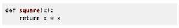
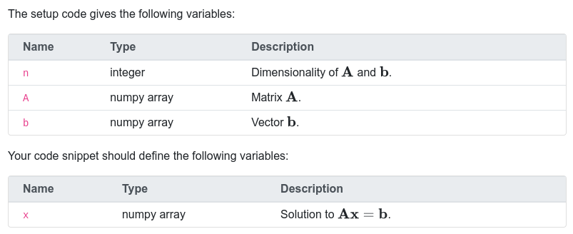
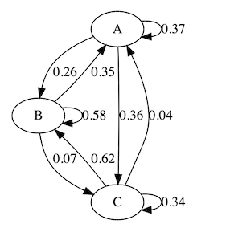
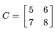

- [`pl-card`](#pl-card-element): Displays content within a card-styled component.
- [`pl-code`](#pl-code-element): Displays code rendered with the appropriate
  syntax highlighting.
- [`pl-dataframe`](#pl-dataframe-element): Display DataFrames with various options.
- [`pl-drawing`](#pl-drawing-element): Creates an image from pre-defined
  collection of graphic objects
- [`pl-external-grader-variables`](#pl-external-grader-variables-element): Displays expected and given variables for externally graded questions.
- [`pl-figure`](#pl-figure-element): Embed an image file in the question.
- [`pl-file-download`](#pl-file-download-element): Enable file downloads for
  data-centric questions.
- [`pl-file-preview`](#pl-file-preview-element): Displays a preview of submitted files.
- [`pl-graph`](#pl-graph-element): Displays graphs, using [GraphViz DOT notation](https://graphviz.org/doc/info/lang.html), an adjacency matrix, or a [`networkx`](https://networkx.org/) graph.
- [`pl-matrix-latex`](#pl-matrix-latex-element): Displays matrices using
  appropriate LaTeX commands for use in a mathematical expression.
- [`pl-overlay`](#pl-overlay-element): Allows layering existing elements on top of one another in specified positions.
- [`pl-python-variable`](#pl-python-variable-element): Display formatted output of Python variables.
- [`pl-variable-output`](#pl-variable-output-element): Displays matrices in
  code form for supported programming languages.
- [`pl-template`](#pl-template-element): Displays content from mustache templates.
- [`pl-xss-safe`](#pl-xss-safe-element): Removes potentially unsafe code from HTML code.

---

### `pl-card` element

Displays question content within a card-styled component. Optionally displays a header, footer, and/or image via tag attributes.

#### Sample element

```html
<pl-card
  header="Header"
  title="Title"
  width="50%"
  img-bottom-src="https://via.placeholder.com/720x480"
>
  <pl-question-panel> This card is 50% width and has a bottom image. </pl-question-panel>
</pl-card>
```

#### Customizations

| Attribute        | Type                           | Default | Description                            |
| ---------------- | ------------------------------ | ------- | -------------------------------------- |
| `header`         | string                         | -       | Contents of the card header.           |
| `title`          | string                         | -       | Contents of the card title.            |
| `subtitle`       | string                         | -       | Contents of the card subtitle.         |
| `contents`       | string                         | -       | Raw contents of the card body.         |
| `footer`         | string                         | -       | Contents of the card footer.           |
| `img-top-src`    | string                         | -       | Source URL for the top image.          |
| `img-top-alt`    | string                         | -       | Alternative text for the top image.    |
| `img-bottom-src` | string                         | -       | Source URL for the bottom image.       |
| `img-bottom-alt` | string                         | -       | Alternative text for the bottom image. |
| `width`          | "25%", "50%", "75%", or "auto" | "auto"  | Width of the card.                     |

#### Details

The `pl-card` attributes mirror the options of [Bootstrap 4 cards](https://getbootstrap.com/docs/4.6/components/card/).

#### Example implementations

- [element/card]

---

### `pl-code` element

Display an embedded or file-based block of code with syntax highlighting and
line callouts.

#### Sample element



<!-- prettier-ignore -->
```html
<pl-code language="python">
def square(x):
    return x * x
</pl-code>
```

#### Customizations

| Attribute               | Type    | Default    | Description                                                                                                                                                                                                                                                                                                                                                                                                                                           |
| ----------------------- | ------- | ---------- | ----------------------------------------------------------------------------------------------------------------------------------------------------------------------------------------------------------------------------------------------------------------------------------------------------------------------------------------------------------------------------------------------------------------------------------------------------- |
| `language`              | string  | —          | The programming language syntax highlighting to use. See below for options.                                                                                                                                                                                                                                                                                                                                                                           |
| `style`                 | string  | "friendly" | The pygments style to use. A sample of valid styles can be found [here](https://pygments.org/styles/).                                                                                                                                                                                                                                                                                                                                                |
| `source-file-name`      | text    | -          | Name of the source file with existing code to be displayed as a code block (instead of writing the existing code between the element tags as illustrated in the above code snippet).                                                                                                                                                                                                                                                                  |
| `directory`             | string  | special    | Directory where the source file with existing code is to be found. Only useful if `source-file-name` is used. If it contains one of the special names `clientFilesCourse` or `serverFilesCourse`, then the source file name is read from the course's special directories, otherwise the directory is expected to be in the question's own directory. If not provided, the source file name is expected to be found in the question's main directory. |
| `prevent-select`        | boolean | false      | Applies methods to make the source code more difficult to copy, like preventing selection or right-clicking. Note that the source code is still accessible in the page source, which will always be visible to students.                                                                                                                                                                                                                              |
| `highlight-lines`       | text    | -          | Apply a distinctive background highlight the specified lines of code. Accepts input like `4`, `1-3,5-10`, and `1,2-5,20`.                                                                                                                                                                                                                                                                                                                             |
| `highlight-lines-color` | text    | `#b3d7ff`  | Specifies the color of highlighted lines of code.                                                                                                                                                                                                                                                                                                                                                                                                     |
| `copy-code-button`      | boolean | false      | Whether to include a button to copy the code displayed by this element.                                                                                                                                                                                                                                                                                                                                                                               |
| `show-line-numbers`     | boolean | false      | Whether to show line numbers in code displayed by this element.                                                                                                                                                                                                                                                                                                                                                                                       |

#### Details

The `pl-code` element uses the _Pygments_ library for syntax highlighting. It supports the any of the built-in supported languages, be found [here](https://pygments.org/languages/), as well as the custom [`ansi-color` custom language](https://github.com/chriskuehl/pygments-ansi-color) that can be used to display terminal output. If the language is not provided, no syntax highlighting is done.

##### Common Pitfalls

The HTML specification disallows inserting special characters onto the page (i.e. `<`, `>`, `&`), and using these characters with inline code may break rendering. To fix this, either escape the characters (`&lt;`, `&gt;`, `&amp;`, more [here](https://www.freeformatter.com/html-entities.html)), or load code snippets from external files into `pl-code` with `source-file-name` attribute.

#### Example implementations

- [element/code]

#### See also

- [`pl-file-editor` to provide an in-browser code environment](submission-elements.md#pl-file-editor-element)

---

### `pl-dataframe` element

Displays a formatted display of Pandas DataFrames, with various options for displaying types of columns and code for reproducing the DataFrame.

#### Sample elements

**question.html**

```html
<pl-dataframe params-name="df" show-index="false" show-dimensions="false" digits="4"></pl-dataframe>
```

**server.py**

```python
import prairielearn as pl
import pandas as pd

def generate(data):
    df = pd.read_csv("breast-cancer-train.dat", header=None)
    data["params"]["df"] = pl.to_json(df.head(15))
```

#### Customizations

| Attribute               | Type          | Default  | Description                                                                                                                                                                                                                                                                                                                                                        |
| ----------------------- | ------------- | -------- | ------------------------------------------------------------------------------------------------------------------------------------------------------------------------------------------------------------------------------------------------------------------------------------------------------------------------------------------------------------------ |
| `params-name`           | string        | —        | The name of the key in `data['params']` to get a value from.                                                                                                                                                                                                                                                                                                       |
| `show-header`           | boolean       | true     | Show the header row of a DataFrame.                                                                                                                                                                                                                                                                                                                                |
| `show-index`            | boolean       | true     | Show the index column of a DataFrame. Will switch to 1-indexing if using the default index and `display-language` is "r".                                                                                                                                                                                                                                          |
| `show-dimensions`       | boolean       | true     | Show a footer with the dimensions of a DataFrame.                                                                                                                                                                                                                                                                                                                  |
| `show-dtype`            | boolean       | false    | Show the data types contained in each column of the DataFrame at the bottom of each column. Types used correspond to the `display-language` parameter.                                                                                                                                                                                                             |
| `display-language`      | "python", "r" | "python" | Language to use for displaying data types and indices.                                                                                                                                                                                                                                                                                                             |
| `display-variable-name` | string        | "df"     | Variable name to display in code to recreate DataFrame.                                                                                                                                                                                                                                                                                                            |
| `show-python`           | boolean       | true     | Show code that can be used to recreate the DataFrame in Python in a separate tab.                                                                                                                                                                                                                                                                                  |
| `digits`                | integer       | -        | Number of digits to display for floating point entries.                                                                                                                                                                                                                                                                                                            |
| `width`                 | integer       | 500      | Max characters per line for displaying Python code.                                                                                                                                                                                                                                                                                                                |
| `presentation-type`     | string        | `'g'`    | Floating point number display format. If `digits` is specified, formatted using `'{:.{digits}{presentation-type}}'`, otherwise `'{:{presentation-type}}'`. See [the Python documentation](https://docs.python.org/3/library/string.html#format-specification-mini-language) for more information on allowable presentation types for `float` and `Decimal` values. |

#### Details

When setting a parameter, use PrairieLearn's built in `pl.to_json()` on the DataFrame to display. Note that there are multiple serialization options for Pandas DataFrames. Encoding a DataFrame `df` by setting `pl.to_json(df, df_encoding_version=2)` allows for missing and date time values whereas `pl.to_json(df, df_encoding_version=1)` (default) does not. However, `df_encoding_version=1` has support for complex numbers, while `df_encoding_version=2` does not.

Note that some Python types may not be serialized correctly in the code provided to reconstruct the DataFrame.

#### Example implementations

- [element/dataframe]
- [demo/randomDataFrame]

#### See also

- [`pl-code` to display blocks of code with syntax highlighting](#pl-code-element)
- [`pl-variable-output` for displaying a matrix or element in code form.](#pl-variable-output-element)
- [`pl-python-variable` for displaying a formatted output of Python variables.](#pl-python-variable-element)

### `pl-drawing` element

Creates a canvas (drawing space) that can display images from a collection of pre-defined drawing objects.
Users can also add drawing objects to the canvas for grading.

See the [`pl-drawing` documentation](../pl-drawing/index.md) for details.

---

### `pl-external-grader-variables` element

Displays variables that are given to the student, or expected for the student to define in externally-graded Python questions.

**We advise against using this element for any question not using the `prairielearn/grader-python` Docker image**, as the way this element stores parameters is specifically for use with that autograder. If you want to display a table of variables for a question using a different autograder, consider using a standard HTML `<table>` instead.

The list of variables can be defined in in `data["params"]` or the question HTML itself (but not both!). If defined in the
question HTML itself, the variable information is added to `data["params"]` for use by the external grader. If no descriptions
are present, this colmun is hidden in the table shown to the student.

If stored in `data["params"]`, the variables list has the following format:

```python
data["params"]["names_for_user"] = [
    {"name": "var1", "description": "Human-readable description.", "type": "type"},
    {"name": "var2", "description": "...", "type": "..."}
]
data["params"]["names_from_user"] = [
    {"name": "result1", "description": "...", "type": "..."}
]
```

#### Sample element



**question.html**

```html
<p>The setup code gives the following variables:</p>
<pl-external-grader-variables params-name="names_for_user"></pl-external-grader-variables>

<p>Your code snippet should define the following variables:</p>
<pl-external-grader-variables params-name="names_from_user">
  <pl-variable name="x" type="numpy array (length $n$)"
    >Solution to $\mathbf{Ax}=\mathbf{b}$.</pl-variable
  >
</pl-external-grader-variables>

<!--
  The following tag defines an empty list for the given params-name.
  This is useful for some cases where a parameter must be set to empty to run the external grader.
  Nothing will be displayed from this tag.
-->
<pl-external-grader-variables params-name="names_empty" empty="true"></pl-external-grader-variables>
```

**server.py**

```python
def generate(data):
    data["params"]["names_for_user"] = [
        {"name": "n", "description": r"Dimensionality of $\mathbf{A}$ and $\mathbf{b}$.", "type": "integer"},
        {"name": "A", "description": r"Matrix $\mathbf{A}$.", "type": "numpy array"},
        {"name": "b", "description": r"Vector $\mathbf{b}$.", "type": "numpy array"}
    ]
```

#### Customizations

| Attribute     | Type    | Default | Description                                                                                                                                 |
| ------------- | ------- | ------- | ------------------------------------------------------------------------------------------------------------------------------------------- |
| `params-name` | string  | -       | Name of variable specification in `data["params"]` to display, the format for which is given above.                                         |
| `empty`       | boolean | false   | Whether the entry for the given `params-name` should be set to empty. Will throw an error if variables are defined and this is set to true. |

The HTML inside the inner `pl-variable` tag is used as the description. If the tag is empty, no description is used for the given variable. The inner `pl-variable` tag has the following attributes:

| Attribute | Type   | Default | Description                                             |
| --------- | ------ | ------- | ------------------------------------------------------- |
| `name`    | string | -       | Name of the given variable. Required for all variables. |
| `type`    | string | -       | Type of the given variable. Required for all variables. |

#### Example implementations

- [demo/autograder/codeEditor]
- [demo/autograder/codeUpload]
- [demo/autograder/python/square]
- [demo/autograder/python/numpy]
- [demo/autograder/python/pandas]
- [demo/autograder/python/plots]
- [demo/autograder/python/random]

### `pl-figure` element

Display a statically or dynamically generated image.

#### Sample element


```html
<!-- show a figure from an existing file -->
<pl-figure file-name="figure.png" directory="clientFilesCourse"></pl-figure>

<!-- show a figure from a file that is generated by code -->
<pl-figure file-name="figure.png" type="dynamic"></pl-figure>
```

#### Customizations

| Attribute   | Type    | Default               | Description                                                                                                                                                                                              |
| ----------- | ------- | --------------------- | -------------------------------------------------------------------------------------------------------------------------------------------------------------------------------------------------------- |
| `file-name` | string  | —                     | Name of image file.                                                                                                                                                                                      |
| `type`      | text    | 'static'              | Type of file, either 'static' (an existing file) or 'dynamic' (a file generated by element or server code).                                                                                              |
| `directory` | text    | "clientFilesQuestion" | The directory that contains the file, either 'clientFilesQuestion' or 'clientFilesCourse' (see [client and server files](../clientServerFiles.md)). A directory cannot be specified if `type='dynamic'`. |
| `width`     | number  | `None`                | Width of image (e.g., '250px').                                                                                                                                                                          |
| `inline`    | boolean | false                 | Display figure inline with text (true) or on a separate line (false).                                                                                                                                    |
| `alt`       | text    | ""                    | Provide alt (alternative) text to improve accessibility of figures by describing the image or the purpose of the image. Default is an empty string.                                                      |

#### Dynamically generated figures

If `type="dynamic"`, then the contents of the image file must be returned by a function `file()` that is located either in element code or in `server.py`. The contents must be a string (with utf-8 encoding), a bytes-like object, or a file-like object. The filename will be available to this function as `data["filename"]`. For example, to generate the `figure.png` for the dynamic `pl-figure` above, this code might appear in `server.py` to generate a "fake" `figure.png`:

```python
def file(data):
    if data["filename"]=="figure.png":
        plt.plot([1,2,3],[3,4,-2])
        buf = io.BytesIO()
        plt.savefig(buf,format="png")
        return buf
```

If `file()` does not return anything, it will be treated as if `file()` returned the empty string.

#### Example implementations

- [demo/randomPlot]
- [demo/fixedCheckbox]
- [element/figure]

#### See also

- [`pl-file-download` to allow for files to be downloaded.](#pl-file-download-element)
- [`pl-code` to show code as text with syntax highlighting.](#pl-code-element)

---

### `pl-file-download` element

Provide a download link to a static or dynamically generated file.

#### Sample element


```html
<!-- allow students to download an existing file -->
<pl-file-download file-name="data.txt" directory="clientFilesCourse"></pl-file-download>

<!-- allow students to download a file that is generated by code -->
<pl-file-download file-name="data.txt" type="dynamic"></pl-file-download>

<!-- allow students to open an existing file in a new tab -->
<pl-file-download
  file-name="data.txt"
  directory="clientFilesCourse"
  force-download="false"
></pl-file-download>
```

#### Customizations

| Attribute        | Type    | Default               | Description                                                                                                                                                                                              |
| ---------------- | ------- | --------------------- | -------------------------------------------------------------------------------------------------------------------------------------------------------------------------------------------------------- |
| `file-name`      | string  | —                     | Name of file to download.                                                                                                                                                                                |
| `label`          | text    | file-name             | Alternate text for file download link (e.g., `label="click here to download"`).                                                                                                                          |
| `type`           | text    | "static"              | Type of file, either "static" (an existing file) or "dynamic" (a file generated by element or server code).                                                                                              |
| `directory`      | text    | "clientFilesQuestion" | The directory that contains the file, either "clientFilesQuestion" or "clientFilesCourse" (see [client and server files](../clientServerFiles.md)). A directory cannot be specified if `type="dynamic"`. |
| `force-download` | boolean | true                  | Force a file download. Otherwise, allow the browser to open the file in a new tab.                                                                                                                       |

#### Details

If `type="dynamic"`, then the contents of the file must be returned by a function `file()` that is located either in element code or in `server.py`. The contents must be a string (with utf-8 encoding), a bytes-like object, or a file-like object. The filename will be available to this function as `data["filename"]`. For example, this code might appear in `server.py` to generate a file called `data.txt`:

```python
def file(data):
    if data["filename"]=="data.txt":
        return "This data is generated by code."
```

If `file()` does not return anything, it will be treated as if `file()` returned the empty string.

#### Example implementations

- [element/fileDownload]

#### See also

- [`pl-figure` to display images.](#pl-figure-element)
- [`pl-code` to show code as text with syntax highlighting.](#pl-code-element)

---

### `pl-file-preview` element

Provides an in-browser list of all files submitted by a student through submission elements like `pl-file-editor`, `pl-file-upload`, and `pl-rich-text-editor`, or through [workspaces](../workspaces/index.md). A preview of each file's content is also displayed for text-only files (including source code), images, PDF files and Jupyter Notebooks. It is commonly used in the submission panel in conjunction with the `pl-external-grader-results` element, though it can also be used when manual or internal grading is used to grade files.

#### Sample element

```html
<pl-file-preview></pl-file-preview>
```

#### Example implementations

- [element/fileEditor]
- [demo/autograder/codeEditor]

#### See also

- [`pl-file-editor` to provide an in-browser code environment](submission-elements.md#pl-file-editor-element)
- [`pl-file-upload` to receive files as a submission](submission-elements.md#pl-file-upload-element)
- [`pl-external-grader-results` to include output from autograded code](conditional-elements.md#pl-external-grader-results-element)
- [`pl-code` to display blocks of code with syntax highlighting](#pl-code-element)
- [`pl-xss-safe` to display HTML or Markdown code provided by students](#pl-xss-safe-element)

---

### `pl-graph` element

Using the [PyGraphviz](https://pygraphviz.github.io/) library, create Graphviz DOT visualizations.

#### Sample elements


**question.html**

```html
<pl-graph> digraph G { A -> B } </pl-graph>
```

---



**question.html**

```html
<pl-graph params-name="matrix" params-name-labels="labels"></pl-graph>
```

**server.py**

```python
import prairielearn as pl
import numpy as np

def generate(data):
    mat = np.random.random((3, 3))
    mat = mat / np.linalg.norm(mat, 1, axis=0)
    data["params"]["labels"] = pl.to_json(["A", "B", "C"])
    data["params"]["matrix"] = pl.to_json(mat)
```

---

**question.html**

```html
<pl-graph params-type="networkx" params-name="random-graph"></pl-graph>
```

**server.py**

```python
import prairielearn as pl
import networkx as nx

def generate(data):
    random_graph = nx.gnm_random_graph(5, 6)

    for in_node, out_node, edge_data in random_graph.edges(data=True):
        edge_data["label"] = random.choice(string.ascii_lowercase)

    data["params"]["random-graph"] = pl.to_json(random_graph)
```

#### Customizations

| Attribute                   | Type    | Default            | Description                                                                                                                                                                                                                                                             |
| --------------------------- | ------- | ------------------ | ----------------------------------------------------------------------------------------------------------------------------------------------------------------------------------------------------------------------------------------------------------------------- |
| `engine`                    | string  | dot                | The rendering engine to use; supports `circo`, `dot`, `fdp`, `neato`, `osage`, and `twopi`.                                                                                                                                                                             |
| `params-name`               | string  | `None`             | The the name of a parameter containing the data to use as input. Data type to use depends on `params-type` attribute.                                                                                                                                                   |
| `params-name-labels`        | string  | `None`             | When using an adjacency matrix, the parameter that contains the labels for each node.                                                                                                                                                                                   |
| `params-type`               | string  | `adjacency-matrix` | Which backend to use for rendering a graph from data. By default, only `adjacency-matrix` and `networkx` exist, but custom types can be added through extensions.                                                                                                       |
| `weights`                   | boolean | `None`             | When using an adjacency matrix, whether or not to show the edge weights. By default will automatically show weights for stochastic matrices (when they are not binary `0`/`1`).                                                                                         |
| `weights-digits`            | integer | `"2"`              | When using an adjacency matrix, how many digits to show for the weights.                                                                                                                                                                                                |
| `negative-weights`          | boolean | false              | Whether to recognize negative weights in an adjacency matrix. If set to false, then all weights at most 0 are ignored (not counted as an edge). If set to true, then all weights that are not `None` are recognized.                                                    |
| `directed`                  | boolean | true               | Whether to treat edges in an adjacency matrix as directed or undirected. If set to false, then edges will be rendered as undirected. _The input adjacency matrix must be symmetric if this is set to false._                                                            |
| `weights-presentation-type` | string  | `'f'`              | Number display format for the weights when using an adjacency matrix. If presentation-type is 'sigfig', each number is formatted using the to_precision module to digits significant figures. Otherwise, each number is formatted as `{:.{digits}{presentation-type}}`. |
| `log-warnings`              | boolean | true               | Whether to log warnings that occur during Graphviz rendering.                                                                                                                                                                                                           |

#### Details

Note that using networkx for rendering, attributes from the input networkx graph are retained when creating a Graphviz DOT visualization. As a result, it is possible to set node and edge properties such as color, line weight, as part of the input graph and have these reflected in the rendering. These include global properties of the graph, such as the `rankdir` used in rendering. See the [Graphviz documentation on attributes](https://graphviz.org/doc/info/attrs.html) for more information on what attributes are supported.

#### Example implementations

- [element/graph]

#### Extension API

Custom values for `params-type` can be added with [element extensions](../elementExtensions.md). Each custom type is defined as a function that takes as input the `element` and `data` values and returns processed DOT syntax as output.

A minimal type function can look something like:

```
def custom_type(element, data):
    return "graph { a -- b; }"
```

In order to register these custom types, your extension should define the global `backends` dictionary. This will map a value of `params-type` to your function above:

```
backends = {
    'my-custom-type': custom_type
}
```

This will automatically get picked up when the extension gets imported. If your extension needs extra attributes to be defined, you may optionally define the global `optional_attribs` array that contains a list of attributes that the element may use.

For a full implementation, check out the `edge-inc-matrix` extension in the exampleCourse.

#### See also

- [External: the DOT language reference](https://graphviz.org/doc/info/lang.html)
- [`pl-figure` for displaying static or dynamically generated graphics.](#pl-figure-element)
- [`pl-file-download` for allowing either static or dynamically generated files to be downloaded.](#pl-file-download-element)

---

### `pl-matrix-latex` element

Displays a scalar or 2D numpy array of numbers in LaTeX using mathjax.

#### Sample element



**question.html**

```html
$$C = <pl-matrix-latex params-name="matrixC"></pl-matrix-latex>$$
```

**server.py**

```python
import prairielearn as pl
import numpy as np

def generate(data):

    # Construct a matrix
    mat = np.matrix("1 2; 3 4")

    # Export matrix to be displayed in question.html
    data["params"]["matrixC"] = pl.to_json(mat)
```

#### Customizations

| Attribute           | Type    | Default | Description                                                                                                                                                                                                                        |
| ------------------- | ------- | ------- | ---------------------------------------------------------------------------------------------------------------------------------------------------------------------------------------------------------------------------------- |
| `params-name`       | string  | —       | Name of variable in `data["params"]` to display.                                                                                                                                                                                   |
| `presentation-type` | string  | `'f'`   | Number display format. If `presentation-type` is `'sigfig'`, each number is formatted using the `to_precision` module to `digits` significant figures. Otherwise, each number is formatted as `'{:.{digits}{presentation-type}}'`. |
| `digits`            | integer | `"2"`   | Number of digits to display according to the choice of `presentation-type`                                                                                                                                                         |

#### Details

Depending on whether `data["params"]` contains either a scalar or 2D numpy array of numbers,
one of the following will be returned.

- **scalar**
  - a string containing the scalar not wrapped in brackets.
- **numpy 2D array**
  - a string formatted using the `bmatrix` LaTeX style.

Sample LaTeX formatting:

```latex
\begin{bmatrix} ... & ... \\ ... & ... \end{bmatrix}
```

As an example, consider the need to display the following matrix operations:

```
x = [A][b] + [c]
```

In this case, we would write:

```html
${\bf x} = <pl-matrix-latex params-name="A" digits="1"></pl-matrix-latex>
<pl-matrix-latex params-name="b" digits="1"></pl-matrix-latex>
+ <pl-matrix-latex params-name="c" digits="1"></pl-matrix-latex>$
```

#### Example implementations

- [element/matrixLatex]
- [demo/randomCheckbox]

#### See also

- [`pl-variable-output` for displaying the matrix in a supported programming language.](#pl-variable-output-element)
- [`pl-matrix-component-input` for individual input boxes for each element in the matrix](submission-elements.md#pl-matrix-component-input-element)
- [`pl-matrix-input` for input values formatted in a supported programming language.](submission-elements.md#pl-matrix-input-element)

---

### `pl-overlay` element

The overlay element allows existing PrairieLearn and HTML elements to be layered on top of one another in arbitrary positions.

#### Sample element


```html
<pl-overlay width="400" height="400" clip="false">
  <pl-background>
    <pl-drawing width="398" height="398" hide-answer-panel="false">
      <pl-drawing-initial>
        <pl-triangle x1="50" y1="350" x2="350" y2="350" x3="350" y3="50"></pl-triangle>
      </pl-drawing-initial>
    </pl-drawing>
  </pl-background>
  <pl-location left="200" top="375"> $$3$$ </pl-location>
  <pl-location left="375" top="200"> $$3$$ </pl-location>
  <pl-location left="170" top="170">
    <pl-number-input
      answers-name="c"
      show-help-text="false"
      show-placeholder="false"
      size="1"
    ></pl-number-input>
  </pl-location>
</pl-overlay>
```

#### `pl-overlay` Customizations

| Attribute | Type    | Default | Description                                                                              |
| --------- | ------- | ------- | ---------------------------------------------------------------------------------------- |
| `width`   | float   | -       | The width of the overlay canvas in pixels. Required only if no background is specified.  |
| `height`  | float   | -       | The height of the overlay canvas in pixels. Required only if no background is specified. |
| `clip`    | boolean | true    | If true, children will be cut off when exceeding overlay boundaries.                     |

#### `pl-location` Customizations

| Attribute | Type   | Default  | Description                                                                                     |
| --------- | ------ | -------- | ----------------------------------------------------------------------------------------------- |
| `left`    | float  | -        | The x coordinate of the child element (relative to the left of the overlay)                     |
| `top`     | float  | -        | The y coordinate of the child element (relative to the top of the overlay)                      |
| `right`   | float  | -        | The x coordinate of the child element (relative to the right of the overlay)                    |
| `bottom`  | float  | -        | The y coordinate of the child element (relative to the bottom of the overlay)                   |
| `valign`  | string | `middle` | Specifies the vertical alignment of the contents. Can be one of `top`, `middle`, or `bottom`.   |
| `halign`  | string | `center` | Specifies the horizontal alignment of the contents. Can be one of `left`, `center`, or `right`. |

#### `pl-background` Customizations

The `pl-background` child tag does not have any extra attributes that need to be set. All relevant positioning and sizing information is obtained from the tag's contents.

#### Details

An overlay is pre-defined as a "overlay area" with a static size. By default, elements that exceed these boundaries will get partially or totally cut off. A background can be specified by wrapping HTML in a `<pl-background>` tag, in this case the overlay will automatically size itself to fit the background and a `width` and `height` do not need to be specified. Floating child elements are wrapped with a `<pl-location>` tag that specifies the position relative to some defined edge of the overlay area using `left`, `right`, `top`, and `bottom`. Anything inside the location tag will be displayed at that position. Children are layered in the order they are specified, with later child elements being displayed on top of those defined earlier.

#### Example implementations

- [element/overlay]

---

### `pl-python-variable` element

Displays the value of a Python variable. Uses options similar to the [pprint](https://docs.python.org/3/library/pprint.html) module to format output data, and can recursively print nested data structures. As such, some of the customization text is taken directly from this documentation.

#### Sample elements

**Display Python variable value**


**question.html**

```html
<pl-python-variable params-name="variable"></pl-python-variable>
```

**server.py**

```python
import prairielearn as pl

def generate(data):
    data_dictionary = { "a": 1, "b": 2, "c": 3 }
    data["params"]["variable"] = pl.to_json(data_dictionary)
```

#### Customizations

| Attribute           | Type    | Default | Description                                                                                                                                                                                                                                                                                      |
| ------------------- | ------- | ------- | ------------------------------------------------------------------------------------------------------------------------------------------------------------------------------------------------------------------------------------------------------------------------------------------------ |
| `params-name`       | string  | —       | The name of the key in `data['params']` to get a value from.                                                                                                                                                                                                                                     |
| `prefix`            | string  | (empty) | Any prefix to append to the output in `text` mode.                                                                                                                                                                                                                                               |
| `prefix-newline`    | boolean | false   | Add newline to the end of `prefix`.                                                                                                                                                                                                                                                              |
| `suffix`            | string  | (empty) | Any suffix to append to the output in `text` mode.                                                                                                                                                                                                                                               |
| `suffix-newline`    | boolean | false   | Add newline before the start of `suffix`.                                                                                                                                                                                                                                                        |
| `indent`            | integer | 1       | Specifies the amount of indentation added for each nesting level when printing nested objects.                                                                                                                                                                                                   |
| `depth`             | integer | -       | The number of nesting levels which may be printed; if the data structure being printed is too deep, the next contained level is replaced by ... By default, there is no constraint on the depth of the objects being formatted.                                                                  |
| `width`             | integer | 80      | Specifies the desired maximum number of characters per line in the output. If a structure cannot be formatted within the width constraint, a best effort will be made.                                                                                                                           |
| `compact-sequences` | boolean | false   | Impacts the way that long sequences (lists, tuples, sets, etc.) are formatted. If `compact-sequences` is false (the default) then each item of a sequence will be formatted on a separate line. If it is true, as many items as will fit within the width will be formatted on each output line. |
| `sort-dicts`        | boolean | true    | If true, dictionaries will be formatted with their keys sorted, otherwise they will display in insertion order.                                                                                                                                                                                  |
| `no-highlight`      | boolean | false   | Disable syntax highlighting.                                                                                                                                                                                                                                                                     |
| `copy-code-button`  | boolean | false   | Whether to include a button to copy the code displayed by this element.                                                                                                                                                                                                                          |
| `show-line-numbers` | boolean | false   | Whether to show line numbers in code displayed by this element.                                                                                                                                                                                                                                  |

#### Details

The element supports displaying Python objects via `repr()`, with support for more complex display options similar to the built-in `pprint` library. **Objects to be displayed must be serializable to JSON.** For details about what objects can be serialized and how to do this with the provided `to_json` and `from_json` functions, see the [Question Writing documentation](../question.md#question-data-storage). To display objects that cannot be easily JSON serialized, please refer to the `pl-code` example question [element/code].

Printing Pandas DataFrames with this element is deprecated. Please use the new [`pl-dataframe`](#pl-dataframe-element) element for this purpose.

#### Example implementations

- [element/pythonVariable]

#### See also

- [`pl-code` to display blocks of code with syntax highlighting](#pl-code-element)
- [`pl-variable-output` for displaying a matrix or element in code form.](#pl-variable-output-element)
- [`pl-dataframe` for displaying dataframes.](#pl-dataframe-element)

### `pl-template` element

Displays boilerplate HTML from mustache templates in a reusable way.

#### Sample element

```html
<pl-template file-name="templates/outer_template.mustache">
  <pl-variable name="show">True</pl-variable>
  <pl-variable name="section_header">This is the section header.</pl-variable>
  <pl-variable name="section_body">This is the section body.</pl-variable>
</pl-template>
```

Along with the sample usage of the element, we include a sample template file. This is the file
`templates/outer_template.mustache`, stored in the course's `serverFilesCourse` directory:

```html
<div class="card mb-1 mt-1">
  <div class="card-header" style="cursor: pointer">
    <div
      class="card-title d-flex justify-content-between"
      data-toggle="collapse"
      data-target="#collapse-{{uuid}}"
    >
      <div>{{section_header}}</div>
      <div class="fa fa-angle-down"></div>
    </div>
  </div>

  <div class="collapse{{#show}} show{{/show}}" id="collapse-{{uuid}}">
    <div class="card-body">
      <div class="card-text">{{{section_body}}}</div>
    </div>
  </div>
</div>
```

_Note:_ The sample element did not define the `uuid` variable, as each `pl-template` element
has a unique one defined internally.

#### Customizations

| Attribute               | Type                                                                                            | Default             | Description                                                                                                  |
| ----------------------- | ----------------------------------------------------------------------------------------------- | ------------------- | ------------------------------------------------------------------------------------------------------------ |
| `file-name`             | string                                                                                          | -                   | File name of the outer template to use.                                                                      |
| `directory`             | `question`, `clientFilesQuestion`, `clientFilesCourse`, `serverFilesCourse`, `courseExtensions` | `serverFilesCourse` | Parent directory to locate `file-name`.                                                                      |
| `log-variable-warnings` | boolean                                                                                         | false               | Whether to log warnings when rendering templates with undefined variables. Useful for debugging.             |
| `log-tag-warnings`      | boolean                                                                                         | true                | Whether to log warnings if a rendered template contains elements which are not guaranteed to work correctly. |

Inside the `pl-template` element, variables for use in rendering the template may be specified with a `pl-variable` tag. Each `pl-variable` tag can be used to define a variable with data from a file or with the contents of the tag (but not both). Note that substitution is **not** applied to external files used in `pl-variable` (files are used as-is). The `pl-variable` tag supports the following attributes:

| Attribute         | Type                                                                                            | Default             | Description                                                   |
| ----------------- | ----------------------------------------------------------------------------------------------- | ------------------- | ------------------------------------------------------------- |
| `name`            | string                                                                                          | -                   | Variable name to assign the data defined by this tag.         |
| `file-name`       | string                                                                                          | -                   | File name to use if variable data is being taken from a file. |
| `directory`       | `question`, `clientFilesQuestion`, `clientFilesCourse`, `serverFilesCourse`, `courseExtensions` | `serverFilesCourse` | Parent directory to locate `file-name`.                       |
| `trim-whitespace` | boolean                                                                                         | true                | Whether to trim whitespace of data specified by this tag.     |

#### Details

Because of the way that elements are rendered in PrairieLearn, templates should only contain other decorative elements. In particular, **elements that accept and/or grade student input used within this element will not work correctly.** When rendering a template, all entries from `data["params"]` are included as available variables and may be used when the template is rendered. Each instance of the `pl-template` element also has a unique `uuid` variable available for rendering. Templates may also be used within other templates.

_Note:_ The id `#` CSS selector does _not_ work for ids that start with a number, so uuids should be prefixed (as these may start with a number).

#### Example implementations

- [element/template]

---

### `pl-variable-output` element

Displays a list of variables that are formatted for import into the
supported programming languages (e.g. MATLAB, Mathematica, Python, or R).

#### Sample element


**question.html**

```html
<pl-variable-output digits="3">
  <!-- Example comment inside of this element. -->
  <pl-variable params-name="matrixC">C</pl-variable>
  <pl-variable params-name="matrixD">D</pl-variable>
</pl-variable-output>
```

**server.py**

```python
import prairielearn as pl
import numpy as np

def generate(data):

    # Create fixed matrix
    matrixC = np.matrix("5 6; 7 8")
    matrixD = np.matrix("-1 4; 3 2")
    # Random matrices can be generated with:
    # mat = np.random.random((2, 2))

    # Export each matrix as a JSON object for the question view.
    data["params"]["matrixC"] = pl.to_json(matrixC)
    data["params"]["matrixD"] = pl.to_json(matrixD)
```

#### Customizations

Attributes for `<pl-variable-output>`:

| Attribute          | Type    | Default  | Description                                                         |
| ------------------ | ------- | -------- | ------------------------------------------------------------------- |
| `digits`           | integer | —        | Number of digits to display after the decimal.                      |
| `default-tab`      | string  | `matlab` | Select the active tab.                                              |
| `show-matlab`      | boolean | true     | Toggles the display of the Matlab tab. Also compatible with Octave. |
| `show-mathematica` | boolean | true     | Toggles the display of the Mathematica tab.                         |
| `show-python`      | boolean | true     | Toggles the display of the Python tab.                              |
| `show-r`           | boolean | true     | Toggles the display of the R tab.                                   |
| `show-sympy`       | boolean | true     | Toggles the display of the SymPy tab.                               |

Attributes for `<pl-variable>` (one of these for each variable to display):

| Attribute     | Type    | Default | Description                                                     |
| ------------- | ------- | ------- | --------------------------------------------------------------- |
| `params-name` | string  | —       | Name of variable in `data["params"]` to display.                |
| `comment`     | string  | —       | Comment to add after the displayed variable.                    |
| `digits`      | integer | —       | Number of digits to display after the decimal for the variable. |

#### Details

This element displays a list of variables inside `<pl-code>` tags that are formatted for import into
either MATLAB, Mathematica, Python, or R (the user can switch between them). Each variable must be
either a scalar or a 2D numpy array (expressed as a list). Each variable will be prefixed by the
text that appears between the `<pl-variable>` and `</pl-variable>` tags, followed by `=`. Below
are samples of the format displayed under each language tab.

**MATLAB format:**

```matlab
A = [1.23; 4.56]; % matrix
```

**Mathematica format:**

```mathematica
A = [1.23; 4.56]; (* matrix *)
```

**Python format:**

```python
import numpy as np

A = np.array([[1.23], [4.56]]) # matrix
```

**R format:**

```r
A = c(1.23, 4.56) # vector
A = matrix(c(1.23, 4.56, 8.90, 1.23), nrow = 2, ncol = 2, byrow = TRUE) # matrix
```

If a variable `v` is a complex object, you should use `import prairielearn as pl` and `data["params"][params-name] = pl.to_json(v)`.

#### Example implementations

- [element/variableOutput]
- [element/matrixComponentInput]
- [demo/matrixComplexAlgebra]

#### See also

- [`pl-matrix-latex` for displaying the matrix using LaTeX commands.](#pl-matrix-latex-element)
- [`pl-matrix-component-input` for individual input boxes for each element in the matrix](submission-elements.md#pl-matrix-component-input-element)
- [`pl-matrix-input` for input values formatted in a supported programming language.](submission-elements.md#pl-matrix-input-element)
- [`pl-code` to display blocks of code with syntax highlighting](#pl-code-element)

---

### `pl-xss-safe` element

Removes potentially dangerous scripts from HTML. This is recommended when parsing and displaying student-provided content. The element will remove some elements like scripts and triggers that may have been maliciously inserted by the student. Note that any code parsed by this element must be supported directly by the browser, i.e., it cannot include PrairieLearn elements or special tags.

#### Sample element

```html
<!-- Content coming from a submitted file (e.g., pl-file-editor, pl-file-upload) -->
<pl-xss-safe submitted-file-name="answer.html"></pl-xss-safe>

<!-- Content coming from a regular element (e.g., pl-string-input) -->
<pl-xss-safe contents="{{submitted_answers.answer}}"></pl-xss-safe>
```

#### Customizations

| Attribute             | Type   | Default | Description                                                                                                                                                   |
| --------------------- | ------ | ------- | ------------------------------------------------------------------------------------------------------------------------------------------------------------- |
| `source-file-name`    | string | -       | Name of the source file with existing code to be used (instead of using the existing code between the element tags as illustrated in the above code snippet). |
| `submitted-file-name` | string | -       | Name of the file submitted by the user to (typically using a `pl-file-editor` or `pl-file-upload` element) with the code to be used.                          |
| `contents`            | string | -       | Raw contents to be displayed.                                                                                                                                 |
| `language`            | string | html    | Language of the provided code. The values "html" or "markdown" are currently supported.                                                                       |

Note that only one of the attributes `source-file-name`, `submitted-file-name` or `contents` may be provided in the same element.

#### Example implementations

- [demo/markdownEditorLivePreview]
- [element/xssSafe]

#### See also

- [`pl-file-editor` to provide an in-browser code environment](submission-elements.md#pl-file-editor-element)

{!elements/reference-links.md!}
