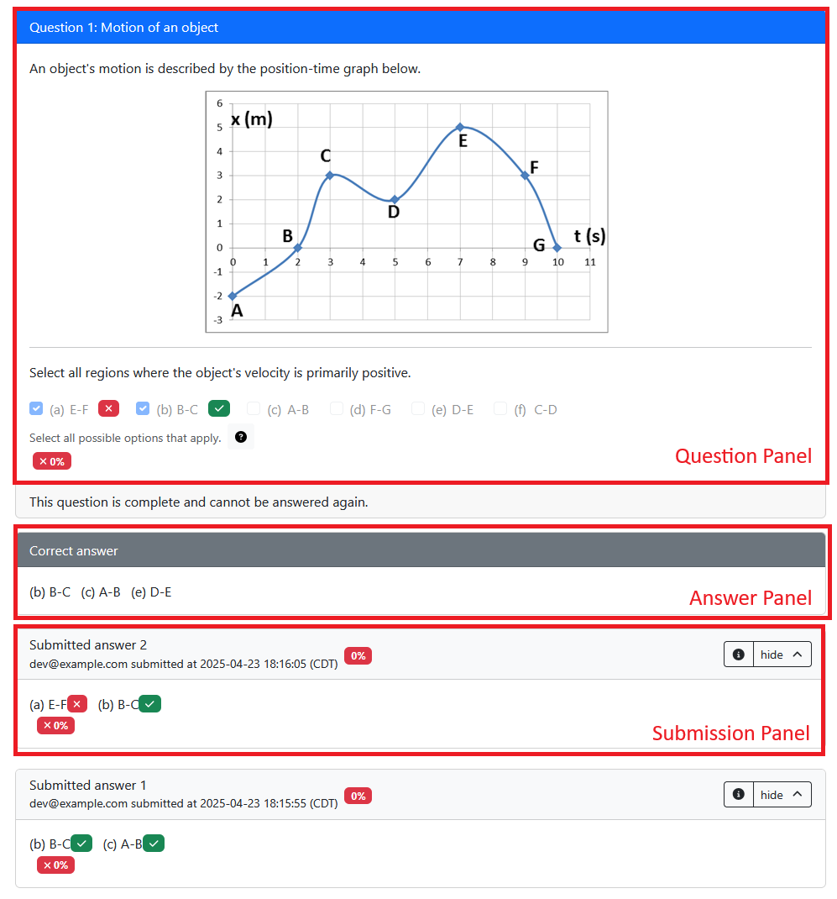

# Elements for `question.html`

PrairieLearn [questions](../question/overview.md) are built from `pl-*` tags inside [`question.html`](../question/template.md) ("elements"). These elements define the behavior of the question: what the student sees, what they input, and how it is graded. This page lists every element grouped by what you're trying to do. If you don't find the element / behavior you are looking for, consider using a [custom grade function](../question/server.md#step-5-grade) (recommended) or [building a custom element](../devElements.md).

!!! tip

    Already know which element you want? Use the navigation menu on the side, or see the [alphabetical reference](#reference) below.

The elements you choose will depend on the type and complexity of your question. A simple question may consist of a question panel prompt (using [`pl-question-panel`](pl-question-panel.md)) followed by a single [submission element](#submission-elements). For more complex prompts, you may need to include [display elements](#display-elements) such as figures, code, and sectioning. To provide additional feedback to students and graders, [additional content can be displayed conditionally](#question-flow-and-feedback) in different panels and contexts.

## Submission elements

Submission elements collect a response from the student. Within each subsection, elements are listed in roughly the order you should reach for them.

{layout="elk" pad="0" scale="1"}

### Selection

When students pick or arrange items from a fixed set.

- [`pl-multiple-choice`](pl-multiple-choice.md): Select one option from a list (or a dropdown).
- [`pl-checkbox`](pl-checkbox.md): Select multiple options from a list.
- [`pl-matching`](pl-matching.md): Select a matching option for each entry in a group.
- [`pl-order-blocks`](pl-order-blocks.md): Select and arrange given blocks of code or text.

??? note "Decision flowchart"

    {layout="elk" pad="0" scale="1"}

### Numeric input

When the response is a number — integer, decimal, value with units, or a matrix.

- [`pl-number-input`](pl-number-input.md): Fill in a numerical value within a specific tolerance such as 3.14, -1.921, and so on.
- [`pl-integer-input`](pl-integer-input.md): Fill in an integer value such as -71, 0, 5, 21, and so on.
- [`pl-units-input`](pl-units-input.md): Fill in a number with units such as "1.5 m", "14 ms", "6.3 ft", and so on.
- [`pl-matrix-component-input`](pl-matrix-component-input.md): Fill in a matrix using a grid with one input per cell.
- [`pl-matrix-input`](pl-matrix-input.md): Supply a matrix in a supported programming language format.

??? note "Decision flowchart"

    {layout="elk" pad="0" scale="1"}

### Text & symbolic input

When the response is a string, an essay, or a math expression.

- [`pl-string-input`](pl-string-input.md): Fill in a string value such as `"Illinois"`, `"GATTACA"`, `"computer"`, and so on.
- [`pl-rich-text-editor`](pl-rich-text-editor.md): Provide an in-browser formattable text editor for open-ended responses and essays.
- [`pl-file-editor`](pl-file-editor.md): Provide an in-browser editor for longer-form code or raw text (also listed under [Code and files](#code-and-files)).
- [`pl-symbolic-input`](pl-symbolic-input.md): Fill in a symbolic expression such as `x^2`, `sin(z)`, `mc^2`, and so on.
- [`pl-big-o-input`](pl-big-o-input.md): Fill in a symbolic value representing asymptotic complexity.

??? note "Decision flowchart"

    {layout="elk" pad="0" scale="1"}

### Drawings & images

When the response is a drawing, diagram, or photo of handwritten work.

- [`pl-drawing`](../pl-drawing/index.md): Create an auto-gradable canvas from a pre-defined collection of graphic objects.
- [`pl-image-capture`](pl-image-capture.md): Capture images of handwritten work from a local camera or external device such as a phone or tablet.
- [`pl-excalidraw`](pl-excalidraw.md): Draw a vector diagram using [Excalidraw](https://github.com/excalidraw/excalidraw).
- [`pl-sketch`](pl-sketch.md): Auto-gradable sketches of curves and other mathematical objects (e.g., points, asymptotes, polygons).
- [`pl-file-upload`](pl-file-upload.md): Accept an image or document produced with an external tool (also listed under [Code and files](#code-and-files)).

??? note "Decision flowchart"

    {layout="elk" pad="0" scale="1"}

### Code and files

When the response is code or a file, written in the browser or uploaded from disk.

- [`pl-file-upload`](pl-file-upload.md): Provide a submission area to obtain a file with a specific naming scheme.
- [`pl-file-editor`](pl-file-editor.md): Provide an in-browser code editor for writing and submitting code.

For code that needs a richer environment (multiple files, a terminal, an IDE, or a build/run loop), use a [workspace](../workspaces/index.md) with the [`<pl-workspace>`](../workspaces/index.md) element to embed the workspace launcher in the question.

??? note "Decision flowchart"

    {layout="elk" pad="0" scale="1"}

## Display elements

Display elements render content to students — figures, code, data, files, and layout wrappers — without capturing any submission.

### Media & figures

For showing images, plots, graphs, or downloadable files alongside the question.

- [`pl-figure`](pl-figure.md): Embed an image file in the question.
- [`pl-file-download`](pl-file-download.md): Enable file downloads for data-centric questions.
- [`pl-graph`](pl-graph.md): Display graphs using [GraphViz DOT notation](https://graphviz.org/doc/info/lang.html), an adjacency matrix, or a [`networkx`](https://networkx.org/) graph.

### Code, data & variables

For showing pre-formatted code snippets, data frames, matrices, or Python variable values.

- [`pl-code`](pl-code.md): Display code rendered with the appropriate syntax highlighting.
- [`pl-python-variable`](pl-python-variable.md): Display formatted output of Python variables.
- [`pl-dataframe`](pl-dataframe.md): Display DataFrames with various options.
- [`pl-matrix-latex`](pl-matrix-latex.md): Display matrices using appropriate LaTeX commands for use in a mathematical expression.
- [`pl-variable-output`](pl-variable-output.md): Display matrices in code form for supported programming languages.
- [`pl-external-grader-variables`](pl-external-grader-variables.md): Display expected and given variables for [questions using the Python grader](../python-grader/index.md).

### Layout & content wrappers

For wrapping or templating content rather than rendering a specific data type.

- [`pl-card`](pl-card.md): Display content within a card-styled component.
- [`pl-template`](pl-template.md): Display content from mustache templates.
- [`pl-overlay`](pl-overlay.md): Layer elements on top of one another at specific positions — commonly used to place input fields over a [`pl-figure`](pl-figure.md) or [`pl-drawing`](../pl-drawing/index.md) for labeled-diagram questions.
- [`pl-hidden-hints`](pl-hidden-hints.md): Reveal hints in the question prompt progressively as a student submits more on the current variant.

## Question flow and feedback

These elements determine what students see at each stage of the question lifecycle — the question prompt, the submitted answer, and any feedback shown after grading.

### Standard question panels

The three primary content panels shown to students throughout the question lifecycle.

- [`pl-question-panel`](pl-question-panel.md): Content to only show in the question panel. The actual question prompt should be placed here.
- [`pl-submission-panel`](pl-submission-panel.md): Content to only show in the submission panel. Additional feedback should be placed here.
- [`pl-answer-panel`](pl-answer-panel.md): Content to only show in the answer panel. Additional details about the correct answer should be placed here.

??? note "What the panels look like"

    

### Conditional visibility

For making content appear in only some panels, or only during specific grading workflows.

- [`pl-hide-in-panel`](pl-hide-in-panel.md): Hide content in one or more display panels.
- [`pl-hide-in-manual-grading`](pl-hide-in-manual-grading.md): Hide content in the manual grading page.
- [`pl-manual-grading-only`](pl-manual-grading-only.md): Show content only during manual grading.

### Submission feedback

For showing what the student submitted and the results that come back from grading.

- [`pl-file-preview`](pl-file-preview.md): Display a preview of submitted files.
- [`pl-xss-safe`](pl-xss-safe.md): Sanitize student-provided HTML before displaying it back to the student or grader.
- [`pl-external-grader-results`](pl-external-grader-results.md): Display results from questions that are externally graded.

## Reference

| Element                                                           | Type           | Purpose                                       |
| ----------------------------------------------------------------- | -------------- | --------------------------------------------- |
| [`pl-answer-panel`](pl-answer-panel.md)                           | Panel          | Show only in the answer panel.                |
| [`pl-big-o-input`](pl-big-o-input.md)                             | Submission     | Asymptotic complexity expression.             |
| [`pl-card`](pl-card.md)                                           | Display        | Card-styled content wrapper.                  |
| [`pl-checkbox`](pl-checkbox.md)                                   | Submission     | Select multiple options from a list/dropdown. |
| [`pl-code`](pl-code.md)                                           | Display        | Syntax-highlighted code.                      |
| [`pl-dataframe`](pl-dataframe.md)                                 | Display        | Render a DataFrame.                           |
| [`pl-drawing`](../pl-drawing/index.md)                            | Submission     | Auto-gradable graphical canvas.               |
| [`pl-dropdown`](pl-dropdown.md)                                   | **Deprecated** | See [migration](#deprecated-elements).        |
| [`pl-excalidraw`](pl-excalidraw.md)                               | Submission     | Draw a free-form diagram via Excalidraw.      |
| [`pl-external-grader-results`](pl-external-grader-results.md)     | Panel          | External grader output.                       |
| [`pl-external-grader-variables`](pl-external-grader-variables.md) | Display        | Expected/given vars for external grading.     |
| [`pl-figure`](pl-figure.md)                                       | Display        | Display an image.                             |
| [`pl-file-download`](pl-file-download.md)                         | Display        | Provide downloadable files.                   |
| [`pl-file-editor`](pl-file-editor.md)                             | Submission     | In-browser code editor.                       |
| [`pl-file-preview`](pl-file-preview.md)                           | Display        | Preview submitted files.                      |
| [`pl-file-upload`](pl-file-upload.md)                             | Submission     | Upload files by name.                         |
| [`pl-graph`](pl-graph.md)                                         | Display        | Render a graph (DOT, networkx, adjacency).    |
| [`pl-hidden-hints`](pl-hidden-hints.md)                           | Panel          | Reveal hints progressively.                   |
| [`pl-hide-in-manual-grading`](pl-hide-in-manual-grading.md)       | Panel          | Hide content during manual grading.           |
| [`pl-hide-in-panel`](pl-hide-in-panel.md)                         | Panel          | Hide content in selected panels.              |
| [`pl-image-capture`](pl-image-capture.md)                         | Submission     | Capture image from camera or device.          |
| [`pl-integer-input`](pl-integer-input.md)                         | Submission     | Integer value.                                |
| [`pl-manual-grading-only`](pl-manual-grading-only.md)             | Panel          | Show only during manual grading.              |
| [`pl-matching`](pl-matching.md)                                   | Submission     | Match each entry to an option.                |
| [`pl-matrix-component-input`](pl-matrix-component-input.md)       | Submission     | Matrix entered cell-by-cell.                  |
| [`pl-matrix-input`](pl-matrix-input.md)                           | Submission     | Matrix in programming language syntax.        |
| [`pl-matrix-latex`](pl-matrix-latex.md)                           | Display        | Matrix as LaTeX.                              |
| [`pl-multiple-choice`](pl-multiple-choice.md)                     | Submission     | Select one option from a list.                |
| [`pl-number-input`](pl-number-input.md)                           | Submission     | Numeric value with tolerance.                 |
| [`pl-order-blocks`](pl-order-blocks.md)                           | Submission     | Arrange blocks of code or text.               |
| [`pl-overlay`](pl-overlay.md)                                     | Display        | Layer elements at specified positions.        |
| [`pl-prairiedraw-figure`](pl-prairiedraw-figure.md)               | **Deprecated** | See [migration](#deprecated-elements).        |
| [`pl-python-variable`](pl-python-variable.md)                     | Display        | Format a Python variable.                     |
| [`pl-question-panel`](pl-question-panel.md)                       | Panel          | Show only in the question panel.              |
| [`pl-rich-text-editor`](pl-rich-text-editor.md)                   | Submission     | Formattable text editor for essays.           |
| [`pl-sketch`](pl-sketch.md)                                       | Submission     | Sketch curves and math objects.               |
| [`pl-string-input`](pl-string-input.md)                           | Submission     | String value.                                 |
| [`pl-submission-panel`](pl-submission-panel.md)                   | Panel          | Show only in the submission panel.            |
| [`pl-symbolic-input`](pl-symbolic-input.md)                       | Submission     | Symbolic math expression.                     |
| [`pl-template`](pl-template.md)                                   | Display        | Render a mustache template.                   |
| [`pl-units-input`](pl-units-input.md)                             | Submission     | Number with units.                            |
| [`pl-variable-output`](pl-variable-output.md)                     | Display        | Matrix as code in supported languages.        |
| [`pl-variable-score`](pl-variable-score.md)                       | **Deprecated** | See [migration](#deprecated-elements).        |
| [`pl-xss-safe`](pl-xss-safe.md)                                   | Display        | Sanitize HTML content.                        |

## Deprecated elements

!!! warning

    The elements below are still supported for backwards compatibility but should not be used in new questions.

| Element                                             | Use instead                                                                                                                                                        |
| --------------------------------------------------- | ------------------------------------------------------------------------------------------------------------------------------------------------------------------ |
| [`pl-dropdown`](pl-dropdown.md)                     | [`pl-multiple-choice`](pl-multiple-choice.md) with `display="dropdown"`, or [`pl-matching`](pl-matching.md) for multiple linked dropdowns sharing the same options |
| [`pl-prairiedraw-figure`](pl-prairiedraw-figure.md) | [`pl-drawing`](../pl-drawing/index.md)                                                                                                                             |
| [`pl-variable-score`](pl-variable-score.md)         | Not needed, all submission elements include score display options.                                                                                                 |

<!-- markdownlint-disable-next-line MD033 -->

