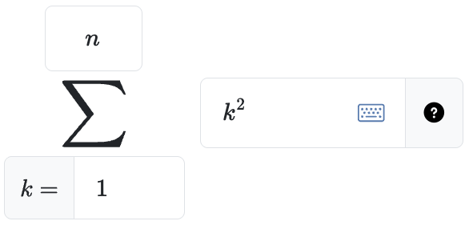
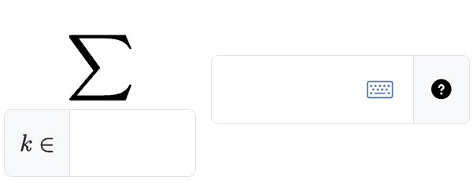
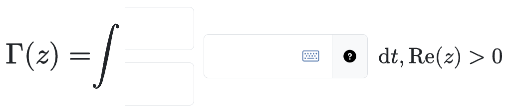
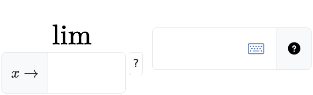
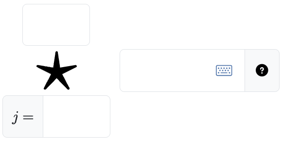

# `pl-big-operator-input` element

Displays an indexed big operator, such as a sum, integral, or limit. Students enter the indexing values and body in separate fields, and PrairieLearn stores them as one combined answer.

The fields accept the same symbolic syntax as [`pl-symbolic-input`](pl-symbolic-input.md).

## Sample element

```html {doctest-name="test_sample_element" title="question.html"}
<pl-big-operator-input
  answers-name="total"
  correct-answer="Sum(k**2, (k, 1, n))"
  variables="n"
></pl-big-operator-input>
```



Every element requires a complete correct answer, either through `correct-answer` or `data["correct_answers"]` in `server.py`. The answer determines the operator, index variable, indexing, and limit direction. A `Custom(...)` answer also requires `operator-latex`. If you would like the element not to grade student submissions, set `grading-method='none'`.

## Customizations

| Attribute                     | Type                                                  | Default        | Description                                                                                                                                                                                         |
| ----------------------------- | ----------------------------------------------------- | -------------- | --------------------------------------------------------------------------------------------------------------------------------------------------------------------------------------------------- |
| `allow-complex`               | boolean                                               | false          | Whether to allow complex numbers. Students may use `i` or `j` as the imaginary unit.                                                                                                                |
| `allow-limit-direction-input` | boolean                                               | true           | Whether students choose the direction of a limit with `approaches` indexing. When `false`, the direction from the correct answer is fixed. This attribute is only valid with `approaches` indexing. |
| `allowed-blank`               | `"none"`, `"indices"`, `"body"`, or `"all"`           | `"none"`       | Which parts of the answer students may leave blank.                                                                                                                                                 |
| `answers-name`                | string                                                | —              | Name used to store the combined answer. This value must be unique within a question.                                                                                                                |
| `body-relative-weight`        | integer                                               | 3              | Weight of the body when `grading-method="component"`. Each indexing field has a weight of 1.                                                                                                        |
| `body-size`                   | integer                                               | 16             | Positive character width of the body field.                                                                                                                                                         |
| `correct-answer`              | string                                                | —              | Complete, inferable correct answer. It supplies the operator, index variable, indexing, and limit direction. Defaults to `data["correct_answers"][answers-name]`.                                   |
| `custom-functions`            | string                                                | —              | Comma-separated list of symbolic function names allowed in correct answers and student answers, such as `"f,g"`.                                                                                    |
| `display`                     | `"block"` or `"inline"`                               | `"block"`      | How to display the input. Block inputs are horizontally centered and retain their large notation in answer and submission panels; inline inputs are vertically aligned with surrounding text.       |
| `display-log-as-ln`           | boolean                                               | false          | Whether to display `ln` rather than `log` in the input fields, submissions, and correct answers. Both names are accepted in student answers and treated as equivalent.                              |
| `grading-method`              | `"exact"`, `"component"`, `"equivalent"`, or `"none"` | `"equivalent"` | How to compare the student answer with the correct answer. See [Grading](#grading).                                                                                                                 |
| `imaginary-unit-for-display`  | `"i"` or `"j"`                                        | `"i"`          | Imaginary unit used for display. This does not affect parsing: students may enter either `i` or `j` when `allow-complex="true"`.                                                                    |
| `index-field-size`            | integer                                               | 7 or 10        | Positive character width of each indexing field. The default is 7 for bounds indexing and 10 for domain or approaches indexing.                                                                     |
| `operator-latex`              | string                                                | —              | Independent display override. It supplies a custom operator's required glyph or overrides an inferred built-in symbol.                                                                              |
| `prefix-latex`                | string                                                | —              | LaTeX displayed immediately before the big operator.                                                                                                                                                |
| `show-help-text`              | boolean                                               | true           | Whether to show symbolic-input help beside the body field.                                                                                                                                          |
| `suffix-latex`                | string                                                | —              | LaTeX displayed immediately after the big operator.                                                                                                                                                 |
| `variables`                   | string                                                | —              | Comma-separated list of allowed symbols in addition to the index variable, such as `"Gamma,k,N"`.                                                                                                   |
| `weight`                      | integer                                               | 1              | Weight used when computing a weighted average score across elements.                                                                                                                                |

## Operators and indexing

The correct answer determines which fields appear:

- `bounds` displays a lower bound, an upper bound, and a body.
- `domain` displays a domain and a body.
- `approaches` displays a target value and a body.

The supported complete-answer operators and indexing forms are:

| Operator         | Symbol                | Supported indexing               |
| ---------------- | --------------------- | -------------------------------- |
| `sum`            | $\sum$                | `bounds`, `domain`               |
| `product`        | $\prod$               | `bounds`, `domain`               |
| `integral`       | $\int$                | `bounds`, `domain`               |
| `limit`          | $\lim$                | `approaches`                     |
| `union`          | $\bigcup$             | `bounds`, `domain`               |
| `intersection`   | $\bigcap$             | `bounds`, `domain`               |
| `disjoint-union` | $\bigsqcup$           | `bounds`, `domain`               |
| `min`            | $\min$                | `bounds`, `domain`               |
| `max`            | $\max$                | `bounds`, `domain`               |
| `custom`         | From `operator-latex` | `bounds`, `domain`, `approaches` |

### Field types

The element infers each field's accepted type from the indexing and operator. The same policy applies to correct-answer components and student submissions:

| Field             | Accepted type                                                                                      |
| ----------------- | -------------------------------------------------------------------------------------------------- |
| Lower bound       | Expression                                                                                         |
| Upper bound       | Expression                                                                                         |
| Approaches target | Expression                                                                                         |
| Domain            | Set, or a bare symbol representing a set                                                           |
| Operator body     | Set-valued for union, intersection, and disjoint union; expression-valued for every other operator |

Set-valued fields accept set notation, such as `{1, 2}` or `[0, 1]`, and bare symbols whose members are not known at parse time. Declare non-index symbols with `variables`. Unlike `pl-symbolic-input`, this element does not have an `allowed-types` attribute; authors cannot override the inferred policy on the parent element.



The `prefix-latex` and `suffix-latex` attributes place additional notation immediately before and after the big operator. For example, they can present an input as part of a larger equation:



For a limit with `approaches` indexing, students choose the direction by default. The initial red `?` asks them to select `±` (two-sided), `−` (from the left), or `+` (from the right); it does not reveal the correct direction.



To display a fixed direction instead, set `allow-limit-direction-input="false"`:

```html {doctest-name="test_fixed_limit_direction"}
<pl-big-operator-input
  answers-name="right-limit"
  correct-answer="Limit(1/x, (x, 0, '+'))"
  allow-limit-direction-input="false"
></pl-big-operator-input>
```

For a domain integral, the domain appears as the only subscript, without an `index \in` prefix. For example, the element renders `\int_\Gamma z\,\mathrm{d}z`. Because SymPy does not have a lossless indexed representation for this notation, use `grading-method="exact"` or `grading-method="component"` when grading it, or `grading-method="none"` to display a correct answer without grading.

### Custom operators

Provide `operator-latex` with a complete `Custom(...)` answer to use a symbol that is not built in.

A custom correct answer uses one of these forms:

- Bounds: `Custom(body, (index, lower, upper))`
- Domain: `Custom(body, (index, domain))`
- Approaches: `Custom(body, (index, target, direction))`

Valid approaches directions are `"+"`, `"-"`, and `"+-"`.



```html {doctest-name="test_custom_bounds"}
<pl-big-operator-input
  answers-name="example-custom"
  correct-answer="Custom(j**2, (j, 1, 10))"
  operator-latex="\displaystyle{\Huge\bigstar{}}"
  grading-method="component"
></pl-big-operator-input>
```

Custom operators also support `Limit`-like syntax:

```html {doctest-name="test_custom_approaches"}
<pl-big-operator-input
  answers-name="evaluation"
  correct-answer="Custom(f(x), (x, 0, '+-'))"
  operator-latex="\operatorname{eval}"
  custom-functions="f"
  grading-method="component"
></pl-big-operator-input>
```

Custom operators change the displayed symbol and use the standard indexing forms. They do not define a new SymPy operation. As a result:

- A custom operator does not support `grading-method="equivalent"`. Use `exact` or `component` grading instead, or `none` to display the correct answer without grading.
- `operator-latex` is required. It is rendered as a `\mathop` and controls presentation only; it does not define parsing or mathematical behavior.

## Correct answers

### Complete expressions

A correct answer must be a complete, inferable representation that supplies the operator, index variable, indexing, and limit direction. Supported strings begin with `Sum`, `Product`, `Integral`, `Limit`, `Union`, `Intersection`, `DisjointUnion`, `Min`, `Max`, or `Custom`.

The operator and tuple arguments determine the indexing:

In the table, `Name` means any supported operator name other than `Limit`.

| Complete answer form                                               | Inferred indexing |
| ------------------------------------------------------------------ | ----------------- |
| `Name(body, (index, domain))`                                      | `domain`          |
| `Name(body, (index, lower, upper))`                                | `bounds`          |
| `Limit(body, (index, target, direction))`                          | `approaches`      |
| `Custom(body, (index, target, direction))` with a quoted direction | `approaches`      |

For example, the following element infers a product operator, index `k`, and `bounds` indexing:

```html {doctest-name="test_product_correct_answer"}
<pl-big-operator-input
  answers-name="total"
  correct-answer="Product(k + 1, (k, 1, 4))"
></pl-big-operator-input>
```

A domain integral infers `domain` indexing with Greek latex:

```html {doctest-name="test_domain_integral_correct_answer"}
<pl-big-operator-input
  answers-name="contour"
  correct-answer="Integral(z**2, (z, Gamma))"
  variables="Gamma"
  grading-method="component"
></pl-big-operator-input>
```

For a limit, use `Limit(body, (index, target, direction))`. The direction may be `"+"` (from the right), `"-"` (from the left), or `"+-"` (two-sided).

In this example, the element infers the operator, `approaches` indexing, and two-sided direction. The student must still choose the direction from the initially unanswered `?` control:

```html {doctest-name="test_limit_correct_answer"}
<pl-big-operator-input
  answers-name="sinc-limit"
  correct-answer="Limit(sin(x) / x, (x, 0, '+-'))"
></pl-big-operator-input>
```

The complete expression may also be a canonical `big_operator` dictionary or a supported PrairieLearn SymPy JSON dictionary. A canonical dictionary identifies its operator and index with the `operator` and `index` fields. SymPy JSON supports `Sum`, `Product`, `Integral`, and `Limit` expressions. Raw SymPy objects are not supported because values in `data["correct_answers"]` must be JSON-serializable. Malformed and unrecognized representations are rejected.

### Setting the correct answer in `server.py`

<!-- doctest-only: before-each
```python
import prairielearn as pl
import prairielearn.sympy_utils as psu
import sympy
```
-->

Answers assigned in `server.py` must be JSON-serializable. Convert a supported SymPy expression to a string or use `prairielearn.sympy_utils.sympy_to_json`; do not assign a raw SymPy object to `data`.

<!-- doctest-visible -->

```python {doctest-name="test_sympy_json_correct_answer" title="server.py"}
import prairielearn.sympy_utils as psu
import sympy


def generate(data):
    k = sympy.Symbol("k")
    answer = sympy.Product(k + 1, (k, 1, 4))
    data["correct_answers"]["total"] = psu.sympy_to_json(answer)
    # Alternatively: data["correct_answers"]["total"] = str(answer)
```

<!-- doctest-only
```python {doctest-name="test_string_correct_answer" title="server.py"}
def generate(data):
    k = sympy.Symbol("k")
    answer = sympy.Product(k + 1, (k, 1, 4))
    data["correct_answers"]["total"] = str(answer)
```
-->

PrairieLearn accepts string and SymPy JSON representations of a single-variable `sympy.Sum`, `sympy.Product`, or `sympy.Integral`, as well as `sympy.Limit`. A two-item integral tuple creates `domain` indexing, while a three-item tuple creates `bounds` indexing.

Use `pl.big_operator_to_json()` to construct a canonical answer from labelled SymPy values or strings. This is especially useful for custom operators, which cannot be represented by a SymPy expression alone:

<!-- doctest-visible: before-next -->

```python {doctest-name="test_custom_canonical_correct_answer" title="server.py"}
import prairielearn as pl
import sympy


def generate(data):
    data["correct_answers"]["evaluation"] = pl.big_operator_to_json(
        operator="custom",
        indexing="approaches",
        index="x",
        target="0",
        direction="two-sided",
        body=sympy.Function("f")(sympy.Symbol("x")),
    )
```

```html {doctest-name="test_custom_canonical_element" title="question.html"}
<pl-big-operator-input
  answers-name="evaluation"
  operator-latex="\operatorname{eval}"
  custom-functions="f"
  grading-method="component"
></pl-big-operator-input>
```

It also serializes a `BigOperator` returned by `pl.json_to_big_operator()`, allowing a validated structured answer to be round-tripped as canonical JSON.

The variadic SymPy forms `Union`, `Intersection`, `DisjointUnion`, `Min`, and `Max` do not preserve an indexed complete expression. For these operators, use a string with `(index, domain)` or `(index, lower, upper)` as the second argument:

```html {doctest-name="test_set_correct_answer" title="question.html"}
<pl-big-operator-input
  answers-name="sets"
  correct-answer="Union({k, -k}, (k, {1, 2}))"
  grading-method="exact"
></pl-big-operator-input>
```

The same syntax supports `Intersection`, `DisjointUnion`, `Min`, and `Max`. The element normalizes these strings without evaluating away the index or indexing data.

### Machine-readable answer format

Every successfully prepared correct answer and successfully parsed student answer uses a flat, version 1 dictionary. Mathematical values use `sympy_to_json(..., allow_sets=True)`:

<!-- doctest-only: before-next
```python
k, n = sympy.symbols("k n")
```
-->

```python {doctest-name="test_canonical_answer_dictionary"}
# Canonical representation of Sum(k**2, (k, 1, n))
{
    "_type": "big_operator",
    "_version": 1,
    "operator": "sum",
    "indexing": "bounds",
    "index": psu.sympy_to_json(k),
    "lower": psu.sympy_to_json(sympy.Integer(1)),
    "upper": psu.sympy_to_json(n),
    "body": psu.sympy_to_json(k**2),
}
```

The fields depend on the indexing:

- Bounds answers use `lower`, `upper`, and `body`.
- Domain answers use `domain` and `body`.
- Approaches answers use `target`, `direction`, and `body`.
- Custom answers include `operator_latex`; built-in answers do not.

When direction input is enabled, the student's raw selection is stored as `<answers-name>-direction` and copied to the canonical `direction` field. When direction input is disabled, the correct-answer direction is inserted directly. The outer `_type` differs from PrairieLearn's reserved `sympy` leaf type.

### Accessing structured answers in `server.py`

Use [`pl.json_to_big_operator()`][prairielearn.big_operator.json_to_big_operator] to validate the combined answer and decode its mathematical fields to SymPy values. Check the `indexing` field before accessing indexing-specific fields:

```python {doctest-name="test_structured_answer_grading" title="server.py"}
import prairielearn as pl


def grade(data):
    submitted_json = data["submitted_answers"].get("total")
    if not isinstance(submitted_json, dict):
        return

    submitted = pl.json_to_big_operator(submitted_json)
    correct = pl.json_to_big_operator(data["correct_answers"]["total"])

    if submitted["indexing"] == "bounds" and correct["indexing"] == "bounds":
        submitted_body = submitted["body"]
        correct_body = correct["body"]
        submitted_lower = submitted["lower"]
        correct_lower = correct["lower"]
        # Apply custom grading logic to the decoded SymPy values.
```

After element processing:

- `correct_answers[answers-name]` contains the canonical correct answer.
- `submitted_answers[answers-name]` contains a canonical dictionary when parsing succeeds, `""` for an allowed blank answer, or `None` when parsing fails.
- Internal field names such as `<answers-name>-body` and `<answers-name>-start` remain available in `raw_submitted_answers` and `format_errors` for redisplay and field-specific feedback. They are not separate processed answers.

## Grading

The `grading-method` attribute supports four modes:

| Method       | Behavior                                                                                                                                                                 |
| ------------ | ------------------------------------------------------------------------------------------------------------------------------------------------------------------------ |
| `exact`      | Requires the operator, indexing, direction, index, and every SymPy component to match exactly.                                                                           |
| `equivalent` | Builds complete SymPy expressions and checks whether they are mathematically equivalent. It first checks structural equality, then tests whether the difference is zero. |
| `component`  | Checks each visible field separately for mathematical equivalence. This method does not change how the correct answer is specified.                                      |
| `none`       | Accepts any input without assigning a score. (Careful: the score default is 0!) The configured correct answer is still displayed in the answer panel.                    |

For domain equivalence, the element expands only a concrete `FiniteSet`. A symbolic or infinite domain fails with an explicit error instead of being expanded.

Blank-answer validation is controlled separately by `allowed-blank`. A student-entered direction is part of the indexing, so `allowed-blank="indices"` and `allowed-blank="all"` allow the direction to remain unanswered.

## Example implementations

- [element/bigOperatorInput]

## See also

- [`pl-symbolic-input` for mathematical expression input](pl-symbolic-input.md)

---

[element/bigoperatorinput]: https://github.com/PrairieLearn/PrairieLearn/tree/master/exampleCourse/questions/element/bigOperatorInput
