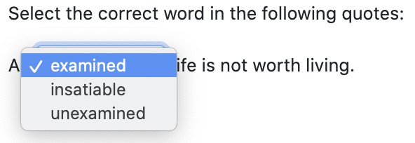

### `pl-dropdown` element

!!! warning

    Instructors are strongly encouraged to avoid `pl-dropdown` in newer questions. For questions with a single dropdown, a better alternative is to use [`pl-multiple-choice`](pl-multiple-choice.md), setting the attribute `display="dropdown"`. Using the multiple choice element provides better support for formatted option text (including Math formulas), randomized selection and ordering of options (both correct options and distractors) and partial scores for distractors. For questions using multiple dropdowns with the same set of options, the [`pl-matching`](pl-matching.md) element provides a better user experience and interface.

Select the correct answer from a drop-down **select** menu list of potential answers. The potential options are listed in the inner HTML of a `<pl-answer></pl-answer>` element (e.g. `<pl-answer>Possible Answer 1</pl-answer>`).

#### Sample element



```html title="question.html"
<p>Select the correct word in the following quotes:</p>
The
<pl-dropdown answers-name="aristotle" blank="true">
  {{#params.aristotle}}
  <pl-answer correct="{{tag}}">{{ans}}</pl-answer>
  {{/params.aristotle}}
</pl-dropdown>
is more than the sum of its parts.
<p></p>

A
<pl-dropdown sort="ascend" answers-name="hume">
  <pl-answer correct="true">wise</pl-answer>
  <pl-answer correct="false">clumsy</pl-answer>
  <pl-answer correct="false">reckless</pl-answer>
</pl-dropdown>
man proportions his belief to the evidence.
<p></p>
```

```python title="server.py"
def generate(data):

    QUESTION1 = "aristotle"

    data["params"][QUESTION1] = [
        {"tag": "true", "ans": "whole"},
        {"tag": "false", "ans": "part"},
        {"tag": "false", "ans": "inverse"}
    ]
```

#### Customizations

| Attribute      | Type    | Default | Description                                                                                                                                                          |
| -------------- | ------- | ------- | -------------------------------------------------------------------------------------------------------------------------------------------------------------------- |
| `answers-name` | string  | —       | Variable name to store data in. Note that this attribute has to be unique within a question, i.e., no value for this attribute should be repeated within a question. |
| `weight`       | integer | 1       | Weight to use when computing a weighted average score over elements.                                                                                                 |
| `sort`         | string  | random  | Options are 'random', 'ascend', and 'descend', and 'fixed' for drop-down answers.                                                                                    |
| `blank`        | boolean | True    | Option to add blank dropdown entry as default selection in drop-down list.                                                                                           |
| `allow-blank`  | boolean | false   | Whether an empty submission is allowed. By default, empty dropdowns will not be graded (invalid format).                                                             |
| `aria-label`   | string  | None    | An accessible label for the element.                                                                                                                                 |

#### Example implementation

- [demo/overlayDropdown]
- [element/dropdown]

---


<!-- Reference style links for element implementations -->

<!-- External Grade Questions -->

[demo/autograder/codeeditor]: https://github.com/PrairieLearn/PrairieLearn/tree/master/exampleCourse/questions/demo/autograder/codeEditor
[demo/autograder/codeupload]: https://github.com/PrairieLearn/PrairieLearn/tree/master/exampleCourse/questions/demo/autograder/codeUpload
[demo/autograder/python/square]: https://github.com/PrairieLearn/PrairieLearn/tree/master/exampleCourse/questions/demo/autograder/python/square
[demo/autograder/python/numpy]: https://github.com/PrairieLearn/PrairieLearn/tree/master/exampleCourse/questions/demo/autograder/python/numpy
[demo/autograder/python/pandas]: https://github.com/PrairieLearn/PrairieLearn/tree/master/exampleCourse/questions/demo/autograder/python/pandas
[demo/autograder/python/plots]: https://github.com/PrairieLearn/PrairieLearn/tree/master/exampleCourse/questions/demo/autograder/python/plots
[demo/autograder/python/random]: https://github.com/PrairieLearn/PrairieLearn/tree/master/exampleCourse/questions/demo/autograder/python/random
[demo/autograder/python/orderblocksrandomparams]: https://github.com/PrairieLearn/PrairieLearn/tree/master/exampleCourse/questions/demo/autograder/python/orderBlocksRandomParams
[demo/autograder/python/orderblocksaddnumpy]: https://github.com/PrairieLearn/PrairieLearn/tree/master/exampleCourse/questions/demo/autograder/python/orderBlocksAddNumpy

<!-- Manual grading examples -->

[demo/manualgrade/codeupload]: https://github.com/PrairieLearn/PrairieLearn/tree/master/exampleCourse/questions/demo/manualGrade/codeUpload

<!-- High quality questions -->

[demo/calculation]: https://github.com/PrairieLearn/PrairieLearn/tree/master/exampleCourse/questions/demo/calculation
[demo/fixedcheckbox]: https://github.com/PrairieLearn/PrairieLearn/tree/master/exampleCourse/questions/demo/fixedCheckbox
[demo/markdowneditorlivepreview]: https://github.com/PrairieLearn/PrairieLearn/tree/master/exampleCourse/questions/demo/markdownEditorLivePreview
[demo/matrixcomplexalgebra]: https://github.com/PrairieLearn/PrairieLearn/tree/master/exampleCourse/questions/demo/matrixComplexAlgebra
[demo/overlaydropdown]: https://github.com/PrairieLearn/PrairieLearn/tree/master/exampleCourse/questions/demo/overlayDropdown
[demo/randomcheckbox]: https://github.com/PrairieLearn/PrairieLearn/tree/master/exampleCourse/questions/demo/randomCheckbox
[demo/randomdataframe]: https://github.com/PrairieLearn/PrairieLearn/tree/master/exampleCourse/questions/demo/randomDataFrame
[demo/randommultiplechoice]: https://github.com/PrairieLearn/PrairieLearn/tree/master/exampleCourse/questions/demo/randomMultipleChoice
[demo/randomplot]: https://github.com/PrairieLearn/PrairieLearn/tree/master/exampleCourse/questions/demo/randomPlot
[demo/proofblocks]: https://github.com/PrairieLearn/PrairieLearn/tree/master/exampleCourse/questions/demo/proofBlocks

<!-- Element option overview questions -->

[element/checkbox]: https://github.com/PrairieLearn/PrairieLearn/tree/master/exampleCourse/questions/element/checkbox
[element/bigoinput]: https://github.com/PrairieLearn/PrairieLearn/tree/master/exampleCourse/questions/element/bigOInput
[element/hiddenhints]: https://github.com/PrairieLearn/PrairieLearn/tree/master/exampleCourse/questions/element/hiddenHints
[element/code]: https://github.com/PrairieLearn/PrairieLearn/tree/master/exampleCourse/questions/element/code
[element/dropdown]: https://github.com/PrairieLearn/PrairieLearn/tree/master/exampleCourse/questions/element/dropdown
[element/excalidraw]: https://github.com/PrairieLearn/PrairieLearn/tree/master/exampleCourse/questions/element/excalidraw
[element/figure]: https://github.com/PrairieLearn/PrairieLearn/tree/master/exampleCourse/questions/element/figure
[element/filedownload]: https://github.com/PrairieLearn/PrairieLearn/tree/master/exampleCourse/questions/element/fileDownload
[element/fileeditor]: https://github.com/PrairieLearn/PrairieLearn/tree/master/exampleCourse/questions/element/fileEditor
[element/graph]: https://github.com/PrairieLearn/PrairieLearn/tree/master/exampleCourse/questions/element/graph
[element/imageCapture]: https://github.com/PrairieLearn/PrairieLearn/tree/master/exampleCourse/questions/element/imageCapture
[element/integerinput]: https://github.com/PrairieLearn/PrairieLearn/tree/master/exampleCourse/questions/element/integerInput
[element/matching]: https://github.com/PrairieLearn/PrairieLearn/tree/master/exampleCourse/questions/element/matching
[element/matrixcomponentinput]: https://github.com/PrairieLearn/PrairieLearn/tree/master/exampleCourse/questions/element/matrixComponentInput
[element/matrixlatex]: https://github.com/PrairieLearn/PrairieLearn/tree/master/exampleCourse/questions/element/matrixLatex
[element/multiplechoice]: https://github.com/PrairieLearn/PrairieLearn/tree/master/exampleCourse/questions/element/multipleChoice
[element/numberinput]: https://github.com/PrairieLearn/PrairieLearn/tree/master/exampleCourse/questions/element/numberInput
[element/unitsinput]: https://github.com/PrairieLearn/PrairieLearn/tree/master/exampleCourse/questions/element/unitsInput
[element/orderblocks]: https://github.com/PrairieLearn/PrairieLearn/tree/master/exampleCourse/questions/element/orderBlocks
[element/orderblocksoptional]: https://github.com/PrairieLearn/PrairieLearn/tree/master/exampleCourse/questions/element/orderBlocksOptional
[element/overlay]: https://github.com/PrairieLearn/PrairieLearn/tree/master/exampleCourse/questions/element/overlay
[element/panels]: https://github.com/PrairieLearn/PrairieLearn/tree/master/exampleCourse/questions/element/panels
[element/prairiedrawfigure]: https://github.com/PrairieLearn/PrairieLearn/tree/master/testCourse/questions/prairieDrawFigure
[element/pythonvariable]: https://github.com/PrairieLearn/PrairieLearn/tree/master/exampleCourse/questions/element/pythonVariable
[element/dataframe]: https://github.com/PrairieLearn/PrairieLearn/tree/master/exampleCourse/questions/element/dataframe
[element/richTextEditor]: https://github.com/PrairieLearn/PrairieLearn/tree/master/exampleCourse/questions/element/richTextEditor
[element/stringinput]: https://github.com/PrairieLearn/PrairieLearn/tree/master/exampleCourse/questions/element/stringInput
[element/symbolicinput]: https://github.com/PrairieLearn/PrairieLearn/tree/master/exampleCourse/questions/element/symbolicInput
[element/template]: https://github.com/PrairieLearn/PrairieLearn/tree/master/exampleCourse/questions/element/template
[element/variableoutput]: https://github.com/PrairieLearn/PrairieLearn/tree/master/exampleCourse/questions/element/variableOutput
[element/xsssafe]: https://github.com/PrairieLearn/PrairieLearn/tree/master/exampleCourse/questions/element/xssSafe
[element/card]: https://github.com/PrairieLearn/PrairieLearn/tree/master/exampleCourse/questions/element/card

<!-- Advanced uses of PL features -->

[demo/custom/gradefunction]: https://github.com/PrairieLearn/PrairieLearn/tree/master/exampleCourse/questions/demo/custom/gradeFunction

<!-- Misc application questions -->

### `pl-variable-score` element

Display the partial score for a specific answer variable.

!!! warning

    This element is **deprecated** and should not be used in new questions.

#### Sample element

```html title="question.html"
<pl-variable-score answers-name="v_avg"></pl-variable-score>
```

#### Customizations

| Attribute      | Type   | Default | Description                         |
| -------------- | ------ | ------- | ----------------------------------- |
| `answers-name` | string | —       | Variable name to display score for. |

---
