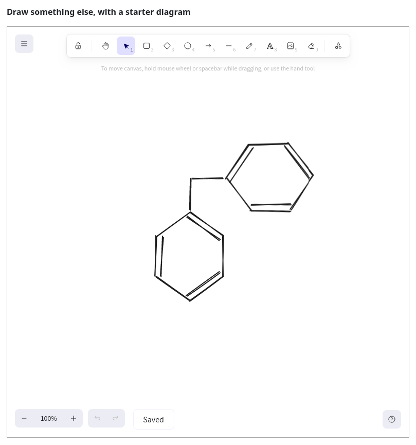

# `pl-excalidraw` element

Draw a vector diagram using [excalidraw](https://github.com/excalidraw/excalidraw).

Note that only manual grading is supported. For auto-gradable drawings, consider using [`pl-drawing`](../pl-drawing/index.md) or [`pl-sketch`](pl-sketch.md).



```html title="question.html"
<p>Draw something else, with a starter diagram</p>

<pl-excalidraw
  gradable="true"
  answers-name="vector"
  source-file-name="starter.excalidraw"
  directory="clientFilesQuestion"
  width="100%"
  height="600px"
></pl-excalidraw>
```

## Customizations

| Attribute          | Type                                                                           | Default   | Description                                                                                                             |
| ------------------ | ------------------------------------------------------------------------------ | --------- | ----------------------------------------------------------------------------------------------------------------------- |
| `answers-name`     | string                                                                         | —         | Unique name to identify the widget with. Drawing submissions are saved with this name. Required when `gradable` is set. |
| `directory`        | `"serverFilesCourse"`, `"clientFilesCourse"`, `"clientFilesQuestion"` or `"."` | `"."`     | Directory where the `"source-file-name"` is loaded from. By default, it refers to the question directory `"."`.         |
| `gradable`         | boolean                                                                        | "true"    | Whether a diagram accepts input from the user.                                                                          |
| `height`           | string                                                                         | `"800px"` | Height of the widget, compatible with the [CSS height][css-height-mdn] specification.                                   |
| `source-file-name` | string                                                                         | —         | Optional file to load as the starter diagram.                                                                           |
| `width`            | string                                                                         | `"100%"`  | Width of the widget, compatible with the [CSS width][css-width-mdn] specification.                                      |

The `width` and `height` attributes are used as CSS property values. Unitless numbers such as `height="900"` are invalid; use `height="900px"` for pixels.

## Accessibility

`pl-excalidraw` is a canvas-based drawing tool and is not fully accessible. While the toolbar can be reached with the keyboard, shapes cannot be drawn using the keyboard alone, and the drawing surface is not exposed to screen readers. If you use this element, consider providing an alternative version of the question for students who cannot use it, for example a freeform text input where they can describe the diagram in words.

[css-height-mdn]: https://developer.mozilla.org/en-US/docs/Web/CSS/height
[css-width-mdn]: https://developer.mozilla.org/en-US/docs/Web/CSS/width
