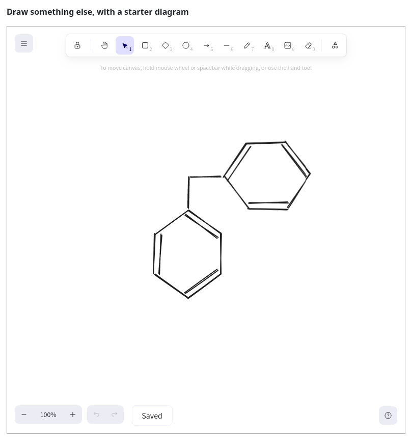

# `pl-excalidraw` element

Draw a vector diagram using [excalidraw](https://github.com/excalidraw/excalidraw). Only manual grading is supported.



```html title="question.html"
<p>Draw something else, with a starter diagram</p>

<pl-excalidraw
  gradable="true"
  answers-name="vector"
  source-file-name="starter.excalidraw"
  directory="clientFilesQuestion"
  width="100%"
  height="600px"
></pl-excalidraw>
```

## Customizations

| Attribute          | Type                                                                                                 | Default   | Description                                                                                                             |
| ------------------ | ---------------------------------------------------------------------------------------------------- | --------- | ----------------------------------------------------------------------------------------------------------------------- |
| `answers-name`     | string                                                                                               | —         | Unique name to identify the widget with. Drawing submissions are saved with this name. Required when `gradable` is set. |
| `directory`        | `"serverFilesCourse"`, `"clientFilesCourse"`, `"clientFilesQuestion"`, `"courseExtensions"` or `"."` | `"."`     | Directory where the `"source-file-name"` is loaded from. By default, it refers to the question directory `"."`.         |
| `gradable`         | boolean                                                                                              | "true"    | Whether a diagram accepts input from the user.                                                                          |
| `height`           | string                                                                                               | `"800px"` | Height of the widget, compatible with the [CSS width][css-width-mdn] specification.                                     |
| `source-file-name` | string                                                                                               | —         | Optional file to load as the starter diagram.                                                                           |
| `width`            | string                                                                                               | `"100%"`  | Width of the widget, compatible with the [CSS width][css-width-mdn] specification.                                      |

[css-width-mdn]: https://developer.mozilla.org/en-US/docs/Web/CSS/width
