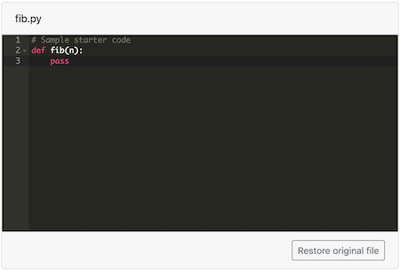

# `pl-file-editor` element

Provides an in-browser file editor that's compatible with the other file elements
and external grading system.

## Sample element



<!-- prettier-ignore -->
```html title="question.html"
<pl-file-editor
  file-name="fib.py"
  ace-mode="ace/mode/python"
  ace-theme="ace/theme/monokai"
>
def fib(n):
    pass
</pl-file-editor>
```

## Customizations

| Attribute            | Type    | Default              | description                                                                                                                                                                                                                                                                                                                                                                                                                                               |
| -------------------- | ------- | -------------------- | --------------------------------------------------------------------------------------------------------------------------------------------------------------------------------------------------------------------------------------------------------------------------------------------------------------------------------------------------------------------------------------------------------------------------------------------------------- |
| `ace-mode`           | string  | —                    | Specifies an Ace editor mode to enable things like intelligent code indenting and syntax highlighting. May be set to [a default Ace mode or an course-defined mode](#editor-modes).                                                                                                                                                                                                                                                                       |
| `ace-theme`          | string  | `"ace/theme/chrome"` | Specifies an Ace editor theme; see the full list of themes in the [Ace GitHub repository](https://github.com/ajaxorg/ace/tree/master/src/theme).                                                                                                                                                                                                                                                                                                          |
| `allow-blank`        | boolean | false                | Whether an empty submission is allowed.                                                                                                                                                                                                                                                                                                                                                                                                                   |
| `auto-resize`        | boolean | true                 | Automatically expand the editor panel to ensure all lines are present. Overrides any value set by `"max-lines"` and establishes a default of 18 lines for `"min-lines"` if not supplied. See Details below for notes.                                                                                                                                                                                                                                     |
| `directory`          | string  | See description      | Directory where the source file with existing code is to be found. Only useful if `source-file-name` is used. If it contains one of the special names `"clientFilesCourse"` or `"serverFilesCourse"`, then the source file name is read from the course's special directories, otherwise the directory is expected to be in the question's own directory. If not provided, the source file name is expected to be found in the question's main directory. |
| `file-name`          | string  | —                    | The name of this file; will be used to store this file in the `"_files"` submitted answer.                                                                                                                                                                                                                                                                                                                                                                |
| `focus`              | boolean | false                | Specifies that the editor should begin with the cursor captured and the editing pane focused. See Details below for notes.                                                                                                                                                                                                                                                                                                                                |
| `font-size`          | string  | `"12px"`             | Sets the font size for the Ace editor. Specified as a CSS-style size (e.g., `"1rem"`, `"110%"`, `"16pt"`, or `"20px"`).                                                                                                                                                                                                                                                                                                                                   |
| `max-lines`          | integer | —                    | Maximum number of lines the editor should display at once. Must be greater than `min-lines`.                                                                                                                                                                                                                                                                                                                                                              |
| `min-lines`          | integer | —                    | Minimum number of lines the editor should show initially.                                                                                                                                                                                                                                                                                                                                                                                                 |
| `normalize-to-ascii` | boolean | false                | Whether non-English characters (accents, non-latin alphabets, fancy quotes) should be normalized to equivalent English characters before submitting the file for grading.                                                                                                                                                                                                                                                                                 |
| `preview`            | string  | —                    | If set, provides a live preview mode for editing markup languages. Currently, `"html"`, `"markdown"`, or `"dot"` are available, though [additional languages are supported via extensions](#custom-preview-options).                                                                                                                                                                                                                                      |
| `source-file-name`   | string  | —                    | Name of the source file with existing code to be displayed in the browser text editor (instead of writing the existing code between the element tags as illustrated in the above code snippet).                                                                                                                                                                                                                                                           |

## Details

When using `auto-resize`, consider specifying a custom `min-lines` or pre-populating the code editor window with a code sample.
This will initialize the editor area with a sufficient number of lines to display all the code simultaneously without the need for scrolling.

The `focus` attribute defaults to `false`. Setting this to true will cause the file editor element to automatically capture the cursor focus when the question page is loaded, which may also cause the page to scroll down so that the file editor is in view, bypassing any written introduction. This may have negative implications for accessibility with screen readers, so use caution. If you have multiple file editors on the same question page, only one element should have `focus` set to true, or else the behavior may be unpredictable.

The contents of the file editor are only displayed by default in the question panel. If the contents are expected to be listed in the submission panel, they should be explicitly added using other elements such as [`pl-file-preview`](pl-file-preview.md) or [`pl-xss-safe`](pl-xss-safe.md).

### Editor modes

The `ace-mode` attribute is typically set to `ace/mode/<language_name>`, where `<language_name>` is the name of a language supported by the Ace editor (e.g., `ace/mode/python`, `ace/mode/c_cpp`, `ace/mode/java`, etc.). Ace supports a number of built-in modes from the list of modes in the [Ace GitHub repository](https://github.com/ajaxorg/ace/tree/master/src/mode).

Alternatively, instructors may define a custom mode, which can be an alternative for languages not natively supported by Ace, for course-created languages, or for cases where instructors may wish to limit the support for a language to a set of pre-determined features. The [Ace documentation](https://ace.c9.io/#nav=highlighter) provides more information on how to create custom modes. After creating the custom mode, save it as `ace/mode/mode-<language_name>.js` inside [`clientFilesQuestion` or `clientFilesCourse`](../clientServerFiles.md). The `pl-file-editor` element will automatically identify that a custom mode exists and load the custom mode file when the `ace-mode` attribute is set appropriately.

### Custom preview options

This element supports additional preview options through [element extensions](../elementExtensions.md). To provide this functionality, the extension must assign, to `window.PLFileEditor.prototype.preview.PREVIEW_TYPE` (where `PREVIEW_TYPE` is the value of the `preview` attribute), a function that converts a string representing the editor's content into suitable HTML content.

## Example implementations

- [element/fileEditor]
- [demo/autograder/codeEditor]

## See also

- [`pl-file-upload` to receive files as a submission](pl-file-upload.md)
- [`pl-file-preview` to display previously submitted files](pl-file-preview.md)
- [`pl-external-grader-results` to include output from autograded code](pl-external-grader-results.md)
- [`pl-code` to display blocks of code with syntax highlighting](pl-code.md)
- [`pl-string-input` for receiving a single string value](pl-string-input.md)

---

[demo/autograder/codeeditor]: https://github.com/PrairieLearn/PrairieLearn/tree/master/exampleCourse/questions/demo/autograder/codeEditor
[element/fileeditor]: https://github.com/PrairieLearn/PrairieLearn/tree/master/exampleCourse/questions/element/fileEditor
