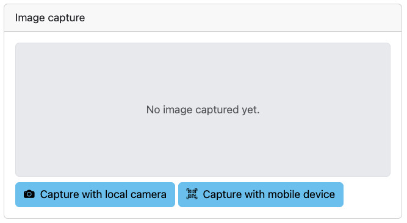

# `pl-image-capture` element

Provides a way for students to capture and submit an image as part of their answer using a local camera like a webcam or an external device such as a mobile phone or tablet camera.

## Sample element



```html title="question.html"
<pl-image-capture file-name="solution.jpeg" mobile-capture-enabled="true"></pl-image-capture>
```

## Customizations

| Attribute                | Type    | Default | description                                                                                                                                                                                                                                                                                                                                 |
| ------------------------ | ------- | ------- | ------------------------------------------------------------------------------------------------------------------------------------------------------------------------------------------------------------------------------------------------------------------------------------------------------------------------------------------- |
| `allow-blank`            | boolean | false   | When `true`, students can submit without capturing an image for this element. This is useful when a question has multiple `pl-image-capture` elements and students may not need all of them (e.g., some students fit their work in fewer images than others).                                                                               |
| `file-name`              | string  | —       | The name under which the captured image will be saved. This must end with `.jpeg` or `.jpg`, and be unique within a single question.                                                                                                                                                                                                        |
| `manual-upload-enabled`  | boolean | false   | When `true`, students can click "Upload image" to upload JPEG or PNG images already stored on their device. This is especially useful for students who write on a tablet and export their work as an image. In most cases, `manual-upload-enabled` should be `false` to ensure students submit original work.                               |
| `max-images`             | integer | 1       | The maximum number of images a student can capture in this element. When set to a value greater than 1, the element displays a carousel viewer where students can navigate between images and add, delete, and crop/rotate individual images using the toolbar buttons. Images are saved as `file-name`, `file-name-2`, `file-name-3`, etc. |
| `mobile-capture-enabled` | boolean | true    | When `true`, students can click "Capture with mobile device" to scan a QR code on a phone or tablet to a page where they can capture an image of their work. In most cases, this `mobile-capture-enabled` should be true.                                                                                                                   |

## Details

The `pl-image-capture` element is particularly useful for capturing handwritten work on paper, such as sketches or step-by-step calculations.

`pl-image-capture` allows users to submit images through their camera, whether it’s a local device like a webcam or an external device such as a mobile phone or tablet camera. Users can submit by capturing a new image with their camera or uploading existing images from their device (when `manual-upload-enabled` is `true`). `pl-image-capture` does not save images to their device.

A single question page can contain multiple `pl-image-capture` elements, each operating independently and saving files under its specified `file-name`.

### Multiple images per element

When `max-images` is set to a value greater than 1, a single `pl-image-capture` element can accept multiple images. The element displays a full-size carousel viewer where students can navigate between images using left/right buttons and add, delete, and crop/rotate individual images using the toolbar buttons. This is useful when students need to submit photos of multiple pages of handwritten work but the exact number of pages varies.

Images are named using the `file-name` attribute as a base: the first image keeps the original name (e.g., `work.jpg`), and subsequent images are named with a numeric suffix (e.g., `work-2.jpg`, `work-3.jpg`).

```html title="question.html"
<pl-image-capture file-name="work.jpg" max-images="5"></pl-image-capture>
```

In manual grading mode, staff can view submitted images in the submission panel and, if added, through the [`pl-file-preview`](pl-file-preview.md) element, where submitted images will appear under their associated `file-name`.

By default, the `mobile-capture-enabled` setting is `true`. We strongly recommend keeping mobile capture enabled for most questions to allow students to capture high-quality images easily.

Using mobile device capture in a local development environment requires additional setup. To use this feature locally, see the [Setting up external image capture locally](../dev-guide/configJson.md#setting-up-external-image-capture-locally) section of the server configuration guide.

## Example implementations

- [element/imageCapture]

## See also

- [`pl-file-preview` to display previously submitted files](pl-file-preview.md)

---

[element/imageCapture]: https://github.com/PrairieLearn/PrairieLearn/tree/master/exampleCourse/questions/element/imageCapture
