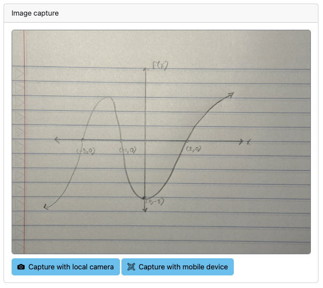

### `pl-image-capture` element

Provides a way for students to capture and submit an image as part of their answer using a local camera like a webcam or an external device such as a mobile phone or tablet camera.

#### Sample element



```html title="question.html"
<pl-image-capture file-name="solution.jpeg" mobile-capture-enabled="true"></pl-image-capture>
```

#### Customizations

| Attribute                | Type    | Default | description                                                                                                                                                                                                               |
| ------------------------ | ------- | ------- | ------------------------------------------------------------------------------------------------------------------------------------------------------------------------------------------------------------------------- |
| `file-name`              | string  | —       | The name under which the captured image will be saved. This must end with `.jpeg` or `.jpg`, and be unique within a single question.                                                                                      |
| `mobile-capture-enabled` | boolean | true    | When `true`, students can click "Capture with mobile device" to scan a QR code on a phone or tablet to a page where they can capture an image of their work. In most cases, this `mobile-capture-enabled` should be true. |

#### Details

The `pl-image-capture` element is particularly useful for capturing handwritten work on paper, such as sketches or step-by-step calculations.

`pl-image-capture` allows users to submit images through their camera, whether it’s a local device like a webcam or an external device such as a mobile phone or tablet camera. Users can only submit by capturing a new image with their camera; they cannot upload existing images from their device, and `pl-image-capture` does not save images to their device.

A single question page can contain multiple `pl-image-capture` elements, each operating independently and saving files under its specified `file-name`.

In manual grading mode, staff can view submitted images in the submission panel and, if added, through the [`pl-file-preview`](pl-file-preview.md) element, where submitted images will appear under their associated `file-name`.

By default, the `mobile-capture-enabled` setting is `true`. We strongly recommend keeping mobile capture enabled for most questions to allow students to capture high-quality images easily.

Using mobile device capture in a local development environment requires additional setup. To use this feature locally, see the [Setting up external image capture locally](../dev-guide/configJson.md#setting-up-external-image-capture-locally) section of the server configuration guide.

#### Example implementations

- [element/imageCapture]

#### See also

- [`pl-file-preview` to display previously submitted files](pl-file-preview.md)

---


<!-- Reference style links for element implementations -->

<!-- External Grade Questions -->

[demo/autograder/codeeditor]: https://github.com/PrairieLearn/PrairieLearn/tree/master/exampleCourse/questions/demo/autograder/codeEditor
[demo/autograder/codeupload]: https://github.com/PrairieLearn/PrairieLearn/tree/master/exampleCourse/questions/demo/autograder/codeUpload
[demo/autograder/python/square]: https://github.com/PrairieLearn/PrairieLearn/tree/master/exampleCourse/questions/demo/autograder/python/square
[demo/autograder/python/numpy]: https://github.com/PrairieLearn/PrairieLearn/tree/master/exampleCourse/questions/demo/autograder/python/numpy
[demo/autograder/python/pandas]: https://github.com/PrairieLearn/PrairieLearn/tree/master/exampleCourse/questions/demo/autograder/python/pandas
[demo/autograder/python/plots]: https://github.com/PrairieLearn/PrairieLearn/tree/master/exampleCourse/questions/demo/autograder/python/plots
[demo/autograder/python/random]: https://github.com/PrairieLearn/PrairieLearn/tree/master/exampleCourse/questions/demo/autograder/python/random
[demo/autograder/python/orderblocksrandomparams]: https://github.com/PrairieLearn/PrairieLearn/tree/master/exampleCourse/questions/demo/autograder/python/orderBlocksRandomParams
[demo/autograder/python/orderblocksaddnumpy]: https://github.com/PrairieLearn/PrairieLearn/tree/master/exampleCourse/questions/demo/autograder/python/orderBlocksAddNumpy

<!-- Manual grading examples -->

[demo/manualgrade/codeupload]: https://github.com/PrairieLearn/PrairieLearn/tree/master/exampleCourse/questions/demo/manualGrade/codeUpload

<!-- High quality questions -->

[demo/calculation]: https://github.com/PrairieLearn/PrairieLearn/tree/master/exampleCourse/questions/demo/calculation
[demo/fixedcheckbox]: https://github.com/PrairieLearn/PrairieLearn/tree/master/exampleCourse/questions/demo/fixedCheckbox
[demo/markdowneditorlivepreview]: https://github.com/PrairieLearn/PrairieLearn/tree/master/exampleCourse/questions/demo/markdownEditorLivePreview
[demo/matrixcomplexalgebra]: https://github.com/PrairieLearn/PrairieLearn/tree/master/exampleCourse/questions/demo/matrixComplexAlgebra
[demo/overlaydropdown]: https://github.com/PrairieLearn/PrairieLearn/tree/master/exampleCourse/questions/demo/overlayDropdown
[demo/randomcheckbox]: https://github.com/PrairieLearn/PrairieLearn/tree/master/exampleCourse/questions/demo/randomCheckbox
[demo/randomdataframe]: https://github.com/PrairieLearn/PrairieLearn/tree/master/exampleCourse/questions/demo/randomDataFrame
[demo/randommultiplechoice]: https://github.com/PrairieLearn/PrairieLearn/tree/master/exampleCourse/questions/demo/randomMultipleChoice
[demo/randomplot]: https://github.com/PrairieLearn/PrairieLearn/tree/master/exampleCourse/questions/demo/randomPlot
[demo/proofblocks]: https://github.com/PrairieLearn/PrairieLearn/tree/master/exampleCourse/questions/demo/proofBlocks

<!-- Element option overview questions -->

[element/checkbox]: https://github.com/PrairieLearn/PrairieLearn/tree/master/exampleCourse/questions/element/checkbox
[element/bigoinput]: https://github.com/PrairieLearn/PrairieLearn/tree/master/exampleCourse/questions/element/bigOInput
[element/hiddenhints]: https://github.com/PrairieLearn/PrairieLearn/tree/master/exampleCourse/questions/element/hiddenHints
[element/code]: https://github.com/PrairieLearn/PrairieLearn/tree/master/exampleCourse/questions/element/code
[element/dropdown]: https://github.com/PrairieLearn/PrairieLearn/tree/master/exampleCourse/questions/element/dropdown
[element/excalidraw]: https://github.com/PrairieLearn/PrairieLearn/tree/master/exampleCourse/questions/element/excalidraw
[element/figure]: https://github.com/PrairieLearn/PrairieLearn/tree/master/exampleCourse/questions/element/figure
[element/filedownload]: https://github.com/PrairieLearn/PrairieLearn/tree/master/exampleCourse/questions/element/fileDownload
[element/fileeditor]: https://github.com/PrairieLearn/PrairieLearn/tree/master/exampleCourse/questions/element/fileEditor
[element/graph]: https://github.com/PrairieLearn/PrairieLearn/tree/master/exampleCourse/questions/element/graph
[element/imageCapture]: https://github.com/PrairieLearn/PrairieLearn/tree/master/exampleCourse/questions/element/imageCapture
[element/integerinput]: https://github.com/PrairieLearn/PrairieLearn/tree/master/exampleCourse/questions/element/integerInput
[element/matching]: https://github.com/PrairieLearn/PrairieLearn/tree/master/exampleCourse/questions/element/matching
[element/matrixcomponentinput]: https://github.com/PrairieLearn/PrairieLearn/tree/master/exampleCourse/questions/element/matrixComponentInput
[element/matrixlatex]: https://github.com/PrairieLearn/PrairieLearn/tree/master/exampleCourse/questions/element/matrixLatex
[element/multiplechoice]: https://github.com/PrairieLearn/PrairieLearn/tree/master/exampleCourse/questions/element/multipleChoice
[element/numberinput]: https://github.com/PrairieLearn/PrairieLearn/tree/master/exampleCourse/questions/element/numberInput
[element/unitsinput]: https://github.com/PrairieLearn/PrairieLearn/tree/master/exampleCourse/questions/element/unitsInput
[element/orderblocks]: https://github.com/PrairieLearn/PrairieLearn/tree/master/exampleCourse/questions/element/orderBlocks
[element/orderblocksoptional]: https://github.com/PrairieLearn/PrairieLearn/tree/master/exampleCourse/questions/element/orderBlocksOptional
[element/overlay]: https://github.com/PrairieLearn/PrairieLearn/tree/master/exampleCourse/questions/element/overlay
[element/panels]: https://github.com/PrairieLearn/PrairieLearn/tree/master/exampleCourse/questions/element/panels
[element/prairiedrawfigure]: https://github.com/PrairieLearn/PrairieLearn/tree/master/testCourse/questions/prairieDrawFigure
[element/pythonvariable]: https://github.com/PrairieLearn/PrairieLearn/tree/master/exampleCourse/questions/element/pythonVariable
[element/dataframe]: https://github.com/PrairieLearn/PrairieLearn/tree/master/exampleCourse/questions/element/dataframe
[element/richTextEditor]: https://github.com/PrairieLearn/PrairieLearn/tree/master/exampleCourse/questions/element/richTextEditor
[element/stringinput]: https://github.com/PrairieLearn/PrairieLearn/tree/master/exampleCourse/questions/element/stringInput
[element/symbolicinput]: https://github.com/PrairieLearn/PrairieLearn/tree/master/exampleCourse/questions/element/symbolicInput
[element/template]: https://github.com/PrairieLearn/PrairieLearn/tree/master/exampleCourse/questions/element/template
[element/variableoutput]: https://github.com/PrairieLearn/PrairieLearn/tree/master/exampleCourse/questions/element/variableOutput
[element/xsssafe]: https://github.com/PrairieLearn/PrairieLearn/tree/master/exampleCourse/questions/element/xssSafe
[element/card]: https://github.com/PrairieLearn/PrairieLearn/tree/master/exampleCourse/questions/element/card

<!-- Advanced uses of PL features -->

[demo/custom/gradefunction]: https://github.com/PrairieLearn/PrairieLearn/tree/master/exampleCourse/questions/demo/custom/gradeFunction

<!-- Misc application questions -->

### `pl-variable-score` element

Display the partial score for a specific answer variable.

!!! warning

    This element is **deprecated** and should not be used in new questions.

#### Sample element

```html title="question.html"
<pl-variable-score answers-name="v_avg"></pl-variable-score>
```

#### Customizations

| Attribute      | Type   | Default | Description                         |
| -------------- | ------ | ------- | ----------------------------------- |
| `answers-name` | string | —       | Variable name to display score for. |

---
