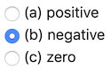

# `pl-multiple-choice` element

A `pl-multiple-choice` element selects **one** correct answer and zero or more
incorrect answers and displays them in a random order as radio buttons.
Duplicate answer choices (string equivalents) are not permitted in the
`pl-multiple-choice` element, and an exception will be raised upon question
generation if two (or more) choices are identical.

## Sample element



```html title="question.html"
<pl-multiple-choice answers-name="acc" weight="1">
  <pl-answer correct="false">positive</pl-answer>
  <pl-answer correct="true">negative</pl-answer>
  <pl-answer correct="false">zero</pl-answer>
</pl-multiple-choice>
```

## Customizations

| Attribute                    | Type                                                 | Default                     | Description                                                                                                                                                                                                 |
| ---------------------------- | ---------------------------------------------------- | --------------------------- | ----------------------------------------------------------------------------------------------------------------------------------------------------------------------------------------------------------- |
| `all-of-the-above`           | `"false"`, `"random"`, `"correct"`, or `"incorrect"` | `"false"`                   | Add `"All of the above"` choice. See below for details.                                                                                                                                                     |
| `all-of-the-above-feedback`  | string                                               | —                           | Helper text to be displayed to the student next to the `all-of-the-above` option after question is graded if this option has been selected by the student.                                                  |
| `allow-blank`                | boolean                                              | false                       | Whether an empty submission is allowed. If `allow-blank` is set to `true`, a submission that does not select any option will be marked as incorrect instead of invalid.                                     |
| `answers-name`               | string                                               | —                           | Variable name to store data in. Note that this attribute has to be unique within a question, i.e., no value for this attribute should be repeated within a question.                                        |
| `aria-label`                 | string                                               | `"Multiple choice options"` | An accessible label for the element.                                                                                                                                                                        |
| `builtin-grading`            | boolean                                              | true                        | Whether the element performs its own grading. If `false`, any required grading must be performed explicitly through other means. See [Disabling built-in grading](#disabling-built-in-grading) for details. |
| `display`                    | `"block"`, `"inline"`, or `"dropdown"`               | `"block"`                   | Display option for the input field. Block and inline display answer choices as radio buttons, while dropdown presents option as a dropdown.                                                                 |
| `hide-letter-keys`           | boolean                                              | false                       | Hide the letter keys in the answer list, i.e., (a), (b), (c), etc.                                                                                                                                          |
| `hide-score-badge`           | boolean                                              | false                       | Hide badges next to selected answers.                                                                                                                                                                       |
| `none-of-the-above`          | `"false"`, `"random"`, `"correct"`, or `"incorrect"` | `"false"`                   | Add `"None of the above"` choice. See below for details.                                                                                                                                                    |
| `none-of-the-above-feedback` | string                                               | —                           | Helper text to be displayed to the student next to the `none-of-the-above` option after question is graded if this option has been selected by the student.                                                 |
| `number-answers`             | integer                                              | See description             | The total number of answer choices to display. Defaults to displaying one correct answer and all incorrect answers.                                                                                         |
| `order`                      | `"random"`, `"ascend"`, `"descend"`, or `"fixed"`    | `"random"`                  | Order to display answer choices. Fixed order displays choices in the same order as the original source file.                                                                                                |
| `placeholder`                | string                                               | `"Select an option"`        | String to be used as the placeholder text when `display` is set to `"dropdown"`. Will also accept an empty string as `placeholder=""`.                                                                      |
| `size`                       | integer                                              | —                           | Manually set the size of the dropdown to a fixed width. The default behavior is to make the dropdown as wide as the widest option. Should only be used with `display` set to `"dropdown"`.                  |
| `weight`                     | integer                                              | 1                           | Weight to use when computing a weighted average score over elements.                                                                                                                                        |

### Automatically added answer choices

The attributes `none-of-the-above` and `all-of-the-above` can be set to one of these values:

- `"false"`: the corresponding choice will not be shown in the list of choices. This is the default.
- `"random"`: the corresponding choice will always be shown, and will be randomly correct, with probability proportional to the total number of correct choices. In other words, if there are `N` possible correct choices in total, this choice will be correct with probability `1/N`.
- `"correct"`: the corresponding choice will always be shown and will always be the correct answer.
- `"incorrect"`: the corresponding choice will always be shown and will always be an incorrect answer (i.e., a distractor).

When enabled, "All of the above" and "None of the above" are included in the `number-answers` limit. These choices are always displayed after the other choices, regardless of the `order` setting. If both choices are shown, "All of the above" is listed before "None of the above".

### Disabling built-in grading

Setting `builtin-grading="false"` causes the element to display choices and collect submissions without awarding any points on its own. This is useful in scenarios such as:

- **Survey-style questions** where there is no single correct answer.
- **Multi-element dependencies** where the correct answer depends on other elements and must be evaluated together.
- **Complex or manual grading** where correctness requires logic beyond simple answer matching.

When `builtin-grading="false"` is set:

- The element does **not** require any answer to have `correct="true"`.
- The element does **not** produce a score. To grade submissions automatically, you must supply a [`grade()` function in `server.py`](../question/server.md#step-5-grade) or be evaluated by an [external grader](../externalGrading.md). Without one, the score will be based on other gradable elements in the question (or receive a score of zero if there are no other elements).
- The **answer panel** will not display a correct answer, even if one is marked with `correct="true"`.
- **Score badges** are not shown by default, since no score is produced by the element.
- The `weight` and `hide-score-badge` attributes **cannot** be used alongside `builtin-grading="false"`. Similarly, `score` and `feedback` on individual `pl-answer` children are not permitted.
- The `all-of-the-above` and `none-of-the-above` attributes are restricted to boolean `true`/`false` when `builtin-grading="false"`. Setting them to `true` shows the option without any correctness semantics (always displayed last, always included when `number-answers` limits display). Values like `"correct"`, `"incorrect"`, or `"random"` are not allowed.

!!! note

    Even when built-in grading is disabled, the `correct="true"` attribute on a `pl-answer` still controls which single answer is selected when the element prepares its display. If there is truly no correct answer (e.g., a survey), you can omit `correct="true"` from all choices.

## Answer choices

Inside the `pl-multiple-choice` element, each choice must be specified with a `pl-answer` child element.

| Attribute  | Type                          | Default         | Description                                                                                                                                    |
| ---------- | ----------------------------- | --------------- | ---------------------------------------------------------------------------------------------------------------------------------------------- |
| `correct`  | boolean                       | false           | Is this a correct answer to the question?                                                                                                      |
| `feedback` | string                        | —               | Helper text (HTML) to be displayed to the student next to the option after question is graded if this option has been selected by the student. |
| `score`    | float in the range [0.0, 1.0] | See description | Score given to answer choice if selected by student. Defaults to 1.0 for correct answers and 0.0 for incorrect answers.                        |

### Migrating from deprecated attributes

The following deprecated attributes are still supported for backward compatibility:

| Old syntax                  | New syntax                   |
| --------------------------- | ---------------------------- |
| `inline="true"`             | `display="inline"`           |
| `fixed-order="true"`        | `order="fixed"`              |
| `all-of-the-above="true"`   | `all-of-the-above="random"`  |
| `all-of-the-above="false"`  | `all-of-the-above="false"`   |
| `none-of-the-above="true"`  | `none-of-the-above="random"` |
| `none-of-the-above="false"` | `none-of-the-above="false"`  |

Defining answer choices with external JSON files via the `external-json`, `external-json-correct-key`, and `external-json-incorrect-key` attributes is also deprecated. Define answer choices inline with `pl-answer` elements instead.

## Example implementations

- [element/multipleChoice]
- [demo/randomMultipleChoice]

## See also

- [`pl-checkbox` for allowing **one or more** choices](pl-checkbox.md)

[demo/randommultiplechoice]: https://github.com/PrairieLearn/PrairieLearn/tree/master/exampleCourse/questions/demo/randomMultipleChoice
[element/multiplechoice]: https://github.com/PrairieLearn/PrairieLearn/tree/master/exampleCourse/questions/element/multipleChoice
