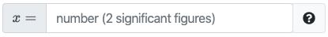

# `pl-number-input` element

Fill in the blank field that allows for **numeric** value input within specific
tolerances.

## Sample element


```html title="question.html"
<pl-number-input answers-name="ans_rtol" label="$x =$"> </pl-number-input>
```

```python title="server.py"
import random

def generate(data):

    # Generate a random value
    x = random.uniform(1, 2)

    # Answer to fill in the blank input
    data["correct_answers"]["ans_rtol"] = x
```

---



```html title="question.html"
<pl-number-input answers-name="ans_sig" comparison="sigfig" digits="2" label="$x =$">
</pl-number-input>
```

```python title="server.py"
import random

def generate(data):

    # Generate a random value
    x = random.uniform(1, 2)

    # Answer to fill in the blank input
    data["correct_answers"]["ans_sig"] = round(x, 2)
```

## Customizations

| Attribute             | Type                                  | Default         | Description                                                                                                                                                                                                                                                                                                                                                                                                                                                                                       |
| --------------------- | ------------------------------------- | --------------- | ------------------------------------------------------------------------------------------------------------------------------------------------------------------------------------------------------------------------------------------------------------------------------------------------------------------------------------------------------------------------------------------------------------------------------------------------------------------------------------------------- |
| `answers-name`        | string                                | —               | Variable name to store data in. Note that this attribute has to be unique within a question, i.e., no value for this attribute should be repeated within a question.                                                                                                                                                                                                                                                                                                                              |
| `weight`              | integer                               | 1               | Weight to use when computing a weighted average score over elements.                                                                                                                                                                                                                                                                                                                                                                                                                              |
| `correct-answer`      | float                                 | See description | Correct answer for grading. Defaults to `data["correct_answers"][answers-name]`.                                                                                                                                                                                                                                                                                                                                                                                                                  |
| `label`               | string                                | —               | A prefix to display before the input box (e.g., `label="$F =$"`).                                                                                                                                                                                                                                                                                                                                                                                                                                 |
| `aria-label`          | string                                | —               | An accessible label for the element.                                                                                                                                                                                                                                                                                                                                                                                                                                                              |
| `suffix`              | string                                | —               | A suffix to display after the input box (e.g., `suffix="$\rm m/s^2$"`).                                                                                                                                                                                                                                                                                                                                                                                                                           |
| `display`             | `"block"` or `"inline"`               | `"inline"`      | How to display the input field.                                                                                                                                                                                                                                                                                                                                                                                                                                                                   |
| `comparison`          | `"relabs"`, `"sigfig"`, or `"decdig"` | `"relabs"`      | How to grade. `"relabs"` uses relative (`rtol`) and absolute (`atol`) tolerances. `"sigfig"` and `"decdig"` use `digits` significant or decimal digits.                                                                                                                                                                                                                                                                                                                                           |
| `rtol`                | number                                | 1e-2            | Relative tolerance for `comparison="relabs"`.                                                                                                                                                                                                                                                                                                                                                                                                                                                     |
| `atol`                | number                                | 1e-8            | Absolute tolerance for `comparison="relabs"`.                                                                                                                                                                                                                                                                                                                                                                                                                                                     |
| `digits`              | integer                               | 2               | number of digits that must be correct for `comparison="sigfig"` or `comparison="decdig"`.                                                                                                                                                                                                                                                                                                                                                                                                         |
| `allow-complex`       | boolean                               | false           | Whether to allow complex numbers as answers. If the correct answer is set in `server.py` as a complex object, you should use `import prairielearn as pl` and `data["correct_answers"][answers-name] = pl.to_json(ans)`.                                                                                                                                                                                                                                                                           |
| `allow-blank`         | boolean                               | false           | Whether an empty input box is allowed. By default, empty input boxes will not be graded (invalid format).                                                                                                                                                                                                                                                                                                                                                                                         |
| `show-score`          | boolean                               | true            | Whether to show the score badge next to this element.                                                                                                                                                                                                                                                                                                                                                                                                                                             |
| `blank-value`         | string                                | 0 (zero)        | Value to be used as an answer if element is left blank. Only applied if `allow-blank` is `true`. Must be `""` (empty string) or follow the same format as an expected user input (e.g., fractions if allowed, complex numbers if allowed, etc.).                                                                                                                                                                                                                                                  |
| `show-help-text`      | boolean                               | true            | Show the question mark at the end of the input displaying required input parameters.                                                                                                                                                                                                                                                                                                                                                                                                              |
| `placeholder`         | string                                | See description | Custom placeholder text. By default, the placeholder text shown is the default comparison.                                                                                                                                                                                                                                                                                                                                                                                                        |
| `size`                | integer                               | 35              | Size of the input box.                                                                                                                                                                                                                                                                                                                                                                                                                                                                            |
| `show-correct-answer` | boolean                               | true            | Whether to show the correct reference answer in the submission panel if the submitted answer was correct (i.e., within the specified tolerance).                                                                                                                                                                                                                                                                                                                                                  |
| `allow-fractions`     | boolean                               | true            | Whether to allow answers expressed as a rational number of the format `a/b`.                                                                                                                                                                                                                                                                                                                                                                                                                      |
| `custom-format`       | string                                | See description | Custom format to use when formatting the submitted or correct answer. By default, submitted answers are shown with the format `".12g"`, while the correct answer uses `".12g"` if the comparison method is `"relabs"`, or a custom format based on the number of digits if the comparison method is `"sigfig"` or `"decdig"`. A full description of the format can be found [on the Python documentation page](https://docs.python.org/3/library/string.html#format-specification-mini-language). |

## Example implementations

- [element/numberInput]
- [demo/calculation]

## See also

- [`pl-integer-input` for integer input](pl-integer-input.md)
- [`pl-symbolic-input` for mathematical expression input](pl-symbolic-input.md)
- [`pl-string-input` for string input](pl-string-input.md)

---

[demo/calculation]: https://github.com/PrairieLearn/PrairieLearn/tree/master/exampleCourse/questions/demo/calculation
[element/numberinput]: https://github.com/PrairieLearn/PrairieLearn/tree/master/exampleCourse/questions/element/numberInput
