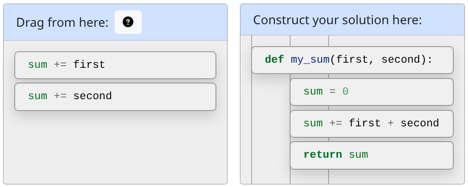

# `pl-order-blocks` element

Element to arrange given blocks of code or text that are displayed initially in the _source area_. The blocks can be moved to the _solution area_ to construct the solution of the problem. In the example below, the source area is denoted by the header "Drag from here" and the solution area is denoted with the header "Construct your solution here".

## Sample element


```html title="question.html"
<p>List all the even numbers in order:</p>
<pl-order-blocks answers-name="order-numbers">
  <pl-answer correct="false">1</pl-answer>
  <pl-answer correct="true">2</pl-answer>
  <pl-answer correct="false">3</pl-answer>
  <pl-answer correct="true">4</pl-answer>
</pl-order-blocks>
```

## Customizations

| Attribute             | Type                                                           | Default                          | Description                                                                                                                                                                                                                                                                                                                                                                                                                                                                  |
| --------------------- | -------------------------------------------------------------- | -------------------------------- | ---------------------------------------------------------------------------------------------------------------------------------------------------------------------------------------------------------------------------------------------------------------------------------------------------------------------------------------------------------------------------------------------------------------------------------------------------------------------------- |
| `allow-blank`         | boolean                                                        | false                            | Whether an empty solution area is allowed. By default, an empty solution area with no dropped blocks will not be graded (invalid format).                                                                                                                                                                                                                                                                                                                                    |
| `answers-name`        | string                                                         | —                                | Variable name to store data in. Note that this attribute has to be unique within a question, i.e., no value for this attribute should be repeated within a question.                                                                                                                                                                                                                                                                                                         |
| `code-language`       | string                                                         | —                                | The programming language syntax highlighting to use. Only available when using `format="code"`.                                                                                                                                                                                                                                                                                                                                                                              |
| `distractor-order`    | `"random"` or `"inherit"`                                      | `"inherit"`                      | Controls whether distractors are shuffled with their associated correct block. `"random"` shuffles each correct block together with its distractors (blocks with matching `distractor-for`). `"inherit"` keeps distractors in the order determined by `source-blocks-order`. Cannot be used with `source-blocks-order="random"`. When using `"random"` with `source-blocks-order="alphabetized"`, the overall list will not be strictly alphabetical.                        |
| `feedback`            | `"none"`, `"first-wrong"`, or `"first-wrong-verbose"`          | `"none"`                         | The level of feedback the student will receive upon giving an incorrect answer. Available with the `"dag"` or `"ranking"` grading mode. `"none"` will give no feedback. `"first-wrong"` will tell the student which block in their answer was the first to be incorrect. If set to `"first-wrong-verbose"`, if the first incorrect block is a distractor any feedback associated with that distractor will be shown as well (see "distractor-feedback" in `<pl-answer>`)     |
| `file-name`           | string                                                         | `"user_code.py"`                 | Name of the file where the information from the blocks will be saved, to be used by the external grader.                                                                                                                                                                                                                                                                                                                                                                     |
| `format`              | `"code"` or `"default"`                                        | `"default"`                      | If this property is set to `"code"`, then the contents of each of the blocks will be wrapped with a `<pl-code>` element.                                                                                                                                                                                                                                                                                                                                                     |
| `grading-method`      | `"ordered"`, `"unordered"`, `"ranking"`, `"dag"`, `"external"` | `"ordered"`                      | Grading method to be used, as described below.                                                                                                                                                                                                                                                                                                                                                                                                                               |
| `indentation`         | boolean                                                        | false                            | Enable both the ability for indentation in the solution area and the grading of the expected indentation (set by `indent` in `pl-answer`, as described below).                                                                                                                                                                                                                                                                                                               |
| `inline`              | boolean                                                        | false                            | `false` sets the blocks to be stacked vertically whereas `true` requires blocks to be placed horizontally.                                                                                                                                                                                                                                                                                                                                                                   |
| `max-incorrect`       | integer                                                        | See description                  | The maximum number of incorrect answers to be displayed in the source area. The incorrect answers are set using `<pl-answer correct="false">`. Defaults to displaying all incorrect answers.                                                                                                                                                                                                                                                                                 |
| `max-indent`          | integer                                                        | 4                                | Maximum possible indent depth for blocks in the solution area. Note only applied when `indentation` is enabled.                                                                                                                                                                                                                                                                                                                                                              |
| `min-incorrect`       | integer                                                        | See description                  | The minimum number of incorrect answers to be displayed in the source area. The incorrect answers are set using `<pl-answer correct="false">`. Defaults to displaying all incorrect answers.                                                                                                                                                                                                                                                                                 |
| `partial-credit`      | `"none"` or `"lcs"`                                            | See description                  | For the `"dag"`, `"ordered"`, and `"ranking"` grading methods, you may specify `"none"` for no partial credit or `"lcs"` for partial credit based on the LCS edit-distance from the student solution to some correct solution. Note that `partial-credit` defaults to `"lcs"` for the `"dag"` and `"ranking"` grading method, and to `"none"` for the `"ordered"` grading method for backward compatibility. Grading method `"unordered"` will always assign partial credit. |
| `solution-header`     | string                                                         | `"Construct your solution here"` | The text that appears at the start of the solution area.                                                                                                                                                                                                                                                                                                                                                                                                                     |
| `solution-placement`  | `"right"` or `"bottom"`                                        | `"right"`                        | `"right"` shows the source and solution areas aligned side-by-side. `"bottom"` shows the solution area below the source area.                                                                                                                                                                                                                                                                                                                                                |
| `source-blocks-order` | `"random"`, `"ordered"`, or `"alphabetized"`                   | `"random"`                       | The order of the blocks in the source area. See more details below.                                                                                                                                                                                                                                                                                                                                                                                                          |
| `source-header`       | string                                                         | `"Drag from here"`               | The text that appears at the start of the source area.                                                                                                                                                                                                                                                                                                                                                                                                                       |
| `weight`              | integer                                                        | 1                                | Weight to use when computing a weighted average score over all elements in a question.                                                                                                                                                                                                                                                                                                                                                                                       |

Within the `pl-order-blocks` element, each element must either be a `pl-answer` or a `pl-block-group` (see details below for more info on `pl-block-group`). Each element within a `pl-block-group` must be a `pl-answer`. The `pl-answer` elements specify the content for each of the blocks, and may have the following attributes:

| Attribute             | Type               | Default | Description                                                                                                                                                                                                                                                                                                                                                                                                                                                                  |
| --------------------- | ------------------ | ------- | ---------------------------------------------------------------------------------------------------------------------------------------------------------------------------------------------------------------------------------------------------------------------------------------------------------------------------------------------------------------------------------------------------------------------------------------------------------------------------- |
| `correct`             | boolean            | true    | Specifies whether the answer block is a correct answer to the question (and should be moved to the solution area).                                                                                                                                                                                                                                                                                                                                                           |
| `depends`\*           | string             | —       | Optional attribute when `grading-method="dag"`. Used to specify the directed acyclic graph relation among the blocks, with blocks being referred to by their `tag`. For example, if `depends="1,3"` for a particular block, it must appear later in the solution than the block with `tag="1"` and the block with `tag="3"`. If <code>depends="1&vert;3"</code>, then the block must appear later in the solution than the block with `tag="1"` OR the block with `tag="3"`. |
| `distractor-feedback` | string             | —       | Optional attribute, used when `correct=false` that indicates why a given block is incorrect or should not be included in the solution. Shown to the student after all attempts at a problem are exhausted, or if `feedback="first-wrong"` and the first incorrect line in their submission has `distractor-feedback`.                                                                                                                                                        |
| `distractor-for`      | string             | —       | Optional attribute on blocks where `correct=false`. Used to visually group a distractor block with a correct block that it is similar to, should match the `tag` attribute of the block that it should be visually paired with.                                                                                                                                                                                                                                              |
| `final`               | boolean            | —       | Required to be `true` on one or more `pl-answer` tags when `grading-method="dag"` and a <code>&vert;</code> is used to denote optional blocks.                                                                                                                                                                                                                                                                                                                               |
| `indent`              | integer in [-1, 4] | -1      | Specifies the correct indentation level of the block. For example, a value of `2` means the block should be indented twice. A value of `-1` means the indentation of the block does not matter. This attribute can only be used when `indentation="true"`.                                                                                                                                                                                                                   |
| `ordering-feedback`   | string             | —       | Optional attribute used when `grading-method="dag"` or `grading-method="ranking"` and `correct=true`. Used to provide specific feedback when the block is placed in the wrong position relative to other blocks. This feedback is shown to the student after submission to help clarify ordering errors.                                                                                                                                                                     |
| `ranking`             | positive integer   | —       | This attribute is used when `grading-method="ranking"` and specifies the correct ranking of the answer block. For example, a block with ranking `2` should be placed below a block with ranking `1`. The same ranking can be used when the order of certain blocks is not relevant. Blocks that can be placed at any position should not have the `ranking` attribute.                                                                                                       |
| `tag`\*               | string             | —       | Optional attribute. Used to identify the block when declaring which other blocks depend on it or are a distractor for it.                                                                                                                                                                                                                                                                                                                                                    |

!!! note

    Above attributes indicated with a \* can be applied to `pl-block-group` as well.

## Details

Different grading options are defined via the attribute `grading-method`:

- `ordered`: in this method, the correct ordering of the blocks is defined by the ordering in which
  the correct answers (defined in `pl-answer`) appear in the HTML file.
- `unordered`: in this method, if `n` is the total number of correct blocks, each correct block moved to the solution area is given `1/n` points, and each incorrect block moved to the solution area is subtracted by `1/n` points. The final score will be at least 0 (the student cannot earn a negative score by only moving incorrect answers). Note the ordering of the blocks does not matter. That is, any permutation of the answers within the solution area is accepted.
- `ranking`: in this method, the `ranking` attribute of the `pl-answer` options are used to check answer ordering. Every answer block _X_ should have a `ranking` integer that is less than or equal to the answer block immediately below _X_. That is, the sequence of `ranking` integers of all the answer blocks should form a _nonstrictly increasing_ sequence. If `n` is the total number of answers, each correctly ordered answer is worth `1/n`, up to the first incorrectly ordered answer.
- `dag`: in this method, the `depends` attribute of the `pl-answer` options are used to declare the directed acyclic graph relation between the blocks, and a correct answer is any topological sort of that directed acyclic graph. If `pl-block-group` elements are used to divide some blocks into groups, then a correct answer is a topological sort of the lines of the proof with the added condition that the lines of each group must be listed contiguously (as an example, this is useful for expressing a [proof by cases][demo/proofblocks] when the `dag` grader is used for mathematical proofs). Blocks inside a `pl-block-group` element may only depend or be depended on by blocks within the same `pl-block-group`, and `pl-blocks-group` elements can be given their own `tag` and `depends` properties so that a block may depend on an entire group, or a group may depend on a block or group.
- `external`: in this method, the blocks moved to the solution area will be saved in the file `user_code.py`, and the correctness of the code will be checked using the external grader. Depending on the external grader grading code logic, it may be possible to enable or disable partial credit. The attribute `correct` for `pl-answer` can still be used in conjunction with `min-incorrect` and `max-incorrect` for display purposes only, but not used for grading purposes. The attributes `ranking` and `indent` are not allowed for this grading method.

Different ordering of the blocks in the source area defined via the attribute `source-blocks-order`:

- `random`: the blocks are shuffled.
- `ordered`: the blocks appear in the source area in the same order they appear in the HTML file.
- `alphabetized`: the blocks are alphabetized according to their HTML contents. Take care when including HTML in blocks. For instance, `<b>cat</b>` will appear before `<i>bat</i>`.

## Optional Blocks

This feature allows users to write `pl-order-blocks` questions using the `dag` grading method to have multiple correct orderings. This can extend existing questions utilizing the `dag` grading method to include blocks that can be either included or excluded in the final solution while still being correct. You can denote an "or" relationship between dependencies in the `depends` attribute by using the `|` operator, e.g., `depends="A|B"`.

!!! note

    When using optional blocks, each correct ordering must end with one block labeled final. The `pl-answer` tags that declares these blocks must have the attribute `final` set to `true`.
    A question cannot include block groups with optional blocks.

## Optional Blocks Example



```html title="question.html"
<p>Construct a python function that computes the sum of two numbers.</p>
<pl-order-blocks
  answers-name="python-plus-equals"
  grading-method="dag"
  indentation="true"
  format="code"
  code-language="python"
>
  <pl-answer correct="true" tag="1" depends="" indent="0">def my_sum(first, second):</pl-answer>
  <pl-answer correct="true" tag="2" depends="1" indent="1">sum = 0</pl-answer>
  <pl-answer correct="true" tag="3" depends="2" indent="1">sum += first</pl-answer>
  <pl-answer correct="true" tag="4" depends="2" indent="1">sum += second</pl-answer>
  <pl-answer correct="true" tag="5" depends="2" indent="1">sum += first + second</pl-answer>
  <pl-answer correct="true" tag="6" depends="3,4 | 5" indent="1" final="true">return sum</pl-answer>
</pl-order-blocks>
```

## Example implementations

- [element/orderBlocks]
- [element/orderBlocksOrdered]
- [element/orderBlocksCode]
- [element/orderBlocksDag]
- [element/orderBlocksAlphabetized]
- [element/orderBlocksInline]
- [element/orderBlocksOptional]
- [demo/proofBlocks]
- [demo/autograder/python/orderBlocksRandomParams]
- [demo/autograder/python/orderBlocksAddNumpy]

---

[demo/autograder/python/orderblocksaddnumpy]: https://github.com/PrairieLearn/PrairieLearn/tree/master/exampleCourse/questions/demo/autograder/python/orderBlocksAddNumpy
[demo/autograder/python/orderblocksrandomparams]: https://github.com/PrairieLearn/PrairieLearn/tree/master/exampleCourse/questions/demo/autograder/python/orderBlocksRandomParams
[demo/proofblocks]: https://github.com/PrairieLearn/PrairieLearn/tree/master/exampleCourse/questions/demo/proofBlocks
[element/orderblocks]: https://github.com/PrairieLearn/PrairieLearn/tree/master/exampleCourse/questions/element/orderBlocks
[element/orderblocksalphabetized]: https://github.com/PrairieLearn/PrairieLearn/tree/master/exampleCourse/questions/element/orderBlocksAlphabetized
[element/orderblockscode]: https://github.com/PrairieLearn/PrairieLearn/tree/master/exampleCourse/questions/element/orderBlocksCode
[element/orderblocksdag]: https://github.com/PrairieLearn/PrairieLearn/tree/master/exampleCourse/questions/element/orderBlocksDag
[element/orderblocksinline]: https://github.com/PrairieLearn/PrairieLearn/tree/master/exampleCourse/questions/element/orderBlocksInline
[element/orderblocksoptional]: https://github.com/PrairieLearn/PrairieLearn/tree/master/exampleCourse/questions/element/orderBlocksOptional
[element/orderblocksordered]: https://github.com/PrairieLearn/PrairieLearn/tree/master/exampleCourse/questions/element/orderBlocksOrdered
