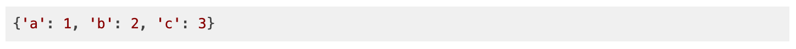

### `pl-python-variable` element

Displays the value of a Python variable. It uses options similar to the [pprint](https://docs.python.org/3/library/pprint.html) module to format output data, and can recursively print nested data structures. As such, some descriptions below are taken directly from this documentation.

#### Sample elements



```html title="question.html"
<pl-python-variable params-name="variable"></pl-python-variable>
```

```python title="server.py"
import prairielearn as pl

def generate(data):
    data_dictionary = { "a": 1, "b": 2, "c": 3 }
    data["params"]["variable"] = pl.to_json(data_dictionary)
```

#### Customizations

| Attribute           | Type    | Default | Description                                                                                                                                                                                                                                                                                      |
| ------------------- | ------- | ------- | ------------------------------------------------------------------------------------------------------------------------------------------------------------------------------------------------------------------------------------------------------------------------------------------------ |
| `params-name`       | string  | —       | The name of the key in `data["params"]` to get a value from.                                                                                                                                                                                                                                     |
| `prefix`            | string  | (empty) | Any prefix to append to the output in `text` mode.                                                                                                                                                                                                                                               |
| `prefix-newline`    | boolean | false   | Add newline to the end of `prefix`.                                                                                                                                                                                                                                                              |
| `suffix`            | string  | (empty) | Any suffix to append to the output in `text` mode.                                                                                                                                                                                                                                               |
| `suffix-newline`    | boolean | false   | Add newline before the start of `suffix`.                                                                                                                                                                                                                                                        |
| `indent`            | integer | 1       | Specifies the amount of indentation added for each nesting level when printing nested objects.                                                                                                                                                                                                   |
| `depth`             | integer | —       | The number of nesting levels which may be printed; if the data structure being printed is too deep, the next contained level is replaced by ... By default, there is no constraint on the depth of the objects being formatted.                                                                  |
| `width`             | integer | 80      | Specifies the desired maximum number of characters per line in the output. If a structure cannot be formatted within the width constraint, a best effort will be made.                                                                                                                           |
| `compact-sequences` | boolean | false   | Impacts the way that long sequences (lists, tuples, sets, etc.) are formatted. If `compact-sequences` is false (the default) then each item of a sequence will be formatted on a separate line. If it is true, as many items as will fit within the width will be formatted on each output line. |
| `sort-dicts`        | boolean | true    | If true, dictionaries will be formatted with their keys sorted, otherwise they will display in insertion order.                                                                                                                                                                                  |
| `no-highlight`      | boolean | false   | Disable syntax highlighting.                                                                                                                                                                                                                                                                     |
| `copy-code-button`  | boolean | false   | Whether to include a button to copy the code displayed by this element.                                                                                                                                                                                                                          |
| `show-line-numbers` | boolean | false   | Whether to show line numbers in code displayed by this element.                                                                                                                                                                                                                                  |

#### Details

The element supports displaying Python objects via `repr()`, with support for more complex display options similar to the built-in `pprint` library. **Objects to be displayed must be serializable to JSON.** For details about what objects can be serialized and how to do this with the provided `to_json` and `from_json` functions, see the [Question Writing documentation](../question/server.md#question-data-storage). To display objects that cannot be easily JSON serialized, please refer to the `pl-code` example question [element/code].

Printing Pandas DataFrames with this element is deprecated. Please use the new [`pl-dataframe`](pl-dataframe.md) element for this purpose.

#### Example implementations

- [element/pythonVariable]

#### See also

- [`pl-code` to display blocks of code with syntax highlighting](pl-code.md)
- [`pl-variable-output` for displaying a matrix or element in code form.](pl-variable-output.md)
- [`pl-dataframe` for displaying dataframes.](pl-dataframe.md)


<!-- Reference style links for element implementations -->

<!-- External Grade Questions -->

[demo/autograder/codeeditor]: https://github.com/PrairieLearn/PrairieLearn/tree/master/exampleCourse/questions/demo/autograder/codeEditor
[demo/autograder/codeupload]: https://github.com/PrairieLearn/PrairieLearn/tree/master/exampleCourse/questions/demo/autograder/codeUpload
[demo/autograder/python/square]: https://github.com/PrairieLearn/PrairieLearn/tree/master/exampleCourse/questions/demo/autograder/python/square
[demo/autograder/python/numpy]: https://github.com/PrairieLearn/PrairieLearn/tree/master/exampleCourse/questions/demo/autograder/python/numpy
[demo/autograder/python/pandas]: https://github.com/PrairieLearn/PrairieLearn/tree/master/exampleCourse/questions/demo/autograder/python/pandas
[demo/autograder/python/plots]: https://github.com/PrairieLearn/PrairieLearn/tree/master/exampleCourse/questions/demo/autograder/python/plots
[demo/autograder/python/random]: https://github.com/PrairieLearn/PrairieLearn/tree/master/exampleCourse/questions/demo/autograder/python/random
[demo/autograder/python/orderblocksrandomparams]: https://github.com/PrairieLearn/PrairieLearn/tree/master/exampleCourse/questions/demo/autograder/python/orderBlocksRandomParams
[demo/autograder/python/orderblocksaddnumpy]: https://github.com/PrairieLearn/PrairieLearn/tree/master/exampleCourse/questions/demo/autograder/python/orderBlocksAddNumpy

<!-- Manual grading examples -->

[demo/manualgrade/codeupload]: https://github.com/PrairieLearn/PrairieLearn/tree/master/exampleCourse/questions/demo/manualGrade/codeUpload

<!-- High quality questions -->

[demo/calculation]: https://github.com/PrairieLearn/PrairieLearn/tree/master/exampleCourse/questions/demo/calculation
[demo/fixedcheckbox]: https://github.com/PrairieLearn/PrairieLearn/tree/master/exampleCourse/questions/demo/fixedCheckbox
[demo/markdowneditorlivepreview]: https://github.com/PrairieLearn/PrairieLearn/tree/master/exampleCourse/questions/demo/markdownEditorLivePreview
[demo/matrixcomplexalgebra]: https://github.com/PrairieLearn/PrairieLearn/tree/master/exampleCourse/questions/demo/matrixComplexAlgebra
[demo/overlaydropdown]: https://github.com/PrairieLearn/PrairieLearn/tree/master/exampleCourse/questions/demo/overlayDropdown
[demo/randomcheckbox]: https://github.com/PrairieLearn/PrairieLearn/tree/master/exampleCourse/questions/demo/randomCheckbox
[demo/randomdataframe]: https://github.com/PrairieLearn/PrairieLearn/tree/master/exampleCourse/questions/demo/randomDataFrame
[demo/randommultiplechoice]: https://github.com/PrairieLearn/PrairieLearn/tree/master/exampleCourse/questions/demo/randomMultipleChoice
[demo/randomplot]: https://github.com/PrairieLearn/PrairieLearn/tree/master/exampleCourse/questions/demo/randomPlot
[demo/proofblocks]: https://github.com/PrairieLearn/PrairieLearn/tree/master/exampleCourse/questions/demo/proofBlocks

<!-- Element option overview questions -->

[element/checkbox]: https://github.com/PrairieLearn/PrairieLearn/tree/master/exampleCourse/questions/element/checkbox
[element/bigoinput]: https://github.com/PrairieLearn/PrairieLearn/tree/master/exampleCourse/questions/element/bigOInput
[element/hiddenhints]: https://github.com/PrairieLearn/PrairieLearn/tree/master/exampleCourse/questions/element/hiddenHints
[element/code]: https://github.com/PrairieLearn/PrairieLearn/tree/master/exampleCourse/questions/element/code
[element/dropdown]: https://github.com/PrairieLearn/PrairieLearn/tree/master/exampleCourse/questions/element/dropdown
[element/excalidraw]: https://github.com/PrairieLearn/PrairieLearn/tree/master/exampleCourse/questions/element/excalidraw
[element/figure]: https://github.com/PrairieLearn/PrairieLearn/tree/master/exampleCourse/questions/element/figure
[element/filedownload]: https://github.com/PrairieLearn/PrairieLearn/tree/master/exampleCourse/questions/element/fileDownload
[element/fileeditor]: https://github.com/PrairieLearn/PrairieLearn/tree/master/exampleCourse/questions/element/fileEditor
[element/graph]: https://github.com/PrairieLearn/PrairieLearn/tree/master/exampleCourse/questions/element/graph
[element/imageCapture]: https://github.com/PrairieLearn/PrairieLearn/tree/master/exampleCourse/questions/element/imageCapture
[element/integerinput]: https://github.com/PrairieLearn/PrairieLearn/tree/master/exampleCourse/questions/element/integerInput
[element/matching]: https://github.com/PrairieLearn/PrairieLearn/tree/master/exampleCourse/questions/element/matching
[element/matrixcomponentinput]: https://github.com/PrairieLearn/PrairieLearn/tree/master/exampleCourse/questions/element/matrixComponentInput
[element/matrixlatex]: https://github.com/PrairieLearn/PrairieLearn/tree/master/exampleCourse/questions/element/matrixLatex
[element/multiplechoice]: https://github.com/PrairieLearn/PrairieLearn/tree/master/exampleCourse/questions/element/multipleChoice
[element/numberinput]: https://github.com/PrairieLearn/PrairieLearn/tree/master/exampleCourse/questions/element/numberInput
[element/unitsinput]: https://github.com/PrairieLearn/PrairieLearn/tree/master/exampleCourse/questions/element/unitsInput
[element/orderblocks]: https://github.com/PrairieLearn/PrairieLearn/tree/master/exampleCourse/questions/element/orderBlocks
[element/orderblocksoptional]: https://github.com/PrairieLearn/PrairieLearn/tree/master/exampleCourse/questions/element/orderBlocksOptional
[element/overlay]: https://github.com/PrairieLearn/PrairieLearn/tree/master/exampleCourse/questions/element/overlay
[element/panels]: https://github.com/PrairieLearn/PrairieLearn/tree/master/exampleCourse/questions/element/panels
[element/prairiedrawfigure]: https://github.com/PrairieLearn/PrairieLearn/tree/master/testCourse/questions/prairieDrawFigure
[element/pythonvariable]: https://github.com/PrairieLearn/PrairieLearn/tree/master/exampleCourse/questions/element/pythonVariable
[element/dataframe]: https://github.com/PrairieLearn/PrairieLearn/tree/master/exampleCourse/questions/element/dataframe
[element/richTextEditor]: https://github.com/PrairieLearn/PrairieLearn/tree/master/exampleCourse/questions/element/richTextEditor
[element/stringinput]: https://github.com/PrairieLearn/PrairieLearn/tree/master/exampleCourse/questions/element/stringInput
[element/symbolicinput]: https://github.com/PrairieLearn/PrairieLearn/tree/master/exampleCourse/questions/element/symbolicInput
[element/template]: https://github.com/PrairieLearn/PrairieLearn/tree/master/exampleCourse/questions/element/template
[element/variableoutput]: https://github.com/PrairieLearn/PrairieLearn/tree/master/exampleCourse/questions/element/variableOutput
[element/xsssafe]: https://github.com/PrairieLearn/PrairieLearn/tree/master/exampleCourse/questions/element/xssSafe
[element/card]: https://github.com/PrairieLearn/PrairieLearn/tree/master/exampleCourse/questions/element/card

<!-- Advanced uses of PL features -->

[demo/custom/gradefunction]: https://github.com/PrairieLearn/PrairieLearn/tree/master/exampleCourse/questions/demo/custom/gradeFunction

<!-- Misc application questions -->

### `pl-variable-score` element

Display the partial score for a specific answer variable.

!!! warning

    This element is **deprecated** and should not be used in new questions.

#### Sample element

```html title="question.html"
<pl-variable-score answers-name="v_avg"></pl-variable-score>
```

#### Customizations

| Attribute      | Type   | Default | Description                         |
| -------------- | ------ | ------- | ----------------------------------- |
| `answers-name` | string | —       | Variable name to display score for. |

---
