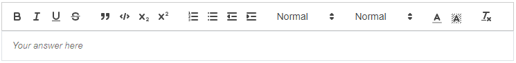

# `pl-rich-text-editor` element

Provides an in-browser rich text editor, aimed mostly at manual grading essay-type questions. This editor is based on the [Quill rich text editor](https://quilljs.com/).

## Sample element



```html title="question.html"
<pl-rich-text-editor file-name="answer.html"> </pl-rich-text-editor>
```

## Customizations

| Attribute            | Type                                | Default              | description                                                                                                                                                                                                                                                                                                                                                                                                                                               |
| -------------------- | ----------------------------------- | -------------------- | --------------------------------------------------------------------------------------------------------------------------------------------------------------------------------------------------------------------------------------------------------------------------------------------------------------------------------------------------------------------------------------------------------------------------------------------------------- |
| `allow-blank`        | boolean                             | false                | Whether an empty input box is allowed. By default, empty submissions will not be graded (invalid format).                                                                                                                                                                                                                                                                                                                                                 |
| `clipboard-enabled`  | boolean                             | true                 | Whether the element supports cutting, copying and pasting the contents of the editor from the user interface. Note that the editor content is still available in the browser's developer tools, which would allow students to copy the content anyway. Also note that preventing operations like copying or pasting text may be detrimental to the student's experience, and as such should be avoided unless absolutely necessary.                       |
| `counter`            | `"word"`, `"character"` or `"none"` | See description      | Whether a word or character count should be displayed at the bottom of the editor. If `min-word-count` or `max-word-count` are set, then `counter` defaults to `"word"` and cannot be set to `"none"` or `"character"`. Otherwise, it defaults to `"none"`.                                                                                                                                                                                               |
| `directory`          | string                              | See description      | Directory where the source file with existing code is to be found. Only useful if `source-file-name` is used. If it contains one of the special names `"clientFilesCourse"` or `"serverFilesCourse"`, then the source file name is read from the course's special directories, otherwise the directory is expected to be in the question's own directory. If not provided, the source file name is expected to be found in the question's main directory. |
| `file-name`          | string                              | `"answer.html"`      | The name of the output file; will be used to store the student's answer in the `_files` submitted answer. Must be unique if more than one `pl-rich-text-editor` element is included in a question.                                                                                                                                                                                                                                                        |
| `format`             | `"html"` or `"markdown"`            | `"html"`             | Format used to interpret the specified source file or starting content. This option does not affect the output format.                                                                                                                                                                                                                                                                                                                                    |
| `markdown-shortcuts` | boolean                             | true                 | Whether the editor accepts shortcuts based on Markdown format (e.g., typing `_word_` causes the word to become italic).                                                                                                                                                                                                                                                                                                                                   |
| `max-word-count`     | integer                             | —                    | Maximum number of words in the submitted answer. Longer answers will be marked as invalid (not gradable).                                                                                                                                                                                                                                                                                                                                                 |
| `min-word-count`     | integer                             | —                    | Minimum number of words in the submitted answer. Shorter answers will be marked as invalid (not gradable). Cannot be combined with `allow-blank` set to `"true"` when `min-word-count` is greater than 0.                                                                                                                                                                                                                                                 |
| `placeholder`        | string                              | `"Your answer here"` | Text to be shown in the editor as a placeholder when there is no student input.                                                                                                                                                                                                                                                                                                                                                                           |
| `quill-theme`        | string                              | `"snow"`             | Specifies a Quill editor theme; the most common themes are `"snow"` (which uses a default toolbar) or `"bubble"` (which hides the default toolbar, showing formatting options when text is selected). See [the Quill documentation](https://quilljs.com/docs/themes/) for more information about additional themes.                                                                                                                                       |
| `source-file-name`   | string                              | —                    | Name of the source file with existing content to be displayed in the editor. The format of this file must match the format specified in the `format` attribute.                                                                                                                                                                                                                                                                                           |

## Word count

The algorithm identifies words by splitting on whitespace, a convention that works well for most standard English texts. In contexts such as formulas, programming syntax, or languages without space-separated words, the resulting count may not correspond to meaningful linguistic units.

## Using more than one element in a question

The `pl-rich-text-editor` element creates a file submission corresponding to the HTML content of the student answer. If the file name is not provided, the name `answer.html` is used. If more than one `pl-rich-text-editor` is included in a question, they must each contain a different file name; in that case, the file name must be explicitly provided, as the default name would clash between elements.

## A note on accessibility

A common construct, typically inherited from questions imported from other tools, is to use a rich text editor with "structured" starting content, such as a table with empty cells or a set of headings for sub-problems. This is often done to encourage students to provide structured answers (e.g., filling out a table with specific information). However, this approach can lead to accessibility issues, as screen readers may have difficulty navigating and interpreting the structure of the content. It also allows students to ignore the structure altogether, which may confuse graders and lead to inconsistent answers.

If you want to encourage structured answers, consider using separate input fields for each piece of information instead of relying on a rich text editor with complex formatting. This can help ensure that all students, including those using assistive technologies, can access and interact with the question effectively. For example, instead of including a table as the starting content of a rich text editor, you can create a table that contains separate elements for each cell, allowing students to fill in their answers without the need to navigate complex formatting. This also provides the additional benefit of allowing each cell to be based on the specific format (e.g., numeric, string, multi-line text) that best suits the expected answer, and allows for more precise grading and feedback. It also allows these values to be auto-graded when applicable, which is not possible when the answer is embedded in a rich text editor.

Even if you expect students to provide rich-text answers, consider separating the question into multiple parts, each with its own input field, instead of asking students to provide a single answer with complex formatting. This can help students focus on each part of the question and provide more organized answers, while also simplifying the grading process and improving accessibility.

## Example implementations

- [element/richTextEditor]

## See also

- [`pl-file-editor` to edit unformatted text, such as code](pl-file-editor.md)
- [`pl-file-upload` to receive files as a submission](pl-file-upload.md)
- [`pl-string-input` for receiving a single string value](pl-string-input.md)

---

[element/richTextEditor]: https://github.com/PrairieLearn/PrairieLearn/tree/master/exampleCourse/questions/element/richTextEditor
