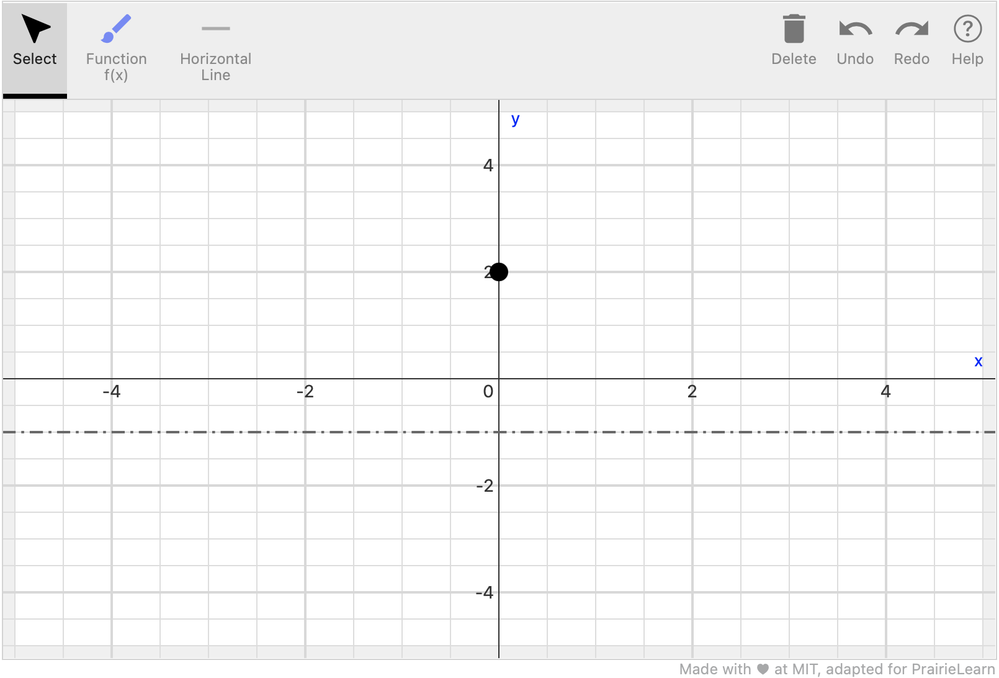

# `pl-sketch` element

Display and sketch curves and other mathematical objects (e.g., points, asymptotes, polygons).

## Sample element



<!-- prettier-ignore -->
```html title="question.html"
<pl-sketch answers-name="sketch-input">
    <pl-sketch-tool id="fd" type="free-draw"></pl-sketch-tool>
    <pl-sketch-tool id="hl" type="horizontal-line"></pl-sketch-tool>
    <pl-sketch-tool id="pt" type="point" read-only="true"></pl-sketch-tool>
    <pl-sketch-initial toolid="pt" coordinates="0,2"></pl-sketch-initial>
    <pl-sketch-initial toolid="hl" coordinates="-1"></pl-sketch-initial>
    <pl-sketch-grade type="match" toolid="hl" y="1"></pl-sketch-grade> 
    <pl-sketch-grade type="count" toolid="hl" count="1"></pl-sketch-grade> 
    <pl-sketch-grade type="match-fun" toolid="fd" fun="x**2"></pl-sketch-grade> 
</pl-sketch>
```

## Customizations

| Attribute        | Type              | Default  | Description                                                                                                                                                                                               |
| ---------------- | ----------------- | -------- | --------------------------------------------------------------------------------------------------------------------------------------------------------------------------------------------------------- |
| `answers-name`   | string (required) | -        | Variable name to store data in. Note that this attribute has to be unique within a question, i.e., no value for this attribute should be repeated within a question.                                      |
| `weight`         | integer           | 1        | Weight to use when computing a weighted average score over elements.                                                                                                                                      |
| `xrange`         | string            | `"-5,5"` | x-range of the canvas as a comma-separated pair of numbers. A 10 pixel wide, ungraded margin is added around this range.                                                                                  |
| `yrange`         | string            | `"-5,5"` | y-range of the canvas as a comma-separated pair of numbers. A 10 pixel wide, ungraded margin is added around this range.                                                                                  |
| `width`          | integer           | 800      | Display width of the canvas in pixels. Note that the element is not responsive, so custom widths can cause display issues and should be used with care.                                                   |
| `height`         | integer           | 450      | Display height of the canvas in pixels.                                                                                                                                                                   |
| `read-only`      | boolean           | false    | If set to `true`, the graph is not editable and the top toolbar is removed. This setting can be used in combination with `pl-sketch-initial` (see below) to render drawings as static question materials. |
| `enforce-bounds` | boolean           | false    | If set to `true`, objects cannot be dragged past the edges of the canvas.                                                                                                                                 |
| `allow-blank`    | boolean           | false    | Allows the graph to be graded even if it is empty. If the initial canvas is not empty and is submitted without changes, it is not considered blank and always treated as a valid submission.              |

The customizations above are general settings that apply to the entire sketching canvas. To set up the element and to customize grading, three types of elements can be nested inside the main element:

- `pl-sketch-tool` elements define drawing tools that are used to create sketches inside the canvas.
- `pl-sketch-grade` elements define grading criteria for student submissions. Criteria typically refer to one or more specific drawing tools.
- `pl-sketch-initial` elements define drawings that are already present in the initial canvas. Initial drawings always refer to a specific drawing tool.

### Defining drawing tools with `pl-sketch-tool`

Each drawing tool elements represents one kind of object that can be drawn onto the canvas. Each tool has a button in the element's toolbar (unless `read-only="true"` is set). Tools have a general type (e.g., line, point) that defines their drawing behavior and default settings. Multiple tools of the same type can be created and individually customized to, for example, allow students to sketch multiple functions in the same canvas, or mark different types of extrema of a function.

Tools are rendered in order of definition. This means that, for example, points should be defined after lines to appear on top of them. We also recommend defining read-only tools before other tools so that they do not interfere with drag and drop interactions.

_Note that all attributes other than `type` are optional, but default values (other than `read-only` and `helper`, which are `false` by default) depend on the tool type. Each tool type's defaults and are listed separately below._

| Parameter              | Type                                                                         | Available for tool types             | Description                                                                                                                                                                                                        |
| ---------------------- | ---------------------------------------------------------------------------- | ------------------------------------ | ------------------------------------------------------------------------------------------------------------------------------------------------------------------------------------------------------------------ |
| `type`                 | string                                                                       | -                                    | Type of the tool (see below)                                                                                                                                                                                       |
| `id`                   | string                                                                       | All                                  | Unique name of the tool that is referenced in `pl-sketch-grade` and `pl-sketch-initial` elements.                                                                                                                  |
| `label`                | string                                                                       | All                                  | Label for the tool in the toolbar.                                                                                                                                                                                 |
| `read-only`            | boolean                                                                      | All                                  | If set to `true`, students cannot use this tool and it does not appear in the toolbar. It is only available when the initial state of the canvas is defined.                                                       |
| `helper`               | boolean                                                                      | All                                  | If set to `true`, the tool is displayed in a separate dropdown list of "helper" tools that are only meant to support students in the drawing process. It is also automatically excluded from any grading criteria. |
| `group`                | string                                                                       | All                                  | Label of a group that the tool belongs to. All tools assigned to the same group label will appear in the same dropdown in the toolbar.                                                                             |
| `color`                | string                                                                       | All                                  | Drawing color for the tool.                                                                                                                                                                                        |
| `dash-style`           | string: `"solid"`, `"dashed"`, `"longdashed"`, `"dotted"`, or `"dashdotted"` | line, horizontal-line, vertical-line | Dash style of the drawn lines.                                                                                                                                                                                     |
| `direction-constraint` | string: `"none"`, `"horizontal"` or `"vertical"`                             | line                                 | Constraint of the direction in which lines can be drawn.                                                                                                                                                           |
| `length-constraint`    | float                                                                        | line                                 | If not `0`, the maximum length of drawn lines (in the internal coordinate system of the canvas.)                                                                                                                   |
| `arrowhead`            | integer                                                                      | line                                 | If not `0`, the size (in pixels) of an arrowhead that is automatically inserted on the terminal end of the line.                                                                                                   |
| `size`                 | integer                                                                      | point                                | Diameter of drawn points (in pixels).                                                                                                                                                                              |
| `hollow`               | boolean                                                                      | point                                | Whether points are drawn hollow (`true`) or filled (`false`).                                                                                                                                                      |
| `fill-color`           | string                                                                       | polygon                              | Fill color for drawn polygons.                                                                                                                                                                                     |
| `fill-opacity`         | float                                                                        | polygon                              | Fill opacity (between 0 to 1) of drawn polygons.                                                                                                                                                                   |

The element supports the following tool types with the default settings listed below:

#### **`free-draw`**

Lines drawn in any shape using drag-and-release. Lines are slightly smoothened after drawing and can be moved and deleted, but not edited after drawing them.

**Defaults:**

```
id="fd" label="Function f(x)" color="blue"
```

#### **`point`**

Points placed by clicking at a specific location in the canvas.

**Defaults:**

```
id="pt" label="Point" color="black" size="15"
```

#### **`horizontal-line`**

Horizontal lines that span the entire canvas (effectively marking a y-coordinate).

**Defaults:**

```
id="hl" label="Horizontal Line" color="dimgray" dash-style="dashdotted"
```

#### **`vertical-line`**

Vertical lines that span the entire canvas (effectively marking an x-coordinate).

**Defaults:**

```
id="vl" label="Vertical Line" color="dimgray" dash-style="dashdotted"
```

#### **`line`**

Straight lines that can be drawn between two points. Optional constaints can restrict length/direction and an optional arrowhead can distinguish the two endpoints.

**Defaults:**

```
id="line" label="Line" color="red" dash-style="solid" direction-constraint="none" length-constraint="0" arrowhead="0"
```

#### **`polyline`**

Complex lines, each consisting of straight line segments. Each segment extends the line by another connected point. Pressing "Enter" or switching tools finishes a line. Points can be moved after the line has been finished.

**Defaults:**

```
id="pline" label="Polyline" color="orange" dash-style="solid"
```

#### **`spline`**

Complex lines, each consisting of multiple line segments. Segments are curved to create a overall line. Each segment extends the line by another conected point. Pressing "Enter" or switching tools finishes a line. Points can be moved after the line has been finished.

**Defaults:**

```
id="sp" label="Spline" color="purple"
```

#### **`polygon`**

Polygon shapes, each consisting of multiple line segments with connected endpoints. Each segment extends the line by another conected point, and the final connector of the endpoints is automatically inserted. The area of the polygon can be shaded. Pressing the "Enter" button or switching tools finishes a polygon. Points can be moved after the line has been finished.

**Defaults:**

```
id="pg" label="Polygon" color="mediumseagreen" fill-color="mediumseagreen" fill-opacity="0.5"
```

## Defining grading criteria with `pl-sketch-grade`

Each grading criterion element represents one grading check that is used to determine the score for students' drawings. The partial score for the sketching element is computed as the weighted average of all grading criteria.

Similar to tools, each grading criterion has a general type (e.g., count, match) that represents the type of check performed during grading. Criteria can be customized to only check specific tools or ranges, and staged to require prerequisite checks to be passed before they are applied. By default, all criteria are checked at once and include all compatible drawing tools (except those marked as `helper="true"`).

The following attributes can be used to customize any grading criterion, independent of type of check that is performed:

| Parameter   | Type               | Default                    | Description                                                                                                                                                                                                                       |
| ----------- | ------------------ | -------------------------- | --------------------------------------------------------------------------------------------------------------------------------------------------------------------------------------------------------------------------------- |
| `type`      | string             | -                          | Type of check performed by the grading criterion (see below)                                                                                                                                                                      |
| `weight`    | integer            | 1                          | Weight of the grading criterion's result when computing the element's partial score.                                                                                                                                              |
| `toolid`    | string             | `""` (all tools)           | One or more comma-separated `id`s of the tool(s) to be checked by this grading criterion. If not defined, all compatible non-helper tools are considered in the check.                                                            |
| `xrange`    | string             | `","` (entire canvas)      | Interval on the x-axis in which the criterion should be applied, as a comma-separated pair of numbers, e.g. `"-3,1.5"`. Start and/or end of the range can be blank (e.g., `"-3,"`or `",-3"`) to extend to the edge of the canvas. |
| `feedback`  | string             | `""`                       | Message to be displayed to students if the grading check fails. If set to `""`, the feedback defaults to a generic message that is dependent on the grading criterion.                                                            |
| `tolerance` | integer            | (depends on type of check) | Tolerance range in which student submissions can deviate from the criterion. For most checks, the tolerance is a maximum pixel distance, but exact definitions and defaults depend on the type of check performed.                |
| `stage`     | integer (optional) | 0                          | Stage in which this criterion is applied (see below). Criteria with the default stage 0 are always applied, even if other criteria use custom stages.                                                                             |
| `debug`     | boolean            | false                      | If set to `true`, the feedback will display additional quantitative details about why the grading criteria was not met. This can be useful for question testing/tuning.                                                           |

### Supported grading types

Note that when `free-draw`/`polyline`/`spline` tools are graded, they are treated as a mathematical function, so there can be at most one y-value for each x-coordinate. If there are multiple values drawn at the same x-coordinate, only the first one is considered for grading. Other tools, such as `polygon`, `point` and `line`, are not treated this way and the entire shape is considered for grading purposes.

| Type of check      | Description                                                                                                                  | Supported tool types                                                | Type-specific parameters                                                                                                                                                                                                                                                                                                                                                                                                                                                                       |
| ------------------ | ---------------------------------------------------------------------------------------------------------------------------- | ------------------------------------------------------------------- | ---------------------------------------------------------------------------------------------------------------------------------------------------------------------------------------------------------------------------------------------------------------------------------------------------------------------------------------------------------------------------------------------------------------------------------------------------------------------------------------------- |
| `count`            | Compares the total count of all objects drawn with the specified tool(s) to a reference value.                               | All                                                                 | `count`: reference count used for the check. `mode`: `"exact"` (default), `"at-least"`, or `"at-most"`. `"tolerance"`: only applied if `xrange` is set; A pixel-based margin (default: 15) that is is added/removed (depending on `mode`) for both ends of the xrange. For all modes, either the count within `xrange` or the count after applying the tolerance margins needs to be correct.                                                                                                  |
| `match`            | Checks whether any objects drawn with the specified tools match (touch or intersect) a reference coordinate or point.        | All                                                                 | `x` (optional): reference x-coordinate. `y` (optional): reference y-coordinate. At least one of `x` or `y` must be defined. `tolerance`: allowed pixel distance between the reference and closest drawn point (default: 15). `endpoint` (optional; only for the `line` tool type): specifies which endpoint (`"start"`, `"end"`, or `"either"`) should match the reference. This check does not support `xrange`.                                                                              |
| `defined-in`       | Checks whether all objects drawn with the specified tools combined cover the entire range of the reference x-interval.       | All                                                                 | `tolerance`: Portion of the x-interval (in pixels) that a correct answer is allowed to skip (default: 20).                                                                                                                                                                                                                                                                                                                                                                                     |
| `undefined-in`     | Checks whether none of the objects drawn with the specified tools combined are present anywhere in the reference x-interval. | All                                                                 | `tolerance`: Portion of x-interval (in pixels) that a correct answer is allowed to cover (default: 20).                                                                                                                                                                                                                                                                                                                                                                                        |
| `less-than`        | Checks whether all objects drawn with the specified tools are always below a reference coordinate or function                | All but `vertical-line`                                             | `y`: reference y-coordinate. `fun`: reference function (see below for more details). Only `y` _or_ `fun` can be set. `"tolerance"`: allowed pixel distance that drawn objects are allowed to reach above the reference (default: 20). `fun-x-y-flip`: If `true` (default: `false`), flip x-axis and y-axis (see below for details). `yrange`: replaces `xrange` if `fun-x-y-flip` is `true`.                                                                                                   |
| `greater-than`     | Checks whether all objects drawn with the specified tools are always above a reference coordinate or function                | All but `vertical-line`                                             | `y`: reference y-coordinate. `fun`: reference function (see below for more details). Only `y` _or_ `fun` can be set. `"tolerance"`: allowed pixel distance that drawn objects are allowed to reach below the reference (default: 20). `fun-x-y-flip`: If `true` (default: `false`), flip x-axis and y-axis (see below for details). `yrange`: replaces `xrange` if `fun-x-y-flip` is `true`.                                                                                                   |
| `match-fun`        | Checks whether all objects drawn are close to a reference function                                                           | `free-draw`, `point`, `polyline`, `spline`,`line`,`horizontal-line` | `fun`: reference function (see below for more details). `allow-undefined`: If `"false"` (default), the entire domain of the function (with some tolerance) must be covered with objects; otherwise, gaps are ignored. `"tolerance"`: allowed pixel distance that drawn objects are allowed to deviate from the reference (default: 20). `fun-x-y-flip`: If `true` (default: `false`), flip x-axis and y-axis (see below for details). `yrange`: replaces `xrange` if `fun-x-y-flip` is `true`. |
| `monot-increasing` | Checks whether the drawn function is monotonically increasing.                                                               | `free-draw`, `line`, `polyline`, `spline`                           | This check is performed by dividing each graded object individually into 100 equally sized intervals and comparing their end points. `tolerance`: how many segments per object are allowed to be undefined or decreasing (default: 5).                                                                                                                                                                                                                                                         |
| `monot-decreasing` | Checks whether the drawn function is monotonically decreasing.                                                               | `free-draw`, `line`, `polyline`, `spline`                           | This check is performed by dividing each graded object individually into 100 equally sized intervals and comparing their end points. `tolerance`: how many segments per object are allowed to be undefined or increasing (default: 5).                                                                                                                                                                                                                                                         |
| `concave-up`       | Checks whether the drawn function is concave and upward-facing.                                                              | `free-draw`, `line`, `polyline`, `spline`                           | This check is performed by dividing each graded object individually into 100 equally sized intervals and checking the shape of each one. Note that `line` and `polyline` objects are not considered to be concave, so they always fail this criterion. `tolerance`: how many segments per object are allowed to be undefined or not concave/upward-facing (default: 10).                                                                                                                       |
| `concave-up`       | Checks whether the drawn function is concave and downward-facing.                                                            | `free-draw`, `line`, `polyline`, `spline`                           | This check is performed by dividing each graded object individually into 100 equally sized intervals and checking the shape of each one. Note that `line` and `polyline` objects are not considered to be concave, so they always fail this criterion. `tolerance`: how many segments per object are allowed to be undefined or not concave/downward-facing (default: 10).                                                                                                                     |
| `match-length`     | Checks whether the drawn line has the specified length.                                                                      | `line`                                                              | `length`: reference length (in canvas units). `tolerance`: maximum allowed difference (in pixels) between the line's length and the expected length (default: 15).                                                                                                                                                                                                                                                                                                                             |
| `match-angle`      | Checks whether the drawn line has the specified angle with respect to the x-axis.                                            | `line`                                                              | `angle`: expected angle in degrees. `allow-flip`: If `true` (default: `false`), the angle and the angle + 180 degrees are considered correct (i.e., endpoints of the line can be flipped). `tolerance`: maximum allowed difference (in degrees) between the line's angle and the expected angle (default: 15).                                                                                                                                                                                 |

### Symbolic function definitions

Some grading checks above allow symbolic function definitions to be used as reference. These are provided as a string in the `fun` attribute and must use Python expression syntax. They must use `x` as input variable name. Basic arithmetic operations (`+`, `-`, `*`, `/`, and `**` for exponentiation), parentheses, the constants `e` and `pi`, and the following Python function calls are supported: `abs`, `sign`, `sqrt`, `log`, `sin`, `cos`, `tan`, `sinh`, `cosh`, `tanh`, `asin`, `acos`, `atan`, `atan2`, `asinh`, `acosh`, and `atanh`. For example, one could write: `fun="x**2 + 2*x - sin(pi*x)"`.

If the `fun-x-y-flip` attribute is set to `true` for a grading criterion, the provided function `fun` is treated as a curve `x = f(y)`. This special purpose flag can be useful for grading vertically defined curves, such as `x = y**2`, but should be used with caution as it also changes the semantics of the grading check it is set for. Most importantly, if `fun-flip-x-y` is `true`, `less-than` and `greater-than` should be interpreted as "left of" and "right of" respectively, and refer to x-coordinates rather than y-coordinates. The attribute `yrange` should be used instead of `xrange`, and the attribute `y` of the `less-than` and `greater-than` criteria is not supported. The `fun` attribute should also be defined with respect to `y` as the input variable.

For example, a tag with attributes `fun-flip-x-y="true" type="less-than" fun="y**2"` can be used test if the student's submitted drawing is left of the curve `x = y**2`. See the example course for more examples.

### Optional grading stages

By default, all grading criteria are treated as entirely independent. However, in some cases, it might be desirable that a grading criterion only awards points if a different criterion has already passed. For example, one might not want to award students points for _not_ defining a function in a certain range (checked via `undefined-in`) unless they have also defined it in the correct range (checked via `defined-in`). To enforce such dependencies, criteria can be assigned a numeric `stage` attribute.

If any grading criterion with a lower stage number than another criterion fails, the one with the higher stage number automatically fails as well. Any remaining criteria without an assigned stage are always checked and do not need to pass for any staged checks.

Note that all criteria are still considered when determining achievable points, unless they are defined with `weight="0"`. For the previous example, the `defined-in` tag could be assigned `stage="1"` and `undefined-in` tag could be assigned `stage="2"`, so that students do not receive any points unless they define the function in the correct range.

## Adding predefined objects with `pl-sketch-initial`

For both read-only elements and ones that can be edited by students, initial drawings can be added to the canvas that are present when the question is initially rendered. Initial drawings refer to a tool that determines their type and styling. If the tool has `read-only="true"` set, it does not appear in the toolbar and the added objects are fixed (e.g., as a given function that needs to be annotated). Otherwise, objects can be edited by students just like their own drawings.

| Parameter     | Type   | Default | Description                                                                                                                                                                                                                                                      |
| ------------- | ------ | ------- | ---------------------------------------------------------------------------------------------------------------------------------------------------------------------------------------------------------------------------------------------------------------- |
| `toolid`      | string | -       | `id` of the tool to be used for this initial drawing.                                                                                                                                                                                                            |
| `coordinates` | string | -       | Comma-separated list of coordinates (e.g., `-4.5`, `0,1,2,3`, or `(0,1),(2,3)`) to be used for the drawing. Parentheses can be used for readability, but are ignored during rendering.                                                                           |
| `fun`         | string | -       | Symbolic function definition (see below) to be used to draw a `spline` or `free-draw` object. Only one of `coordinates` and `fun` can be used.                                                                                                                   |
| `xrange`      | string | `","`   | Interval for which the function definition should be plotted as a comma-separated pair of numbers, e.g. `"-3,1.5"`. Only applicable if `fun` is used. Start and/or end of the range can be blank (e.g., `"-3,"` or `",-3"`) to extend to the edge of the canvas. |

Note that the expected number and interpretation of coordinates depends on the type of tool that is referenced. The `vertical-line` and `horizontal-line` tools only require a single coordinate (`x` or `y`). The `point` tool expects 2 coordinates `(x,y)`, while `line` needs 4 total (`(x1,y1),(x2,y2)`), and complex line tools or `polygon` need an even number of 4 or more total coordinates that represent x-y-pairs of points connected by the line. Multiple tags can reference the same tool to create independent drawings (e.g., multiple points or disconnected lines).

### Rendering symbolic functions with `pl-sketch-initial`

In addition to drawing individual coordinates, `pl-sketch-initial` also supports pre-rendering a function based on a given symbolic definition. Functions can only be rendered using a `spline` or `free-draw` type tool, and are converted into a series of line fragments before being sent to the client, so the symbolic definition is not revealed to the student.

For details on what types of symbolic expressions are supported, see the relevant section in `pl-sketch-grade`. Note that functions are rendered as one continuous line, so for non-continuous functions, it might be necessary to split them into multiple continuous intervals to avoid visual artifacts. For example:

```html
<pl-sketch-initial fun="1/x**3"></pl-sketch-initial>
```

should be defined as:

```html
<pl-sketch-initial fun="1/x**3" xrange="-5,0"></pl-sketch-initial>
<pl-sketch-initial fun="1/x**3" xrange="0,5"></pl-sketch-initial>
```

to avoid the left and right hand side of the vertical asymptote being connected.

## Example implementations

- [element/sketch]

---

[element/sketch]: https://github.com/PrairieLearn/PrairieLearn/tree/master/exampleCourse/questions/element/sketch
