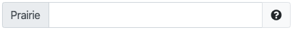

# `pl-string-input` element

Fill in the blank field that allows for **string** value input.

## Sample element



```html title="question.html"
<pl-string-input answers-name="string_value" label="Prairie"></pl-string-input>
```

```python title="server.py"
def generate(data):

    # Answer to fill in the blank input
    data["correct_answers"]["string_value"] = "Learn"
```

## Customizations

| Attribute                 | Type                    | Default         | Description                                                                                                                                                                                           |
| ------------------------- | ----------------------- | --------------- | ----------------------------------------------------------------------------------------------------------------------------------------------------------------------------------------------------- |
| `allow-blank`             | boolean                 | false           | Whether an empty input box is allowed. By default, empty input boxes will not be graded (invalid format).                                                                                             |
| `answers-name`            | string                  | —               | Variable name to store data in. Note that this attribute has to be unique within a question, i.e., no value for this attribute should be repeated within a question.                                  |
| `aria-label`              | string                  | —               | An accessible label for the element.                                                                                                                                                                  |
| `correct-answer`          | string                  | See description | Correct answer for grading. Defaults to `data["correct_answers"][answers-name]`.                                                                                                                      |
| `correct-answer-format`   | `"exact"` or `"regex"`  | `"exact"`       | Whether `correct-answer` is compared as a literal string (`"exact"`) or interpreted as a regular expression (`"regex"`). See [Matching with regular expressions](#matching-with-regular-expressions). |
| `display`                 | `"block"` or `"inline"` | `"inline"`      | How to display the input field. Default is `"block"` if `multiline` is enabled.                                                                                                                       |
| `ignore-case`             | boolean                 | false           | Whether to ignore letter case when grading the answer (e.g. `hello` matches `HELLO`).                                                                                                                 |
| `initial-value`           | string                  | —               | Initial value is added to the text box the first time it is rendered.                                                                                                                                 |
| `label`                   | string                  | —               | A prefix to display before the input box (e.g., `label="$x =$"`).                                                                                                                                     |
| `multiline`               | boolean                 | false           | Whether to allow for multiline input using a `textarea` display.                                                                                                                                      |
| `normalize-to-ascii`      | boolean                 | false           | Whether non-English characters (accents, non-latin alphabets, fancy quotes) should be normalized to equivalent English characters before submitting the file for grading.                             |
| `placeholder`             | string                  | —               | Hint displayed inside the input box describing the expected type of input.                                                                                                                            |
| `remove-leading-trailing` | boolean                 | See description | Whether to remove leading and trailing blank spaces from the input string. Defaults to `true` if `multiline` is enabled, otherwise `false`.                                                           |
| `remove-spaces`           | boolean                 | false           | Whether to remove blank spaces from the input string.                                                                                                                                                 |
| `show-help-text`          | boolean                 | true            | Show the question mark at the end of the input displaying required input parameters.                                                                                                                  |
| `size`                    | integer                 | 35              | Width of the input box.                                                                                                                                                                               |
| `suffix`                  | string                  | —               | A suffix to display after the input box (e.g., `suffix="items"`).                                                                                                                                     |
| `weight`                  | integer                 | 1               | Weight to use when computing a weighted average score over elements.                                                                                                                                  |

## Matching with regular expressions

By default, a submitted answer is graded by comparing it to `correct-answer` as a literal string. Setting `correct-answer-format="regex"` instead interprets `correct-answer` as a [Python regular expression](https://docs.python.org/3/library/re.html), which is useful when several different responses should all be accepted as correct.

The pattern must match the whole submission, not just part of it: grading uses Python's `re.fullmatch()`, which is equivalent to surrounding the pattern with `^(` and `)$`. To match a substring, include `.*` in the pattern. Setting `ignore-case="true"` makes the match case-insensitive.

For example, this question accepts `N` or `nitrogen` in any combination of upper- and lowercase, and rejects anything else:

```html title="question.html"
<pl-string-input
  answers-name="element"
  correct-answer="N|nitrogen"
  correct-answer-format="regex"
  ignore-case="true"
></pl-string-input>
```

Inline flags at the start of the pattern control matching behavior, such as `(?s)` so that `.` also matches newlines, or `(?x)` to ignore whitespace in the pattern and allow `#` comments. No Python `re` flags other than `re.IGNORECASE` (set by `ignore-case`) are available.

In the answer panel, the correct answer is shown as the regular expression it matches against. When `ignore-case` is set, the pattern is displayed with a leading `(?i)` flag so the case-insensitive matching is visible. Because a pattern is not always a friendly answer to show students, you can add a [`pl-answer-panel`](pl-answer-panel.md) element with a more readable description.

If `correct-answer` is not a valid regular expression, the question fails to generate and reports an error to the question author.

## Using multiline inputs

Note that, in multiline inputs, it can be hard to distinguish between inputs with or without a terminating line break (i.e., an additional "Enter" at the end of the input). Because of that, you are strongly encouraged to leave the default setting of `remove-leading-trailing="true"` unchanged when using multiline inputs.

Additionally, multiline inputs will have any CR LF (`"\r\n"` in Python) line breaks normalized to a single LF (a single `"\n"` in Python). Note that this is different from the behavior of a standard `textarea` HTML element.

## Example implementations

- [element/stringInput]

## See also

- [`pl-symbolic-input` for mathematical expression input](pl-symbolic-input.md)
- [`pl-integer-input` for integer input](pl-integer-input.md)
- [`pl-number-input` for numeric input](pl-number-input.md)

---

[element/stringinput]: https://github.com/PrairieLearn/PrairieLearn/tree/master/exampleCourse/questions/element/stringInput
