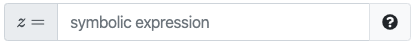

# `pl-symbolic-input` element

Fill in the blank field that allows for mathematical symbol input.

## Sample element



```html title="question.html"
<pl-symbolic-input answers-name="symbolic_math" variables="x, y" label="$z =$"></pl-symbolic-input>
```

```python title="server.py"
import prairielearn as pl
import sympy

def generate(data):

    # Declare math symbols
    x, y = sympy.symbols("x y")

    # Describe the equation
    z = x + y + 1

    # Answer to fill in the blank input stored as JSON.
    data["correct_answers"]["symbolic_math"] = pl.to_json(z)
```

## Customizations

| Attribute                       | Type                    | Default                 | Description                                                                                                                                                                                                                                                                                                                                     |
| ------------------------------- | ----------------------- | ----------------------- | ----------------------------------------------------------------------------------------------------------------------------------------------------------------------------------------------------------------------------------------------------------------------------------------------------------------------------------------------- |
| `answers-name`                  | string                  | —                       | Variable name to store data in. Note that this attribute has to be unique within a question, i.e., no value for this attribute should be repeated within a question. If the correct answer is set in `server.py` as a complex object, you should use `import prairielearn as pl` and `data["correct_answers"][answers-name] = pl.to_json(ans)`. |
| `weight`                        | integer                 | 1                       | Weight to use when computing a weighted average score over elements.                                                                                                                                                                                                                                                                            |
| `correct-answer`                | string                  | See description         | Correct answer for grading. Defaults to `data["correct_answers"][answers-name]`.                                                                                                                                                                                                                                                                |
| `label`                         | string                  | —                       | A prefix to display before the input box (e.g., `label="$F =$"`).                                                                                                                                                                                                                                                                               |
| `aria-label`                    | string                  | —                       | An accessible label for the element.                                                                                                                                                                                                                                                                                                            |
| `display`                       | `"block"` or `"inline"` | `"inline"`              | How to display the input field.                                                                                                                                                                                                                                                                                                                 |
| `formula-editor`                | boolean                 | false                   | Whether the element should provide a visual formula editor for students (recommended when answers are long or contain nested mathematical expressions).                                                                                                                                                                                         |
| `variables`                     | string                  | —                       | A comma-delimited list of symbols that can be used in the symbolic expression.                                                                                                                                                                                                                                                                  |
| `allow-complex`                 | boolean                 | false                   | Whether complex numbers (expressions with `i` or `j` as the imaginary unit) are allowed.                                                                                                                                                                                                                                                        |
| `imaginary-unit-for-display`    | string                  | `"i"`                   | The imaginary unit that is used for display. It must be either `"i"` or `"j"`. Again, this is _only_ for display. Both `i` and `j` can be used by the student in their submitted answer, when `allow-complex="true"`.                                                                                                                           |
| `display-log-as-ln`             | boolean                 | `false`                 | Whether `ln` rather than `log` should be used when displaying submissions and correct answers. Both are considered equivalent and can be used by the student in their submitted answer.                                                                                                                                                         |
| `display-simplified-expression` | boolean                 | `true`                  | Whether expressions submitted by students should be displayed in their simplified form. Setting `display-simplified-expression="false"` can prevent unintended simplifications that might confuse students. Note that, regardless of this setting, answers are always simplified for grading purposes.                                          |
| `allow-trig-functions`          | boolean                 | true                    | Whether trigonometric functions (`cos`, `atanh`, ...) are allowed.                                                                                                                                                                                                                                                                              |
| `allow-blank`                   | boolean                 | false                   | Whether an empty input box is allowed. By default, an empty input box will not be graded (invalid format).                                                                                                                                                                                                                                      |
| `blank-value`                   | string                  | 0 (zero)                | Expression to be used as an answer if the answer is left blank. Only applied if `allow-blank` is `true`. Must be `""` (empty string) or follow the same format as an expected user input (e.g., same variables, etc.).                                                                                                                          |
| `size`                          | integer                 | 35                      | Size of the input box.                                                                                                                                                                                                                                                                                                                          |
| `show-help-text`                | boolean                 | true                    | Show the question mark at the end of the input displaying required input parameters.                                                                                                                                                                                                                                                            |
| `placeholder`                   | string                  | `"symbolic expression"` | Hint displayed inside the input box describing the expected type of input.                                                                                                                                                                                                                                                                      |
| `initial-value`                 | string                  | —                       | Initial value to prefill the input box the first time it is rendered.                                                                                                                                                                                                                                                                           |
| `custom-functions`              | string                  | —                       | A comma-delimited list of custom functions that can be used in the symbolic expression.                                                                                                                                                                                                                                                         |
| `show-score`                    | boolean                 | true                    | Whether to show the score badge next to this element.                                                                                                                                                                                                                                                                                           |
| `suffix`                        | string                  | —                       | A suffix to display after the input box (e.g., `suffix="$\rm m/s^2$"`).                                                                                                                                                                                                                                                                         |

## Details

Correct answers are best created as `sympy` expressions and converted to json using `pl.to_json`. It is also possible to specify the correct answer simply as a string, e.g., `x + y + 1`.

Variables with the same name as greek letters (e.g., `alpha`, `beta`, etc.) will be automatically converted to their LaTeX equivalents for display on the correct answer and submission panels.

Do not include `i` or `j` in the list of `variables` if `allow-complex="true"`, and do not include any other reserved name in your list of `variables` (`e`, `pi`, `cos`, `sin`, etc.). The element code will check for (and disallow) conflicts between your list of `variables`, `custom-functions`, and reserved names.

Note that variables created with additional assumptions in a correct answer will have those assumptions respected when evaluating student answers.
See example question for details.

## Example implementations

- [element/symbolicInput]

## See also

- [`pl-number-input` for numeric input](pl-number-input.md)
- [`pl-integer-input` for integer input](pl-integer-input.md)
- [`pl-string-input` for string input](pl-string-input.md)

---

[element/symbolicinput]: https://github.com/PrairieLearn/PrairieLearn/tree/master/exampleCourse/questions/element/symbolicInput
