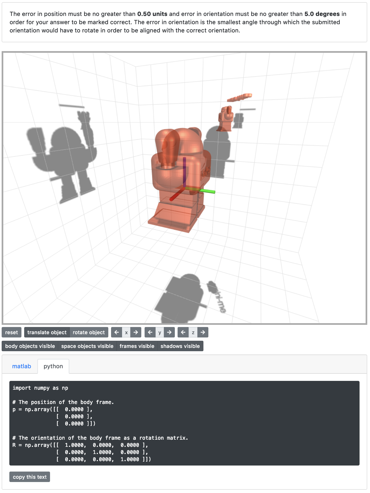

# `pl-threejs` element

This element displays a 3D scene with objects that the student can (optionally) translate and/or rotate. It can be used only for output (e.g., as part of a question that asks for something else to be submitted). Or, it can be used for input (e.g., comparing a submitted pose of the body-fixed objects to a correct orientation). Information about the current pose can be hidden from the student and, if visible, can be displayed in a variety of formats, so the element can be used for many different types of questions.

!!! warning

    This element is **deprecated** and should not be used in new questions.

## Sample element



```html title="question.html"
<pl-threejs answer-name="a">
  <pl-threejs-stl file-name="MAKE_Robot_V6.stl" frame="body" scale="0.1"></pl-threejs-stl>
  <pl-threejs-stl
    file-name="MAKE_Robot_V6.stl"
    frame="body"
    scale="0.025"
    position="[-1,1,2]"
    orientation="[0,0,30]"
  ></pl-threejs-stl>
  <pl-threejs-txt frame="body" position="[-1,1,2.6]" orientation="[0,0,30]">mini-me</pl-threejs-txt>
</pl-threejs>
```

## Customizations

| Attribute                       | Type    | Default         | Description                                                                                                                                                                                                                                                                                                                                                                                                                                                                                                                                                                                                                                                |
| ------------------------------- | ------- | --------------- | ---------------------------------------------------------------------------------------------------------------------------------------------------------------------------------------------------------------------------------------------------------------------------------------------------------------------------------------------------------------------------------------------------------------------------------------------------------------------------------------------------------------------------------------------------------------------------------------------------------------------------------------------------------- |
| `answer-name`                   | string  | —               | Variable name to store data in. Note that this attribute has to be unique within a question, i.e., no value for this attribute should be repeated within a question.                                                                                                                                                                                                                                                                                                                                                                                                                                                                                       |
| `body-position`                 | list    | `[0, 0, 0]`     | Initial position of body as `[x, y, z]`.                                                                                                                                                                                                                                                                                                                                                                                                                                                                                                                                                                                                                   |
| `body-orientation`              | list    | See description | Initial orientation of body. Defaults to zero orientation (body frame aligned with space frame). Interpretation depends on `body-pose-format`.                                                                                                                                                                                                                                                                                                                                                                                                                                                                                                             |
| `camera-position`               | list    | `[5, 2, 2]`     | Initial position of camera as `[x, y, z]`.                                                                                                                                                                                                                                                                                                                                                                                                                                                                                                                                                                                                                 |
| `body-cantranslate`             | boolean | true            | If you can translate the body in the UI.                                                                                                                                                                                                                                                                                                                                                                                                                                                                                                                                                                                                                   |
| `body-canrotate`                | boolean | true            | If you can rotate the body in the UI.                                                                                                                                                                                                                                                                                                                                                                                                                                                                                                                                                                                                                      |
| `camera-canmove`                | boolean | true            | If you can move the camera (i.e., change the view) in the UI.                                                                                                                                                                                                                                                                                                                                                                                                                                                                                                                                                                                              |
| `body-pose-format`              | string  | `"rpy"`         | Determines how `body-orientation` is interpreted. If `"rpy"` then `[roll, pitch, yaw]`. If `matrix` then 3x3 rotation matrix `[[...], [...], [...]]`. If `"quaternion"` then `[x, y, z, w]`. If `"axisangle"` then `[x, y, z, theta]` where `x, y, z` are coordinates of axis and `theta` is angle.                                                                                                                                                                                                                                                                                                                                                        |
| `answer-pose-format`            | string  | `"rpy"`         | Determines how the answer `data["correct_answers"][answer-name]` is interpreted. If `homogeneous`, then the answer must be a 4x4 homogeneous transformation matrix `[[...], [...], [...], [...]]`. Otherwise, the answer must be a list with two elements. The first element must describe position as `[x, y, z]`. The second element must describe orientation, interpreted based on `answer-pose-format`. If `"rpy"` then `[roll, pitch, yaw]`. If `matrix` then 3x3 rotation matrix `[[...], [...], [...]]`. If `quaternion` then `[x, y, z, w]`. If `axisangle` then `[x, y, z, theta]` where `x, y, z` are coordinates of axis and `theta` is angle. |
| `text-pose-format`              | string  | matrix          | Determines how the pose of the body is displayed as text. If `matrix` then position is `[x, y, z]` and orientation is a 3x3 rotation matrix. If `quaternion` then position is `[x, y, z]` and orientation is `[x, y, z, w]`. If `homogeneous` then pose is a 4x4 homogeneous transformation matrix.                                                                                                                                                                                                                                                                                                                                                        |
| `show-pose-in-question`         | boolean | true            | If the current pose of the body is displayed in the question panel.                                                                                                                                                                                                                                                                                                                                                                                                                                                                                                                                                                                        |
| `show-pose-in-correct-answer`   | boolean | true            | If the current pose of the body is displayed in the correct answer panel.                                                                                                                                                                                                                                                                                                                                                                                                                                                                                                                                                                                  |
| `show-pose-in-submitted-answer` | boolean | true            | If the current pose of the body is displayed in the submitted answer panel.                                                                                                                                                                                                                                                                                                                                                                                                                                                                                                                                                                                |
| `tol-position`                  | float   | 0.5             | Error in position must be no more than this for the answer to be marked correct.                                                                                                                                                                                                                                                                                                                                                                                                                                                                                                                                                                           |
| `tol-rotation`                  | float   | 5.0             | Error in rotation must be no more than this for the answer to be marked correct.                                                                                                                                                                                                                                                                                                                                                                                                                                                                                                                                                                           |
| `grade`                         | boolean | true            | If the element will be graded, i.e., if it is being used to ask a question. If `grade` is `false`, then this element will never produce any html in the answer panel or in the submission panel.                                                                                                                                                                                                                                                                                                                                                                                                                                                           |

A `pl-threejs-stl` element inside a `pl-threejs` element allows you to add a mesh described by an `stl` file to the scene, and has these attributes:

| Attribute        | Type   | Default                 | Description                                                                                                                                                                                                                                                                              |
| ---------------- | ------ | ----------------------- | ---------------------------------------------------------------------------------------------------------------------------------------------------------------------------------------------------------------------------------------------------------------------------------------- |
| `file-name`      | string | —                       | Name of `*.stl` file.                                                                                                                                                                                                                                                                    |
| `file-directory` | string | `"clientFilesQuestion"` | Location of `*.stl` file, either `"clientFilesCourse"` or `clientFilesQuestion`.                                                                                                                                                                                                         |
| `frame`          | string | body                    | Which frame the object is fixed to, either `"body"` or `"space"`.                                                                                                                                                                                                                        |
| `color`          | color  | See description         | Color of object as CSS string, defaults to `"#e84a27"` if body-fixed and to `"#13294b"` if space-fixed.                                                                                                                                                                                  |
| `opacity`        | float  | See description         | Opacity of object, defaults to `0.7` if body-fixed and to `0.4` if space-fixed.                                                                                                                                                                                                          |
| `position`       | list   | `[0, 0, 0]`             | Position of object as `[x, y, z]`.                                                                                                                                                                                                                                                       |
| `orientation`    | list   | See description         | Orientation of object. Defaults to zero orientation. Interpretation depends on `format`.                                                                                                                                                                                                 |
| `format`         | string | `"rpy"`                 | Determines how `orientation` is interpreted. If `rpy` then `[roll, pitch, yaw]`. If `matrix` then 3x3 rotation matrix `[[...], [...], [...]]`. If `quaternion` then `[x, y, z, w]`. If `axisangle` then `[x, y, z, theta]` where `x, y, z` are coordinates of axis and `theta` is angle. |

A `pl-threejs-txt` element inside a `pl-threejs` element allows you to add whatever text appears between the `<pl-threejs-txt> ... </pl-threejs-txt>` tags as a mesh to the scene, and has these attributes:

| Attribute     | Type   | Default         | Description                                                                                                                                                                                                                                                                                      |
| ------------- | ------ | --------------- | ------------------------------------------------------------------------------------------------------------------------------------------------------------------------------------------------------------------------------------------------------------------------------------------------ |
| `frame`       | string | body            | Which frame the object is fixed to, either `body` or `space`.                                                                                                                                                                                                                                    |
| `color`       | color  | See description | Color of object as CSS string, defaults to `"#e84a27"` if body-fixed and to `"#13294b"` if space-fixed.                                                                                                                                                                                          |
| `opacity`     | float  | See description | Opacity of object, defaults to `0.7` if body-fixed and to `0.4` if space-fixed.                                                                                                                                                                                                                  |
| `position`    | list   | `[0, 0, 0]`     | Position of object as `[x, y, z]`.                                                                                                                                                                                                                                                               |
| `orientation` | list   | See description | Orientation of object. Defaults to zero orientation. Interpretation depends on `format`.                                                                                                                                                                                                         |
| `format`      | string | `"rpy"`         | Determines how `orientation` is interpreted. If `"rpy"` then `[roll, pitch, yaw]`. If `"matrix"` then 3x3 rotation matrix `[[...], [...], [...]]`. If `"quaternion"` then `[x, y, z, w]`. If `"axisangle"` then `[x, y, z, theta]` where `x, y, z` are coordinates of axis and `theta` is angle. |

## Details

Note that a 3D scene is also created to show each submitted answer. This means
that if there are many submitted answers, the page will load slowly.

## See also

- [External: `three.js` JavaScript library](https://threejs.org/)
