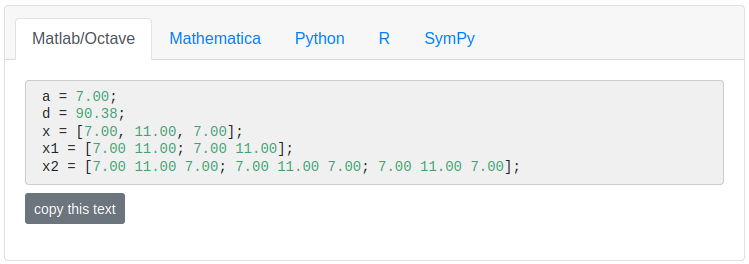

# `pl-variable-output` element

Displays a list of variables that are formatted for import into the
supported programming languages (e.g. MATLAB, Mathematica, Python, or R).

## Sample element



```html title="question.html"
<pl-variable-output digits="3">
  <!-- Example comment inside of this element. -->
  <pl-variable params-name="matrixC">C</pl-variable>
  <pl-variable params-name="matrixD">D</pl-variable>
</pl-variable-output>
```

```python title="server.py"
import prairielearn as pl
import numpy as np

def generate(data):

    # Create fixed matrix
    matrixC = np.matrix("5 6; 7 8")
    matrixD = np.matrix("-1 4; 3 2")
    # Random matrices can be generated with:
    # mat = np.random.random((2, 2))

    # Export each matrix as a JSON object for the question view.
    data["params"]["matrixC"] = pl.to_json(matrixC)
    data["params"]["matrixD"] = pl.to_json(matrixD)
```

## Customizations

Attributes for `<pl-variable-output>`:

| Attribute          | Type                                                      | Default    | Description                                                          |
| ------------------ | --------------------------------------------------------- | ---------- | -------------------------------------------------------------------- |
| `default-tab`      | `"matlab"`, `"mathematica"`, `"python"`, `"r"`, `"sympy"` | `"matlab"` | Select the active tab.                                               |
| `digits`           | integer                                                   | —          | Number of digits to display after the decimal.                       |
| `show-mathematica` | boolean                                                   | true       | Toggles the display of the Mathematica tab.                          |
| `show-matlab`      | boolean                                                   | true       | Toggles the display of the Matlab tab (also compatible with Octave). |
| `show-python`      | boolean                                                   | true       | Toggles the display of the Python tab.                               |
| `show-r`           | boolean                                                   | true       | Toggles the display of the R tab.                                    |
| `show-sympy`       | boolean                                                   | true       | Toggles the display of the SymPy tab.                                |

Attributes for `<pl-variable>` (one of these for each variable to display):

| Attribute     | Type    | Default | Description                                                     |
| ------------- | ------- | ------- | --------------------------------------------------------------- |
| `comment`     | string  | —       | Comment to add after the displayed variable.                    |
| `digits`      | integer | —       | Number of digits to display after the decimal for the variable. |
| `params-name` | string  | —       | Name of variable in `data["params"]` to display.                |

## Details

This element displays a list of variables inside `<pl-code>` tags that are formatted for import into
either MATLAB, Mathematica, Python, or R (the user can switch between them). Each variable must be
either a scalar or a 2D numpy array (expressed as a list). Each variable will be prefixed by the
text that appears between the `<pl-variable>` and `</pl-variable>` tags, followed by `=`. Below
are samples of the format displayed under each language tab.

**MATLAB format:**

```m
A = [1.23; 4.56]; % matrix
```

**Mathematica format:**

```mathematica
A = [1.23; 4.56]; (* matrix *)
```

**Python format:**

```python
import numpy as np

A = np.array([[1.23], [4.56]]) # matrix
```

**R format:**

```r
A = c(1.23, 4.56) # vector
A = matrix(c(1.23, 4.56, 8.90, 1.23), nrow = 2, ncol = 2, byrow = TRUE) # matrix
```

If a variable `v` is a complex object, you should use `import prairielearn as pl` and `data["params"][params-name] = pl.to_json(v)`.

## Example implementations

- [element/variableOutput]
- [element/matrixComponentInput]
- [demo/matrixComplexAlgebra]

## See also

- [`pl-matrix-latex` for displaying the matrix using LaTeX commands.](pl-matrix-latex.md)
- [`pl-matrix-component-input` for individual input boxes for each element in the matrix](pl-matrix-component-input.md)
- [`pl-matrix-input` for input values formatted in a supported programming language.](pl-matrix-input.md)
- [`pl-code` to display blocks of code with syntax highlighting](pl-code.md)

---

[demo/matrixcomplexalgebra]: https://github.com/PrairieLearn/PrairieLearn/tree/master/exampleCourse/questions/demo/matrixComplexAlgebra
[element/matrixcomponentinput]: https://github.com/PrairieLearn/PrairieLearn/tree/master/exampleCourse/questions/element/matrixComponentInput
[element/variableoutput]: https://github.com/PrairieLearn/PrairieLearn/tree/master/exampleCourse/questions/element/variableOutput
