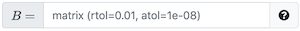
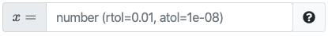

- [`pl-big-o-input`](#pl-big-o-input-element): Fill in a **symbolic** value
  representing asymptotic input.
- [`pl-checkbox`](#pl-checkbox-element): Selecting **multiple options** from a
  list.
- [`pl-excalidraw`](#pl-excalidraw-element): Draw a **vector diagram** using
  [excalidraw](https://github.com/excalidraw/excalidraw).
- [`pl-file-editor`](#pl-file-editor-element): Provide an in-browser code editor
  for writing and submitting code.
- [`pl-file-upload`](#pl-file-upload-element): Provide a submission area
  to obtain a file with a specific naming scheme.
- [`pl-integer-input`](#pl-integer-input-element): Fill in an **integer** value
  such as -71, 0, 5, 21, and so on.
- [`pl-matching`](#pl-matching-element): Select a matching option for each entry in
  a group.
- [`pl-matrix-component-input`](#pl-matrix-component-input-element): Fill in
  a **matrix** using grid that has an input area for each element.
- [`pl-matrix-input`](#pl-matrix-input-element): Supply a matrix in a supported
  programming language format.
- [`pl-multiple-choice`](#pl-multiple-choice-element): Selecting only
  **one option** from a list.
- [`pl-number-input`](#pl-number-input-element): Fill in a **numerical** value
  within a specific tolerance level such as 3.14, -1.921, and so on.
- [`pl-order-blocks`](#pl-order-blocks-element): Select and arrange given blocks of code or text.
- [`pl-rich-text-editor`](#pl-rich-text-editor-element): Provide an in-browser formattable text editor
  for writing and submitting code.
- [`pl-string-input`](#pl-string-input-element): Fill in a **string** value
  such as "Illinois", "GATTACA", "computer", and so on.
- [`pl-symbolic-input`](#pl-symbolic-input-element): Fill in a **symbolic** value
  such as `x^2`, `sin(z)`, `mc^2`, and so on.
- [`pl-units-input`](#pl-units-input-element): Fill in a **number** and a **unit**
  such as "1.5 m", "14 ms", "6.3 ft", and so on.

---

### `pl-big-o-input` element

Fill in the blank field that allows for asymptotic mathematical input (i.e. big O, big Theta, etc.).
Gives automated feedback in the case of improper asymptotic input.

**question.html**

```html
<pl-big-o-input answers-name="ans" variable="n" correct-answer="n**2" size="10"></pl-big-o-input>
```

#### Customizations

| Attribute        | Type                                                  | Default                 | Description                                                                                                                                                          |
| ---------------- | ----------------------------------------------------- | ----------------------- | -------------------------------------------------------------------------------------------------------------------------------------------------------------------- |
| `answers-name`   | string                                                | —                       | Variable name to store data in. Note that this attribute has to be unique within a question, i.e., no value for this attribute should be repeated within a question. |
| `type`           | "big-o", "theta", "omega", "little-o", "little-omega" | "big-o"                 | Type of asymptotic answer required.                                                                                                                                  |
| `weight`         | integer                                               | 1                       | Weight to use when computing a weighted average score over elements.                                                                                                 |
| `correct-answer` | string                                                | -                       | Correct answer for grading.                                                                                                                                          |
| `display`        | "block" or "inline"                                   | "inline"                | How to display the input field.                                                                                                                                      |
| `variable`       | string                                                | —                       | A symbol for use in the symbolic expression. Only one variable supported.                                                                                            |
| `size`           | integer                                               | 35                      | Size of the input box.                                                                                                                                               |
| `show-help-text` | boolean                                               | true                    | Show the question mark at the end of the input displaying required input parameters.                                                                                 |
| `placeholder`    | string                                                | "asymptotic expression" | Hint displayed inside the input box describing the expected type of input.                                                                                           |
| `show-score`     | boolean                                               | true                    | Whether to show the score badge and feedback next to this element.                                                                                                   |
| `allow-blank`    | boolean                                               | false                   | Whether or not an empty input box is allowed. By default, empty input boxes will not be graded (invalid format).                                                     |
| `blank-value`    | string                                                | 1 (one)                 | Value to be used as an answer if element is left blank. Only applied if `allow-blank` is `true`.                                                                     |

#### Details

Correct answers must be specified as strings with Python syntax (e.g., `n**2`, `2**n`, `n * log(n)`), with
the same syntax as [`pl-symbolic-input`](#pl-symbolic-input-element). Only one variable is supported.

#### Example implementations

- [element/bigOInput]

#### See also

- [`pl-number-input` for numeric input](#pl-number-input-element)
- [`pl-integer-input` for integer input](#pl-integer-input-element)
- [`pl-string-input` for string input](#pl-string-input-element)
- [`pl-symbolic-input` for mathematical expression input](#pl-symbolic-input-element)

---

### `pl-checkbox` element

A `pl-checkbox` element displays a subset of the answers in a random order
as checkboxes.

#### Sample element


```html
<pl-checkbox answers-name="vpos" weight="1">
  <pl-answer correct="true">A-B</pl-answer>
  <pl-answer correct="true">B-C</pl-answer>
  <pl-answer> C-D</pl-answer>
  <pl-answer correct="true">D-E</pl-answer>
  <pl-answer> E-F</pl-answer>
  <pl-answer> F-G</pl-answer>
</pl-checkbox>
```

#### Customizations

| Attribute               | Type    | Default | Description                                                                                                                                                                                                                          |
| ----------------------- | ------- | ------- | ------------------------------------------------------------------------------------------------------------------------------------------------------------------------------------------------------------------------------------ |
| `answers-name`          | string  | —       | Variable name to store data in. Note that this attribute has to be unique within a question, i.e., no value for this attribute should be repeated within a question.                                                                 |
| `weight`                | integer | 1       | Weight to use when computing a weighted average score over elements.                                                                                                                                                                 |
| `inline`                | boolean | false   | List answer choices on a single line instead of as separate paragraphs.                                                                                                                                                              |
| `number-answers`        | integer | special | The total number of answer choices to display. Defaults to displaying all answers.                                                                                                                                                   |
| `min-correct`           | integer | special | The minimum number of correct answers to display. Defaults to displaying all correct answers.                                                                                                                                        |
| `max-correct`           | integer | special | The maximum number of correct answers to display. Defaults to displaying all correct answers.                                                                                                                                        |
| `fixed-order`           | boolean | false   | Disable the randomization of answer order.                                                                                                                                                                                           |
| `partial-credit`        | boolean | false   | Enable partial credit scores. By default, the choice of grading method is "all-or-nothing".                                                                                                                                          |
| `partial-credit-method` | string  | 'PC'    | Three grading methods for partial credit: 'COV' (Coverage), 'EDC' (Every Decision Counts), and 'PC' (Percent Correct). See explanation below.                                                                                        |
| `hide-help-text`        | boolean | false   | Help text with hint regarding the selection of answers. Popover button describes the selected grading algorithm ('all-or-nothing', 'COV', 'EDC' or 'PC')                                                                             |
| `detailed-help-text`    | boolean | false   | Display the minimum and maximum number of options that can be selected in a valid submission. See explanation below.                                                                                                                 |
| `hide-answer-panel`     | boolean | false   | Option to not display the correct answer in the correct panel.                                                                                                                                                                       |
| `hide-letter-keys`      | boolean | false   | Hide the letter keys in the answer list, i.e., (a), (b), (c), etc.                                                                                                                                                                   |
| `hide-score-badge`      | boolean | false   | Hide badges next to selected answers.                                                                                                                                                                                                |
| `min-select`            | integer | special | The minimum number of answers that must be selected in any valid submission. Defaults to `min-correct` if that attribute is specified along with `detailed-help-text="true"`; otherwise, defaults to 1.                              |
| `max-select`            | integer | special | The maximum number of answers that can be selected in any valid submission. Defaults to `max-correct` if that attribute is specified along with `detailed-help-text="true"`; otherwise, defaults to the number of displayed answers. |
| `show-number-correct`   | boolean | false   | Display the number of correct choices in the help text.                                                                                                                                                                              |

Inside the `pl-checkbox` element, each choice must be specified with
a `pl-answer` that has attributes:

| Attribute  | Type    | Default | Description                                                                                                                                    |
| ---------- | ------- | ------- | ---------------------------------------------------------------------------------------------------------------------------------------------- |
| `correct`  | boolean | false   | Is this a correct answer to the question?                                                                                                      |
| `feedback` | string  | —       | Helper text (HTML) to be displayed to the student next to the option after question is graded if this option has been selected by the student. |

#### Partial credit grading

Three grading methods are available when using `partial-credit="true"`:

- `'COV'` (Coverage): in this method, the final score is calculated by multiplying the **base score** (the proportion of correct answers that are chosen) with
  the **guessing factor** (the proportion of chosen answers that are correct). Specifically, if `t` is the number of correct answers chosen, `c` is the total number
  of correct answers, and `n` is the total number of answers chosen, then the final score is `(t / c) * (t / n)`. This grading scheme rewards submissions that include (i.e. "cover") all true options.

- `'EDC'` (Every Decision Counts): in this method, the checkbox answers are considered as a list of true/false answers. If `n` is the total number of answers, each answer is assigned `1/n` points. The total score is the summation of the points for every correct answer selected and every incorrect answer left unselected.

- `'PC'` (Percent Correct): in this method, 1 point is added for each correct answer that is marked as correct and 1 point is subtracted for each incorrect answer that is marked as correct. The final score is the resulting summation of points divided by the total number of correct answers. The minimum final score is set to zero.

#### Using the `detailed-help-text` attribute

The `detailed-help-text` attribute can be used with `min-correct` and/or `max-correct` to help students select the correct options. If `min-select` is not specified, then setting `detailed-help-text="true"` ensures that the number of selected options in a valid submission is at least the value of `min-correct`. Similarly, if `max-select` is not specified, then setting `detailed-help-text="true"` ensures that the number of selected options in a valid submission is at most the value of `max-correct`. For example, if a checkbox question does not specify `min-select` or `max-select`, and specifies `min-correct="2"`, `max-correct="4"`, and `detailed-help-text="true"`, then all valid submissions must select between 2 and 4 options. Thus, we help students by preventing them from selecting, say, five options. Indeed, if five options are selected, then at least one selected option is incorrect since there are at most four correct options.

Note that explicitly specifying `min-select` overrides the minimum number of options that must be selected, and similarly, explicitly specifying `max-select` overrides the maximum number of options that can be selected.

#### Restricting the number of options that can be selected

The `min-select` and `max-select` attributes determine the minimum and maximum number of options that can be selected in a valid submission. The value of `min-select` is computed using the following steps:

1. If the `min-select` attribute is explicitly set, then we use the specified value of `min-select`.
2. If `min-select` is not specified, but `min-correct` is specified along with `detailed-help-text="true"`, then we use the specified value of `min-correct`.
3. If steps 1 and 2 do not apply, then we use a default value of 1.

To compute `max-select`, we use a similar algorithm (note the different default value in step 3):

1. If the `max-select` attribute is explicitly set, then we use the specified value of `max-select`.
2. If `max-select` is not specified, but `max-correct` is specified along with `detailed-help-text="true"`, then we use the specified value of `min-correct`.
3. If steps 1 and 2 do not apply, then `max-select` defaults to the number of displayed checkbox options (i.e. students can select all displayed options by default).

#### Example implementations

- [element/checkbox]
- [demo/randomCheckbox]

#### See also

- [`pl-multiple-choice` for allowing only **one** correct choice](#pl-multiple-choice-element)

---

### `pl-excalidraw` element

Draw a vector diagram using [excalidraw](https://github.com/excalidraw/excalidraw). Only manual grading is supported.


**question.html**

```html
<p>Draw something else, with a starter diagram</p>

<pl-excalidraw
  gradable="true"
  answers-name="vector"
  source-file-name="starter.excalidraw"
  directory="clientFilesQuestion"
  width="100%"
  height="600px"
></pl-excalidraw>
```

#### Customizations

| Attribute          | Type                                                                                             | Default | Description                                                                                                             |
| ------------------ | ------------------------------------------------------------------------------------------------ | ------- | ----------------------------------------------------------------------------------------------------------------------- |
| `gradable`         | boolean                                                                                          | "true"  | Whether a diagram accepts input from the user.                                                                          |
| `answers-name`     | string                                                                                           | -       | Unique name to identify the widget with. Drawing submissions are saved with this name. Required when `gradable` is set. |
| `source-file-name` | string                                                                                           | -       | Optional file to load as the starter diagram.                                                                           |
| `directory`        | `serverFilesCourse` or `clientFilesCourse` or `clientFilesQuestion` or `courseExtensions` or `.` | "."     | Directory where the `source-file-name` is loaded from. By default, it refers to the question directory `"."`.           |
| `width`            | string                                                                                           | `100%`  | Width of the widget, compatible with the [CSS width][css-width-mdn] specification.                                      |
| `height`           | string                                                                                           | `800px` | Height of the widget, compatible with the [CSS width][css-width-mdn] specification.                                     |

[css-width-mdn]: https://developer.mozilla.org/en-US/docs/Web/CSS/width

#### Example implementation

[element/excalidraw]

---

### `pl-file-editor` element

Provides an in-browser file editor that's compatible with the other file elements
and external grading system.

#### Sample element


<!-- prettier-ignore -->
```html
<pl-file-editor
  file-name="fib.py"
  ace-mode="ace/mode/python"
  ace-theme="ace/theme/monokai"
>
def fib(n):
    pass
</pl-file-editor>
```

#### Customizations

| Attribute            | Type    | Default            | description                                                                                                                                                                                                                                                                                                                                                                                                                                           |
| -------------------- | ------- | ------------------ | ----------------------------------------------------------------------------------------------------------------------------------------------------------------------------------------------------------------------------------------------------------------------------------------------------------------------------------------------------------------------------------------------------------------------------------------------------- |
| `file-name`          | string  | -                  | The name of this file; will be used to store this file in the `_files` submitted answer                                                                                                                                                                                                                                                                                                                                                               |
| `ace-mode`           | string  | None               | Specifies an Ace editor mode to enable things like intelligent code indenting and syntax highlighting; see the full list of modes [here](https://github.com/ajaxorg/ace/tree/master/src/mode).                                                                                                                                                                                                                                                        |
| `ace-theme`          | string  | `ace/theme/chrome` | Specifies an Ace editor theme; see the full list of themes [here](https://github.com/ajaxorg/ace/tree/master/src/theme).                                                                                                                                                                                                                                                                                                                              |
| `font-size`          | string  | `12px`             | Sets the font size for the Ace editor. Specified as a CSS-style size (e.g., `1rem`, `110%`, `16pt`, or `20px`).                                                                                                                                                                                                                                                                                                                                       |
| `source-file-name`   | string  | None               | Name of the source file with existing code to be displayed in the browser text editor (instead of writing the existing code between the element tags as illustrated in the above code snippet).                                                                                                                                                                                                                                                       |
| `directory`          | string  | special            | Directory where the source file with existing code is to be found. Only useful if `source-file-name` is used. If it contains one of the special names `clientFilesCourse` or `serverFilesCourse`, then the source file name is read from the course's special directories, otherwise the directory is expected to be in the question's own directory. If not provided, the source file name is expected to be found in the question's main directory. |
| `min-lines`          | integer | None               | Minimum number of lines the editor should show initially.                                                                                                                                                                                                                                                                                                                                                                                             |
| `max-lines`          | integer | None               | Maximum number of lines the editor should display at once. Must be greater than `min-lines`.                                                                                                                                                                                                                                                                                                                                                          |
| `auto-resize`        | boolean | true               | Automatically expand the editor panel to ensure all lines are present. Overrides any value set by `max-lines` and establishes a default of 18 lines for `min-lines` if not supplied. See Details below for notes.                                                                                                                                                                                                                                     |
| `preview`            | string  | None               | If set, provides a live preview mode for editing markup languages. Currently supports `html`, `markdown`, or `dot`, though additional languages are supported via extensions (see below).                                                                                                                                                                                                                                                             |
| `focus`              | boolean | false              | Specifies that the editor should begin with the cursor captured and the editing pane focused. See Details below for notes.                                                                                                                                                                                                                                                                                                                            |
| `normalize-to-ascii` | boolean | false              | Whether non-English characters (accents, non-latin alphabets, fancy quotes) should be normalized to equivalent English characters before submitting the file for grading.                                                                                                                                                                                                                                                                             |
| `allow-blank`        | boolean | false              | Whether or not an empty submission is allowed.                                                                                                                                                                                                                                                                                                                                                                                                        |

#### Details

When using `auto-resize`, consider specifying a custom `min-lines` or pre-populating the code editor window with a code sample.
This will initialize the editor area with a sufficient number of lines to display all of the code simultaneously without the need for scrolling.

The `focus` attribute defaults to `"false"`. Setting this to true will cause the file editor element to automatically capture the cursor focus when the question page is loaded, which may also cause the page to scroll down so that the file editor is in view, bypassing any written introduction. This may have negative implications for accessibility with screen readers, so use caution. If you have multiple file editors on the same question page, only one element should have `focus` set to true, or else the behavior may be unpredictable.

This element supports additional preview options through [element extensions](../elementExtensions.md). To provide this functionality, the extension must assign, to `window.PLFileEditor.prototype.preview.PREVIEW_TYPE` (where `PREVIEW_TYPE` is the value of the `preview` attribute), a function that converts a string representing the editor's content into suitable HTML content.

#### Example implementations

- [element/fileEditor]
- [demo/autograder/codeEditor]

#### See also

- [`pl-file-upload` to receive files as a submission](#pl-file-upload-element)
- [`pl-file-preview` to display previously submitted files](decorative-elements.md#pl-file-preview-element)
- [`pl-external-grader-results` to include output from autograded code](conditional-elements.md#pl-external-grader-results-element)
- [`pl-code` to display blocks of code with syntax highlighting](decorative-elements.md#pl-code-element)
- [`pl-string-input` for receiving a single string value](#pl-string-input-element)

---

### `pl-file-upload` element

Provides a way to accept file uploads as part of an answer. They will be stored
in the format expected by externally graded questions.

#### Sample element


```html
<pl-file-upload file-names="foo.py, bar.c, filename with\, comma.txt"></pl-file-upload>
```

#### Customizations

| Attribute    | Type     | Default | description                                                                                                                                    |
| ------------ | -------- | ------- | ---------------------------------------------------------------------------------------------------------------------------------------------- |
| `file-names` | CSV list | ""      | List of files that should and must be submitted. Commas in a filename should be escaped with a backslash, and filenames cannot contain quotes. |

#### Example implementations

- [demo/autograder/codeUpload]
- [demo/manualGrade/codeUpload]

#### See also

- [`pl-file-editor` to provide an in-browser code environment](#pl-file-editor-element)
- [`pl-external-grader-results` to include output from autograded code](conditional-elements.md#pl-external-grader-results-element)
- [`pl-code` to display blocks of code with syntax highlighting](decorative-elements.md#pl-code-element)
- [`pl-string-input` for receiving a single string value](#pl-string-input-element)

---

### `pl-integer-input` element

Fill in the blank field that requires an **integer** input.

#### Sample element


**question.html**

```html
<pl-integer-input answers-name="int_value" label="$y =$"></pl-integer-input>
```

**server.py**

```python
import random

def generate(data):

    # Generate a random whole number
    x = random.randint(1, 10)

    # Answer to fill in the blank input
    data["correct_answers"]["int_value"] = x
```

#### Customizations

| Attribute        | Type                | Default  | Description                                                                                                                                                          |
| ---------------- | ------------------- | -------- | -------------------------------------------------------------------------------------------------------------------------------------------------------------------- |
| `answers-name`   | string              | —        | Variable name to store data in. Note that this attribute has to be unique within a question, i.e., no value for this attribute should be repeated within a question. |
| `weight`         | integer             | 1        | Weight to use when computing a weighted average score over elements.                                                                                                 |
| `correct-answer` | string              | special  | Correct answer for grading. Defaults to `data["correct_answers"][answers-name]`. If `base` is provided, then this answer must be given in the provided base.         |
| `allow-blank`    | boolean             | false    | Whether or not an empty input box is allowed. By default, empty input boxes will not be graded (invalid format).                                                     |
| `blank-value`    | integer             | 0 (zero) | Value to be used as an answer if element is left blank. Only applied if `allow-blank` is `true`.                                                                     |
| `label`          | text                | —        | A prefix to display before the input box (e.g., `label="$x =$"`).                                                                                                    |
| `suffix`         | text                | —        | A suffix to display after the input box (e.g., `suffix="items"`).                                                                                                    |
| `base`           | integer             | 10       | The base used to parse and represent the answer, or the special value 0 (see below).                                                                                 |
| `display`        | "block" or "inline" | "inline" | How to display the input field.                                                                                                                                      |
| `size`           | integer             | 35       | Size of the input box.                                                                                                                                               |
| `show-help-text` | boolean             | true     | Show the question mark at the end of the input displaying required input parameters.                                                                                 |
| `placeholder`    | string              | -        | Custom placeholder text. If not set, defaults to "integer" if `base` is 10, otherwise "integer in base `base`".                                                      |
| `show-score`     | boolean             | true     | Whether to show the score badge next to this element.                                                                                                                |

#### Specifying a non-trivial base

By default, the values are interpreted in base 10. The `base` argument may also be used, with a value between 2 and 36, to indicate a different base to interpret the student input, as well as to print the final result.

The `base` argument can also accept a special value of 0. In this case, the values will by default be interpreted in base 10, however the student has the option of using different prefixes to indicate a value in a different format:

- The prefixes `0x` and `0X` can be used for base-16 values (e.g., `0x1a`);
- The prefixes `0b` and `0B` can be used for base-2 values (e.g., `0b1101`);
- The prefixes `0o` and `0O` can be used for base-8 values (e.g., `0o777`).

#### Integer range

pl-integer-input can accept integers of unbounded size, however the correct answer will only be stored as the Python `int` if it is between -9007199254740991 and +9007199254740991 (between -(2^53 - 1) and +(2^53 - 1)). Otherwise, the correct answer will be stored as a string. This distinction is important in `server.py` scripts for `parse()` and `grade()`, as well as downloaded assessment results.

Note that answers can include underscores which are ignored (i.e., `1_000` will be parsed as `1000`).

#### Example implementations

- [element/integerInput]

#### See also

- [`pl-number-input` for numeric input](#pl-number-input-element)
- [`pl-symbolic-input` for mathematical expression input](#pl-symbolic-input-element)
- [`pl-string-input` for string input](#pl-string-input-element)

---

### `pl-matching` element

Given a list of statements, select a matching option for each entry from a dropdown list.

#### Sample element


**question.html**

```html
<pl-matching answers-name="string_value">
  <pl-statement match="Washington, D.C.">United States</pl-statement>
  <pl-statement match="Mexico City">Mexico</pl-statement>
  <pl-statement match="Paris">France</pl-statement>

  <pl-option>New York City</pl-option>
</pl-matching>
```

#### Customizations

| Attribute             | Type                                                       | Default       | Description                                                                                                                                                                                                            |
| --------------------- | ---------------------------------------------------------- | ------------- | ---------------------------------------------------------------------------------------------------------------------------------------------------------------------------------------------------------------------- |
| `answers-name`        | string                                                     | —             | Variable name to store data in. Note that this attribute has to be unique within a question, i.e., no value for this attribute should be repeated within a question.                                                   |
| `weight`              | integer                                                    | 1             | Weight to use when computing a weighted average score over elements.                                                                                                                                                   |
| `fixed-order`         | boolean                                                    | false         | Whether or not to display the statements in a fixed order; otherwise they are shuffled.                                                                                                                                |
| `fixed-options-order` | boolean                                                    | false         | Whether or not to display the options in a fixed order; otherwise they are shuffled. See the details of `pl-option` below for more information on option ordering.                                                     |
| `number-statements`   | integer                                                    | special       | The number of statements to display. Defaults to all statements.                                                                                                                                                       |
| `number-options`      | integer                                                    | special       | The number of options to display. Defaults to all options. The `none-of-the-above` option does not count towards this number.                                                                                          |
| `none-of-the-above`   | boolean                                                    | false         | Whether or not to add a "None of the above" to the end of the options.                                                                                                                                                 |
| `blank`               | boolean                                                    | true          | Option to add blank dropdown entry as the default selection in each dropdown list.                                                                                                                                     |
| `allow-blank`         | boolean                                                    | false         | Whether or not a blank submission is allowed. If this is set to true, a statement that selects the blank entry will be marked as incorrect instead of invalid.                                                         |
| `counter-type`        | "decimal" or "lower-alpha" or "upper-alpha" or "full-text" | "lower-alpha" | The type of counter to use when enumerating the options. If set to "full-text", the column of options will be hidden, and the text of each option will be used in the statements' dropdown lists, instead of counters. |
| `hide-score-badge`    | boolean                                                    | false         | Whether or not to hide the correct/incorrect score badge next to each graded answer choice.                                                                                                                            |
| `options-placement`   | "right" or "bottom"                                        | "right"       | The placement of options relative to the statements in order to make it visually cohesive. Especially useful when dealing with long statements or options.                                                             |

Inside the `pl-matching` element, a series of `pl-statement` and `pl-option` elements specify the questions the student must answer and the options to which they can be matched, respectively. Statements are displayed in the left column, and options in the right.

A total of `number-statements` statements will be randomly selected and displayed to the student. The corresponding matching options will be gathered; if `number-options` is larger than the number of options used by the selected statements, then random distractors will be selected from the remaining unused options. If the selected statements require more options than `number-options`, then `none-of-the-above` will automatically be set to true.

The content of a `pl-statement` can be any HTML element, including other PrairieLearn elements. A `pl-statement` must be specified with these attributes:

| Attribute | Type   | Default | Description                                                                                                                                                                                                                                                         |
| --------- | ------ | ------- | ------------------------------------------------------------------------------------------------------------------------------------------------------------------------------------------------------------------------------------------------------------------- |
| `match`   | string | —       | Identifies the option as the correct response for this `pl-statement`. If `match` corresponds to the `name` of any `pl-option` element, the statement will be linked to that `pl-option`, otherwise a new option is implicitly created based on this `match` value. |

The content of a `pl-option` can be any HTML element, including other PrairieLearn elements. `pl-option` elements are optional; options are created by default based on the `match` attribute of each `pl-statement`. Additional `pl-option` elements can be added to serve as distractors (an option that is always incorrect, such as "New York City" in the example above), or to render formatted HTML/PrairieLearn elements instead of plain text (see the last question in the demo problem linked in the "Example implementations" below).

When the `fixed-options-order` feature is used, options are shown in the following order:

1. Any explicitly-defined `pl-option` elements are shown first, in the order they are declared.
2. Any implicitly-defined options defined by a `pl-statement` `match` attribute are shown next, in the order they are declared.

It is recommended to explicitly define `pl-option` elements when using `fixed-options-order` to have complete certainty on the order they will be shown.

A `pl-option` must be specified with these attributes:

| Attribute | Type   | Default | Description                                                                                                                                           |
| --------- | ------ | ------- | ----------------------------------------------------------------------------------------------------------------------------------------------------- |
| `name`    | string | special | A key used to match this option as the correct response to a `pl-statement`. If not given, the attribute is set to the inner HTML of the `pl-option`. |

#### Example implementations

- [element/matching]

---

### `pl-matrix-component-input` element

A `pl-matrix-component-input` element displays a grid of input fields with
the same shape of the variable stored in `answers-name`
(only 2D arrays of real numbers can be stored in `answers-name`).

#### Sample element


**question.html**

```html
<pl-matrix-component-input answers-name="matrixA" label="$A=$"></pl-matrix-component-input>
```

**server.py**

```python
import prairielearn as pl
import numpy as np

def generate(data):

    # Generate a random 3x3 matrix
    mat = np.random.random((3, 3))

    # Answer to each matrix entry converted to JSON
    data["correct_answers"]["matrixA"] = pl.to_json(mat)
```

#### Customizations

| Attribute              | Type                            | Default                | Description                                                                                                                                                                                                                    |
| ---------------------- | ------------------------------- | ---------------------- | ------------------------------------------------------------------------------------------------------------------------------------------------------------------------------------------------------------------------------ |
| `answers-name`         | string                          | —                      | Variable name to store data in. Note that this attribute has to be unique within a question, i.e., no value for this attribute should be repeated within a question.                                                           |
| `weight`               | integer                         | 1                      | Weight to use when computing a weighted average score over elements.                                                                                                                                                           |
| `label`                | text                            | —                      | A prefix to display before the input box (e.g., `label="$F =$"`).                                                                                                                                                              |
| `comparison`           | "relabs", "sigfig", or "decdig" | "relabs"               | How to grade. "relabs" uses relative ("rtol") and absolute ("atol") tolerances. "sigfig" and "decdig" use "digits" significant or decimal digits.                                                                              |
| `rtol`                 | number                          | 1e-2                   | Relative tolerance for `comparison="relabs"`.                                                                                                                                                                                  |
| `atol`                 | number                          | 1e-8                   | Absolute tolerance for `comparison="relabs"`.                                                                                                                                                                                  |
| `digits`               | integer                         | 2                      | number of digits that must be correct for `comparison="sigfig"` or `comparison="decdig"`.                                                                                                                                      |
| `allow-partial-credit` | boolean                         | false                  | Whether or not to allow credit for each correct matrix component. By default, the variable is graded as correct only when all matrix components are correct.                                                                   |
| `allow-feedback`       | boolean                         | `allow-partial-credit` | Whether or not to allow feedback indicating which matrix components are incorrect. The default value of `allow-feedback` is the value of `allow-partial-credit`.                                                               |
| `allow-fractions`      | boolean                         | true                   | Whether to allow answers expressed as a rational number of the format `a/b`.                                                                                                                                                   |
| `allow-blank`          | boolean                         | false                  | Whether or not empty input boxes are allowed. By default, matrices with at least one empty input box will not be graded (invalid format).                                                                                      |
| `blank-value`          | string                          | 0 (zero)               | Value to be used as an answer for each individual component if the component is left blank. Only applied if `allow-blank` is `true`. Must follow the same format as an expected user input (e.g., fractions if allowed, etc.). |

#### Details

The question will only be graded when all matrix components are entered, unless the `allow-blank` attribute is enabled.

#### Example implementations

- [element/matrixComponentInput]

#### See also

- [`pl-matrix-input` for a matrix formatted in an implemented programming language](#pl-matrix-input-element)
- [`pl-number-input` for a single numeric input](#pl-number-input-element)
- [`pl-symbolic-input` for a mathematical expression input](#pl-symbolic-input-element)

---

### `pl-matrix-input` element

A `pl-matrix-input` element displays an input field that accepts a matrix
(i.e., a 2-D array) expressed in a supported programming language
format (either MATLAB or Python's numpy).

#### Sample element



**question.html**

```html
<pl-matrix-input answers-name="matrixB" label="$B=$"></pl-matrix-input>
```

**server.py**

```python
import prairielearn as pl
import numpy as np

def generate(data):
    # Randomly generate a 2x2 matrix
    matrixB = np.random.random((2, 2))

    # Answer exported to question.
    data["correct_answers"]["matrixB"] = pl.to_json(matrixB)
```

#### Customizations

| Attribute        | Type                            | Default  | Description                                                                                                                                                                                                    |
| ---------------- | ------------------------------- | -------- | -------------------------------------------------------------------------------------------------------------------------------------------------------------------------------------------------------------- |
| `answers-name`   | string                          | —        | Variable name to store data in. Note that this attribute has to be unique within a question, i.e., no value for this attribute should be repeated within a question.                                           |
| `weight`         | integer                         | 1        | Weight to use when computing a weighted average score over elements.                                                                                                                                           |
| `label`          | text                            | —        | A prefix to display before the input box (e.g., `label="$F =$"`).                                                                                                                                              |
| `comparison`     | "relabs", "sigfig", or "decdig" | "relabs" | How to grade. "relabs" uses relative ("rtol") and absolute ("atol") tolerances. "sigfig" and "decdig" use "digits" significant or decimal digits.                                                              |
| `rtol`           | number                          | 1e-2     | Relative tolerance for `comparison="relabs"`.                                                                                                                                                                  |
| `atol`           | number                          | 1e-8     | Absolute tolerance for `comparison="relabs"`.                                                                                                                                                                  |
| `digits`         | integer                         | 2        | number of digits that must be correct for `comparison="sigfig"` or `comparison="decdig"`.                                                                                                                      |
| `allow-complex`  | boolean                         | false    | Whether or not to allow complex numbers as answers. If the correct answer `ans` is a complex object, you should use `import prairielearn as pl` and `data["correct_answers"][answers-name] = pl.to_json(ans)`. |
| `show-help-text` | boolean                         | true     | Show the question mark at the end of the input displaying required input parameters.                                                                                                                           |

#### Details

`pl-matrix-input` parses a matrix entered in either `MATLAB` or `Python` formats.
The following are valid input format options:

**MATLAB format:**

```
[1.23; 4.56]
```

**Python format:**

```
[[1.23], [4.56]]
```

**Note:** A scalar will be accepted either as a matrix of size 1 x 1 (e.g., `[1.23]` or `[[1.23]]`) or just as a single number (e.g., `1.23`).

In the answer panel, a `pl-matrix-input` element displays the correct answer, allowing the user to switch between matlab and python format.

In the submission panel, a `pl-matrix-input` element displays either the submitted answer (in the same format that it was submitted, either MATLAB or Python), or a note that the submitted answer was invalid (with an explanation of why).

#### Example implementations

- [demo/matrixComplexAlgebra]

#### See also

- [`pl-matrix-component-input` for individual input boxes for each element in the matrix](#pl-matrix-component-input-element)
- [`pl-number-input` for a single numeric input](#pl-number-input-element)
- [`pl-symbolic-input` for a mathematical expression input](#pl-symbolic-input-element)

---

### `pl-multiple-choice` element

A `pl-multiple-choice` element selects **one** correct answer and zero or more
incorrect answers and displays them in a random order as radio buttons.
Duplicate answer choices (string equivalents) are not permitted in the
`pl-multiple-choice` element, and an exception will be raised upon question
generation if two (or more) choices are identical.

#### Sample element


```html
<pl-multiple-choice answers-name="acc" weight="1">
  <pl-answer correct="false">positive</pl-answer>
  <pl-answer correct="true">negative</pl-answer>
  <pl-answer correct="false">zero</pl-answer>
</pl-multiple-choice>
```

#### Customizations

| Attribute                    | Type                                         | Default            | Description                                                                                                                                                                                |
| ---------------------------- | -------------------------------------------- | ------------------ | ------------------------------------------------------------------------------------------------------------------------------------------------------------------------------------------ |
| `answers-name`               | string                                       | —                  | Variable name to store data in. Note that this attribute has to be unique within a question, i.e., no value for this attribute should be repeated within a question.                       |
| `weight`                     | integer                                      | 1                  | Weight to use when computing a weighted average score over elements.                                                                                                                       |
| `display`                    | "block", "inline", or "dropdown"             | "block"            | Display option for the input field. Block and inline display answer choices as radio buttons, while dropdown presents option as a dropdown.                                                |
| `number-answers`             | integer                                      | special            | The total number of answer choices to display. Defaults to displaying one correct answer and all incorrect answers.                                                                        |
| `order`                      | "random", "ascend", "descend", or "fixed"    | "random"           | Order to display answer choices. Fixed order displays choices in the same order as the original source file.                                                                               |
| `hide-letter-keys`           | boolean                                      | false              | Hide the letter keys in the answer list, i.e., (a), (b), (c), etc.                                                                                                                         |
| `all-of-the-above`           | "false", "random", "correct", "incorrect"    | "false"            | Add "All of the above" choice. See below for details.                                                                                                                                      |
| `none-of-the-above`          | "false", "random", "correct", or "incorrect" | "false"            | Add "None of the above" choice. See below for details.                                                                                                                                     |
| `all-of-the-above-feedback`  | string                                       | —                  | Helper text to be displayed to the student next to the `all-of-the-above` option after question is graded if this option has been selected by the student.                                 |
| `none-of-the-above-feedback` | string                                       | —                  | Helper text to be displayed to the student next to the `none-of-the-above` option after question is graded if this option has been selected by the student.                                |
| `allow-blank`                | boolean                                      | false              | Whether or not an empty submission is allowed. If `allow-blank` is set to `true`, a submission that does not select any option will be marked as incorrect instead of invalid.             |
| `size`                       | integer                                      | -                  | Manually set the size of the dropdown to a fixed width. The default behavior is to make the dropdown as wide as the widest option. Should only be used with `display` set to `"dropdown"`. |
| `placeholder`                | string                                       | "Select an option" | String to be used as the placeholder text when `display` is set to `dropdown`. Will also accept an empty string as `placeholder=""`.                                                       |

The attributes `none-of-the-above` and `all-of-the-above` can be set to one of these values:

- `false`: the corresponding choice will not be shown in the list of choices. This is the default.
- `random`: the corresponding choice will always be shown, and will be randomly correct, with probability proportional to the total number of correct choices. In other words, if there are `N` possible correct choices in total, this choice will be correct with probability `1/N`.
- `correct`: the corresponding choice will always be shown and will always be the correct answer.
- `incorrect`: the corresponding choice will always be shown and will always be an incorrect answer (i.e., a distractor).

**Notes**

- "All of the above" and "None of the above", if set, are bounded by the `number-answers` value above. Also, these two values are always shown as the last choices, regardless of the setting for `fixed-order`. If both choices are shown, then "All of the above" will be listed before "None of the above".
- Defining answer choices with external JSON files via the `external-json` attribute is now deprecated.

Inside the `pl-multiple-choice` element, each choice must be specified with
a `pl-answer` that has attributes:

| Attribute  | Type    | Default | Description                                                                                                                                    |
| ---------- | ------- | ------- | ---------------------------------------------------------------------------------------------------------------------------------------------- |
| `correct`  | boolean | false   | Is this a correct answer to the question?                                                                                                      |
| `feedback` | string  | —       | Helper text (HTML) to be displayed to the student next to the option after question is graded if this option has been selected by the student. |
| `score`    | float   | —       | Score given to answer choice if selected by student. Defaults to 1.0 for correct answers and 0.0 for incorrect answers.                        |

#### Example implementations

- [element/multipleChoice]
- [demo/randomMultipleChoice]

#### See also

- [`pl-checkbox` for allowing **one or more** choices](#pl-checkbox-element)

### `pl-number-input` element

Fill in the blank field that allows for **numeric** value input within specific
tolerances.

#### Sample element



**question.html**

```html
<pl-number-input answers-name="ans_rtol" label="$x =$"> </pl-number-input>
```

**server.py**

```python
import random

def generate(data):

    # Generate a random value
    x = random.uniform(1, 2)

    # Answer to fill in the blank input
    data["correct_answers"]["ans_rtol"] = x
```

---


**question.html**

```html
<pl-number-input answers-name="ans_sig" comparison="sigfig" digits="2" label="$x =$">
</pl-number-input>
```

**server.py**

```python
import random

def generate(data):

    # Generate a random value
    x = random.uniform(1, 2)

    # Answer to fill in the blank input
    data["correct_answers"]["ans_sig"] = round(x, 2)
```

#### Customizations

| Attribute             | Type                            | Default  | Description                                                                                                                                                                                                                                                                                                                                                                                                                                                                             |
| --------------------- | ------------------------------- | -------- | --------------------------------------------------------------------------------------------------------------------------------------------------------------------------------------------------------------------------------------------------------------------------------------------------------------------------------------------------------------------------------------------------------------------------------------------------------------------------------------- |
| `answers-name`        | string                          | —        | Variable name to store data in. Note that this attribute has to be unique within a question, i.e., no value for this attribute should be repeated within a question.                                                                                                                                                                                                                                                                                                                    |
| `weight`              | integer                         | 1        | Weight to use when computing a weighted average score over elements.                                                                                                                                                                                                                                                                                                                                                                                                                    |
| `correct-answer`      | float                           | special  | Correct answer for grading. Defaults to `data["correct_answers"][answers-name]`.                                                                                                                                                                                                                                                                                                                                                                                                        |
| `label`               | text                            | —        | A prefix to display before the input box (e.g., `label="$F =$"`).                                                                                                                                                                                                                                                                                                                                                                                                                       |
| `suffix`              | text                            | —        | A suffix to display after the input box (e.g., `suffix="$\rm m/s^2$"`).                                                                                                                                                                                                                                                                                                                                                                                                                 |
| `display`             | "block" or "inline"             | "inline" | How to display the input field.                                                                                                                                                                                                                                                                                                                                                                                                                                                         |
| `comparison`          | "relabs", "sigfig", or "decdig" | "relabs" | How to grade. "relabs" uses relative ("rtol") and absolute ("atol") tolerances. "sigfig" and "decdig" use "digits" significant or decimal digits.                                                                                                                                                                                                                                                                                                                                       |
| `rtol`                | number                          | 1e-2     | Relative tolerance for `comparison="relabs"`.                                                                                                                                                                                                                                                                                                                                                                                                                                           |
| `atol`                | number                          | 1e-8     | Absolute tolerance for `comparison="relabs"`.                                                                                                                                                                                                                                                                                                                                                                                                                                           |
| `digits`              | integer                         | 2        | number of digits that must be correct for `comparison="sigfig"` or `comparison="decdig"`.                                                                                                                                                                                                                                                                                                                                                                                               |
| `allow-complex`       | boolean                         | false    | Whether or not to allow complex numbers as answers. If the correct answer `ans` is a complex object, you should use `import prairielearn as pl` and `data["correct_answers"][answers-name] = pl.to_json(ans)`.                                                                                                                                                                                                                                                                          |
| `allow-blank`         | boolean                         | false    | Whether or not an empty input box is allowed. By default, empty input boxes will not be graded (invalid format).                                                                                                                                                                                                                                                                                                                                                                        |
| `show-score`          | boolean                         | true     | Whether to show the score badge next to this element.                                                                                                                                                                                                                                                                                                                                                                                                                                   |
| `blank-value`         | string                          | 0 (zero) | Value to be used as an answer if element is left blank. Only applied if `allow-blank` is `true`. Must follow the same format as an expected user input (e.g., fractions if allowed, complex numbers if allowed, etc.).                                                                                                                                                                                                                                                                  |
| `show-help-text`      | boolean                         | true     | Show the question mark at the end of the input displaying required input parameters.                                                                                                                                                                                                                                                                                                                                                                                                    |
| `placeholder`         | string                          | -        | Custom placeholder text. By default, the placeholder text shown is the default comparison.                                                                                                                                                                                                                                                                                                                                                                                              |
| `size`                | integer                         | 35       | Size of the input box.                                                                                                                                                                                                                                                                                                                                                                                                                                                                  |
| `show-correct-answer` | boolean                         | true     | Whether to show the correct answer in the submitted answers panel.                                                                                                                                                                                                                                                                                                                                                                                                                      |
| `allow-fractions`     | boolean                         | true     | Whether to allow answers expressed as a rational number of the format `a/b`.                                                                                                                                                                                                                                                                                                                                                                                                            |
| `custom-format`       | string                          | special  | Custom format to use when formatting the submitted or correct answer. By default, submitted answers are shown with the format `.12g`, while the correct answer uses `.12g` if the comparison method is `relabs`, or a custom format based on the number of digits if the comparison method is `sigfig` or `decdig`. A full description of the format can be found [on the Python documentation page](https://docs.python.org/3/library/string.html#format-specification-mini-language). |

#### Example implementations

- [element/numberInput]
- [demo/calculation]

#### See also

- [`pl-integer-input` for integer input](#pl-integer-input-element)
- [`pl-symbolic-input` for mathematical expression input](#pl-symbolic-input-element)
- [`pl-string-input` for string input](#pl-string-input-element)

---

### `pl-order-blocks` element

Element to arrange given blocks of code or text that are displayed initially in the _source area_. The blocks can be moved to the _solution area_ to construct the solution of the problem. In the example below, the source area is denoted by the header "Drag from here" and the solution area is denoted with the header "Construct your solution here".

#### Sample element


**question.html**

```html
<p>List all the even numbers in order:</p>
<pl-order-blocks answers-name="order-numbers">
  <pl-answer correct="false">1</pl-answer>
  <pl-answer correct="true">2</pl-answer>
  <pl-answer correct="false">3</pl-answer>
  <pl-answer correct="true">4</pl-answer>
</pl-order-blocks>
```

#### Customizations

| Attribute             | Type                                            | Default                        | Description                                                                                                                                                                                                                                                                                                                                                                                                                                                    |
| --------------------- | ----------------------------------------------- | ------------------------------ | -------------------------------------------------------------------------------------------------------------------------------------------------------------------------------------------------------------------------------------------------------------------------------------------------------------------------------------------------------------------------------------------------------------------------------------------------------------- |
| `answers-name`        | string                                          | —                              | Variable name to store data in. Note that this attribute has to be unique within a question, i.e., no value for this attribute should be repeated within a question.                                                                                                                                                                                                                                                                                           |
| `weight`              | integer                                         | 1                              | Weight to use when computing a weighted average score over all elements in a question.                                                                                                                                                                                                                                                                                                                                                                         |
| `grading-method`      | string                                          | "ordered"                      | One of the following: `ordered`, `unordered`, `ranking`, `dag`, `external`. See more details below.                                                                                                                                                                                                                                                                                                                                                            |
| `allow-blank`         | boolean                                         | false                          | Whether or not an empty solution area is allowed. By default, an empty solution area with no dropped blocks will not be graded (invalid format).                                                                                                                                                                                                                                                                                                               |
| `file-name`           | string                                          | `user_code.py`                 | Name of the file where the information from the blocks will be saved, to be used by the external grader.                                                                                                                                                                                                                                                                                                                                                       |
| `source-blocks-order` | "random", "ordered", or "alphabetized"          | "random"                       | The order of the blocks in the source area. See more details below.                                                                                                                                                                                                                                                                                                                                                                                            |
| `indentation`         | boolean                                         | false                          | Enable both the ability for indentation in the solution area and the grading of the expected indentation (set by `indent` in `pl-answer`, as described below).                                                                                                                                                                                                                                                                                                 |
| `max-incorrect`       | integer                                         | special                        | The maximum number of incorrect answers to be displayed in the source area. The incorrect answers are set using `<pl-answer correct="false">`. Defaults to displaying all incorrect answers.                                                                                                                                                                                                                                                                   |
| `min-incorrect`       | integer                                         | special                        | The minimum number of incorrect answers to be displayed in the source area. The incorrect answers are set using `<pl-answer correct="false">`. Defaults to displaying all incorrect answers.                                                                                                                                                                                                                                                                   |
| `source-header`       | string                                          | "Drag from here"               | The text that appears at the start of the source area.                                                                                                                                                                                                                                                                                                                                                                                                         |
| `solution-header`     | string                                          | "Construct your solution here" | The text that appears at the start of the solution area.                                                                                                                                                                                                                                                                                                                                                                                                       |
| `solution-placement`  | "right" or "bottom"                             | "right"                        | `right` shows the source and solution areas aligned side-by-side. `bottom` shows the solution area below the source area.                                                                                                                                                                                                                                                                                                                                      |
| `partial-credit`      | "none" or "lcs"                                 | Depends on `grading-method`    | For the `dag`, `ordered`, and `ranking` grading methods, you may specify `none` for no partial credit or `lcs` for partial credit based on the LCS edit-distance from the student solution to some correct solution. Note that `partial-credit` defaults to `lcs` for the `dag` and `ranking` grading method, and to `none` for the `ordered` grading method for backward compatibility. Grading method `unordered` will always assign partial credit.         |
| `feedback`            | "none", "first-wrong", or "first-wrong-verbose" | "none"                         | The level of feedback the student will recieve upon giving an incorrect answer. Available with the `dag` or `ranking` grading mode. `none` will give no feedback. `first-wrong` will tell the student which block in their answer was the first to be incorrect. If set to `first-wrong-verbose`, if the first incorrect block is a distractor any feedback associated with that distractor will be shown as well (see "distractor-feedback" in `<pl-answer>`) |
| `format`              | "code" or "default"                             | "default"                      | If this property is set to "code", then the contents of each of the blocks will be wrapped with a `pl-code` element.                                                                                                                                                                                                                                                                                                                                           |
| `code-language`       | string                                          | -                              | The programming language syntax highlighting to use. Only available when using `format="code"`.                                                                                                                                                                                                                                                                                                                                                                |
| `inline`              | boolean                                         | false                          | `false` sets the blocks to be stacked vertically whereas `true` requires blocks to be placed horizontally.                                                                                                                                                                                                                                                                                                                                                     |

Within the `pl-order-blocks` element, each element must either be a `pl-answer` or a `pl-block-group` (see details below for more info on `pl-block-group`). Each element within a `pl-block-group` must be a `pl-answer`. The `pl-answer` elements specify the content for each of the blocks, and may have the following attributes:

| Attribute             | Type               | Default | Description                                                                                                                                                                                                                                                                                                                                                               |
| --------------------- | ------------------ | ------- | ------------------------------------------------------------------------------------------------------------------------------------------------------------------------------------------------------------------------------------------------------------------------------------------------------------------------------------------------------------------------- |
| `correct`             | boolean            | true    | Specifies whether the answer block is a correct answer to the question (and should be moved to the solution area).                                                                                                                                                                                                                                                        |
| `ranking`             | positive integer   | —       | This attribute is used when `grading-method="ranking"` and it specifies the correct ranking of the answer block. For example, a block with ranking `2` should be placed below a block with ranking `1`. The same ranking can be used when the order of certain blocks is not relevant. Blocks that can be placed at any position should not have the `ranking` attribute. |
| `indent`              | integer in [-1, 4] | -1      | Specifies the correct indentation level of the block. For example, a value of `2` means the block should be indented twice. A value of `-1` means the indention of the block does not matter. This attribute can only be used when `indentation="true"`.                                                                                                                  |
| `depends`             | string             | ""      | Optional attribute when `grading-method="dag"`. Used to specify the directed acyclic graph relation among the blocks, with blocks being referred to by their `tag`. For example, if `depends="1,3"` for a particular block, it must appear later in the solution than the block with `tag="1"` and the block with `tag="3"`.                                              |
| `tag`                 | string             | ""      | Optional attribute. Used to identify the block when declaring which other blocks depend on it or are a distractor for it.                                                                                                                                                                                                                                                 |
| `distractor-for`      | string             | ""      | Optional attribute on blocks where `correct=false`. Used to visually group a distractor block with a correct block that it is similar to, should match the `tag` attribute of the block that it should be visually paired with.                                                                                                                                           |
| `distractor-feedback` | string             | ""      | Optional attribute, used when `correct=false` that indicates why a given block is incorrect or should not be included in the solution. Shown to the student after all attempts at a problem are exhausted, or if `"first-wrong"=true` and the first incorrect line in their submission has `distractor-feedback`.                                                         |

#### Details

Different grading options are defined via the attribute `grading-method`:

- `ordered`: in this method, the correct ordering of the blocks is defined by the ordering in which
  the correct answers (defined in `pl-answer`) appear in the HTML file.
- `unordered`: in this method, if `n` is the total number of correct blocks, each correct block moved to the solution area is given `1/n` points, and each incorrect block moved to the solution area is subtracted by `1/n` points. The final score will be at least 0 (the student cannot earn a negative score by only moving incorrect answers). Note the ordering of the blocks does not matter. That is, any permutation of the answers within the solution area is accepted.
- `ranking`: in this method, the `ranking` attribute of the `pl-answer` options are used to check answer ordering. Every answer block _X_ should have a `ranking` integer that is less than or equal to the answer block immediately below _X_. That is, the sequence of `ranking` integers of all the answer blocks should form a _nonstrictly increasing_ sequence. If `n` is the total number of answers, each correctly ordered answer is worth `1/n`, up to the first incorrectly ordered answer.
- `dag`: in this method, the `depends` attibute of the `pl-answer` options are used to declare the directed acyclic graph relation between the blocks, and a correct answer is any topological sort of that directed acyclic graph. If `pl-block-group` elements are used to divide some blocks into groups, then a correct answer is a topological sort of the lines of the proof with the added condition that the lines of each group must be listed contiguously (as an example, this is useful for expressing a [proof by cases][demo/proofblocks] when the `dag` grader is used for mathematical proofs). Blocks inside a `pl-block-group` element may only depend or be depended on by blocks within the same `pl-block-group`, and `pl-blocks-group`s can be given their own `tag` and `depends` properties so that a block may depend on an entire group, or a group may depend on a block or group.
- `external`: in this method, the blocks moved to the solution area will be saved in the file `user_code.py`, and the correctness of the code will be checked using the external grader. Depending on the external grader grading code logic, it may be possible to enable or disable partial credit. The attribute `correct` for `pl-answer` can still be used in conjunction with `min-incorrect` and `max-incorrect` for display purposes only, but not used for grading purposes. The attributes `ranking` and `indent` are not allowed for this grading method.

Different ordering of the blocks in the source area defined via the attribute `source-blocks-order`:

- `random`: the blocks are shuffled.
- `ordered`: the blocks appear in the source area in the same order they appear in the HTML file.
- `alphabetized`: the blocks are alphabetized according to their HTML contents. Take care when including HTML in blocks. For instance, `<b>cat</b>` will appear before `<i>bat</i>`.

#### Example implementations

- [element/orderBlocks]
- [demo/proofBlocks]
- [demo/autograder/python/orderBlocksRandomParams]
- [demo/autograder/python/orderBlocksAddNumpy]

---

### `pl-rich-text-editor` element

Provides an in-browser rich text editor, aimed mostly at manual grading essay-type questions. This editor is based on the [Quill rich text editor](https://quilljs.com/).

#### Sample element


```html
<pl-rich-text-editor file-name="answer.html"> </pl-rich-text-editor>
```

#### Customizations

| Attribute            | Type                          | Default            | description                                                                                                                                                                                                                                                                                                                                                                                                                                           |
| -------------------- | ----------------------------- | ------------------ | ----------------------------------------------------------------------------------------------------------------------------------------------------------------------------------------------------------------------------------------------------------------------------------------------------------------------------------------------------------------------------------------------------------------------------------------------------- |
| `file-name`          | string                        | -                  | The name of the output file; will be used to store the student's answer in the `_files` submitted answer                                                                                                                                                                                                                                                                                                                                              |
| `quill-theme`        | string                        | `snow`             | Specifies a Quill editor theme; the most common themes are `snow` (which uses a default toolbar) or `bubble` (which hides the default toolbar, showing formatting options when text is selected). See [the Quill documentation](https://quilljs.com/docs/themes/) for more information about additional themes.                                                                                                                                       |
| `source-file-name`   | string                        | None               | Name of the source file with existing content to be displayed in the editor. The format of this file must match the format specified in the `format` attribute.                                                                                                                                                                                                                                                                                       |
| `directory`          | string                        | special            | Directory where the source file with existing code is to be found. Only useful if `source-file-name` is used. If it contains one of the special names `clientFilesCourse` or `serverFilesCourse`, then the source file name is read from the course's special directories, otherwise the directory is expected to be in the question's own directory. If not provided, the source file name is expected to be found in the question's main directory. |
| `placeholder`        | string                        | "Your answer here" | Text to be shown in the editor as a placeholder when there is no student input.                                                                                                                                                                                                                                                                                                                                                                       |
| `format`             | `html` or `markdown`          | `html`             | Format used to save the student's response. This format also affects how the source file name or inner HTML is interpreted.                                                                                                                                                                                                                                                                                                                           |
| `markdown-shortcuts` | boolean                       | `true`             | Whether or not the editor accepts shortcuts based on markdown format (e.g., typing `_word_` causes the word to become italic).                                                                                                                                                                                                                                                                                                                        |
| `counter`            | `word`, `character` or `none` | `none`             | Whether a word or character count should be displayed at the bottom of the editor.                                                                                                                                                                                                                                                                                                                                                                    |
| `allow-blank`        | boolean                       | false              | Whether or not an empty input box is allowed. By default, empty submissions will not be graded (invalid format).                                                                                                                                                                                                                                                                                                                                      |

#### Example implementations

- [element/richTextEditor]

#### See also

- [`pl-file-editor` to edit unformatted text, such as code](#pl-file-editor-element)
- [`pl-file-upload` to receive files as a submission](#pl-file-upload-element)
- [`pl-string-input` for receiving a single string value](#pl-string-input-element)

---

### `pl-string-input` element

Fill in the blank field that allows for **string** value input.

#### Sample element


**question.html**

```html
<pl-string-input answers-name="string_value" label="Prairie"></pl-string-input>
```

**server.py**

```python
def generate(data):

    # Answer to fill in the blank input
    data["correct_answers"]["string_value"] = "Learn"
```

#### Customizations

| Attribute                 | Type                | Default  | Description                                                                                                                                                               |
| ------------------------- | ------------------- | -------- | ------------------------------------------------------------------------------------------------------------------------------------------------------------------------- |
| `answers-name`            | string              | —        | Variable name to store data in. Note that this attribute has to be unique within a question, i.e., no value for this attribute should be repeated within a question.      |
| `weight`                  | integer             | 1        | Weight to use when computing a weighted average score over elements.                                                                                                      |
| `correct-answer`          | string              | special  | Correct answer for grading. Defaults to `data["correct_answers"][answers-name]`.                                                                                          |
| `label`                   | text                | —        | A prefix to display before the input box (e.g., `label="$x =$"`).                                                                                                         |
| `suffix`                  | text                | —        | A suffix to display after the input box (e.g., `suffix="items"`).                                                                                                         |
| `display`                 | "block" or "inline" | "inline" | How to display the input field.                                                                                                                                           |
| `remove-leading-trailing` | boolean             | false    | Whether or not to remove leading and trailing blank spaces from the input string.                                                                                         |
| `remove-spaces`           | boolean             | false    | Whether or not to remove blank spaces from the input string.                                                                                                              |
| `allow-blank`             | boolean             | false    | Whether or not an empty input box is allowed. By default, empty input boxes will not be graded (invalid format).                                                          |
| `ignore-case`             | boolean             | false    | Whether or not to enforce case sensitivity (e.g. "hello" != "HELLO").                                                                                                     |
| `normalize-to-ascii`      | boolean             | false    | Whether non-English characters (accents, non-latin alphabets, fancy quotes) should be normalized to equivalent English characters before submitting the file for grading. |
| `placeholder`             | text                | None     | Hint displayed inside the input box describing the expected type of input.                                                                                                |
| `size`                    | integer             | 35       | Size of the input box.                                                                                                                                                    |
| `show-help-text`          | boolean             | true     | Show the question mark at the end of the input displaying required input parameters.                                                                                      |

#### Example implementations

- [element/stringInput]

#### See also

- [`pl-symbolic-input` for mathematical expression input](#pl-symbolic-input-element)
- [`pl-integer-input` for integer input](#pl-integer-input-element)
- [`pl-number-input` for numeric input](#pl-number-input-element)

---

### `pl-symbolic-input` element

Fill in the blank field that allows for mathematical symbol input.

#### Sample element


**question.html**

```html
<pl-symbolic-input answers-name="symbolic_math" variables="x, y" label="$z =$"></pl-symbolic-input>
```

**server.py**

```python
import prairielearn as pl
import sympy

def generate(data):

    # Declare math symbols
    x, y = sympy.symbols("x y")

    # Describe the equation
    z = x + y + 1

    # Answer to fill in the blank input stored as JSON.
    data["correct_answers"]["symbolic_math"] = pl.to_json(z)
```

#### Customizations

| Attribute                    | Type                | Default               | Description                                                                                                                                                                                                                                                                                                                     |
| ---------------------------- | ------------------- | --------------------- | ------------------------------------------------------------------------------------------------------------------------------------------------------------------------------------------------------------------------------------------------------------------------------------------------------------------------------- |
| `answers-name`               | string              | —                     | Variable name to store data in. Note that this attribute has to be unique within a question, i.e., no value for this attribute should be repeated within a question. If the correct answer `ans` is a `sympy` object, you should use `import prairielearn as pl` and `data["correct_answers"][answers-name] = pl.to_json(ans)`. |
| `weight`                     | integer             | 1                     | Weight to use when computing a weighted average score over elements.                                                                                                                                                                                                                                                            |
| `correct-answer`             | float               | special               | Correct answer for grading. Defaults to `data["correct_answers"][answers-name]`.                                                                                                                                                                                                                                                |
| `label`                      | text                | —                     | A prefix to display before the input box (e.g., `label="$F =$"`).                                                                                                                                                                                                                                                               |
| `display`                    | "block" or "inline" | "inline"              | How to display the input field.                                                                                                                                                                                                                                                                                                 |
| `variables`                  | string              | —                     | A comma-delimited list of symbols that can be used in the symbolic expression.                                                                                                                                                                                                                                                  |
| `allow-complex`              | boolean             | false                 | Whether complex numbers (expressions with `i` or `j` as the imaginary unit) are allowed.                                                                                                                                                                                                                                        |
| `imaginary-unit-for-display` | string              | `i`                   | The imaginary unit that is used for display. It must be either `i` or `j`. Again, this is _only_ for display. Both `i` and `j` can be used by the student in their submitted answer, when `allow-complex="true"`.                                                                                                               |
| `allow-trig-functions`       | boolean             | true                  | Whether trigonometric functions (`cos`, `atanh`, ...) are allowed.                                                                                                                                                                                                                                                              |
| `allow-blank`                | boolean             | false                 | Whether or not an empty input box is allowed. By default, an empty input box will not be graded (invalid format).                                                                                                                                                                                                               |
| `blank-value`                | string              | 0 (zero)              | Expression to be used as an answer if the answer is left blank. Only applied if `allow-blank` is `true`. Must follow the same format as an expected user input (e.g., same variables, etc.).                                                                                                                                    |
| `size`                       | integer             | 35                    | Size of the input box.                                                                                                                                                                                                                                                                                                          |
| `show-help-text`             | boolean             | true                  | Show the question mark at the end of the input displaying required input parameters.                                                                                                                                                                                                                                            |
| `placeholder`                | string              | "symbolic expression" | Hint displayed inside the input box describing the expected type of input.                                                                                                                                                                                                                                                      |
| `custom-functions`           | string              | -                     | A comma-delimited list of custom functions that can be used in the symbolic expression.                                                                                                                                                                                                                                         |
| `show-score`                 | boolean             | true                  | Whether to show the score badge next to this element.                                                                                                                                                                                                                                                                           |
| `suffix`                     | text                | -                     | A suffix to display after the input box (e.g., `suffix="$\rm m/s^2$"`).                                                                                                                                                                                                                                                         |

#### Details

Correct answers are best created as `sympy` expressions and converted to json using `pl.to_json`. It is also possible to specify the correct answer simply as a string, e.g., `x + y + 1`.

Variables with the same name as greek letters (e.g., `alpha`, `beta`, etc.) will be automatically converted to their LaTeX equivalents for display on the correct answer and submission panels.

Do not include `i` or `j` in the list of `variables` if `allow-complex="true"`, and do not include any other reserved name in your list of `variables` (`e`, `pi`, `cos`, `sin`, etc). The element code will check for (and disallow) conflicts between your list of `variables`, `custom-functions`, and reserved names.

Note that variables created with additional assumptions in a correct answer will have those assumptions respected when evaluating student answers.
See example question for details.

#### Example implementations

- [element/symbolicInput]

#### See also

- [`pl-number-input` for numeric input](#pl-number-input-element)
- [`pl-integer-input` for integer input](#pl-integer-input-element)
- [`pl-string-input` for string input](#pl-string-input-element)

---

### `pl-units-input` element

Fill in the blank field that allows for **numeric** input and accompanying **units**.

#### Sample element

**question.html**

```html
<pl-units-input answers-name="c_1" correct-answer="1m" atol="1cm"></pl-units-input>
```

#### Customizations

| Attribute                  | Type                                         | Default      | Description                                                                                                                                                                                                                                                                                                                   |
| -------------------------- | -------------------------------------------- | ------------ | ----------------------------------------------------------------------------------------------------------------------------------------------------------------------------------------------------------------------------------------------------------------------------------------------------------------------------- |
| `answers-name`             | string                                       | -            | Variable name to store data in. Note that this attribute has to be unique within a question, i.e., no value for this attribute should be repeated within a question.                                                                                                                                                          |
| `weight`                   | integer                                      | 1            | Weight to use when computing a weighted average score over elements.                                                                                                                                                                                                                                                          |
| `correct-answer`           | string                                       | special      | Correct answer for grading. Defaults to `data["correct_answers"][answers-name]`.                                                                                                                                                                                                                                              |
| `label`                    | text                                         | -            | A prefix to display before the input box (e.g., `label="$F =$"`).                                                                                                                                                                                                                                                             |
| `suffix`                   | text                                         | -            | A suffix to display after the input box (e.g., `suffix="$\rm m/s^2$"`).                                                                                                                                                                                                                                                       |
| `display`                  | "block" or "inline"                          | "inline"     | How to display the input field.                                                                                                                                                                                                                                                                                               |
| `grading-mode`             | "with-units", "exact-units", or "only-units" | "with-units" | How to grade student submission. "only-units" only checks for the units input by the student. "exact-units" asks for a quantity with a specified unit. "with-units" is similar to "exact-units", but will automatically convert the units used by the given answer if possible.                                               |
| `comparison`               | "exact", "sigfig", "decdig" or "relabs"      | "sigfig"     | How to grade. "relabs" uses relative ("rtol") and absolute ("atol") tolerances. "sigfig" use "digits" significant digits. "decdig" uses "digits" after decimal place, "exact" uses `==` and should only be used for integers. Attribute can only be set if `grading-mode=exact-units`                                         |
| `rtol`                     | number                                       | 1e-2         | Relative tolerance for `comparison="relabs"` and `grading-mode="with-units"`.                                                                                                                                                                                                                                                 |
| `atol`                     | string                                       | 1e-8         | Absolute tolerance for `comparison="relabs"` and `grading-mode="with-units"`. In `grading-mode="with-units"`, the default value copies the units used in the correct answer, and custom values must include units.                                                                                                            |
| `digits`                   | integer                                      | 2            | Number of digits that must be correct for `comparison="sigfig"` or `comparison="decdig"`.                                                                                                                                                                                                                                     |
| `allow-blank`              | boolean                                      | false        | Whether or not an empty input box is allowed. By default, empty input boxes will not be graded (invalid format).                                                                                                                                                                                                              |
| `blank-value`              | string                                       | ""           | Value to be used as an answer if element is left blank. Only applied if `allow-blank` is true. Must follow the same format as an expected user input.                                                                                                                                                                         |
| `size`                     | integer                                      | 35           | Size of the input box.                                                                                                                                                                                                                                                                                                        |
| `show-help-text`           | boolean                                      | true         | Show the question mark at the end of the input displaying required input parameters.                                                                                                                                                                                                                                          |
| `placeholder`              | string                                       | -            | String to override default placeholder text. The default placeholder gives information about the comparison type used.                                                                                                                                                                                                        |
| `magnitude-partial-credit` | float                                        | -            | Fraction of partial credit given to answers of correct magnitude and incorrect units when `grading-mode=exact-units`. Remaining fraction of credit given when units are correct but magnitude is incorrect. Must be between 0.0 and 1.0. Partial credit is disabled if this is not set.                                       |
| `allow-feedback`           | boolean                                      | true         | Whether to show detailed feedback from the autograder for incorrect answers (for example, stating whether a unit or magnitude specifically is incorrect). Feedback varies based on `grading-mode`.                                                                                                                            |
| `custom-format`            | string                                       | -            | Custom format specifier to use when formatting the submitted and correct answer after processing. By default, uses standard string conversion. A full description of the format can be found [on the Pint documentation page](https://pint.readthedocs.io/en/stable/getting/tutorial.html?highlight=print#string-formatting). |
| `show-score`               | boolean                                      | true         | Whether to show the score badge next to this element.                                                                                                                                                                                                                                                                         |

#### Details

This element uses [Pint](https://pint.readthedocs.io/en/stable/index.html) to parse and represent units. Any units allowed by Pint are supported by this element. To obtain a `Pint` unit registry, question code can use `pl.get_unit_registry()` to construct a default unit registry. This is recommended over constructing a registry using the constructor provided by `Pint` (as this does not use caching and is slower).

#### Example implementations

- [element/unitsInput]

{!elements/reference-links.md!}
