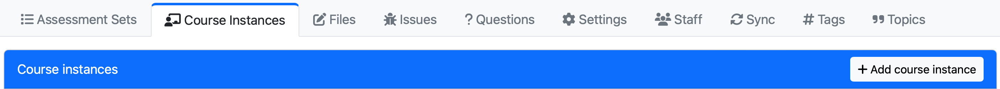

# Create content in the browser

Now that you have access to your course in [https://us.prairielearn.com](https://us.prairielearn.com), it is time to start creating course content.

This is a view of your course home page (or a similar variation, depending on when your course was originally created):



This tutorial will show you how to create:

- [a course instance](#creating-a-course-instance)
- [simple questions from scratch](#creating-questions-from-scratch)
- [questions using templates from inside your course](#start-a-new-question-from-an-existing-one-inside-your-own-course)
- [questions using templates from outside courses](#start-a-new-question-from-an-existing-one-outside-your-own-course)
- [assessments](#creating-a-new-assessment)

## Creating a course instance

A course instance corresponds to a single offering of a course, such as "Fall 2024", or possibly "Fall 2024, Section M". Follow the steps below to create a new course instance:

- Navigate to the "Course instances" page of your course.

- Click the "Add course instance" button.

- Configure the long name, short name, publishing settings, and other desired options for your new course instance.

- Click "Create" to create the course instance.

## Creating questions from scratch

### Add a new question

- Navigate to the "Questions" page of your course.

- Click the "Add question" button.

- Configure the title and QID for your new question:
  - For the sake of this tutorial, use "Find the area of a rectangle" as the title and `rectangle-area` as the QID.
  - You can opt to start from a PrairieLearn template or start from scratch with an empty question. Select "Empty question" for this tutorial.

- Click "Create question".

You're now ready to build your question.

### Change the content of the question

To provide a simple example, here we first create a question without any randomization, by modifying the [`question.html` file](question/overview.md#html-questionhtml).

- Navigate to the "Files" tab of your new question.

- Click the "Edit" button next to `question.html`.

- Modify the content of the file. You may want to start by copying this simple example:

  ```html title="question.html"
  <pl-question-panel>
    <p>What is the area of a rectangle that has sides 4 and 5?</p>
  </pl-question-panel>

  <pl-multiple-choice answers-name="area">
    <pl-answer correct="true">20</pl-answer>
    <pl-answer correct="false">10</pl-answer>
    <pl-answer correct="false">9</pl-answer>
    <pl-answer correct="false">18</pl-answer>
    <pl-answer correct="false">40</pl-answer>
  </pl-multiple-choice>
  ```

- Click "Save and sync".

- Navigate to the "Preview" tab to see your question. Try it out!

Note that this question does not use any server-side code, and for that reason, the file `server.py` is not needed. Indeed, you could just delete `server.py` for this question. (we will not remove the file for the purpose of the following steps of this tutorial).

## Start a new question from an existing one _inside_ your own course

- From the "Questions" page of your course, select the question you want to copy. As an example, we will use the question with QID `rectangle-area`.

- Navigate to the "Settings" tab of your question.

- Click the "Make a copy of this question" button, then click "Submit" to make a copy of the question inside your own course. You are now viewing the copy of the question.

- Update the title and QID of the question. For the sake of this tutorial, change the QID to `rectangle-area-randomized` and the title to "Find the area of a rectangle (randomized)".

- Click "Save".

### Change the content of the question

We will add randomization to the previous question, using the [`server.py` file](question/overview.md#custom-generation-and-grading-serverpy)

- Navigate to the "Files" tab of your new question.

- Click the "Edit" button next to `server.py`. Here is where you can define the question variables, and add randomization. Here is how we can modify the original area example:

  ```python title="server.py"
  import random

  def generate(data):
      # define the sides of the rectangle as random integers
      a = random.randint(2,5)
      b = random.randint(11,19)

      # store the sides in the dictionary "params"
      data["params"]["a"] = a
      data["params"]["b"] = b

      # define some typical distractors
      data["params"]["distractor1"] = (a*b)/2
      data["params"]["distractor2"] = 2*(a*b)
      data["params"]["distractor3"] = 2*(a+b)
      data["params"]["distractor4"] = (a+b)

      # define the correct answer
      data["params"]["truearea"] = a*b
  ```

- Click "Save and sync".

- Navigate to the "Files" tab again.

- Click the "Edit" button next to `question.html` and enter the following contents:

  ```html title="question.html"
  <pl-question-panel>
    <p>What is the area of a rectangle that has sides {{params.a}} and {{params.b}}?</p>
  </pl-question-panel>

  <pl-multiple-choice answers-name="area">
    <pl-answer correct="true">{{params.truearea}}</pl-answer>
    <pl-answer correct="false">{{params.distractor1}}</pl-answer>
    <pl-answer correct="false">{{params.distractor2}}</pl-answer>
    <pl-answer correct="false">{{params.distractor3}}</pl-answer>
    <pl-answer correct="false">{{params.distractor4}}</pl-answer>
  </pl-multiple-choice>
  ```

- Click "Save and sync".

- Navigate to the "Preview" tab to see your question. Try different variants and see how the variables change!

## Start a new question from an existing one _outside_ your own course

### Copying questions from the example course (XC 101)

You should also have access to the example course ("XC 101"). In the navigation sidebar, use the dropdown to navigate to the example course.

You can look over all questions on the "Questions" tab. Or you can select the course instance `SectionA` where some of the questions are organized by assessment. For example, "Question gallery for PL elements" will have a collection of examples for each PrairieLearn element. If you are interested in code autograders, you can check "Questions using external auto-graders".

Once you find a question that you want to use as template, you can follow these steps:

- Navigate to the question's "Settings" tab.

- Click the "Make a copy of this question" button. Select your course and click "Submit".

You are now viewing a copy of the question inside your course. You can modify the question following the steps from the section above.

## Creating a new assessment

Before you create an assessment, make sure you are in the desired course instance.

- Navigate to the "Assessments" page of your course instance.

- Click the "Add assessment" button.

- Configure the basic options for your new assessment:
  - For the sake of this tutorial, use "Geometric properties and applications" as the title and `homework1` as the short name.
  - The [assessment type](assessment/configuration.md#assessment-types) controls the behavior of the assessment. For this tutorial, select `Homework`.
  - The assessment set is used to organize assessments within the course instance. PrairieLearn has some standardized sets (e.g. Homework, Quiz, Exam), and you can also [create your own](course/index.md#assessment-sets). For this tutorial, select `Homework`.

- Click "Create".

We're now ready to configure the content and access settings of the assessment.

- Navigate to the "Files" tab of your new assessment.

- Click the "Edit" button next to `infoAssessment.json`.

- The `allowAccess` section controls when the assessment is available. Read the [assessment access control documentation](assessment/accessControl.md) to learn about the different configurations available. In this example, we will use:

  ```json title="infoAssessment.json"
  {
    "allowAccess": [
      {
        "startDate": "2025-09-01T20:00:00",
        "endDate": "2025-09-06T20:00:00",
        "credit": 100
      }
    ]
  }
  ```

- The `zones` section configures the questions that appear on the assessment. We will add the two questions that we just created:

  ```json title="infoAssessment.json"
  {
    "zones": [
      {
        "questions": [
          { "id": "rectangle-area", "points": 1, "maxPoints": 5 },
          { "id": "rectangle-area-randomized", "points": 1, "maxPoints": 1 }
        ]
      }
    ]
  }
  ```

- Click "Save and sync".

## Check how a student will see the assessment

Follow these steps to preview an assessment as a student:

- From the course instance's "Assessments" page, switch to student view by using the dropdown menu next to your name on the top menu and select "Student view without access restrictions". This action will take you to the Student Assessment page.

- Select the desired assessment (in our example, "Geometric properties and applications").

- Browse through the questions included in the assessment. Submit answers and observe how the points are updated in the assessment overview page.

When using "Student view without access restrictions", you have access to all assessments, regardless of their start and end dates. If you want to have a preview of only the assessments available to the students at the current time, you should select "Student view" from the dropdown menu.

Learn more:

- [Different ways to set up an assessment](assessment/overview.md)

- [Detailed list of PrairieLearn elements](./elements/index.md)
