# Get started

This guide walks you through the process of creating your first course instance and assessment in the browser.

If you're brand-new to PrairieLearn, consider reading the [Concepts](concepts/index.md) page first — this guide assumes you know what a course, course instance, assessment, and question are.

!!! tip "Course content is stored in a Git repository"

    PrairieLearn stores all of your course content in a **Git repository**. This means that course configuration files (questions, assessments, course staff, etc.) can be managed as files on disk, which can be beneficial for larger course staffs. See [editing and syncing](sync.md) and [local installation](installing.md) for more information.

Before you start, you need a PrairieLearn course space. If you don't have one yet, [request a course](requestCourse/index.md). When approved, you'll receive a GitHub repository for your course content and Owner permissions on the course in PrairieLearn.

## 1. Open your course

Sign in at [https://us.prairielearn.com](https://us.prairielearn.com) (or your institution's PrairieLearn instance). Your course appears under **Courses with instructor access** on the home page.

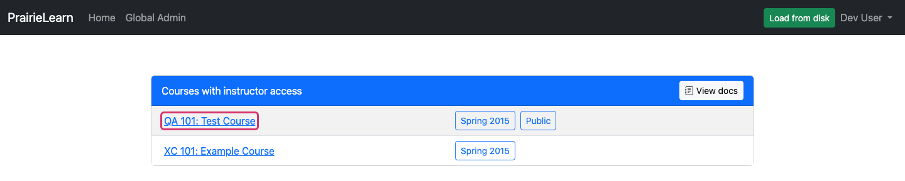

Click the course name to open it. You land on the **Course instances** page.

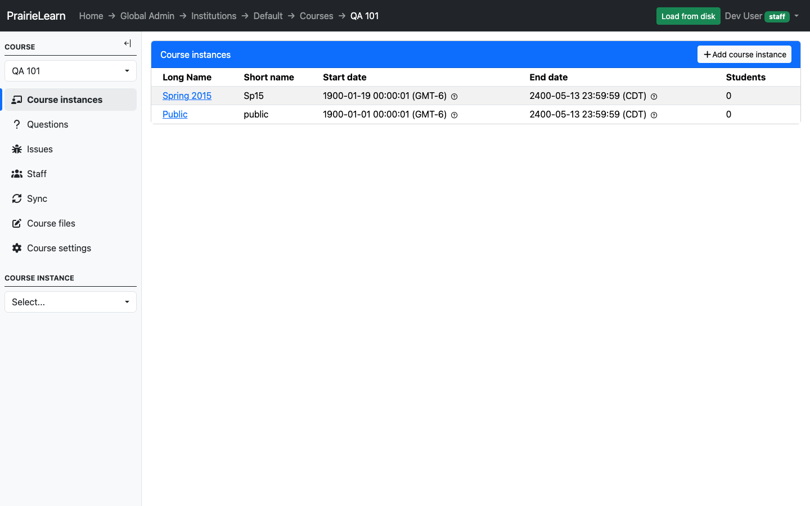

The sidebar splits into two scopes:

- **Course** (top): everything that lives across all terms — questions, course-wide settings, the question bank, course staff.
- **Course instance** (bottom): one term's offering — assessments, gradebook, students, LMS connections.

!!! tip

    The course is the question bank and staff list; each course instance reuses that question bank for one specific semester.

## 2. Create a course instance

A course instance is one offering of the course — for example, "Fall 2025." From **Course instances**, click **Add course instance**.

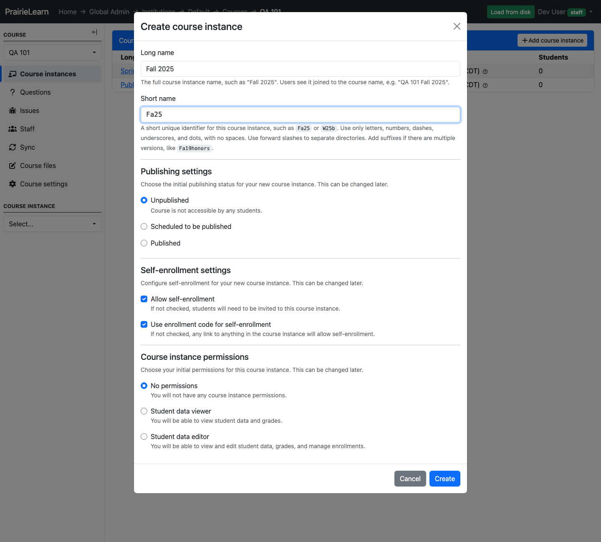

Fill in:

- **Long name** — what students see (e.g., `Fall 2025`).
- **Short name** — a directory-safe identifier (e.g., `Fa25`). No spaces.
- **Publishing settings** — leave **Unpublished** while you build. You'll publish in step 10.
- **Self-enrollment settings** — leave the defaults if you'll share an enrollment link with students; uncheck if you'll add students manually or via LMS. See [enrollment controls](courseInstance/index.md#enrollment-controls) for the full set of options.
- **Course instance permissions** — pick **Student data editor** if you want to view/edit grades from this course instance. (You can change this later from the Staff tab.)

Click **Create**. You're now inside the new course instance.

!!! tip "Reusing a previous semester"

    To clone a previous instance with all its assessments, open that instance, go to **Instance settings → Settings**, and scroll to **Make a copy of this course instance**. You'll edit dates and any new assessments, but the structure is preserved.

## 3. Add your course staff

If you have TAs or co-instructors, invite them now. Go to **Staff** in the **Course** sidebar.


Click **Add users** and invite by UID (typically email). There are two levels of roles you can give to course staff:

Course roles (content authoring):

- **Editor** — can edit questions and assessments and trigger syncs. Most TAs and co-instructors get this.
- **Viewer** — read-only access to course content. Useful for observers.

Course instance roles (student data access):

- **Student data editor** — can view and edit student data on this course instance (grades, manual grading).
- **Student data viewer** — can view student data on this course instance.

See [course staff](course/index.md#course-staff) for the full breakdown and recommended roles.

## 4. Build your first question

Switch back to the **Course** scope and click **Questions**.

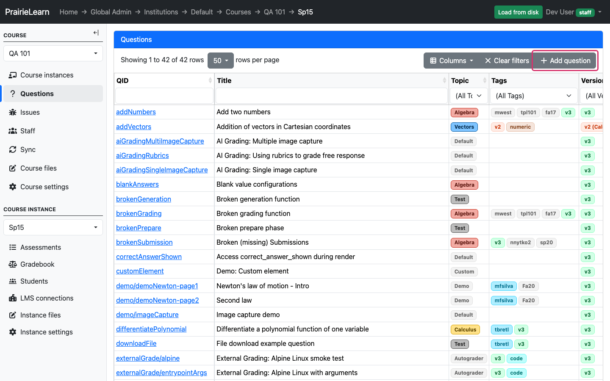

(Yours will be empty — the screenshot shows a populated course so you can see the layout.) Click **Add question**.

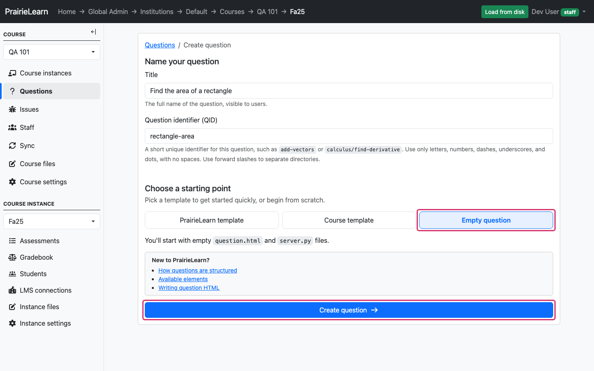

For this tutorial: name it `Find the area of a rectangle`, set the **QID** to `rectangle-area`, choose **Empty question**, click **Create question**.

You land on the question's **Files** tab.

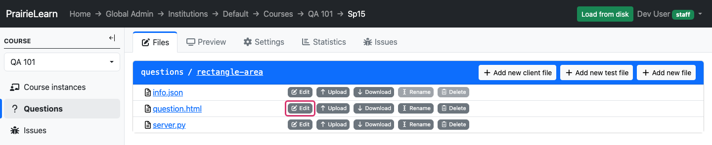

Click **Edit** next to `question.html` and replace the contents with:

```html title="question.html"
<pl-question-panel>
  <p>What is the area of a rectangle that has sides 4 and 5?</p>
</pl-question-panel>

<pl-multiple-choice answers-name="area">
  <pl-answer correct="true">20</pl-answer>
  <pl-answer correct="false">10</pl-answer>
  <pl-answer correct="false">9</pl-answer>
  <pl-answer correct="false">18</pl-answer>
  <pl-answer correct="false">40</pl-answer>
</pl-multiple-choice>
```

[`pl-multiple-choice`](elements/pl-multiple-choice.md) is one of PrairieLearn's [submission elements](elements/index.md#submission-elements) — the inputs students interact with. The [element catalog](elements/index.md) lists every element you can use here.

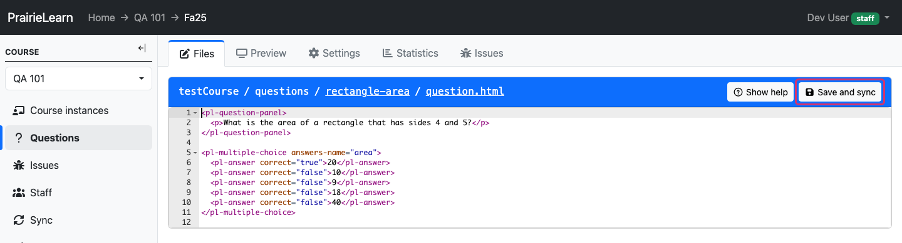

Click **Save and sync**, then click the **Preview** tab.

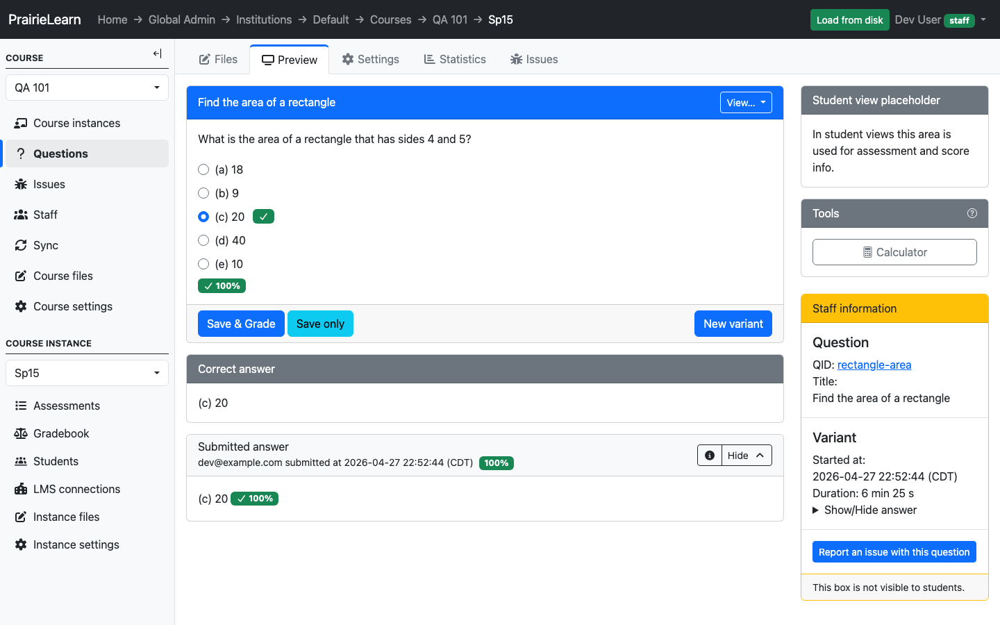

Try answering and click **Save & Grade**. The orange **Staff information** sidebar is staff-only — students don't see it.

!!! warning "Randomization is recommended"

    This question doesn't randomize -- every variant students see is the same. We recommend that all auto-graded questions are randomized.

## 5. Add randomization with `server.py`

A question's [`server.py`](question/server.md) generates random parameters per student and (optionally) custom-grades responses. Go back to **Files** and edit `server.py`:

```python title="server.py"
import random

def generate(data):
    a = random.randint(2, 5)
    b = random.randint(11, 19)

    data["params"]["a"] = a
    data["params"]["b"] = b

    data["params"]["distractor1"] = (a * b) / 2
    data["params"]["distractor2"] = 2 * (a * b)
    data["params"]["distractor3"] = 2 * (a + b)
    data["params"]["distractor4"] = a + b

    data["params"]["truearea"] = a * b
```

Replace `question.html` with the templated version:

```html title="question.html"
<pl-question-panel>
  <p>What is the area of a rectangle that has sides {{params.a}} and {{params.b}}?</p>
</pl-question-panel>

<pl-multiple-choice answers-name="area">
  <pl-answer correct="true">{{params.truearea}}</pl-answer>
  <pl-answer correct="false">{{params.distractor1}}</pl-answer>
  <pl-answer correct="false">{{params.distractor2}}</pl-answer>
  <pl-answer correct="false">{{params.distractor3}}</pl-answer>
  <pl-answer correct="false">{{params.distractor4}}</pl-answer>
</pl-multiple-choice>
```

Save and preview. Click **New variant** to see the values change. Each student now gets a different version of this question.

!!! tip "Don't write every question from scratch"

    PrairieLearn ships with [**XC 101: Example Course**](https://us.prairielearn.com/pl/course/108/), which has 200+ ready-to-copy questions covering every element and grading style.

    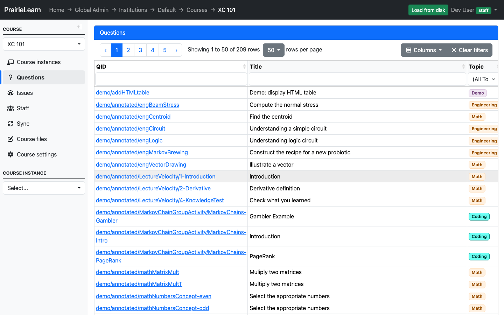

    To copy one into your course:

    1. Open [XC 101](https://us.prairielearn.com/pl/course/108/) and find a question (the **Course instance → SectionA** has assessments that group questions by topic, e.g. "Question gallery for PL elements").
    2. Open the question's **Preview** tab and click **Copy question** in the top-right.
    3. Pick your course as the destination and submit.

    You're now editing a copy inside your own course. Rename the QID and tweak as needed.

## 6. Create your first assessment

Switch to your course instance (sidebar → **Course instance**) and click **Assessments**.

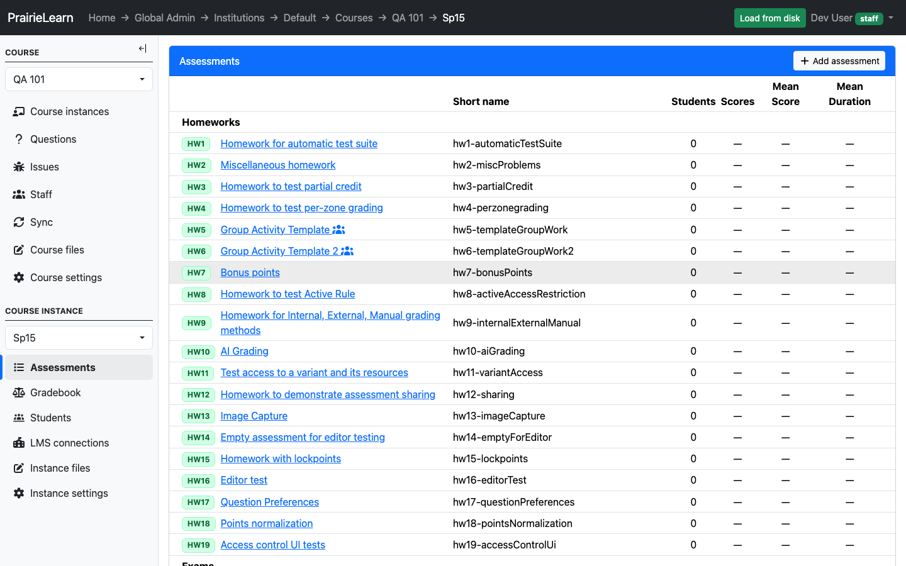

Click **Add assessment**.

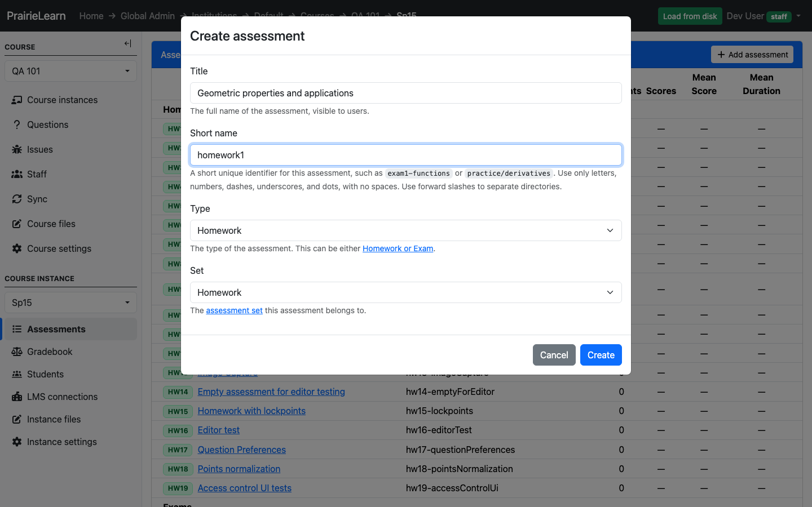

Fill in:

- **Title** — student-visible (e.g., `Geometric properties and applications`).
- **Short name** — directory identifier (e.g., `homework1`).
- **Type** — **Homework** for formative practice with unlimited retries; **Exam** for graded assessments with limited attempts. ([Detailed comparison.](assessment/configuration.md#assessment-types))
- **Set** — pick from `Homework`, `Quiz`, `Exam`, etc. The set is purely organizational; it doesn't change behavior.

Click **Create**. You land on the assessment with empty zones.

## 7. Add questions to the assessment

Go to the assessment's **Questions** tab and click **Edit**. Click **Add question** at the bottom of the zone, search for `rectangle-area`, and pick the matching result.

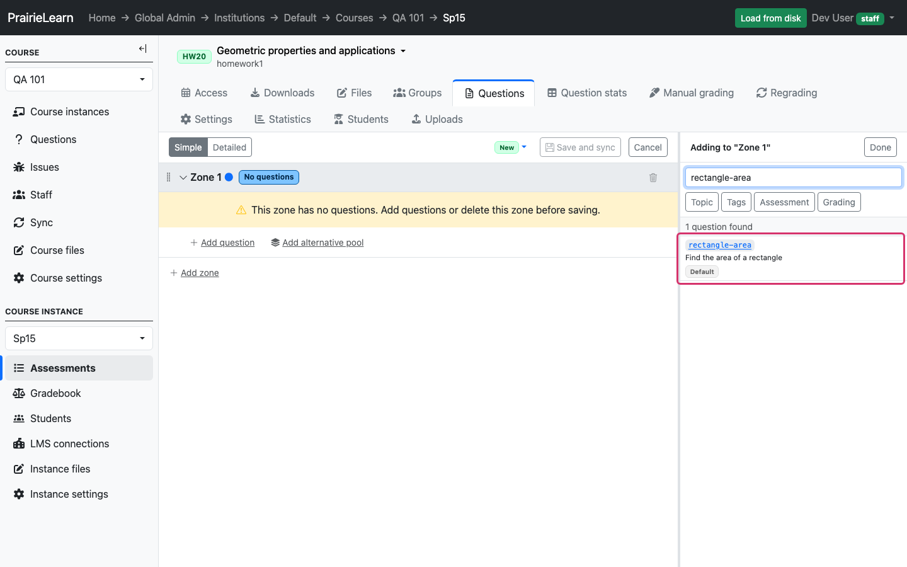

After clicking the result, the question is added to the zone:

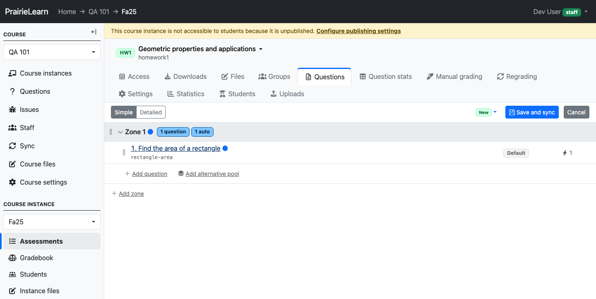

Set the point value if you want, then click **Save and sync**.

## 8. Configure access rules

Open the **Files** tab and edit `infoAssessment.json`. Add an `allowAccess` block:

```json title="infoAssessment.json"
{
  "allowAccess": [
    {
      "startDate": "2025-09-01T20:00:00",
      "endDate": "2025-09-06T20:00:00",
      "credit": 100
    }
  ]
}
```

Click **Save and sync**. The **Access** tab summarizes the rules:

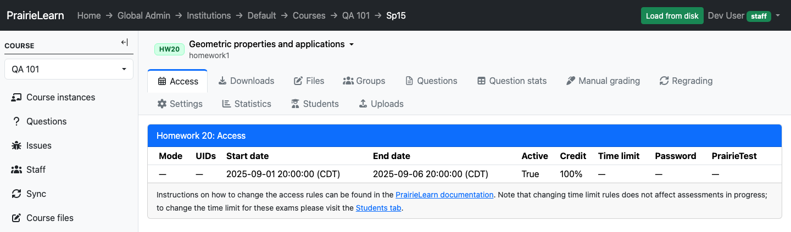

For late credit, time limits, per-student exceptions, exam mode, and PrairieTest integration, see [Access control](assessment/accessControl.md).

## 9. Preview as a student

Before sharing anything with students, dry-run the assessment yourself. Open the **Dev User** menu (top right) and pick **Student view without access restrictions**.


You see exactly what a student sees, plus a yellow **Regenerate your assessment instance** banner only staff can see:

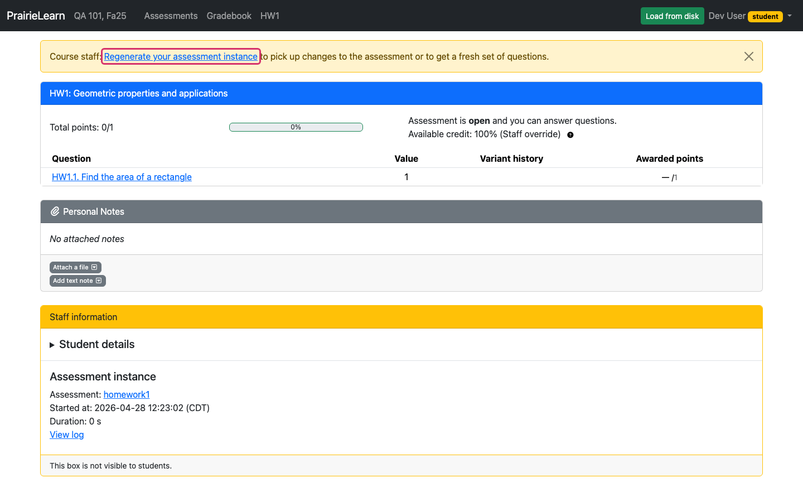

!!! warning "Regenerate after editing"

    Whenever you change an assessment's questions, points, or zones, your existing dry-run instance is **stale** — it was built from the old configuration. Click **Regenerate your assessment instance** to discard it and pick up your edits. Students don't have this option — if a real student needs a fresh instance after you've made changes, staff must regenerate it for them.

Click into a question to see how it renders for a student:

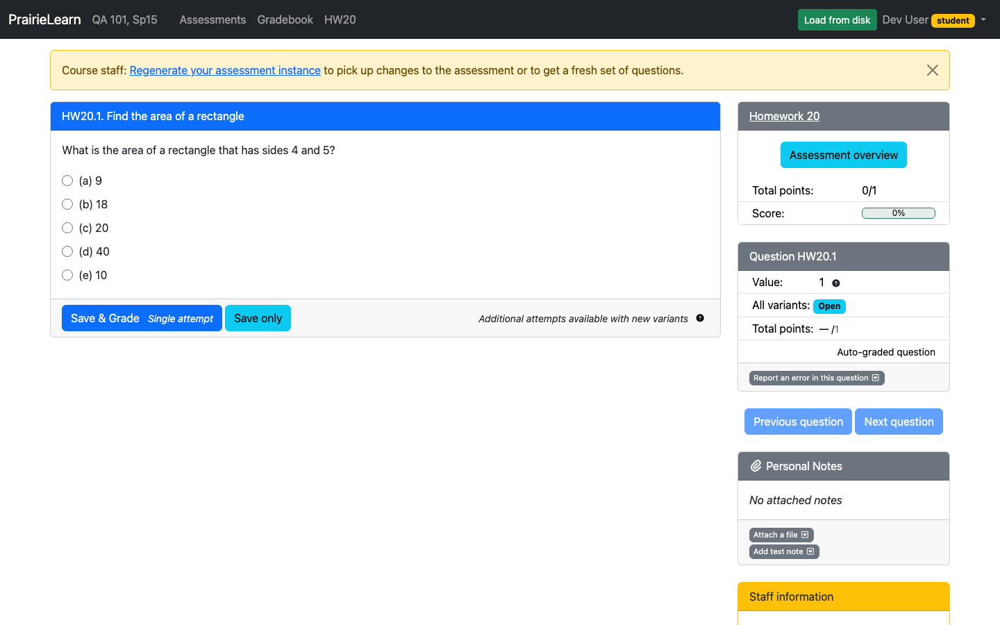

Switch back to staff view from the same dropdown when you're done.

## 10. Publish and enroll students

Go to **Instance settings → Publishing**.

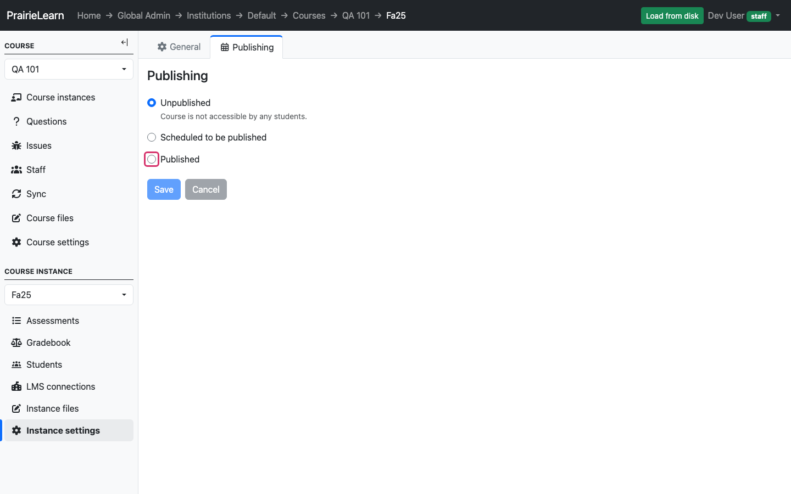

Pick **Published** to make the course instance available to students, and then hit **Save**. You can read more about publishing in the [course instance documentation](courseInstance/index.md#publishing-controls).

To get students in, you can share the enrollment link from **Instance settings → Self-enrollment**. Students click the link and enroll themselves. See [enrollment controls](courseInstance/index.md#enrollment-controls) for codes, institution restrictions, and disabling self-enrollment after a deadline.

## Next steps

You now have a working course instance with a published assessment :partying_face:. From here, head to the [instructor guide](instructor-guide/index.md) for reference material on every PrairieLearn feature.
