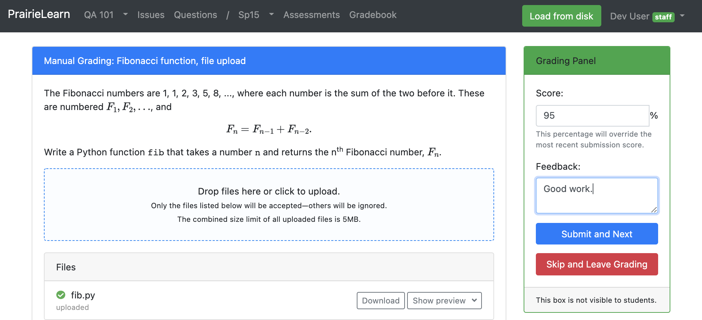
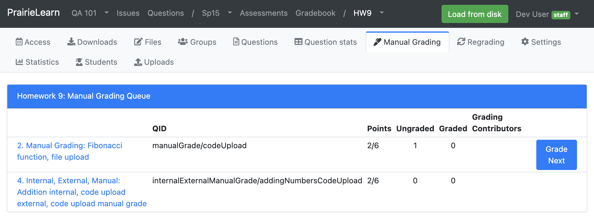
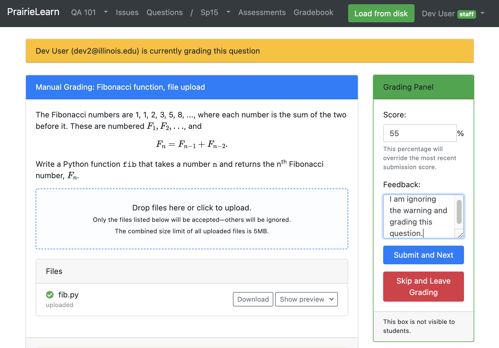

# Manual Grading

Prairie Learn supports two manual grading features: an interactive UI and a CSV grade upload feature.

The manual grading feature allows an instructor or TA to submit a grade after a student has made a submission on a question. This question must be configured for manual grading. Once a question is configured for manual grading, students will only be able to make a submission with the "Save" button on the question view. Answers are saved, but no automatic grading occurs.

To view the validation rules for the "Save" button, view the `def parse()` function within the element python file. For example, if a question uses the `pl-string-input` element in a question for manual grading, when a student presses "Save", the `pl-string-input` `def parse()` [here](https://github.com/PrairieLearn/PrairieLearn/blob/master/elements/pl-string-input/pl-string-input.py#L176-L198). Therefore, the "Save" button ensures that (1.) an answer is submitted and that (2.) the submission is a valid string. All "Save" button logic validation logic differs on the basis of the element python file.

It is recommended to also mark manually-graded questions as `"singleVariant": true`, even on Homework assessments, so that students are only given a single random variant.

## Configuring a Question for Manual Grading

Both, the interactive UI and legacy CSV upload, manual grading features can be configured by adding the "Manual" grading method to a question configuration:

```json
{
    "uuid": "cbf5cbf2-6458-4f13-a418-aa4d2b1093ff",
    "gradingMethod": "Manual",
    "singleVariant": true,
    ...
}
```

## Configuration Permissions for Manual Grading Users

Manual grading users must have "Student data access" viewer permissions to be able to manually grade a submission. A course "Editor" or "Owner" will have to add the manual grading users, with the appropriate permissions, in the 'Staff' area of the course configuration page.

## Manual Grading (UI Interactive)

The manual grading view re-uses the student question view that displays student submissions with their grading results. The manaul grading view also adds a grading panel to make submitting the grade `score` and `feedback` easy. The score and feedback is added to the latest submission displayed on the manual grading view. The feedback must be a valid string and the score must be a number divisible by 5 and out of 100 percent.



To list questions and begin grading, one must have student data viewer privileges in a course. Navigate to the course and click on the assessment to display a list of questions. The navigation bar header will include a "Manual Grading" button.

Clicking on the "Manual Grading" button will navigate to a page that lists all questions with a "Manual" type grading method. This is the "Manual Grading Queue". Each ungraded student submission will count as one ungraded question. Students can save multiple submissions on a question, but only the last ungraded submission is queried to determine if a question has been manually graded. Hence, if a student saves another submission after an item has been manually graded, the "Ungraded" category increments by plus one. An instructor has the option of manually grading this question again, in which case the score is overwritten.



It is, therefore, recommended that an instructor or TA only submits manual grades after an assessment has closed. The choice to leave an assessment open and allow the student to make new submissions after manual grading, ultimately, is up to the discretition of the instructor.

A manual grade should be calculated by the instructor and is incompatible with an array of `points` and/or `maxPoints` feature on the question configuration, as it would require manual grading the same question many times and submitting the percentage for the current score increase. It is currently possible to configure both, but this ability will be removed in the near future. This is a breaking change.

### Grade Next Button

The "Manual Grading Queue" view lists all questions on an assessment that are configured with the "Manual" grading method type. The number of "Ungraded" and "Graded" instance questions are listed beside the question. Each instance question maps to a unique student with the particular student submissions.

The "Grade Next" button appears on questions in the queue that have ungraded items. Clicking on the "Grade Next" button will load the next ungraded instance question in random order.

### Manual Grading Conflicts

A manual grading conflict occurs when multiple manual grading users click "Grade Next" and land on the same instance question. The first user selects the next student question for grading. Subsequent users who land on the same student question page will see a warning displayed that reveals that the question is being graded by the first user.



If the first user submits a manual grade and any subsequent user submits a grade, then the subsequent user will be navigated to a new view that displays both manual grading submissions and asks the user to resolve the manual grading conflict. The first user lands on a conflict page is the users both submit in the opposite order. The "Current Grade" is the grade of latter manual grade submission and the "Incoming Grade" is the former.


In the scenario that any subsequent user does not resolve the conflict, the instance question will still count as an ungraded instance question in the "Manual Grading Queue". Therefore, the "Grade Next" button will eventually lead a manual grading user to the view to resolve the manual grading conflict.

## Manual Grading Legacy (CSV Upload)

Prairie Learn supports manual grading of questions by downloading a CSV file with student answers and uploading a CSV file with question scores and optional per-question feedback. There is now an online web interface for streamlining manual grading.

Any [elements](elements/) can be used in the [`question.html`](question.md#question-questionhtml) to write manually graded questions. All of the student input will be saved and available for manual grading, including `pl-string-input`, `pl-file-editor`, `pl-file-upload`, etc.

### Downloading Student Answers

After students have completed the assessment, download the submitted answers by going to the assessment page, then the "Downloads" tab, and selecting the `<assessment>_submissions_for_manual_grading.csv` file. This looks like:
```csv
uid,uin,username,name,role,qid,old_score_perc,old_feedback,submission_id,params,true_answer,submitted_answer,old_partial_scores,partial_scores,score_perc,feedback
mwest@illinois.edu,1,,,,explainMax,0,,42983,{},{},{"ans": "returns the maximum value in the array"},,,,
zilles@illinois.edu,2,,,,explainMax,0,,42984,{},{},{"ans": "gives the set of largest values in the object"},,,,
zilles@illinois.edu,2,,,,describeFibonacci,100,,42987,{},{},{"ans": "calculates the n-th Fibonacci number"},,,,
```

This CSV file has three blank columns at the end, ready for the percentage score (0 to 100) and optional feedback and partial scores. The `submission_id` is an internal identifier that PrairieLearn uses to determine exactly which submitted answer is being graded. The `params` and `true_answer` columns show the question data. The `old_score_perc` column shows the score that the student currently has, which is convenient for re-grading or doing optional manual grading after an autograder has already done a first pass. If feedback was already provided in a previous upload, the `old_feedback` column will contain the feedback the student currently has.

If the students uploaded files then you should also download `<assessment>_files_for_manual_grading.zip` from the "Downloads" tab. The scores and feedback should still be entered into the CSV file.

### Uploading Scores and Feedback

After editing the percentage score and/or feedback for each submitted answer, upload the CSV file by going to the assessment page, then the "Uploads" tab, and selecting "Upload new question scores". If you leave either `score_perc` or `feedback` (or both) blank for any student, then the corresponding entry will not be updated.

Each question will have its score and/or feedback updated and the total assessment score will be recalculated. All updates are done with `credit` of 100%, so students get exactly the scores as uploaded.

If you prefer to use points rather than a percentage score, rename the `score_perc` column in the CSV file to `points`.

You also have the option to set partial scores. These can be based on individual elements of the question (typically based on the `answers-name` attribute of the element), or any other setting you wish to use. Partial scores must be represented using a JSON object, with keys corresponding to individual elements. Each element key should be mapped to an object, and should ideally contain values for `score` (with a value between 0 and 1) and `weight` (which defaults to 1 if not present). For example, to assign grades to a question with elements `answer1` and `answer2`, use:

```json
{"answer1": {"score": 0.7, "weight": 2, "feedback": "Almost there!"}, "answer2": {"score": 1, "weight": 1, "feedback": "Great job!"}}
```

If the `partial_scores` column contains a valid value, and there is no value in `score_perc` or `points`, the score will be computed based on the weighted average of the partial scores. For example, the score above will be computed as 80% (the weighted average between 70% with weight 2, and 100% with weight 1).

*WARNING*: note that some elements such as drawings or matrix elements may rely on elaborate partial score values with specific structures and objects. When updating partial scores, make sure you follow the same structure as the original partial scores to avoid any problems. Changing these values could lead to errors on rendering the question pages for these elements.

## Displaying Manual Grading Feedback

To show manual feedback the `question.html` file should contain an element to display the feedback next to student submissions. A basic template for this is:
```html
<pl-submission-panel>
  {{#feedback.manual}}
  <p>Feedback from course staff:</p>
  <markdown>{{{feedback.manual}}}</markdown>
  {{/feedback.manual}}
</pl-submission-panel>
```

This example template formats the feedback as Markdown.

## Workspaces

To include files copied out of the workspace into the `<assessment>_files_for_manual_grading.zip`, in the [`info.json` file](workspaces/index.md#infojson) specify a file list using `"gradedFiles"`

```json
"workspaceOptions": {
        "gradedFiles": [
            "starter_code.h",
            "starter_code.c"
        ],
        ...
}
...
```
