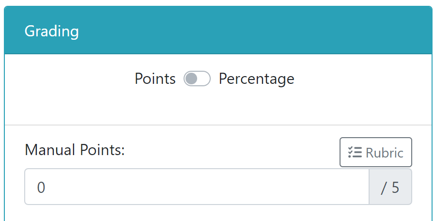
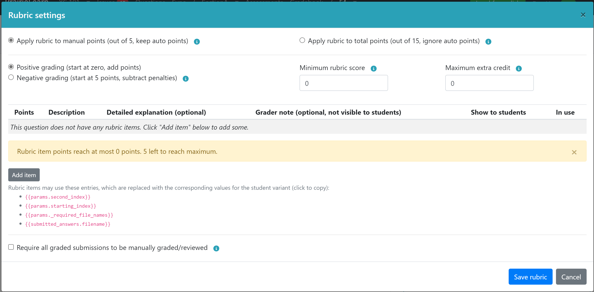
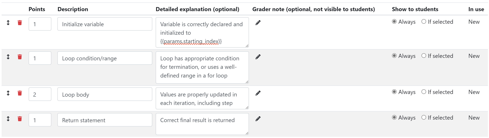
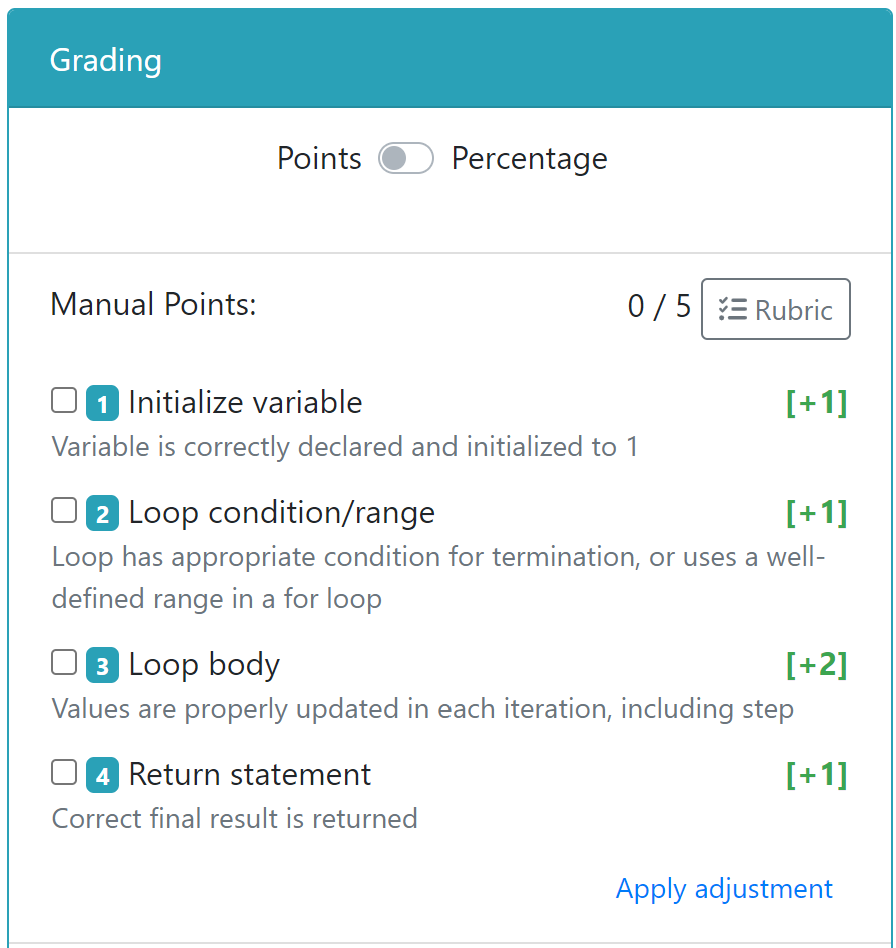

# Manual Grading

Some questions may require manual grading, either fully (e.g., freeform essay-type questions) or partially (e.g., coding style, or "show your work" components). PrairieLearn currently supports two methods of manual grading:

- Course staff may download a CSV file with student answers, perform any grading tasks offline, and upload a CSV file with question scores and optional per-question feedback.
- An online web interface is available for grading individual instance questions.

## Configuring a question for manual grading

For questions that require manual grading, the question can be set up for manual grading by using `manualPoints` in the [assessment configuration](../assessment.md#question-specification), like this:

```json
{
    "questions": [
        {"id": "manualGradingOnly", "manualPoints": 2},
        {"id": "combinedManualAndAutoGrading", "autoPoints": 2, "manualPoints": 6}
    ]
    ...
}
```

Questions set to use only manual grading (i.e., with manual points but no auto points) allow students to "Save" answers, but they don't have a "Save & Grade" button. Instead, the student just saves answers as many times as they want, and all of their submitted answers are stored.

It is recommended to also mark manually-graded questions as `"singleVariant": true` so that students are only given a single random variant, even on Homework assessments. By default, manual grading is performed only for the last submission of the last variant, so having a single variant simplifies both the grading process and the student feedback. The `singleVariant` setting can be updated in the [`info.json` file](../question.md#question-infojson) in the question, like this:

```json
{
    "uuid": "cbf5cbf2-6458-4f13-a418-aa4d2b1093ff",
    "singleVariant": true,
    ...
}
```

Any [elements](../elements.md) can be used in the [`question.html`](../question.md#question-questionhtml) to write manually graded questions. All of the student input will be saved and available for manual grading, including `pl-string-input`, `pl-file-editor`, `pl-file-upload`, `pl-rich-text-editor`, etc.

## Manual grading using file uploads

### Downloading the students' submitted answers

After students have completed the assessment, download the submitted answers by going to the assessment page, then the "Downloads" tab, and selecting the `<assessment>_submissions_for_manual_grading.csv` file. This looks like:

```csv
uid,uin,qid,old_score_perc,old_feedback,old_auto_points,old_manual_points,submission_id,params,true_answer,submitted_answer,old_partial_scores,partial_scores,score_perc,feedback
mwest@illinois.edu,1,explainMax,0,,0,0,42983,{},{},{"ans": "returns the maximum value in the array"},,,,
zilles@illinois.edu,2,explainMax,0,,0,0,42984,{},{},{"ans": "gives the set of largest values in the object"},,,,
zilles@illinois.edu,2,describeFibonacci,100,,10,0,42987,{},{},{"ans": "calculates the n-th Fibonacci number"},,,,
```

This CSV file has three blank columns at the end, ready for the percentage score (0 to 100) and optional feedback and partial scores. The `submission_id` is an internal identifier that PrairieLearn uses to determine exactly which submitted answer is being graded. The `params` and `true_answer` columns show the question data. The `old_score_perc` column shows the score that the student currently has, while `old_auto_points` and `old_manual_points` show the auto-graded and manually graded points already submitted. If feedback was already provided in a previous upload, the `old_feedback` column will contain the feedback the student currently has.

If the students uploaded files then you may also download `<assessment>_files_for_manual_grading.zip` from the "Downloads" tab. The scores and feedback should still be entered into the CSV file.

The `<assessment>_files_for_manual_grading.zip` file contains all files uploaded by the student for grading. For workspace questions, list any files that you want to include in this download file in the `"gradedFiles"` list in the question's [`info.json` file](../workspaces/index.md#infojson):

```json
"workspaceOptions": {
        "gradedFiles": [
            "starter_code.h",
            "starter_code.c"
        ],
        ...
}
...
```

### Uploading the scores and feedback

After editing the percentage score and/or feedback for each submitted answer, upload the CSV file by going to the assessment page, then the "Uploads" tab, and selecting "Upload new question scores". If you leave either `score_perc` or `feedback` (or both) blank for any student, then the corresponding entry will not be updated.

Each question will have its score and/or feedback updated and the total assessment score will be recalculated. All updates are done with `credit` of 100%, so students get exactly the scores as uploaded.

If you prefer to use points rather than a percentage score, rename the `score_perc` column in the CSV file to `points`. Note that either of these options updates the question's points so that the full score of the question reflects the value of the column. For questions with separate auto and manual points, you may replace this column with columns named `manual_score_perc`, `auto_score_perc`, `manual_points`, and/or `auto_points`.

If a `feedback` column is provided, it will be shown by default to the student above the submission panel, as seen in the image below. The feedback can use Markdown formatting.


You also have the option to set partial scores. These can be based on individual elements of the question (typically based on the `answers-name` attribute of the element), or any other setting you wish to use. Partial scores must be represented using a JSON object, with keys corresponding to individual elements. Each element key should be mapped to an object, and should ideally contain values for `score` (with a value between 0 and 1) and `weight` (which defaults to 1 if not present). For example, to assign grades to a question with elements `answer1` and `answer2`, use:

```json
{
  "answer1": { "score": 0.7, "weight": 2, "feedback": "Almost there!" },
  "answer2": { "score": 1, "weight": 1, "feedback": "Great job!" }
}
```

If the `partial_scores` column contains a valid value, and there is no value in `auto_score_perc` or `auto_points`, the auto-grading points will be computed based on the weighted average of the partial scores. For example, the score above will be computed as 80% (the weighted average between 70% with weight 2, and 100% with weight 1).

_WARNING_: note that some elements such as drawings or matrix elements may rely on elaborate partial score values with specific structures and objects. When updating partial scores, make sure you follow the same structure as the original partial scores to avoid any problems. Changing these values could lead to errors on rendering the question pages for these elements. You may find the original partial score structure in the `old_partial_scores` column.

## Manual grading using the Web user interface

The user interface for manual grading is built to encourage a workflow where all submissions for each individual question are graded together, instead of grading one full assessment instance at a time. This allows graders to focus on the specific issues associated to one question at a time, and provide more consistent grading across all assessments. Individual student submissions are tagged for manual grading if they have manual points assigned to them, or can be manually tagged by course staff. Once a submission is graded, the interface advances to the next submission for the same question.

After students have completed their assessments, open the "Manual Grading" tab. This page will list all questions in this assessment, as well as the number of submissions that require grading. For questions that have at least one submission tagged for grading, the "Grade next submission" button will be shown, which will jump directly to one of the submissions that need to be graded. Alternatively, clicking on the question's title will open a list of all student answers for that question.

The list of student submissions for a question gives course staff the ability to tag individual student answers (or all answers for the question) to specific graders. This can be done by selecting the submissions to be tagged, then selecting the "Tag for grading" button and choosing the grader responsible for those submissions. Only staff members with [Editor permission for the course instance](../course.md#student-data-access-roles) are listed for tagging.

In the grading page for individual submissions, the grader can assign a specific set of manual points to the question, and provide feedback as needed (Markdown formatting is allowed). For questions with auto points, it is also possible to override the auto-grading points assigned to the question. Graders also have the option to use a percentage score instead of points. Once these values are set, the grader can select "Submit", which will update the score and open the next question to be graded.

In some situations a grader may not feel confident to grade a particular submission. In such scenarios, the grader may Skip the question, or use the dropdown of the same button to assign this question to be reviewed by another grader (e.g., an instructor or lead TA).

By default, the grading page will show the question, correct answer and submissions with the same content as a student would see it. However, for questions with long descriptions, it is possible to hide some of this information by using the [`pl-hide-in-manual-grading` element](../elements.md#pl-hide-in-manual-grading-element). This allows the grader to focus on important parts of the question or answer. It is also possible to add information to the question, such as staff-only solutions or grading comments, using the [`pl-manual-grading-only` element](../elements.md#pl-manual-grading-only-element). Any information within this element will be shown to graders, but not to students.

### Setting a rubric for manual grading

An instructor may set a structured rubric to be used in the manual grading process. The rubric allows graders to select among a set of predetermined items with associated points and feedback, and provides a mechanism to facilitate consistency in grading results.

A rubric is composed of a set of rubric items. Each item is assigned a set of points, either positive (representing a credit), negative (representing a penalty) or zero (representing feedback that does not affect the score). A grader can then select which items of the rubric apply to a particular submission among the list. The submission's score is then based on the sum of all the points for all items selected for the submission.

To set a rubric, open an individual question instance. On the grading panel, click on the "Rubric" button to open rubric settings.





For questions that include an auto grading component (with or without a combination of manual points), the rubric may be applied only to manual points or to total points.

- If it is set to manual points, the score obtained by the rubric grading is added to the points from the auto grader to result in the final score. This type of grading is often used for questions where the manual grading complements the auto grading, such as in grading rationales for specific calculations, or for code style in programming questions.
- If the rubric is set to total points, the auto grader component is ignored, and the rubric grading overrides the final score of the question as a whole. This setting is used when the auto grading method is unable to capture all possible correct answers, and manual grading is used to review cases that were not properly graded.

Instructors may specify a rubric to use positive or negative grading. In positive grading, submissions start at zero, and individual rubric items correspond to requirements to be added to the score. In negative grading, submissions start at the maximum score, and individual rubric items correspond to penalties subtracted from the score. Either option allows the creation of items with no points, which provide feedback that does not affect score. Additionally, rubric items may be set to a combination of positive and negative items, at the discretion of the grader.

By default, the score produced by the rubric items is capped at the maximum points associated to the question, and penalties do not cause the points to get below zero. This limit can optionally be extended by assigning a minimum rubric score (typically to allow negative scores) and maximum extra credit to the rubric (to allow points above the maximum).

Each rubric item is set a number of points and a description. This description is shown to both graders and in feedback to students. It is also possible to add an additional detailed explanation to the rubric item, which is shown to students upon request. Finally, a grader note can be set that is visible to graders, but not to students, and can be used to provide instructions on scenarios when the rubric should be used or not.

Items can also be set to always be listed for students (default), or only if it is is selected. This option may be used in cases such as penalties that apply to a small subset of students, or for credit assigned to unconventional correct answers that are not to be advertised to students that did not use them.

In the description, explanation, and grader note, it is possible to use mustache patterns based on the parameters, correct answers and submitted answers for a submission. This will cause the description of the item provided to graders and students to match the question variant assigned to the student, as shown in the screenshot below.



This will result in a grading panel containing a description with the value of the parameter replaced with the appropriate value for the student's variant.



Student's feedback is also replaced in a similar manner.


As grading progresses, new scenarios may be found by graders that require changes in the rubric, such as new types of penalties or credits or specific kinds of feedback. The rubric may be changed as required, even after grading is already underway. These changes may affect existing submissions:

- Adding new rubric items does not affect the score of existing submissions;
- Changing the points assigned to individual rubric items will cause any existing submission gradings that use the rubric item to be recalculated with the new points assigned to the items;
- Changing the description or explanation of individual rubric items will update the feedback provided to students, but not the score;
- Deleting rubric items will cause existing gradings that use the rubric item to be recalculated without the item;
- Changing the minimum score or maximum extra credit will cause all existing rubric gradings to be recalculated.

When updating rubric settings, a flag at the bottom of the settings dialog box gives graders the option of tagging all submissions for manual grading. This option may be used in cases where the changes are significant enough that they warrant a review of all previously graded questions to ensure they take the new rubric into account. This is encouraged in cases where rubric items applied to multiple rubric gradings are deleted.

To grade a submission, a grader must select the items that apply to a particular submission and press Submit. Additionally, each rubric item (or the first 10 items, in long rubrics) is assigned a keyboard shortcut corresponding to a digit; pressing that digit on the keyboard causes that item to be selected (or cleared, if it is selected).

Graders have the flexibility to apply a grading adjustment (positive or negative) on top of the rubric item. This may be used where instructors need to make judgement calls for unconventional submissions that don't apply to specific rubric items. This option is discouraged in cases where the issue is found in multiple submissions, as additional rubric items provide more flexibility in providing feedback and adjusting grades.
