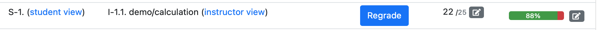
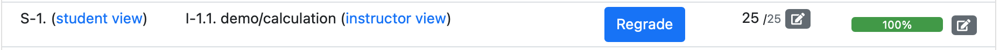

# Regrading broken questions

Despite all our best efforts, sometimes we put a broken question onto an exam. The recommended procedure for dealing with this situation is:

- If the error is detected when just a small number of students have taken the exam, either correct the question, remove it from the exam, or replace it with a new question. The current options to regrade a broken questions are:

	1. Give the maximum points to all the students that receive the broken question.

	2. Adjust the scores of affected students by hand, perhaps with some correction factor for the added challenge they faced by encountering a broken question.

- If many students have taken the exam with the broken question then do not attempt to fix it but rather let the exam complete with all students experiencing the same issue. Then afterwards regrade the exam with all students being awarded maximum points for the broken question, as described below.


## 1. Regrading a broken question for a given student

If you find a bug in `server.py`, you can fix the question by writing your own grade function. The procedure to regrade a question is illustrated using the example question `demo/calculation`, which has the following  `server.py` code:

```python
import random, copy
def generate(data):
    # Sample two random integers between 5 and 10 (inclusive)
    a = random.randint(5, 10)
    b = random.randint(5, 10)
    # Put these two integers into data['params']
    data['params']['a'] = a
    data['params']['b'] = b
    # Compute the sum of these two integers
    c = a + b
    # Put the sum into data['correct_answers']
    data['correct_answers']['c'] = c
```

Suppose this question had a typo, and the last line was instead written as:
```python
data['correct_answers']['c'] = a
```

When solving this question, a student that submits the answer correctly (the result of `a+b`) will get the question marked as incorrect.

In `Homework` mode, all you need to do is to update the `correct_answers` in the `generate` function, and next time a student generates another instance of the question (click "Try question again"), the question will be graded correctly.

In `Exam` mode (or `Homework` with `singleVariant="true"`) students will not get another instance of the question, and hence the function `generate` will not be called again. In this case, we will need to fix the question by adding a custom grade function to the `server.py` file:

```python
import math
def grade(data):
    c = data['params']['a'] + data['params']['b']
    if data['submitted_answers']['c'] is not None:
        if math.isclose(data['submitted_answers']['c'], c, rel_tol=1e-3, abs_tol=1e-6):
            data['partial_scores']['c'] = {'score': 1, 'weight': 1}
            data['score'] = 1
```

The next time a student submits another attempt of the correct answer (`a+b`), the question will be marked as correct. In `Homework` mode this may be sufficient, since students are not penalized for multiple submissions. In `Exam` mode, this additional attempt may have reduced credit, or the student may have reached the maximum number of attempts. To adjust the score, the instructor can use the `Regrade` functionality from the student assessment instance page. In the example below, the student eventually received 22/25 for the question, but they actually entered the  correct answer in the first attempt.



Upon clicking the `Regrade` button, the custom grading function is called again for all the submitted attempts, adjusting the score for this student.



## 2. Regrading an assessment

The procedure to regrade an assessment is:

1. First update the `infoAssessment.json` file with `"forceMaxPoints": true` as described below, and sync this to the live PrairieLearn server.

1. Go to the instructor page for the assessment and click the "Regrade all assessment instances" button at the top of the "Assessment instances" box, or use the "Action" menu to regrade a single assessment instance for just one student.

**The `forceMaxPoints` setting only affects assessment instances that are explicitly regraded.** Students who take the exam later are not affected by `forceMaxPoints` in any way.

Regrading an assessment instance while the student is still working on it will not have any negative effects, but it may be confusing to the student if they see their points suddenly change during an exam, for example.


## Setting `forceMaxPoints` for a question

To award some or all students maximum points for a question during a regrade, edit the [`infoAssessment.json`] file and set `"forceMaxPoints": true` for any broken questions. For example:

```json
"zones": [
    {
        "title": "Easy questions",
        "questions": [
            {"id": "anEasyQ", "points": [10, 5, 3, 1, 0.5, 0.25], "forceMaxPoints": true},
            {"id": "aSlightlyHarderQ", "points": [10, 9, 7, 5]}
        ]
    },
    {
        "title": "Hard questions",
        "questions": [
            {"id": "hardQV1", "points": 10},
            {"id": "reallyHardQ", "points": [10, 10, 10]},
            {
                "numberChoose": 1,
                "points": 10,
                "alternatives": [
                    {"id": "FirstAltQ"},
                    {"id": "SecondAltQ", "forceMaxPoints": true}
                ]
            }
        ]
    }
],
```

In the example above the questions `anEasyQ` and `SecondAltQ` will award maximum points to any student who has these questions and is regraded.


## Handling questions with alternatives

For questions that all students get on their assessment the above system is straightforward. For questions with alternatives it is less clear. For example, consider the case when `SecondAltQ` is broken in the assessment above. In the above example we only awarded maxinum points to those students who received `SecondAltQ`, while students with `FirstAltQ` did not receive automatic maximum points. However, it is probably a better idea to give maximum points to all students irrespective of which alternative they received, as follows:

```json
            {
                "numberChoose": 1,
                "points": 10,
                "forceMaxPoints": true,
                "alternatives": [
                    {"id": "FirstAltQ"},
                    {"id": "SecondAltQ"}
                ]
            }
```

For fairness, it is generally it is preferred to take the approach immediately above and award maximum points to all students, no matter which alternative question appeared on their particular assessment instance.


## Regrading a question
